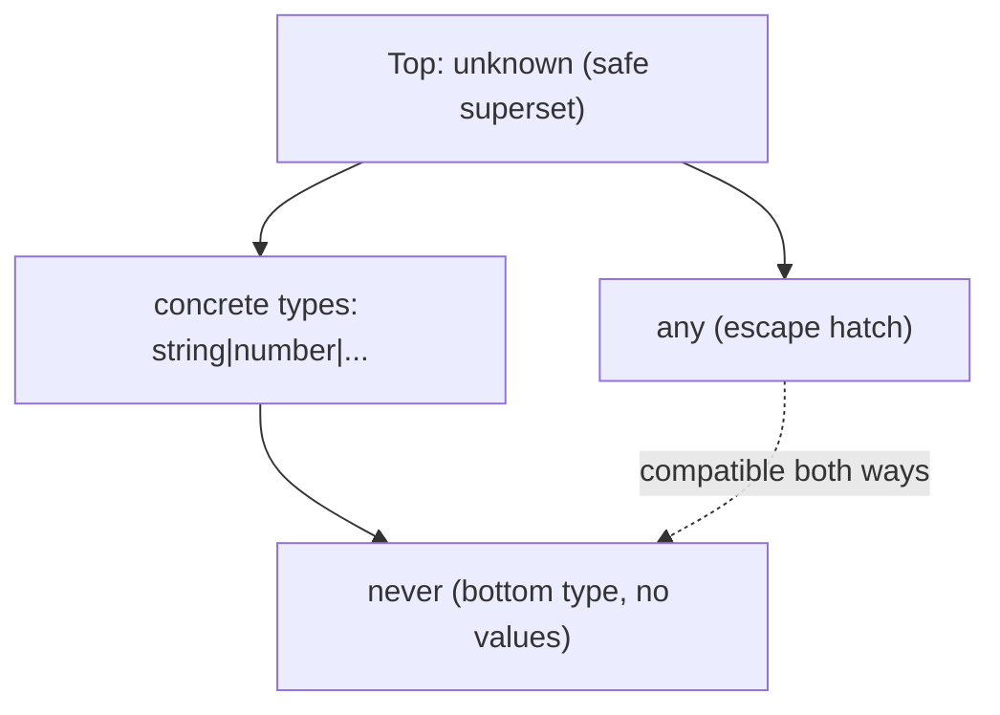
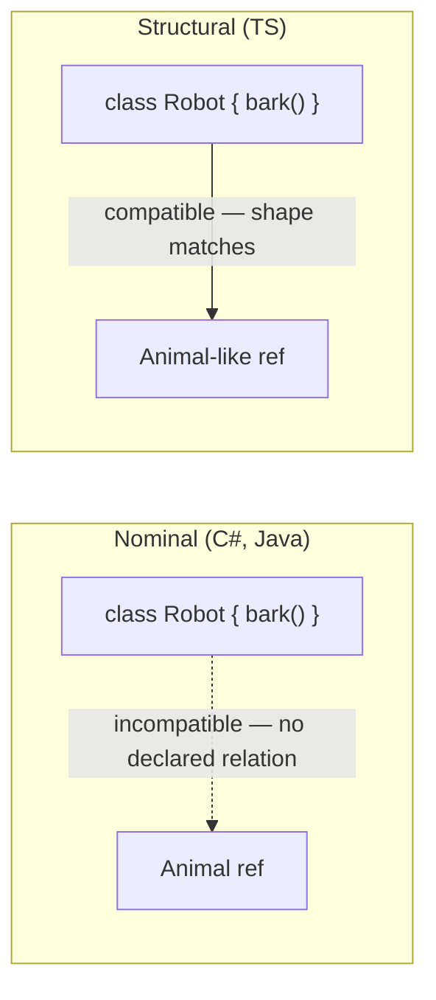

# TypeScript Interview Revision Notes (Senior / Lead Level)

> Yeh quick-revision notes hain, "TypeScript Interview Guide" se derive kiye gaye — guide ki har section/topic isi order mein cover ki gayi hai, concise Q/A + bullets + essential code/tables/diagrams ke saath. Brush-up ke liye akele kaafi hain.

---

## Core Concepts

### TypeScript Kya Hai Aur Kyun Use Karein

**Q: TypeScript kya hai?**
A: JavaScript ka strongly, statically typed **superset** (Microsoft), jo plain JS mein compile/transpile hota hai. JS semantics ke upar ek **structural** type system add karta hai — types compile time par **erase** ho jaate hain, runtime behavior change nahi hota.

**Q: Advantages (with "why")?**
- **Static typing** → galat property names, argument shapes, null misuse — bugs ki poori class compile time par catch.
- **OOP features** → classes, interfaces, generics, access modifiers (par typing structural hai, nominal nahi).
- **Scalability** → 500-file Angular app ke refactors mechanically safe (compiler har break flag karta hai).
- **DX** → IntelliSense, go-to-definition, safe auto-refactors.
- **Self-documenting APIs** → signature hi contract bata deta hai.

**Q: Senior nuance jo interviewer probe karte hain?**
A: TS type system kaafi jagah **design se unsound** hai (`any`, type assertions, bina `noUncheckedIndexedAccess` array index, bivariant method params) — JS compatibility ke liye pragmatic trade-off. Pata hona chahiye *kahan* unsound hai aur kaise tighten karein.

### Toolchain Basics

- Install: `npm install -g typescript`; version: `tsc -v`; compile: `tsc file.ts` → `file.js`.
- `tsconfig.json` central config hai.

```json
{ "compilerOptions": { "target": "ES6", "strict": true } }
```

**Real project tsconfig (production Angular/Node):**

```json
{
  "compilerOptions": {
    "target": "ES2022",
    "module": "ESNext",
    "moduleResolution": "Bundler",
    "lib": ["ES2022", "DOM"],
    "strict": true,
    "noUncheckedIndexedAccess": true,
    "exactOptionalPropertyTypes": true,
    "esModuleInterop": true,
    "skipLibCheck": true,
    "isolatedModules": true,
    "forceConsistentCasingInFileNames": true,
    "declaration": true,
    "sourceMap": true
  }
}
```

Senior expectation: har strict flag *kyun* matter karta hai wo pata ho, sirf `strict: true` exist karta hai itna nahi. Yeh ek **bahut common interview area hai** ("apna `tsconfig` explain karo") — neeche har option field-by-field, ek-line "kyun" ke saath:

### `compilerOptions` — Field-by-Field Breakdown 🎯

| Option | Kya karta hai | Ek-line "kyun" |
|---|---|---|
| `target: "ES2022"` | JS output kis version mein downlevel hoga | Modern browsers → chhota/faster output; native class fields etc. bina rewrite ke emit hoti hain |
| `module: "ESNext"` | Import/export kis format mein emit hongi | Native ESM syntax static/analyzable hai → tree-shaking enable karta hai (bundle size ke liye critical) |
| `moduleResolution: "Bundler"` | `import './x'` ko file kaise resolve karta hai | Modern esbuild/Vite behavior replicate karta hai; Node ke strict ESM extension rules force nahi karta |
| `lib: ["ES2022", "DOM"]` | Kaunse built-in type declarations included hain | `DOM` ke bina `document`/`window` compile error dete hain — Angular frontend ko dono chahiye |
| `strict: true` | Strict flags ka poora bundle on karta hai | Master switch — iske bina `noImplicitAny` jaisi cheezein silently pass ho jaati hain |
| `noUncheckedIndexedAccess` | Index access mein `\| undefined` add karta hai | `arr[0]` ka type ab `Vehicle \| undefined` hota hai, na ki jhooti-guarantee wala `Vehicle` — production `Cannot read property of undefined` crashes ka common source pकड़ता hai |
| `exactOptionalPropertyTypes` | "key absent" vs "key present with `undefined` value" distinguish karta hai | `{ region: undefined }` ab `{}` se different treat hota hai — precise API contracts ke liye |
| `esModuleInterop: true` | CommonJS packages ka clean default import allow karta hai | `import express from 'express'` chalta hai, `import * as express` ki jagah |
| `skipLibCheck: true` | `node_modules` ke `.d.ts` files ka type-check **skip** karta hai | Build time significantly kam; trade-off — purely third-party type-def errors catch nahi hote |
| `isolatedModules: true` | "poore program" ka knowledge chahne wale constructs forbid karta hai | esbuild/swc jaise single-file transpilers (Angular ka esbuild builder) ke liye required; e.g. type-only exports ko explicit `export type` chahiye |
| `forceConsistentCasingInFileNames` | File-name casing imports ke across enforce karta hai | Mac/Windows (case-insensitive) par locally chalta hai, Linux CI (case-sensitive) par build todta — isko locally hi catch karta hai |

```typescript
// noUncheckedIndexedAccess ka concrete before/after:
const vehicles: Vehicle[] = [];
const first = vehicles[0];
// false → first: Vehicle (galat! array khaali hai)
// true  → first: Vehicle | undefined (sahi)

// isolatedModules ka fix — type-only export explicitly mark karo:
type Vehicle = { vin: string };
export type { Vehicle };   // export { Vehicle } ambiguous hoga, error degi
```

(Poori `tsconfig.json` quick-reference table doc ke end mein hai, sab options ek jagah.)

### Primitive & Special Types

- **Primitives:** `string`, `number`, `boolean`, `null`, `undefined`, `bigint`, `symbol`.
- **Special:** `any` (checking off), `unknown` (`any` ka type-safe counterpart), `void` (return nahi karta), `never` (kabhi return nahi karta / value jo exist hi nahi kar sakti).

### any vs unknown vs never vs void

| Type | Meaning | Assign **to** others? | Assign **from** others? | Use |
|---|---|---|---|---|
| `any` | checker off | Haan, kisi bhi type mein | Haan, kisi se | Legacy interop, last resort |
| `unknown` | "prove before use" | Nahi (bina narrow/assert) | Haan, kisi se | External/untrusted input, `JSON.parse`, catch |
| `void` | no meaningful return | Sirf `void`/`any`/`undefined` (loosely) | N/A | Callback/fn return type |
| `never` | unreachable / no value | Har jagah (bottom type) | Kuch nahi except `never` | Exhaustiveness, always-throw/infinite-loop fns |



**Key gotcha:** `any` ek saath top aur bottom type dono hai (type theory todta hai) → dangerous. TS 3.0 ne `unknown` isliye introduce kiya.
**Q: `unknown` kyun jab `any` hai?** A: `unknown` kisi bhi operation se pehle **narrowing force** karta hai → soundness rehti hai, phir bhi I/O boundary par "abhi type nahi pata" allow karta hai.

### Type Inference vs Type Annotation

- Inference: `let message = "Hello";` → `string`. Annotation: `let age: number = 25;`.
- **Senior rule:** local variables ke liye **inference** (kam noise, same safety); **module boundaries** (fn params, exported return types, public members) par **explicit annotation** — warna boundary par implementation change silently type widen/narrow karke consumers ko bina signal ke break kar deti hai.

### Type Assertions

```typescript
let someValue: any = "Hello";
let strLength: number = (someValue as string).length;
```

- `as` = "trust me", **zero runtime validation**. `as unknown as T` (double assertion) assertion-compatibility check bhi sidestep karta hai — code-smell red flag.
- Runtime boundary (HTTP, `localStorage`, third-party) par assertions ke bajaye **type guards / validation libs** (`zod`, `io-ts`) use karo.

### Type Aliases vs Interfaces

| Feature | Interface | Type Alias |
|---|---|---|
| Extending | `extends`, multiple inheritance | Intersection (`&`) se |
| Declaration merging | Haan | Nahi |
| Object shapes | Haan | Haan |
| Unions/primitives/tuples | Nahi | Haan (`string \| number`) |
| Mapped/conditional | Nahi | Haan |
| Perf (large unions) | Generally faster check | Huge unions par slower ho sakta |

- **Correction:** "type aliases not extendable" misleading hai — `extends` keyword nahi hai, par intersection (`type C = A & B`) se compose ho jaate hain.
- **Practical:** `interface` → public object/class contracts jinhe extend/merge karna ho (Angular `@Input`, DTOs); `type` → unions, tuples, fn signatures, mapped/conditional utilities. Dono structurally compatible (interface type-alias ko extend kar sakta hai aur vice versa).

### Optional & Readonly Properties

```typescript
interface Employee { name: string; age?: number; }      // optional
interface Car { readonly model: string; }                // rebind nahi hoga
```

**Gotcha:** `readonly` **shallow** hai — property rebind rokta hai, nested object/array mutate hone se nahi. Deep chahiye → `Readonly<T>` / custom `DeepReadonly` / Immutable.js / immer.

### Function & Method Overloading

```typescript
function add(a: number, b: number): number;
function add(a: string, b: string): string;
function add(a: any, b: any) { return a + b; }
```

- TS overloads **purely compile-time** — neeche ek hi real JS function (implementation signature, callers ko invisible).
- **vs C#:** C# mein overloads genuinely distinct methods (runtime binder resolve karta hai); TS mein aap ek single impl ke *call-site shapes* describe karte ho, multiple methods nahi.

---

## Intermediate

### Functions: Regular vs Arrow, Default & Rest Params

| Feature | Regular | Arrow |
|---|---|---|
| `this` | Dynamic (caller) | Lexical (enclosing scope) |
| `arguments` | Available | Nahi |
| Class use | Overridable methods | Callbacks jinhe captured `this` chahiye |
| Hoisting | Declarations hoist | `const` arrow hoist nahi |
| `new`-able | Haan | Nahi |

```typescript
function greet(name: string = "Guest") { console.log(`Hello, ${name}`); }
function sum(...numbers: number[]) { return numbers.reduce((a, n) => a + n, 0); }
```

**Angular gotcha:** arrow-function class properties (`onClick = () => {}`) `this` correctly bind karte hain par **har instance par naya function** (memory/perf cost), aur `@HostListener`/decorator-based binding todte hain (unhe real prototype method chahiye).

### Union, Intersection & Literal Types

```typescript
let value: string | number;
type C = A & B;                                   // intersection
type Direction = "North" | "South" | "East" | "West";  // literal union
```

**Gotcha:** same key par conflicting types intersect karna (`{a: string} & {a: number}`) us property ko **`never`** mein collapse karta hai, error nahi deta.

### Tuples

```typescript
let person: [string, number] = ["Alice", 25];
let numbers: readonly [number, number] = [10, 20]; // numbers[0]=30 → error
```

**Labeled & variadic tuples:**

```typescript
type Point = [x: number, y: number];  // labels = pure docs, no runtime effect
type Concat<T extends unknown[], U extends unknown[]> = [...T, ...U];
type Result = Concat<[1, 2], [3, 4]>; // [1, 2, 3, 4]
```

### ReadonlyArray\<T\> / readonly T[] as Defensive API Design

**Q: Kaise communicate karein ki function pass kiya gaya array mutate nahi karega?**
A: `T[]` param kuch nahi batata — function silently caller ka array `sort()`/`push()` kar sakta hai (real bug class). Fix: **`readonly T[]` (= `ReadonlyArray<T>`)** accept karo.

```typescript
function printTotal(prices: readonly number[]): number {
  // prices.sort(...) / prices.push(5)  → compile error (mutating methods type se removed)
  return [...prices].sort((a, b) => a - b).reduce((s, p) => s + p, 0); // copy, then mutate
}
```

- `readonly T[]` aur `ReadonlyArray<T>` same type ke do spellings; sirf mutating methods (`push/pop/splice/sort/reverse/fill/copyWithin/arr[0]=x`) **omit** karta hai. Koi `Object.freeze` nahi — **compile-time-only contract**.
- Mutable `T[]` → `readonly T[]` assignable, par ulta nahi (exactly wo direction jo defensive param ko chahiye).

```typescript
const ro: readonly number[] = mutable;   // OK
// mutable = ro;                          // error
```

- **Senior signal:** intent signature mein document, compiler-enforced (comment ki jagah). `OnPush`/immutable-state ka complement — accidental in-place mutation reference-equality change detection defeat nahi karega.
- **Shallow** hai: `readonly Point[]` `arr.push`/`arr[0]=` rokta hai par `arr[0].x = 5` nahi (deep ke liye `ReadonlyArray<Readonly<Point>>`).
- `map/filter/slice/reduce` still callable (source mutate nahi karte).

### Enums, Aur Senior Devs Inhe Kyun Avoid Karte Hain

```typescript
enum Color { Red, Green, Blue }
```

**Problems:**
- Numeric enums arbitrary numbers ke against type-safe nahi — `let c: Color = 99` compile ho jaata hai.
- Real runtime JS object (reverse-mapping) emit karte hain → bundle size, jab tak `const enum` na ho — par `const enum` `isolatedModules` (esbuild/swc/Vite) mein **unsupported** aur ESM-only builds mein banned.
- Literal unions jitna cleanly tree-shake nahi hote.

**Modern replacement — literal union (+ optional `satisfies` map):**

```typescript
type Color = "red" | "green" | "blue";
const ColorValues = { Red: "red", Green: "green", Blue: "blue" }
  as const satisfies Record<string, Color>;
```

Deta hai: exhaustiveness, zero runtime cost, full type safety.

### Structural Typing vs Nominal Typing

**Q: "C#/Java se aa rahe ho" — difference?**
- **C#/Java nominal:** type identity **declared name** par; identical members wali classes bhi incompatible jab tak explicitly implement/extend na karein.
- **TS structural** (duck typing, compile-time): shapes match karti hain to compatible, naam kuch bhi ho.

```typescript
interface Point2D { x: number; y: number; }
class Vector { x = 0; y = 0; }
function log(p: Point2D) {}
log(new Vector());       // OK — same shape
log({ x: 1, y: 2 });     // OK
```



**Consequences:**
- **Excess property checks** sirf directly-assigned **object literals** par fire hoti hain: `log({x,y,z})` → error, par `const p={x,y,z}; log(p)` → OK (structural assignability, freshness check nahi).
- **private/protected** members ek nominal-ish check mein participate karte hain (different class declarations ke identically-named private members structurally incompatible) — pure structural se deliberate exception.
- **`unique symbol` / branded types** (`string & { __brand: "UserId" }`) nominal typing simulate karne ka idiomatic tareeka (e.g. `UserId` vs `OrderId` mixing rokna).

### Branded/Nominal Typing — Full Worked Example

**Problem:** `type UserId = string; type OrderId = string;` — structurally dono `string`, isliye `getUser(orderId)` bug silently compile ho jaata hai.

**Fix — branded type + constructor function:**

```typescript
type UserId = string & { readonly __brand: 'UserId' };
type OrderId = string & { readonly __brand: 'OrderId' };

function toUserId(raw: string): UserId {
  if (!raw) throw new Error('UserId cannot be empty');
  return raw as UserId;  // the ONE encapsulated assertion — yahan real validation
}

function getUser(id: UserId): void {}

getUser(toUserId('usr_123'));  // OK
getUser(toOrderId('ord_456')); // error: OrderId not assignable to UserId
getUser('usr_789');            // error — raw string UserId nahi
```

- **Kyun kaam karta:** phantom `__brand` property koi real string hold nahi karta → branded value banane ka *sirf* tareeka assertion, jise aap constructor function tak confine karte ho. Brand = "proof value validate/construct hui". `__brand` runtime par **erase** → zero cost.
- **Kyun matter:** primitive-obsession bugs prevent (`ProductId` vs `CustomerId`, dollars vs cents) compile time par, zero runtime cost. .NET bridge: TS structural hone ki wajah se branding chahiye; C# nominal types yeh free deta hai.
- **Variant:** collision-safe brand ke liye `unique symbol`:

```typescript
declare const userIdBrand: unique symbol;
type UserId = string & { readonly [userIdBrand]: void };
```

Robust par kam readable — dono acceptable senior answers.

### Type Narrowing & Type Guards

```typescript
function isString(value: any): value is string { return typeof value === "string"; }
```

**Full narrowing toolkit:**

| Mechanism | Example | Notes |
|---|---|---|
| `typeof` | `typeof x === "string"` | `null` distinguish nahi (`typeof null==="object"`) |
| `instanceof` | `x instanceof MyClass` | Sirf class instances |
| `in` | `"prop" in obj` | Key presence se union narrow |
| Truthiness | `if (x)` | `0`/`""`/`NaN` legit values careful |
| Equality | `if (x === "a")` | Literal unions narrow |
| Discriminant | `if (shape.kind === "circle")` | Discriminated unions |
| Type predicate | `x is Foo` | Custom runtime logic — sirf yehi |
| Assertion fn | `asserts x is string` | Call ke baad **poore enclosing scope** ke liye narrow |

```typescript
function assertIsDefined<T>(val: T): asserts val is NonNullable<T> {
  if (val == null) throw new Error("Expected value to be defined");
}
function process(input?: string) {
  assertIsDefined(input);
  console.log(input.toUpperCase()); // rest of fn ke liye narrowed
}
```

### Discriminated Unions & Exhaustiveness Checking

```typescript
interface Square { kind: "square"; size: number; }
interface Circle { kind: "circle"; radius: number; }
interface Triangle { kind: "triangle"; base: number; height: number; }
type Shape = Square | Circle | Triangle;

function area(shape: Shape): number {
  switch (shape.kind) {
    case "square":   return shape.size ** 2;
    case "circle":   return Math.PI * shape.radius ** 2;
    case "triangle": return (shape.base * shape.height) / 2;
    default:
      const _exhaustive: never = shape; // naya variant miss → compile error
      return _exhaustive;
  }
}
```

**Q: Naya variant add hone par switch exhaustive kaise rahe?** A: `default` mein remaining value ko **`never`** variable mein assign karo. Sab handled → union `never` tak narrow → OK. Case miss → unhandled variant `never` mein assignable nahi → **build error** (silent runtime `undefined` bug → build failure). Top-tier seniority signal.

### Optional Chaining & Nullish Coalescing

```typescript
obj.user?.profile?.name;   // undefined agar koi link missing
name ?? "Default Name";    // sirf null/undefined par fallback
```

**Gotcha:** `??` vs `||` — `0`, `""`, `false` `??` mein valid par `||` mein incorrectly replace. `||`-based defaults ko TS mein migrate karte time falsy-but-valid values re-audit karo.

### strictNullChecks and the strict Family of Flags

`strict: true` bundle flag on karta hai:

| Flag | Effect | Impact |
|---|---|---|
| `strictNullChecks` | `null`/`undefined` har type ka part nahi | Sabse bada bug-catcher; explicit `T\|null` + narrowing force |
| `noImplicitAny` | Inferred `any` par error | Silent holes prevent |
| `strictFunctionTypes` | Params contravariant check | Unsound fn assignment prevent |
| `strictBindCallApply` | `.bind/.call/.apply` typed | Wrong-arg bugs catch |
| `strictPropertyInitialization` | Class props initialize hon | Angular pain: DI fields ko `!` ya init chahiye |
| `noImplicitThis` | Implicit `any` `this` par error | Callback regular fns |
| `alwaysStrict` | `"use strict"` emit | Mostly invisible |
| `useUnknownInCatchVariables` | `catch(e)` = `unknown` | Safe error handling |

**`strict` se bahar par essential:**
- `noUncheckedIndexedAccess` — `arr[i]`/`record[key]` → `T | undefined` (huge structural hole close).
- `exactOptionalPropertyTypes` — `{x?: string}` (key absent) vs `{x?: string|undefined}` (key present, undefined value).
- `noUnusedLocals`/`noUnusedParameters` — hygiene.
- `noFallthroughCasesInSwitch` — missing `break`/`return`.

**Q: `strictNullChecks` disable karne se kya lose hota hai?** A: har nullable path par compile-time guarantee; koi bhi possibly-null `.foo` latent `TypeError`; aur modern `.d.ts` (jo `strictNullChecks` assume karti hain) galat inference produce kar sakti hain.

---

## Advanced (Generics & the Type System)

### Generics & Generic Constraints

```typescript
function identity<T>(arg: T): T { return arg; }
function printLength<T extends { length: number }>(arg: T) { console.log(arg.length); }

// Defaults + inter-referencing constraints (typed reducers/HTTP clients):
function get<T, K extends keyof T = keyof T>(obj: T, key: K): T[K] { return obj[key]; }
```

### Generic Variance (Covariance/Contravariance)

- **Covariance:** `Dog <: Animal` → `Dog[] <: Animal[]`? TS **haan** (arrays, return positions) — technically **unsound** (`Animal[]` ref se `Cat` push ho sakta), par pragmatic.
- **Contravariance:** fn *parameter* types opposite direction mein safe. `strictFunctionTypes` ke under standalone fn types contravariantly check (unsound case catch).

```typescript
type AnimalHandler = (a: Animal) => void;
type DogHandler = (d: Dog) => void;
// handler = dogHandler; // strictFunctionTypes off ho to hi compile (unsound)
```

- **Quirk:** **method syntax** (`fn(a: Animal): void`) backward-compat ki wajah se **bivariant** check hota hai `strictFunctionTypes` ke under bhi; **property syntax** (`fn: (a: Animal) => void`) contravariant (strict). Deep-knowledge gotcha.
- C# ke ulat, TS mein user generics par **explicit `in`/`out` annotations nahi** — variance type parameter ke usage se **structurally inferred** hoti hai.

### keyof, typeof, and Indexed Access Types

```typescript
type User = { id: number; name: string; address: { city: string } };
type UserKeys = keyof User;            // "id" | "name" | "address"
let person = { name: "Alice", age: 25 };
type PersonType = typeof person;

type NameType = User["name"];          // string  (indexed access)
type CityType = User["address"]["city"]; // string
type AllValues = User[keyof User];     // number | string | {city: string}
```

### Mapped Types

```typescript
type ReadonlyUser = { readonly [K in keyof User]: User[K] };

// Modifiers (+/-) + key remapping via `as` (TS 4.1+):
type Mutable<T> = { -readonly [K in keyof T]-?: T[K] };
type Getters<T> = { [K in keyof T as `get${Capitalize<string & K>}`]: () => T[K] };
// Getters<Person> → { getName: () => string; getAge: () => number }
```

### Conditional Types & infer

```typescript
type IsString<T> = T extends string ? "yes" : "no";
type ReturnTypeOf<T> = T extends (...args: any[]) => infer R ? R : never;
```

**Distributive conditional types:** naked type param union par individually distribute hota hai:

```typescript
type ToArray<T> = T extends any ? T[] : never;
type Result = ToArray<string | number>;      // string[] | number[]  (distributed)
type ToArrayNonDist<T> = [T] extends [any] ? T[] : never;
type Result2 = ToArrayNonDist<string | number>; // (string | number)[]  (tuple = opt out)
```

Yehi mechanism `Exclude`/`Extract`/`NonNullable` internally use karte hain.

### Template Literal Types

```typescript
type Greeting = `Hello, ${string}!`;

type EventName = "click" | "hover" | "focus";
type HandlerName = `on${Capitalize<EventName>}`;   // "onClick"|"onHover"|"onFocus"
type Loud = Uppercase<"hello">;                     // "HELLO"  (intrinsic: Uppercase/Lowercase/Capitalize/Uncapitalize)

// Route param extraction (typed routers):
type ExtractParams<T extends string> =
  T extends `${string}:${infer P}/${infer Rest}` ? P | ExtractParams<Rest>
  : T extends `${string}:${infer P}` ? P : never;
type Params = ExtractParams<"/users/:userId/posts/:postId">; // "userId" | "postId"
```

### Recursive Type Alias Depth Limits (TS2589)

**Q: TS2589 "Type instantiation is excessively deep" kyun aata hai?**
A: Compiler recursive/conditional types ko **check time par fully expand** karta hai (recursing *function* ke unlike, koi lazy eval nahi). Har recursion level ek materialized intermediate type. Hard internal recursion-depth limit (~50 levels) infinite recursion se bachaati hai; unbounded/circular type usse cross kar jaati hai.

```typescript
type BuildTuple<N extends number, T extends unknown[] = []> =
  T['length'] extends N ? T : BuildTuple<N, [...T, unknown]>;
type Big = BuildTuple<10000>; // TS2589

// Circular domain graph bhi trigger karta hai:
interface Order { id: string; customer: Customer; }
interface Customer { id: string; orders: Order[]; } // Order↔Customer cycle
```

**Fixes:**
1. **Depth-limiting param** (tuple-lookup se decrement, kyunki TS mein type-level arithmetic nahi):

```typescript
type Prev = [never, 0, 1, 2, 3, 4, 5, 6, 7, 8, 9];
type DeepPartialBounded<T, Depth extends number = 5> =
  Depth extends 0 ? T
  : T extends object ? { [K in keyof T]?: DeepPartialBounded<T[K], Prev[Depth]> }
  : T;
```

2. **Circularity break karo** — cycle walk karne ke bajaye actual DTO/view-model shape model karo (`OrderSummary` with flat `customerId: string`).
3. **Vetted utility types prefer karo** (built-in `Partial`/`Readonly`, `type-fest` `PartialDeep`) hand-rolled unbounded ke bajaye.
4. **Base case simplify / tuple-wrap** (`[T] extends [U]`) — unexpected union distribution se opt out, instantiations kam, kabhi bina depth-machinery ke TS2589 fix.

**Kyun jaanna:** type-level programming ka cost side — kahan break hote hain aur bounded kaise rakhein, yehi lead-level trade-off awareness hai.

### Utility Types Deep Dive

| Utility | Effect | Simplified impl |
|---|---|---|
| `Partial<T>` | All optional | `{ [K in keyof T]?: T[K] }` |
| `Required<T>` | All mandatory | `{ [K in keyof T]-?: T[K] }` |
| `Readonly<T>` | All readonly | `{ readonly [K in keyof T]: T[K] }` |
| `Pick<T,K>` | Subset of keys | `{ [P in K]: T[P] }` |
| `Omit<T,K>` | Remove keys | `Pick<T, Exclude<keyof T, K>>` |
| `Record<K,T>` | Key union → value | `{ [P in K]: T }` |
| `NonNullable<T>` | Strip null/undef | `T extends null\|undefined ? never : T` |
| `Extract<T,U>` | Keep assignable to U | `T extends U ? T : never` |
| `Exclude<T,U>` | Remove assignable to U | `T extends U ? never : T` |
| `ReturnType<T>` | Return type | `T extends (...a:any[])=>infer R ? R : never` |
| `Parameters<T>` | Param tuple | `T extends (...a:infer P)=>any ? P : never` |
| `InstanceType<T>` | Constructor instance | `T extends new(...a:any[])=>infer R ? R : any` |

(Interviewer aksar inmein se ek scratch se likhwate hain.)

**Omitted-but-common:**

```typescript
type FetchedUser = Awaited<ReturnType<typeof fetchUser>>; // Promise unwrap (TS 4.5+)
type DeepPartial<T> = T extends object ? { [K in keyof T]?: DeepPartial<T[K]> } : T;
```

### as const and satisfies

```typescript
const colors = ["red", "green", "blue"] as const; // readonly, each element literal
```

**Q: `satisfies` (TS 4.9) type annotation se kaise different, kyun valuable?**

```typescript
const config1: Record<string, string | number> = { retries: 3, mode: "fast" };
config1.retries; // string | number  (annotation WIDENS — literal lost)

const config2 = { retries: 3, mode: "fast" } satisfies Record<string, string | number>;
config2.retries; // number  (satisfies validate karta par narrow inferred type rakhta)
```

Best of both: compile-time shape validation + precise literal inference (`config2.mode` = `"fast"`). Constant config ka idiomatic tareeka (`as const` = no validation; sirf annotation = literal lost).

### Ambient Declarations, Triple-Slash, Module Augmentation & Declaration Merging

```typescript
declare function jQuery(selector: string): any;      // ambient (.d.ts)
/// <reference path="file.d.ts" />                    // triple-slash directive
declare module "some-library" { interface SomeInterface { newMethod(): void; } } // augmentation
interface Window { customProperty: string; }
interface Window { anotherProperty: number; }         // declaration merging
```

**Senior nuance:** triple-slash directives modern ESM projects mein largely legacy (mainly global/ambient `.d.ts`, old script concat). Third-party module types extend karne ka modern tareeka **module augmentation** (e.g. Express `Request` mein custom prop, RxJS operators).

### Decorators & Metadata (Angular Relevance)

```typescript
function Log(target: any, key: string, desc: PropertyDescriptor) {
  const original = desc.value;
  desc.value = function (...args: any[]) { console.log(`Calling ${key}`, args); return original.apply(this, args); };
  return desc;
}
class Calculator { @Log add(a: number, b: number) { return a + b; } }
```

- Angular decorators (`@Component`, `@Injectable`, `@Input`) **`reflect-metadata`** + `emitDecoratorMetadata`/`experimentalDecorators` flags par rely karte — DI runtime par constructor param types emitted metadata se resolve karta. Isliye **interface as injection token break hota** (compile time par erase, koi runtime metadata) — class ya `InjectionToken` use karo.
- **Standard decorators** (TC39 Stage 3, TS 5.0+ default) ki **different runtime semantics** — plain fns `(value, context)` (na ki `(target, key, descriptor)`), `reflect-metadata` par rely nahi. Legacy + standard mix karna compile errors → live Angular migration concern.
- Parameter (`@Inject(TOKEN)`) / property (`@Input()`) decorators = `Object.defineProperty`/param interception ke upar sugar.

### Module Resolution: ESM vs CommonJS

| Aspect | CommonJS | ES Modules |
|---|---|---|
| Syntax | `require`/`module.exports` | `import`/`export` |
| Loading | Sync, runtime-resolved | Static, compile-time analyzable (tree-shaking) |
| Top-level `this` | `module.exports` | `undefined` |
| File signal | `.cjs` / `"type":"commonjs"` | `.mjs` / `"type":"module"` |
| Interop | — | `esModuleInterop`/`allowSyntheticDefaultImports` |
| tsconfig | `"module":"CommonJS"` | `"ESNext"`/`"NodeNext"`/`"Bundler"` |

**Gotchas:**
- `moduleResolution`: **`"Bundler"`** (TS 5.0+) → Angular/Vite/webpack (bundler resolve kare, `exports` map bina strict ESM rules); **`"NodeNext"`** → real Node backends (relative imports mein mandatory file extensions).
- Tree-shaking ko **static ESM** chahiye — dynamic `require()` ya CJS re-export defeat karta.
- Angular CLI (17+ esbuild) throughout ESM expect karta; transitive CommonJS dep → `CommonJS or AMD dependencies can cause optimization bailouts` warning.

---

## Object-Oriented Programming in TypeScript

### Access Modifiers

| Modifier | Scope |
|---|---|
| `public` (default) | Kahin se |
| `private` | Sirf same class |
| `protected` | Class + subclasses |

**Senior nuance vs C#:** TS `private`/`protected` **compile-time only** — emitted JS mein erase, runtime par `instance["age"]` / `JSON.stringify` se dikhte hain. True runtime privacy → JS **`#privateFields`** (engine-enforced):

```typescript
class Account { #balance = 0; deposit(a: number) { this.#balance += a; } }
```

### Inheritance, Overriding, super

```typescript
class Child extends Parent {
  override greet() { super.greet(); console.log("Child"); } // TS 4.3+
}
```

**`override` + `noImplicitOverride`:** iske bina base method rename/remove silently override ko orphan kar deta (naya unrelated method ban jaata). `noImplicitOverride` explicit annotation force karta — refactor safety.

### Abstract Classes vs Interfaces

| Feature | Abstract Class | Interface |
|---|---|---|
| Methods | Concrete + abstract | Sirf signatures |
| Instantiation | Nahi | Nahi (type bhi nahi) |
| Properties | Defaults/init logic | Sirf types |
| Multiple inheritance | Nahi | Haan (`extends A, B`) |
| Runtime existence | Haan (real JS class) | Nahi (fully erased) |
| Constructors | Ho sakta | Nahi |

**Framing:** abstract class → subclasses reusable impl share karti hain (template-method); interface → pure contract, especially multiple unrelated classes ke liye (structural, single-inheritance constraint nahi).

### Multiple Interface Implementation & Interface Extension

```typescript
interface C extends A, B { c: boolean; }
class MyClass implements X, Y { aMethod() {} bMethod() {} }
class AnimalBase { name = ""; }
interface Dog extends AnimalBase { breed: string; }   // interface can extend a class (public shape)
```

**Gotcha:** `implements` sirf **public shape** check karta hai — private members ya behavior enforce nahi, aur koi runtime check nahi (erased). `implements` (contract check) ko behavior delegate/inherit se confuse mat karo.

### Mixins

```typescript
function Mixin<T extends new (...args: any[]) => {}>(Base: T) {
  return class extends Base { mixinMethod() { console.log("Mixin"); } };
}
const MixedPerson = Mixin(Person);
```

Multiple class inheritance ki lack ka jawab — conceptually C# extension methods/default interface methods jaisa, par runtime par **class-factory functions** ke tor par implement, language feature nahi.

### Private Constructors & Singletons

```typescript
class Singleton {
  private static instance: Singleton;
  private constructor() {}
  static getInstance() { return this.instance ??= new Singleton(); }
}
```

**Senior nuance:** Angular mein classic GoF singleton ke bajaye **DI-scoped singleton** (`@Injectable({ providedIn: 'root' })`) — injector per-scope single instance guarantee karta, mockable/testable, hidden global-state aur hard-to-test static state se bachata.

### Index Signatures

```typescript
interface Dictionary { [key: string]: string; }
```

**`noUncheckedIndexedAccess` ke saath:** iske bina `translations["missingKey"]` `string` type hota par runtime par `undefined` — `undefined.toUpperCase()`-style crashes ka common source jo default settings catch nahi karte.

### The this Type & Polymorphism

```typescript
class Fluent { setName(name: string): this { return this; } } // chainable
```

`this` return type fluent/chainable builder APIs ko **subclass-safe** banata — subclass instance par call hone par correctly subclass type return karta (literal base type return karne se chaining ke baad subclass members lose ho jaate).

### Parameter Properties Shorthand

```typescript
class Circle {
  constructor(private radius: number) {}  // declare + assign private field, one line
  area() { return Math.PI * this.radius ** 2; }
}
```

Pure sugar (= `private radius` + `this.radius = radius`). Angular/NestJS constructor-DI ki dominant style: `constructor(private http: HttpClient, private router: Router) {}`.

---

## Error Handling

### try/catch/finally & Custom Errors

```typescript
try { throw new Error("wrong!"); }
catch (error) { console.log(error.message); }
finally { console.log("Cleanup"); }

class CustomError extends Error {
  constructor(message: string) { super(message); this.name = "CustomError"; }
}
```

**Gotcha:** `Error` subclass ko **pre-ES2015 target** par compile karne se `instanceof` checks break ho sakte hain (ES5 built-in inheritance downlevel). Workaround: constructor mein `Object.setPrototypeOf(this, CustomError.prototype)`. Modern `target: ES2015+` ko zarurat nahi.

### Typed Catch Clauses (unknown in catch)

**Q: TS 4.4+ `strict` (`useUnknownInCatchVariables`) mein `catch (error)` ka type?**
A: **`unknown`**, `any` nahi — kyunki JS kisi bhi value ka `throw` allow karta (`throw "str"`, `throw 42`, `throw {code:500}`).

```typescript
try { riskyOperation(); }
catch (error: unknown) {
  if (error instanceof Error) console.log(error.message); // narrowed
  else console.log("Unknown error", error);
}

// Structured non-Error throws → type guard:
interface ApiError { code: number; message: string; }
function isApiError(e: unknown): e is ApiError {
  return typeof e === "object" && e !== null && "code" in e && "message" in e;
}
```

---

## Performance

### Compiler Performance & Type-Checking Cost

- **Project references** (`references` + `composite: true`) → large codebase independently type-checked/cached projects mein split → incremental builds (Nx/Angular workspace critical).
- **`skipLibCheck: true`** → `node_modules` `.d.ts` check skip → faster build; cost: third-party type-def errors miss.
- Deep conditional/recursive types type checker slow karte / recursion limit hit — "clever" types ka real cost (expressive types vs IDE responsiveness).
- **`isolatedModules: true`** — esbuild/swc/Babel (single-file transpile) ke liye required; cross-file type knowledge wale constructs forbid karta (e.g. `export type` ke bina type re-export).

### Runtime Performance: Erasure, Enums, and Bundle Size

- **Types 100% erase** — types/generics/interfaces/aliases ka **zero runtime cost**. **Q: "Kya TS code slower banata hai?"** A: Nahi, *except* real code emit karne wale constructs.
- **Runtime cost wale:** numeric/string `enum` (object + reverse mapping bina `const enum`), decorators + `reflect-metadata`, parameter properties (negligible), namespaces (IIFE).
- Enums ke bajaye literal unions; sirf compile-time shape chahiye to classes ke bajaye interfaces/types (`class` real JS emit, `interface`/`type` kuch nahi).

---

## Best Practices

- Day one se `strict` (ideally + `noUncheckedIndexedAccess` + `exactOptionalPropertyTypes`) — baad mein retrofit costly.
- I/O boundary par `any` ke bajaye `unknown`; use se pehle narrow.
- New code: `enum` ke bajaye literal unions; `const enum` sirf jab build pipeline control mein aur ESM/isolatedModules zarurat nahi.
- Multi-variant domain modeling: discriminated unions + `never` exhaustiveness (API responses, NgRx actions, state machines).
- Typed constant config: annotation ke bajaye `satisfies` (literal precision).
- Untrusted data: schema lib (`zod`, `io-ts`, class-validator) se runtime validate, type assertion par trust nahi.
- Fn/module boundary types explicit; baaki inference.
- `as` last resort; `as unknown as T` kabhi chain mat karo bina justifying comment.
- Non-mutated inputs par `readonly`/`Readonly<T>`; immutable update patterns (spread, `structuredClone`, immer), especially Angular change-detection code.
- Class hierarchies par `noImplicitOverride` (silent override drift catch).

---

## Common Pitfalls

- **`any` = "fix red squiggly" escape hatch** (`unknown` + narrowing ke bajaye) — wahi bug class reintroduce.
- **`readonly` deep samajhna** — shallow hai.
- **Exhaustiveness check bhoolna** — naya variant silently compile, runtime `undefined`.
- **`??` vs `||` confuse** — `||` `0`/`""`/`false` ko "missing" treat karta.
- **Excess property blind spot** — intermediate variable literal freshness check bypass.
- **`private`/`protected` compile-time only** — runtime hiding ke liye `#privateFields`.
- **`const enum` + `isolatedModules`/modern bundlers** — incompatible, confusing build errors.
- **Index signatures presence guarantee samajhna** — bina `noUncheckedIndexedAccess`, `dict[key]` `T` type (na ki `T|undefined`).
- **Caught errors hamesha `Error` samajhna** — JS kisi bhi value throw karta; bina narrowing `error.message` crash.
- **Legacy + standard decorator semantics mix** — subtle metadata/execution-order differences.
- **Type-level logic over-engineer** (deep recursive conditionals) — IDE/compiler perf tank.

---

## Sample Interview Q&A

**Q: API response parse karne wale fn mein `any` ke bajaye `unknown` kyun?**
A: `any` checking entirely disable — koi bhi wrong property access/method call compile ho jaata, bug runtime tak deferred. `unknown` caller ko kuch bhi karne se pehle narrow karne ko force karta (`typeof`, type guard, `zod`) — compiler unvalidated external data ka unsafe usage catch karta, exactly wo boundary jahan malformed payloads sabse costly hain.

**Q: Discriminated union par `switch` exhaustive kaise?**
A: `default` branch narrowed value ko `never` variable mein assign kare. Sab handled → union `never` tak narrow → type-checks. Variant miss → unhandled variant `default` par reh jaata, `never` mein assign error → silent runtime bug → build failure.

**Q: Aaj `interface` vs `type` practical difference, default kya?**
A: Dono object shapes, mostly interchangeable (ek doosre ko extend kar sakte). Real diff: interfaces → declaration merging + `extends` multiple inheritance; type aliases → unions, tuples, mapped/conditional. Default: object/class contracts jinhe extend/merge (public DTOs, Angular inputs) → `interface`; unions/fn signatures/type-utilities → `type`.

**Q: Team `strictNullChecks` disable karna chahti hai — pushback?**
A: Single highest-value flag — iske bina `null`/`undefined` implicitly har type assignable, compiler guaranteed vs possibly-missing distinguish nahi kar sakta. Off karna exact `TypeError: cannot read property of undefined` class ko **entire** codebase mein reintroduce karta (sirf migrated files mein nahi), aur `node_modules` ki modern `.d.ts` (jo strictNullChecks assume karti) se inference bhi kam trustworthy. Better: per-file suppressions se incremental adoption / project references se scoped rollout, blanket global disable nahi.

**Q: Structural typing + ek surprising result?**
A: TS types ko shape se compare karta, name/hierarchy se nahi — compatible members wala koi object type satisfy karta chahe kya implement karne ka claim ho. Surprising: excess property checks sirf directly-assigned object *literals* par; pehle variable mein assign karke pass karo (wider type infer) to check fire nahi hota, extra/typo property slip ho jaati — kyunki us point par structural assignability check hai, literal freshness nahi.

**Q: TS vs C# generics — kahan matter karta?**
A: C# generics **reified** — CLR ko runtime par concrete type pata (`typeof(T)`, runtime `is T` kaam karte). TS generics compile time par **fully erase** — runtime par `T` exist nahi, isliye runtime type-check ya `new T()` directly possible nahi; constructor/class reference ya runtime discriminant explicitly value ke tor par pass karna padta. Matter karta jab C# se generic factories/repository base classes port karo — TS equivalent ko explicit constructor param (`new (...args: any[]) => T`) chahiye.

**Q: esbuild-built modern Angular app mein `enum` ka risk, iske bajaye kya?**
A: Non-const enums real runtime objects (reverse mappings) emit karte — bundle size + tree-shaking defeat. `const enum` inline karta par `isolatedModules` (esbuild builds, Angular 17+) ke saath incompatible (single-file transpile, full program knowledge nahi). Idiomatic replacement: literal union, optionally `as const satisfies Record<...>` object (iterable value list chahiye to) — same type safety, zero runtime cost, full build-tool compatibility.

---

## Quick Revision Sheet

*(Guide ka night-before "ek-page" summary — sabse zyada high-density recap.)*

- **`any`** = checking band. **`unknown`** = checking on, use se pehle narrow karo. **`never`** = unreachable/bottom type. **`void`** = koi meaningful return nahi.
- **`interface`**: mergeable, `extends`-based, object contracts. **`type`**: unions/tuples/mapped types, mergeable nahi.
- **`readonly`** shallow hai — nested data mutable rehta hai.
- **Structural typing**: shape matter karta hai, declared name nahi. Excess-property checks sirf literals par fire hoti hain, variables par nahi.
- **Branded types**: `string & { __brand: 'X' }` + constructor function = simulated nominal typing.
- **Discriminated unions + `never` exhaustiveness check** = naye variants add karne ke liye compile-time safety net.
- **`??`** `0`/`""`/`false` respect karta hai; **`||`** nahi karta.
- **`strict: true`** on karta hai: `strictNullChecks`, `noImplicitAny`, `strictFunctionTypes`, `strictBindCallApply`, `strictPropertyInitialization`, `noImplicitThis`, `useUnknownInCatchVariables` — lekin `noUncheckedIndexedAccess` ya `exactOptionalPropertyTypes` **NAHI**, jo separately add karne chahiye.
- **`satisfies`** type ke against validate karta hai narrow inferred type ko keep karte hue; plain annotation widen kar deta hai.
- **Enums** ka runtime cost hai aur `isolatedModules` ke saath break hote hain; literal unions prefer karo.
- **`catch (e)`** `strict` ke under `unknown` hai — `.message` use karne se pehle hamesha `instanceof Error` ya type guard ke saath narrow karo.
- **Angular DI** `reflect-metadata` + decorator metadata par depend karta hai — injection token ke tor par kabhi interface use mat karo (runtime par erase ho jaata hai); class ya `InjectionToken` use karo.
- **Types runtime par 100% erase ho jaate hain** — zero cost, except enums, decorators+metadata, aur namespaces ke, jo real JS emit karte hain.
- **`TS2589`** (recursive type too deep) → recursion depth bound karo, circularity break karo, ya built-in/vetted utility types prefer karo.

---

## `tsconfig.json` Quick Reference — sab `compilerOptions` ek jagah

| Option | Kya karta hai | Kyun matter karta hai |
|---|---|---|
| `target` | JS output kis version mein compile hogi | `ES2022` = chhota, modern output; purana target = zyada, uglier downleveled code |
| `module` | Compiled output mein import/export kis format mein emit hongi | `ESNext` tree-shaking enable karta hai; `CommonJS` bundler ke bina Node ke liye |
| `moduleResolution` | TS files kaise resolve karta hai | `Bundler` = modern esbuild/Vite behavior; `NodeNext` = strict Node ESM rules |
| `lib` | Kaunse built-in type declarations include hon | `DOM` ke bina `document`/`window` compile error dete hain |
| `strict` | Strict flags ka poora bundle on karta hai | Master switch — bina iske `noImplicitAny` jaisi cheezein silently pass ho jaati hain |
| `noUncheckedIndexedAccess` | Index access mein `\| undefined` add karta hai | `arr[0]` jaisi cheezein safe force karta hai, jhoothi guarantee nahi deta |
| `exactOptionalPropertyTypes` | "absent key" vs "undefined value wali key" distinguish karta hai | Precise API contracts ke liye |
| `esModuleInterop` | CommonJS packages ka clean default import allow karta hai | `import express from 'express'` `import * as express` ke bajaye |
| `skipLibCheck` | `node_modules` ke `.d.ts` files ka type-check skip karta hai | Build time kam karta hai |
| `isolatedModules` | Cross-file type knowledge chahne wale constructs forbid karta hai | esbuild/swc jaise single-file transpilers ke liye required |
| `forceConsistentCasingInFileNames` | File-name casing ko imports ke across enforce karta hai | Case-sensitive Linux CI par build breaks se bachata hai |

---

## Summary of Additions

Consolidation ke dauran add hui sections aur kyun matter:
1. **any vs unknown vs never vs void** — full four-way comparison + top/bottom type diagram.
2. **Enums, and Why Senior Devs Avoid Them** — downsides (bundle, `const enum`/`isolatedModules`) + literal-union replacement.
3. **Structural vs Nominal Typing** — sabse common "C# se aa rahe ho" question.
4. **strictNullChecks & strict Family** — flag-by-flag breakdown + non-`strict` essentials.
5. **Generic Variance** — C# `in`/`out` se bridge.
6. **Decorators & Metadata** — Angular DI `reflect-metadata`, TS 5 standard-decorators migration.
7. **Module Resolution ESM vs CJS** — tree-shaking, esbuild/Angular 17+ warnings.
8. **Parameter Properties Shorthand** — implicit tha, ab explicit.
9. **Typed Catch (unknown)** — strict project inaccuracy correct.
10. **Compiler + Runtime Performance** — build-time aur runtime cost.
11. Inline: labeled/variadic tuples, key remapping `as`, distributive conditionals, template literal composition, `Awaited<T>`/`DeepPartial<T>`, `override`, `#privateFields`.

**Flagged imprecisions:** type aliases "not extendable" → clarify (intersection se compose hote hain); duplicate Q&A pairs de-duplicated (koi factual contradiction nahi).

## Summary of gaps Additions (This Pass)

Formal gap-analysis se add hui teen self-contained sections (working code ke saath):
1. **Branded/Nominal Typing — Full Worked Example** (Structural Typing ke baad) — `string & { __brand }` type, constructor function (validation ka sole tareeka), misused `OrderId` reject example, `unique symbol` variant.
2. **`ReadonlyArray<T>` / `readonly T[]` Defensive API Design** (Tuples ke baad) — silent `sort()` bug, compile-time-only contract (koi `Object.freeze` nahi), shallow-immutability boundary.
3. **Recursive Type Alias Depth Limits (TS2589)** (Template Literal Types ke baad) — concrete trigger, mechanical reason (types check time par fully expand), chaar mitigations (depth-limiting counter, circularity break, vetted utilities, distributive simplify).

Teeno core-language mechanics hain (Angular-version-dependent nahi).

## Summary of Sync-with-Guide Additions (Latest Pass)

Guide ke saath line-by-line compare karke jo do genuine content gaps mile, unhe add kiya gaya (baaki sab topics already 1:1 covered the):
1. **`compilerOptions` — Field-by-Field Breakdown** (Toolchain Basics ke andar) — guide ka detailed per-flag "apna tsconfig explain karo" walkthrough (target/module/moduleResolution/lib/strict/noUncheckedIndexedAccess/exactOptionalPropertyTypes/esModuleInterop/skipLibCheck/isolatedModules/forceConsistentCasingInFileNames) ab ek condensed table + do code snippets ke roop mein — pehle sirf scattered mentions the, structured breakdown nahi tha.
2. **Quick Revision Sheet** aur **`tsconfig.json` Quick Reference table** (doc ke end mein) — guide ke dedicated "night-before" one-page summary aur poori tsconfig options table, jo pehle is notes file mein bilkul absent the.

Baaki har Guide section (Parts 1–9) revision notes mein already exist karta tha equivalent ya usse zyada detail (extra mermaid diagrams, extra gotchas) ke saath — wo sab retain kiya gaya hai, kuch remove nahi kiya.
