# System Design Interview — Quick Revision Notes (.NET Full-Stack, Senior/Lead)

> Yeh guide se derived quick-revision notes hain — har section same order mein cover kiya gaya hai, concise Q&A + bullets format mein taaki fast brush-up ho sake. Deep detail ke liye main Guide dekho.

---

## Core Concepts

### What System Design Interviews Actually Test

**Q: Senior/lead level par interviewer actually kya check karta hai?**
A: Pattern ka naam nahi — yeh 5 cheezein:
- **Requirements clarification** — read/write ratio, consistency needs, latency SLAs, scale (users, RPS, data) puchte ho?
- **Trade-off reasoning** — har choice ki cost articulate kar sakte ho (SQL vs NoSQL, sync vs async, strong vs eventual)?
- **Depth on demand** — kisi bhi box mein zoom kar sakte ho bina hand-waving ke?
- **Failure-mode thinking** — cache down, queue backup, replica lag, partition — kya hota hai?
- **Pragmatism** — kab pattern *na* use karo (CQRS/event sourcing/microservices often CRUD ke liye galat) — yeh strongest signal hai.

**Q: Kisi bhi "design X" ke liye default structure?**
A: Requirements clarify → scale estimate → high-level architecture → 1-2 hard components deep-dive → trade-offs/bottlenecks → failure modes & monitoring.

### Scalability, Availability, Reliability — Definitions

| Term | Definition | Nuance |
|---|---|---|
| **Scalability** | Resources add karke growth handle | Vertical (bigger box) vs horizontal (more boxes); horizontal = web-scale default, but coordination cost (state, sessions, consistency) |
| **Availability** | Successfully respond, "nines" mein | 99.9% ≈ 8.7 hrs down/yr; 99.99% ≈ 52 min/yr. Har extra nine disproportionately costly |
| **Reliability** | Correctly perform over time | Availability se distinct — "up" ho sakta hai par wrong data de (unreliable) |
| **Durability** | Ack ke baad data failures survive kare | Multi-AZ, replication factor, WAL/journaling |
| **Fault tolerance** | Component failure ke bawajood operate | Redundancy + no SPOF |
| **Latency vs Throughput** | Per-request time vs per-unit-time requests | Ek optimize karna doosre ko hurt kar sakta (batching = better throughput, worse per-item latency) |

**Q: 99.99% availability ke liye kaise design karoge?**
A: SPOFs eliminate (multi-AZ/region), health checks + auto-failover, graceful degradation (stale cache serve, error nahi), circuit breakers (cascading failure rokna), blast-radius-limiting deploys (canary/blue-green).

### CAP Theorem in Practice

**Q: CAP kya kehta hai?**
A: **Network partition ke dauran** teen mein se sirf 2 guarantee ho sakte hain — **C**onsistency (har read latest write), **A**vailability (har request non-error response), **P**artition tolerance.

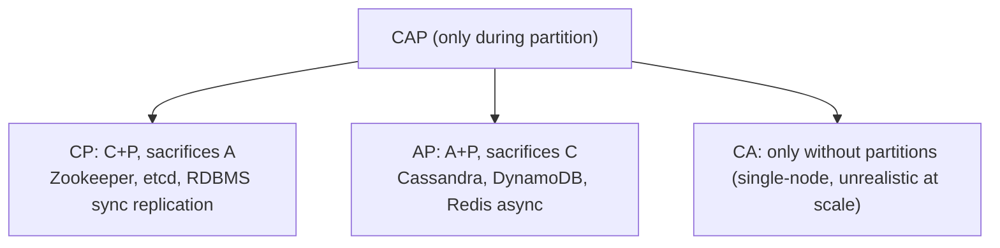

**Q: Interview ke liye better mental model?**
A: **PACELC** — Partition → A ya C; Else (normal) → **L**atency ya **C**onsistency. Partitions rare, par latency day-to-day version hai.
- RDS sync multi-AZ → normal mein C over L (write replica ack ka wait karta).
- Is guide ka CQRS+read-replica = explicit **PA/EL** (normal mein latency > strict consistency).

**Q: Concrete AP vs CP example?**
A: "RDS read replicas AP/eventually-consistent; payment write path CP kyunki double-charging risk nahi le sakte."

### Back-of-the-Envelope Capacity Estimation

| Quantity | Rule of thumb |
|---|---|
| 1M requests/day | ≈ 12 req/sec avg |
| Peak traffic | avg ka 2–5x; peak ke liye design karo |
| 1 KB × 1M/day | ≈ 1 GB/day, ≈ 30 GB/month |
| SSD read | ~tens of µs–1ms |
| Network RTT same region | ~0.5–2 ms |
| Network RTT cross-continent | ~100–150 ms |
| Redis GET | ~0.5–1 ms |
| SQL indexed | ~1–10 ms |
| SQL unindexed/full scan | ~100ms–seconds |

**Method:** DAU × req/user/day → avg RPS → × peak factor (3x) → storage (`size × records/day × retention`) → bandwidth (`payload × RPS`) → decide caching/replicas/sharding/CDN.

Example: 500K DAU × 20/day = 10M/day ≈ 116 RPS avg → ~350 RPS @3x. Kestrel easily handle karta, bottleneck DB hoga → isliye caching/read-replicas necessary, optional nahi.

---

## Intermediate: Building Blocks

### Caching Strategy

**Layers:**
- **In-memory** (single node): `services.AddMemoryCache();`
- **Distributed (Redis)** — cache-aside pattern:
```csharp
var cached = await _redis.GetStringAsync(key);
if (cached != null) return JsonSerializer.Deserialize<User>(cached);
var user = await _db.Users.FindAsync(id);
await _redis.SetStringAsync(key, JsonSerializer.Serialize(user));
return user;
```
- **Response caching:** `[ResponseCache(Duration = 60)]`

**Q: Invalidation strategies? (interviewer's favorite — "invalidation is the hard part")**

| Strategy | How | Trade-off |
|---|---|---|
| TTL/expiration | N sec baad auto-expire | Simple, par window mein stale |
| Write-through | Cache+DB sync write | Hamesha fresh, par write latency add |
| Write-behind | Cache write, DB async flush | Fast writes, crash pe data loss risk |
| Explicit invalidation | DB write ke baad code key delete | Sabse correct, par ek path miss karna easy |
| Event-driven | Write pe event publish, subscribers evict | Scale karta, par infra + eventual lag |

**Q: Cache stampede/thundering herd?**
A: Hot key expire → concurrent misses DB ko hammer. Mitigate: request coalescing (single in-flight fetch), jittered TTLs, probabilistic early refresh.

**Q: Cache-aside vs read-through?**
A: Cache-aside = logic app code mein (`IDistributedCache`/Redis, most common). Read-through = library/proxy DB ke saamne, miss par transparently fetch (kam app code, kam control). Interviewers interchangeably bolte par different responsibilities.

### Load Balancing

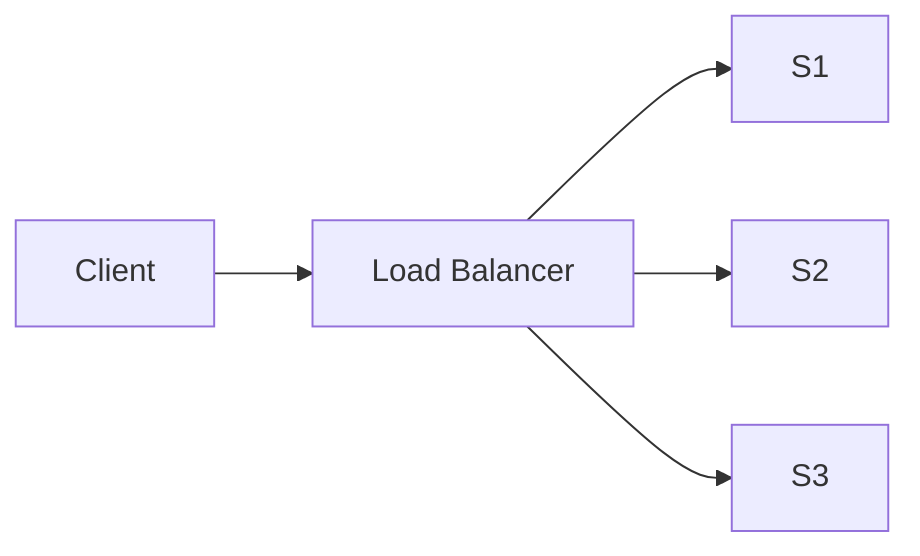

| Algorithm | Behavior | When |
|---|---|---|
| Round robin | Evenly cycle | Uniform cost, stateless |
| Least connections | Fewest active | Variable duration |
| IP/consistent hash | Same client → same server | Sticky sessions, cache locality |
| Weighted | Capacity-proportional | Mixed sizes, canary rollout |

**Q: L4 vs L7?**
A: L4 (transport, AWS NLB) — IP/port routing, fast, protocol-agnostic. L7 (application, ALB/Nginx/YARP) — HTTP path/header routing (strangler-fig mein use), par HTTP terminate/inspect overhead.

**Health checks algorithm jitne matter karte** — LB tab tak achha jab tak unhealthy instances detect + route stop kare (active probes + passive circuit-breaking).

### API Gateway / BFF Pattern

**Q: BFF kya hai?**
A: UI-specific API layer (Angular exclusively isse baat karta) — AuthN/AuthZ, backend calls aggregate, responses shape, read vs write path decide.

**Q: BFF kyun, na ki direct microservice calls?**
A: Angular ko multiple services directly call karne se rokta, auth centralize (token validation duplication avoid), UI iteration ko backend structure se decouple.

**Q: BFF vs generic API Gateway?**
A: **Gateway** (Ocelot, YARP, APIM, Kong) = shared/generic front door for many consumers (mobile/web/partners) — routing/auth/rate-limiting. **BFF** = ek per frontend/client type (Angular BFF vs mobile BFF) — different response shapes/aggregation. Common: Gateway ke *peeche* BFF (Gateway = TLS/WAF/global limits, BFF = UI aggregation). Dono conflate karna minor red flag.

### Database Read Replicas

- Read traffic horizontal scaling; reporting/dashboard offload; write model change kiye bina read perf improve.
- **Eventually consistent** — write ke baad immediate consistency assume mat karo.

### Database Sharding vs Partitioning

**Q: Difference?**
A: **Partitioning** = large table smaller pieces mein, *same* server par (SQL table partition by date) — manageability ke liye. **Sharding** = horizontal partitioning jahan pieces *different servers/DBs* par — writes/storage ko ek machine se aage scale karne ke liye.

| Strategy | How | Pros | Cons |
|---|---|---|---|
| Range-based | Key range (ID 1-1M...) | Simple, range queries good | Hotspotting agar skewed |
| Hash-based | `hash(key) % N` | Even distribution | Resharding painful (N change = remap) |
| Consistent hashing | Ring-based | Resize par minimal remap | More complex |
| Directory-based | Lookup service key→shard | Flexible, easy rebalance | Lookup = naya SPOF |
| Geo-based | Region/tenant se | Locality, compliance (GDPR) | Cross-region expensive |

**Cross-shard problems (proactively raise):** joins → app-level fan-out/denormalization; transactions → sagas/2PC; rebalancing hardest → isliye consistent hashing exist karti.

**Q: Multi-tenant SaaS DB kaise shard karoge?**
A: `tenant_id` se (geo/hash); har tenant ka data ek shard par → cross-shard joins entirely avoid. Biggest simplification.

### Consistent Hashing

**Q: Kya problem solve karta?**
A: Naive `hash(key) % N` — node add/remove pe *almost every* key remap → cache/data stampede. Consistent hashing yeh avoid karta.

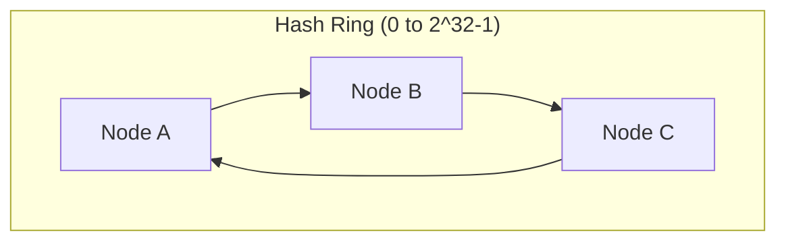

**How:** Nodes + keys circular ring pe hash. Key uske clockwise-next node ki. Node add/remove sirf usse + previous node ke beech keys affect karta — whole keyspace nahi.

**Virtual nodes:** Har physical node ko multiple ring positions (Redis Cluster, DynamoDB, Cassandra) — uneven load avoid jab node count small.

**.NET mein kahan:** Redis Cluster client-sharding, distributed cache partitioning, LB session affinity, CDN edge selection. *Why > modulo* jaanna hi signal hai, ring math nahi.

### Message Queues & Event-Driven Architecture

**Q: Queue se decouple kyun (direct calls ke bajaye)?**
A: Producer/consumer independently scale; consumer downtime producer ko block nahi (buffer); natural retry/backoff/DLQ; fan-out (one event, many subscribers).

**Q: Queue vs Topic/Pub-Sub?**

| | Point-to-point queue | Pub/Sub (topic) |
|---|---|---|
| Consumers | Ek consumer per message (competing) | Har subscriber ko copy |
| Example | ASB Queue, SQS | ASB Topic, Kafka, RabbitMQ fanout |
| Use | Work distribution (process order) | Broadcast state change (OrderPlaced → Billing/Shipping/Analytics) |

**Q: Kafka vs RabbitMQ vs Azure Service Bus?**

| | Kafka | RabbitMQ | Azure Service Bus |
|---|---|---|---|
| Model | Distributed log, partitioned, offset track | Traditional broker (smart broker/dumb consumer) | Managed broker (queues+topics), enterprise |
| Throughput | Very high (M/sec) | Moderate-high | Moderate |
| Retention | Retains (replay) | Ack ke baad remove | Time-boxed |
| Ordering | Per-partition | Per-queue | FIFO sessions |
| Best for | Event streaming/sourcing, telemetry | Task queues, RPC, complex routing | Enterprise .NET, hybrid cloud |
| .NET | Confluent.Kafka | RabbitMQ.Client/MassTransit | Azure.Messaging.ServiceBus |

**Q: Delivery guarantees?**
A: Most brokers default **at-least-once** (redeliver agar ack lost) → **consumers idempotent hone chahiye**. Exactly-once expensive/rare. Pragmatic answer: "design for at-least-once + idempotent handlers."

---

## Advanced Architecture Patterns

### CQRS + BFF + Read Replicas (Reference Architecture)

**30-sec pitch:** CQRS se writes/reads separate. Command APIs = business logic → primary RDS write. Query APIs = read-only from RDS replicas. Angular kabhi direct backend call nahi karta — BFF se baat karta (auth, shaping, read/write route decide). Scalability + performance + clean UI/domain separation.

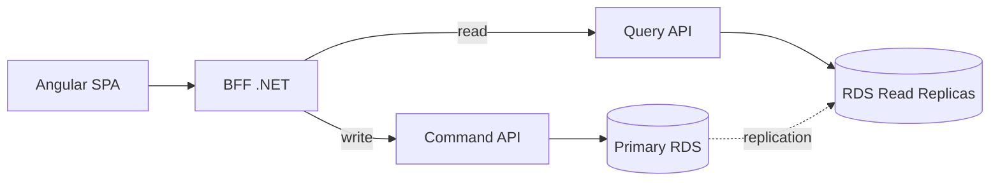

| Layer | Responsibility |
|---|---|
| Angular | Sirf UI, sirf BFF call |
| BFF | AuthN/Z, aggregate, shape, read/write decide |
| Command APIs | Business rules, validation, transactions, primary writes |
| Query APIs | Read-only optimized, replica reads |
| Primary RDS | Saari writes |
| Read Replicas | Saari reads |

**Kyun:** CQRS — writes complex/transactional/strong-consistency; reads frequent/perf-critical, alag scale. Replicas — read horizontal scaling + offload. BFF — UI API, aggregate, auth centralize.

**Q: Read-after-write consistency kaise handle?**
A: Replicas eventually consistent. Ya (a) command response directly UI ko return (re-query nahi), ya (b) uss follow-up read ke liye BFF primary se read kare. Kabhi immediate consistency assume mat karo.

**.NET talking points:** Separate Command/Query APIs + separate `DbContext`s; writes = EF Core change tracking; reads = `.AsNoTracking()` ya Dapper; BFF kabhi DB direct nahi, hamesha APIs ke through.

**Follow-ups:**
- "True CQRS?" — *Pragmatic* CQRS (read/write path + scaling separate, par same logical DB). Event-driven projections baad mein add = "full" CQRS.
- "Angular direct Query API kyun nahi?" — UI ko backend se couple, auth duplicate, changes fragile/expensive.
- "Kab avoid?" — Small CRUD/admin panels jahan complexity > benefit.
- "Scale kaise?" — Angular CDN; BFF/Query APIs horizontal; replicas independently add; write side controlled.

**Red flags:** Angular → microservices direct; BFF mein business logic; replicas ko strongly consistent claim karna; ek API dono reads+writes at scale.

**Closing:** "CQRS with a BFF allows us to scale reads safely, keep writes consistent, and give the UI exactly what it needs without coupling it to backend complexity."

### Monolith → Microservices Migration (Strangler Fig)

**Q: Steps?**
1. **Start with why** — validate genuinely chahiye (independent deploy, different scaling, team autonomy, tech heterogeneity). Warna **modular monolith** kaafi — yeh bolna maturity signal.
2. **Service boundaries (DDD bounded contexts)** — code cut karne se pehle kahan cut. "I use domain & change boundaries, not controllers/tables."
3. **Strangler Fig** — no big-bang.

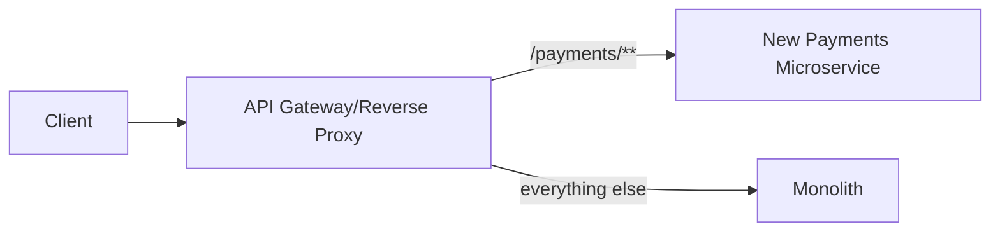
   Gateway saamne (YARP/Ocelot/Nginx/APIM) → sab traffic monolith → ek capability extract → routing shift → repeat.
4. **Prepare monolith (modularize first)** — separate projects, clear interfaces, tests around critical flows → extraction = "cut & paste + adaptation."
5. **Extract one service end-to-end** — new repo, own CI/CD, separate data (new DB/schema ya temp same DB single-writer), API expose, callers → gateway, stable ke baad old code off.
6. **Data migration (hardest)** — DB-per-service goal. Path: shared DB isolated ownership → gradually ETL/CDC/event-streams. Distributed txn ke upar **event-driven/eventual consistency prefer**; complex workflows ke liye Outbox + Saga.
7. **Platform components** — API Gateway; REST/gRPC + broker; observability (Serilog+ELK/App Insights, correlation IDs, metrics/health); CI/CD per service.
8. **Deployment/risk** — small low-risk module (Notifications) se start; feature toggles; canary/blue-green + rollback (gateway traffic flip).
9. **Pitfalls:** too fine-grained → chatty/latency; shared DB forever → distributed monolith; no observability → debugging nightmare; tech explosion → ops complexity.

### CQRS & Event Sourcing (Full Pattern)

**Q: Full CQRS vs pragmatic?**
A: Full = write/read *physically different stores/schemas*. Write side source-of-truth (often event stream); read side = denormalized projections, async events consume karke updated.

**Q: Event Sourcing?**
A: Current state ke bajaye events ki sequence store (`OrderCreated`, `ItemAdded`, `OrderShipped`). State = events replay (ya snapshot + recent events).

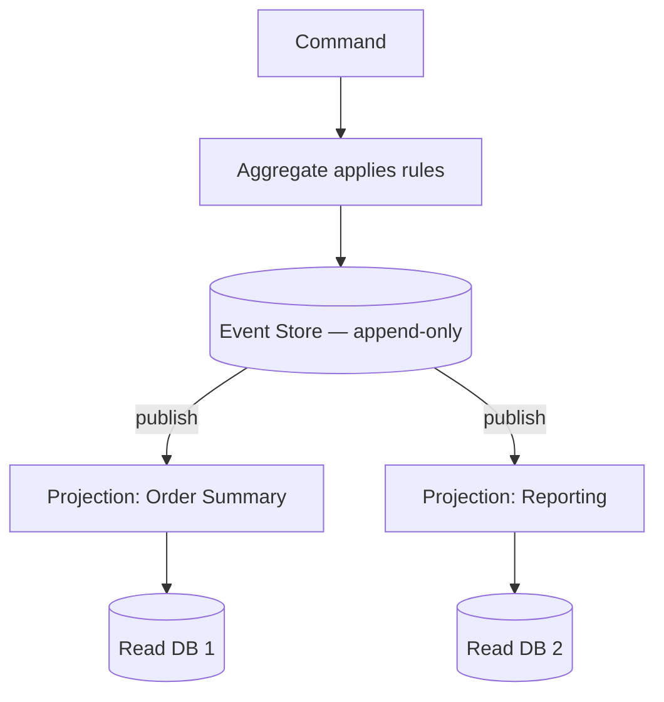

| Benefit | Cost |
|---|---|
| Full audit trail / temporal queries | Significant complexity (underestimated) |
| Per-query tailored read models | Write↔read eventual consistency |
| Natural event-driven integration | Rebuilds = replay large streams → snapshotting |
| Read scaling decoupled from write | Event schema evolution = ongoing tax (versioning) |

**Senior guidance:** Default se reach mat karo. Earn karta hai jab audit/temporal first-class chahiye, ya reads itni varied ki normalized write model serve na kar sake. Vast majority ke liye pragmatic CQRS + sync replicas right level; full event sourcing = escalation path, starting point nahi.

### Outbox Pattern & Transactional Messaging

**Q: Kya problem?**
A: DB update *aur* event publish dono atomically chahiye, par DB txn + broker publish ek ACID txn share nahi kar sakte. Publish-first + DB fail → phantom event. DB-first + publish fail → downstream ko pata nahi (dual-write problem).

**Q: Solution?**
A: Event ko `Outbox` table mein *same DB transaction* mein likho. Separate background process (ya CDC/Debezium) outbox poll karta → broker publish → sent mark.

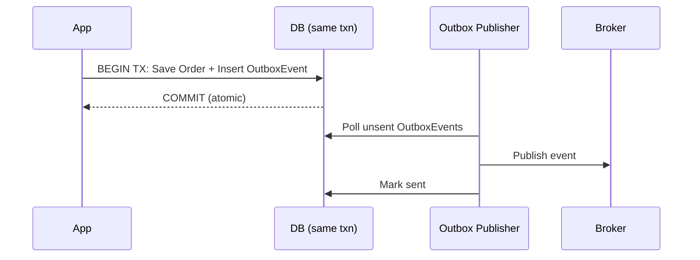

**.NET:** `SaveChangesAsync()` business entity + `OutboxMessage` ek txn mein. `BackgroundService`/Hangfire poll → publish → status update. **At-least-once** → consumer idempotent hona chahiye.

### Sagas / Distributed Transactions

**Q: 2PC kyun nahi?**
A: Participants locks hold karte jab tak sab vote na karein → services/network ke across scale nahi, tight coupling + availability risk (ek slow service sabko block). Modern microservices 2PC avoid karte.

**Q: Saga?**
A: Distributed txn ko local txns ki sequence mein break; har ek ka **compensating action** agar baad ka step fail ho.

| Style | How | Trade-off |
|---|---|---|
| **Choreography** | Har service event publish, others react (no coordinator) | Few steps simple; grow karne pe trace hard ("where's logic?") |
| **Orchestration** | Central orchestrator har step call, failure pe compensate | Clear/testable/traceable; par orchestrator naya component |

**Worked example — Order + Payment + Inventory:**
1. Order create (Pending) → `OrderCreated`
2. Payment charge → `PaymentCompleted`/`PaymentFailed`
3. `PaymentCompleted` → Inventory reserve → `StockReserved`/`StockUnavailable`
4. `StockUnavailable` → compensate: Payment refund, Order → Cancelled

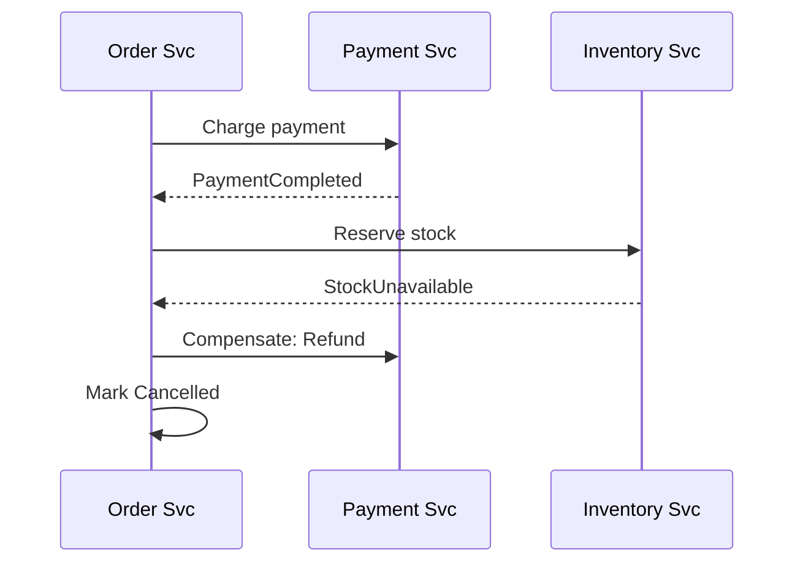

**Q: Compensation khud fail ho jaaye?**
A: Honest hard part. Compensations retry (idempotent + backoff); exhaust → DLQ + manual/ops escalate. Fully automatic answer nahi hai — acknowledge karna = strong signal.

### Resilience Patterns: Circuit Breaker, Retry, Bulkhead (Polly)

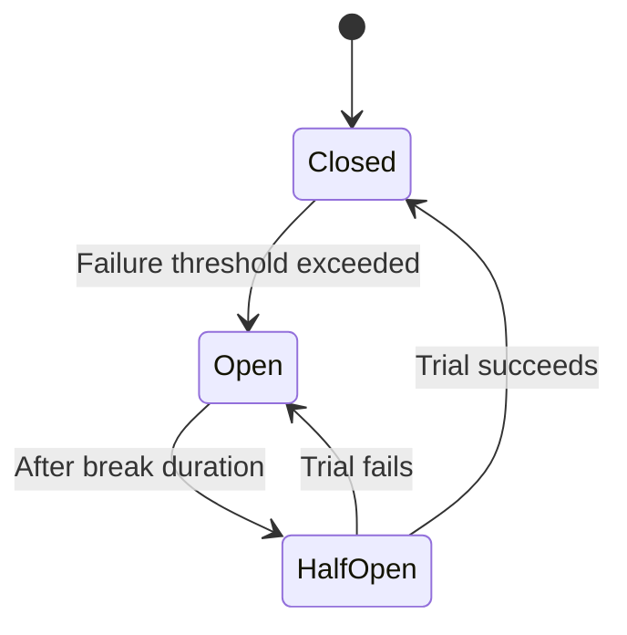

- **Retry** — transient failure re-attempt, **exponential backoff + jitter** (jitter = synchronized retry storms avoid).
- **Circuit Breaker** — N failures ke baad "open" → cooldown fail-fast (dependency hammer nahi); cooldown ke baad trial (half-open).
- **Bulkhead** — per-dependency concurrent calls cap → ek slow downstream thread/connection pool exhaust na kare.
- **Timeout** — hamesha pair karo; warna retry/breaker sirf zyada wait karega fail hone ke liye.

```csharp
var pipeline = new ResiliencePipelineBuilder<HttpResponseMessage>()
    .AddRetry(new RetryStrategyOptions<HttpResponseMessage>
    {
        MaxRetryAttempts = 3,
        BackoffType = DelayBackoffType.Exponential,
        UseJitter = true
    })
    .AddCircuitBreaker(new CircuitBreakerStrategyOptions<HttpResponseMessage>
    {
        FailureRatio = 0.5,
        SamplingDuration = TimeSpan.FromSeconds(30),
        BreakDuration = TimeSpan.FromSeconds(15)
    })
    .AddTimeout(TimeSpan.FromSeconds(5))
    .Build();
```

Modern .NET: `Microsoft.Extensions.Http.Resilience` → `HttpClientFactory` ke saath `AddStandardResilienceHandler()`.

### Idempotency Keys

**Q: Kyun chahiye?**
A: At-least-once delivery (Outbox/queues) + retries (Polly) = *same* operation multiple baar trigger. Non-idempotent handlers ("charge card", "send email") double-execute karenge.

**Q: Pattern?**
A: Client unique key (GUID) per operation header mein bheje (`Idempotency-Key`). Server completed keys + response ko fast store (Redis/DB unique index) mein store. Retry pe re-execute ke bajaye cached response return.

```csharp
[HttpPost("payments")]
public async Task<IActionResult> ChargeCard(
    [FromHeader(Name = "Idempotency-Key")] string idempotencyKey,
    PaymentRequest request)
{
    var existing = await _idempotencyStore.GetAsync(idempotencyKey);
    if (existing is not null) return Ok(existing.Response); // replay
    var result = await _paymentService.ChargeAsync(request);
    await _idempotencyStore.SaveAsync(idempotencyKey, result);
    return Ok(result);
}
```

**Kahan:** payment APIs, order creation, non-idempotent POSTs, at-least-once queue consumers.

**Q: DB unique constraint kaafi nahi?**
A: Kabhi kabhi (natural business key jaise `OrderId`). Idempotency keys = general solution jab natural key na ho, ya retry pe *exact original response* chahiye (sirf duplicate row prevent nahi).

### Rate Limiting Algorithms

| Algorithm | How | Pros | Cons |
|---|---|---|---|
| Fixed window | Fixed window count, boundary reset | Simple, cheap | Edge pe 2x burst (100@11:59:59 + 100@12:00:01) |
| Sliding window log | Har request timestamp, rolling count | Accurate | High volume = memory-heavy |
| Sliding window counter | Current+prev window weighted avg | Good accuracy, low memory | Slight approximation |
| Token bucket | Bucket refill fixed rate, request = 1 token | Controlled bursts, smooth | Slightly complex |
| Leaky bucket | Queue, fixed output rate | Constant rate smoothing | Bursty clients latency |

**.NET built-in** (`Microsoft.AspNetCore.RateLimiting`, .NET 7+): Fixed/Sliding Window, Token Bucket, Concurrency.
```csharp
builder.Services.AddRateLimiter(options =>
{
    options.AddTokenBucketLimiter("api", opt =>
    {
        opt.TokenLimit = 100;
        opt.TokensPerPeriod = 20;
        opt.ReplenishmentPeriod = TimeSpan.FromSeconds(10);
    });
});
```

**Q: Distributed rate limiting?**
A: Per-instance in-memory counters global limit enforce nahi karte. Redis (`INCR`+`EXPIRE` ya Lua script for atomicity) = shared counter → limit saari instances ke across. ("10 pods behind LB" follow-up = senior vs mid signal.)

---

## Kestrel & ASP.NET Core Server Internals

**Q: Kestrel kya hai?**
A: ASP.NET Core ka default cross-platform web server — high-perf, event-driven, async, .NET Socket APIs pe built (Windows IOCP, Linux/macOS epoll/kqueue). Low overhead pe thousands concurrent connections.

**Q: Kyun banaya?**
A: Pehle IIS + `System.Web` = thread-per-request (starvation), Windows-coupled, slow. Kestrel = platform-independent, ground-up async I/O, Node.js/Nginx-jaisa perf, `System.Web`/IIS overhead remove.

**Features:** Cross-platform; async pipeline (kam threads); high perf (TechEmpower top); HTTP/1.1, HTTP/2, HTTP/3 (QUIC), TLS termination; WebSockets; endpoint routing (multiple URLs bind).

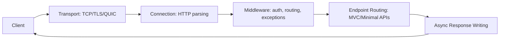

**Q: Concurrency kaise?**
A: Event-loop-based (Node.js jaisa, multiple loops). IOCP/epoll/kqueue; minimal threads → high throughput; async context-switching ThreadPool block avoid. 10K connections → few threads active, sab async. **Isliye async code API faster banata — threads efficiently reuse.**

```csharp
builder.WebHost.ConfigureKestrel(options =>
{
    options.Limits.MaxRequestBodySize = 10 * 1024 * 1024; // 10 MB
    options.Limits.KeepAliveTimeout = TimeSpan.FromMinutes(2);
    options.Limits.RequestHeadersTimeout = TimeSpan.FromSeconds(30);
    options.ListenAnyIP(5000);
    options.ListenAnyIP(5001, lo => lo.UseHttps());
});
```

**Standalone vs Reverse Proxy:** Standalone = Client→Kestrel (dev/containers). Reverse proxy (prod recommended) = Client→Nginx/Apache/IIS→Kestrel — security, load balancing, connection handling, static files faster, direct exposure se protect.

**Performance features:** Zero-copy (`Span<T>`, `Memory<T>`, pipelines); optimized header/body parsing; HTTP/2 multiplexing; IIS Integration Middleware. Memory: pools + shared buffers + reusable arrays → kam GC pressure.

**Q&A:**
- **Why faster than IIS/System.Web?** Async I/O, minimal pipeline, no `System.Web`, lightweight, event-driven.
- **Direct internet expose?** Nahi — reverse proxy (Nginx/IIS/cloud LB). Containers mein = ingress controller/platform LB. Principle same: Kestrel raw expose mat karo.
- **Thread starvation?** No thread-per-request; async I/O + event loop → kam threads.
- **Windows par chalta?** Haan, par cross-platform async I/O use karta, legacy Windows APIs nahi.
- **`MinRequestBodyDataRate`/`MinResponseDataRate`?** Min data rate (default ~240 B/sec) — slowloris-style slow-client attacks se protect. Raise/disable (`= null`) legitimately slow clients ke liye (poor mobile, large uploads); public endpoints pe kabhi disable nahi bina doosri mitigation (WAF/proxy timeout).
- **HTTP/2 vs HTTP/3 (QUIC)?** HTTP/2 = TCP multiplex par TCP head-of-line blocking (ek lost packet saare streams stall). HTTP/3 = QUIC/UDP, transport-layer multiplex (ek lost packet sirf apna stream) → lossy/mobile networks pe better latency. Trade-off: QUIC/UDP corporate firewalls block kar sakte → HTTP/2 fallback rakho.

**Senior summary:** "Kestrel is ASP.NET Core's default high-performance web server... async I/O, event-driven, memory-efficient pipelines, thousands of concurrent connections, HTTP/1.1-3, TLS, WebSockets, cross-platform. In production I run it behind a reverse proxy/ingress for security, load balancing, static files. Async-first = significantly better perf vs IIS/System.Web."

---

## API Performance Optimization

**1. Reduce I/O & DB latency** — composite indexes for frequent filters; no `SELECT *`; slow queries analyze (Query Store/`EXPLAIN`). Pagination + projection (EF `Select()`). Async EF:
```csharp
var data = await _dbContext.Users.Where(x => x.IsActive).ToListAsync();
```

**2. Caching at multiple layers** — dekho Caching Strategy (in-memory, Redis cache-aside, response caching, invalidation, stampede).

**3. Reduce serialization** — `System.Text.Json` (not Newtonsoft); pre-defined DTOs; EF entities directly serialize mat karo. STJ source generators (`JsonSerializerContext`, .NET 6+) reflection avoid → high-throughput win.

**4. Async & non-blocking** — no `.Result`/`.Wait()` (thread pool block); end-to-end async, no sync-over-async.

**5. Minimize middleware** — sirf required (routing/auth/logging); unused services + verbose prod logging + large stack traces disable.

**6. Compression, HTTP/2, gRPC** — `services.AddResponseCompression();`. gRPC internal microservice calls (REST se 5-10x faster, binary). gRPC speed = HTTP/2 + Protobuf + strong typing; trade-off: harder debug (not human-readable), weaker browser support (grpc-web + proxy), less universal tooling. **Standard answer: gRPC internal, REST/JSON (ya GraphQL) public/browser-facing.**

**7. Improve architecture** — CQRS high-read; background processing (Hangfire/Azure Functions/`BackgroundService`) → API fast return.

**8. Connection pooling & HttpClientFactory** — socket exhaustion rokta:
```csharp
services.AddHttpClient("external", c => c.Timeout = TimeSpan.FromSeconds(5));
```
DB: minimal contexts, no long transactions.

**9. Reduce payload** — compress JSON, remove unused fields, lightweight DTOs, OData/filtering.

**10. Profiling & monitoring** — App Insights, New Relic, CloudWatch, Datadog, MiniProfiler, EF Core logging (N+1). Track: latency (p50/p90/p99), slow SQL, serialization, GC pauses.

**Senior summary:** "Optimize at multiple layers: DB (indexes/projections/pagination), caching, async, Kestrel tuning, minimized middleware, payload, observability. High-scale: CQRS, background processing, gRPC. Performance is cross-layer, not a single fix."

---

## Scalability & Performance Deep Dive

**Q: "API is slow, walk me through debugging" — mental model?**

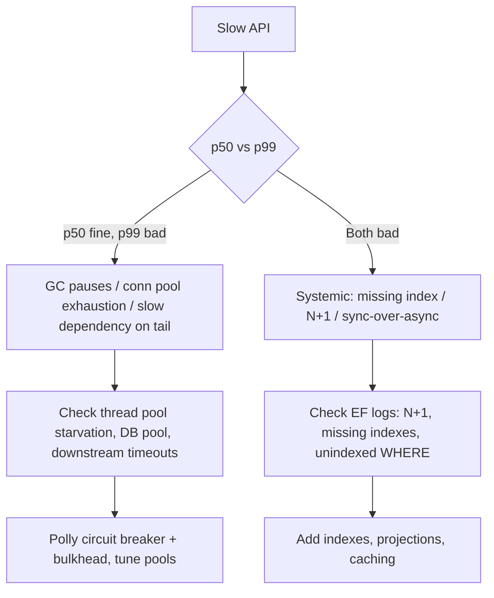

**Q: Vertical vs horizontal scaling?**
A: Vertical (bigger box) simpler — no code/distributed changes — par hard ceiling + SPOF. Horizontal (more boxes) = internet-scale standard, par app stateless hona chahiye (state Redis/DB mein externalize), LB chahiye, distributed problems (consistency, distributed cache, session affinity). Senior: customer-facing = default horizontal; low-traffic internal tool ko sirf fashion ke liye over-engineer mat karo.

**Q: N+1 query problem?**
A: Most common EF Core bug — collection iterate + per-item lazy-load = N+1 round trips. Fix: eager (`.Include()`), projection (`.Select()`), single batched query. `AsSplitQuery()` for one-to-many `Include` (cartesian-product explosion avoid) — jaano kab split vs single.

---

## Best Practices

- Microservices/CQRS/event sourcing se pehle business need validate — complexity earn ho.
- **Async all the way down**; kabhi `.Result`/`.Wait()` mix mat karo.
- Client ke sabse close correct layer par cache: CDN > response > distributed > in-memory > DB.
- Read replicas + distributed caches = **default eventually consistent** — read-after-write explicitly design.
- Consumers idempotent — at-least-once realistic default.
- Har outbound call ke around resilience (retry/breaker/timeout/bulkhead).
- Observability (structured logs, correlation IDs, tracing, p50/p90/p99) day one se, first incident ke baad nahi.
- Premature microservices ke upar modular monolith prefer — legitimate end-state, sirf stepping stone nahi.
- Shard key aisa jo related data + transactions saath rakhe.

## Common Pitfalls

- Too fine-grained microservices → chatty/latency.
- Shared DB forever → distributed monolith.
- No observability → debugging nightmare.
- Tech stack explosion → ops complexity.
- Read replicas/caches ko strongly consistent assume karna (red flag).
- `.Result`/`.Wait()` on async → thread pool starvation.
- Non-idempotent op (charge card) idempotency key ke bina retry → duplicate side effects.
- Circuit breaker/retry bina timeout → slower fail, fast nahi.
- Shard key jo query/transaction patterns se match nahi → expensive cross-shard fan-out.
- Kafka/event sourcing/full CQRS reach karna kyunki "correct" hai jab simpler pattern faster ship ho.

---

## Worked Examples

Framework: requirements → estimation → high-level → deep dive → trade-offs.

### Design a URL Shortener

**Requirements:** long→short, redirect; ~100M new URLs/month, ~10:1 read:write; low-latency redirects.

**Estimation:** 100M/month ≈ 40 writes/sec; reads ≈ 400/sec avg (peak higher). ~500B/URL → ~50GB/month (archiving se manageable).

**Short code generation:**

| Approach | How | Trade-off |
|---|---|---|
| Auto-increment ID → Base62 | `id=125 → "cb"` | Simple, no collision, par order/volume reveal + central ID gen (ya range allocator) |
| Hash (MD5/SHA) + truncate | First 6-8 chars | No central counter, par collisions → check-retry/longer code |
| Random + collision check | Random 6-7 + DB check | Simple, par keyspace fill → wasted lookups |

Senior: distributed ID generator ka base62 (Snowflake-style ya pre-allocated ranges) → no bottleneck, no collision.

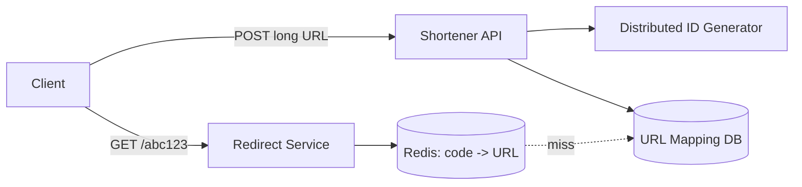

**Deep dive — redirect = hot path:** Redis cache (read-through/cache-aside); DB sirf miss pe. **301 vs 302:** 301 (permanent) browser cache karta (kam hits, par analytics lose + destination change hard); 302 (temporary) har click service hit (analytics, A/B) more load pe. Most shorteners 302 (click tracking).

**Trade-offs:** vanity URLs → uniqueness check; link creation expire/rate-limit (spam) → Rate Limiting section.

### Design a Rate Limiter Service

**Requirements:** per client (API key/IP) N req/window; distributed (many instances); low latency.

**Design:** Counter Redis mein centralize (per-instance nahi) → global limit. **Token bucket** (bursts absorb + avg rate).

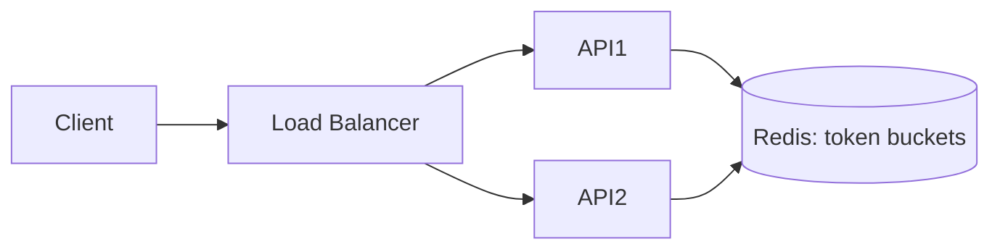

**Key detail:** Redis Lua script (ya `MULTI`/`EXEC`) atomically read-and-decrement — separate `GET`+`SET` = race condition (2 requests "1 token left" read, dono proceed → negative).

**Q: Redis down?**
A: Fail open (allow — abuse risk) vs fail closed (reject — full outage risk). Most systems **fail open** for rate limiting (job = abuse protection, not hard security boundary; outage-caused spike < rejecting 100% legit traffic).

**Kahan enforce:** API Gateway/edge (cheapest, backend compute se pehle rokta) + per-service/endpoint stricter limits layer.

### Design a Notification System

**Requirements:** multi-channel (push/email/SMS) from many upstream events; upstream block nahi; per-channel retries; huge fan-out ("notify all followers").

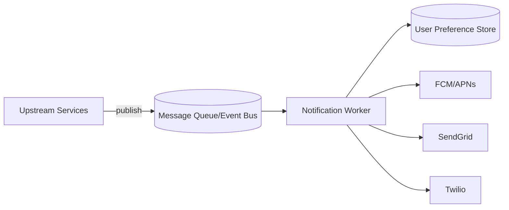

**Queue kyun:** Triggering service (Orders) delivery pe block nahi + SMS outage care nahi → order instant complete, delivery/retries independent.

**Deep dive — fan-out ("1M followers"):** 1M messages synchronously mat banao. "fan-out" event publish → dedicated fan-out worker per-user items mein expand (2nd queue push) → originating request fast, expensive work isolated background.

**Per-channel resilience:** Har provider apni Polly policy (retry+breaker) → SMS outage email/push stall na kare. Per-channel DLQ + alerting.

**Preferences & idempotency:** Send se pehle preferences (opt-outs, quiet hours) check — cache karo. Idempotency key per (event, channel) → redelivered message duplicate na bheje.

**Trade-off:** Real-time push vs batched/digest — immediate = immediacy but fatigue + cost; batch ("5 new comments") = better UX/cost at scale, latency trade. Clarify karo.

---

## Closing the Gap: Additional Prep

### Expanding the Worked-Example Repertoire

Same framework (requirements → estimation → design → deep dive → trade-offs):

- **News Feed (Twitter/IG):** fan-out-on-write (precompute per follower — fast reads, celebrities ke liye expensive) vs fan-out-on-read (request-time assemble — cheap writes, expensive reads). Senior: **hybrid** — normal users write, high-follower read (separate celebrity path).
- **Chat (WhatsApp):** WebSocket/long-lived connections, presence service, message persistence (sent/delivered/read), group fan-out. Deep-dive: recipient ko route kaise jab thousands stateless servers? → connection-registry (Redis `userId → serverId`).
- **Ride-Sharing Dispatch (Uber):** geospatial matching — nearest driver. **Geohashing/quadtree** driver index → "find nearby" fast spatial query, not full scan. Frequent location updates → high-write-throughput store, not strong consistency.
- **Distributed Key-Value Store (mini-DynamoDB):** consistent hashing (partition), replication factor (durability), read/write quorums (`R`/`W`, tunable consistency), vector clocks/last-write-wins (conflict resolution).
- **Video Streaming (Netflix):** chunked multi-bitrate encoding, CDN edge delivery, adaptive bitrate (client bandwidth se next chunk quality), separate metadata/recommendation service.
- **E-Commerce Checkout/Inventory:** overselling rokna under concurrent checkouts. Sagas + Idempotency application — reserve inventory (TTL), charge payment, confirm; fail → compensate (release); idempotency keys → no double-charge/reserve.

### Mapping Patterns to AWS Managed Services

| Generic pattern | AWS equivalent | Notes |
|---|---|---|
| Distributed cache (Redis) | **ElastiCache** | Same cache-aside/write-through; ops burden remove |
| Message queue (P2P) | **SQS** | At-least-once → idempotency; native DLQ |
| Pub/Sub (fan-out) | **SNS** (often SNS → many SQS) | SNS fan-out + SQS durable consumers |
| CDN/edge | **CloudFront** | S3/ALB/API Gateway ke saamne; "cache closest to client" |
| L7 LB | **ALB** | Path/header routing — Strangler Fig gateway |
| L4 LB | **NLB** | Ultra-low-latency, protocol-agnostic (raw TCP/UDP) |
| Read replicas | **RDS/Aurora Replicas** | Same eventual-consistency caveat |
| Orchestrated Sagas | **Step Functions** | Managed orchestrator, declarative state machine + compensations |
| Event streaming (Kafka) | **Kinesis** (ya MSK for Kafka compat) | Kinesis AWS-native simpler; MSK = exact Kafka semantics |
| Serverless event-driven | **Lambda** | Outbox poller = Lambda-on-schedule (EventBridge Scheduler) |
| Rate limiter counter | **ElastiCache (Redis)** | "10 pods behind LB" → shared Redis, not per-instance |

Agar "on AWS specifically" pucha jaaye → service ka naam lo, generic restate mat karo.

### Running the Interview: Time-Boxing & Whiteboard Mechanics

**45-min time-box:**

| Phase | Time | Doing |
|---|---|---|
| Requirements clarification | ~5 min | Scale/ratio/consistency/SLAs — time pressure mein bhi skip mat karo (wrong-fast > wrong-slightly-slower is worse) |
| Estimation | ~5 min | Capacity method, assumptions loud state |
| High-level architecture | ~15-20 min | Boxes+arrows, narrate why (silent mat draw) |
| Deep dive 1-2 components | ~15-20 min | Interviewer steer karega ("how does X work") |
| Trade-offs/failure/wrap-up | ~5-10 min | 10x scale par kya differently + ek unaddressed failure mode |

- **Whiteboard fluency:** Architectures (CQRS+BFF, Strangler, Saga) ko actual tool (Excalidraw/Miro/CoderPad) mein sketch practice karo — separate skill, reading se transfer nahi hota.
- **Continuously narrate:** Silence = #1 reason correct design bhi "junior" padhta. Bolo kya consider + kyun reject ("I could shard by user ID, but I'll shard by tenant ID since it keeps each tenant's data — and transactions — on one shard").

### Multi-Tenant Data Isolation & PII Handling

Real story: multi-partner Dealership Management System (state/county rules, compliance) = inherently multi-tenant, PII-adjacent.

**Isolation models:**

| Model | Isolation | Cost | Fits |
|---|---|---|---|
| Silo (DB-per-tenant) | Strongest | Highest (migrations/scaling/backups × tenant) | Hard regulatory isolation, wildly different scales |
| Pooled (shared DB, `TenantId` + row filter) | Logical (app/ORM enforced) | Lowest, par missed filter = leak risk | Most SaaS moderate-large — matches shard-by-tenant-ID |
| Bridge (schema-per-tenant) | Middle (same instance, separate schema) | Moderate — easier per-tenant backup than pooled | Middle count, per-tenant customization matters |

**PII/compliance (proactively raise):** encryption at rest (RDS/DynamoDB, KMS) + in transit (TLS); field-level encryption/tokenization for sensitive fields; audit logging (kis tenant ka data kisne access kiya, kab).

**#1 failure mode — cross-tenant leak:** koi bhi model ho, specific mechanism naam lo jo tenant A ko tenant B ka data return karne se roke — **fail-closed global query filter** (query throw kare agar tenant context set nahi, silently unfiltered nahi), sirf "we add a WHERE clause" nahi.

---

## Sample Interview Q&A

- **Why is Kestrel faster than IIS?** Async I/O, minimal pipeline, no `System.Web`, lightweight, event-driven.
- **Kestrel direct internet expose?** Nahi — reverse proxy (Nginx/IIS/ingress).
- **Thread starvation?** No thread-per-request; async I/O + event loop → kam threads.
- **CQRS with shared RDS + replicas "true" CQRS?** Nahi — pragmatic CQRS (same logical store, separated read/write paths + scaling). Full CQRS/event sourcing = escalation path.
- **Angular direct Query API kyun nahi?** UI ko backend se couple, auth duplicate, changes fragile/expensive.
- **Kab microservices avoid?** Jab genuinely independent scaling/deploy/team needs na ho — well-modularized monolith often right.
- **Availability vs consistency: partition vs normal?** CAP sirf partition mein (A ya C). Normal = latency vs consistency (PACELC) — sync multi-AZ latency add karta, async replication (RDS replicas) staleness ki cost par latency favor.
- **Payment API safe-to-retry kaise?** Idempotency key per attempt; completed keys + response store; retry pe cached response. + client Polly retry + DB unique constraint (defense-in-depth).
- **Circuit breaker open — users/on-call ko kya?** Users: graceful degraded response (cached/stale ya clear "temporarily unavailable", hung request nahi). On-call: circuit state transitions par alert (not just error rate) → pata chale downstream issue hai, apna bug nahi → diagnosis fast.
- **URL shortener redirect 50K reads/sec?** Aggressively cache (Redis + hot links CDN/edge), redirect path kabhi write DB touch na kare, read replica/dedicated read store agar cache miss volume DB capacity exceed kare — path nearly all cache hits (skewed read:write).
