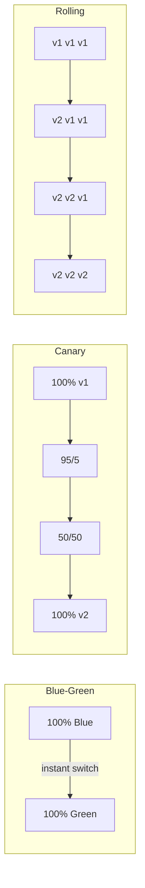
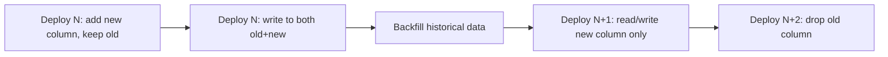
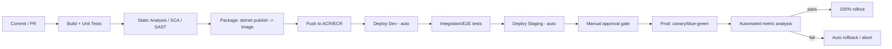
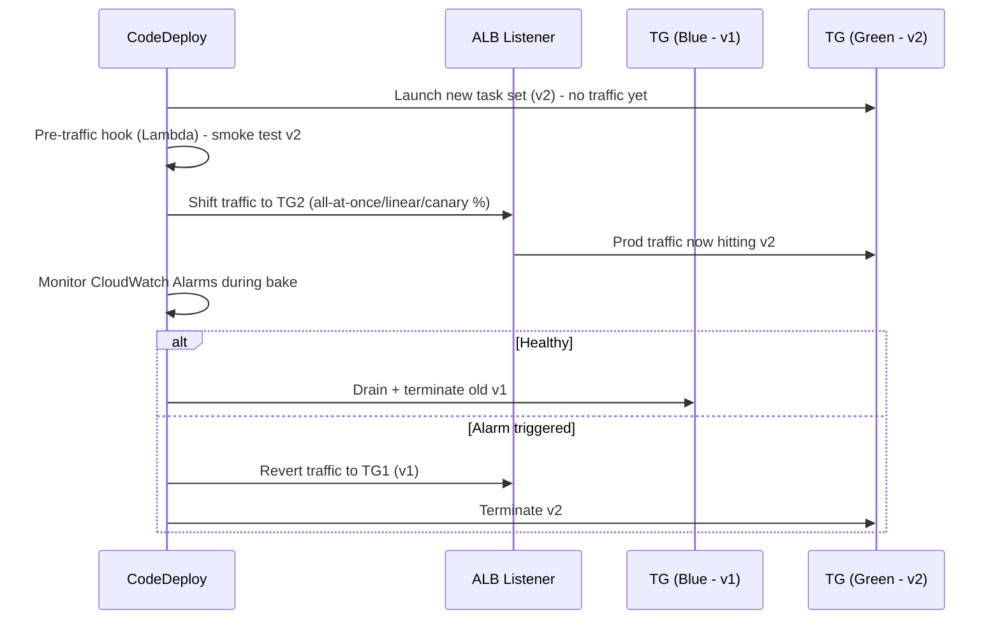

# Deployment Strategies — Quick Revision Notes

> Yeh quick-revision notes guide se derive kiye gaye hain (single source of truth), aur guide ki har section/sub-topic ko usi order mein cover karte hain — fast brush-up ke liye Q/A + tight bullets format mein.

---

## Core Concepts

### "Deployment Strategy" ka Actual Matlab

**Q: Deployment strategies exist kyun karti hain?**
A: Teen questions ek saath solve karne ke liye:
- **Zero downtime** — changes production mein bina downtime ke kaise ship karein.
- **Blast radius limit** — kuch galat ho to damage kaise contain karein.
- **Fast rollback** — jab break ho to jaldi kaise wapas aayein.

**Q: Koi single "best" strategy hoti hai?**
A: Nahi. Har strategy = infra cost vs. speed vs. risk ka alag trade-off. Right choice depend karti hai: service ki **statefulness**, **regulatory/compliance** constraints, **team maturity** (monitoring, automation), aur **cost tolerance** par.

**Q: Interviewer actually kya probe karta hai?**
A: Sirf "blue-green define karo" nahi — balki kya aapne ek bad deploy ko production mein through operate kiya hai: traffic shifting mechanics, session affinity, DB compatibility windows, aur observability samajhte ho ya nahi.

### Blue-Green Deployment

**Kaise kaam karta hai:**
- Do identical, fully-provisioned environments: **Blue** (current prod) + **Green** (new version).
- Green ko isolation mein deploy + test karo (smoke tests, synthetic traffic) jab Blue real traffic serve karta rahe.
- Green stable verify hone par traffic ko Blue → Green atomically switch karo (router/LB/DNS/CNAME swap).
- Issue aaye to rollback = traffic wapas Blue par flip.

**Fayde:** cutover par zero downtime; instant rollback (switch, redeploy nahi); real user se pehle prod-like infra par full validation.

**Nuksan:** expensive (2x infra); reliable traffic-switch mechanism chahiye (DNS-based switching TTL/caching delays se suffer karta hai — common gotcha); DB/schema shared hoti hai — "two identical envs" model shared stateful store aate hi break ho jaata hai.

**AWS Elastic Beanstalk example:**
```bash
# Green mein new version deploy
eb create green-environment
# CNAME swap (Blue <-> Green)
eb swap-environment-cnames --source-environment blue-environment --destination-environment green-environment
```

Banking app walkthrough: (1) Blue v1.0 live; (2) v2.0 Green mein deploy; (3) Green par automated + manual tests; (4) pass → traffic Green par swap; (5) misbehave → instantly Blue par swap back.

**Follow-ups ready rakho:**
- In-flight requests ka kya? → **connection draining / graceful shutdown** chahiye.
- Database ka kya? → usually **shared** → yeh sirf *app tier* blue-green hai, full-stack nahi.
- Session state? → **sticky sessions blue-green ko break karti hain** → stateless services + distributed cache/session store prefer karo.

### Canary Deployment

**Kaise kaam karta hai:**
- New version ko small slice (5–10%) par deploy karo.
- Error rate, latency, business metrics monitor karo.
- Healthy → progressively badhao (5% → 25% → 50% → 100%).
- Problem → halt karo + us slice ko roll back karo.

**Fayde:** blast radius minimal (sirf small cohort exposed); data-driven rollout (real prod signals gate karte hain, sirf synthetic nahi); gradual controlled exposure.

**Nuksan:** 100% tak slower (multiple stages, har ek ko soak/bake period); real traffic-splitting infra chahiye (service mesh, weighted ingress, API gateway) + statistically meaningful sample par regressions detect karne wali solid observability.

**Netflix example:** 5% → monitor → 50% → 100%.

**Kubernetes Deployment (canary version):**
```yaml
apiVersion: apps/v1
kind: Deployment
metadata:
  name: my-app
spec:
  replicas: 10
  selector:
    matchLabels: { app: my-app }
  template:
    metadata:
      labels: { app: my-app, version: canary }
    spec:
      containers:
      - name: my-app
        image: my-app:v2.0
        ports:
        - containerPort: 80
```

Ingress weighted split (intent):
```yaml
apiVersion: networking.k8s.io/v1
kind: Ingress
metadata:
  name: my-app-ingress
spec:
  rules:
  - http:
      paths:
      - path: /my-app
        backend:
          service: { name: my-app, port: { number: 80 } }
        weight: 20 # 20% traffic to Canary
```

> **Accuracy flag:** Vanilla Kubernetes `Ingress` (networking.k8s.io/v1) natively `weight` field support **nahi** karta. Weighted canary routing chahiye to: **NGINX Ingress** (`nginx.ingress.kubernetes.io/canary-weight`), **Istio VirtualService** weighted routing, ya progressive-delivery controller (**Flagger** / **Argo Rollouts**). Upar wala YAML intent sahi hai par raw manifest stock K8s par kaam nahi karega — real cluster mein apne ingress controller ke actual syntax se verify karo.

**Follow-ups ready rakho:**
- Split increments + bake time kaise decide? → **SLO-based automated gates**, gut feel nahi.
- Kaun se users canary dekhenge? → random sampling vs. **sticky-by-user-id** (UX consistency ke liye).
- Auto-rollback trigger? → error rate / latency **SLO breach → auto-abort** (Flagger/Argo Rollouts se, dashboard dekhta human nahi).

### Rolling Deployment

- Old instances ko new version se **incrementally** replace karo (K8s `Deployment` ki default `RollingUpdate` strategy — `maxSurge` / `maxUnavailable`).
- Koi second full environment nahi → **blue-green se cheaper**.
- Rollback **instant nahi** — same incremental process reverse mein, fleet size ke proportional time lagta hai.
- Mid-rollout **do versions simultaneously live** → wahi **N/N+1 compatibility** requirement (API/schema backward compat mandatory).
- **Stateless services** ke liye good default jahan cost > instant rollback matter karta hai.

### Comparison Table: Blue-Green vs Canary vs Rolling vs Recreate

| Strategy | Infra Cost | Rollout Speed | Rollback Speed | Risk | Traffic Splitting? | Use Case |
|---|---|---|---|---|---|---|
| **Recreate** (old stop, new start) | Low | Fast | Slow (redeploy) | High (downtime) | No | Dev/test, non-critical batch |
| **Rolling** | Low–Med | Medium | Medium (reverse) | Medium | No (LB drains) | Stateless microservices default, cost-sensitive |
| **Blue-Green** | High (2x) | Fast cutover | Instant (flip back) | Low (pre-tested) | Yes (router/DNS/LB) | Regulated/critical, instant clean rollback |
| **Canary** | Med (small extra fleet) | Slow (staged) | Fast (stop + drain) | Lowest (limited blast) | Yes (weighted) | High-traffic consumer apps, validated rollout |



---

## Feature Flags / Feature Toggles

### Feature Toggle Kya Hai

**Q: Feature toggle kya decouple karta hai?**
A: **Deployment** ko **release** se. Code prod mein dark (disabled) ship hota hai, aur independently (specific users/percentages/environments ke liye) bina redeploy on kiya jaata hai. Yeh trunk-based development + continuous delivery ke neeche ka mechanism hai — incomplete/risky work continuously merge + deploy kar sakte ho jab tak flag-guarded ho.

**Teams kar sakti hain:** gradual rollout to specific users; production mein test bina sabko affect kiye; issue par instantly disable (no redeploy).

### Feature Toggles Kyun

- **Risk-free deployments** — default off, progressively enable.
- **Instant rollback** — flag disable karo, poora deployment rollback nahi (much faster MTTR).
- **A/B testing** — different cohorts par enable, impact measure.
- **Continuous delivery** — incomplete work flag ke peeche ship, baad mein finish, ready par flip on.

### LaunchDarkly with .NET

1. LaunchDarkly account + project + SDK key.
2. Install:
```bash
dotnet add package LaunchDarkly.ServerSdk
```
3. Configure `appsettings.json`:
```json
{ "LaunchDarkly": { "SdkKey": "your-launchdarkly-sdk-key" } }
```
> **Secrets gap:** Real SDK key kabhi source control mein commit mat karo. Prod mein **Azure Key Vault** / **User Secrets** (dev) / **environment variables**/App Configuration use karo, `IConfiguration` se bind karo — literal key check-in nahi.

4. Client initialize:
```csharp
using LaunchDarkly.Sdk;
using LaunchDarkly.Sdk.Server;
using Microsoft.Extensions.Configuration;

public class LaunchDarklyService : IDisposable
{
    private readonly LdClient _ldClient;
    public LaunchDarklyService(IConfiguration configuration)
    {
        var sdkKey = configuration["LaunchDarkly:SdkKey"];
        _ldClient = new LdClient(sdkKey);
    }
    public bool IsFeatureEnabled(string featureFlagKey, string userKey)
    {
        var user = User.WithKey(userKey);
        return _ldClient.BoolVariation(featureFlagKey, user, false); // default false
    }
    public void Dispose() => _ldClient.Dispose();
}
```
> **Lifetime gotcha:** `LdClient` persistent streaming connection + caches maintain karta hai → construct expensive → **singleton** hona chahiye (`services.AddSingleton<LaunchDarklyService>()`), per-request nahi. Per-request naya client = connections exhaust + multi-second startup latency har call par (default init connection par briefly block karta hai).

5. Controller mein use:
```csharp
[Route("api/feature")]
[ApiController]
public class FeatureController : ControllerBase
{
    private readonly LaunchDarklyService _ldService;
    public FeatureController(LaunchDarklyService ldService) => _ldService = ldService;

    [HttpGet("dark-mode")]
    public IActionResult GetFeatureStatus()
    {
        bool isEnabled = _ldService.IsFeatureEnabled("dark-mode", "user-123"); // userKey dynamic
        return Ok(new { message = isEnabled
            ? "Dark Mode is ENABLED for you!"
            : "Dark Mode is DISABLED for you." });
    }
}
```

### Testing Feature Toggles

1. Dashboard mein flag `dark-mode` create + user `user-123` target.
2. Call `GET http://localhost:5000/api/feature/dark-mode`.
3. Enabled → `{ "message": "Dark Mode is ENABLED for you!" }`; Disabled → `...DISABLED...`.

### Real-World Use Cases

- **Facebook Dark Mode** — GA se pehle limited rollout.
- **Netflix UI updates** — user segments par UI variant A/B testing.
- **Amazon promotions** — Prime-only scoped discounts.

### Feature Flags in a Microservices Architecture

Microservices mein flags cross-service consistency problems laate hain jo monolith mein nahi hoti:
- **Flag evaluation centralize karo** — shared platform (LaunchDarkly, Azure App Configuration + Feature Management, Unleash, Split), har service apni ad-hoc logic nahi.
- **Flag context consistently propagate karo** — ek request 5 services mein fan-out ho to *same* targeting context (user ID, tenant, region) header/trace context ke through pass karo, taaki sab same evaluate karein. Inconsistent evaluation classic bug (Service A naya UI dikhata, Service B old contract validate karta).
- **Version/contract compatibility** — Service A ka flag aksar require karta hai ki Service B already new contract support kare → flag ka **dependency graph** hota hai; dependencies document/enforce karo (kuch platforms prerequisite flags support karte hain).
- **Local caching + streaming updates** — SDK values locally (in-memory) cache kare + streaming/polling se updates le, har request par flag service ko synchronously call nahi (warna network hop + SPOF).
- **Kill switches** especially important — ek service ka bad release call graph mein cascade kar sakta hai; coordinated multi-service rollback ke bina instant disable = major operational win.
- **Flag lifecycle/cleanup governance** scale par zyada matter karta hai — stale flags = distributed tech-debt + security-audit problem.

### Feature Flag Types and Anti-Patterns

| Flag Type | Lifespan | Purpose |
|---|---|---|
| **Release flag** | Short (days–weeks) | Deploy ko release se decouple; full rollout ke baad remove |
| **Experiment flag** (A/B) | Medium | Experimentation/analytics; experiment ke baad remove |
| **Ops / kill switch** | Long-lived | Feature/dependency ka circuit-breaker; permanently rakha jaata |
| **Permission / entitlement** | Permanent | Plan/tier se features gate (Prime-only) — business logic, deploy mechanism nahi |

**Anti-patterns:**
- **Flag debt** — 100% ke baad release flags kabhi remove na karna → dead `if` branches + combinatorial testing explosion.
- **Non-idempotent side effects wrap karne wale flags** — flag *behavior* gate kare, ek unit of work ke andar mid-transaction flip nahi.
- **Sirf on/off paths test karna** — flag interaction bugs scale par real risk; combinations test karo.

---

## Intermediate Topics

### Zero-Downtime Database Migrations

Most commonly-missed topic + favorite senior question, kyunki blue-green/canary/rolling sab transition window mein **shared DB** assume karte hain.

**Core rule: expand/contract (parallel change):**
1. **Expand** — new schema element (column/table) additively add karo, kuch remove/rename nahi. Old + new dono code kaam karein.
2. **Migrate/backfill** — data new structure mein backfill karo, zaroorat par dual-write (old code old+new likhe, ya background job sync kare).
3. **Contract** — sab instances new code run + verify hone par, ek *later separate* deploy mein old element remove karo.



**Rules of thumb:**
- Ek step mein breaking rename kabhi nahi — hamesha "add new" → "migrate" → "remove old" across deploys.
- Additive changes (`ADD COLUMN` nullable, new table) generally mid-rollout safe.
- Destructive changes (`DROP COLUMN`, `NOT NULL` bina default, rename) tab tak wait jab tak **100%** instances old shape reference na karne wala code run karein.
- **EF Core**: multi-instance rolling deploy mein app startup par `Database.Migrate()` auto-run **avoid** karo (concurrent instances race → deadlock/corrupt). Migrations ko **separate single pre-deploy step** (CI/CD migration job) ke roop mein run karo, new version traffic lene se pehle.
- Large table migrations (index add, backfill) **online/incrementally** (batched updates, `CREATE INDEX ONLINE`/concurrently) — prod tables lock avoid.
- Blue-green: Blue+Green usually **same DB** point karte hain → "DB ke liye blue-green" much harder alag problem (read replicas + cutover, ya append-only treat karke). App-tier blue-green ko DB-tier se conflate mat karo — explicitly decoupled call out karo.

### Rollback Strategy for Stateful Services

Stateless rollback trivial ("old image redeploy" / "traffic flip back"). Real question: **state ka kya hota hai?**
- **Schema compatibility** — rollback tabhi clean jab code ka *previous* version schema ki *current* state par run kar sake → destructive migrations ko code deploys se ek **full contract cycle peeche** lag karo (rollback ability preserve).
- **Message queue / event-driven** — new version ne message schema change kiya (naya required field) to in-flight new messages handle kiye bina consumer rollback = deserialization failures. **Schema versioning / tolerant readers** (unknown fields ignore).
- **Cache poisoning** — new version ne shared cache (Redis) mein new shape likha to invalidate/flush kiye bina rollback → old code crash. **Cache keys version karo** (`user:v2:{id}`).
- **Idempotency for replays** — rollback aksar replay/retry karta hai → operations idempotent (payment/order APIs par idempotency keys) taaki double-charge/write na ho.
- **StatefulSets (K8s)** — in-cluster DBs/brokers ka rollback `Deployment` se alag: ordered one-at-a-time, aur PV data older image ke saath compatible hai ya nahi consider karo.
- **Feature-flag-first rollback** — fastest safest "rollback" aksar risky path ko guard karne wale flag ko disable karna hai (full infra rollback nahi). Yeh **first lever**; infra rollback un cheezon ke liye jo flags cover nahi karte (bad container image, not bad logic).

### Deployment in Kubernetes / AKS / EKS

- **Deployment object** — default `RollingUpdate` + configurable `maxSurge` (extra pods over desired) + `maxUnavailable` (kitne down). Tune = rollout speed vs. resource headroom vs. availability.
- **Readiness vs. liveness probes** — rolling update sirf **readiness** pass karne wale pods ko traffic deti hai; pod alive (liveness) ho sakta hai par ready nahi (caches/connections warm ho rahe). Misconfigured probes = "rolling deploy ne brief outage kiya" ka #1 cause (unready pods ko traffic, ya `livenessProbe` slow-starting .NET pods — cold JIT/ReadyToRun — ko ready hone se pehle kill kar de).
- **PodDisruptionBudget (PDB)** — voluntary disruptions (node drains, upgrades) ke during minimum healthy replicas guarantee — strategy se separate par interact karta hai.
- **Managed clusters:**
  - **AKS** — Azure LB / Application Gateway Ingress Controller (AGIC) se weighted/canary; Azure DevOps + GitHub Actions ke first-class AKS tasks (`kubectl`, Helm, `azure/k8s-deploy`).
  - **EKS** — AWS ALB Ingress Controller ya App Mesh/Istio; aksar CodeDeploy native Blue/Green + Canary (ECS/EKS), ya Argo Rollouts.
  - Dono par **Flagger** / **Argo Rollouts** (progressive-delivery controllers) — yehi most real canary/blue-green 2026 mein actually use karte hain, hand-rolled Ingress weights nahi.
- **Helm / Kustomize** — environment-specific manifests templating. Config drift avoid = templated manifests + env-specific values files ka single source, CI se promoted, har env hand-edit nahi.

---

## Advanced Topics

### Progressive Delivery

Umbrella term = canary + feature flags + automated analysis combined (Weaveworks/James Governor). Senior interview mein yeh term use karo — canary/blue-green/flags ko 3 unrelated ideas treat mat karo.
- **Automated analysis/gating** — Flagger / Argo Rollouts canary stage mein Prometheus/Datadog metrics (error rate, latency, custom business) watch karke auto promote/abort karte hain — human-watching-dashboard remove.
- **Feature flags ke saath combine** — *infrastructure* canary-deploy (new pods) + *feature* alag flag-gate = do independent risk levers.
- **Traffic mirroring/shadowing** — prod traffic ka copy new version ko bhejo bina user ko response return kiye → zero user-facing risk par real load validate.
- **Q: Progressive delivery canary se kaise alag?** A: Canary ek *technique* hai; progressive delivery = canary analysis + flags + rollback decisions ko end-to-end **automate karne ki practice** (no manual gate-watching).

### GitOps

- **Definition** — desired state Git mein declare (manifests, Helm values, Kustomize overlays); controller (**ArgoCD**, **Flux**) live cluster ko Git se match karne ke liye continuously reconcile karta hai — CI imperatively `kubectl apply` nahi.
- **Kyun matter karta hai** — Git = single audit trail + rollback: bad deploy ka rollback literally manifest par `git revert`, controller auto reconcile. "Old pipeline re-run" se stronger + more auditable.
- **Push vs. pull** — traditional CI/CD cluster mein *push* karta hai (CI ke paas cluster creds = security surface). GitOps controller Git se *pull* + cluster ke andar se reconcile — koi external system ko prod creds nahi (security/compliance win).
- **Drift detection** — Git ke bahar ke manual `kubectl` changes ("config drift") detect + auto-correct — regulated envs mein valuable.
- Canary/progressive se tie — **Argo Rollouts** + ArgoCD = canary/blue-green ko GitOps-native declarative resource (`Rollout` CRD, `Deployment` replace).

### Deployment Strategies: Microservices vs Monolith

| Aspect | Monolith | Microservices |
|---|---|---|
| **Unit of deployment** | Poora app, ek artifact | Har service independently |
| **Blue-green cost** | Ek large env duplicated (simpler, expensive) | Per-service (cheaper per, par N versions coordinate complex) |
| **Canary granularity** | Coarse (poora app) | Fine-grained (ek service, baaki untouched) |
| **Contract/versioning risk** | Low (in-process calls) | High (har boundary backward/forward-compat — API versioning, consumer-driven contracts) |
| **Rollback blast radius** | All-or-nothing | Sirf offending service |
| **DB migration coordination** | Single DB, single path (still expand/contract) | Many DBs possible — independent migrations, par cross-service consistency real problem (sagas/eventual consistency) |
| **Deployment frequency** | Lower (bigger, riskier) | Higher (small, frequent, isolated) — adoption ka primary reason |
| **Tooling complexity** | Lower (ek pipeline) | Higher (orchestration, service mesh, distributed tracing near-mandatory) |

**Key point:** microservices strategies ko *kind* mein change nahi karte (blue-green/canary/rolling sab apply). Wo **coordination problem** multiply karte hain: independent deploy cadence → N/N+1 compatibility ke liye *continuously* design karo (sirf ek deploy window mein nahi), kyunki kisi bhi moment kuch services aage hoti hain.

### Dark Launches / Shadow Traffic / A-B Testing at Infrastructure Level

- **Dark launch** — new code prod mein deploy + run, par output real users ko expose nahi (e.g., naya recommendation engine parallel run, results log, current se offline compare). Validation technique — canary (actually expose karta) + feature flag (on/off switch) se distinct.
- **Traffic mirroring/shadowing** — infra-level dark launch: LB/mesh request ko old+new dono ko duplicate karta hai; sirf old ka response client ko return. Istio + kuch API gateways native (`mirror` in VirtualService).
- **A/B testing vs. canary** — canary = *risk-mitigation* rollout (temporary, 0/100% par converge). A/B = *experimentation* (indefinitely run, dono variants "correct", business metric measure — safety nahi). Conflate mat karo, interviewers distinction sunte hain.

### CI/CD Pipeline Design for .NET (Azure DevOps / GitHub Actions)



- **Immutable artifacts** — ek baar build, *same* image Dev → Staging → Prod promote, kabhi rebuild nahi ("works in staging, different bits in prod" bugs eliminate).
- **Environment-specific config, not builds** — `appsettings.{Environment}.json`, Azure App Configuration, ya deploy-time injected env vars / K8s ConfigMaps/Secrets.
- **Approval gates** — Azure DevOps / GitHub Actions environments required reviewers support (regulated .NET shops standard).
- **Migrations as a pipeline stage** — ek baar run, new version traffic lene se pehle (zero-downtime migration se tie).

### AWS-Specific Deployment Mechanics

Upar sab principle mein framework-agnostic, par concrete notes Kubernetes-flavored the. Candidate ka target cloud AWS hai → same strategies AWS-native mechanics mein, + Terraform/CDKTF (actual IaC tool) unhe kaise drive karta hai.

#### AWS CodeDeploy — Blue/Green for EC2, ECS, Lambda

CodeDeploy = AWS ka managed deployment orchestrator, teen compute targets ke liye blue/green natively samajhta hai. "CodeDeploy blue/green" ko uniform mat treat karo — mechanics per target differ:

| Target | "Blue" / "Green" | Traffic-shift mechanism | Rollback |
|---|---|---|---|
| **EC2** | Blue = existing ASG/fleet; Green = freshly provisioned replacement fleet | Instances ko existing ELB/Target Group ke peeche re-register, ya Target Groups swap | Green terminate; Blue (cutover tak running) serving jaari |
| **ECS** | Blue = current task set (old task def revision); Green = new task set (new revision) same service par | ALB listener rule do Target Groups ke beech shift — all-at-once, linear, ya canary | CodeDeploy auto ALB ko original (Blue) TG par reroute |
| **Lambda** | Blue = currently aliased version; Green = newly published version | **Alias traffic shifting** — alias weighted routing % naye version par shift | Alias weight original par 100% revert |

**CloudWatch Alarms = automated abort trigger** — teeno targets: CodeDeploy ko CloudWatch Alarms (error rate, latency) se wire karo → bad deployment auto-halt + mid-shift rollback (no human). Yeh Flagger/Argo Rollouts automated canary analysis ka AWS-native analog.

#### ECS Blue/Green in Detail

ECS = AWS par most likely .NET-container target, isliye ek level deeper:



- ECS isko **`CODE_DEPLOY` deployment controller** se support karta hai, default **`ECS` rolling-update controller** ke against (= K8s `RollingUpdate` ka equivalent — no second TG, no traffic-shift granularity, bas incremental task replacement).
- Traffic-shift options Flagger/Argo Rollouts ko mirror karte hain: **Canary** (10% N minutes, phir 100%), **Linear** (timer par fixed increments), **AllAtOnce** (full cutover, pre/post hooks + alarms par rely).
- **Pre-traffic + post-traffic Lambda hooks** — real traffic Green tak pohochne se pehle + shift ke baad validation (smoke tests, synthetic checks) = Progressive Delivery ke "automated analysis gate" ka AWS equivalent.

#### Route 53 Weighted Routing for Gradual Traffic Shifting

CodeDeploy compute/target-group layer par; **Route 53 weighted routing** = DNS-layer alternative — most relevant jab do envs coarsely separated ho (alag stacks/regions, ya LB level se upar cutover):

```
Record: api.example.com
  -> Weighted A (Blue stack ALB)   weight = 90
  -> Weighted B (Green stack ALB)  weight = 10
```

- Route 53 har query ko weight ratio ke according probabilistically resolve → enough queries par ~10% *new* connections Green par.
- **Wahi DNS TTL/caching gotcha yahan bhi** — jo clients/resolvers already Blue IP cache kar chuke hain wo TTL expire tak re-resolve nahi karenge → shift gradual + edges par "fuzzy", precise/instant nahi. ALB-layer / mesh-layer split existing *connections* ko zyada precisely + immediately shift karta hai — materially different.
- Aksar **Route 53 health checks** ke saath paired — target fail hone par weighted record auto rotation se pull (CodeDeploy CloudWatch-abort se coarser DNS-layer safety net).
- Use case: **cross-region blue-green** (e.g., `us-east-1` → new `us-west-2` stack) jahan koi single shared LB nahi — DNS-weighted natural mechanism.

#### Terraform/CDKTF Driving Deployment Orchestration

Terraform fundamentally *provisioning* tool hai (declarative infra state), CodeDeploy/Argo sense mein deployment *orchestrator* nahi — par specific role play karta hai:

- **Terraform deployment machinery khud provision karta hai** — CodeDeploy Application/DeploymentGroup, ECS `deployment_controller` block, ALB listener rules + dono Target Groups, Lambda alias + `routing_config`, Route 53 weighted records. Yaani: Terraform/CDKTF **rails** set up karta hai; CodeDeploy (ya CI/CD step) har release par **train** ko drive karta hai.
```hcl
resource "aws_codedeploy_deployment_group" "ecs_bluegreen" {
  app_name               = aws_codedeploy_app.order_api.name
  deployment_group_name  = "order-api-dg"
  service_role_arn       = aws_iam_role.codedeploy.arn
  deployment_config_name = "CodeDeployDefault.ECSLinear10PercentEvery1Minute"

  deployment_style {
    deployment_type   = "BLUE_GREEN"
    deployment_option = "WITH_TRAFFIC_CONTROL"
  }
  blue_green_deployment_config {
    terminate_blue_instances_on_deployment_success {
      action                           = "TERMINATE"
      termination_wait_time_in_minutes = 5
    }
  }
  ecs_service {
    cluster_name = aws_ecs_cluster.main.name
    service_name = aws_ecs_service.order_api.name
  }
  load_balancer_info {
    target_group_pair_info {
      target_group { name = aws_lb_target_group.blue.name }
      target_group { name = aws_lb_target_group.green.name }
      prod_traffic_route { listener_arns = [aws_lb_listener.https.arn] }
    }
  }
}
```
- **Terraform *kya nahi* karta** — khud live traffic shift nahi karta, mid-deployment CloudWatch Alarms watch nahi karta. Naya task def/Lambda version deployment trigger hone par yeh **CodeDeploy ka runtime job** hai. Har release par `terraform apply` (poora stack re-apply) = wrong mental model + common junior mistake. Correct split: **Terraform/CDKTF infra manage** karta hai (rarely change), **CI/CD pipeline** (GitHub Actions) har release par CodeDeploy deployment trigger / ECS task def / Lambda alias update — do different change cadences, do different mechanisms.
- **CDKTF specifically** — same resources TypeScript/C# mein express; .NET candidate reusable "blue-green ECS service" construct/module bana sakta hai (copy-paste HCL blocks ke bajaye) — GitHub Actions reusable workflows ka wahi DRY argument structurally CDKTF constructs par apply hota hai.
- **Interviewer angle** — "kya Terraform tumhare blue-green deploys karta hai?" → precise senior answer: **nahi, directly nahi**. Terraform/CDKTF deployment infra (CodeDeploy config, Target Groups, Lambda alias routing, Route 53 weights) declaratively provision/update karta hai; release-time actual progressive traffic shift **CodeDeploy** (ya alias/Route 53 weights update karne wala custom pipeline step) execute karta hai, CI/CD se driven — per-release `terraform apply` se nahi.

---

## Best Practices

- **Rollback decision automate karo**, dashboards dekhte humans par rely nahi — SLO-based automated analysis (Flagger, Argo Rollouts, App Insights/Datadog custom gates).
- **Feature flags se deploy ko release se decouple karo** jahan risk *logic* mein ho; deployment-strategy rollback (blue-green/canary abort) ko *runtime/infra* risk ke liye reserve (bad image, crash loops, resource exhaustion).
- **Hamesha N/N+1 compatibility ke liye design karo** — rolling/canary/blue-green sab do versions temporarily coexist karte hain; API contracts + DB schemas tolerate karein, sirf "deploy day" nahi.
- **DB migrations expand/contract se, separate ordered pipeline stage** — multi-instance mein kabhi app startup mein bundle nahi.
- **Zaroorat se pehle instrument karo** — canary/progressive delivery version/cohort-segmented per-version metrics (error rate, latency, business KPIs) ke bina worthless.
- **Rollback practice karo, sirf plan nahi** — game days/chaos exercises se path regularly exercise karo (pressure mein proven ho).
- **Flag lifecycle hygiene** — flag age track, stale par alert, full rollout ke baad release flags promptly remove.
- **Immutable infra/artifacts prefer karo** — containers/images ek baar build + promote, in place mutate nahi.

## Common Pitfalls

- DNS-based blue-green switching + DNS TTL/client caching bhoolna → "instant" cutover sabhi clients ke liye instant nahi.
- Rolling deploy mein har instance startup par EF Core auto-migrations → race conditions + partial-migration states.
- Canary (risk mitigation, 0/100% converge) ko A/B testing (experimentation, indefinitely) se confuse karna.
- Feature flags ko free treat karna — flag debt, untested combinations, experiment/rollout ke baad reh gaye flags.
- Assume karna blue-green "for free" clean DB story deta hai — nahi; DB usually shared → apni expand/contract discipline chahiye.
- Misconfigured K8s readiness probes → rolling update unready pods ko traffic bhejti hai (zero-downtime hona chahiye tha wahan brief user-facing errors).
- Older version ke saath schema/message/cache compatibility bina rollback karna → rollback khud outage.
- Bare `weight` field wala Ingress YAML copy-paste karke assume karna vanilla K8s Ingress canary weighting support karta hai — nahi; ingress controller extension/mesh/progressive-delivery controller chahiye.

## Sample Interview Q&A

**Q: Zero downtime ke saath breaking DB schema change kaise deploy karoge?**
A: Breaking change kabhi ek step mein nahi. Expand/contract: (1) old code chalte hue new column/table additively add; (2) new app code deploy jo old+new dono mein likhta hai (dual-write) ya async backfill; (3) 100% instances new-shape-only code run karein tab old column mein likhna band karne ke liye phir deploy; (4) final later deploy mein old column drop. Har step independently deployable + rollback-safe kyunki schema hamesha superset jise old+new dono tolerate karte hain.

**Q: Blue-green instant rollback deta hai — catch kya?**
A: Instant rollback sirf *app tier* ka claim hai. Blue+Green same DB share karein (common) to Green dwara likha incompatible data (new schema/message formats) → "traffic wapas switch" us state ko undo nahi karta. True instant safe rollback ke liye schema/API already backward compatible ho — traffic switch easy part, compatibility discipline hard part.

**Q: Canary kab vs. blue-green?**
A: **Canary** jab smallest blast radius chahiye + strong per-cohort metrics/traffic-splitting infra ho — high-traffic consumer services (small % affected users acceptable trade for gradual confidence). **Blue-green** jab clean fully-tested cutover + instant total rollback chahiye aur duplicate infra tolerate kar sako — regulated envs (banking) jahan partial exposure unacceptable par full pre-switch validation achievable. Mature CI/CD wali cost-sensitive teams aksar **rolling** default karti hain — slightly slower rollback accept karke much lower infra cost.

**Q: Feature flags incident response kaise change karte hain?**
A: Sub-second "rollback" lever, deployment pipeline touch kiye bina — flag disable, risky path saare users ke liye immediately band, no redeploy, rolling/canary reverse ka wait nahi. Logic bug ke liye first response; full deployment rollback un issues ke liye jo flag cover nahi karta (bad binary, crash loops, infra misconfiguration).

**Q: Feature-flag evaluation microservices vs monolith kaise change hota hai?**
A: Monolith mein consistent state ke saath single in-process call. Microservices mein same logical request multiple services hit karti hai, har ek ko *consistently* evaluate karna hai → service boundaries ke across targeting context (user/tenant ID) propagate (headers/trace context) + centralized flag platform par reliance (sab current state par agree, independently poll/cache karke out-of-sync drift nahi).

**Q: Canary promote/abort decide karne ke liye kya monitor?**
A: Version-segmented golden signals: error rate, p95/p99 latency, saturation (CPU/memory/thread pool), + kam se kam ek business metric (conversion, checkout completion) — canary vs. baseline statistically compared, eyeballed nahi. Ideally automated tool (Flagger/Argo Rollouts) defined SLO thresholds se auto-abort, bake window mein dashboard dekhta human on-call nahi.

---

## Summary of Additions

Yeh sections senior/lead-level standard topics the jo original notes (sirf blue-green, canary, LaunchDarkly par focused) mein missing ya implicit the:
- **Comparison Table** — side-by-side trade-off view (cost, speed, rollback, risk), 3 isolated definitions nahi.
- **Feature Flags in Microservices** — source ke dangling open question ka answer.
- **Feature Flag Types + Anti-Patterns** — release/experiment/ops/permission distinguish + flag-debt mistakes.
- **Zero-Downtime DB Migrations** — biggest gap; sab strategies compatible shared DB assume karti hain.
- **Rollback for Stateful Services** — real senior question = state (schema, queues, cache) compatibility.
- **K8s / AKS / EKS** — raw YAML ke peeche platform detail (probes, PDBs, managed-cluster).
- **Progressive Delivery** — canary + flags + automated analysis ka 2026 umbrella term.
- **GitOps** — ArgoCD/Flux declarative deploy + Git rollback.
- **Microservices vs Monolith** — explicit trade-off comparison.
- **Dark Launches / Shadow / A-B** — validation vs. rollout vs. experimentation distinctions.
- **CI/CD for .NET** — build-once/promote-everywhere, approval gates, migration-as-stage.

**Accuracy flags (inline noted):**
1. Bare `weight: 20` Ingress YAML vanilla K8s par valid nahi — NGINX canary annotations / Istio / Flagger/Argo Rollouts chahiye.
2. LaunchDarkly `appsettings.json` SDK key directly store — secrets-management gap; Key Vault/User Secrets/env vars use karo.

## Summary of `[gaps]` Additions (This Pass)

Guide ki deployment mechanics entirely Kubernetes-centric thi (Ingress, Flagger, Argo Rollouts, ArgoCD/Flux) — AWS-native equivalents + candidate ke IaC tooling (Terraform/CDKTF) se connection ke bina. Close karne ke liye:
1. **AWS-Specific Deployment Mechanics** — **AWS CodeDeploy** blue/green teen compute targets (EC2, ECS, Lambda — har ek ka alag "blue/green" notion + traffic-shift mechanism); **ECS blue/green** deeper (`CODE_DEPLOY` controller, dual Target Groups behind ALB, pre/post-traffic Lambda hooks, CloudWatch-Alarm auto-rollback = Flagger/Argo analog); **Route 53 weighted routing** DNS-layer alternative (wahi DNS TTL/caching gotcha); aur **Terraform/CDKTF** ka precise role: deployment *rails* declaratively provision karta hai (CodeDeploy config, Target Groups, Lambda alias routing, Route 53 weights), par khud live progressive traffic shift execute nahi karta — yeh CodeDeploy ka runtime job, har release par CI/CD se triggered, per-deploy `terraform apply` se nahi. Senior AWS interview is distinction ko crisp expect karta hai (IaC provision karta hai; separate orchestrator/pipeline release drive karta hai).
