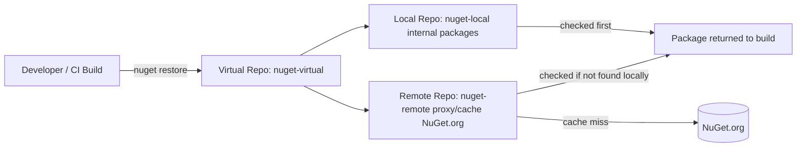
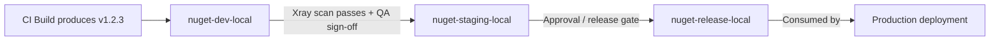

# JFrog Artifactory — Senior .NET Interview: Quick Revision Notes

> Yeh guide se derived quick-revision notes hain — har section (Core Concepts se le kar Terraform/CDKTF, comparisons, aur sample Q&A tak) cover kiya gaya hai, concise **Q/A** + tight bullets format mein. Focus: nuance, trade-offs, aur "why".

---

## Core Concepts

### JFrog Artifactory kya hai

**Q: Ek line mein Artifactory kya hai?**
A: Ek **universal binary repository manager** — build artifacts (packages, containers, libraries) ko secure, scalable, access-controlled tarike se store, version, aur distribute karta hai. DevOps toolchain ka "kya build hua aur kya ship hua" ka single source of truth.

- **Senior framing:** yeh sirf "NuGet packages rakhne ki jagah" nahi — source control aur production ke beech ka **artifact provenance aur supply-chain control point** hai.
- Production tak jaane wala har binary exact commit, build, aur dependency set tak **traceable** hona chahiye.

### Kyun Use Karein

- Binaries, Docker images, Helm charts, etc. ke liye **central repository**.
- Multiple package types: Maven, npm, **NuGet**, PyPI, Docker, Helm, RPM — ek hi platform, kayi single-purpose registries ke bajaye.
- External registries (Maven Central, npm, NuGet.org, Docker Hub) ke liye **caching + proxying** — faster builds, kam external dependency.
- CI/CD integration: Jenkins, GitHub Actions, GitLab CI, Azure DevOps.
- Security: access control, Xray vulnerability scanning, license compliance.
- Deployment: **Cloud (SaaS)** ya **On-Prem (self-hosted)**.

**Q: Directly NuGet.org / npmjs.com use karne se better kyun?**
A:
- **Supply-chain risk** — public registry outage, yanked package, ya malicious dependency (typosquatting, dependency confusion) build ko break/compromise kar sakti hai. Private proxy/cache control + fallback deta hai.
- **Compliance** — regulated industries ko auditable, access-controlled store chahiye; prod builds directly public internet par point nahi kar sakte.
- **Performance** — caching se repeat builds har baar internet se re-download nahi karte (CI scale par bada fayda).

### Key Features

1. **Repository Management** — local/remote/virtual repos; per-repo aur per-path fine-grained access control (permission targets).
2. **Universal Binary Repository** — har package type ke native dependency semantics ke saath.
3. **Build Integration** — Jenkins, Azure DevOps, GitHub Actions, Bitbucket; artifact storage, versioning, build-info capture.
4. **Security & Compliance** — Xray scanning; access tokens, LDAP, SSO, RBAC.
5. **High Availability & Scalability** — multi-node clustering, geo-replication.

---

## Repository Types

### Local, Remote, Virtual Repositories

| Type | Purpose | Kaun write karta hai |
|---|---|---|
| **Local** | Internally build kiye artifacts store (team ke `.nupkg`) | Aapki CI pipeline (push) |
| **Remote** | External registry ka proxy/cache (NuGet.org, npm) | Artifactory khud (pull-through cache); consumers read-only |
| **Virtual** | Multiple local + remote repos ko ek URL ke peeche aggregate | N/A — routing/aggregation layer, physical storage nahi |

**Sabse important interview point:** developers aur CI ko **almost always virtual repo** par point karo, kabhi directly local/remote par nahi. Isse stable URL/feed milta hai chahe backing repos reorganize ho jaayen, aur transparent promotion + proxying enable hota hai.

### Resolution Order in Virtual Repositories

**Q: Virtual repo requests kaise resolve karta hai, aur order kyun matter karta hai?**
A: Member repos ko ek **configured order** mein check karta hai (**local pehle**, phir remote/cached — recommended pattern). Do reasons:

1. **Correctness** — internal package name public package se collide kare to order decide karta hai kaun jeetega.
2. **Dependency confusion attacks** — attacker public registry par aapke internal package jaise naam wala malicious package publish karta hai. Agar virtual repo local se pehle remote check kare, to build silently attacker ka package pull kar sakti hai.

**Mitigations:**
- Virtual repo mein hamesha **remote se pehle local** resolve karo.
- **Scoped/prefixed** internal package names (jaise `Contoso.*`).
- Remote repos par **include/exclude patterns** — internal namespace kabhi externally resolve na ho.



### NuGet-Specific Repository Setup for .NET Teams

Practical setup (interviewer expectation):
- **NuGet local repo** (`nuget-local`) — team-published artifacts.
- **NuGet remote repo** (`nuget-remote`) → `https://api.nuget.org/v3/index.json` (proxy/cache public packages).
- **NuGet virtual repo** (`nuget`) — dono combine; yehi single feed URL har `NuGet.Config` / CI job reference kare.

```xml
<?xml version="1.0" encoding="utf-8"?>
<configuration>
  <packageSources>
    <clear />
    <add key="corp-artifactory" value="https://artifactory.example.com/artifactory/api/nuget/v3/nuget" />
  </packageSources>
  <packageSourceCredentials>
    <corp-artifactory>
      <add key="Username" value="%ARTIFACTORY_USER%" />
      <add key="ClearTextPassword" value="%ARTIFACTORY_API_KEY%" />
    </corp-artifactory>
  </packageSourceCredentials>
</configuration>
```

```bash
dotnet nuget push my-package.1.0.0.nupkg -s corp-artifactory -k %ARTIFACTORY_API_KEY%
```

- **Gotcha (v2 vs v3):** Artifactory legacy NuGet **v2** aur **v3** (JSON, faster) dono support karta hai. Modern `dotnet` CLI ke liye hamesha **v3** (`api/nuget/v3/<repo>`) prefer karo; v2 slow hai, mainly legacy `nuget.exe` compatibility ke liye.

---

## Using Artifactory in a Pipeline

### Manual Upload/Download Examples

```bash
# cURL se artifact upload (Maven example)
curl -u user:password -T my-app.jar \
  "http://artifactory.example.com/artifactory/libs-release-local/com/myapp/my-app/1.0.0/my-app-1.0.0.jar"

# Docker image pull
docker login artifactory.example.com
docker pull artifactory.example.com/my-repo/my-image:latest
```

### JFrog CLI

```bash
# Install
curl -fL https://getcli.jfrog.io | sh
# Configure credentials (interactive)
./jfrog config add
# Upload artifact
./jfrog rt upload "build/*.jar" libs-release-local/
```

**Q: Raw `curl`/`docker` se JFrog CLI better kyun?**
A: Retries/checksums handle karta hai, **build-info collection** support karta hai (`build-collect-env`, `build-publish`), aur ek consistent tool mein Xray scanning (`build-scan`) ke saath integrate hota hai — sabhi package types ke across.

### GitHub Actions Example

```yaml
name: Build and Deploy to JFrog
on: push
jobs:
  build:
    runs-on: ubuntu-latest
    steps:
      - name: Checkout Code
        uses: actions/checkout@v3
      - name: Setup JFrog CLI
        run: |
          curl -fL https://getcli.jfrog.io | sh
          ./jfrog config add my-artifactory --url=https://artifactory.example.com --user=${{ secrets.ARTIFACTORY_USER }} --password=${{ secrets.ARTIFACTORY_PASSWORD }}
      - name: Build and Upload Artifact
        run: ./jfrog rt upload "dist/*.jar" my-repo/
```

> **Note:** `--password` se raw user/pass functionally sahi, but best practice nahi. Official `jfrog/setup-jfrog-cli` Action prefer karo — OIDC-based token exchange (koi long-lived secret store nahi). Neeche Access Tokens section dekho.

### Azure DevOps / dotnet CLI Integration

.NET shop mein Azure DevOps zyada likely. Do patterns:
1. **Native Azure Artifacts + Artifactory as upstream** — Azure feed ka upstream source Artifactory virtual repo (less common, extra hop).
2. **Direct Artifactory integration (typical enterprise)** — JFrog Azure DevOps extension ya plain CLI YAML:

```yaml
steps:
  - task: NuGetAuthenticate@1
  - script: |
      dotnet restore --source https://artifactory.example.com/artifactory/api/nuget/v3/nuget
      dotnet build
      dotnet nuget push "**/*.nupkg" -s https://artifactory.example.com/artifactory/api/nuget/v3/nuget -k $(ARTIFACTORY_API_KEY)
    displayName: 'Restore, Build, Push to Artifactory'
```

**Q: YAML mein API key hardcode karne se kaise bachte ho?**
A: Azure Key Vault-backed variable groups, ya service connections, pipeline secrets/masked variables ke roop mein injected — kabhi repo mein committed nahi.

---

## Intermediate Topics

### Artifact Promotion Between Environments

**Q: Ek build ko rebuild kiye bina dev → staging → prod kaise promote karte ho?**
A: **Principle: build once, promote many times.** Same binary ek baar build karo, phir wahi exact artifact ko repos ke through move/copy/tag karo jo pipeline stages represent karte hain. Guarantee: jo test hua wahi ship hota hai (koi drift nahi).

- Typical layout: `nuget-dev-local` → `nuget-staging-local` → `nuget-release-local` (ya property/tag-based promotion single repo ke andar, jaise `promotion.status=released`).



**Mechanics:**
- `jfrog rt build-promote` ya **Promotion API** (`POST /api/build/promote/{buildName}/{buildNumber}`) — artifacts + build-info ko repos ke beech move/copy, optionally properties add.
- Promotion ko **Xray scan results** (no critical CVEs) aur/ya manual approval par gate kar sakte ho — yehi release governance without rebuild.
- Same physical artifact (same SHA256) move hota hai → true **immutability guarantees**; audits ke liye critical ("prove karo prod mein wahi hai jo scan+approve hua").

### Retention and Cleanup Policies

**Q: Yeh kyun matter karta hai?**
A: Local repos snapshot/pre-release builds aur cached remote artifacts default roop se indefinitely accumulate karte hain → storage cost badhta, searches/indexing slow.

**Approaches:**
- **Retention/cleanup policies** (modern Artifactory native feature) — rules jaise "N days purane artifacts delete jinme last M days mein koi download nahi" (non-release repos ke liye).
- **AQL-driven cleanup scripts** (classic/portable, schedule par run):
```sql
items.find({
  "repo": "nuget-dev-local",
  "created": {"$before": "30d"}
})
```
  phir result set ko delete operation mein feed karo.
- **Remote repo cache eviction** — cached artifacts unused-for-N-days basis par evict; local retention se independent; pure cache hygiene (compliance concern nahi).
- **Release repos exempt** — cleanup ko almost always `*-release-local` exclude karna chahiye; sirf dev/snapshot/staging prune karo.
- Delete karne se pehle legal/compliance retention minimums (SOX, industry rules) consider karo — retention ek deliberate, documented decision ho, sirf "disk save" nahi.

### Build-Info, Provenance, and SBOM

- **Build-info** = JSON blob jo Artifactory har build ke liye capture karta hai: kaunse artifacts produce hue, kaunsi dependencies resolve hui (checksums ke saath), kaunsi CI job/VCS revision, env vars, issues/commits. `jfrog rt build-publish` ya build-aware upload/download commands se auto-published.
- Yehi **promotion**, **build comparison** ("build 41 vs 42 mein kya change hua"), aur running prod binary ko source commit tak **full traceability** power karta hai.
- **SBOM (Software Bill of Materials)** — Xray/build-info + dependency graph se CycloneDX/SPDX SBOMs generate. Government/enterprise vendors ke liye hard compliance requirement.
- **Provenance** — signing ke saath combined, build-info + SBOM = chain of custody: source commit → build → dependencies → artifact → scan results → promotion → deployment. Yeh **SLSA** framework compliance ka requirement; 2025-26 supply-chain attacks (SolarWinds-style, npm/PyPI compromises) ki wajah se live interview topic.

---

## Advanced Topics

### JFrog Xray — Security & License Scanning

- Xray **recursive dependency-graph analysis** karta hai — sirf built artifact nahi, use unpack karke full transitive tree walk karta hai, har component ko CVE + license DB ke against match.
- **Do integration points:**
  1. **Repository-level scanning** — watched repo mein jo aaye use scan (continuous; newly-disclosed CVEs ko already-stored artifacts mein catch karta hai, sirf build time nahi).
  2. **Build-level scanning** (`jfrog rt build-scan`) — CI mein specific build ka dependency graph scan; policy violation par **pipeline fail** (critical CVE block, disallowed license jaise GPL in proprietary block).
- **Repo-level scanning kyun zyada matter karta hai:** package aaj clean, 6 mahine baad us version ke liye CVE disclose. Continuous scanning already-sitting artifacts ko re-flag karta hai — build-time-only check (jaise one-off `dotnet list package --vulnerable`) yeh kabhi nahi pakdega.
- **License compliance:** copyleft (GPL, AGPL) ko flag/block jo closed-source product ke incompatible. Common trick question: "koi GPL library accidentally pull na kar le kaise roka?"
- **Trade-off/gotcha:** Xray **paid add-on** hai, free/base tier mein nahi — licensing nuance.

### Immutability, Versioning, and Reproducible Builds

- Local release repos ko **immutable** configure karo — ek baar `my-app-1.0.0.nupkg` publish, same version number par different bytes se overwrite kabhi nahi. Enforce: repo config (overwrite disallow) + team convention (semver discipline).
- **Contrast:** snapshot/pre-release repos (Maven `-SNAPSHOT`, NuGet `-beta`/`-ci`) mutable/overwritable expected — yehi snapshot ka point hai.
- **Kyun matter karta hai:** agar `1.0.0` silently change ho sake, to kahin kya deployed hai reason nahi kar sakte — cache poisoning possible (ek server "old" 1.0.0 cache kare, doosra "new" pull kare), rollback unreliable.
- **Checksums (SHA-1/SHA-256)** har artifact ke liye stored → tampering/accidental overwrite detect; supply-chain integrity verification se juda, build-info/provenance ka basis.
- **Reproducible builds** (stretch topic): ideal = same commit + locked deps se bit-for-bit identical artifact. Artifactory khud guarantee nahi karta (yeh build-tooling concern — deterministic compilation, `packages.lock.json`), but immutable storage + build-info woh infra piece hai jo reproducibility verify karna possible banata hai.

### Access Tokens, Identity, and Securing Feeds

- **API Keys (legacy)** — JFrog ne access tokens ke favor mein deprecate kiya; older docs mein dikhein to migrate off karo.
- **Access Tokens** — scoped, expiring, revocable JWT tokens; specific identity/repo/permission set ke liye scope. **Modern recommended CI credential.**
- **Platform-native identity / OIDC** — current best practice: Artifactory aur CI provider (GitHub Actions, Azure DevOps) ke beech **OIDC trust** configure karo; pipeline runtime par short-lived OIDC token ko short-lived Artifactory token se exchange kare — koi long-lived secret store hi nahi. "Secrets sprawl" problem address karta hai.
- **RBAC / Permission Targets** — permissions har repo (ya path pattern) par users/groups ko, globally nahi. Least-privilege: CI service account ko *write* sirf us local repo par jismein publish karta hai, *read* sirf us virtual repo par jo consume karta hai — admin/global rights nahi.
- **LDAP/SSO (human users: SAML/OIDC)** — identity centralize; artifact access wahi offboarding/lifecycle follow kare. Audit: "prove karo terminated employee ka access everywhere revoke hua."
- **Gotcha:** shared service-account password (dozen pipelines ke across) rotate karna painful/risky. Scoped, short-lived, per-pipeline tokens (ya OIDC federation) isse entirely avoid.

### Terraform Provider for Artifactory and CDKTF-Driven Provisioning

**Q: Ek new team ke Artifactory repos UI touch kiye bina kaise provision karoge?**
A: **`jfrog/artifactory` Terraform provider** — har Artifactory object (local/remote/virtual repos, permission targets) ek first-class Terraform resource.

```hcl
terraform {
  required_providers {
    artifactory = {
      source  = "jfrog/artifactory"
      version = "~> 12.0"   # implementation time par current major verify karo
    }
  }
}

provider "artifactory" {
  url          = "https://artifactory.example.com/artifactory"
  access_token = var.artifactory_access_token   # short-lived/scoped token, shared password nahi
}

resource "artifactory_local_nuget_repository" "nuget_local" {
  key = "nuget-local"
}

resource "artifactory_remote_nuget_repository" "nuget_remote" {
  key               = "nuget-remote"
  url               = "https://api.nuget.org/v3/index.json"
  feed_context_path = "api/v3"
}

resource "artifactory_virtual_nuget_repository" "nuget_virtual" {
  key          = "nuget"
  repositories = [
    artifactory_local_nuget_repository.nuget_local.key,
    artifactory_remote_nuget_repository.nuget_remote.key,
  ]
  # resolution order local-first pattern se match
}

resource "artifactory_permission_target" "order_team_nuget" {
  name = "order-team-nuget-publish"
  repo {
    repositories = [artifactory_local_nuget_repository.nuget_local.key]
    actions {
      users {
        name        = "svc-order-ci"
        permissions = ["read", "write", "annotate"]
      }
    }
  }
}
```

**Senior level par kyun matter karta hai:**
- **Repeatable, reviewable provisioning** — repo triple ek PR-reviewed module, manual UI runbook ke bajaye jismein step skip ho sakta hai.
- **Permission targets as code** — least-privilege RBAC enforce/audit aasan jab `artifactory_permission_target` resource version control mein ho, UI checkbox grid ke bajaye.
- **Drift detection** — `terraform plan` out-of-band changes surface karta hai (koi manually UI se repo add kare); GitOps-style value artifact-repo config par applied.
- **Environments ke across consistency** — same module `dev/staging/release` repos ko parameterized names se provision (promotion-stage layout consistently).

**CDKTF-driven provisioning** — candidate ka actual day-to-day IaC surface (TypeScript/C#, raw HCL nahi). Wahi `jfrog/artifactory` provider CDKTF bindings se consumable — Artifactory provisioning rest of infra ke same codebase/language mein (jaise "new-service onboarding" construct jo ECS service + IAM role + Artifactory NuGet repo + permission target ek saath provision kare), out-of-band UI-managed system treat karne ke bajaye.

**Interviewer follow-up: "UI mein click-through se practical benefit kya?"** — Jawab: yeh one-time setup cost nahi (UI ad hoc repo ke liye faster), yeh **scale par repeatability** (40th team ko first jaisa, zero drift), **audit trail** (har permission change ki PR history, tribal knowledge nahi), aur repo lifecycle ko wahi review/approval process se tie karna jisse org baaki infra gate karta hai.

### High Availability & Scalability

- **Multi-node clustering** — LB ke peeche multiple nodes jo common DB + filestore (ya HA storage) share karte hain; reliability/failover + horizontal read/write scaling.
- **Geo-replication** — geographically distributed instances ke across push/pull replication; distributed teams local instance se read karein (continents cross na karein). Latency kam + DR redundancy.
- **Filestore considerations** (apne version/edition ke liye verify karo): Artifactory typically metadata (DB) ko binary storage (filestore — local disk, NFS, ya cloud object storage jaise S3/Azure Blob) se separate karta hai. HA/DR planning ke liye yeh separation samajhna zaroori; common systems-design follow-up ("backup/failover kaise?").

---

## Best Practices

- Developers/CI ko hamesha **virtual** repos par point karo, kabhi local/remote directly nahi.
- Dependency confusion se bachne ke liye virtual repos mein **local-repo-first resolution order** enforce karo.
- **Scoped internal package naming** (company prefix) — namespace collision risk kam.
- Release/local repos ko **immutable** — published versions ka koi overwrite nahi.
- **Build once, promote many** — same artifact ko repo stages ke through promote, rebuild nahi.
- Promotion ko **Xray scan results** par automated policy ke roop mein gate karo, manual checklist nahi.
- CI credentials ke liye **short-lived scoped access tokens ya OIDC federation**, long-lived shared passwords/API keys nahi.
- Har repo/permission target par **least-privilege RBAC**, blanket admin nahi.
- Dev/snapshot par **retention/cleanup policies**; release repos exempt aur retention decisions document.
- Har CI build par **build-info** capture + publish — full traceability + promotion/comparison tooling.
- Raw `curl`/scripting ke bajaye **JFrog CLI ya official CI extensions** — retries, checksums, build-info, Xray free.

## Common Pitfalls

- CI ko directly **remote** (caching bypass) ya **local** (aggregation bypass) repo par point karna, virtual ke bajaye — abstraction break.
- Misconfigured virtual-repo resolution order jo public package ko internal shadow karne de (dependency confusion).
- Xray ko "optional" treat/skip karna — supply-chain blind spot; kam se kam release promotion ko ek scan par gate karo.
- Dev/snapshot repos unbounded grow — storage balloon + search/index degrade.
- Release repos par overwrite allow — "immutable = trusted deployment" guarantee break, "kal kaam kar raha tha" incidents.
- Long-lived passwords/API keys pipeline YAML/unscoped secrets mein — mask, scope, ideally OIDC short-lived tokens.
- **v2 vs v3 NuGet protocol** bhulna — habit/old docs ki wajah se slower legacy v2 endpoint par point karna.
- Assume karna ki HA/clustering aur Xray har license tier mein included — frequently paid add-ons/higher tiers; licensing confirm karo.

---

## Artifactory vs Azure Artifacts vs Nexus

| Dimension | JFrog Artifactory | Azure Artifacts | Sonatype Nexus |
|---|---|---|---|
| Package breadth | Bahut broad (Maven, npm, NuGet, PyPI, Docker, Helm, RPM, Go, Conan) | Narrower (npm, NuGet, Maven, Python, universal); Azure DevOps se tied | Broad, Artifactory jaisa |
| Multi-cloud / on-prem | Strong — SaaS ya self-hosted, cloud-agnostic | Azure DevOps-native; bahar less natural | Strong — self-hosted ya cloud |
| Security scanning | Xray (deep, recursive, paid) | Basic; Defender for DevOps / GitHub Advanced Security par leans | Nexus IQ/Lifecycle (paid), comparable depth |
| CI/CD fit | Broadest (Jenkins, GHA, ADO, GitLab, Bitbucket) | Best-in-class *sirf* fully Azure DevOps mein | Broad, Artifactory jaisa |
| HA / geo-replication | Enterprise clustering + geo-replication (paid) | Microsoft-managed; no user-configurable geo-replication | Nexus HA Pro tier |
| Typical fit | Large orgs, polyglot, multi-cloud/hybrid, strong governance | Fully Azure DevOps committed, zero extra infra | Cost-sensitive, Artifactory-jaisi breadth different pricing |
| Licensing | Per-feature tiers (Xray/HA/geo paid) | ADO ke saath bundled, per-GB + retention | Free OSS core; IQ/HA paid Pro |

**Q: All-Azure-DevOps shop mein Artifactory kab choose karoge?**
A: "Org footprint par depend karta hai." 100% Azure DevOps + NuGet/npm se aage kuch nahi → **Azure Artifacts simpler**, zero extra infra. Artifactory (ya Nexus) apni complexity earn karta hai jab: **multiple CI systems, multiple package ecosystems, multi-cloud/on-prem, ya deep security/compliance (Xray/IQ) + governed promotion workflows** chahiye jo Azure Artifacts natively offer nahi karta.

---

## Advantages and Disadvantages

**Advantages**
- Multiple package types (Maven, npm, NuGet, Docker).
- Caching/proxying → faster builds.
- CI/CD integration → automated deployments.
- Xray security scanning.
- Clustering → HA & scalability.

**Disadvantages**
- Advanced features (Xray, HA, geo-replication) = paid licenses.
- Self-hosted setup complexity.
- Large repos = extra storage (cleanup/retention policies se mitigate).

## Popular Use Cases

- **CI/CD Pipelines** — build artifacts store/manage.
- **Docker Image Management** — private container registry.
- **Dependency Management** — external registries ka proxy.
- **Security & Compliance** — vulnerability scanning.

---

## Sample Interview Q&A

**Q: Local vs remote vs virtual repos, aur developer `NuGet.Config` kise point kare?**
A: Local = own/publish artifacts; remote = external registry proxy/cache; virtual = multiple local/remote ko stable URL peeche aggregate. Dev/CI hamesha **virtual** target karein — backend reorganization se insulate, ek feed jo internal + cached public dono serve kare.

**Q: Dependency confusion attack kaise prevent karoge?**
A: Virtual repo resolution order **remote se pehle local** check kare, internal packages ke liye distinctive **company-prefixed naming**, aur optionally remote repo par include/exclude patterns taaki internal namespace public source se resolve na ho.

**Q: "Build once, promote many" — kya aur kyun?**
A: Binary CI mein exactly ek baar build, phir wahi artifact (build-info + checksum intact) ko repo stages (dev→staging→release) ke through move/copy, Xray scan/approvals se gated. Staging mein tested artifact **byte-for-byte** wahi jo prod ko ship — koi rebuild drift nahi.

**Q: Storage costs kaise control mein rakhte ho?**
A: Dev/snapshot repos par age + download activity basis par retention/cleanup policies (ya AQL scripts), unused cached artifacts ke liye remote-repo cache eviction, aur release/audit repos ko automated deletion se explicitly exempt.

**Q: Xray ka role aur pipeline mein kahan plug in?**
A: Recursive dependency-graph vulnerability + license scanning — continuously repo level par (already-stored artifacts mein new CVEs) aur build time par (`build-scan`), jahan policy violations (critical CVEs, disallowed licenses jaise GPL in closed-source) par pipeline fail/promotion block.

**Q: CI ko kaise authenticate kare — shared username/password YAML mein kya galat?**
A: Scoped short-lived access tokens, ya better OIDC federation (koi long-lived secret nahi). Shared password = single point of compromise, sabhi pipelines ke across rotate karna hard, aur typically least-privilege RBAC ke against over-privileged.

**Q: Released NuGet package ki immutability kya guarantee karta hai, aur kyun matter?**
A: Repo config jo existing version overwrite disallow kare + semver discipline (version reuse nahi) + checksum verification. Matter karta hai kyunki deployments/rollbacks/audits assume karte hain "version 1.0.0" = exactly ek set of bytes forever — mutable release artifacts reproducibility break aur supply-chain tampering mask kar sakte hain.

**Q: Build-info kya hai aur SBOM/provenance se kaise relate?**
A: Metadata jo Artifactory har CI build ke liye capture karta hai — produced artifacts, resolved dependencies (checksums), source revision, environment. Yeh promotion, build comparison, aur SBOM (CycloneDX/SPDX) generation ki foundation — dono milkar commit se deployed artifact tak full chain-of-custody, increasingly compliance requirement (SLSA, government SBOM mandates).
