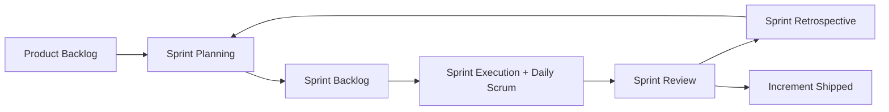
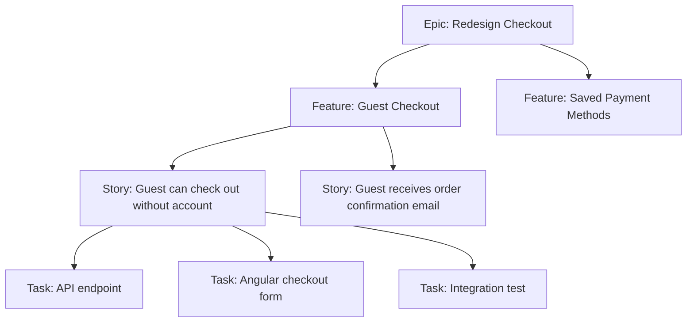
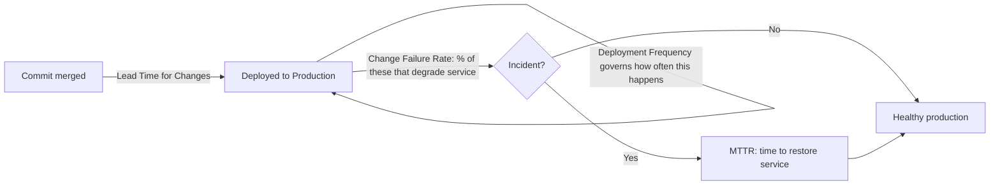
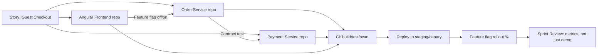
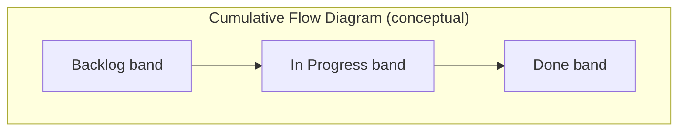

# Agile Interview Revision Notes (Senior .NET Full-Stack / Lead Level)

> Yeh quick-revision notes hain, "R. Agile-Interview-Guide.md" se derive kiye gaye — guide ki har section/topic same order mein cover ki gayi hai, concise Q&A aur tight bullets format mein taaki last-minute brush-up ho sake.

---

## Core Concepts

### Agile kya hai?

**Q:** Agile kya hai — process ya mindset?
**A:** Ek *mindset/values ka set* (Agile Manifesto), rigid process nahi. Iterative + incremental delivery in small cycles (sprints), continuous feedback, collaboration, aur change ke saath adaptability.

**Manifesto ke 4 values:**
- Individuals & interactions **over** processes & tools
- Working software **over** comprehensive documentation
- Customer collaboration **over** contract negotiation
- Responding to change **over** following a plan

**Senior nuance:** Scrum/Kanban/XP/SAFe sab *frameworks* hain jo is mindset ko implement karte hain. Interviewer chahta hai ki aap bata sako ki kab by-the-book Scrum galat tool hai (e.g. chhoti legacy maintenance team ke liye Kanban better).

### Scrum kya hai?

**Q:** Scrum kya define karta hai?
**A:** Agile framework, fixed-length sprints (1–4 weeks, common = 2). Teen cheezein define karta hai:
- **Roles:** Product Owner, Scrum Master, Developers (Scrum Guide 2020+ mein PO/SM bhi "Scrum Team" ka hi part).
- **Artifacts:** Product Backlog, Sprint Backlog, Increment.
- **Events/Ceremonies:** Sprint Planning, Daily Scrum, Sprint Review, Sprint Retrospective, aur Sprint khud ek container event.



### User Story kya hai?

**Q:** User story kya hai, aur yeh spec se kaise alag hai?
**A:** End-user perspective se feature ka lightweight, conversation-driving description — exhaustive spec nahi. Yeh ek *conversation ka placeholder* hai, contract nahi.

**Format:**
```
As a [user/role], I want [feature/capability], so that [benefit/value].
```

**Senior nuance:** Acceptance criteria (aksar Given/When/Then / Gherkin format) hi story ko testable aur "done" banate hain.

```gherkin
Given a registered user on the login page
When they submit valid credentials
Then they are redirected to the dashboard
And a session token is issued
```

### Functional vs Technical (Non-Functional) Requirements

**Q:** Difference?
**A:** Functional = system *kya* karta hai (features). Non-Functional/Technical = system *kaise* perform karta hai (quality attributes + constraints).
- Functional examples: login, add to cart, generate report, reset password.
- NFR examples: API < 500ms, encryption at rest/in transit, 10k concurrent users, mandated Angular + .NET stack.

| Aspect | Functional | Non-Functional |
|---|---|---|
| Answers | System kya karta hai? | System kitna achha karta hai? |
| Example | User password reset kar sakta hai | Reset email 2s mein jaye |
| Testing | Behavioral/acceptance | Load, security, performance, chaos |
| Owner (typical) | BA / PO | Architect / Tech Lead |
| Visibility | Directly visible | Invisible jab tak violate na ho |

### Functional vs Technical Requirements Kaun Define Karta Hai

**A:**
- **Functional:** BA ya PO (stakeholders + end users ke input se).
- **Technical:** Architect / Tech Lead / Dev Team (system design, NFRs, platform constraints).

**Senior nuance:** Yeh hard wall nahi hai. Devs ko functional reqs par pushback dena chahiye jab technical implications ho ("yeh X users ke aage bina redesign scale nahi karega"); POs ko NFR prioritize karne jitna technical samajhna chahiye. Best engineers business ko technical reqs mein *translate* karte hain aur trade-offs *early* surface karte hain.

### Core Scrum Ceremonies

- **Sprint Planning** — Team refined/prioritized backlog se items select karti hai; output = **Sprint Goal + Sprint Backlog**.
- **Daily Standup (Daily Scrum)** — ≤15 min timeboxed sync. Classic 3 Qs: kal kya kiya / aaj kya / blockers?
  - **Senior nuance:** "3 questions" format ab dated maana jata hai — modern guidance Daily Scrum ko *Sprint Goal ki progress* inspect + re-plan karne ke around frame karti hai, SM ko status report dene ke around nahi. Yeh shift mention karna current-knowledge signal karta hai.
- **Sprint Review** — Sprint end par increment ka demo stakeholders ko; product inspect + backlog adapt. Sirf demo nahi, collaborative working session.
- **Sprint Retrospective** — Review ke baad, next planning se pehle. *Process* improvement actions (product nahi): kya achha/bura gaya, concrete actions.

### Definition of Done (DoD)

**Q:** DoD kya hai?
**A:** Shared, team-agreed checklist — item genuinely complete (coded, tested, reviewed, integrated, documented, potentially shippable). Typical .NET/Angular DoD:
- Code complete + main/trunk mein merged
- Unit tests written & passing (coverage threshold met)
- Code review / PR approved
- Integration tests CI mein pass
- Koi naye critical/high static-analysis/security findings nahi (SonarQube etc.)
- Test/staging par deployed & verified
- Acceptance criteria verified
- Docs/README/API contract updated agar applicable

**Gotcha:** DoD *team-wide, per-increment* standard hai — har story par apply hota hai. Story-by-story renegotiate karna maturity problem ka signal.

### Backlog Refinement

**A:** Ongoing process ("grooming") — items ko review, clarify, split, estimate, re-prioritize karna *sprint mein enter hone se pehle*. Recurring event (e.g. weekly/mid-sprint), one-time nahi. Isse backlog ka top hamesha "sprint-ready" rehta hai.

### Agile vs Waterfall

| Aspect | Agile | Waterfall |
|---|---|---|
| Delivery | Iterative, incremental | Sequential, end mein |
| Requirements | Evolve, change embrace | Upfront fixed, change costly |
| Feedback | Continuous (har sprint/demo) | Sirf end/major milestones |
| Risk | Early discover/mitigate | Late discover, expensive fix |
| Documentation | Lightweight, just enough | Heavy, upfront comprehensive |
| Best fit | Uncertain/evolving reqs, digital products | Fixed-scope, regulatory, hardware-coupled |

---

## Intermediate Concepts

### Story Point Estimation

**Q:** Story points kyun, hours kyun nahi?
**A:** Relative (absolute nahi) estimation — stories ko complexity + effort + uncertainty + risk se size karta hai, literal hours nahi. Fibonacci-like scale (1,2,3,5,8,13,21…) — widening gaps larger/less-understood items mein meaningful differentiation force karte hain (false precision avoid).

**Kyun:** Humans absolute time estimation mein bure, relative comparison mein achhe. Isse estimation single dev ki speed se decouple hota hai — important jab velocity team ke across use ho.

### Changing Requirements Handle Karna

**A:** Agile change *expect* karta hai. Changes accept + manage hote hain **PO ki backlog reprioritization** ke through — naye/changed reqs naye/modified backlog items bante hain, sab ke against re-rank. Active sprint churn se protected; *backlog* sprints ke beech change absorb karta hai (locked sprint mein disruptive inject nahi).

### Definition of Ready (DoR)

**A:** Criteria jo story sprint mein pull hone se pehle satisfy kare:
- Clear, testable acceptance criteria
- Dependencies identified & ideally resolved/sequenced
- Team dwara estimated
- Sprint ke andar fit hone jitni small
- UX/designs attached (agar relevant)
- Koi open questions nahi jo implementation block karein

### DoD vs DoR — Kyun Dono Matter Karte Hain

**Q:** DoR vs DoD?
**A:** Favorite senior trap — candidates aksar sirf ek jaante hain.

| | DoR | DoD |
|---|---|---|
| Applies to | Story *enter hone se pehle* | Story/increment *complete hone ke baad* |
| Purpose | Ill-defined work start hone se roka | Untested work ko "done" kehne se roka |
| Owned by | Team (PO + team, refinement mein enforce) | Team (review/PR/CI mein enforce) |
| Failure if missing | Mid-sprint churn, blocked stories, re-estimation | "Done" jo shippable nahi, hidden tech debt, QA surprises |

**Kyun matter:** DoR failures = *refinement* discipline problem; DoD failures = *quality/engineering* discipline problem. Yeh diagnose karna (konsi tooti, aur sahi ceremony se fix) = lead-level judgment.

### Epic vs Feature vs Story vs Task

- **Epic** = Large initiative, multiple sprints/releases, ek business goal ("Checkout flow redesign").
- **Feature** = Epic ke andar functional grouping, potentially multi-sprint ("Guest checkout").
- **Story** = User-focused, sprint-sized requirement + acceptance criteria ("As a guest, I want to check out without an account").
- **Task** = Technical, implementation-level sub-unit ("`GuestCheckoutController` endpoint", "EF Core migration for `GuestOrder` table").



### INVEST Principle for User Stories

Well-formed story checklist:
- **I**ndependent — hard sequencing ke bina develop/deliver ho sake
- **N**egotiable — details open, rigid contract nahi
- **V**aluable — user/business ko clear value
- **E**stimable — size karne jitni clarity ho
- **S**mall — ek sprint mein fit
- **T**estable — clear, verifiable acceptance criteria

### Cross-Functional Teams

**A:** Team jiske paas idea-to-production saare skills hon (devs, QA, UX/UI, DevOps, kabhi embedded DBA/SRE) — external team par depend kiye bina.

**Senior nuance:** Point = *hand-off latency* aur *queueing* minimize karna. Jab full cross-functionality possible na ho (e.g. shared DBA/security team): rotating liaison embed karo ya shared team ke saath explicit SLAs banao — constraint ignore mat karo.

### Agile Documentation Philosophy

**A:** "Just enough" documentation, comprehensive upfront specs nahi — "working software over comprehensive documentation". Yeh "no documentation" nahi hai. Practically (.NET/Angular): living API contracts (OpenAPI/Swagger), ADRs (Architecture Decision Records), story-level acceptance criteria — yeh large req docs ko *replace* karte hain, docs ko lighter/current/code-ke-closer banate hain.

---

## Advanced Concepts

### Scrum vs Kanban

| Aspect | Scrum | Kanban |
|---|---|---|
| Cadence | Fixed-length sprints | Continuous flow, no fixed iteration |
| Roles | Defined (PO, SM, Dev) | Koi prescribed roles nahi |
| Ceremonies | Planning, standup, review, retro | Optional; aksar standup + replenishment |
| Commitment | Ek sprint commit | Capacity free hote hi pull |
| Key constraint | Sprint length/capacity | **WIP limits** per column |
| Change mid-cycle | Discouraged | Naturally accommodate |
| Best fit | Plannable feature work | Support/ops/maintenance, unpredictable inflow |
| Core metric | Velocity (points/sprint) | Cycle time / lead time, throughput |

### Scrum vs Kanban vs SAFe vs Scrumban

**Q:** Sahi framework kaise choose karte ho? (Scrum cargo-cult test)

| Framework | Best for | Trade-off |
|---|---|---|
| **Scrum** | Plannable scope, naye features (product teams) | Interrupt-driven work (support/ops) ke liye rigid cadence poor fit |
| **Kanban** | Support/maintenance, ops, unpredictable inbound | Built-in retro/planning cadence nahi jab tak add na karo |
| **Scrumban** | Scrum→flow transition, ya planned + unplanned dono | Hybrid (sprints + WIP limits); tune na ho to "neither" feel |
| **SAFe** | Large orgs (50+ engineers, multi-team), portfolio alignment | Heavyweight; "Waterfall in Agile clothing" risk agar PI Planning galat |

**Follow-up:** "Scrum kab use nahi karoge?" → Production-support/BAU team with constant interrupts ke liye 2-week commitments poor fit; Kanban + WIP limits + SLA-based classes of service better. Bhi: early discovery/spike work Kanban-style flow mein better.

### Scope Change Mid-Sprint Handle Karna

**A:** Ideally avoid (sprint = protected commitment). Agar genuinely required:
1. PO priority ko sprint goal ke against re-evaluate karta hai.
2. Team impact discuss karti hai (capacity, dependencies, risk).
3. Ya item *next* sprint, ya ek existing lower-value item *swap out* — kaam pile mat karo.

**Gotcha:** Candidate jo kahe "bas squeeze kar lenge" — galat. Correct instinct = trade-off, addition nahi (sprint integrity + sustainable pace protect).

### Velocity aur Iska Use

**A:** Ek team ka sprint mein completed work (story points), recent sprints ka average. Uses:
- Sprint planning (kitna pull karein)
- Delivery timeline / release forecasting
- Capacity/staffing conversations

**Gotcha (common senior trap):** Velocity = *team-specific, relative* planning tool — **kabhi** productivity/performance metric nahi, aur teams ke across comparable nahi (different teams alag calibrate karti hain). Cross-team/people compare karna = textbook anti-pattern + red flag.

### Velocity vs Throughput vs Cycle Time

| Metric | Definition | Framework | Kya batata hai |
|---|---|---|---|
| **Velocity** | Story points per sprint | Scrum | Future sprints plan (same team only) |
| **Throughput** | Items count per unit time (size irrelevant) | Kanban/flow | Delivery rate predictability, estimation-independent |
| **Cycle Time** | Start→done ka time | Kanban/flow | Responsiveness/flow efficiency; jo customers feel karte hain |
| **Lead Time** | Request→deliver ka time | Dono | End-to-end responsiveness, pre-start queue time include |

**Little's Law:** `WIP = Throughput × Cycle Time`

**Kyun matter:** Velocity great dikh sakti hai jab cycle time balloon ho rahi ho (team "busy" par items too much WIP se half-done pade). Sirf velocity dekhne wala lead yeh miss karta hai — Little's Law + WIP limits = real fix lever.

### Agile Mein Technical Debt Manage Karna

- Debt items explicitly backlog mein add karo (visible banao — invisible debt kabhi prioritize nahi hoti).
- Refactoring ke liye dedicated capacity (common: har sprint 10–20%, ya periodic "tech debt sprints").
- Code quality continuously improve — reviews, static analysis (SonarQube/Roslyn), automated tests — big-bang cleanup nahi.
- Debt items ko business impact se tie karo ("yeh debt feature X ko Y% slow kar raha hai") — PO ke liye prioritize karna easy.

**Senior nuance:** Debt ko PO/stakeholder terms mein *quantify + communicate* karo (velocity drag, incident rate, onboarding time), sirf "messy hai" nahi.

### Backlog Prioritization

**A:** PO backlog items order karta hai based on: business value, risk, dependencies, customer needs.

### Prioritization Frameworks (WSJF, MoSCoW, Kano, RICE)

- **WSJF (Weighted Shortest Job First)** — SAFe mein heavy: `WSJF = Cost of Delay / Job Size`. Cost of Delay = user/business value + time criticality + risk reduction/opportunity enablement. High-value, low-effort, time-sensitive work favor.
- **MoSCoW** — Must / Should / Could / Won't have. Scope negotiation + MVP definition.
- **Kano Model** — Basic (expected), Performance (more = better), Delighters (unexpected), Indifferent/Reverse. UX-driven prioritization.
- **RICE** — `(Reach × Impact × Confidence) / Effort`. Product-led orgs; explicit confidence estimation assumption risk surface karta hai.

**Interviewer angle:** WSJF naam lena = SAFe/scaled-Agile exposure signal (enterprise .NET shops mein common).

### Agile Metrics

- Velocity
- Burn-down chart (remaining work vs time, sprint/release)
- Cycle time
- Lead time
- Sprint predictability (committed vs completed)

*(Throughput + Little's Law upar dekho; dashboard/reporting neeche.)*

### DORA Metrics

**Q:** DORA metrics kya, aur Agile guide mein kyun?
**A:** Organizations (individual teams nahi) delivery performance measure karne ka industry standard. Origin: **DORA** (DevOps Research and Assessment, ab Google Cloud) — years ke survey data se 4 metrics jo high-performers ke saath sabse strongly correlate karte hain. Framework-agnostic (Scrum/Kanban/anything), *delivery pipeline* level par outcomes measure.

**4 key metrics:**

| Metric | Definition | Measure |
|---|---|---|
| **Deployment Frequency** | Kitni baar production mein successfully release | Batch size / cadence — elite = on-demand (din mein multiple); low = <1/month |
| **Lead Time for Changes** | Commit merge → production run | Pipeline speed (Agile "Lead Time" *story* ke liye hai; DORA commit-to-prod, CI/CD efficiency) |
| **Change Failure Rate** | Deployments % jo degraded service karein (rollback/hotfix/patch) | Deployment quality/risk — prod mein pahunchne *ke baad* wale failures |
| **MTTR (Mean Time to Recovery)** | Incident ke baad service restore karne ka time | Resilience/operational recovery (reliability metric, speed nahi) |



**Yeh 4 kyun / kyun standard:** Do axes mein cluster — **throughput** (Deployment Frequency + Lead Time = kitna fast) aur **stability** (Change Failure Rate + MTTR = kitna safe). Critical finding: elite orgs *dono* par simultaneously strong — speed aur stability trade-off nahi hain. Isse "safe rehne ke liye slow down" = *low* DevOps maturity ka sign, caution nahi.

**Agile ceremonies / backlog se connect (senior synthesis):**
- **Velocity great, MTTR poor ho sakta hai** — velocity sirf sprint mein complete points batati hai, prod mein us kaam ka kya hota hai nahi. Team high velocity ship karti rahe jabki instability accumulate ho (rising CFR, lengthening MTTR) — Scrum metrics yeh expose nahi karte. DORA "Done" ke *baad* measure karta hai.
- **Retros ko DORA trends dekhne chahiye**, sirf velocity/burn-down nahi — warna *started* work optimize karoge, *delivered* work ki health nahi. CFR + MTTR trends "busy but fragile" pattern surface karte hain.
- **Backlog health tie:** rising CFR / lengthening MTTR = backlog-prioritization signal → real-priority tech-debt/reliability items generate karo (Managing Technical Debt dekho), separate "ops problem" nahi. PO ko "ek aur feature" vs "deployment safety" weigh karne ka data milta hai.
- **Deployment Frequency = batch-size health proxy:** low freq = large risky batches (Deployment Strategies knowledge se tie) → future CFR problems ka leading indicator.
- **Practical framing:** "Velocity batati hai team ek sprint mein *start-finish* predictable hai. DORA batata hai wo kaam *safe aur fast to ship* hai. Lead ko dono chahiye — velocity-only team burn-down par productive dikhe par DORA quietly fragile, slow-to-recover prod reveal kare."

### Blockers Handle Karna

- Daily standup mein immediately raise karo — wait mat karo.
- Pehle team ke saath collaborate (pair up, peer knowledge se unblock).
- SM ke through escalate agar blocker external/organizational (dusri team, infra access, vendor).

### Estimation Mein Developer Ka Role

- Planning poker / estimation sessions mein actively participate.
- Technical complexity + risk insight do jo PO nahi de sakta ("legacy payment integration touch karta hai, hidden 5 hai, 2 nahi").
- Sprint planning mein stories ko technical tasks mein break karo.

### Planning Poker Se Aage Estimation Techniques

- **Planning Poker** — discussion-driven consensus; calibration + hidden complexity surface.
- **T-Shirt Sizing (XS/S/M/L/XL)** — fast, coarse; early backlog/epic sizing before detailed refinement.
- **Affinity Estimation / Silent Grouping** — team silently stories ko relative buckets mein rakhti hai, phir sirf outliers discuss — bahut fast for large backlogs (50+ stories in quarterly planning).
- **Bucket System** — affinity jaisa, predefined point buckets, very large-scale (SAFe PI Planning).
- **#NoEstimates** — provocative counter: points ke bajaye stories ko roughly-equal size mein slice karo, forecasting ke liye *throughput* (items/week) use karo. Awareness dikhana estimation = means, end nahi ka signal (chahe practice na karo).

### Jab Sprint Goals Achieve Nahi Hote

- Retrospective mein root cause analyze karo — note karke aage mat badho.
- Distinguish: *Planning/estimation* failures (over-committed, poor refinement) vs *execution* (unexpected complexity, blockers, absence) vs *external* (dependency delays, environment).
- Future planning specifically adjust — DoR tighten, known risk categories ke liye buffer — generic "conservatively estimate karenge" nahi.
- Repeated pattern = systemic signal SM ke liye, one-off retro item nahi.

### Real-World Challenge: PO Mid-Sprint Urgent Work Add Karta Hai

- Team ke saath openly impact discuss (capacity, commitments, sprint goal risk).
- PO ka "urgent" already-committed ko automatically override nahi karta — true priority evaluate karo.
- Resolution = *trade*, addition nahi: existing lower-priority item replace, ya next sprint defer — jab tak genuinely sprint-goal-threatening na ho.

**Senior nuance:** "Urgent business request" vs "production incident/hotfix" distinguish karo. Baad wala legitimately interrupt karta hai (DoD/process P1 incidents ke liye exception carve out karti hai); pehle wale ko still trade-off conversation se guzarna chahiye.

### Microservices / CI-CD Context Mein Agile

- **Story slicing across service boundaries:** "Vertical slice" story (guest checkout) multiple services/repos span karti hai. Har deliverable ko *ek* service/repo ke andar independently testable banao; cross-service dependencies contract tests (e.g. **Pact**) se decouple karo, lockstep releases nahi.
- **Trunk-based development + feature flags** long-lived branches replace karte hain — story "done" (merged, deployed) ho sakti hai bina *released* (users ko exposed) hue → deployment ko release se decouple, true continuous delivery.
- **DoD expand hoti hai:** pipeline gates pass (build, unit, integration, security scan), staging/canary par deployed, (agar flagged) flag ke peeche verified — sirf "code complete" nahi.
- **Sprint Review as release gate less meaningful** — CI/CD se software review se pehle prod mein ho sakta hai; focus outcomes/metrics validate (A/B results, adoption) ki taraf shift, first-time demo nahi.
- **Cross-team dependency management** dominant coordination problem jab story ko 3+ services mein coordinated changes (different teams) chahiye — SAFe PI Planning + dependency boards yahi solve karte hain.



### Agile Scale Karna: SAFe, LeSS, aur Spotify Model

- **SAFe** — team Scrum/Kanban ke upar Program (Agile Release Train, PI Planning har 8–12 weeks) + Portfolio layers. Strength: multi-team coordination, shared roadmaps/dependencies. Weakness: Waterfall-like upfront planning reintroduce ho sakti hai agar PI Planning galat.
- **LeSS (Large-Scale Scrum)** — Scrum rules directly multiple teams tak extend (ek Product Backlog + ek Sprint share), added process/roles minimize (SAFe ke unlike). Coordination layers ke bajaye org ko "descale" karta hai.
- **Spotify Model (Squads/Tribes/Chapters/Guilds)** — framework nahi, organizational topology: autonomous cross-functional squads business domains se aligned; chapters/guilds cross-cutting skill communities. Widely referenced, par Spotify khud iske parts se move away — over-cite mat karo as current best practice.
- **Practical senior take:** *Scaling problem* actually *dependency-management + communication* problem hai — framework kam matter karta hai, isse zyada ki org cross-team dependencies visibly manage kare (dependency boards, PI Planning, Scrum-of-Scrums) mid-sprint discover karne ke bajaye.

---

## Best Practices

- Sprints protected rakho — genuine incidents chhod ke mid-sprint scope injection avoid.
- Tech debt backlog par visible + business-impact framing, sirf "cleanup" nahi.
- Planning se pehle DoR aur "done" se pehle DoD enforce — dono, consistently, case-by-case nahi.
- Velocity sirf *same team* forward planning — kabhi cross-team/productivity nahi.
- Stories vertically slice (thin end-to-end), horizontally (all-UI phir all-API) nahi — har story demonstrable value de.
- DoD verification automate (CI gates: tests/coverage/security) — manual checklist honesty par rely mat karo.
- Retros action-oriented — action items completion tak track/revisit, venting sessions mat banne do.
- Scaled contexts: cross-team dependencies early visible (dependency boards, PI Planning), integration time par nahi.

## Agile Anti-Patterns

- **Water-Scrum-Fall** — Scrum ceremonies waterfall org par bolt (upfront big design + end hardening/UAT); sprints status theater ban jate hain.
- **Zombie Scrum** — motions (standups, retros) bina real inspect-and-adapt; action items kuch change nahi karte.
- **Velocity as productivity metric / point inflation** — teams points inflate karti hain "improving" velocity dikhane ko, ya mgmt cross-team compare karta hai → gaming incentivize.
- **Standup as status report to management** — top-down reporting ritual, peer re-planning nahi → psychological safety kill.
- **PO-as-bottleneck / absent PO** — har micro-decision approve (bottleneck) ya unavailable (team blocked/guessing) — dono role violate.
- **Scope creep disguised as "just one more thing"** — mid-sprint small additions cumulatively sprint goal blow; fix = same trade-off discipline.
- **Retrospective without action** — problems repeatedly identify bina owners/deadlines.
- **Estimation theater** — planning poker chalana jabki delivery date already externally committed → estimate meaningless.
- **Copy-pasted "Agile at scale"** — SAFe/LeSS wholesale adopt bina underlying dependency/communication problem address kiye.

## Common Pitfalls

- Story points ko hours treat karna (relative estimation + cross-team comparability break).
- Sprint Review ko "bas demo" banana, genuine inspect-and-adapt nahi.
- Backlog refinement skip → under-specified stories planning mein (DoR violated).
- DoD ko acceptance criteria se conflate — DoD story-agnostic/team-wide; AC story-specific.
- Tech debt ignore jab tak prod incident na kare, continuously track/pay-down ke bajaye.
- Scrum ko dogmatically use un kaamon ke liye (pure support/ops) jo Kanban/flow mein better fit.
- Sprint overload kyunki "team ne haan kaha" pressure mein, capacity/velocity data ke bajaye.

## Agile Metrics Dashboards aur Leadership Ko Reporting

**Q:** VP ko team health kaise report karoge jisko story points se matlab nahi?
- Team metrics (velocity, burn-down) ko business-facing mein translate: **predictability** (committed vs delivered %), **lead time to production**, **defect escape rate** — raw point counts nahi.
- **Goodhart's Law** se saavdhaan ("jab measure target ban jata hai, wo achha measure nahi rehta") — leadership ko velocity publish karna point inflation lead karta hai; throughput/cycle-time trends report karo (game karna harder).
- **Cumulative Flow Diagrams (CFDs)** undervalued par excellent — visually dikhate hain *kaam kaha stuck hai* (widening "in progress" band = bottleneck) bina story points samjhaye.



---

## Sample Interview Q&A

**Q: Ad-hoc team ko Scrum kaise introduce karoge?**
Pain points se start karo, ceremonies se nahi — pata karo kya hurt kar raha hai (missed deadlines, unclear priorities, rework). Lightweight backlog + short (1–2 week) sprint cadence + real DoD + day-one retrospective. Big-bang SAFe/Scrum artifacts avoid; pehle kuch working sprints se trust kamao, phir ceremony weight add.

**Q: 3 sprints velocity flat par team "busier than ever" — kya investigate karoge?**
"Busier" = more WIP hai ya more throughput? Cycle time + WIP counts dekho, sirf velocity nahi. Hidden work (unplanned interrupts, prod support) board par capture nahi hua. Point inflation / estimation drift. Increased context-switching (per person too many concurrent stories). Velocity lagging aggregate signal — cause cycle time + WIP diagnose karte hain.

**Q: Stakeholder fixed date + fixed scope chahta hai par Scrum org hai — reconcile?**
Fixed date + scope + quality = "iron triangle" conflict — kuch flex karna hi hoga. MVP scope negotiate karo upfront (MoSCoW), prioritized scope ke against date commit, backlog ko "nice to have" absorb karne do (date paas aaye to cut). Sprint-by-sprint velocity-based forecasting se verify, single upfront estimate nahi.

**Q: DoD actually honored hai vs wiki page par — kaise pata?**
Jitna ho sake CI/CD gates mein automate (tests, coverage, security scans, static analysis) → pipeline-enforced, self-reported nahi. Non-automatable parts (QA review) board workflow se track (story "QA" column se guzre bina Done nahi, explicit checklist) + retro mein sporadically audit agar escaped-defects dikhein.

**Q: PO backlog prioritize vs SM process facilitate — overlap/conflict kaha?**
PO *kya/kyun* own karta hai (value, priority, business outcomes); SM *kaise* (process health, impediments, coaching). Conflict jab PO *kaise* dictate kare (overtime mandate) ya SM prioritization calls le. Healthy team separate rakhti hai; chhoti teams mein ek person dono hats (khud known risk/anti-pattern, name karo agar poocha jaye).

**Q: Team member consistently apne tasks underestimate karta hai — handle?**
Calibration problem, performance nahi — pehle 1:1: task breakdown process dekho (testing/review/deployment effort miss ho raha, sirf "coding time"?). Retro data (planned vs actual) se pattern concretely visible banao. Estimation sessions mein teammate ke saath pair (group consensus ke against calibrate — planning poker ki real value). Public callouts avoid — team-learning problem hai, individual failing nahi (points relative/team-calibrated hone ke liye bane).

---

## Summary of Additions

Original notes ke gaps close karne ke liye added `[new content]` sections:
1. **DoD vs DoR** — dono define the par contrast nahi kiya; classic trap.
2. **Scrum vs Kanban vs SAFe vs Scrumban** — sirf Scrum vs Kanban tha; scaled frameworks awareness expected.
3. **Velocity vs Throughput vs Cycle Time** — relation (Little's Law) + kab konsi signal.
4. **Prioritization Frameworks (WSJF, MoSCoW, Kano, RICE)** — sirf inputs the, formal frameworks nahi; WSJF = SAFe signal.
5. **Estimation Techniques Beyond Planning Poker** — t-shirt, affinity, #NoEstimates.
6. **Agile in Microservices / CI-CD** — sabse bada gap: trunk-based, feature flags, CI/CD gates.
7. **Scaling Agile: SAFe, LeSS, Spotify** — multi-team experience 10-year candidate ke liye likely.
8. **Agile Anti-Patterns** — failure modes = real (textbook nahi) experience signal.
9. **Metrics Dashboards + Leadership Reporting** — non-technical translation + Goodhart's Law.

**Contradictions flagged:** Koi nahi — dono source sections complementary the, conflicting nahi.

## Summary of `[gaps]` Additions (This Pass)

Follow-up gap-analysis: metrics coverage entirely Scrum/flow-focused thi, DORA ka koi mention nahi. Added:
1. **DORA Metrics** — 4 metrics (Deployment Frequency, Lead Time for Changes, Change Failure Rate, MTTR), origin (Google/DORA research), throughput-vs-stability axis (elite = dono par strong, counterintuitive interview-worthy finding). Explicitly Agile ceremonies + backlog health se connected: velocity great ho sakti hai jabki CFR/MTTR deteriorate, kyunki velocity sirf *sprint mein start-finish* measure karti hai, prod ke *baad* nahi — exactly DORA ka blind-spot. Retros (DORA trends, sirf burn-down nahi), backlog prioritization (rising CFR = data-backed reliability-investment signal), aur Deployment Strategies (low freq = large risky batches proxy) se tie.
