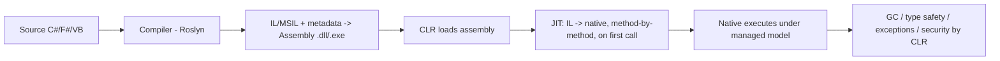
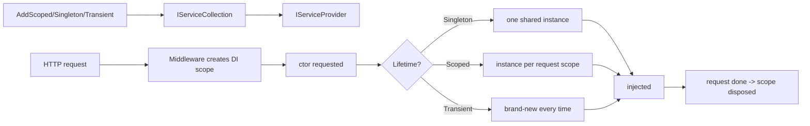
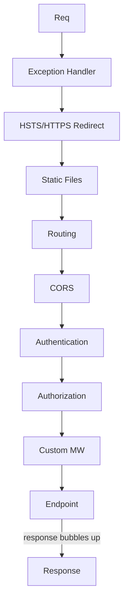
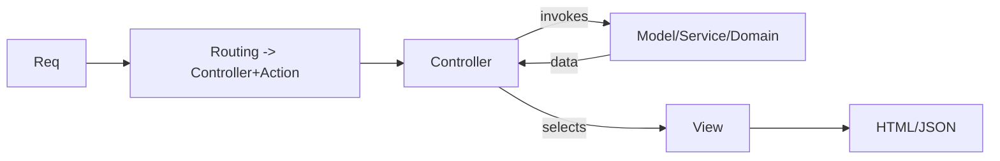
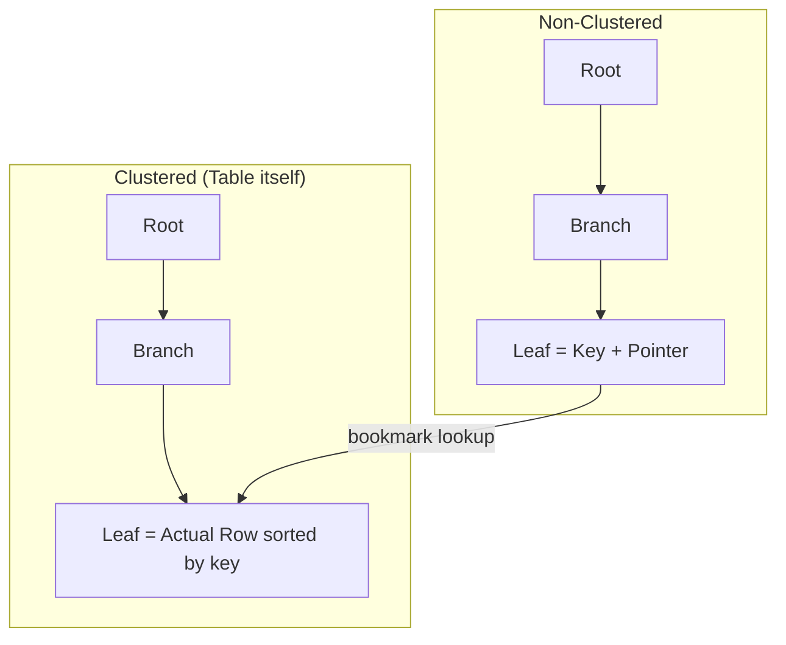
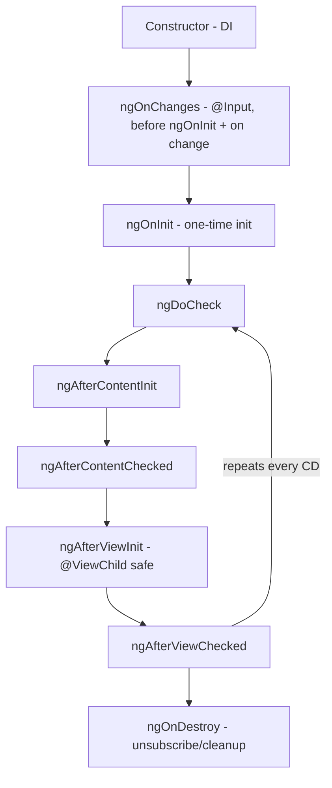
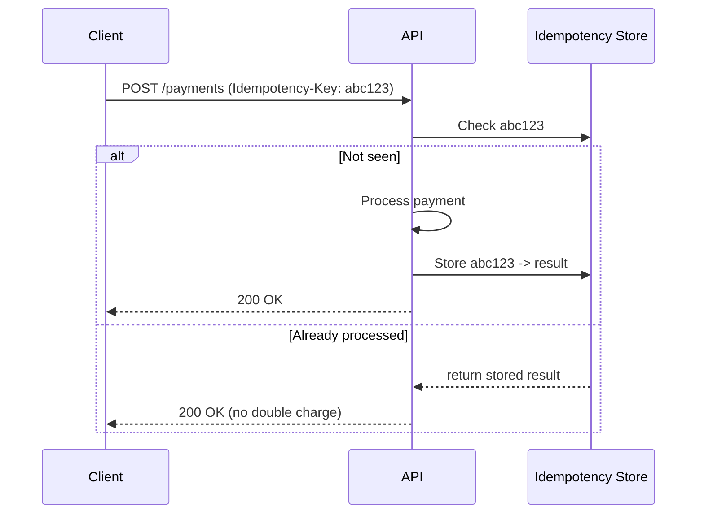

# Interview Questions — Senior .NET Full-Stack Revision Notes

> Yeh Guide file se derive ki gayi quick-revision notes hain — Guide ka har section/topic same order mein, tight **Q:/A:** + bullets format mein. Brush-up ke liye; deep detail ke liye original Guide dekho.

## Table of Contents

1. [Apne Baare Mein / Project Experience](#apne-baare-mein--project-experience)
2. [C# Language & OOP](#c-language--oop)
3. [Async, Threading & Concurrency](#async-threading--concurrency)
4. [.NET Core / ASP.NET Core & Middleware](#net-core--aspnet-core--middleware)
5. [Authentication, Authorization & API Design](#authentication-authorization--api-design)
6. [Design Patterns & SOLID](#design-patterns--solid)
7. [Entity Framework (Core)](#entity-framework-core)
8. [SQL](#sql)
9. [Angular / TypeScript](#angular--typescript)
10. [Coding Round](#coding-round)
11. [Gap Analysis — Senior Topics](#gap-analysis--senior-topics)
12. [Additions ka Summary](#additions-ka-summary)
13. [Flagged Contradictions / Ambiguities](#flagged-contradictions--ambiguities)

---

## Apne Baare Mein / Project Experience

### 1. Apne baare mein / project experience batao

**A:** Yeh narrative hai — communication + seniority signal test hota hai. 90-sec "walk":
- **Frame**: years, primary stack (.NET/C#, Angular, SQL Server, Azure/AWS), kis kism ke systems (high-throughput APIs, data-heavy LOB, e-commerce, integrations).
- **Depth signal**: 1-2 projects jahan architecture/design *own* ki thi; ek hard problem (scaling/tricky bug/migration) + outcome numbers ke saath ("p95 800ms→120ms", "infra cost -30%").
- **Current role**: scope — IC vs lead, mentoring, code-review ownership, architecture.
- **Close with intent**: kyun switch, yeh role trajectory se kaise align.
- *(verify: metrics/project names apne actual resume se tailor karo.)*
- Follow-ups: "hardest technical decision?", "what would you do differently?", "technical disagreement kaise resolve hua?"

### 2. Current project responsibilities

**A:** **Ownership** ki baat karo, tasks ki nahi: system design, API contracts, DB schema, code-review gatekeeping, mentoring, CI/CD ownership, incident response. Cross-team (QA/DevOps/product) kaam mention karo → full-stack/lead maturity. Signal: aap decisions *influence* karte ho ya sirf tickets execute?

### 3. Tech stack — Backend / Frontend / DevOps

**A:** Stack rundown + **kyun** woh choice (trade-off ready rakho):
- **Backend**: C#/ASP.NET Core Web API, EF Core, SQL Server/PostgreSQL, message broker (RabbitMQ/Azure Service Bus/Kafka).
- **Frontend**: Angular version, state mgmt (NgRx / services+RxJS / signals), UI library.
- **DevOps**: CI/CD (Azure DevOps/GitHub Actions/Jenkins), Docker/K8s, cloud (Azure/AWS), monitoring (App Insights, Grafana/Prometheus, ELK).
- Follow-up "Why X over Y?" — ek real trade-off: e.g. "NgRx over services+RxJS kyunki state 12+ components mein shared thi, Redux DevTools debugging boilerplate cost se zyada matter karti thi."

---

## C# Language & OOP

### 3a. .NET kya hai aur kaise kaam karta hai?

**A:** General-purpose platform = runtime + BCL + tooling; multiple languages (C#/F#/VB) ek common format mein compile hoke shared engine par chalti hain.



- **Managed execution model**: CLR (OS nahi) memory, type safety (IL verified → no arbitrary pointer arithmetic outside `unsafe`), structured exceptions, security control karta hai.
- **Senior nuance**: JIT one-shot nahi — **tiered compilation** (Tier 0 fast minimal JIT → hot methods Tier 1 full-optimized re-JIT); startup-latency vs steady-throughput trade-off auto-resolve. **Native AOT** (.NET 8+) directly AOT native compile karta hai, CLR/JIT skip — cost: reflection-heavy/runtime-codegen features chale jaate hain. (serverless cold start, CLI, containers ke liye.)

### 3b. CLR kya hai?

**A:** Managed execution engine jo assemblies host/run karta hai (".NET = runtime + libraries" ka runtime half). Responsibilities:
- **JIT compilation** — IL→native on demand, tiered.
- **Memory management** — managed heap + generational GC (Gen 0/1/2 + LOH).
- **Type safety/verification** — IL check → no illegal casts/stray memory outside `unsafe` → buffer overruns rare.
- **Structured exception handling** — uniform model across all CLR languages.
- **GC hosting + thread/AppDomain mgmt + interop** (P/Invoke, COM).
- **Implementations**: **CoreCLR** (modern .NET, cross-platform), **Mono** (mobile/Unity historically), **Native AOT** (CLR/JIT ki zarurat hata deta hai). "CLR ≠ Windows" jaanna = currency signal.

### 3c. Assemblies kya hain?

**A:** **Deployment, versioning, type-scoping** ki fundamental unit — compilation ka physical output (`.dll`/`.exe`). Contains: IL code, **metadata** (types + signatures → Reflection), **manifest** (name/version/culture + referenced assemblies), optional embedded resources.
- **Assembly vs namespace**: namespace = logical compile-time naming (no physical existence); assembly = physical deployable. Orthogonal — ek assembly mein kai namespaces, ek namespace kai assemblies mein span kar sakta hai.
- **Loading/isolation**: CLR runtime par resolve/load karta hai. .NET Core ne GAC/strong-naming/AppDomain ko **`AssemblyLoadContext`** se replace kiya — same process mein same assembly ke multiple versions side-by-side (robust plugins, binding-redirect hell bina).
- **Kyun matter karta hai**: metadata-driven Reflection hi DI auto-registration, EF entity scanning, JSON serializers, AutoMapper ko power deta hai ("walk assemblies for types/attributes").

### 4. string kya hai? Immutable kyun?

**A:** `string` = sealed reference type (`System.String`), UTF-16 char sequence, heap par. **Immutable kyun:**
- **Thread safety** — bina locking multiple threads read; no torn reads.
- **String interning** — CLR literals ke liye intern pool; mutable hote to ek reference doosron ko corrupt karta.
- **Hashing reliability** — dictionary/hashset keys; mutate hone par hash bucket break.
- **Security** — validate hone ke baad alter nahi (filename/SQL fragment).
- Har "mutation" (`+=`, `.Replace()`, `.ToUpper()`) **new** string allocate karta hai → loop concat = O(n²) allocations gotcha. Fix: `StringBuilder` (internal mutable buffer, `.ToString()` par ek baar materialize) ya `string.Create`/`Span<char>`.

### 5. .NET Framework vs .NET Core (5+/7/8/9)

| Aspect | .NET Framework | .NET Core (→ .NET 5+) |
|---|---|---|
| Platform | Sirf Windows | Cross-platform |
| Open source | Partially | Fully (GitHub) |
| Deployment | Machine-wide GAC | Self-contained/framework-dependent, side-by-side |
| Performance | Slow JIT, purana GC | Fast (Server GC, tiered, ReadyToRun) |
| Modularity | Monolithic (System.Web) | NuGet, pay-for-what-you-use |
| Web | ASP.NET (System.Web, IIS) | ASP.NET Core (Kestrel, IIS-decoupled) |
| Future | Maintenance-only | Active, yearly train |
| Containers | Kharab (heavy) | Excellent (small, Linux, Docker-first) |

- .NET 5 se "Core" → sirf ".NET". Framework 4.8 last, security-patches only.
- LTS = 8, 10 (3-yr); STS = 7, 9 (18 mo). **(verify LTS cadence; 2026 mein .NET 10 current LTS.)**
- Follow-up "Migrate legacy to .NET 8? risk?" — `System.Web` removal, 3rd-party compat, .NET Upgrade Assistant / incremental strangler-fig (big-bang nahi).

### 6. Value Types vs Reference Types

| | Value | Reference |
|---|---|---|
| Examples | `int`, `struct`, `enum`, `bool`, `DateTime` | `class`, `string`, `object`, arrays, delegates |
| Storage | Stack (ya inline in container) | Heap; variable = pointer |
| Assignment | Full value copy | Reference copy (same object) |
| Default | Zeroed (`0`/`false`) | `null` |
| Pass to method | By value (copy) | Reference copy → same object (mutations visible, reassignment nahi) |

- **Gotcha**: reference-type field wala struct = shallow copy (referenced object shared). **Boxing** (value→`object`) heap allocate + copy → hot-path perf gotcha (pre-generics `ArrayList`, `int`→`object[]`).

### 7. Constructors — Parameterized vs Non-parameterized

**A:** Object state creation-time initialize; class-name jaisa, no return type.
- **Default (non-param)**: koi args nahi; agar aap koi constructor define karo to compiler default auto-generate nahi karta.
- **Parameterized**: args se required state enforce.
- **Chaining**: `this(...)` same class, `base(...)` parent.
- **Static constructor**: ek baar, first instance/static-access se pehle; no modifiers/params.
- **Primary constructors (C# 12)**: `public class Person(string name, int age) { }`.

```csharp
public class Employee {
    public string Name { get; }
    public decimal Salary { get; }
    public Employee() : this("Unknown", 0) { }        // chaining
    public Employee(string name, decimal salary) { Name = name; Salary = salary; }
}
```

### 8. Overloading vs Overriding

| | Overloading | Overriding |
|---|---|---|
| Def | Same name, diff signature, same class | Subclass base ke `virtual`/`abstract` ko same signature se redefine |
| Polymorphism | Compile-time (static) | Runtime (dynamic) |
| Keywords | Koi nahi | `virtual`+`override` ya `abstract`+`override` |
| Return type | Different ho sakta | Match (ya C#9 covariant) |
| Resolved by | Compiler (argument types) | CLR (runtime type) |

```csharp
class Shape { public virtual double Area() => 0; }
class Circle : Shape { public double R; public override double Area() => Math.PI*R*R; }
class Calc { public int Add(int a,int b)=>a+b; public double Add(double a,double b)=>a+b; }
```

- **Gotcha `new` vs `override`**: `new` = base hide (static type se resolve); `override` = true polymorphism (runtime type). `Shape s = new Circle(); s.Area()` → override to Circle, `new` hota to Shape (0).

### 9. OOP concepts real examples ke saath

- **Encapsulation**: private fields + public methods; `Order.AddItem()` (public mutable `List<Item>` nahi) → business rule ek jagah ("shipped order mein add nahi").
- **Abstraction**: interface ke peeche impl hide — `IPaymentGateway` (Stripe/PayPal), caller ko farak nahi.
- **Inheritance**: shared base — `BaseRepository<T>` CRUD, `OrderRepository` extend. Caution: modern design **composition > inheritance** (fragile base class avoid).
- **Polymorphism**: `IEnumerable<IShape>`, `Area()` per shape differ → Strategy/Open-Closed.

### 10. Interface vs Abstract Class

| | Interface | Abstract Class |
|---|---|---|
| Multiple inh. | Kai implement | Sirf ek inherit |
| Members | Contract (C#8+ default impl) | Abstract + concrete + fields + ctors mix |
| State | No instance fields | Instance state |
| Access mod. | Implicitly public | Full support |
| Use | "Can-do" (`IDisposable`, `IComparable`) | "Is-a" shared base (`Stream`, `Controller`) |
| Versioning | Member add → sab implementers break (unless default impl) | Concrete method add → subclasses safe |

- Rule: "Interfaces = what object can do; abstract classes = what object is, with shared impl." C#8 default interface methods line blur karte hain — mention = currency signal.

### 11. Collections

**A:** `System.Collections` (non-generic, legacy, boxing) vs `System.Collections.Generic` (type-safe, preferred).

| Collection | Backing | Ordered | Dup | Use |
|---|---|---|---|---|
| `List<T>` | Dynamic array | Yes | Yes | General ordered |
| `Dictionary<K,V>` | Hash table | No | Unique keys | O(1) avg lookup |
| `HashSet<T>` | Hash table | No | No | Membership/set ops |
| `Queue<T>` | Circular buffer | FIFO | Yes | Task queue, BFS |
| `Stack<T>` | Array | LIFO | Yes | Undo, DFS |
| `LinkedList<T>` | Doubly-linked | Yes | Yes | Mid-list insert/remove (rare) |
| `ConcurrentDictionary` | Thread-safe hash | No | Unique keys | Multi-threaded cache |
| `ImmutableList<T>` | Persistent tree | Yes | Yes | Lock-free functional |

- **Gotcha**: `Dictionary` concurrent writes ke liye thread-safe *nahi* → `ConcurrentDictionary`/locking. Iterate+mutate same loop → `InvalidOperationException`; fix `.ToList()` snapshot ya `RemoveAll`.

### 12. LINQ

**A:** Unified declarative query over in-memory (`IEnumerable<T>`) + remote (`IQueryable<T>` via EF → SQL).

```csharp
var seniorDevs = employees.Where(e => e.YearsExperience >= 8)
    .OrderByDescending(e => e.YearsExperience)
    .Select(e => new { e.Name, e.YearsExperience }).ToList();
```

- **Deferred execution**: `Where`/`Select` iterator build karte hain, enumerate (`ToList`/`foreach`) par run. Gotcha: loop mein query re-execute.
- **`IEnumerable` vs `IQueryable`**: Enumerable = in-memory (LINQ to Objects); Queryable = expression tree → provider SQL translate. Filter *before* `.ToList()` = kaam DB par push; baad mein = sab memory mein (huge EF perf gotcha).
- **Multiple enumeration**: 2× enumerate = pipeline 2× run (DB-costly); reuse par `.ToList()`/`.ToArray()` cache karo.

---

## Async, Threading & Concurrency

### 13. Garbage Collector — kya + kaise?

**A:** Managed heap ka automatic memory manager; unreachable objects (kisi root — locals/statics/GC handles/stack — se) reclaim karta hai.
- **Generational mark-and-compact**: **Gen 0** short-lived (frequent/fast), **Gen 1** buffer, **Gen 2** long-lived (rare, expensive), **LOH** ≥85,000 bytes (Gen 2 ke saath collect, default compact nahi → `GCSettings.LargeObjectHeapCompactionMode`).
- **Algorithm**: mark (roots se live graph walk) → unreachable = garbage; Gen 0/1 **compact** (survivors move, pointers update) → isliye Gen 0 cheap.
- **Modes**: Workstation vs Server GC (per-core heap+thread, services ke liye better throughput); Background/concurrent GC (Gen 2 pauses kam).
- **Gotchas**: unmanaged resources (files/sockets/DB conns) ke liye `IDisposable`/`using` zaroori (GC ko unmanaged ka pata nahi; finalizers = safety net, Gen-2 cost). Leaks abhi bhi: forgotten `+=` event handlers, unbounded static collections, captured closures. `GC.Collect()` manually mat karo. `Span<T>`/`stackalloc` hot paths mein heap avoid.

### 14. Delegates — types

**A:** Type-safe function pointer — matching-signature method(s) ka reference; methods pass/store/invoke.
- **Single-cast**: custom `delegate` ya built-in — `Action<T...>` (void), `Func<T...,TResult>` (returns), `Predicate<T>` (`bool`).
- **Multicast**: `+=`/`-=` chain; order mein call; return value = sirf **last** observe hoti hai (gotcha) → mainly `void`/events ke saath.
- **Events**: `event` keyword — external code sirf `+=`/`-=` (invoke/clear nahi) → encapsulation.

```csharp
Func<int,int,int> subtract = (a,b) => a-b;
Action<string> log = Console.WriteLine;
log += msg => File.AppendAllText("log.txt", msg);   // multicast
log("Both handlers run");
```

- Follow-up: Events = restricted delegates; Rx (`IObservable<T>`) = same push pattern, composable/LINQ-queryable stream (RxJS ka .NET analog).

### 15. Async-Await

**A:** TAP ke upar syntactic sugar; non-blocking code jo sequential dikhta hai. Compiler `async` method ko state machine mein rewrite karta hai.

```csharp
public async Task<Order> GetOrderAsync(int id) {
    var order = await _db.Orders.FindAsync(id);       // I/O in flight → thread pool ko wapas
    return await _pricingService.EnrichAsync(order);
}
```

- **Mental model**: `await` naya thread create nahi karta — continuation register + current thread pool/message-loop mein **release**; complete hone par captured context/pool thread par resume.
- **Gotchas**:
  - `async void` avoid (except top-level event handlers) — exceptions catch nahi hoti → crash.
  - `ConfigureAwait(false)` library code mein (ASP.NET Core mein no SyncContext, par WPF/WinForms/old-ASP.NET ke liye relevant) — context capture avoid, deadlock risk kam.
  - **Deadlock**: SyncContext (old ASP.NET/UI) mein `.Result`/`.Wait()` = deadlock. Core mein context nahi par phir bhi avoid — "async all the way".
  - `Task` vs `ValueTask<T>`: ValueTask hot paths (frequently sync result, cache hit) mein alloc avoid — par 2× await/store mat karo.
  - Exceptions returned Task mein capture, `await` par rethrow; fire-and-forget hamesha error-handling se wrap.

### 16. Multithreading vs Async

| | Multithreading | Async |
|---|---|---|
| Goal | Parallelism — CPU-bound ek time par | Concurrency — I/O wait par block na karna |
| Threads | Multiple OS threads simultaneously | Wait mein thread free; resume alag thread par, busy-wait ke liye 2nd thread nahi |
| Best for | CPU-bound (image, computation) | I/O-bound (DB, HTTP, file) |
| Tools | `Thread`, `Task.Run`, `Parallel.For`, PLINQ | `async`/`await`, `Task`, `ValueTask` |
| Cost | Thread creation/context switch expensive, core-limited | Cheap — wait par koi thread spent nahi, hazaaron concurrent tak scale |

- **Key**: async = threads create karne ke baare mein nahi, **waiting par thread waste na karna**. `Task.Run` actual pool thread use karta hai → sirf CPU-bound offload ke liye (UI responsive), already-async I/O wrap karne ke liye nahi (`SaveChangesAsync` ko `Task.Run` mein wrap = junior mistake, bina benefit thread burn).
- Follow-up "CPU-bound parallelize?" — `Parallel.ForEach`/`For` ya PLINQ (`.AsParallel()`); thread-safety, over-subscription, diminishing returns dhyan.

### 17. `const` vs `readonly`

| | `const` | `readonly` |
|---|---|---|
| Assigned | Compile time | Runtime (decl ya ctor) |
| Storage | IL mein baked har call site (literal) | Actual field, ctor par ek baar |
| Static? | Implicitly static | Instance ya `static readonly` |
| Types | Primitives/`string`/`enum` | Koi bhi (runtime computed samet) |
| Versioning | Referenced assembly mein change → **sab consumers recompile** (value inline) | Change → no recompile (runtime resolve) |

- Last row = interviewers actually yeh fish karte hain (multi-assembly/NuGet production gotcha).

### 18. Abstract vs Virtual

| | `abstract` | `virtual` |
|---|---|---|
| Base body | Koi nahi | Default body |
| Must override? | Haan (first concrete derived) | Optional |
| Base instantiable? | Nahi (class bhi abstract) | Haan |
| Use | Har subtype behavior define kare (no default) | Default do, customization allow |

### 19. Extension Methods

**A:** Existing type (sealed/non-owned bhi) mein method "add" bina source modify/inheritance — `static` class mein `static` method, first param par `this`.

```csharp
public static class StringExtensions {
    public static bool IsNullOrBlank(this string? value) => string.IsNullOrWhiteSpace(value);
}
if (userInput.IsNullOrBlank()) { ... }
```

- Pure syntactic sugar — `userInput.IsNullOrBlank()` → `StringExtensions.IsNullOrBlank(userInput)`. LINQ (`.Where`/`.Select`) = `IEnumerable<T>` extensions.
- **Gotcha**: compile-time static-type par resolve; same-signature instance method hamesha jeet jaata hai. `null` par call ho sakta hai bina throw (actually static call) — null-safe helpers ke liye useful par surprising.

---

## .NET Core / ASP.NET Core & Middleware

### 20. Dependency Injection — kya + internally kaise?

**A:** IoC technique: class dependencies declare karti hai (ctor params), container runtime par inject karta hai → decoupling, testability (mocks), centralized lifetime.

**Internals** (`Microsoft.Extensions.DependencyInjection`):
1. Startup: services `IServiceCollection` mein register (`AddScoped<IFoo,Foo>()`) = `ServiceDescriptor` list (type, impl, lifetime).
2. `.Build()` → `IServiceProvider`.
3. Har resolution: descriptor lookup → ctor params recursively resolve (graph walk) → lifetime rules apply (new ya cached).
4. ASP.NET Core: per HTTP request ek **scope** create, request end par dispose → "Scoped" = "per request".



### 21. Service Lifetimes

| Lifetime | Created | Use | Gotcha |
|---|---|---|---|
| **Transient** | Har inject par naya | Lightweight stateless (validator, mapper) | Expensive ctor → wasteful |
| **Scoped** | Per request/scope | `DbContext`, unit-of-work | Singleton se resolve → captive dependency |
| **Singleton** | App lifetime | Config, caches, `HttpClientFactory`, logging | Thread-safe hona chahiye; Scoped hold nahi |

- **Captive dependency (favorite Q)**: Singleton ctor mein Scoped (`DbContext`) → ek baar inject → forever hold across requests/users/threads → concurrency exceptions, stale data, connection leaks. Container `ValidateScopes=true` (Development) mein catch karta hai, par manual `IServiceProvider` resolve mein real bug. **Fix**: `IServiceScopeFactory` inject, per operation naya scope.

### 22. Request Pipeline & Middleware

**A:** Request handling = **middleware pipeline**; har component: pre-work (`await next()` se pehle), post-work (return ke baad), ya **short-circuit** (`next` na call — 401). Yeh **Chain of Responsibility**, `app.Use...()` order mein.



- **Order gotcha**: `UseAuthentication()` before `UseAuthorization()`; `UseCors()` before authz, after routing; `UseExceptionHandler()`/error MW **sabse pehle** (downstream wrap).

```csharp
public class RequestTimingMiddleware {
    private readonly RequestDelegate _next;
    private readonly ILogger<RequestTimingMiddleware> _logger;
    public RequestTimingMiddleware(RequestDelegate next, ILogger<RequestTimingMiddleware> logger) { _next=next; _logger=logger; }
    public async Task InvokeAsync(HttpContext ctx) {
        var sw = Stopwatch.StartNew();
        await _next(ctx);                       // rest of pipeline
        sw.Stop();
        _logger.LogInformation("{M} {P} took {Ms}ms", ctx.Request.Method, ctx.Request.Path, sw.ElapsedMilliseconds);
    }
}
// app.UseMiddleware<RequestTimingMiddleware>();  OR inline: app.Use(async (ctx,next) => {...await next();...});
```

### 22a. MVC architecture

**A:** Model-View-Controller — 3 responsibilities; ASP.NET routing/controller plumbing isi par built.



- **Model**: domain/data (entities, DTOs, ViewModels, business rules); HTTP/rendering ka pata nahi.
- **View**: presentation — server-rendered Razor, ya API-only mein no View (controller directly JSON return).
- **Controller**: traffic cop — receive, delegate to service, view/data return. **Thin** — no business logic, sirf HTTP↔domain adapter.
- **Senior framing**: Pure Web API mein "MVC" = Model+Controller, par framework same base infra (`ControllerBase`, model binding, filters) use karta hai. Angular parallel: component(orchestration)+template(presentation)+service/state(model). Discipline: **"thin controller, fat service"**.

### 23. Filters vs Middleware

**A:** Filters = MVC-specific hooks, action-invocation ke **andar** (endpoint match ke baad), MVC context (action args, model binding, `ActionResult`) tak access.

| Filter | Runs | Use |
|---|---|---|
| Authorization | Sabse pehle | Custom auth beyond `[Authorize]` |
| Resource | Rest se pehle/baad, binding around | Caching short-circuit |
| Action | Action se pehle/baad | Logging, validation |
| Exception | Exception par | MVC-scoped error handling |
| Result | Result execute se pehle/baad | Response format/wrap |

- **MW vs Filters**: MW = transport/pipeline-level, framework-agnostic (non-MVC bhi); Filters = MVC-level, rich action metadata. Rule: cross-cutting infra (auth/CORS/raw logging) → MW; MVC context (model state, action args) chahiye → filters.

### 24. API Validation

- **Data annotations**: `[Required]`, `[StringLength]`, `[Range]`, `[RegularExpression]` — auto-validate; `ModelState.IsValid` ya `[ApiController]` auto-400.
- **FluentValidation**: complex/composable/testable, DTO se decoupled; pipeline behavior/filter se integrate.
- **Domain-level**: non-declarative business rules ("order total ≤ credit limit") = service/domain layer, attributes nahi (attributes = shape/format).
- `[ApiController]` → invalid model state auto `400` + `ProblemDetails` short-circuit.

### 25. Eager vs Lazy Loading (EF)

**A:** EF section (#40) mein detail — yahan flag kyunki source list mein EF aur .NET Core/API dono ke under tha (duplicate).

### 26. Async vs Await (duplicate)

**A:** #15 mein cover — source ne 3× repeat kiya; consolidate.

---

## Authentication, Authorization & API Design

### 26a. REST API

**A:** REST = architectural style (protocol nahi), Fielding ki 6 constraints:
1. **Client-Server separation** — contract ke peeche independent evolve.
2. **Statelessness** — har request self-contained; server session state nahi → horizontal scalability enable.
3. **Cacheability** — `Cache-Control`, `ETag`.
4. **Uniform Interface** — URIs + standard verbs (GET/POST/PUT/PATCH/DELETE), self-descriptive (JSON).
5. **Layered System** — client ko intermediaries (gateway/proxy/CDN) ka pata nahi.
6. **Code on Demand** (optional) — rarely used.

- **ASP.NET Core realize**: attribute routing → URIs; verbs → CRUD; `IActionResult`/`ActionResult<T>` → proper status (`200`/`201+Location`/`204`/`400`/`404`/`409`); `Accept` → content negotiation; model binding+validation → self-descriptive.
- **Richardson Maturity Model**: L0 single RPC endpoint; L1 resource URIs; L2 verbs+status (real-world majority yahin); L3 **HATEOAS** (hypermedia links). **Honesty**: almost koi L3 ship nahi karta; pragmatic answer = "L2 par RESTish by design, not ignorance."

### 27. JWT Authentication / user identity from claims

**Flow:**
1. User credentials submit.
2. Server validate (ASP.NET Identity / Entra ID / Auth0).
3. Server **JWT** issue — `header.payload.signature` (base64url):
   - **Header**: algo (`HS256`/`RS256`), type.
   - **Payload/claims**: `sub`, `role`, `exp`, custom (tenant, permissions).
   - **Signature**: secret/private key se HMAC/RSA → tampering prevent (client payload *read* kar sakta, valid signature *forge* nahi).
4. Client store (memory/secure — `localStorage` **nahi**, XSS) → `Authorization: Bearer <token>`.
5. `UseAuthentication()` per request signature+expiry validate → `HttpContext.User` (`ClaimsPrincipal`).
6. `User.FindFirst(ClaimTypes.NameIdentifier)` / `IHttpContextAccessor` → "logging user identity from JWT claims".

- **Refresh tokens**: short access (mins) + long refresh (server-side/httpOnly cookie) → re-issue bina re-login; leak blast-radius kam.
- **Gotcha**: JWT default **encrypted nahi** (JWS signed, JWE hota encrypted) → payload mein secrets/PII kabhi nahi.

### 28. Authentication vs Authorization

| | AuthN | AuthZ |
|---|---|---|
| Q | "Who are you?" | "What allowed?" |
| When | Pehle | AuthN ke baad |
| Middleware | `UseAuthentication()` | `UseAuthorization()` (baad mein) |
| Mechanisms | Password, JWT, OAuth2/OIDC, API keys, certs | Roles, Policies, Claims |

### 29. CORS kyun?

**A:** Browser **Same-Origin Policy** — `app.example.com` JS `api.example.com` call nahi kar sakti (diff scheme/host/port) unless API allow kare. **CORS** = server opt-in: `Access-Control-Allow-Origin` batata hai kaunse origins response read kar sakte.
- **Browser-enforced** protection, server security boundary NAHI — Postman/curl/server-to-server CORS se unaffected. Real security = auth/authz.
- **Preflight**: non-simple requests (custom headers, non-GET/POST, `Content-Type: application/json`) → pehle `OPTIONS`.

```csharp
builder.Services.AddCors(o => o.AddPolicy("Frontend", p =>
    p.WithOrigins("https://app.example.com").AllowAnyHeader().AllowAnyMethod().AllowCredentials()));
app.UseCors("Frontend");
```

### 30. Attribute Routing

**A:** Routes directly controllers/actions par attributes se (convention table nahi) — Web API modern default.

```csharp
[ApiController]
[Route("api/[controller]")]
public class OrdersController : ControllerBase {
    [HttpGet("{id:int}")]
    public async Task<ActionResult<OrderDto>> GetById(int id) { ... }
    [HttpGet]
    public async Task<ActionResult<IEnumerable<OrderDto>>> GetAll([FromQuery] OrderFilter f) { ... }
    [HttpPost]
    public async Task<ActionResult<OrderDto>> Create([FromBody] CreateOrderRequest r) { ... }
}
```

- Benefits: routes code ke paas (discoverability), constraints (`{id:int}`, regex), `[Route]` prefix + versioning compose.

### 31. API Versioning

| Strategy | Example | Trade-off |
|---|---|---|
| URI segment | `/api/v1/orders` | Explicit/cache-friendly; URLs clutter |
| Query string | `?api-version=1.0` | Easy add; easy forget |
| Header | `Api-Version: 1.0` | Clean URLs; less discoverable |
| Media type | `Accept: ...;v=1.0` | RESTfully correct; most friction |

- `Asp.Versioning.Mvc` (successor of `Microsoft.AspNetCore.Mvc.Versioning`) — version negotiation, `Sunset`/`Deprecation` headers, `ApiVersionReader`.
- **Backward-compat discipline**: additive (optional fields) → no bump; breaking (remove/rename/type change) → bump + deprecation window + consumer communication.

### 32. Exception Handling (.NET Core)

**Layered:**
1. **Global exception MW** (`app.UseExceptionHandler()` / `IExceptionHandler` .NET 8+) — unhandled catch, log with trace id, standardized `ProblemDetails` (RFC 7807); stack traces kabhi leak nahi.
2. **Domain exceptions**: custom types (`OrderNotFoundException`) → specific HTTP status map (generic 500 nahi).
3. **Try/catch boundary par, har jagah nahi** — sirf rethrow ke liye catch mat karo; global handler tak propagate unless context add/recover.
4. **Result-pattern alternative**: expected failures ke liye `Result<T>`/`OneOf<T>` (exceptions = truly exceptional) — trade-off, hard rule nahi.

```csharp
app.UseExceptionHandler(errApp => errApp.Run(async ctx => {
    var ex = ctx.Features.Get<IExceptionHandlerFeature>()?.Error;
    ctx.Response.StatusCode = ex switch {
        NotFoundException => StatusCodes.Status404NotFound,
        ValidationException => StatusCodes.Status400BadRequest,
        _ => StatusCodes.Status500InternalServerError };
    await ctx.Response.WriteAsJsonAsync(new ProblemDetails {
        Status = ctx.Response.StatusCode, Title = ex?.Message ?? "Unexpected error", Instance = ctx.TraceIdentifier });
}));
```

### 33. ASP.NET performance kaise improve?

Layer se structure:
- **Data access**: indexing, N+1 avoid, `AsNoTracking()`, DTO projection, pagination, compiled queries.
- **Caching**: `IMemoryCache` (single) / Redis (scaled); response/output caching; cache-aside + TTL + invalidation.
- **Async all the way**: I/O block nahi; `IAsyncEnumerable<T>` stream.
- **Pooling**: `HttpClientFactory` (socket exhaustion gotcha), DB conn pooling.
- **Serialization**: `System.Text.Json` (faster, lower-alloc) + source-gen.
- **Compression/payload**: response compression, trim DTOs, gRPC internal.
- **Horizontal scaling + LB**, **CDN static assets**, **MW work minimize**.
- **Profile pehle**: `dotnet-trace`, App Insights, profiler — **measure karo, assume mat karo** (yeh senior signal).

---

## Design Patterns & SOLID

### 34. Design Patterns (general)

- **Creational**: Singleton, Factory Method, Abstract Factory, Builder.
- **Structural**: Adapter, Decorator, Facade, Proxy.
- **Behavioral**: Strategy, Observer, Chain of Responsibility (= ASP.NET Core MW), Template Method, Mediator (`MediatR` CQRS).
- Signal: GoF recite mat karo — 2-3 real usage se tie ("Strategy → per-region pricing without if/else", "Repository+UoW around EF → mockable").

### 35. Singleton

**A:** Exactly ek instance + global access.

```csharp
public sealed class ConfigurationCache {
    private static readonly Lazy<ConfigurationCache> _instance = new(() => new ConfigurationCache());
    public static ConfigurationCache Instance => _instance.Value;
    private ConfigurationCache() { }
}
```

- `Lazy<T>` = thread-safe on-demand init. **ASP.NET Core mein classic static GoF ke bajaye DI Singleton (`AddSingleton`) prefer** — same single-instance par testable/mockable, hidden global state avoid.
- **Gotcha**: thread-safe hona chahiye, Scoped capture nahi (captive dependency #21).

### 36. SOLID (esp. DIP)

| Principle | Statement | Why |
|---|---|---|
| **S**RP | Ek class = ek reason to change | Small/testable, ripple kam |
| **O**CP | Open for extension, closed for modification | Naya behavior via new code, tested code edit nahi |
| **L**SP | Subtype base ke liye substitutable | Surprising overrides prevent (`Square:Rectangle` trap) |
| **I**SP | Kai small interfaces > ek badi | Unneeded method stubs prevent |
| **D**IP | High-level low-level par depend nahi; dono abstractions par | DI/testability — `IRepository` exist karne ka reason |

**DIP deep dive** (do parts):
1. High-level modules → **abstractions** par depend (concrete low-level par nahi).
2. Abstractions → details par depend nahi; details → abstractions par.

```csharp
// Violates: OrderService directly new SqlOrderRepository()
// Follows:
public interface IOrderRepository { Order GetById(int id); }
public class OrderService {
    private readonly IOrderRepository _repo;
    public OrderService(IOrderRepository repo) => _repo = repo;   // injected, inverted
}
```

- DI = **mechanism**, DIP = **principle**. Conflate karna = mid-vs-senior tell; distinction explicitly call out karo.

---

## Entity Framework (Core)

### 37. EF kya hai?

**A:** Microsoft ka ORM — CLR entities ↔ DB rows map, LINQ → SQL (`IQueryable`), retrieved entities par change tracking, `SaveChanges()` par insert/update/delete SQL. ADO.NET ke upar (conn/command/reader abstract).

### 38. Code First vs Database First

| | Code First | Database First |
|---|---|---|
| Source of truth | C# entities + `DbContext` | Existing schema |
| Evolution | Migrations (`migrations add`) | Scaffold (`dbcontext scaffold`) |
| Best for | Greenfield, schema-in-source-control | Legacy, DBA-owned, gated DB changes |
| VC friendliness | Excellent (migrations reviewable) | Weaker (schema outside app history) |

- **Preference**: active dev → Code First + Migrations (schema co-located, PR-reviewable, CI repeatable `database update`). Database First → DBA-owned/big legacy/strict change-control. **(org governance ke against verify — context-dependent; yeh kehna khud senior signal.)**

### 39. Migrations kaise kaam karte hain

1. Entity/`DbContext` config change.
2. `dotnet ef migrations add <Name>` — model snapshot vs previous → `Up()`/`Down()` delta class.
3. `dotnet ef database update` (ya `context.Database.Migrate()` startup) → pending SQL apply + `__EFMigrationsHistory` record.
4. `Down()` = rollback.

- **Senior gotcha**: startup auto-migrate (`Database.Migrate()`) dev/single-instance mein convenient par multi-instance/blue-green risky (race, ya rolling deploy purana code vs naya schema). **Production**: migrations = separate gated CI/CD step (one-shot job) *before* app instances start.

### 40. Eager vs Lazy Loading

| | Eager | Lazy |
|---|---|---|
| Mechanism | `.Include()`/`.ThenInclude()` upfront | Auto on nav-property access (proxies + `virtual`) |
| When | Immediately, original query | First access, potentially context scope ke baad |
| Gotcha | Over-fetching | **N+1** — loop mein nav access = per-iteration query, invisible, devastating |
| Explicit (3rd) | `Entry(e).Collection(x=>x.Items).Load()` on demand | — |

- **Senior stance**: teams **default se lazy loading disable** karti hain → eager (`.Include`) ya projection (`.Select()` DTO). Projection often better — unneeded columns + change-tracking overhead dono avoid.

### 41. EF Performance

- **`AsNoTracking()`** read-only (change-tracking skip).
- **DTO projection (`.Select()`)** — sirf needed columns.
- **N+1 avoid** — deliberate `.Include()` ya single projected query.
- **Compiled queries** (`EF.CompileAsyncQuery`) hot repeated shapes — micro-opt, measure first.
- **Batching**: EF Core auto-batches; par `SaveChanges()` loop mein per-row mat call.
- **Split queries** (`.AsSplitQuery()`) — multiple collection `.Include()` → cartesian explosion avoid, cost = round trips.
- **Bulk**: `ExecuteUpdateAsync`/`ExecuteDeleteAsync` (EF7+) ya bulk-extensions (change-tracker `SaveChanges` bulk ke liye nahi).
- **Indexing** DB layer, **Pooled `DbContext`** (`AddDbContextPool`).

### 42. DbContext Lifetime

**A:** Default **Scoped** (`AddDbContext<T>`) — per request, request end par dispose.
- **Thread-safe nahi** — concurrent use kabhi nahi.
- **Unit-of-work** — change tracker request bhar accumulate, `SaveChanges()` par flush → request-scope = natural transaction boundary.
- Lambe alive (Singleton/cached) → stale entities, memory growth, concurrency exceptions (captive dependency #21).
- Background workers: `IServiceScopeFactory.CreateScope()` per unit-of-work.

---

## SQL

### 43. Joins

| Join | Returns |
|---|---|
| `INNER` | Matches in both |
| `LEFT OUTER` | Left all + matching right (NULLs) |
| `RIGHT OUTER` | Right all + matching left |
| `FULL OUTER` | Both all, NULLs jahan no match |
| `CROSS` | Cartesian product |
| `SELF` | Table khud se (employee-manager) |

```sql
SELECT e.Name AS Employee, m.Name AS Manager
FROM Employees e LEFT JOIN Employees m ON e.ManagerId = m.EmployeeId;   -- self join
```

### 44. Indexes — Clustered vs Non-Clustered

**A:** Index = on-disk structure (B-tree) → full scan avoid; write cost/storage ↔ read speed trade.

| | Clustered | Non-Clustered |
|---|---|---|
| Physical order | Table rows ka storage order = index leaf | Separate; leaf = key + row pointer |
| Count | Exactly 1 | Kai |
| Lookup | Direct (leaf = row) | Extra bookmark lookup unless covered |
| Default | PK → clustered (SQL Server) | Explicit for filtered/joined/sorted cols |
| Write cost | Physical order maintain (random keys → fragmentation) | Per index overhead |



- **Covering index**: `INCLUDE` se query ke saare columns → bookmark lookup poori tarah avoid.

### 45. Stored Proc vs View vs Function

| | Stored Proc | View | Function (Scalar/TVF) |
|---|---|---|---|
| Modify data? | Haan (DML/DDL) | Nahi (unless updatable) | No side effects, no DML |
| Params? | Haan | Nahi (inline TVF use) | Haan |
| SELECT ke andar? | Nahi | Haan | Haan |
| Multiple result sets? | Haan | Nahi | Nahi |
| Transaction control | Haan | Nahi | Nahi |
| Use | Business logic, batch | Simplify/reuse, restrict visibility | Reusable scalar / parameterized virtual table |

- **Gotcha**: bade table par row-by-row scalar UDF = perf trap (historically no inline, hidden per-row call); SQL Server 2019+ **scalar UDF inlining** mitigate karta hai — par plans check karo.

### 46. CTE

**A:** Named temp result set (`WITH`), usi single statement tak scoped — nested subquery readability + **recursive** (org chart, BOM).

```sql
WITH OrgChart AS (
    SELECT EmployeeId, ManagerId, Name, 0 AS Level FROM Employees WHERE ManagerId IS NULL
    UNION ALL
    SELECT e.EmployeeId, e.ManagerId, e.Name, oc.Level+1
    FROM Employees e INNER JOIN OrgChart oc ON e.ManagerId = oc.EmployeeId
)
SELECT * FROM OrgChart ORDER BY Level;
```

- **Gotcha**: CTE materialize/cache nahi hota — multiple reference par **re-evaluate** ho sakta (optimizer-dependent); reusable intermediate ke liye temp table outperform.

### 47. Magic Tables

**A:** SQL Server mein `INSERTED`/`DELETED` — special in-memory tables **sirf trigger bodies** mein, affected rows ki before/after images:
- `INSERT` → `INSERTED` only.
- `DELETE` → `DELETED` only.
- `UPDATE` → dono (`DELETED`=old, `INSERTED`=new) → column-level change detection.

```sql
CREATE TRIGGER trg_Orders_AuditUpdate ON Orders AFTER UPDATE AS
BEGIN
    INSERT INTO OrderAudit (OrderId, OldStatus, NewStatus, ChangedAt)
    SELECT i.OrderId, d.Status, i.Status, GETUTCDATE()
    FROM INSERTED i JOIN DELETED d ON i.OrderId = d.OrderId
    WHERE i.Status <> d.Status;
END;
```

### 48. Temp Tables & Types, Scope

| Type | Syntax | Scope | Visible to |
|---|---|---|---|
| Local temp | `#Temp` | Current session, auto-drop | Creating conn + nested procs |
| Global temp | `##Temp` | Saare sessions | Koi bhi conn (jab tak creator alive + referenced) |
| Table variable | `@Temp` | Batch/proc | Sirf declaring batch/proc (nested/dynamic SQL nahi) |

- **Temp table vs table var**: table var historically no stats (optimizer 1 row assume → poor plans); SQL 2019+ **deferred compilation** narrow kiya **(version verify)**. Temp tables = indexes/constraints/stats support, preferred beyond small sets. Dono `tempdb` mein.

### 49. SQL Performance Tuning

- **Execution plans pehle** — `SET STATISTICS IO, TIME ON`, actual vs estimated rows, scan vs seek, expensive operators.
- **Indexing** — narrow ever-increasing clustered key, covering non-clustered, over-indexing avoid.
- **SARGability killers avoid** — `WHERE YEAR(OrderDate)=2026` / implicit conversions seek prevent → range rewrite (`>= '2026-01-01' AND < '2027-01-01'`).
- **Parameter sniffing** — cached plan ek value ke liye optimized doosre ke liye terrible; `OPTION (RECOMPILE)`, hints, local variables.
- **Statistics freshness** — stale stats → bad cardinality; auto-update on.
- **`SELECT *` avoid**, **batch large DML** (log/lock escalation), **set-based > cursors** (RBAR).

### 50. Second Highest Salary

```sql
-- 1: OFFSET-FETCH (DISTINCT needed for value; else returns 2nd row)
SELECT DISTINCT Salary FROM Employees ORDER BY Salary DESC OFFSET 1 ROWS FETCH NEXT 1 ROWS ONLY;
-- 2: DENSE_RANK (correct for 2nd distinct value, generalizes to Nth)
WITH R AS (SELECT Salary, DENSE_RANK() OVER (ORDER BY Salary DESC) rnk FROM Employees)
SELECT DISTINCT Salary FROM R WHERE rnk = 2;
-- 3: Subquery (portable)
SELECT MAX(Salary) FROM Employees WHERE Salary < (SELECT MAX(Salary) FROM Employees);
```

- **Kaunsa**: #1 bina DISTINCT ties par 2nd *row* deta (bug); #2 semantically correct "2nd distinct value" + Nth generalize; #3 window-function-less engines par portable, 2nd se aage nahi.

### 51. Rank vs Dense_Rank vs Row_Number

| Function | Ties | Gaps? |
|---|---|---|
| `ROW_NUMBER()` | Unique arbitrary seq | N/A |
| `RANK()` | Same rank | Haan (1,2,2,4) |
| `DENSE_RANK()` | Same rank | Nahi (1,2,2,3) |

```sql
SELECT Name, Salary,
    ROW_NUMBER() OVER (ORDER BY Salary DESC) RowNum,
    RANK()       OVER (ORDER BY Salary DESC) Rnk,
    DENSE_RANK() OVER (ORDER BY Salary DESC) DenseRnk
FROM Employees;
```

- Pick: pagination/uniqueness → ROW_NUMBER; leaderboard (ties push next) → RANK; distinct tiers → DENSE_RANK.

### 52. SQL Exception Handling

```sql
BEGIN TRY
    BEGIN TRANSACTION;
    UPDATE Accounts SET Balance = Balance-100 WHERE AccountId=1;
    UPDATE Accounts SET Balance = Balance+100 WHERE AccountId=2;
    COMMIT TRANSACTION;
END TRY
BEGIN CATCH
    IF XACT_STATE() <> 0 ROLLBACK TRANSACTION;
    INSERT INTO ErrorLog (Message, Procedure, ErrorLine, CreatedAt)
    VALUES (ERROR_MESSAGE(), ERROR_PROCEDURE(), ERROR_LINE(), GETUTCDATE());
    THROW;   -- re-raise preserving original (2012+)
END CATCH;
```

- Functions: `ERROR_MESSAGE/NUMBER/SEVERITY/LINE/PROCEDURE()`. `XACT_STATE()`: 1=committable, -1=uncommittable (must rollback) — blind ROLLBACK se pehle check = senior detail. `THROW` (preserves) > `RAISERROR` (legacy).

### 53. Truncate vs Delete vs Drop

| | `DELETE` | `TRUNCATE` | `DROP` |
|---|---|---|---|
| Logging | Row-by-row | Minimal (page dealloc) | Removes object |
| `WHERE` | Haan | Nahi | N/A |
| Triggers | Haan | Nahi | N/A |
| Identity reset | Nahi | Haan | N/A |
| Rollback | Haan | **Haan** (transaction mein, SQL Server) | Haan (transaction mein) |
| Locking | Row-level | Table-level | Table-level |
| Speed (big) | Slow | Fast | Fast |

- Myth correct karo: **TRUNCATE unloggable nahi** — minimally logged, SQL Server mein explicit transaction mein rollback *ho sakta hai*.

### 54. Triggers

**A:** Special SP jo DML (`INSERT`/`UPDATE`/`DELETE`) ya DDL event par auto-fire, bina explicit call.
- **AFTER (FOR)**: action ke baad; auditing common.
- **INSTEAD OF**: action ke jagah, intercept/redirect (non-updatable view updatable banane).
- Use: auditing, cross-table rules (jo `CHECK` nahi express karti), denormalized aggregates.
- **Senior caution**: triggers = invisible side effects → debug/profile hard; explicit app-logic ya `CHECK`/`FK` prefer. **Recursive trigger** + multi-row: triggers **per statement** fire (per row nahi) → `INSERTED`/`DELETED` par set-based likho, "one row at a time" assume mat karo.

---

## Angular / TypeScript

### 55. Angular architecture (Components, Modules, Services)

**A:** Google ka opinionated TypeScript SPA framework:
- **Components** (`@Component`): TS class + template + styles; tree banate hain.
- **Modules (`NgModule`)**: components/directives/pipes/services group. **Angular 14+ (stable v17+) standalone components = modern default** — imports directly declare, NgModule increasingly optional/legacy. Bolna = currency signal. **(target company version verify — enterprise abhi module-based.)**
- **Services**: injectable singleton (`providedIn: 'root'`) — logic/state/HTTP, DI se decoupled.
- **Directives**: HTML behavior extend (#62). **Pipes**: display transform (`{{ price | currency }}`).

### 56. Lifecycle Hooks



- `ngOnChanges` `ngOnInit` se **pehle**, sirf `@Input`, sirf changed *reference* (mutation nahi — shallow comparison gotcha).
- `ngAfterViewInit` = `@ViewChild` populated (ngOnInit mein `undefined` bug).
- `ngOnDestroy` = manual RxJS unsubscribe (unless `async` pipe) — common production leak.

### 57. Routing, Lazy Loading, Guards

- **Routing**: `RouterModule.forRoot()`/`forChild()` ya standalone `provideRouter()` — path/query params, nested/child, named outlets.
- **Lazy loading**: separate bundles (chunks) on-demand → initial bundle chhota.

```typescript
export const routes: Routes = [
  { path: 'orders', loadComponent: () => import('./orders/orders.component').then(m => m.OrdersComponent) },
  { path: 'admin', loadChildren: () => import('./admin/admin.module').then(m => m.AdminModule) }  // legacy
];
```

| Guard | Purpose |
|---|---|
| `CanActivate` | Enter allow/block (auth) |
| `CanActivateChild` | Child routes |
| `CanDeactivate` | Leave block ("unsaved changes?") |
| `Resolve` | Pre-fetch data before activate |
| `CanMatch` | Route config match? (feature flags) |

```typescript
// Angular 15+ functional guard
export const authGuard: CanActivateFn = (route, state) => {
  const auth = inject(AuthService), router = inject(Router);
  return auth.isLoggedIn() ? true : router.createUrlTree(['/login']);
};
```

### 58. ViewChild

**A:** `@ViewChild` = own template mein child component/directive/DOM ka direct reference (imperative access) jab `@Input`/`@Output` insufficient.

```typescript
export class ParentComponent implements AfterViewInit {
  @ViewChild(ChildComponent) child!: ChildComponent;
  @ViewChild('searchInput') inputRef!: ElementRef<HTMLInputElement>;
  ngAfterViewInit() {
    this.child.doSomething();               // safe here, not ngOnInit
    this.inputRef.nativeElement.focus();
  }
}
```

- `*ngIf` ke andar → `{static:false}` (default) + `undefined` defensive.

### 59. Interceptors, Global Exception Handling

**A:** `HttpInterceptor` = har outgoing request/incoming response ke beech (Angular ka MW equivalent).

```typescript
export const authInterceptor: HttpInterceptorFn = (req, next) => {
  const token = inject(AuthService).getToken();
  const authReq = token ? req.clone({ setHeaders: { Authorization: `Bearer ${token}` } }) : req;
  return next(authReq).pipe(catchError((err: HttpErrorResponse) => {
    if (err.status === 401) inject(Router).navigate(['/login']);
    return throwError(() => err);
  }));
};
```

- Uses: auth headers, global error/toast, logging, retry (`retry()`), loading-spinner counting.
- **Non-HTTP errors** (template/unexpected) → Angular `ErrorHandler` (root override) → central log/report.

### 60. `let` vs `var` vs `const` — reassign?

| | `var` | `let` | `const` |
|---|---|---|---|
| Scope | Function | Block | Block |
| Hoisting | `undefined` init (gotcha) | TDZ (throw before decl) | TDZ |
| Re-declare | Allowed | Nahi | Nahi |
| Reassign | Haan | Haan | **Nahi** (binding) |

- `const` binding reassign nahi, par object/array **properties mutate** ho sakti hain (reference immutability, deep nahi).

```typescript
const user = { name: 'Alice' };
user.name = 'Bob';        // fine — mutating object
user = { name: 'Carol' };  // compile error — reassign
```

- Deep immutability: `readonly` (compile-time, runtime erased), `Object.freeze()` (runtime, shallow), immutable libs.

### 61. `ng-template` vs `ng-content`

| | `ng-content` | `ng-template` |
|---|---|---|
| Purpose | Content projection (parent → child slot) | Template fragment jo default render nahi hota |
| Render immediately? | Haan | Nahi (inert unless instantiated) |
| Use | Reusable wrapper (`Card`) | Conditional/deferred, structural directive internals, template-as-param |

```html
<app-card><h3>Custom Title</h3></app-card>   <!-- projected into <ng-content> -->
<ng-template #noResults><p>No results found.</p></ng-template>
<div *ngIf="results.length > 0; else noResults"><!-- list --></div>
```

- `*ngIf`/`*ngFor` = `ng-template` ka syntactic sugar (desugar) — samajhna = depth signal.

### 62. Directives & Types

- **Component**: template wali (har `@Component` = directive with view).
- **Structural**: DOM structure change (`*ngIf`, `*ngFor`, `*ngSwitch`; `TemplateRef`/`ViewContainerRef`).
- **Attribute**: appearance/behavior change bina DOM add/remove (`ngClass`, `ngStyle`, custom `[appHighlight]`).

```typescript
@Directive({ selector: '[appHighlight]', standalone: true })
export class HighlightDirective {
  @Input() appHighlight = 'yellow';
  @HostListener('mouseenter') onEnter() { this.el.nativeElement.style.backgroundColor = this.appHighlight; }
  @HostListener('mouseleave') onLeave() { this.el.nativeElement.style.backgroundColor = ''; }
  constructor(private el: ElementRef) {}
}
```

### 63. Angular DI & Decorators

- Hierarchical DI (ASP.NET parallel, par **component/module injector tree**, HTTP-scope nahi):
  - **`providedIn: 'root'`**: app-wide singleton.
  - **Component `providers`**: per instance (children se shared) = Angular "scoped".
  - **Resolution injector tree upar walk**: component → parent → ... → root, warna `NullInjectorError`.
- **Decorators**: metadata annotations — `@Component`, `@Injectable`, `@Input`, `@Output`, `@ViewChild`, `@HostListener`, `@Directive`, `@Pipe`, `@NgModule`. TS decorator proposal → DI/compiler class metadata par reflect.

### 64. Promises vs Observables

| | Promise | Observable (RxJS) |
|---|---|---|
| Values | Exactly ek | Zero/ek/many over time |
| Eager/Lazy | Eager | Lazy (`.subscribe()` par) |
| Cancellable | Nahi | Haan (`unsubscribe`, `takeUntil`) |
| Operators | `.then/.catch/all/race` | Rich (`map`, `switchMap`, `debounceTime`, `retry`...) |
| Angular use | One-off async, `async/await` | `HttpClient`, reactive forms, event/WebSocket streams |

- **Kyun Observables**: composability. `switchMap` in-flight cancel (type-ahead).

```typescript
this.searchControl.valueChanges.pipe(
  debounceTime(300), distinctUntilChanged(),
  switchMap(term => this.api.search(term))   // cancels previous
).subscribe(results => this.results = results);
```

- Convert: `from(promise)`; `firstValueFrom(observable)` (deprecated `.toPromise()`).

### 65. State Management, Parent ↔ Child Communication

- **Parent → Child**: `@Input()`. **Child → Parent**: `@Output()` + `EventEmitter`.
- **Sibling/distant**: shared service (`BehaviorSubject`/signal) ya state library.

```typescript
@Output() itemSelected = new EventEmitter<Item>();
selectItem(item: Item) { this.itemSelected.emit(item); }
// Parent: <app-item-list (itemSelected)="onItemSelected($event)"></app-item-list>
```

- **State approaches by scale**: local fields → service+`BehaviorSubject`/**Signals** (16+/17 modern) → **NgRx** (big apps, complex cross-cutting state, time-travel; cost = boilerplate). Signals increasingly `BehaviorSubject` services ko replace kar rahe (fine-grained CD).

### 66. Angular Unit Testing

- **Jasmine + Karma** historical default; modern → **Jest** ya Web Test Runner/Vitest **(current CLI default verify — recently shifted)**.
- `TestBed.configureTestingModule()`, mock via `providers: [{ provide: AuthService, useValue: mock }]`.
- Pyramid: unit (services/logic, no DOM) → component (shallow render) → thin E2E (Cypress/Playwright, Protractor deprecated).
- **Marble testing** (`TestScheduler`) timing-dependent RxJS (`debounceTime`, `switchMap` races) — depth signal.

### 67. Angular Error Handling

Layered (.NET mirror):
1. **HTTP-level**: interceptor/pipe `catchError()`, `HttpErrorResponse` → user messages/retry.
2. **App-level uncaught**: custom `ErrorHandler` root → monitoring (Sentry/App Insights).
3. **Template-level**: defensive `*ngIf`/`?.`/`@if` (naya control-flow) — async data runtime errors avoid.
4. **Form-level**: reactive forms validation state (`invalid`/`errors`/`touched`).

---

## Coding Round

### 68. Do Integer Arrays — Common Elements

**A:** Pehle naive + complexity, phir optimized (framing = senior signal).
- **Naive**: nested loop O(n×m), O(1) extra.
- **Optimal**: hash set O(n+m) time, O(min(n,m)) space.

```csharp
public static List<int> FindCommonElements(int[] arr1, int[] arr2) {
    var (smaller, larger) = arr1.Length <= arr2.Length ? (arr1, arr2) : (arr2, arr1);
    var set = new HashSet<int>(smaller);
    var result = new List<int>();
    var seen = new HashSet<int>();                    // avoid dup output
    foreach (var num in larger)
        if (set.Contains(num) && seen.Add(num)) result.Add(num);
    return result;
}
// LINQ: arr1.Intersect(arr2).ToList();  (dedups, ~O(n+m) via set)
```

- **Follow-ups**:
  - Sorted → two-pointer O(n+m) time, O(1) space.
  - Preserve multiplicity → `Dictionary<int,int>` count in smaller, decrement on match.
  - Huge/no-memory → external sort + stream-merge, ya Bloom filter pre-filter.

```csharp
public static List<int> FindCommonSorted(int[] a, int[] b) {
    var result = new List<int>(); int i=0, j=0;
    while (i < a.Length && j < b.Length) {
        if (a[i] == b[j]) { result.Add(a[i]); i++; j++; }
        else if (a[i] < b[j]) i++; else j++;
    }
    return result;
}
```

---

## Gap Analysis — Senior Topics

> Source list definitions-heavy (mid-level screen). Senior/lead loop system design, resilience, operational maturity probe karta hai — yeh gap fill karte hain.

### Idempotency (distributed API)

**A:** Same request repeat (retries/network blips/LB duplication) = ek baar jaisa effect — POST/PATCH ke liye critical (GET/PUT natively idempotent).
- **Pattern**: client per-operation unique **idempotency key** (GUID) → `Idempotency-Key` header; server pehli baar `(key→result)` persist, retry par re-execute nahi, **stored** result return (no double-charge). TTL + atomic check/write (unique constraint / distributed lock) for concurrent retries.



### Distributed transactions / data consistency

**A:** ACID service boundaries ke across span nahi karta.
- **Saga**: transaction = sequence of local transactions, har ek ka **compensating action** (reserve inventory → charge → fail par release). **Orchestrated** (central coordinator) ya **choreographed** (events, decentralized, trace hard).
- **Outbox**: dual-write problem avoid — event ko `Outbox` table mein business change ke **same local transaction** mein likho, background publisher broker par publish + retry → at-least-once, atomicity kho bina.
- **Eventual consistency** accept + UX/business around design ("order placed" vs "confirmed").

### Caching strategy & invalidation

- **Cache-aside** (common): check cache → miss → DB read → populate → return. Simple, briefly stale.
- **Write-through**: cache+DB saath (sync, write latency add).
- **Write-behind**: cache immediate, DB async (fast, flush se pehle fail → data loss).
- **Invalidation**: TTL expiry (simple, eventually consistent), write par explicit (precise, zyada code), versioned keys (`UpdatedAt`/version in key → stale naturally miss).
- **Hard part**: cache invalidation. **Thundering herd** (expiry par simultaneous miss → DB hammer) → request coalescing/locks ya staggered TTL (jitter).

### API backward compatibility (beyond versioning)

- **Additive non-breaking** (new optional fields/endpoints) prefer.
- Breaking unavoidable → new+old saath ship, old deprecated (`Deprecation`/`Sunset` headers), concrete sunset date communicate, usage monitor.
- **Contract testing** (Pact) — CI mein accidental breaks catch (microservices, many consumers).
- **Consumer-driven contracts** = governance model.

### Observability (beyond logging)

3 pillars:
- **Logs**: structured JSON, trace/request-id correlated (`ILogger` scopes, Serilog/Seq, OpenTelemetry).
- **Metrics**: RED (rate/errors/duration) + resource, Prometheus/Grafana/Azure Monitor, alerts SLO-tied.
- **Distributed tracing**: single trace-id across service hops (OpenTelemetry/W3C Trace Context) → latency/failure kahan; 2-3 services se aage essential.
- Reliability maturity → **SLIs/SLOs/error budgets**.

### Horizontal scalability & statelessness

- **Stateless services**: no in-process session tying client to instance; session state → distributed store (Redis), not `IMemoryCache` → koi bhi instance koi bhi request.
- **Sticky sessions** = anti-pattern (coupling reintroduce, autoscale/rolling deploy complicate).
- **DB bottleneck**: read replicas (read-heavy), connection pool sizing (N instances × pool ≤ DB max conns — real incident), caching before scaling DB.
- **Autoscaling triggers**: CPU/memory naive; better = queue depth (workers) / latency-concurrency (APIs).

### CI/CD (.NET + Angular full-stack)

- **Build**: restore → build → unit test (coverage gate) → static analysis (SonarQube/Roslyn) → package (container) → publish.
- **Deploy**: env promotion (dev→staging→prod) with approval gates, migrations = distinct gated step (#39 gotcha), blue-green/canary, smoke tests, fast rollback.
- **Frontend**: AOT + tree-shaking + budget checks (bundle-size fail), content-hashed CDN cache-busting.
- **Trunk-based dev + feature flags** > long-lived GitFlow (merge pain kam, CD enable).

### Angular Signals (16+/17+)

- **Signals** (`signal()`, `computed()`, `effect()`) = built-in reactive primitive; fine-grained synchronous reactivity bina RxJS subscription lifecycle; **zoneless CD** enable (`zone.js` remove).
- `computed()` derive; `effect()` side effects on dependency change (React `useMemo`/`useEffect` jaisa).
- Signals RxJS **replace nahi karte** for async streams (HTTP/WebSocket) — interop `toSignal()`/`toObservable()`. Framing: **synchronous state → Signals; async streams → Observables**.

```typescript
export class CartComponent {
  itemCount = signal(0);
  total = computed(() => this.itemCount() * this.pricePerItem);
  constructor() { effect(() => console.log(`Cart has ${this.itemCount()} items`)); }
}
```

---

## Additions ka Summary

Original notes definitional/basic Q&A the — yeh system-design/operational/"how would you architect" angles add karte hain (senior/lead loop yahin lean karta hai):
1. **Idempotency** — retries/duplicates inevitable at scale; na jaanna = red flag.
2. **Distributed transactions (Saga/Outbox)** — single DB se bahar consistency.
3. **Caching strategy & invalidation** — invalidation + thundering-herd awareness = senior distinction.
4. **API backward compatibility process** — deprecation policy, contract testing, communication.
5. **Observability (logs/metrics/tracing)** — distributed tracing + SLO alerting = baseline.
6. **Horizontal scalability & statelessness** — scaling, pool sizing, autoscaling signals.
7. **CI/CD** — candidate stack mein "DevOps" par source mein absent tha.
8. **Angular Signals** — Angular section pre-Signals framing; most important 2026 update.

## Flagged Contradictions / Ambiguities

- Koi direct factual contradictions nahi — lists duplicative thi (same Qs "general"/".NET Core/API"/"SQL" passes mein repeat). Duplicates merged: Eager/Lazy Loading (EF + .NET Core/API), Async/Await (3×), Clustered/Non-Clustered (2×).
- Inline **(verify)** points — interview time par exact version par depend, target stack ke against check: current .NET LTS cadence, SQL Server table-variable statistics behavior, current default Angular testing tool (Jasmine/Karma vs Jest).
