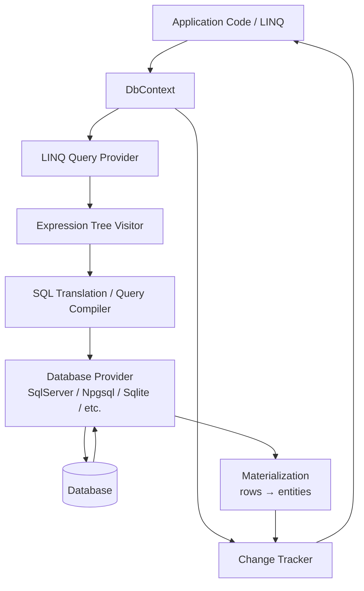
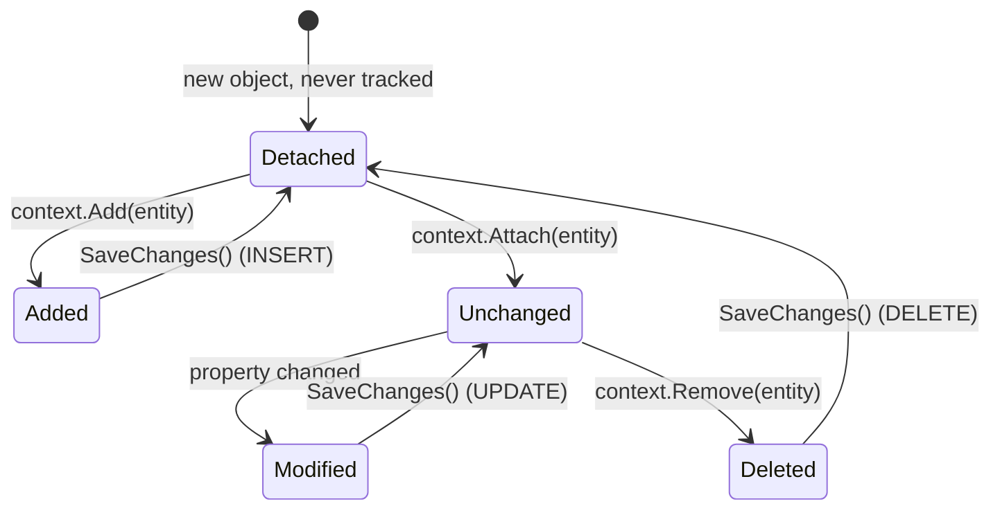
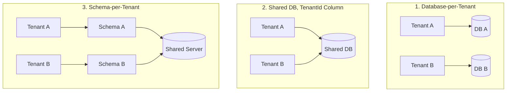

# EF Core – Quick Revision Notes

> Yeh guide se derived quick-revision notes hain (Hinglish, EF Core 8/9). Guide ki har section/sub-topic same order mein cover ki gayi hai — Q&A + tight bullets format mein last-minute brush-up ke liye.

---

## 1. Core Concepts

### 1.1 What is EF Core and Why It Exists

**Q: EF Core kya hai?**
A: Microsoft ka .NET ke liye ORM (Object-Relational Mapper) — C# objects se relational DB ke saath kaam, raw SQL ke bina. SQL generation, connection management, change tracking, relationship mapping khud handle karta hai.

```sql
-- Without EF Core
SELECT * FROM Users WHERE Id = 1
```
```csharp
// With EF Core
var user = context.Users.Find(1);
```

**Q: EF Core exist kyun karta hai (the "why")?**
- Boilerplate SQL + manual row↔object mapping hataata hai.
- Migrations se schema evolution centralize (DB ka version control).
- LINQ-based, strongly-typed, refactor-safe query surface (rename par compiler error, silently broken SQL strings nahi).
- **Trade-off:** kuch query control chodte ho + abstraction layer add hoti hai → seniors ko pata hona chahiye kab raw SQL/Dapper par drop karna hai.

### 1.2 DbContext

**Q: DbContext kya hai?**
A: EF Core ki central class — **Unit of Work** + **Repository**-jaisa abstraction combined. DB ke saath ek session represent karta hai.

```csharp
public class AppDbContext : DbContext
{
    public AppDbContext(DbContextOptions<AppDbContext> options) : base(options) { }
    public DbSet<User> Users { get; set; }
}
```

**Responsibilities:** connection open/manage, queries execute (LINQ→SQL pipeline), entity changes track, `SaveChanges` se persist, transactions manage.

**Key interview points:**
- Ek instance = ek unit of work / logical DB session.
- **Thread-safe NAHI** — concurrent operations/requests ke across share mat karo.
- ASP.NET Core mein **Scoped** register karo (`AddDbContext<T>`, per HTTP request ek instance).
- Construct karna lightweight par **free nahi** (connection + model cache lookup + change tracker) → isi liye **pooling** exist karta hai (§6.1).

### 1.3 Entity, DbSet, and Conventions

**Q: Entity kya hai?**
A: Ek POCO jo table se map hoti hai — usme koi DB logic nahi.

```csharp
public class User
{
    public int Id { get; set; }   // PK by convention
    public string Name { get; set; }
    public string Email { get; set; }
}
```

**Conventions:** class name → pluralized table (`User`→`Users`); `Id` ya `<Class>Id` → PK.

**DbSet<T>:** ek table ka queryable/updatable gateway — data khud nahi, ek `IQueryable<T>` entry point.

```csharp
context.Users.Add(new User { Name = "John" });   // INSERT (staged)
var users = context.Users.ToList();               // SELECT
var user = context.Users.First(u => u.Id == 1);
user.Name = "Updated";                            // UPDATE (staged, tracked)
context.Users.Remove(user);                       // DELETE (staged)
context.SaveChanges();                            // flush all above
```

**Q: `Find()` vs `FirstOrDefault()`?**
A: `Find()` **pehle change tracker** ko PK se check karta hai — already tracked ho toh DB hit nahi. `First/FirstOrDefault()` **hamesha** query issue karte hain, tracking state chahe kuch bhi ho.

**Q: `Add()` vs `Attach()`?**
A: `Add()` → entity (+ untracked graph) `Added` → `INSERT`. `Attach()` → `Unchanged` (tracked, koi DB hit nahi) — jab known-key entity ko re-insert kiye bina track karna ho. Common bug: existing entity par `Add()` = duplicate-key insert; fix = `Attach()` + state set, ya `Update()`.

### 1.4 EF Core Architecture



- **LINQ provider** expression tree capture karta hai (delegates DB ke against run nahi hote — *expression* translate hoti hai; isi liye arbitrary C# methods often translate nahi hote → §9 pitfall).
- **DB provider** (SqlServer, Npgsql, Sqlite, tests ke liye InMemory) provider-specific dialect + type mappings deta hai.
- Materialized rows Change Tracker ko jaati hain agar tracking on hai.

### 1.5 LINQ, Query Translation, and Deferred Execution

```csharp
var query = context.Users.Where(u => u.Id > 5); // koi SQL nahi — expression tree (IQueryable)
var list = query.ToList();                        // SQL executes NOW
```

**Q: Deferred execution kya hai?**
A: Query DB ko tab tak nahi jaati jab tak terminal operator na aaye — `ToList/ToArray/First/FirstOrDefault/Single/Count/Any/Sum`, foreach, etc.

**Common LINQ → SQL:**

| LINQ | SQL |
|---|---|
| `Where` | `WHERE` |
| `Select` | `SELECT` (projection) |
| `First`/`FirstOrDefault` | `SELECT TOP(1)` / `LIMIT 1` |
| `Any` | `EXISTS` |
| `Count` | `COUNT` |
| `OrderBy`/`Skip`/`Take` | `ORDER BY` / `OFFSET` / `FETCH NEXT` |

**Projection = performance tool, syntax sugar nahi:**
```csharp
var names = context.Users.Select(u => u.Name).ToList(); // sirf Name column
```

**Gotcha (spot-the-bug trap):** jaldi `.ToList()` = poora result set memory mein, uske baad LINQ client-side chalta hai:
```csharp
context.Users.ToList().Where(u => u.IsActive);       // BAD — poori table memory mein, phir filter
context.Users.Where(u => u.IsActive).ToList();       // GOOD — filter SQL mein translate
```

---

## 2. Change Tracking

### 2.1 Entity States and the Change Tracker

EF har materialized entity ko track karta hai (jab tak mana na kiya) — original values, current values, aur explicit state record karte hue.



| State | Meaning | SQL on SaveChanges |
|---|---|---|
| `Added` | Nayi entity, DB mein nahi | `INSERT` |
| `Modified` | Tracked, values changed | `UPDATE` |
| `Deleted` | Removal ke liye marked | `DELETE` |
| `Unchanged` | Tracked, koi change nahi | none |
| `Detached` | Is context se tracked nahi | none |

```csharp
var user = context.Users.First(u => u.Id == 1);
user.Name = "Updated Name";
context.SaveChanges();  // UPDATE Users SET Name=... WHERE Id=1 — koi explicit "update" call nahi
```

**Interview traps:**
- ❌ "EF har column update karta hai." ✔ Sirf **changed** columns ka `UPDATE` (snapshot comparison), jab tak full-column updates configure na ho.
- ❌ "Tracking free hai." ✔ Real memory/CPU cost — har entity ka original-values snapshot; har `SaveChanges` poore graph ko walk karta hai (`DetectChanges()`, O(n) in tracked entities).

### 2.2 Change Tracker Internals — Snapshots vs Proxies

- **Snapshot-based (default):** har tracked entity ka internal snapshot query/`Attach`/`Add` time par. `DetectChanges()` current vs snapshot compare karta hai. Plain POCOs ke saath kaam karta hai, par change detection = full-graph scan → thousands entities par expensive.
- **Notification-based (proxies):** entities `INotifyPropertyChanged`/`INotifyPropertyChanging` implement karein (ya `UseChangeTrackingProxies()`) → property mutation par EF immediately notify, poore graph rescan ki zarurat nahi. Bade sets ke liye faster, par cost: interfaces khud implement karo ya runtime proxy types accept karo (virtual properties chahiye, `sealed` nahi, `new Entity()` se easily unit-test nahi).
- `DetectChanges()` `SaveChanges` se pehle + zyada tar tracked LINQ queries se pehle auto-call hota hai. Bulk in-memory op ke around `AutoDetectChangesEnabled = false` karke end mein ek baar manually call → tight loops mein speedup.
- `ChangeTracker.Entries()` = saare tracked entities + states inspect — generic audit logging ke liye useful (e.g. `Entries<IAuditable>()` iterate karke `SaveChanges` override mein `CreatedAt`/`ModifiedAt` set karna).

### 2.3 AsNoTracking vs AsNoTrackingWithIdentityResolution

```csharp
context.Users.AsNoTracking().ToList();  // koi snapshot, koi tracker entries
```

- **`AsNoTracking()`** — fastest read path; har row independent object (koi identity resolution nahi, join se twice aaye toh do objects). Flat single-entity reads ke liye fine.
- **`AsNoTrackingWithIdentityResolution()`** — abhi bhi untracked, par single query result ke andar same-key entities **deduplicate** karta hai (join se twice aaya `User` = ek object, dono refs same). Use jab read-only `Include()` graphs project karo aur correct object identity chahiye (e.g. UI tree bind) bina full tracking cost.
- **Rule:** saare read-only/GET endpoints par default `AsNoTracking()`; tracking ka cost sirf tab pay karo jab `SaveChanges()` karne wale ho.

### 2.4 SaveChanges Internals

**Q: `SaveChanges()` internally kya karta hai?**
1. `DetectChanges()` — graph walk, snapshots diff.
2. Zaroori `INSERT`/`UPDATE`/`DELETE` set banata hai, **FK dependency order** respect karke (parent insert pehle, dependent delete pehle).
3. Saare commands ek **implicit transaction** mein execute (jab tak already open na ho).
4. Success → commit; failure (constraint/concurrency) → **full rollback + throw** (`DbUpdateException`, `DbUpdateConcurrencyException`).
5. Success par `Added`→`Unchanged` (DB-generated keys object par populate), `Deleted`→`Detached`.

**Async — sirf style nahi:**
```csharp
await context.SaveChangesAsync();
```
Thread free karta hai I/O wait ke dauraan → ASP.NET Core throughput critical (thread-pool starvation avoid). `await` bhoolna = real bug: task fire-and-forget, write durable hone se pehle request complete ho sakta hai, aur unawaited faulted task exceptions swallow kar sakta hai.

---

## 3. Relationships and Loading Strategies

### 3.1 Relationship Types & Configuration

One-to-One, One-to-Many, Many-to-Many — convention se discover ya Fluent API se explicit (Fluent preferred trivial cases se aage: composite keys, shadow FK mapping, etc.).

```csharp
public class User { public int Id { get; set; } public string Name { get; set; } public List<Order> Orders { get; set; } }
public class Order { public int Id { get; set; } public int UserId { get; set; } public User User { get; set; } }
```
```csharp
modelBuilder.Entity<Order>()
    .HasOne(o => o.User).WithMany(u => u.Orders).HasForeignKey(o => o.UserId);
```

**Key point:** navigation property ≠ FK. FK column DB par referential integrity enforce karta hai; navigation code mein object-graph traversal ki convenience. EF Core 5+ explicit join entity ke bina many-to-many support karta hai (shadow join table auto), par join table par payload (e.g. `EnrolledAt`) ho toh join entity explicitly model karo.

### 3.2 Eager, Lazy, and Explicit Loading

Default se related data load **NAHI** hota — opt in karna padta hai.

| Strategy | Mechanism | Round Trips | API Fit |
|---|---|---|---|
| Eager | `.Include(u => u.Orders)` | 1 (or more w/ split) | ✅ Preferred |
| Lazy | Proxy auto-loads on access | 1 per access (N+1 risk) | ❌ Avoid |
| Explicit | `context.Entry(user).Collection(u => u.Orders).Load()` | 1 per call, controlled | ✅ Targeted/conditional |

```csharp
context.Users.Include(u => u.Orders).ToList();            // Eager
user.Orders;                                              // Lazy (needs Proxies + UseLazyLoadingProxies())
context.Entry(user).Collection(u => u.Orders).Load();     // Explicit
```

**Interview rule:** web APIs → eager (ya better, projection). Lazy dangerous — DB calls ko ordinary property access ke peeche hide karta hai → perf bugs code review mein invisible.

### 3.3 Split Queries vs Single Query for Collection Includes

Multiple collection `Include()` → default **single query** with `JOIN`s → **cartesian explosion** (10 Orders × 5 Addresses = 50 rows with duplicated `User` data).

```csharp
context.Users.Include(u => u.Orders).Include(u => u.Addresses).ToList();                 // Single (default): rows = Orders × Addresses
context.Users.Include(u => u.Orders).Include(u => u.Addresses).AsSplitQuery().ToList();   // Split: 1 query per collection
```

**Trade-offs:**
- **Single:** 1 round trip (chhote graphs = lower latency), naturally atomic bina explicit tx; par bade fan-out par huge duplicated data + slow transfer.
- **Split:** row explosion avoid, kam data transfer; par multiple round trips + separate queries → beech mein data-change window (explicit tx ke bina). Reads mein usually OK, par interview mein trade-off call out karo.
- Set: globally `UseQuerySplittingBehavior(QuerySplittingBehavior.SplitQuery)` ya per-query `.AsSplitQuery()` / `.AsSingleQuery()`. EF multiple collection Includes par splitting behavior choose na karne par **warning log** karta hai — yeh warning khud accha callout hai.

### 3.4 The N+1 Problem — Spotting and Fixing It

**Q: N+1 kya hai?**
A: N parents fetch ke liye 1 query, phir related data ke liye N extra queries (per row ek) — typically loop ke andar lazy loading se, ya naive item-by-item code se (batch ke jagah).

```csharp
var users = context.Users.ToList();
foreach (var user in users) { user.Orders.Count(); }  // per-iteration lazy-load
```

**Spot kaise karein (senior signal):**
- Query logging (`.LogTo(Console.WriteLine, LogLevel.Information)`) ya APM (App Insights, MiniProfiler, Datadog) → repeating identical query with sirf param change.
- SQL Profiler / extended events → near-identical `SELECT ... WHERE UserId = @p0` burst.
- Code-review heuristic: queried list ke upar `foreach`/`Select` ke andar navigation-collection access = red flag (lazy on ho toh).

**Fixes (preference order):**
1. **Eager load:** `.Include(u => u.Orders)`.
2. **Project** jab sirf aggregates chahiye: `.Select(u => new { u.Id, OrderCount = u.Orders.Count() })` → single SQL (correlated subquery/`GROUP BY`), koi client loop.
3. API projects mein lazy loading poori tarah disable → har jagah explicit `Include()` force → N+1 compile/review time par visible.

```csharp
var users = context.Users.Include(u => u.Orders).AsNoTracking().ToList();  // Fix
```

---

## 4. Migrations

### 4.1 Migration Fundamentals

Migrations = DB schema ka version control (Git commits jaisa, par DDL ke liye).

```powershell
Add-Migration InitialCreate
Update-Database
# CLI: dotnet ef migrations add InitialCreate ; dotnet ef database update
```

**Internally:**
1. Current model snapshot vs last recorded snapshot (`*.Designer.cs`/snapshot file) compare.
2. `Up()`/`Down()` wali migration class generate (`MigrationBuilder`: `AddColumn`, `DropColumn`, `CreateTable`...).
3. `Update-Database` pending migrations order mein execute karta hai, har ek `__EFMigrationsHistory` mein record.

```csharp
migrationBuilder.AddColumn<string>(name: "Email", table: "Users", nullable: true);
```

**Traps:**
- ❌ DB schema manually edit (migrations bypass) → model/DB drift, snapshot comparison unreliable.
- ❌ "one migration per code change" ko hard rule maanna → logically-related changes ko per-feature/PR ek coherent migration mein batch karo.
- ✔ EF migrations ke bina chal sakta hai (`EnsureCreated()`) par sirf tests/prototypes ke liye — incremental evolution support nahi, migrations ke saath coexist nahi.

### 4.2 Migrations in a Team / CI-CD Workflow

- **Production startup par `Database.Migrate()` kabhi call na karo** (single-instance toy app se aage) — multiple instances/pods scale-up par concurrent migrations race karti hain. Prefer **dedicated CI/CD migration step** (one-shot job/container: `dotnet ef database update` ya idempotent SQL) jo naya app deploy **se pehle** chale.
- **Idempotent SQL scripts** review/audit ke liye (prod mein blind `Update-Database` ke jagah):
  ```powershell
  dotnet ef migrations script --idempotent -o migrate.sql
  ```
  `__EFMigrationsHistory` checks se guarded, re-run safe, DBA review kar sakta hai.
- **Backward-compatible ("expand/contract") changes** zero-downtime deploys ke liye (old + new versions saath chalein):
  - Nullable column add: safe.
  - NOT NULL add: phases mein — nullable add → backfill → later constraint add.
  - **Rename:** default diff = `DROP` + `ADD` (**data loss!**) jab tak explicitly `migrationBuilder.RenameColumn(...)` — renames par hamesha migration hand-edit.
  - Drop: pehle deprecate (read/write band, deploy) → phir subsequent migration mein drop.
- **Merge conflicts** (do branches ne migration add kiya): **rebase** karo — merged snapshot ke upar regenerate, hand-merge mat karo; redundant delete karo; sirf tab jab dono unapplied ho shared/prod mein.
- **PR discipline:** merge se pehle generated `Up`/`Down` SQL review (`Script-Migration`/file padho) — silent `DROP COLUMN`/`DROP TABLE` data-loss ka #1 cause.
- **Environment safety:** per-env connection strings/creds, prod app ke liye least-privilege DB account (schema-alter rights nahi; migration step alag elevated cred), production-like data volume par staging validation (100-row staging par instant migration 100M-row prod ko minutes lock kar sakta hai).

### 4.3 Migration Disaster Recovery Scenarios

| Scenario | Root Cause | Recovery | Prevention |
|---|---|---|---|
| Migration apply, app code rollback | DB schema code se aage → "Invalid column name" | Matching app version re-deploy; ya `Update-Database PreviousMigration` agar reversible | Blue-green; DB state consider kiye bina code rollback nahi |
| Column drop, data lost | `DropColumn` prod mein run | Backup se restore, column re-add, data reinsert | Directly drop nahi — deprecate pehle; prod se pehle backup |
| Migration halfway fail | Long migration mid-execution interrupt | `__EFMigrationsHistory` check, schema manually reconcile, re-run | Staging test; migrations chhoti + atomic |
| Conflicting migrations (2 devs) | Parallel branches | Rebase, ek combined generate, conflicting delete (pre-prod only) | Per branch ek migration; PR review; frequent sync |
| Hotfix ko schema change chahiye | Pipeline ka time nahi | SQL manually apply (controlled), phir matching EF migration backfill | Hotfix DB changes avoid; baad mein migration backfill |
| Migration lock/downtime | Default-value column add bade table ko lock | Cancel; steps mein — nullable → batched backfill → NOT NULL | Bade changes phases mein; hot tables par blocking DDL avoid |
| Galat environment mein applied | Prod migration QA par (ya ulta) | Correct backup se restore, correct migrations re-apply | Env-specific connection strings, CI/CD safeguards, least-priv creds |
| Migration ke bina manual DB change | DBA ne directly change kiya | `Add-Migration SyncWithDb`, generated SQL validate | Koi manual change — EF migrations single source of truth |
| Unexpected SQL (rename→drop+recreate) | Model diff rename ≠ drop+add distinguish nahi kar sakta | Hand-edit migration, explicit `RenameColumn` | Apply se pehle generated migration code review |

**Interviewer sunna chahta hai:** "I always review generated migration SQL", "test against staging with prod-like volume", "avoid destructive migrations, prefer expand/contract", "schema & code in sync via CI/CD, not manual changes".

---

## 5. Intermediate Topics

### 5.1 Concurrency Handling

EF out-of-the-box **optimistic concurrency** — concurrency token / row-version column se.

```csharp
public class User
{
    public int Id { get; set; }
    public string Name { get; set; }
    [Timestamp] public byte[] RowVersion { get; set; }
}
```

- `UPDATE`/`DELETE` par `WHERE` mein original `RowVersion` include hoti hai.
- Doosri transaction ne row update kar di (version change) → zero rows match → EF `0` affected detect → **`DbUpdateConcurrencyException`**.
- **Resolution strategies:** "database wins" (reload, local changes discard), "client wins" (local re-apply + fresh version se retry), ya merge UI. Handle: catch exception, `ex.Entries` inspect, retry se pehle `entry.OriginalValues.SetValues(entry.GetDatabaseValues())` (db-wins) ya `SetValues(...)` + re-save (client-wins).
- `[Timestamp]` SQL Server-specific (`rowversion`). Warna `[ConcurrencyCheck]` kisi column par, ya Fluent `.IsRowVersion()`/`.IsConcurrencyToken()`, ya computed `uint`/`byte[]` shadow property.

### 5.2 Transactions

```csharp
using var tx = context.Database.BeginTransaction();
context.SaveChanges();
tx.Commit();
```

- `SaveChanges()` apne ops ko already **implicit transaction** mein wrap karta hai — explicit tx sirf tab jab **multiple** `SaveChanges()` (ya EF + raw ADO.NET/Dapper mix) ko atomically span karna ho.
- Transactions **short** rakho — long-running = lock contention/deadlocks/timeouts ka classic cause. Bulk ops ko giant tx ke jagah **batch** karo.
- **Distributed transactions aur avoid kyun:** do DBs ke across ya DB + queue span karne ke liye distributed coordinator (MSDTC)/two-phase commit chahiye — slow, fragile, aur cloud-managed DBs/modern brokers par often unsupported. **Modern alternative = Saga pattern**: local transactions ki sequence, har ek ke paas compensating action agar later step fail (e.g. "reserve inventory"→"charge payment"→fail par "release reservation"). Zyada tar systems: **outbox pattern** se eventual consistency prefer karo (domain change + "event to publish" row **same** local tx mein, phir background process publish kare).

### 5.3 Shadow Properties

**Q: Shadow property kya hai?**
A: Property jo EF model + DB column mein exist karti hai, par CLR entity class par **declared nahi**. EF value internally track karta hai.

```csharp
modelBuilder.Entity<Order>().Property<DateTime>("LastModified");
context.Entry(order).Property("LastModified").CurrentValue = DateTime.UtcNow;  // change-tracker API se access
```

**Kahan dikhti hain:** FK properties (jab dependent par explicit FK ke bina sirf navigation model karo); audit columns (`CreatedAt`, `ModifiedBy`) jinhe track karo par domain model clutter na ho. Discover: `context.Model.FindEntityType(typeof(Order)).GetProperties()`.

### 5.4 Value Converters and Owned Types

**Value Converters** — CLR type ↔ different storage type map (enum ↔ string, custom value object ↔ primitive):
```csharp
modelBuilder.Entity<Order>().Property(o => o.Status).HasConversion<string>();   // enum as string, not int
modelBuilder.Entity<Order>().Property(o => o.Amount)
    .HasConversion(v => v.Value, v => new Money(v));                            // custom
```

**Owned Types** (`OwnsOne`/`OwnsMany`) — value object bina apni independent identity/table; default se owner ke table par columns:
```csharp
public class Address { public string Street { get; set; } public string City { get; set; } }
modelBuilder.Entity<User>().OwnsOne(u => u.Address);  // → Address_Street, Address_City columns on Users
```
- Owned types ki separate identity nahi — hamesha owner ke saath load/save, independently query nahi, nesting support.
- EF Core 7+: owned type (ya entity) ko **JSON column** (`ToJson()`) map — semi-structured data bina full normalized schema; "hybrid relational/document" modeling:
```csharp
modelBuilder.Entity<User>().OwnsOne(u => u.Address, a => a.ToJson());
```

### 5.5 Global Query Filters

**Q: Global query filter kya hai?**
A: Ek `Where` predicate jo entity type ki har query par auto apply hota hai (jab tak bypass na ho). Canonical uses: **soft delete** aur **multi-tenancy**.

```csharp
modelBuilder.Entity<User>().HasQueryFilter(u => !u.IsDeleted);
modelBuilder.Entity<Order>().HasQueryFilter(o => o.TenantId == _currentTenantService.TenantId);
```

- Auto apply hota hai LINQ queries, `Include()`d navigations, aur relationships ke through generated queries par bhi — har call site par `.Where(...)` yaad rakhne ki zarurat nahi (yahi point hai).
- **`.IgnoreQueryFilters()`** se bypass jab genuinely sab chahiye (admin "show deleted" screen).
- **Gotchas:** service/context field (current tenant ID) reference karne wale filters — value **per-query translation time** par context ki current field value se evaluate hoti hai → scoped context ke saath `this.TenantId` capture correctly per-request kaam karta hai, par context/compiled query ko tenants ke across cache karne se savdhaan. Filters sirf entity ki properties, related entity properties (navigation se), ya DbContext ke fields/properties reference kar sakte hain — koi arbitrary external state nahi.

### 5.6 Multi-Tenancy Architectures — Which One Would You Choose?

Global query filter (§5.5) shared-DB multi-tenancy ka **EF mechanism** hai (queries ko tenant se scope karna) — par yeh broader architectural question ka jawab nahi deta: *"new multi-tenant SaaS — which architecture & why?"* — yeh system-design trade-off hai.



| Dimension | DB-per-Tenant | Shared DB + `TenantId` | Schema-per-Tenant |
|---|---|---|---|
| **Data isolation** | Strongest — physically separate; cross-tenant leak impossible | Weakest — ek missing/bypassed filter (raw SQL, `IgnoreQueryFilters`, naya path) = leak; filter mitigate karta hai, eliminate nahi | Medium — schema boundary, code bug schemas ke across cross nahi karta |
| **Cost/efficiency** | Most expensive — N DBs, N connections/backups/compute, idle capacity | Cheapest — 1 DB, 1 pool, shared compute | Middle — 1 server, N schemas |
| **Operational complexity** | High — per-DB migrations (fan-out), per-tenant backup/restore, aggregate monitoring | Low — 1 schema, 1 migration, 1 dashboard set | High — per-schema migrations; weak ORM tooling → hand-rolled |
| **Blast radius** | Smallest — bug/outage = 1 tenant | Biggest — bad migration/lock/noisy-neighbor/leak = **all** tenants | Medium — schema issue = 1 tenant; server outage = all |
| **Noisy neighbor** | None | Real — heavy query load doosron ko degrade | Kam (separate tables) par server CPU/IO/connection shared |
| **Per-tenant customization** | Easiest — har DB ka alag schema | Hardest — generic extensibility (EAV, JSON) chahiye | Awkward — schemas diverge kar sakte hain par mostly identical rakhte hain |
| **Onboarding new tenant** | Slowest — naya DB provision | Fastest — bas naya `TenantId` | Medium — naya schema (DDL op) |
| **Compliance/data-residency** | Best — tenant DB drop = clean auditable delete; per-region DBs | Worst — har table se rows delete (miss easy), per-tenant residency hard | Medium — schema drop cleaner par phir bhi ek server/region |
| **EF Core support** | Straightforward — per-tenant connection string, resolution middleware → `DbContextOptionsBuilder` | Best native — `HasQueryFilter()` isi ke liye bana | `HasDefaultSchema()` dynamically par weaker tooling, per-schema migrations/caching manual |

**"Which would you choose" — actually kaise answer karein (senior vs mid-level):**
- **Business/compliance constraint se start karo, technology se nahi.** Enterprise tenants with contractual/regulatory isolation (healthcare/finance/govt), ya ek tenant itna bada ki alag hona chahiye → **DB-per-tenant** usually right default (isolation + blast-radius hi point hai).
- **High-volume, low-touch SaaS** (thousands–millions small tenants, B2C-ish, internal platform) → **shared DB + `TenantId`** almost hamesha pragmatic (DB-per-tenant us scale par nightmare — 50,000 DBs par migrations?); query-filter (§5.5) = standard well-supported isolation.
- **Schema-per-tenant sabse kam chosen** naye EF designs mein — EF tooling story weaker; mostly legacy/other-ORM platforms. Completeness ke liye mention karo, honest raho ki narrow-fit hai.
- **Hybrid valid senior answer** (cop-out nahi): free-tier long-tail ke liye shared DB + bade tenants ke liye explicit migration path — common real-world evolution.
- **Shared-DB weakness ke liye mitigation hamesha mention karo:** query filter necessary par not sufficient → defense-in-depth (cross-tenant isolation integration tests, `IgnoreQueryFilters()` code-review discipline, DB-level row-level security backstop).

**Follow-up:** *"shared-DB tenant outgrows shared model?"* → hybrid-migration: tenant rows ko bina downtime dedicated DB mein move (extract, transform tenant-scoped rows, connection re-point, backfill/verify, cut over). Day-one design (consistent `TenantId` on every table, no cross-tenant FKs) baad ke retrofit se far easier.

---

## 6. Advanced Topics

### 6.1 DbContext Pooling

```csharp
builder.Services.AddDbContextPool<AppDbContext>(o => o.UseSqlServer(connectionString), poolSize: 128);
```

- Per-request naya context allocate karne ke jagah EF pool maintain karta hai; request start par instance rent, state **reset** (change tracker clear); dispose par GC ke jagah pool mein wapas.
- **Benefit:** context + internal service dependencies ka allocation overhead kam (high request volume par).
- **Constraints/gotchas:**
  - Constructor sirf `DbContextOptions<T>` le — koi per-request scoped injected services (instance ab ek DI scope se aage rehta hai, requests ke across reuse).
  - Andar doosri scoped service chahiye (e.g. `ICurrentUserService` auditing ke liye) → method call ya per-request set hone wali mutable property se inject karo, constructor se nahi.
  - Apni derived class ki custom static/instance state ko **explicitly reset** karo (reset auto nahi) — classic pooling bug: stale state ek request se doosri mein leak.
  - Pooling CPU/allocation mein help karta hai, **query perf mein nahi** — round trips/SQL cost kam nahi karta.

### 6.2 Compiled Queries

```csharp
private static readonly Func<AppDbContext, int, User> _getUserById =
    EF.CompileQuery((AppDbContext ctx, int id) => ctx.Users.FirstOrDefault(u => u.Id == id));
var user = _getUserById(context, 5);

private static readonly Func<AppDbContext, int, Task<User>> _getUserByIdAsync =
    EF.CompileAsyncQuery((AppDbContext ctx, int id) => ctx.Users.FirstOrDefault(u => u.Id == id));
```

- EF already internally per-unique-query-shape translation cache karta hai (isi liye pehli execution costlier). `EF.CompileQuery` uss cache lookup overhead ko bhi skip karta hai — delegate ahead-of-time ek baar bind.
- **Kab matter karta hai:** extremely hot queries (thousands+/sec) jahan lookup/expression-matching ke microseconds measurable — "har jagah use karo" nahi. Typical CRUD par EF ki internal caching sufficient; `EF.CompileQuery` sirf profiling ke baad reach karo.
- Stable shape zaroori — params vary ho sakte, LINQ structure nahi (koi dynamically-built `Where` nahi).

### 6.3 EF Core Interceptors

EF pipeline ke specific points par hook: command execution, `SaveChanges`, connection open/close, transaction events. Cross-cutting concerns: auditing, soft-delete, logging, multi-tenancy, retry.

```csharp
public class AuditSaveChangesInterceptor : SaveChangesInterceptor
{
    public override InterceptionResult<int> SavingChanges(
        DbContextEventData eventData, InterceptionResult<int> result)
    {
        foreach (var entry in eventData.Context.ChangeTracker.Entries<IAuditable>())
        {
            if (entry.State == EntityState.Added) entry.Entity.CreatedAt = DateTime.UtcNow;
            if (entry.State is EntityState.Added or EntityState.Modified) entry.Entity.ModifiedAt = DateTime.UtcNow;
        }
        return result;
    }
}
// options.AddInterceptors(new AuditSaveChangesInterceptor());
```

- **`ISaveChangesInterceptor`** — `SaveChanges` before/after; audit columns, soft-delete conversion (`Remove()` → `IsDeleted = true` + state `Modified`), commit ke baad domain event dispatch.
- **`DbCommandInterceptor`** — execution se pehle raw `DbCommand` inspect/modify; query tagging, hints inject, param values ke saath SQL log.
- **`DbConnectionInterceptor`** — connection open/close; diagnostics, read-only replicas enforce.
- **vs `SaveChanges()` override** (abhi valid, single-context logic ke liye simpler) — interceptors preferred jab logic multiple `DbContext` types ke across, ya subclassing ke bina composability/testability chahiye.

### 6.4 Bulk Operations — ExecuteUpdate / ExecuteDelete

EF Core 7+ set-based bulk ops — directly single `UPDATE`/`DELETE`, change tracker **poori tarah bypass** (traditionally load→mutate→SaveChanges = full tracking + har op se pehle `SELECT`).

```csharp
await context.Users.Where(u => u.LastLoginDate < cutoff)
    .ExecuteUpdateAsync(s => s
        .SetProperty(u => u.IsActive, false)
        .SetProperty(u => u.ModifiedAt, DateTime.UtcNow));

await context.Orders.Where(o => o.Status == OrderStatus.Cancelled && o.CreatedAt < cutoff)
    .ExecuteDeleteAsync();
```
```sql
UPDATE Users SET IsActive = 0, ModifiedAt = @p0 WHERE LastLoginDate < @p1;
```

- **Koi change tracking nahi** — `SaveChanges()` bypass, call hote hi execute, currently-tracked in-memory modifications respect nahi karte (**ordering gotcha:** tracked entities modify kiye par abhi `SaveChanges` nahi kiya, overlapping rows par `ExecuteUpdate` surprising results — directly DB hit).
- **Interceptors + `SaveChanges`-based interceptors (§6.3) RUN NAHI HOTE** — audit columns/soft-delete jo `SaveChangesInterceptor` par rely karte hain, bulk ops bypass kar dete hain → audit fields `SetProperty` mein explicitly set karo, soft-delete `ExecuteDelete` ke jagah flag-setting `ExecuteUpdate` se.
- **Global query filters phir bhi apply** hote hain target `Where` par (jab tak `.IgnoreQueryFilters()`).
- "100k rows sirf ek column update karne ke liye memory mein load karne se kaise bacho" ka correct modern answer.

### 6.5 EF Core vs Dapper — Choosing Deliberately

| Dimension | EF Core | Dapper |
|---|---|---|
| Abstraction | Full ORM — LINQ, change tracking, migrations, mapping | Micro-ORM — aap SQL likhte ho, yeh results map karta hai |
| Productivity | CRUD-heavy domain ke liye high | Kam — SQL hand se |
| Perf ceiling | Achhi, par tracking/materialization/translation overhead | Near-ADO.NET raw |
| Query control | LINQ cleanly translate ho; complex SQL (CTEs, window fns, hints) awkward/impossible | Full — koi bhi SQL |
| Schema evolution | Migrations = tracked, versioned history | Koi built-in — alag tool (ya EF migrations phir bhi) |
| Testability | `InMemory`/SQLite realistic-ish integration tests | Real DB / test containers chahiye |
| Best fit | Transactional/CRUD writes, change tracking & concurrency tokens | Reporting, analytics, dashboards, high-throughput reads, hand-tuned SQL |

**Senior answer = "both, deliberately":** transactional write-side ke liye EF Core (change tracking, concurrency tokens, migrations); read-heavy reporting/analytics ke liye Dapper/raw ADO.NET/EF `FromSqlRaw`/`SqlQuery<T>` (hand-tuned SQL + minimal overhead). Production mein dono mix common — Dapper often same `context.Database.GetDbConnection()` reuse karta hai.

---

## 7. Performance Best Practices

**Do:**
- Read-only queries par `AsNoTracking()` / `AsNoTrackingWithIdentityResolution()`.
- Full entities ke jagah `Select` **project** karo.
- Pagination (`OrderBy().Skip().Take()`) — hamesha `Skip`/`Take` se **pehle `OrderBy`** (warna row order undefined, page contents vary).
- Proper indexes, especially joins/filters ke FKs par.
- Multi-collection `Include()` par `AsSplitQuery()`.
- Set-based bulk writes par `ExecuteUpdate`/`ExecuteDelete`.
- Non-prod mein query logging (`.LogTo(...)`) / APM — N+1 aur expensive SQL ship se pehle catch.
- `IQueryable` par `.ToQueryString()` — SQL inspect bina execute (debugging + whiteboard answers).

**Don't:**
- Filter se pehle `.ToList()` (uske baad `.Where` memory mein).
- API projects mein lazy loading.
- Poore graphs `Include()` jab projection kaam kare.
- DB calls loop (`foreach id: Find(id)` → `Where(u => ids.Contains(u.Id))`).
- Bulk ops ke across long transactions — batch karo.
- "EF inherently slow hai" mat maano — zyada tar "EF is slow" bad LINQ/over-tracking/missing indexes hote hain, framework nahi.

---

## 8. Common Pitfalls / Real Production Mistakes

| # | Mistake | Problem | Fix |
|---|---|---|---|
| 1 | APIs mein lazy loading | N+1 | `Include()`/projections |
| 2 | GET par `AsNoTracking()` bhoolna | High memory/CPU | No-tracking reads |
| 3 | `ToList()` bahut jaldi | Filters memory mein | Materialize se pehle filter |
| 4 | Poore entity graphs load | Cartesian explosion | Projections, split queries |
| 5 | `DbContext` requests ke across share | Threading bugs, corruption | Scoped lifetime |
| 6 | Generated SQL ignore | Hidden perf issues | Logging/`ToQueryString()` |
| 7 | Manual DB changes, no migration | Schema drift | Sirf migrations |
| 8 | DB calls loop | N+1 | `Contains`/`In` batch fetch |
| 9 | FKs par missing indexes | Slow joins | Indexes add |
| 10 | Large transactions | Locks/timeouts | Short tx, batch |
| 11 | Concurrency unhandled | Silent overwrites | RowVersion/tokens |
| 12 | Reporting ke liye EF overuse | Slow analytics | Dapper/raw SQL |
| 13 | Pagination bhoolna | Huge result sets | `OrderBy` + `Skip`/`Take` |
| 14 | "EF hamesha slow" assume | Misattributed cause | Bad LINQ slow hai, EF nahi |
| 15 | Queries par no monitoring | Regressions se blind | Logging + APM |
| 16 | `SaveChanges`-interceptors par rely jab `ExecuteUpdate/Delete` bhi | Audit logic bulk ops par silently skip | `SetProperty` mein audit explicitly, ya accept bypass |
| 17 | Pooled context ctor mein scoped per-request services | Stale state leak | Ctor mein sirf `DbContextOptions<T>`; state method/property se |

---

## 9. Troubleshooting Scenarios (Interview Style)

**API slow — users with orders:**
```csharp
var users = context.Users.ToList(); foreach (var u in users) { u.Orders.Count(); }  // N+1 via lazy
var users = context.Users.Include(u => u.Orders).AsNoTracking().ToList();             // Fix
```
Kaho: "eager loading", "N+1 problem".

- **GET high memory** → unnecessary tracking. Fix: `AsNoTracking()` ("no-tracking for read-only").
- **Duplicate inserts** → `Add()` on existing entity. Fix: `Attach()` (ya `Update()`).
- **Save nahi hua, no exception** → `await SaveChangesAsync()` bhool gaye (fire-and-forget). Fix: hamesha `await`; analyzers (`CA2007`/`VSTHRD`) enable.
- **Bulk update deadlocks** → giant long tx. Fix: batch, short tx, ya `ExecuteUpdate` (rows load nahi).
- **Huge multi-join SQL timeout** → `Include()` over-use, cartesian explosion. Fix: project ya `AsSplitQuery()` ("projection over Include").
- **Query prod vs dev differ** → different DB versions/indexes/collation. Fix: execution plans compare, indexes review, `ToQueryString()` check.
- **Do users ek dusre ke updates overwrite** → missing concurrency control. Fix: `[Timestamp]`/`RowVersion` + handle `DbUpdateConcurrencyException`.
- **"could not be translated"** → LINQ mein non-translatable method:
```csharp
.Where(u => CustomMethod(u.Name))  // runtime throw
```
  Fix: translatable expressions/EF functions se rewrite, ya `AsEnumerable()`/`ToList()` ke baad client-side apply (trade-off: zyada data memory mein → jitna possible SQL mein filter karke).
- **Slow repeated queries** → hot-path compilation/translation overhead. Fix: profiling ke baad `EF.CompileQuery`.
- **Memory leak / weird cross-request state** → `DbContext` Singleton (ya pooled context mein per-request state leak). Fix: `AddDbContext` default Scoped; koi `Singleton` override nahi; pooled ho toh request-specific state store na ho.
- **Pagination inconsistent** → `Skip`/`Take` se pehle `OrderBy` missing. Fix: stable key se sort.
- **API zyada sensitive data return** → entities directly return. Fix: DTOs par project (over-posting/circular-ref bhi avoid).
- **Reporting queries slow** → aggregation ke liye ORM overhead unsuitable. Fix: Dapper/raw SQL.
- **Migration prod mein fail** → manual DB changes/missing ordering. Fix: prod DB manually edit nahi; pipeline se sequential apply; §4.3.

---

## 10. Sample Interview Q&A

**Q: EF Core kab query execute karta hai?**
A: Terminal operation par — `ToList/First/FirstOrDefault/Single/Count/Any`, foreach. Uske pehle sirf unexecuted expression tree (`IQueryable<T>`) — deferred execution.

**Q: Deferred execution + kyun matter karta hai?**
A: Query = expression tree; kuch DB ko nahi jab tak terminal op. Multiple `Where`/`Select` chain ek **single** SQL mein compose hote hain — par early `.ToList()` ke baad LINQ = slow, memory-hungry LINQ-to-Objects.

**Q: `SaveChanges()` internally?**
A: `DetectChanges()` diff → FK-order ordered INSERT/UPDATE/DELETE → implicit transaction mein execute → commit / failure par rollback + throw (`DbUpdateException`/`DbUpdateConcurrencyException`).

**Q: `DbContext` thread-safe?**
A: Nahi. Ek logical operation/request = ek instance; concurrent use `InvalidOperationException`/corruption. DI mein Scoped.

**Q: `Find()` vs `FirstOrDefault()`?**
A: `Find()` pehle change tracker (PK), miss par DB. `FirstOrDefault()` hamesha query.

**Q: Change Tracker kya hai?**
A: Subsystem jo har tracked entity ki original + current values + `EntityState` record karta hai; `SaveChanges` par minimal SQL set compute.

**Q: `AsNoTracking()` kab?**
A: Read-only scenarios — GET, reports, dashboards — jahan `SaveChanges` nahi. Memory + `DetectChanges()` CPU bachata hai.

**Q: N+1 problem?**
A: Parent set ke liye 1 query + per parent 1 extra (loop mein lazy loading). Fix: eager (`Include`)/projections.

**Q: Eager vs Lazy vs Explicit?**
A: Eager (`Include`) upfront same/split query — APIs preferred. Lazy pehli property access par proxy se — dangerous, DB calls hide. Explicit `context.Entry(...).Collection(...).Load()` demand par — controlled/conditional.

**Q: Kya EF hamesha saare columns load karta hai?**
A: Nahi — sirf shape materialize karne ke liye zaroori columns. `Select` projection = referenced columns; full entity query = saare mapped columns.

**Q: Shadow property?**
A: EF model/DB column mein hai, CLR class par nahi — EF internally track, `context.Entry(e).Property("Name")` se accessible.

**Q: Optimistic concurrency + implement?**
A: Rows lock ke jagah version/timestamp column se conflicting concurrent updates detect. `[Timestamp]`/`[ConcurrencyCheck]`/`.IsRowVersion()`; conflict → `DbUpdateConcurrencyException` → reload + discard/reapply.

**Q: EF transactions?**
A: `SaveChanges()` auto implicit transaction. Multi-`SaveChanges()` atomicity → explicit `BeginTransaction()`.

**Q: `Add()` vs `Attach()`?**
A: `Add()` → `Added` → `INSERT`. `Attach()` → `Unchanged` (tracked, no write) — existing entity ko re-insert bina track.

**Q: Compiled query + kab chahiye?**
A: `EF.CompileQuery`/`EF.CompileAsyncQuery` se pre-bound LINQ — internal per-call cache lookup skip; sirf bahut hot, frequently repeated shapes par. Default optimization nahi — profiling ke baad.

**Q: Kya EF bad SQL generate kar sakta hai?**
A: Haan — poor LINQ (bade `Include`, client-evaluation, missing projections) inefficient/untranslatable SQL. Framework slow nahi, misuse root cause.

**Q: Generated SQL debug/inspect?**
A: `.LogTo(Console.WriteLine, LogLevel.Information)` (full logging), ya `.ToQueryString()` (bina execute). Dev mein `EnableSensitiveDataLogging` param values ke liye (prod mein kabhi nahi — data leak).

**Q: `Include()` vs projection — better?**
A: `Include()` = full related graph (saare columns) + tracking/updates. Projection (`Select`) = sirf needed fields, DTO/anonymous — faster/lighter par update-able nahi. Reads → projection; mutate/save → `Include()`.

**Q: EF migrations ke bina?**
A: Haan `EnsureCreated()` — par sirf tests/prototypes; incremental evolve nahi, migrations ke saath mix nahi.

**Q: EF Core vs EF6?**
A: EF Core = ground-up rewrite — cross-platform (.NET Core/5+), modular, faster, modern patterns (owned types, JSON columns, `ExecuteUpdate/Delete`, interceptors) jo EF6 ko nahi mile. EF6 Windows/.NET Framework, effectively legacy (existing supported, naye nahi).

**Q: Stored procedures support?**
A: Haan — entity-shaped results ke liye `FromSqlRaw`/`FromSqlInterpolated`; non-query ke liye `Database.ExecuteSqlRaw`/`ExecuteSqlInterpolatedAsync`. EF Core 7+ insert/update/delete ke liye stored procs directly map bhi (version support verify).

**Q: SQL injection kaise prevent?**
A: Saari LINQ-translated + `FromSqlInterpolated`/parameterized `FromSqlRaw` default se parameterized (values = command parameters, concat nahi). Risk sirf manual raw string concat `FromSqlRaw` mein — hamesha `FromSqlInterpolated`/`SqlParameter`.

**Q: Sabse bada performance killer?**
A: Over-fetching (full graphs/entities jab projection kaam kare) + unnecessary change tracking — dono bade result sets par multiply.

**Q: EF + Dapper mix?**
A: Haan, production mein common — writes ke liye EF, reporting/reads ke liye Dapper, potentially same `DbConnection` (`context.Database.GetDbConnection()`).

---

## 11. One-Minute Interview Summaries

**Fundamentals:** EF Core ek ORM hai — C# objects se relational DBs. `DbContext` session manage karta hai, change tracker se entity changes track, provider pipeline se LINQ→SQL translate, aur sirf terminal operation par execute (deferred execution). Migrations (schema versioning), navigation properties/FKs (relationships), loading strategies (eager/lazy/explicit — APIs mein eager + projections preferred). `SaveChanges()` saare tracked changes ek implicit transaction mein apply karta hai.

**Production reality:** Zyada tar EF issues = over-tracking, over-fetching, lazy-loading misuse, generated SQL ignore — framework nahi. Fixes consistent: reads par `AsNoTracking()`, graph mutate na ho toh `Include()` se zyada projections, multi-collection includes par `AsSplitQuery()`, bulk writes par `ExecuteUpdate`/`ExecuteDelete`, conflicting writes par RowVersion optimistic concurrency, aur schema changes par disciplined/reviewed/staged migrations — kabhi manual prod DB edits nahi.

---

## Summary of Additions

Yeh `[new content]` sections senior .NET/EF Core interviews (2026, EF Core 8/9) mein frequently probe hote hain par original notes mein missing/one-line the:

1. **Change Tracker Internals — Snapshots vs Proxies** — change detection actually kaise (snapshot vs `INotifyPropertyChanged` proxies) + `DetectChanges()` cost.
2. **AsNoTrackingWithIdentityResolution** — identity-resolution variant ("do you know the difference" follow-up).
3. **Split Queries vs Single Query** — cartesian explosion + `AsSplitQuery()` trade-offs.
4. **N+1 — Spotting and Fixing** — real system mein detect (logging, APM, code-review heuristics).
5. **Migrations in Team/CI-CD** — proactive pipeline practices (idempotent scripts, expand/contract, pipeline steps, least-priv creds).
6. **Shadow Properties** — real usage (implicit FKs, audit columns) + discover kaise.
7. **Value Converters & Owned Types** — enums-as-strings, value objects, JSON columns (`ToJson()`).
8. **Global Query Filters** — soft-delete + multi-tenancy core mechanism, evaluation-time gotchas.
9. **DbContext Pooling** — config, constraints (ctor-only options, no scoped deps), stale-state bug.
10. **Compiled Queries** — syntax + kab warranted vs premature optimization.
11. **EF Core Interceptors** — cross-cutting concerns (audit, soft delete, query tagging).
12. **Bulk Operations — ExecuteUpdate/ExecuteDelete** — "large transactions"/"over-tracking" ka EF Core 7+ answer.
13. **EF Core vs Dapper — Choosing Deliberately** — shallow checklist ke jagah "both, deliberately" trade-off framing.

**Contradictions flagged:** Koi resolution-needing nahi; overlapping summaries/tables consolidate kiye. Ek nuance corrected: "EF updates everything automatically" → "EF generates UPDATE only for changed columns".

## Summary of Gaps Additions (This Pass)

1. **Multi-Tenancy Architectures — Which One Would You Choose?** (§5.6) — guide ne shared-DB *mechanism* (global query filters §5.5) cover kiya tha, par higher-level architectural decision nahi: DB-per-tenant vs shared-DB-with-`TenantId` vs schema-per-tenant — isolation, cost, operational complexity, blast radius ke across compared, "which would you choose and why" ke explicit guidance ke saath. §5.5 ke baad placed, use cross-reference karta hai (query-filter = shared-DB option ka concrete implementation).
