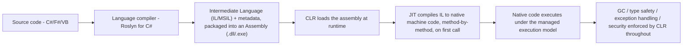
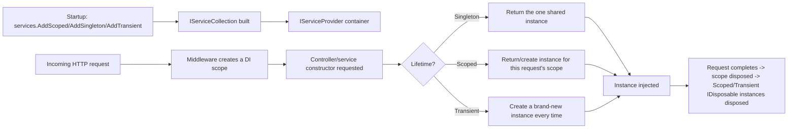
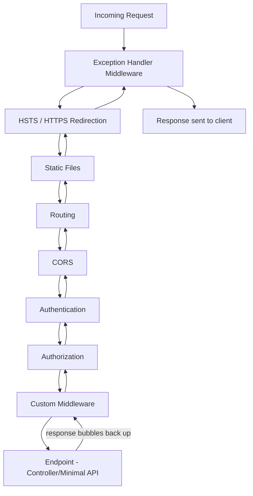
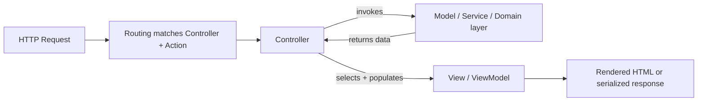
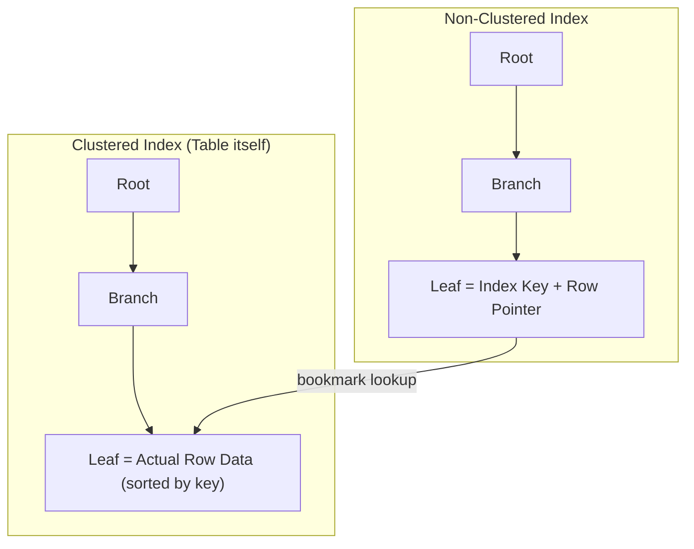
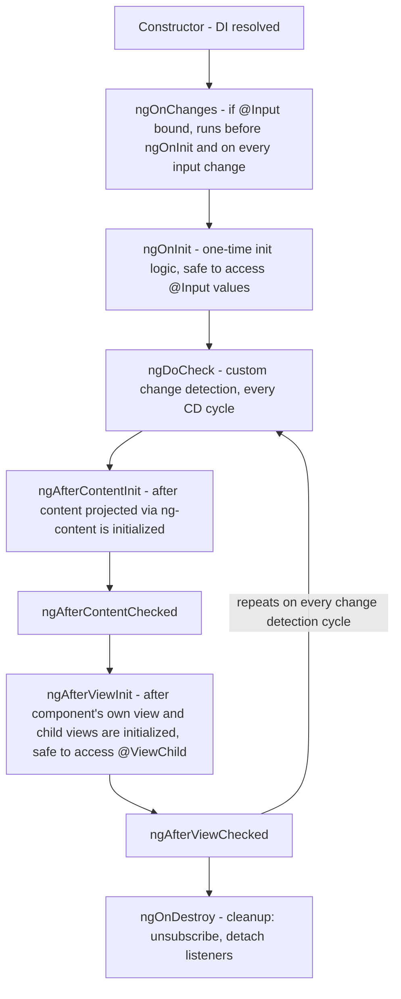
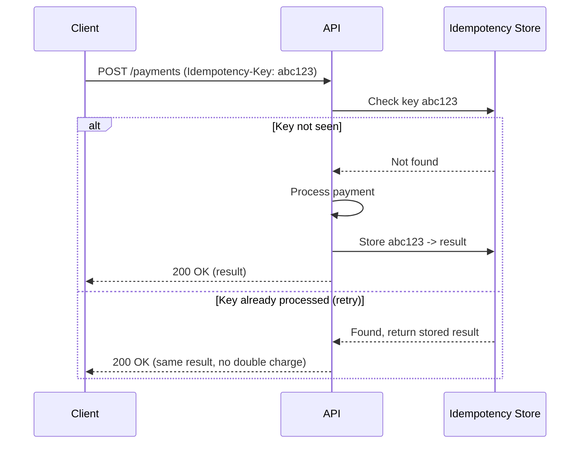

# Interview Questions — Interview Revision Notes

> Quick-revision Q&A `S. Interview-Questions-Interview-Guide.md` se derived hai. Source ke har section ko cover karta hai.

## Apne Baare Mein Bataiye / Project Experience

### Apne baare mein aur apne project experience ke baare mein briefly bataiye

**Q: Ek senior .NET interview mein "tell me about yourself" answer ko kaise structure karna chahiye?**

A: Ek 90-second narrative ke roop mein, resume recital nahi:

- Frame: experience ke saal, primary stack, aur aap kis tarah ke systems build karte ho.
- Depth signal: 1-2 projects jahan aapne architecture/design decisions own kiye, ek concrete outcome/metric ke saath.
- Current role: aapka scope (IC vs lead, mentoring, architecture ownership).
- Intent ke saath close karo: aap kyun look kar rahe ho aur yeh role aapki trajectory mein kaise fit hota hai.

Follow-ups expect karo jaise "Sabse hard technical decision kya tha jo aapne liya?" ya "Aap technically kisse disagree hue aur woh kaise resolve hua?"

### Current project mein responsibilities

**Q: Aap current project mein apni responsibilities ko kaise describe karoge?**

A: Isse ownership ke around frame karo, tasks ke around nahi — system design, API contracts, DB schema decisions, code review gatekeeping, mentoring, CI/CD ownership, production incident response. Cross-team responsibilities (QA, DevOps, product) mention karo full-stack/lead maturity signal karne ke liye; interviewers sunte hain ki aap decisions influence karte ho ya sirf tickets execute karte ho.

### Aap kis tech stack par kaam kar rahe hain – Backend / Frontend / DevOps

**Q: Senior level par "what's your tech stack" ka jawab kaise dete ho?**

A: Ek concise rundown do plus har choice ke peeche ka "why":

- Backend: C#/ASP.NET Core version, EF Core, SQL Server/PostgreSQL, message broker agar use hota hai.
- Frontend: Angular version, state approach (NgRx/services+RxJS/Signals), UI library.
- DevOps: CI/CD tool, containerization, cloud, monitoring stack.

"Why X over Y?" ke liye ek real trade-off ready rakho (jaise, NgRx ko plain services+RxJS ke bajaye choose karna kyunki state 12+ components ke across shared tha).

## C# Language & OOP

### .NET kya hai aur yeh kaise kaam karta hai?

**Q: .NET kya hai, aur compile/execution pipeline kya hai?**

A: .NET ek runtime + base class libraries + tooling hai jo multiple languages (C#, F#, VB.NET) ko ek common IL format mein compile hone deta hai aur ek shared execution engine par run karta hai.



"Managed execution model" ka matlab hai ki CLR (OS nahi) memory/GC, type safety, structured exception handling, aur security boundaries ko control karta hai.

**Q: Tiered compilation aur Native AOT kya hain?**

A: Tiered compilation: Tier 0 quick startup ke liye ek fast, minimally-optimized JIT pass karta hai; hot methods ko Tier 1 par full optimization ke saath re-JIT kiya jaata hai jab pata chal jaaye ki woh matter karte hain. Native AOT (.NET 8+) directly native code mein ahead of time compile karta hai, CLR/JIT step skip karke — serverless cold starts/CLI/containers ke liye achha hai, reflection-heavy/dynamic-codegen features lose karne ki cost par.

### CLR (Common Language Runtime) kya hai?

**Q: CLR actually kya karta hai?**

A: Managed execution engine jo compiled assemblies ko host aur run karta hai:

- JIT compilation (IL → native, per method, tiered).
- Memory management (managed heap + generational GC).
- Type safety/verification (`unsafe` ke bahar illegal casts/stray memory access block karta hai).
- Structured exception handling (sabhi CLR languages ke across uniform).
- GC hosting, thread/AppDomain management, aur interop (P/Invoke, COM).

**Q: Different CLR implementations ke naam batao.**

A: CoreCLR (cross-platform, modern .NET), Mono (historically mobile/Unity), aur Native AOT (runtime par bilkul CLR/JIT nahi — ahead of time compile karta hai).

### .NET mein Assemblies kya hain?

**Q: Assembly kya hai, aur yeh namespace se kaise differ karta hai?**

A: Assembly deployment/versioning/type-scoping ki physical unit hai — ek `.dll`/`.exe` jismein IL code, metadata, ek manifest (name/version/culture/references), aur optional embedded resources hote hain. Namespace ek purely logical, compile-time naming construct hai jiski koi physical existence nahi hoti — ek assembly mein kayi namespaces ho sakte hain, aur (rarely) ek namespace multiple assemblies ke across span kar sakta hai.

**Q: .NET Core assembly loading/isolation ko kaise handle karta hai?**

A: `AssemblyLoadContext` ne Framework-era GAC/strong-naming/AppDomain model ko replace kiya, ek process mein same assembly ke multiple versions ka side-by-side loading enable karte hue — yehi mechanism hai jo robust plugin architectures ke peeche hai. Metadata-driven Reflection (DI auto-registration, EF Core convention scanning, JSON serializers, AutoMapper ko power karta hai) types/attributes dhoondhne ke liye assemblies ko walk karta hai.

### C# mein string kya hai? Yeh immutable kyun hai?

**Q: C# mein `string` immutable kyun hai?**

A: `string` ek sealed reference type hai (heap-allocated, UTF-16). Immutability yeh deti hai:

- Thread safety (concurrent reads ke liye koi locking nahi chahiye).
- Safe string interning (ek mutable literal uski har reference ko corrupt kar dega).
- Reliable hashing (mutable dictionary/hashset keys unke bucket ko break kar dengi).
- Security (validated values ko reference ke through post-check alter nahi kiya ja sakta).

Har "mutation" (`+=`, `.Replace()`, `.ToUpper()`) ek naya string allocate karta hai — isliye loop mein heavy concatenation O(n²) allocations hai, aur isliye `StringBuilder`/`Span<char>` iska fix hain.

**Q: `StringBuilder` immutability performance cost ko kaise avoid karta hai?**

A: Yeh ek internal mutable char buffer ko pre-allocate/grow karta hai aur sirf `.ToString()` par, ek baar, ek immutable `string` materialize karta hai.

### .NET Framework aur .NET Core (aur .NET 7/8/9) mein difference

**Q: .NET Framework modern .NET (Core/5+) se kaise compare karta hai?**

A:

| Aspect | .NET Framework | .NET Core (→ .NET 5+) |
|---|---|---|
| Platform | Windows only | Cross-platform |
| Open source | Partially | Fully |
| Deployment | GAC, machine-wide | Self-contained/side-by-side |
| Performance | Slower JIT, older GC | Faster (tiered JIT, ReadyToRun) |
| Modularity | Monolithic | NuGet-based |
| Web stack | ASP.NET (IIS-coupled) | ASP.NET Core (Kestrel) |
| Future | Maintenance only | Active, yearly releases |
| Containers | Poor | Excellent |

.NET 5 ke baad se, "Core" naam se drop kar diya gaya — .NET Framework 4.8 last version hai (security patches only). Even releases (8, 10) LTS hain; odd releases (7, 9) STS hain. (Interview time par current LTS cadence verify karo.)

### Value Types vs Reference Types kya hain?

**Q: Value types vs reference types — key differences aur ek gotcha?**

A: Value types (`int`, `struct`, `enum`, `bool`) stack/inline par rehte hain aur assignment par full value copy karte hain; reference types (`class`, `string`, arrays) heap par rehte hain aur sirf reference copy karte hain. Gotcha: reference-type fields wala ek struct bhi sirf shallow-copy karta hai (referenced object shared rehta hai); ek value type ko `object` mein boxing karna heap par allocate karta hai — ek hot-path perf trap.

### Constructors kya hain? Parameterized vs Non-parameterized

**Q: Parameterized vs non-parameterized constructors, aur related follow-ups?**

A: Ek constructor object state initialize karta hai, class ka naam share karta hai, koi return type nahi hota. Koi bhi constructor define karne se compiler ka auto-generated default constructor suppress ho jaata hai. Related: constructor chaining (`this(...)`/`base(...)`), static constructors (ek baar run hote hain, first use se pehle, no modifiers/params), aur primary constructors (C# 12: `public class Person(string name, int age) {}`).

```csharp
public class Employee
{
    public string Name { get; }
    public decimal Salary { get; }

    public Employee() : this("Unknown", 0) { }         // chaining
    public Employee(string name, decimal salary)
    {
        Name = name;
        Salary = salary;
    }
}
```

### Method Overloading vs Method Overriding

**Q: Overloading vs overriding — differences aur classic gotcha?**

A: Overloading = same name, different signature, compile-time par resolved; overriding = subclass ek `virtual`/`abstract` base method ko same signature ke saath redefine karta hai, runtime par actual object type se resolved.

```csharp
class Shape
{
    public virtual double Area() => 0;
}
class Circle : Shape
{
    public double Radius;
    public override double Area() => Math.PI * Radius * Radius;   // overriding
}
class Calculator
{
    public int Add(int a, int b) => a + b;
    public double Add(double a, double b) => a + b;                // overloading
}
```

Gotcha — `new` vs `override`: `new` base member ko hide karta hai (static reference type se resolved); `override` true polymorphism deta hai (runtime type se resolved):

```csharp
Shape s = new Circle();
s.Area();  // override → Circle.Area() called (polymorphic)
           // if Circle used "new" instead of "override" → Shape.Area() called (0)
```

### Real project examples ke saath OOP concepts explain karo

**Q: Four OOP pillars ke project-grounded examples do.**

A:

- Encapsulation: Ek public mutable `List<Item>` expose karne ke bajaye `Order.AddItem()`, business rules ko ek jagah enforce karte hue.
- Abstraction: `IPaymentGateway` `Stripe`/`PayPal` implementations ke saath — callers ko care nahi ki kaunsa wired up hai.
- Inheritance: `BaseRepository<T>` ko `OrderRepository` extend karta hai; note karo ki modern design mein composition often inheritance se preferred hoti hai.
- Polymorphism: `IEnumerable<IShape>` jahan `Area()` har concrete shape ke liye different hai — Strategy/Open-Closed enable karta hai.

### Interface aur Abstract Class mein difference

**Q: Interface vs abstract class — aap distinction ko kaise frame karte ho?**

A: "Interfaces define karte hain ki ek object kya kar sakta hai; abstract classes define karti hain ki ek object kya hai, shared implementation ke saath." Ek class kayi interfaces implement kar sakti hai lekin sirf ek abstract class inherit kar sakti hai; interfaces traditionally koi instance fields nahi rakhte (jab tak ki recent C# ne static members add nahi kiye), aur C# 8 se default implementations behavior par pure-contract line ko blur karti hain; abstract classes abstract/concrete members mix kar sakti hain aur instance state rakh sakti hain. Interfaces = "can-do" capability contracts (`IDisposable`); abstract classes = "is-a" shared base (`Stream`).

### C# mein Collections kya hain?

**Q: Common generic collection types compare karo.**

A:

| Collection | Backing | Ordered | Duplicates | Use |
|---|---|---|---|---|
| `List<T>` | Dynamic array | Yes | Yes | General ordered list |
| `Dictionary<K,V>` | Hash table | No | Unique keys | O(1) lookup |
| `HashSet<T>` | Hash table | No | No | Membership/set ops |
| `Queue<T>` | Circular buffer | FIFO | Yes | Task queues, BFS |
| `Stack<T>` | Array | LIFO | Yes | Undo, DFS |
| `LinkedList<T>` | Doubly-linked | Yes | Yes | Mid-list insert (rare in practice) |
| `ConcurrentDictionary<K,V>` | Thread-safe hash table | No | Unique keys | Multi-threaded caches |
| `ImmutableList<T>` | Persistent tree/array | Yes | Yes | Functional/lock-free |

Gotcha: `Dictionary<K,V>` concurrent writes ke liye thread-safe nahi hai; iterate karte waqt collection ko mutate karna `InvalidOperationException` throw karta hai (fix: `.ToList()` snapshot ya `RemoveAll`).

### Simple example ke saath LINQ explain karo

**Q: LINQ kya hai, aur kaunsi nuances seniority signal karti hain?**

A: `IEnumerable<T>` (LINQ to Objects, in-memory) aur `IQueryable<T>` (EF Core, SQL mein translated) par ek unified declarative query syntax.

```csharp
var seniorDevs = employees
    .Where(e => e.YearsExperience >= 8)
    .OrderByDescending(e => e.YearsExperience)
    .Select(e => new { e.Name, e.YearsExperience })
    .ToList();
```

Key nuances: deferred execution (query enumerate hone tak run nahi hota); `IEnumerable` in-memory run hota hai vs `IQueryable` ek expression tree build karta hai jo SQL mein translate ho jaata hai — `.ToList()` se pehle filtering DB par kaam push karta hai; multiple enumeration poori pipeline ko re-run karta hai (reuse hone par `.ToList()`/`.ToArray()` se cache karo).

## Async, Threading & Concurrency

### Garbage Collector kya hai? Yeh kaise kaam karta hai?

**Q: .NET GC kaise kaam karta hai (generations, LOH, modes)?**

A: Managed heap ke liye automatic memory manager; kisi bhi root se unreachable objects ko reclaim karta hai.

- Gen 0: short-lived, frequently/fast collected.
- Gen 1: Gen 0 aur Gen 2 ke beech ka buffer.
- Gen 2: long-lived, rarely collected, sabse expensive.
- LOH: ≥85,000 bytes wale objects, sirf Gen 2 par collected, default roop se compacted nahi.

Mark phase roots se live-object graph ko walk karta hai; Gen 0/1 collections survivors ko compact karte hain. Workstation vs Server GC (throughput ke liye per-core heaps/threads); Background/concurrent GC Gen 2 pause times reduce karta hai.

**Q: Senior-level GC gotchas jo proactively raise karne chahiye?**

A:

- Unmanaged resources ke liye `using`/`IDisposable` phir bhi chahiye — GC ko unke baare mein pata nahi hota; finalizers ek safety net hain, strategy nahi.
- Memory leaks phir bhi hoti hain: bhoole hue `+=` event subscriptions, unbounded static collections, long-lived caches mein captured closures.
- Production mein manually `GC.Collect()` kabhi call na karo — ek expensive full collection force karta hai.
- `Span<T>`/`stackalloc` hottest paths mein heap allocation ko entirely avoid karte hain.

### Delegates kya hain? Delegates ke types

**Q: Delegate kya hai, aur built-in generic forms kya hain?**

A: Ek type-safe function pointer — ek ya multiple methods ki reference rakhta hai matching signature ke saath. Built-ins: `Action<T...>` (no return), `Func<T...,TResult>` (ek value return karta hai), `Predicate<T>` (bool return karta hai).

```csharp
public delegate int Operation(int a, int b);

Operation add = (a, b) => a + b;
Func<int,int,int> subtract = (a, b) => a - b;

// Multicast
Action<string> log = Console.WriteLine;
log += msg => File.AppendAllText("log.txt", msg);
log("Both handlers run");
```

**Q: Multicast delegate gotcha kya hai, aur events kaise relate karte hain?**

A: Agar multiple methods `+=` ke through chained hain aur koi bhi value return karta hai, to sirf last invoked method ka return value observe hota hai — isliye multicast mainly `void` delegates jaise events ke saath use hota hai. `event` external code ko sirf `+=`/`-=` restrict karta hai, outsiders ko handler list invoke/clear karne se roka jaata hai. Rx ka `IObservable<T>` isi push-based pattern ko ek composable stream mein generalize karta hai (.NET ka analog Angular ke RxJS `Observable` ka).

### C# mein Async-Await aur Asynchronous Programming explain karo

**Q: `async`/`await` ke liye mental model kya hai?**

A: Task-based Asynchronous Pattern ke upar syntactic sugar; compiler method ko ek state machine mein rewrite karta hai. `await` ek naya thread create nahi karta — yeh ek continuation register karta hai aur current thread ko pool mein release kar deta hai jab tak operation in flight hai, done hone par ek captured context ya pool thread par resume hota hai.

```csharp
public async Task<Order> GetOrderAsync(int id)
{
    var order = await _dbContext.Orders.FindAsync(id);
    var enriched = await _pricingService.EnrichAsync(order);
    return enriched;
}
```

**Q: Key async gotchas jo ek senior dev ko raise karni chahiye?**

A:

- `async void` ko top-level event handlers ke bahar avoid karna chahiye — exceptions await/catch nahi ho sakte aur process crash kar sakte hain.
- Library code mein `ConfigureAwait(false)` original context ko capture karne se bachta hai, overhead/deadlock risk reduce karta hai.
- Classic deadlock: `SynchronizationContext` wale context mein (old ASP.NET, UI apps) async par `.Result`/`.Wait()` se block karna — continuation ko wahi captured, blocked context chahiye. ASP.NET Core mein default roop se koi aisa context nahi hota lekin "async all the way" phir bhi best practice hai.
- `ValueTask<T>` ek heap allocation avoid karta hai jab result often already synchronously available hai (cache hits) — lekin ise twice await ya store nahi karna chahiye, `Task` ke unlike.
- Async methods mein exceptions returned `Task` mein capture hoti hain aur `await` par rethrow hoti hain; fire-and-forget tasks ko phir bhi error handling ke saath wrap karna chahiye.

### Multithreading vs Async — difference kya hai?

**Q: Multithreading vs async/await — actually kya different hai?**

A:

| | Multithreading | Async |
|---|---|---|
| Goal | Parallelism (CPU-bound, simultaneous) | Concurrency (I/O wait ke dauraan block na karo) |
| Threads | Actively multiple OS threads use karta hai | Wait ke dauraan current thread ko free karta hai |
| Best for | CPU-bound work | I/O-bound work |
| Tools | `Thread`, `Task.Run`, `Parallel.For` | `async`/`await`, `Task`, `ValueTask` |
| Cost | Thread creation/context switch expensive hai | Cheap — wait karne mein koi thread "spend" nahi hota |

Key insight: async threads create karne ke baare mein nahi hai, yeh ek thread ko wait karne mein waste na karne ke baare mein hai. `Task.Run` ko CPU-bound work offload karne ke liye reserve karna chahiye, already-async I/O calls ko wrap karne ke liye nahi (`SaveChangesAsync()` ko `Task.Run` mein wrap karna bekar mein ek pool thread burn karta hai).

### readonly vs constant (`const`)

**Q: `const` vs `readonly` — aur real production gotcha kya hai?**

A:

| | `const` | `readonly` |
|---|---|---|
| Assigned | Compile time | Runtime |
| Storage | Har call site par inlined | Actual field, ek baar set |
| Static? | Implicitly static | Instance ya static ho sakta hai |
| Types | Primitives/string/enum only | Any type |

Gotcha: ek referenced assembly mein `const` change karne ke liye **saare** consumers ko recompile karna padta hai (value unke compile time par inlined hota hai); `readonly` value change karna aisa nahi karta — runtime par resolved. Yeh multi-assembly/NuGet scenarios ke liye real interview-worthy detail hai.

### Abstract vs Virtual

**Q: `abstract` vs `virtual` — key differences?**

A: `abstract` ka koi base implementation nahi hota aur first concrete subclass mein override mandate karta hai (base class instantiate nahi ho sakti); `virtual` ka ek default body hota hai jiske liye overriding optional hai, aur base class instantiate ho sakti hai. `abstract` use karo jab koi sensible default na ho; `virtual` jab most subtypes ek default reuse kar sakein.

### Extension Methods + Example

**Q: Extension methods kaise kaam karte hain, aur resolution gotcha kya hai?**

A: Ek static class mein static methods, `this` first parameter par, jisse aap un types mein methods "add" kar sakte ho jo aap own nahi karte, inheritance ke bina.

```csharp
public static class StringExtensions
{
    public static bool IsNullOrBlank(this string? value) =>
        string.IsNullOrWhiteSpace(value);
}

// usage
if (userInput.IsNullOrBlank()) { ... }
```

Compiler call ko ek static method call mein rewrite karta hai (yehi tarika hai jisse LINQ ke saare `.Where()`/`.Select()` `IEnumerable<T>` par implemented hote hain). Gotcha: compile time par static type se resolved, same signature ke ek instance method se hamesha lower priority, aur ek `null` reference par bina throw kiye callable (kyunki yeh actually sirf ek static call hai).

## .NET Core / ASP.NET Core & Middleware

### .NET Core mein Dependency Injection kya hai? Yeh internally kaise kaam karta hai?

**Q: DI kya hai, aur `Microsoft.Extensions.DependencyInjection` internally kaise kaam karta hai?**

A: DI Inversion of Control achieve karta hai: ek class apni dependencies declare karti hai (constructor params) unhe construct karne ke bajaye; ek container runtime par unhe supply karta hai.

1. Services `IServiceCollection` mein `ServiceDescriptor` entries (type, implementation/factory, lifetime) ke roop mein register hoti hain.
2. `.Build()` isse ek `IServiceProvider` mein compile karta hai.
3. Resolution par: descriptor ko lookup karta hai, constructor parameters ko recursively resolve karta hai, lifetime rules apply karta hai.
4. ASP.NET Core middleware ke through har HTTP request par ek naya DI scope create karta hai, request end par disposed — isliye Scoped == "per request."



### Service Lifetimes — Transient, Scoped, Singleton

**Q: Transient, Scoped, aur Singleton lifetimes compare karo.**

A:

| Lifetime | Created | Use | Gotcha |
|---|---|---|---|
| Transient | New every request | Cheap, stateless services | Wasteful if construction is expensive |
| Scoped | One per HTTP request/scope | `DbContext`, unit-of-work | Captive dependency if resolved from a Singleton |
| Singleton | One for app lifetime | Config, caches, logging | Must be thread-safe; must never hold a Scoped dependency |

**Q: "Captive dependency" bug kya hai aur uska fix?**

A: Ek Singleton jo apne constructor mein ek Scoped dependency (jaise `DbContext`) leta hai use ek baar inject hoti hai aur woh instance har request/user/thread ke across forever hold karti hai — concurrency exceptions, stale data, connection leaks cause karte hue. ASP.NET Core ka container yeh catch karne ke liye Development mein default roop se resolution time par throw karta hai (`ValidateScopes = true`). Fix: singleton mein `IServiceScopeFactory` inject karo aur har operation ke liye ek naya scope create karo.

### .NET Core mein Request Pipeline explain karo. Middleware kya hai aur yeh kaise execute hota hai?

**Q: ASP.NET Core middleware pipeline kaise execute hota hai?**

A: Poora request ek middleware ki pipeline ke roop mein model kiya jaata hai — har ek `next(context)` call karne se pehle act kar sakta hai, uske return hone ke baad act kar sakta hai, ya entirely short-circuit kar sakta hai (jaise, `next` call kiye bina 401 return karna). Yeh Chain of Responsibility pattern hai, `Program.cs` mein `app.Use...()` calls ke through configured, registration order mein.



Order matter karta hai: `UseAuthorization()` se pehle `UseAuthentication()`; routing ke baad aur authorization se pehle `UseCors()`; exception-handling middleware sabse pehle registered hota hai taaki yeh downstream sab kuch ko wrap kare.

**Q: Ek custom middleware example dikhao.**

A:

```csharp
public class RequestTimingMiddleware
{
    private readonly RequestDelegate _next;
    private readonly ILogger<RequestTimingMiddleware> _logger;

    public RequestTimingMiddleware(RequestDelegate next, ILogger<RequestTimingMiddleware> logger)
    {
        _next = next;
        _logger = logger;
    }

    public async Task InvokeAsync(HttpContext context)
    {
        var sw = Stopwatch.StartNew();
        await _next(context);                     // call the rest of the pipeline
        sw.Stop();
        _logger.LogInformation("{Method} {Path} took {Elapsed}ms",
            context.Request.Method, context.Request.Path, sw.ElapsedMilliseconds);
    }
}

// Program.cs
app.UseMiddleware<RequestTimingMiddleware>();
```

Minimal-API style inline middleware bhi allow karta hai: `app.Use(async (context, next) => { ... await next(); ... });`.

### MVC architecture explain karo

**Q: MVC ASP.NET Core par kaise map karta hai, especially ek pure Web API ke liye?**

A:



Model = domain/data layer (entities, DTOs, business rules), HTTP ke baare mein kuch nahi jaanta. View = presentation (classic MVC mein Razor; ek API-only backend mein "view" role client mein shift ho jaata hai aur controllers JSON return karte hain). Controller = HTTP aur service layer ke beech ek thin traffic cop. Ek pure API ke liye, "MVC" Model+Controller mein narrow ho jaata hai, lekin framework phir bhi same infrastructure (`ControllerBase`, model binding, filters) ke through route karta hai. Discipline jo matter karta hai: "thin controller, fat service."

### MVC mein Filters — yeh Middleware ke against kahan fit hote hain?

**Q: Middleware vs MVC filters — kab kaunsa use karte ho?**

A: Filters pipeline ke MVC action-invocation part ke andar run hote hain (routing ke baad), MVC-specific context (action arguments, model binding, `ActionResult`) tak access ke saath.

| Filter type | Runs | Use |
|---|---|---|
| Authorization | First, before model binding | Custom auth beyond `[Authorize]` |
| Resource | Around model binding | Caching short-circuits |
| Action | Before/after action executes | Logging, validation |
| Exception | On exception | MVC-scoped error handling |
| Result | Before/after result executes | Response formatting |

Rule of thumb: cross-cutting infra (auth, CORS, raw request/response logging) ke liye middleware; jab aapko MVC-specific context chahiye tab filters.

### API mein Validation

**Q: Senior level par API validation ko kaise approach karte ho?**

A:

- Data annotations (`[Required]`, `[StringLength]`, `[Range]`) — model binding se auto-validated; `[ApiController]` invalid model state par auto `400` `ProblemDetails` ke saath return karta hai.
- Complex, composable, testable rules ke liye FluentValidation preferred hai, DTO se decoupled.
- Domain-level validation (jaise credit-limit checks) service layer mein belong karti hai, attributes mein nahi — attributes sirf shape/format ke liye hain.

### Eager Loading vs Lazy Loading (EF) / Async vs Await

**Q: Yeh section ke do items kyun sirf kahin aur point karte hain?**

A: Source flag karta hai ki yeh original raw question lists se duplicates hain: Eager vs Lazy Loading Entity Framework ke under depth mein answer hua hai, aur Async/Await Async, Threading & Concurrency ke under depth mein answer hua hai — dono original grab-bag lists ke across multiple baar appear hue the aur same answer repeat karne se bachne ke liye consolidate kiye gaye.

## Authentication, Authorization & API Design

### ASP.NET (Core) mein REST API explain karo

**Q: REST ke defining constraints kya hain, aur ASP.NET Core unhe kaise realize karta hai?**

A: Six constraints (Fielding): Client-Server separation, Statelessness (har request self-contained — yehi hai jo load balancer ke peeche horizontal scaling enable karta hai), Cacheability (`Cache-Control`/`ETag`), Uniform Interface (URIs + standard verbs, self-descriptive JSON), Layered System (client ko pata nahi chalta ki front mein ek gateway/proxy hai ya nahi), Code on Demand (rarely use hota hai).

ASP.NET Core inhe attribute routing (URIs→resources), CRUD par map hone wale HTTP verbs, `IActionResult`/proper status codes, content negotiation, aur model binding/validation ke through realize karta hai.

**Q: Richardson Maturity Model kya hai, aur most real APIs kahan sit karti hain?**

A: Level 0: single RPC-style endpoint. Level 1: multiple resource URIs. Level 2: proper verbs + status codes — jahan almost sab real-world "REST APIs" actually sit karti hain. Level 3: HATEOAS add karta hai (responses discoverable next actions ke liye hypermedia links include karte hain). Honest senior answer: most APIs deliberate trade-off ki wajah se Level 2 par "RESTish" hain, ignorance ki wajah se nahi.

### Login mechanism / JWT Authentication kya hai? / JWT claims ke through user identity logging

**Q: End to end JWT login flow ke through walk karo.**

A:

1. User ek login endpoint par credentials submit karta hai.
2. Server ek identity store ke against validate karta hai.
3. Server ek JWT issue karta hai: `header.payload.signature` (base64url) — header (algorithm), payload/claims (`sub`, `role`, `exp`, custom claims), signature (HMAC/RSA header+payload ke upar, tampering rokta hai lekin payload phir bhi readable hai, confidential nahi).
4. Client ise `Authorization: Bearer <token>` ke roop mein bhejta hai (XSS risk ki wajah se `localStorage` avoid karo).
5. `UseAuthentication()` har request par signature+expiry validate karta hai, `HttpContext.User` (`ClaimsPrincipal`) populate karta hai.
6. Code identity ko `User.FindFirst(ClaimTypes.NameIdentifier)` ya `IHttpContextAccessor` se read karta hai.

Refresh tokens (long-lived, server-side/httpOnly cookie mein stored) re-login force kiye bina short-lived access tokens re-issue karte hain. Gotcha: JWTs signed (JWS) hote hain lekin default roop se encrypted (JWE) nahi hote — payload mein kabhi bhi secrets/PII na daalo.

### Authentication vs Authorization

**Q: ASP.NET Core mein authentication vs authorization kaise differ karte hain?**

A: Authentication "aap kaun ho?" ka jawab deta hai (`UseAuthentication()`, pehle run hota hai — password/JWT/OAuth2/OIDC/API keys); authorization "aap kya allowed ho?" ka jawab deta hai (`UseAuthorization()`, baad mein run hota hai, Roles/Policies/Claims ke through).

### CORS kyun?

**Q: CORS kaunsa problem solve karta hai, aur common misconception kya hai?**

A: Browsers Same-Origin Policy enforce karte hain; CORS server ka opt-in hai (`Access-Control-Allow-Origin` etc.) browser ko batata hai ki kaunse origins ek cross-origin response read kar sakte hain. Misconception: CORS browser-enforced hai, ek server security boundary nahi — non-browser clients (Postman, curl, server-to-server) entirely unaffected hain; real security ko phir bhi auth/authz chahiye. Preflight `OPTIONS` requests non-simple requests bhejne se pehle permissions check karti hain.

```csharp
builder.Services.AddCors(options =>
    options.AddPolicy("Frontend", policy =>
        policy.WithOrigins("https://app.example.com")
              .AllowAnyHeader()
              .AllowAnyMethod()
              .AllowCredentials()));
// ...
app.UseCors("Frontend");
```

### Attribute Routing

**Q: Attribute routing kya hai, aur iske benefits kya hain?**

A: Routes ek central route table ke bajaye attributes ke through directly controllers/actions par declared hoti hain.

```csharp
[ApiController]
[Route("api/[controller]")]
public class OrdersController : ControllerBase
{
    [HttpGet("{id:int}")]
    public async Task<ActionResult<OrderDto>> GetById(int id) { ... }

    [HttpGet]
    public async Task<ActionResult<IEnumerable<OrderDto>>> GetAll([FromQuery] OrderFilter filter) { ... }

    [HttpPost]
    public async Task<ActionResult<OrderDto>> Create([FromBody] CreateOrderRequest request) { ... }
}
```

Benefits: discoverability (routes code ke saath rehte hain), route constraints (`{id:int}`), `[Route]` prefixes aur versioning ke saath clean composition.

### API mein Versioning

**Q: API versioning strategies kya hain, aur aap breaking changes ko kaise manage karte ho?**

A:

| Strategy | Example | Trade-off |
|---|---|---|
| URI segment | `/api/v1/orders` | Explicit/cacheable; clutters URLs |
| Query string | `?api-version=1.0` | Easy to add; easy to forget |
| Header | `Api-Version: 1.0` | Clean URLs; less discoverable |
| Media type | `Accept: application/json;v=1.0` | RESTfully correct; rare |

`Asp.Versioning.Mvc` version negotiation + deprecation headers (`Sunset`, `Deprecation`) handle karta hai. Senior discipline: additive-only changes ko version bump ki zarurat nahi; breaking changes ko hai, aur unke saath ek deprecation window aur consumer communication plan ship hona chahiye.

### Exception Handling Approach (.NET Core mein)

**Q: Senior-level layered exception-handling approach kya hai?**

A:

1. Global exception middleware (`UseExceptionHandler()`/`IExceptionHandler` .NET 8+ mein) sab unhandled cheez catch karta hai, ek correlation id ke saath log karta hai, standardized `ProblemDetails` return karta hai (prod mein kabhi stack traces leak nahi karte).
2. Domain/business exceptions (`OrderNotFoundException`) generic 500s ke bajaye specific status codes par map hoti hain.
3. Try/catch sirf boundary par — call stack mein deep catch-and-rethrow mat karo.
4. Result-pattern alternative (`Result<T>`/`OneOf<T>`) expected failure paths ke liye, truly unexpected conditions ke liye exceptions reserve karte hue.

```csharp
app.UseExceptionHandler(errApp => errApp.Run(async context =>
{
    var feature = context.Features.Get<IExceptionHandlerFeature>();
    var ex = feature?.Error;
    context.Response.StatusCode = ex switch
    {
        NotFoundException => StatusCodes.Status404NotFound,
        ValidationException => StatusCodes.Status400BadRequest,
        _ => StatusCodes.Status500InternalServerError
    };
    await context.Response.WriteAsJsonAsync(new ProblemDetails
    {
        Status = context.Response.StatusCode,
        Title = ex?.Message ?? "An unexpected error occurred",
        Instance = context.TraceIdentifier
    });
}));
```

### Aap ek ASP.NET application mein performance kaise improve karte ho?

**Q: Aap "how do you improve API performance" answer ko kaise structure karoge?**

A: Layer ke through:

- Data access: indexing, N+1 avoid karo, `AsNoTracking()`, DTOs mein projection, pagination, compiled queries.
- Caching: `IMemoryCache` (single instance) / Redis (scaled-out), response/output caching, sane TTLs ke saath cache-aside.
- Async all the way; streaming ke liye `IAsyncEnumerable<T>`.
- Har call ke liye `new HttpClient()` ke bajaye `HttpClientFactory`; DB connection pooling.
- Most workloads ke liye `Newtonsoft.Json` ke bajaye `System.Text.Json`; AOT ke liye source-generated contexts.
- Response compression, trimmed DTOs, internal service calls ke liye gRPC.
- Horizontal scaling, load balancing, CDN, minimal per-request middleware work.
- Optimize karne se pehle profile karo (`dotnet-trace`, App Insights) — measure karo, assume mat karo.

## Design Patterns & SOLID

### Design Patterns (general)

**Q: Interview mein design patterns ke baare mein kaise baat karni chahiye?**

A: Woh patterns naam lo jo aapne actually use kiye hain, categorized — Creational (Singleton, Factory Method, Abstract Factory, Builder), Structural (Adapter, Decorator, Facade, Proxy), Behavioral (Strategy, Observer, Chain of Responsibility — ASP.NET Core middleware khud, Template Method, Mediator/`MediatR`). GoF list recite karne ke bajaye 2-3 ko real usage se tie karo, jaise "region ke hisaab se pricing algorithms swap karne ke liye Strategy pattern" ya "testability ke liye EF Core ke around Repository + Unit of Work."

### Singleton Pattern

**Q: Singleton implement karo, aur ASP.NET Core mein isse kaise use karna chahiye?**

A:

```csharp
public sealed class ConfigurationCache
{
    private static readonly Lazy<ConfigurationCache> _instance =
        new(() => new ConfigurationCache());

    public static ConfigurationCache Instance => _instance.Value;

    private ConfigurationCache() { /* load config once */ }
}
```

`Lazy<T>` bina manual locking ke thread-safe, on-demand init deta hai. ASP.NET Core mein, classic static-instance GoF pattern se DI `AddSingleton` prefer karo — equally single-instance lekin testable/mockable. Gotcha: singletons thread-safe hone chahiye aur kabhi Scoped dependencies capture nahi karni chahiye (captive dependency).

### SOLID Principles (especially Dependency Inversion Principle)

**Q: SOLID principles state karo aur har ek kyun matter karta hai.**

A:

| Principle | Statement | Why |
|---|---|---|
| Single Responsibility | One reason to change | Smaller, testable, less ripple |
| Open/Closed | Open for extension, closed for modification | New behavior via new code, not edits |
| Liskov Substitution | Subtypes substitutable for base | Prevents surprising overrides breaking invariants |
| Interface Segregation | Many small interfaces > one large | Avoids forced stub implementations |
| Dependency Inversion | High/low-level modules both depend on abstractions | Enables DI/testability |

**Q: Two-part DIP definition kya hai, aur yeh DI se kaise differ karti hai?**

A: (1) High-level modules ko abstractions par depend karna chahiye, concrete low-level modules par nahi. (2) Abstractions ko details par depend nahi karna chahiye; details ko abstractions par depend karna chahiye.

```csharp
// Violates DIP: OrderService directly depends on SqlOrderRepository
public class OrderService
{
    private readonly SqlOrderRepository _repo = new();
}

// Follows DIP: both depend on the IOrderRepository abstraction
public interface IOrderRepository { Order GetById(int id); }

public class OrderService
{
    private readonly IOrderRepository _repo;
    public OrderService(IOrderRepository repo) => _repo = repo;
}
```

DI mechanism hai; DIP woh principle hai jo yeh fulfill karta hai — dono ko conflate karna ek mid-vs-senior tell hai.

## Entity Framework (Core)

### Entity Framework kya hai?

**Q: EF Core kya hai, ek mechanical level par?**

A: Microsoft ka ORM: CLR entities ko relational rows mein map karta hai, `IQueryable<T>` providers ke through LINQ ko SQL mein translate karta hai, retrieved entities par changes track karta hai, `SaveChanges()` par insert/update/delete SQL generate karta hai. ADO.NET ke upar sit karta hai, connection/command/reader plumbing ko abstract karte hue.

### Code First vs Database First — aap kaunsa prefer karte ho & kyun?

**Q: Code First vs Database First — trade-offs aur ek defensible preference?**

A:

| | Code First | Database First |
|---|---|---|
| Source of truth | C# entities + `DbContext` | Existing DB schema |
| Evolution | Migrations generate SQL diffs | Scaffold regenerates model from DB |
| Best for | Greenfield, schema under source control | Legacy DBs, DBA-owned schemas |
| VCS friendliness | Excellent (migrations are code) | Weaker |

Preference: active feature development ke liye Code First with Migrations (schema changes code ke saath co-located, PR mein reviewable, CI/CD mein `dotnet ef database update` ke through repeatable). Database First jab ek DBA team schema independently own karti hai ya strict change-control enterprises mein — "right" answer context-dependent hai, aur yeh kehna khud ek senior signal hai.

### Code First mein Migrations kaise kaam karti hain

**Q: EF Core migrations lifecycle ke through walk karo, aur production gotcha.**

A:

1. Entity classes/`DbContext` config change karo.
2. `dotnet ef migrations add <Name>` — current model snapshot ko previous ke against diff karta hai, `Up()`/`Down()` generate karta hai.
3. `dotnet ef database update` (ya startup par `Database.Migrate()`) pending migrations apply karta hai, `__EFMigrationsHistory` mein record karta hai.
4. `Down()` rollback allow karta hai.

Gotcha: app startup par automatically migrations apply karna multi-instance/blue-green deployments mein risky hai (race conditions, rolling-deploy schema mismatch). Production-grade: migrations ko ek separate, gated CI/CD step ke roop mein run karo instances start hone se pehle.

### Eager Loading vs Lazy Loading

**Q: EF Core mein eager vs lazy loading, aur N+1 trap?**

A:

| | Eager | Lazy |
|---|---|---|
| Mechanism | `.Include()`/`.ThenInclude()` | Auto-loads on nav-property access (needs proxies + `virtual`) |
| When query runs | Immediately | On first access, possibly outside original context scope |
| Gotcha | Over-fetching | N+1 — a loop-triggered query per iteration, invisible in code |

Explicit Loading ek third option hai: `context.Entry(entity).Collection(e => e.Items).Load()`. Senior stance: default roop se lazy loading disable karo; eager `.Include()` ya projection (`.Select()` DTOs mein) prefer karo — projection over-fetching columns aur change-tracking overhead ko bhi avoid karta hai.

### EF Performance Improvements

**Q: Main EF Core performance levers list karo.**

A:

- Read-only queries ke liye `AsNoTracking()`.
- Full entity graphs ke bajaye DTOs ke liye Projection (`.Select()`).
- Deliberate `.Include()` ya single projected queries ke through N+1 avoid karo.
- Extremely hot repeated shapes ke liye Compiled queries (`EF.CompileAsyncQuery`).
- Batching — lekin loop mein per-row `SaveChanges()` benefit kill karne se dhyan rakho.
- Multi-collection `.Include()` chains ke liye cartesian explosion avoid karne ke liye Split queries (`.AsSplitQuery()`).
- Bulk ops: `ExecuteUpdateAsync`/`ExecuteDeleteAsync` (EF Core 7+) ya bulk-extensions libraries, `SaveChanges()` nahi.
- DB-layer indexing (EF ek missing index fix nahi kar sakta).
- Context-construction allocation overhead reduce karne ke liye `AddDbContextPool`.

### DB Context Lifetime & Usage

**Q: `DbContext` default roop se Scoped kyun registered hai?**

A: Yeh thread-safe nahi hai (kabhi ek instance ko concurrently threads/requests ke across share na karo); yeh ek unit-of-work hai (change tracker changes accumulate karta hai aur `SaveChanges()` par ek saath flush karta hai, naturally ek request/transaction boundary ke saath align karte hue). Ise bahut lambe time tak alive rakhna (jaise accidentally singleton) stale tracked entities, memory growth, concurrency exceptions cause karta hai — captive-dependency gotcha se juda hua. Background workers ke liye, `IServiceScopeFactory.CreateScope()` ke through per unit of work explicitly scopes create karo.

## SQL

### Joins ke Types

**Q: SQL join types list karo aur har ek kya return karta hai.**

A:

| Join | Returns |
|---|---|
| `INNER JOIN` | Only matching rows in both tables |
| `LEFT JOIN` | All left rows + matches (NULLs otherwise) |
| `RIGHT JOIN` | All right rows + matches |
| `FULL JOIN` | All rows both sides, NULLs where unmatched |
| `CROSS JOIN` | Cartesian product |
| `SELF JOIN` | A table joined to itself |

```sql
SELECT e.Name AS Employee, m.Name AS Manager
FROM Employees e
LEFT JOIN Employees m ON e.ManagerId = m.EmployeeId;   -- self join example
```

### Indexes kya hain? Clustered vs Non-Clustered

**Q: Clustered vs non-clustered indexes — yeh kaise differ karte hain?**

A:

| | Clustered | Non-Clustered |
|---|---|---|
| Physical order | Determines row storage order — the table *is* the index | Separate structure; leaf holds key + pointer back to the row |
| Count | Exactly one | Many |
| Lookup | Direct | Extra bookmark lookup unless query is covered |
| Default | PK gets one by default in SQL Server | Created explicitly for hot predicates |



Ek covering index (`INCLUDE`d columns) bookmark lookup ko entirely avoid karta hai — ek key perf-tuning tool.

### Stored Procedures vs Views vs Functions

**Q: Stored procedures, views, aur functions compare karo.**

A:

| | Stored Proc | View | Function |
|---|---|---|---|
| Modify data | Yes | No (usually) | No |
| Parameters | Yes | No | Yes |
| Callable in SELECT | No | Yes | Yes |
| Multiple result sets | Yes | No | No |
| Transaction control | Yes | No | No |

Gotcha: large tables par row-by-row call hone wale scalar UDFs ek classic perf trap hain (historically inlined nahi hote the); SQL Server 2019+ ne many cases mein isse mitigate karne ke liye scalar UDF inlining add kiya — assume karne ke bajaye execution plans check karo.

### CTE (Common Table Expression)

**Q: CTE kya hai, aur uska recursion/re-evaluation gotcha?**

A: Ek named temporary result set (`WITH`), us statement ke liye scoped jo follow karta hai — nested subqueries se readability improve karta hai aur recursive queries (org-chart traversal) enable karta hai.

```sql
WITH OrgChart AS (
    SELECT EmployeeId, ManagerId, Name, 0 AS Level
    FROM Employees WHERE ManagerId IS NULL
    UNION ALL
    SELECT e.EmployeeId, e.ManagerId, e.Name, oc.Level + 1
    FROM Employees e
    INNER JOIN OrgChart oc ON e.ManagerId = oc.EmployeeId
)
SELECT * FROM OrgChart ORDER BY Level;
```

Gotcha: ek CTE temp table jaisa materialize nahi hota — outer query mein ise multiple baar reference karna har baar re-evaluate kar sakta hai (optimizer-dependent); ek temp table many baar reused hone par isse outperform kar sakta hai.

### Magic Tables

**Q: `INSERTED`/`DELETED` kya hain, aur yeh har trigger type ke liye kaise populate hote hain?**

A: Special in-memory tables jo sirf trigger bodies ke andar available hain. `INSERT` trigger → sirf `INSERTED`; `DELETE` trigger → sirf `DELETED`; `UPDATE` trigger → dono (`DELETED`=old, `INSERTED`=new), column-level change detection enable karte hue.

```sql
CREATE TRIGGER trg_Orders_AuditUpdate ON Orders
AFTER UPDATE AS
BEGIN
    INSERT INTO OrderAudit (OrderId, OldStatus, NewStatus, ChangedAt)
    SELECT i.OrderId, d.Status, i.Status, GETUTCDATE()
    FROM INSERTED i
    JOIN DELETED d ON i.OrderId = d.OrderId
    WHERE i.Status <> d.Status;
END;
```

### Temp Tables & Types, aur Unka Scope

**Q: `#temp`, `##global temp`, aur table variables compare karo.**

A:

| Type | Syntax | Scope |
|---|---|---|
| Local temp table | `#TempTable` | Current session only |
| Global temp table | `##TempTable` | All sessions until creator ends and no one else references it |
| Table variable | `@TempTable` | Batch/procedure scope only |

Table variables ke paas historically koi statistics nahi thi (optimizer 1 row assume karta tha) — SQL Server 2019+ ne gap narrow karne ke liye deferred compilation add ki (use hone wale version ke against verify karo). Temp tables indexes/constraints/statistics ko more fully support karte hain; dono `tempdb` mein rehte hain.

### SQL Performance Tuning

**Q: SQL performance tuning ke liye ek senior checklist kya hai?**

A:

- Execution plans pehle — actual vs estimated rows, scan vs seek, expensive operators.
- Indexing strategy — narrow ever-increasing clustered key, covering non-clustered indexes, over-indexing avoid karo.
- SARGability killers avoid karo — indexed columns ko functions mein wrap na karo (`WHERE YEAR(OrderDate)=2026`); range predicates use karo.
- Parameter sniffing awareness — `OPTION (RECOMPILE)`, hints, ya local variables se mitigate karo.
- Statistics fresh rakho.
- `SELECT *` avoid karo.
- Log bloat/lock escalation avoid karne ke liye large DML batch karo.
- Cursors ke bajaye Set-based (RBAR almost always replaceable hai).

### Second Highest Salary ke liye Query

**Q: Second-highest salary find karne ke teen approaches dikhao, aur unke trade-offs.**

A:

```sql
-- Approach 1: OFFSET-FETCH (clean, handles ties by row, not value)
SELECT DISTINCT Salary
FROM Employees
ORDER BY Salary DESC
OFFSET 1 ROWS FETCH NEXT 1 ROWS ONLY;

-- Approach 2: DENSE_RANK (correctly handles duplicate salaries as a single "rank")
WITH RankedSalaries AS (
    SELECT Salary, DENSE_RANK() OVER (ORDER BY Salary DESC) AS Rnk
    FROM Employees
)
SELECT DISTINCT Salary FROM RankedSalaries WHERE Rnk = 2;

-- Approach 3: Subquery (classic, portable to almost any RDBMS)
SELECT MAX(Salary) AS SecondHighest
FROM Employees
WHERE Salary < (SELECT MAX(Salary) FROM Employees);
```

Approach 1 `DISTINCT` ke bina second-highest row return karta hai, necessarily distinct value nahi, agar top par ties hain. Approach 2 "Nth highest distinct value" ke liye most semantically correct hai aur cleanly generalize karta hai. Approach 3 portable hai lekin "2nd" se aage generalize nahi karta.

### Rank vs Dense Rank (vs Row_Number)

**Q: `ROW_NUMBER()` vs `RANK()` vs `DENSE_RANK()` — ties par behavior?**

A:

| Function | Ties | Gaps after ties |
|---|---|---|
| `ROW_NUMBER()` | Unique arbitrary number even for ties | N/A |
| `RANK()` | Same rank | Yes (1,2,2,4) |
| `DENSE_RANK()` | Same rank | No (1,2,2,3) |

```sql
SELECT Name, Salary,
       ROW_NUMBER() OVER (ORDER BY Salary DESC) AS RowNum,
       RANK()       OVER (ORDER BY Salary DESC) AS Rnk,
       DENSE_RANK() OVER (ORDER BY Salary DESC) AS DenseRnk
FROM Employees;
```

Intent se pick karo: pagination/uniqueness ke liye `ROW_NUMBER`, jab ties ko ranks "use up" karni chahiye tab `RANK`, "kitne distinct tiers" semantics ke liye `DENSE_RANK`.

### SQL mein Exception Handling

**Q: Correct rollback aur rethrow ke saath ek T-SQL TRY/CATCH pattern dikhao.**

A:

```sql
BEGIN TRY
    BEGIN TRANSACTION;

    UPDATE Accounts SET Balance = Balance - 100 WHERE AccountId = 1;
    UPDATE Accounts SET Balance = Balance + 100 WHERE AccountId = 2;

    COMMIT TRANSACTION;
END TRY
BEGIN CATCH
    IF XACT_STATE() <> 0
        ROLLBACK TRANSACTION;

    INSERT INTO ErrorLog (Message, Procedure, ErrorLine, CreatedAt)
    VALUES (ERROR_MESSAGE(), ERROR_PROCEDURE(), ERROR_LINE(), GETUTCDATE());

    THROW;   -- re-throw to caller after logging, preserving original error info (SQL Server 2012+)
END CATCH;
```

`XACT_STATE()` ek committable transaction (1) ko ek uncommittable one (-1) se distinguish karta hai — blindly `ROLLBACK` karne se pehle check karna real senior-level detail hai. `THROW` (preferred) vs legacy `RAISERROR`.

### Truncate vs Delete (vs Drop)

**Q: `DELETE` vs `TRUNCATE` vs `DROP`, aur common misconception?**

A:

| | `DELETE` | `TRUNCATE` | `DROP` |
|---|---|---|---|
| Logging | Row-by-row | Minimal | Removes object |
| `WHERE` | Supported | Not supported | N/A |
| Triggers | Fire | Don't fire | N/A |
| Identity reset | No | Yes | N/A |
| Rollback | Fully | Rollback-able within a transaction | Rollback-able within a transaction |

Correct karne wala misconception: TRUNCATE "unloggable" nahi hai — yeh minimally logged hai, aur SQL Server mein yeh ek explicit transaction ke andar rollback ho sakta hai, oversimplified myth ke contrary.

### Triggers

**Q: AFTER vs INSTEAD OF triggers, aur unhe use karne ke around senior caution?**

A: AFTER (FOR) triggers action complete hone ke baad fire hote hain (auditing ke liye most common); INSTEAD OF triggers action ki jagah fire hote hain (jaise, ek non-updatable view ko updatable banana). Senior caution: triggers invisible side effects hain, reason karna/debug karna/profile karna harder hai — jahan possible ho wahan explicit application logic ya `CHECK`/`FK` constraints prefer karo, triggers ko audit trails jaise cases ke liye reserve karo. Triggers ek statement ke liye ek baar fire hote hain, per row ek baar nahi — logic `INSERTED`/`DELETED` ke against set-based hona chahiye, kabhi row-at-a-time assume na karo.

## Angular / TypeScript

### Angular kya hai? Angular Architecture explain karo (Components, Modules, Services)

**Q: Angular ke core architectural building blocks kya hain?**

A: Components (TypeScript class + template/styles, app tree ko compose karte hue); Modules (`NgModule`, historically grouping/compilation unit — Angular 17+ se, standalone components default hain aur NgModules increasingly optional/legacy hain); Services (injectable, typically logic/state/HTTP ke liye `providedIn: 'root'` singletons); Directives (HTML behavior extend karte hain); Pipes (display values transform karte hain, jaise `{{ price | currency }}`). Verify karo ki target company ka codebase kaunse model (standalone vs NgModule) par actually hai.

### Angular Lifecycle Hooks

**Q: Angular component lifecycle aur uske interview-critical gotchas ke through walk karo.**

A:



- `ngOnChanges` `ngOnInit` se pehle fire hota hai, sirf `@Input()`-bound properties ke liye, sirf reference changes par (in-place mutation nahi — shallow comparison).
- `ngAfterViewInit` woh time hai jab `@ViewChild` guaranteed populated hota hai — ise `ngOnInit` mein access karna ek classic `undefined` bug hai.
- `ngOnDestroy` woh jagah hai jahan aapko manual RxJS subscriptions unsubscribe karna zaroori hai (jab tak `async` pipe use na ho) memory leaks avoid karne ke liye.

### Angular mein Routing, Lazy Loading (Modules ke saath), Guards, CanActivate vs CanDeactivate

**Q: Angular routing/lazy-loading/guards kaise kaam karte hain?**

A: Routing `RouterModule`/`provideRouter()` ke through URLs ko components mein map karta hai. Lazy loading app ko on-demand chunks mein split karta hai.

```typescript
// Modern standalone lazy loading (Angular 17+)
export const routes: Routes = [
  {
    path: 'orders',
    loadComponent: () => import('./orders/orders.component').then(m => m.OrdersComponent)
  },
  {
    // legacy module-based lazy loading, still valid/common in enterprise codebases
    path: 'admin',
    loadChildren: () => import('./admin/admin.module').then(m => m.AdminModule)
  }
];
```

| Guard | Purpose |
|---|---|
| `CanActivate` | Block entering a route |
| `CanActivateChild` | Same for child routes |
| `CanDeactivate` | Block leaving (unsaved changes) |
| `Resolve` | Pre-fetch data before activation |
| `CanMatch` | Feature-flagged route matching |

Angular 15+ se, guards commonly plain functions hote hain (`CanActivateFn`):

```typescript
export const authGuard: CanActivateFn = (route, state) => {
  const auth = inject(AuthService);
  const router = inject(Router);
  return auth.isLoggedIn() ? true : router.createUrlTree(['/login']);
};
```

### ViewChild Implementation

**Q: `@ViewChild` kis liye hai, aur yeh kab safe hai use karna?**

A: Ek component ko apne khud ke template mein ek child component/directive/DOM element tak direct imperative access deta hai.

```typescript
@Component({ /* ... */ })
export class ParentComponent implements AfterViewInit {
  @ViewChild(ChildComponent) child!: ChildComponent;
  @ViewChild('searchInput') inputRef!: ElementRef<HTMLInputElement>;

  ngAfterViewInit(): void {
    this.child.doSomething();          // only safe here, not in ngOnInit
    this.inputRef.nativeElement.focus();
  }
}
```

Sirf `ngAfterViewInit` mein/uske baad safe hai. Conditionally-rendered content (`*ngIf`) ke liye, `undefined` ke baare mein defensive raho.

### Interceptors, Global Exception Handling (interceptors & catchError())

**Q: Ek `HttpInterceptor` kya karta hai, aur aap global errors kaise handle karte ho?**

A: Har `HttpClient` request/response ke beech mein sit karta hai — Angular ka ASP.NET Core middleware ka analog.

```typescript
export const authInterceptor: HttpInterceptorFn = (req, next) => {
  const token = inject(AuthService).getToken();
  const authReq = token
    ? req.clone({ setHeaders: { Authorization: `Bearer ${token}` } })
    : req;

  return next(authReq).pipe(
    catchError((err: HttpErrorResponse) => {
      if (err.status === 401) {
        inject(Router).navigate(['/login']);
      }
      return throwError(() => err);
    })
  );
};
```

Common uses: auth headers, global error/toast handling, request/response logging, retry logic, loading-spinner counting. Non-HTTP errors ke liye, uncaught exceptions ko centrally log karne ke liye Angular ka root `ErrorHandler` override karo.

### `let` vs `var` vs `const` — aur kya aap TypeScript mein values reassign kar sakte ho?

**Q: `var`/`let`/`const` differences, aur kya ek `const` object mutate ho sakta hai?**

A:

| | `var` | `let` | `const` |
|---|---|---|---|
| Scope | Function | Block | Block |
| Hoisting | Hoisted as `undefined` | TDZ until declared | Same as `let` |
| Re-declare | Allowed | No | No |
| Reassign | Yes | Yes | No (binding) |

`const` reference immutability deta hai, deep immutability nahi:

```typescript
const user = { name: 'Alice' };
user.name = 'Bob';       // fine — mutating the object, not reassigning the binding
user = { name: 'Carol' }; // compile error — cannot reassign a const
```

True deep immutability ke liye: `readonly` (compile-time only), `Object.freeze()` (shallow, runtime), ya ek immutable library.

### `ng-template` vs `ng-content`

**Q: `ng-content` vs `ng-template` — difference kya hai aur structural directives kaise relate karte hain?**

A: `ng-content` content projection hai — ek parent child ke defined slot mein markup inject karta hai, immediately rendered. `ng-template` ek inert fragment define karta hai jo sirf explicitly instantiate hone par render hota hai (`*ngIf`/`*ngFor`/`ngTemplateOutlet`).

```html
<!-- ng-content: parent projects content into child's slot -->
<app-card>
  <h3>Custom Title</h3>
</app-card>

<!-- ng-template: defined but only rendered when referenced -->
<ng-template #noResults>
  <p>No results found.</p>
</ng-template>
<div *ngIf="results.length > 0; else noResults">
  <!-- results list -->
</div>
```

`*ngIf`/`*ngFor` sugar hain jo under the hood `ng-template` mein desugar hote hain.

### Directives aur Types

**Q: Angular directives ke teen categories kya hain?**

A: Component directives (har `@Component` ek view wali directive hai); Structural directives (DOM structure change karte hain: `*ngIf`, `*ngFor`, custom ones `TemplateRef`/`ViewContainerRef` ke through); Attribute directives (DOM add/remove kiye bina appearance/behavior change karte hain: `ngClass`, `ngStyle`, custom).

```typescript
@Directive({ selector: '[appHighlight]', standalone: true })
export class HighlightDirective {
  @Input() appHighlight = 'yellow';
  @HostListener('mouseenter') onEnter() {
    this.el.nativeElement.style.backgroundColor = this.appHighlight;
  }
  @HostListener('mouseleave') onLeave() {
    this.el.nativeElement.style.backgroundColor = '';
  }
  constructor(private el: ElementRef) {}
}
```

### Angular mein Dependency Injection, Decorators

**Q: Angular ka DI/injector tree kaise kaam karta hai, aur decorators kya hain?**

A: `providedIn: 'root'` effectively app-wide singleton hai; component-level `providers` har component ke liye ek naya instance deta hai (children ke saath shared jab tak redeclare na ho); resolution injector tree ko root tak walk karta hai, kuch bhi token provide na kare to `NullInjectorError` throw karta hai. Decorators (`@Component`, `@Injectable`, `@Input`, etc.) metadata annotations hain jo Angular ke compiler dwara process hoti hain, DI/compiler ko class metadata par reflect karne dete hue.

### Promises vs Observables

**Q: Promise vs Observable — key differences aur Angular HTTP ke liye Observables kyun favor karta hai?**

A:

| | Promise | Observable |
|---|---|---|
| Values | Exactly one | Zero, one, or many over time |
| Execution | Eager | Lazy (until `.subscribe()`) |
| Cancellable | No | Yes (`unsubscribe()`, `takeUntil()`) |
| Operators | Limited | Rich (`map`, `switchMap`, `debounceTime`, etc.) |

Composability jeetta hai: `switchMap` ek in-flight request cancel karta hai jab woh supersede ho jaaye (type-ahead).

```typescript
this.searchControl.valueChanges.pipe(
  debounceTime(300),
  distinctUntilChanged(),
  switchMap(term => this.api.search(term))   // cancels previous in-flight search automatically
).subscribe(results => this.results = results);
```

Convert: `from(promise)` → Observable; `firstValueFrom(observable)` → Promise (deprecated `.toPromise()` ko replace karta hai).

### Components ke andar State Management, Services, Parent ↔ Child Communication

**Q: Components kaise communicate karte hain, aur scale ke hisaab se state-management options kya hain?**

A: Parent→Child: `@Input()`. Child→Parent: `@Output()` + `EventEmitter`. Distant/sibling: `BehaviorSubject`/signal ke through state expose karne wali shared service.

```typescript
// Child
@Output() itemSelected = new EventEmitter<Item>();
selectItem(item: Item) { this.itemSelected.emit(item); }

// Parent template
<app-item-list (itemSelected)="onItemSelected($event)"></app-item-list>
```

Scale ke hisaab se: local component fields; `BehaviorSubject`/Signals wali service (small/medium apps); NgRx (large apps, complex cross-cutting state, time-travel debugging) boilerplate ki cost par. Signals increasingly simpler reactivity ke liye `BehaviorSubject` services ko replace kar rahe hain.

### Angular mein Unit Testing (kya aapne use kiya hai?)

**Q: Angular testing answer ka expected shape kya hai?**

A: Jasmine+Karma historically default hain; many projects ab Jest ya Web Test Runner/Vitest use karte hain (current CLI default verify karo). Mocked providers ke saath `TestBed.configureTestingModule()`. Testing pyramid: services ke liye unit tests, shallow-render component tests, thin E2E layer (Cypress/Playwright, deprecated Protractor ko replace karte hue). Timing-dependent RxJS logic ke liye Marble testing (`TestScheduler`).

### Angular mein Error Handling

**Q: Ek layered Angular error-handling approach kya hai?**

A:

1. HTTP-level: interceptors/pipes mein `catchError()`.
2. App-level uncaught errors: ek monitoring service mein log karne wala custom root `ErrorHandler`.
3. Template-level: undefined async data se guard karne ke liye `*ngIf`/optional chaining/`@if`.
4. Form-level: reactive forms ka built-in validation state (`invalid`, `errors`, `touched`).

## Coding Round

### Do Integer Arrays Diye Gaye Hain, Common Elements Find Karo (Logic Writing)

**Q: "Find common elements between two arrays" solve karo — naive vs optimal, plus follow-ups.**

A: Naive nested loop: O(n×m) time. Optimal hash-set approach: O(n+m) time, O(min(n,m)) space.

```csharp
public static List<int> FindCommonElements(int[] arr1, int[] arr2)
{
    // Put the smaller array into the HashSet to minimize memory (O(min(n,m)) space)
    var (smaller, larger) = arr1.Length <= arr2.Length ? (arr1, arr2) : (arr2, arr1);

    var set = new HashSet<int>(smaller);
    var result = new List<int>();
    var seen = new HashSet<int>();   // avoid duplicate common elements in the output

    foreach (var num in larger)
    {
        if (set.Contains(num) && seen.Add(num))
        {
            result.Add(num);
        }
    }

    return result;
}
```

LINQ one-liner (complexity/dedup control ke baare mein less explicit): `arr1.Intersect(arr2).ToList();`

Follow-ups:

- Sorted arrays → two-pointer, O(n+m) time, O(1) space:

```csharp
public static List<int> FindCommonSorted(int[] a, int[] b)
{
    var result = new List<int>();
    int i = 0, j = 0;
    while (i < a.Length && j < b.Length)
    {
        if (a[i] == b[j]) { result.Add(a[i]); i++; j++; }
        else if (a[i] < b[j]) i++;
        else j++;
    }
    return result;
}
```

- Multiset intersection (duplicate multiplicity preserve karna) → `Dictionary<int,int>` counting, consume hone par decrement karte hue.
- Arrays jo memory ke liye too large hain → external sort + stream-merge, ya approximate membership ke liye ek Bloom filter pre-filter.

## Gap Analysis — Senior-Level Topics Jo Original List Mein Nahi Hain

### Aap ek distributed API mein idempotency ke liye kaise design karoge?

**Q: Aap retries ke under ek POST/PATCH endpoint ko idempotent kaise banate ho?**

A: Client har logical operation ke liye ek unique idempotency key (GUID) generate karta hai, ek header (`Idempotency-Key`) ke roop mein bheja jaata hai. Server first processing par `(key → result)` persist karta hai; same key ke saath retry par, short-circuit karta hai aur re-execute karne ke bajaye stored result return karta hai (jaise, ek double charge avoid karna). Storage ko ek TTL aur atomic check-and-write (unique constraint ya distributed lock) chahiye racing retries handle karne ke liye.



### Aap microservices ke across distributed transactions / data consistency kaise handle karte ho?

**Q: Ek transaction multiple services ke across span hone par aap consistency kaise handle karte ho?**

A:

- Saga pattern: local transactions ki ek sequence, har ek ke paas baad mein failure par undo karne ke liye ek compensating action (ek central coordinator ke through orchestrated, ya events ke through choreographed).
- Outbox pattern: business change ke saath same local transaction mein event ko ek `Outbox` table mein likho, phir ek separate publisher use read aur publish karta hai — "dual write" problem solve karte hue, atomicity lose kiye bina at-least-once delivery guarantee karte hue.
- Service boundaries ke across eventual consistency ko norm ke roop mein accept karo; business states ko iske around design karo (jaise, "order placed" vs "order confirmed").

### Aapki caching strategy kya hai, aur aap invalidation kaise handle karte ho?

**Q: Caching strategies aur invalidation approaches compare karo.**

A:

- Cache-aside (most common): cache check karo, miss par DB read karo aur populate karo.
- Write-through: writes cache+DB dono mein saath jaate hain (sync, higher write latency).
- Write-behind: writes cache mein immediately hit hote hain, DB async update hota hai (fast, failure par loss ka risk).
- Invalidation: TTL expiry (simple), write par explicit invalidation (precise, more code paths), versioned/keyed entries.
- Thundering herd (expiry par many simultaneous misses DB ko hammer karte hain) se dhyan rakho — request coalescing/locks ya jittered TTLs se mitigate karo.

### Sirf "versioning" se aage, aap API backward compatibility aur breaking-change management ko kaise approach karte ho?

**Q: Mechanism se aage, API versioning ke around process kya hai?**

A: Additive, non-breaking changes prefer karo. Jab ek breaking change avoid nahi ho sakta: naya version old ke saath ship karo, old ko deprecated mark karo (`Deprecation`/`Sunset` headers), ek sunset date communicate karo, removal se pehle old-version usage monitor karo. Contract testing (jaise Pact) CI mein accidental breaking changes catch karta hai. Teams ke across governance model ke roop mein consumer-driven contracts consider karo.

### Aap observability ko kaise approach karte ho (basic logging se aage)?

**Q: Observability ke three pillars kya hain, aur yeh kyun matter karte hain?**

A:

- Logs: structured (JSON), services ke across ek trace/request id se correlated.
- Metrics: RED method (rate/errors/duration) + resource metrics, Prometheus/Grafana/Azure Monitor mein exported, SLOs se tied alerting.
- Distributed tracing: har service hop ke across propagated ek single trace id (OpenTelemetry/W3C Trace Context) call chain ke across latency/failure pinpoint karne ke liye — 2-3 services se aage essential.

Conversation reliability engineering ki taraf move ho to SLIs/SLOs/error budgets se tie back karo.

### Ek ASP.NET Core API ke liye aap horizontal scalability aur statelessness ko kaise approach karoge?

**Q: Ek ASP.NET Core API ko horizontally scalable kya banata hai?**

A: Stateless services (session state, agar chahiye, Redis mein jaata hai, in-process `IMemoryCache` mein nahi); sticky sessions avoid karo (anti-pattern, autoscaling/rolling deploys complicate karta hai); database ko eventual bottleneck treat karo (read replicas, connection pool sizing = N instances × pool size DB max connections se exceed nahi karna chahiye, DB scale karne se pehle caching); naive CPU/memory ke bajaye queue depth ya request latency/concurrency par autoscale karo.

### Ek .NET + Angular full-stack app ke liye CI/CD practices

**Q: Ek .NET + Angular app ke liye mature CI/CD setup kaisa dikhta hai?**

A: Build pipeline: restore → build → coverage gate ke saath unit test → static analysis (SonarQube/Roslyn analyzers) → package (container image) → publish artifact. Deployment pipeline: approval gates ke saath environment promotion, migrations ek distinct gated step ke roop mein, blue-green/canary deploys, automated post-deploy smoke tests, ek rehearsed rollback path. Frontend: Angular AOT builds, tree-shaking, bundle-size budget checks, content-hashed filenames ke saath CDN delivery. Long-lived GitFlow branches se generally trunk-based development + feature flags favored hote hain.

### Angular Signals — modern reactivity model (Angular 16+/17+)

**Q: Angular Signals kya hain, aur yeh RxJS se kaise relate karte hain?**

A: `signal()`, `computed()`, `effect()` Angular core mein built-in ek reactive primitive hain — fine-grained, synchronous reactivity RxJS subscription-lifecycle overhead ke bina, zoneless change detection enable karte hue. `computed()` values declaratively derive karta hai; `effect()` dependency change par side effects run karta hai (conceptually React ke `useMemo`/`useEffect` jaisa). Signals genuinely async streams (HTTP, WebSockets) ke liye RxJS ko replace nahi karte — yeh `toSignal()`/`toObservable()` ke through interop karte hain. Framing: synchronous state ke liye Signals, asynchronous streams ke liye Observables.

```typescript
@Component({ /* standalone */ })
export class CartComponent {
  itemCount = signal(0);
  total = computed(() => this.itemCount() * this.pricePerItem);

  constructor() {
    effect(() => console.log(`Cart now has ${this.itemCount()} items`));
  }
}
```

## Contradictions / Ambiguities Flag Ki Gayi

### Contradictions / Ambiguities Flag Ki Gayi

**Q: Kya source ke raw question lists ke across koi direct factual contradictions milin, aur kya abhi bhi version-dependent hai?**

A: Koi direct contradictions nahi — original raw lists conflicting ke bajaye duplicative thi (jaise, Eager/Lazy Loading aur Async/Await har ek multiple headings ke under appear hue aur single consolidated answers mein merge kiye gaye). Kuch points explicitly **target company ke stack/version ke against verify karo** ke roop mein flagged rehte hain, absolute fact ke roop mein state kiye jaane ke bajaye: current .NET LTS cadence, use hone wale SQL Server version mein table-variable statistics behavior, aur CLI version mein use hone wala current default Angular testing tool (Jasmine/Karma vs Jest).
