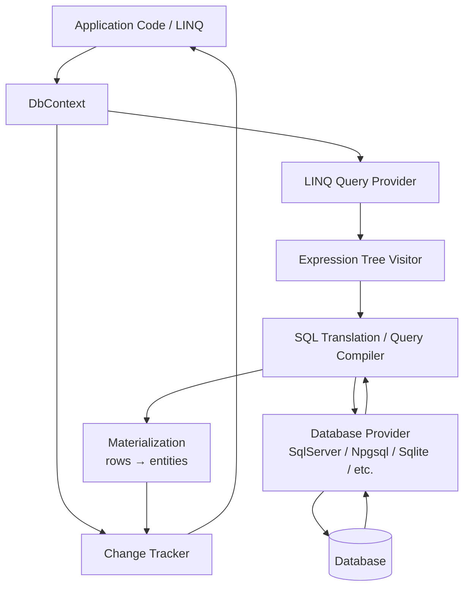
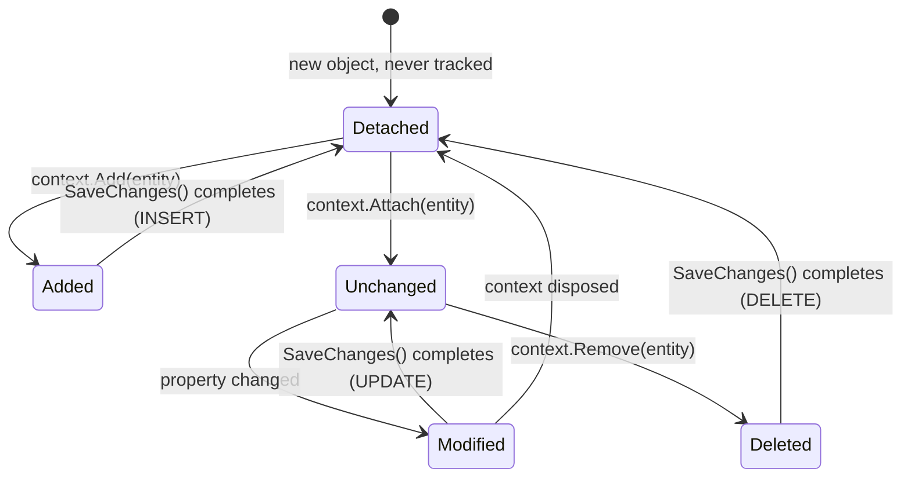
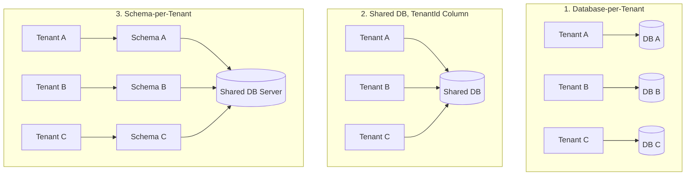

# EF Core — Interview Revision Notes

> Quick-revision Q&A `T. EF-Core-Interview-Guide.md` se derive kiye gaye hain. Source ke har section ko cover karta hai.

## 1. Core Concepts

### 1.1 EF Core kya hai aur yeh kyun exist karta hai

**Q: EF Core kya hai?**

A: Microsoft ka ORM hai .NET ke liye. Yeh aapko raw SQL ke bajaye C# objects use karke relational database ke saath kaam karne deta hai, aur SQL generation, connection management, change tracking, aur relationship mapping khud handle karta hai.

```sql
SELECT * FROM Users WHERE Id = 1
```

```csharp
var user = context.Users.Find(1);
```

**Q: EF Core exist kyun karta hai — interviewer kaunsa "why" sunna chahta hai?**

A:

- Repetitive boilerplate SQL aur manual row↔object mapping ko hata deta hai.
- Migrations ke zariye schema evolution ko centralize karta hai (DB ke liye version control jaisa).
- Ek LINQ-based, strongly-typed query surface deta hai jo refactor-safe hai (property rename karo, silently broken SQL strings ke bajaye compiler errors milte hain).
- Trade-off: aap kuch query control chhod dete ho aur ek abstraction layer add hota hai — isi wajah se senior engineers ko pata hona chahiye ki kab raw SQL/Dapper par drop karna hai.

### 1.2 DbContext

**Q: DbContext kya hai aur yeh kya karta hai?**

A: EF Core ki central class — Unit of Work + Repository jaisi abstraction combined. Yeh database ke saath ek session represent karta hai.

```csharp
public class AppDbContext : DbContext
{
    public AppDbContext(DbContextOptions<AppDbContext> options) : base(options) { }

    public DbSet<User> Users { get; set; }
}
```

Responsibilities:

- Underlying connection ko open/manage karta hai
- Queries execute karta hai (LINQ provider → SQL translation pipeline ke through)
- Entity changes track karta hai (Change Tracker)
- Changes ko SQL ke roop mein persist karta hai (`SaveChanges`)
- Transactions manage karta hai

**Q: DbContext thread-safe hai kya, aur ASP.NET Core mein isko kaunsa lifetime use karna chahiye?**

A: Nahi, yeh thread-safe nahi hai — kabhi bhi ek instance ko concurrent operations ya requests ke beech share mat karo. Ek `DbContext` instance = ek unit of work / ek logical database session. **Scoped** lifetime ke saath register karo (ek instance per HTTP request) `AddDbContext<T>` ke zariye. Construct karna lightweight hai lekin free nahi — yeh ek connection, model cache lookup, aur change tracker wrap karta hai; isi liye pooling exist karti hai (dekho §6.1).

### 1.3 Entity, DbSet, aur Conventions

**Q: EF Core mein "entity" kya hai, aur convention-based mapping kaise kaam karta hai?**

A: Ek POCO jo table se mapped hota hai — usmein koi database logic nahi hona chahiye. Convention ke hisaab se: class name → table name (pluralized, e.g. `User` → `Users`), aur `Id`/`<ClassName>Id` → primary key.

```csharp
public class User
{
    public int Id { get; set; }        // Primary key by convention
    public string Name { get; set; }
    public string Email { get; set; }
}
```

**Q: DbSet<T> kya hai?**

A: Table ke liye ek queryable/updatable gateway — yeh data khud nahi hai, yeh ek `IQueryable<T>` entry point hai.

```csharp
context.Users.Add(new User { Name = "John" });   // INSERT (staged)
var users = context.Users.ToList();               // SELECT
var user = context.Users.First(u => u.Id == 1);
user.Name = "Updated";                            // UPDATE (staged, tracked)
context.Users.Remove(user);                       // DELETE (staged)
context.SaveChanges();                             // flush everything above
```

**Q: Find() vs FirstOrDefault() — dono mein kya difference hai?**

A: `Find()` pehle change tracker ko primary key se check karta hai — agar entity already tracked hai, to bina DB hit kiye return kar deta hai. `FirstOrDefault()`/`First()` hamesha ek query issue karte hain, tracking state ke bawajood.

**Q: Add() vs Attach() — aur yahan classic bug kya hai?**

A: `Add()` entity (aur uske untracked graph) ko `Added` mark karta hai → `INSERT` generate karta hai. `Attach()` entity ko `Unchanged` mark karta hai (tracked, no DB hit) — jab aapke paas already ek known key wali entity ho aur aap EF se usko re-insert kiye bina track karana chahte ho tab use hota hai. Bug: ek entity par `Add()` call karna jo DB mein already exist karti hai, duplicate-key insert cause karta hai; fix hai `Attach()` + explicitly state set karna, ya `Update()`.

### 1.4 EF Core Architecture

**Q: EF Core architecture/pipeline ko walk through karo.**

A:



- LINQ provider aapke expression tree ko capture karta hai (yeh *expression* ko translate karta hai, C# delegates ko DB ke against execute nahi karta — isi wajah se arbitrary C# methods aksar translate nahi ho pate).
- Database provider (SqlServer, Npgsql for PostgreSQL, Sqlite, InMemory for tests) provider-specific SQL dialect aur type mappings supply karta hai.
- Materialized rows Change Tracker ko diye jaate hain agar tracking enabled hai.

### 1.5 LINQ, Query Translation, aur Deferred Execution

**Q: Deferred execution kya hai?**

A: Query database mein tab tak send nahi hoti jab tak koi terminal operator invoke na ho — `ToList()`, `ToArray()`, `First()`, `FirstOrDefault()`, `Single()`, `Count()`, `Any()`, `Sum()`, foreach enumeration, etc.

```csharp
var query = context.Users.Where(u => u.Id > 5);
// No SQL executed yet — query is an expression tree (IQueryable<User>)

var list = query.ToList();
// SQL executes NOW
```

**Q: Common LINQ SQL mein kaise map hota hai?**

A:

| LINQ | SQL Equivalent |
|---|---|
| `Where` | `WHERE` |
| `Select` | `SELECT` (projection) |
| `First`/`FirstOrDefault` | `SELECT TOP(1)` / `LIMIT 1` |
| `Any` | `EXISTS` |
| `Count` | `COUNT` |
| `OrderBy`/`Skip`/`Take` | `ORDER BY` / `OFFSET` / `FETCH NEXT` |

**Q: Projection ek performance tool kyun hai, sirf syntax sugar nahi?**

A: Sirf needed columns select karne se DB se pull hone wala data kam ho jaata hai.

```csharp
var names = context.Users.Select(u => u.Name).ToList(); // only Name column fetched
```

**Q: .ToList() aur uske baad ke LINQ calls ke saath "spot the bug" trap kya hai?**

A: `.ToList()` ko bahut early call karne se poora result set memory mein materialize ho jaata hai; uske baad koi bhi LINQ (`.Where`, `.OrderBy`) client-side memory mein run hota hai, SQL ke roop mein nahi.

```csharp
// BAD — pulls entire table into memory, then filters in-process
context.Users.ToList().Where(u => u.IsActive);

// GOOD — filter translated to SQL, only matching rows come back
context.Users.Where(u => u.IsActive).ToList();
```

## 2. Change Tracking

### 2.1 Entity States aur Change Tracker

**Q: Change Tracker kya karta hai?**

A: EF Core har entity ko track karta hai jise woh materialize karta hai (jab tak bataya na jaaye), aur original values, current values, aur ek explicit state record karta hai.



**Q: Entity states kya hain aur unka resulting SQL kya hai?**

A:

| State | Meaning | SQL on SaveChanges |
|---|---|---|
| `Added` | New entity, not yet in DB | `INSERT` |
| `Modified` | Tracked entity with changed property values | `UPDATE` |
| `Deleted` | Marked for removal | `DELETE` |
| `Unchanged` | Tracked, no detected changes | none |
| `Detached` | Not tracked by this context at all | none |

```csharp
var user = context.Users.First(u => u.Id == 1);
user.Name = "Updated Name";
context.SaveChanges();
// UPDATE Users SET Name = 'Updated Name' WHERE Id = 1
// No explicit "update" call needed — EF diffs current vs original values.
```

**Q: Change tracking ke baare mein do common interview traps kya hain — inki correction kya hai?**

A:

- "EF har column ko automatically update karta hai" **galat** hai — EF sirf changed columns ke liye `UPDATE` statements generate karta hai (snapshot comparison ke basis par), jab tak full-column updates ke liye configure na kiya ho.
- "Tracking free hai" **galat** hai — har tracked entity ke original values ka snapshot rakha jaata hai, aur har `SaveChanges()` call pura tracked graph walk karta hai changes detect karne ke liye (`DetectChanges()`), jo tracked entities mein O(n) hai.

### 2.2 Change Tracker Internals — Snapshots vs Proxies

**Q: EF Core mein do change-detection strategies kya hain?**

A:

- **Snapshot-based tracking (default):** EF original property values ka ek internal snapshot rakhta hai jo query time (ya `Attach`/`Add` time) par capture hota hai. `DetectChanges()` current vs snapshot values compare karta hai. Plain POCOs ke saath kaam karta hai lekin full-graph scan hai — hazaaron tracked entities ke saath potentially expensive.
- **Notification-based tracking (proxies):** Agar entities `INotifyPropertyChanged`/`INotifyPropertyChanging` implement karti hain (ya aap EF ke dynamic proxies `UseChangeTrackingProxies()` ke zariye use karte ho), to EF ko mutation par immediately notify ho jaata hai aur pura graph rescan nahi karna padta. Bahut large tracked sets ke liye faster hai, lekin interfaces implement karna padta hai ya runtime-generated proxy types accept karne padte hain (gotchas: virtual properties chahiye, `sealed` classes nahi chal sakti, `new Entity()` se unit test karna harder ho jaata hai).

**Q: DetectChanges() kab call hota hai, aur kya aap isko control kar sakte ho?**

A: Yeh automatically `SaveChanges()` se pehle aur zyada tar tracked LINQ queries se pehle call hota hai. Aap isko manually call kar sakte ho, aur auto-detection disable kar sakte ho (`context.ChangeTracker.AutoDetectChangesEnabled = false`) ek bulk in-memory operation ke around, aur end mein ek baar `DetectChanges()` call karke tight loops mein meaningful speedup pa sakte ho.

**Q: ChangeTracker.Entries() kis liye useful hai?**

A: Sabhi tracked entities aur unki states ko inspect/iterate karne ke liye — generic audit logging ke liye useful (e.g., `SaveChanges` override mein `ChangeTracker.Entries<IAuditable>()` iterate karke `CreatedAt`/`ModifiedAt` set karna).

### 2.3 AsNoTracking vs AsNoTrackingWithIdentityResolution

**Q: AsNoTracking() kya karta hai, aur yeh kab use karna chahiye?**

A: Sabse fastest read path — koi snapshot nahi rakha jaata, koi change tracker entries nahi; har row independent object ke roop mein materialize hoti hai chahe same entity joins ke zariye do baar aaye (no identity resolution). Flat, single-entity read APIs ke liye theek hai.

```csharp
context.Users.AsNoTracking().ToList();   // no snapshot kept, no change tracker entries
```

**Q: AsNoTrackingWithIdentityResolution() kaise different hai?**

A: Phir bhi untracked hai (no snapshots, no `SaveChanges` participation), lekin EF single query result ke andar same key wali entities ko deduplicate karta hai — agar `User` join ke zariye do baar aata hai to woh ek baar hi materialize hota hai, dono references same object ko point karte hain. `Include()` ke saath graphs project karte time use karo read-only display purposes ke liye jaha correct object identity matter karti hai (e.g., UI tree ko binding karna) full change-tracking cost pay kiye bina.

**Q: Reads par tracking ke liye rule of thumb kya hai?**

A: Sabhi read-only/GET endpoints ke liye default `AsNoTracking()` rakho; tracking ke liye tabhi pay karo jab aap un entities ke against `SaveChanges()` call karne ka irada rakhte ho.

### 2.4 SaveChanges Internals

**Q: Jab aap SaveChanges() call karte ho to internally kya hota hai?**

A:

1. `DetectChanges()` tracked graph walk karta hai, snapshots ke saath diff karta hai.
2. EF `INSERT`/`UPDATE`/`DELETE` commands ka set banata hai, FK dependency order respect karte hue (dependents se pehle parents insert, parents se pehle dependents delete).
3. Saare commands ek implicit transaction ke andar execute hote hain (jab tak koi already open na ho).
4. Success par commit hota hai; failure (constraint violation, concurrency conflict) par poora rollback hota hai aur throw karta hai (`DbUpdateException`, `DbUpdateConcurrencyException`).
5. Success par, `Added` entities `Unchanged` mein transition ho jaati hain (DB-generated key values back populate ho jaate hain), `Deleted` entities `Detached` ho jaati hain.

```csharp
context.SaveChanges();
```

**Q: SaveChangesAsync() ke liye await kyun matter karta hai?**

A: `SaveChangesAsync` I/O wait karte time thread free kar deta hai — ASP.NET Core throughput ke liye load ke under critical hai (thread-pool starvation avoid karta hai). `await` bhoolne par: `Task` fire ho jaata hai, control immediately return hota hai, aur request write durable hone se pehle complete ho sakti hai — aur bhi bad, ek unawaited faulted task unobserved ja sakta hai aur exceptions swallow kar sakta hai.

```csharp
await context.SaveChangesAsync();
```

## 3. Relationships and Loading Strategies

### 3.1 Relationship Types & Configuration

**Q: EF Core kaunse relationship types support karta hai, aur inhe kaise configure kiya jaata hai?**

A: One-to-One, One-to-Many, aur Many-to-Many, jo convention se discover hote hain ya Fluent API ke zariye configure kiye jaate hain (data annotations se preferred, trivial cases se aage — composite keys ya `ExecuteUpdate` shadow FK mapping jaisi cheezein express karne ka yeh hi tarika hai).

```csharp
public class User
{
    public int Id { get; set; }
    public string Name { get; set; }
    public List<Order> Orders { get; set; }
}

public class Order
{
    public int Id { get; set; }
    public int UserId { get; set; }
    public User User { get; set; }
}
```

```csharp
modelBuilder.Entity<Order>()
    .HasOne(o => o.User)
    .WithMany(u => u.Orders)
    .HasForeignKey(o => o.UserId);
```

**Q: Kya navigation property foreign key ke same hai?**

A: Nahi. FK column DB level par referential integrity enforce karta hai; navigation property object-graph traversal ke liye ek code convenience hai. EF Core 5.0 se, many-to-many bina explicit join entity ke supported hai (ek shadow join table automatically create hoti hai) — lekin payload data wale join table ke liye (e.g., `EnrolledAt`), join entity ko explicitly model karo.

### 3.2 Eager, Lazy, aur Explicit Loading

**Q: Teen loading strategies kya hain, aur APIs ke liye kaunsi default honi chahiye?**

A: EF Core default mein related data load nahi karta — aap opt in karte ho.

| Strategy | Mechanism | DB Round Trips | API Suitability |
|---|---|---|---|
| Eager | `.Include(u => u.Orders)` | 1 (or more with split query) | Preferred for APIs |
| Lazy | Proxy auto-loads on navigation access | 1 per access (N+1 risk) | Avoid in APIs |
| Explicit | `context.Entry(user).Collection(u => u.Orders).Load()` | 1 per explicit call, controlled | Fine for targeted, conditional loading |

```csharp
// Eager
context.Users.Include(u => u.Orders).ToList();

// Lazy (requires Microsoft.EntityFrameworkCore.Proxies + UseLazyLoadingProxies())
user.Orders; // triggers a DB call the moment this is touched

// Explicit
context.Entry(user).Collection(u => u.Orders).Load();
```

A: Web APIs ke liye default eager loading (ya usse behtar, projection) rakho; lazy loading dangerous hai kyunki yeh DB calls ko ordinary property access ke peeche hide kar deta hai, jisse performance bugs code review mein invisible ho jaate hain.

### 3.3 Split Queries vs Single Query for Collection Includes

**Q: Multiple collection Includes ke saath cartesian-explosion problem kya hai?**

A: By default, multiple collection navigations ko `Include()` karna ek single query generate karta hai `JOIN`s ke saath — agar ek `User` ke paas 10 `Orders` aur 5 `Addresses` hain, to single-query approach client-side graph reconstruct karne ke liye 50 tak duplicated `User` data rows return karta hai.

```csharp
// Single query (default) — one round trip, but row count = Orders × Addresses
context.Users
    .Include(u => u.Orders)
    .Include(u => u.Addresses)
    .ToList();

// Split query — one query per collection Include, avoids the multiplication
context.Users
    .Include(u => u.Orders)
    .Include(u => u.Addresses)
    .AsSplitQuery()
    .ToList();
```

**Q: Single query aur split query ke beech trade-offs kya hain?**

A:

- **Single query:** ek round trip (small graphs ke liye lower latency), lekin bade duplicated result sets aur large fan-out collections ke liye slower transfer ka risk. Explicit transaction ke bina bhi naturally atomic/consistent hai.
- **Split query:** row explosion avoid karta hai, large collections ke liye kaafi kam data transfer karta hai, lekin multiple round trips issue karta hai — alag queries ka matlab hai ek chhota window jaha data unke beech change ho sakta hai agar explicit transaction mein wrap nahi kiya (reads ke liye usually acceptable).
- Globally configure karo (`UseSqlServer(connStr, o => o.UseQuerySplittingBehavior(QuerySplittingBehavior.SplitQuery))`) ya per-query `.AsSplitQuery()`/`.AsSingleQuery()` ke saath. Agar aap explicit splitting behavior choose kiye bina multiple collection `Include`s use karte ho to EF Core ek warning log karta hai.

### 3.4 The N+1 Problem — Spotting and Fixing It

**Q: N+1 problem kya hai?**

A: N parent rows fetch karne ke liye 1 query, phir related data fetch karne ke liye N additional queries (per row ek) — typically lazy loading loop ke andar, ya naive per-item querying batching ke bajaye, ki wajah se hota hai.

```csharp
// N+1 — 1 query for users, then 1 query per user for Orders
var users = context.Users.ToList();
foreach (var user in users)
{
    user.Orders.Count();   // lazy-load trigger per iteration
}
```

**Q: Wild mein N+1 kaise spot karte ho?**

A:

- EF Core query logging enable karo (`.LogTo(Console.WriteLine, LogLevel.Information)`) ya ek APM tool use karo (Application Insights, MiniProfiler, Datadog) aur ek repeating identical query pattern dhoondo jisme sirf parameter value change hota hai.
- SQL Server Profiler / extended events jo near-identical `SELECT ... WHERE UserId = @p0` statements ka burst dikhate hain.
- Code review heuristic: ek queried list ke `foreach`/`Select` ke andar navigation collection par koi property access red flag hai agar lazy loading enabled hai.

**Q: Fixes kya hain, preference ke order mein?**

A:

1. Jo chahiye woh eager load karo: `.Include(u => u.Orders)`.
2. Full graphs load karne ke bajaye project karo jab sirf aggregates chahiye: `.Select(u => new { u.Id, OrderCount = u.Orders.Count() })` — ek single SQL query mein translate hota hai correlated subquery/`GROUP BY` ke saath, koi client loop nahi.
3. API projects mein lazy loading ko poori tarah disable karo (`Microsoft.EntityFrameworkCore.Proxies` reference mat karo/`UseLazyLoadingProxies()` call mat karo), jisse har jagah explicit `Include()` force ho.

```csharp
// Fix
var users = context.Users
    .Include(u => u.Orders)
    .AsNoTracking()
    .ToList();
```

## 4. Migrations

### 4.1 Migration Fundamentals

**Q: Migrations kya hain, aur jab aap unhe run karte ho to internally kya hota hai?**

A: Aapke database schema ke liye version control — Git commits jaisa, lekin DDL ke liye.

```powershell
Add-Migration InitialCreate
Update-Database
```

(or CLI equivalents: `dotnet ef migrations add InitialCreate`, `dotnet ef database update`)

1. EF current model snapshot ko last recorded model snapshot se compare karta hai (`Migrations` folder ke `*.Designer.cs`/snapshot file mein stored).
2. `Up()`/`Down()` methods wali ek migration class generate karta hai jisme `MigrationBuilder` calls hote hain (`AddColumn`, `DropColumn`, `CreateTable`, etc.).
3. `Update-Database` pending migrations ko order mein execute karta hai, aur har ek ko `__EFMigrationsHistory` table mein record karta hai.

```csharp
migrationBuilder.AddColumn<string>(
    name: "Email",
    table: "Users",
    nullable: true);
```

**Q: Classic migration traps kya hain?**

A:

- Migrations ko bypass karke database schema manually edit karna model/DB drift cause karta hai aur EF ke snapshot comparison ko unreliable bana deta hai.
- "One migration per code change" koi hard rule nahi hai — logically-related schema changes ko ek coherent migration per feature/PR mein batch karo.
- EF Core migrations ke bina run ho sakta hai (`EnsureCreated()`), lekin yeh sirf tests/prototypes ke liye hai — incremental schema evolution nahi hoti, aur same model par migrations ke saath coexist nahi kar sakta.

### 4.2 Migrations in a Team / CI-CD Workflow

**Q: Kya aapko production mein application startup se Database.Migrate() call karna chahiye?**

A: Kabhi nahi, single-instance toy app se aage — multiple instances/pods simultaneously scale up hone par concurrent migration attempts ek dusre se race kar sakte hain. CI/CD pipeline mein ek dedicated migration step (`dotnet ef database update` chalane wala ek one-shot job/container ya ek idempotent SQL script) prefer karo jo naye app version deploy hone se pehle run ho.

**Q: Prod mein review/audit ke liye migrations ko safe kaise banate ho?**

A: `Update-Database` par blindly trust karne ke bajaye idempotent SQL scripts generate karo:

```powershell
dotnet ef migrations script --idempotent -o migrate.sql
```

Yeh ek script produce karta hai jo `__EFMigrationsHistory` ke against checks se guarded hota hai, re-run karne ke liye safe hai, aur execution se pehle ek DBA ke through reviewable hai.

**Q: Zero-downtime schema changes ke liye expand/contract pattern kya hai, aur yeh common changes par kaise apply hota hai?**

A: Jab old aur new app versions simultaneously run kar sakte hain (rolling deployment), ek migration currently-running old version ko break nahi karni chahiye.

- Nullable column add karna: safe hai.
- NOT NULL column add karna: phases mein karo — nullable add karo, backfill karo, phir baad ki migration/deploy mein constraint add karo.
- Column rename karna: EF Core ka default diffing ek perceived rename ke liye `DROP` + `ADD` generate karta hai (data loss!) jab tak aap explicitly `migrationBuilder.RenameColumn(...)` use na karo — renames ke liye generated migrations ko hamesha hand-edit karo.
- Column drop karna: pehle deprecate karo (code mein padhna/likhna band karo, deploy karo), phir jab kuch bhi uspar depend na kare to subsequent migration mein drop karo.

**Q: Do branches ke beech migration merge conflicts kaise resolve karte ho?**

A: Rebase — do migration files ko hand-merge karne ke bajaye merged model snapshot ke top par migration ko regenerate karo; redundant wale ko delete karo aur zaroorat ho to regenerate karo, lekin sirf tab jab dono mein se koi bhi shared/prod environment par apply na hua ho.

**Q: Migrations ke liye PR review discipline kya hai?**

A: Merge karne se pehle hamesha generated `Up`/`Down` SQL review karo (`Script-Migration` ke zariye ya generated file padh ke) — silently-generated `DROP COLUMN`/`DROP TABLE` migration-related data loss incidents ka sabse common cause hai.

**Q: Migrations ke liye kaunsi environment-safety practices matter karti hain?**

A: Har environment ke liye alag connection strings/credentials, app ke liye least-privilege DB accounts (prod mein running app identity ke paas schema-alter rights na ho — migration step ek separate elevated credential use karta hai), aur prod mein apply karne se pehle production-like data volume ke against staging validation (ek migration jo 100-row staging table par instant hai, 100M-row prod table ko minutes ke liye lock kar sakta hai).

### 4.3 Migration Disaster Recovery Scenarios

**Q: Real production migration disaster scenarios aur unki recovery/prevention ko walk through karo.**

A:

| Scenario | Root Cause | Recovery | Prevention |
|---|---|---|---|
| Migration applied but app code rolled back | DB schema code se aage nikal gaya → "Invalid column name" errors | Matching app version re-deploy karo (preferred); ya `Update-Database PreviousMigration` agar reversible hai | Blue-green deploys; DB state consider kiye bina kabhi code roll back mat karo |
| Column dropped, data lost | `DropColumn` migration prod mein run hui | Backup se restore karo, column re-add karo, agar possible ho to data reinsert karo | Kabhi directly drop mat karo — pehle deprecate karo; prod migrations se pehle hamesha backup lo |
| Migration fails halfway | Long/complex migration mid-execution interrupt ho gayi | `__EFMigrationsHistory` check karo, schema ko manually last successful step tak reconcile karo, re-run karo | Staging par test karo, migrations ko chhota aur atomic rakho jaha DB engine allow kare |
| Conflicting migrations from two devs | Parallel branches ne dono migrations add ki | Rebase karo, ek combined migration generate karo, conflicting ones delete karo (sirf pre-prod) | Ek migration per feature branch; PRs mein review karo; frequently sync karo |
| Emergency hotfix needs schema change | Standard pipeline ke liye time nahi tha | SQL manually apply karo (controlled), phir immediately model resync karne ke liye ek matching EF migration generate/backfill karo | Hotfix DB changes avoid karo; baad mein hamesha migrations backfill karo |
| Migration causes table lock/downtime | Default value wala column add karna ek badi table ko lock karta hai | Cancel karo; steps mein apply karo — nullable column → batched backfill → NOT NULL constraint | Bade schema changes ko phases mein plan karo; hot tables par blocking DDL avoid karo |
| Migration applied to wrong environment | Prod migration QA ke against run hui ya vice versa | Correct backup se DB restore karo, correct migrations re-apply karo | Environment-specific connection strings, CI/CD safeguards, least-privilege creds |
| Manual DB change without migration | DBA ne schema directly change kiya | `Add-Migration SyncWithDb`, generated SQL carefully validate karo | Manual DB changes nahi — EF migrations hi single source of truth hain |
| Migration generates unexpected SQL (e.g., rename → drop+recreate) | EF ka model diff "rename" aur "drop old, add new" mein difference nahi kar sakta | Migration ko explicitly `RenameColumn` use karne ke liye hand-edit karo | Apply karne se pehle hamesha generated migration code review karo |

**Q: Interviewers migration discipline ke baare mein kya sunna chahte hain?**

A: "Main hamesha generated migration SQL review karta hoon," "Main migrations ko production-like data volume ke saath staging ke against test karta hoon," "Main destructive migrations avoid karta hoon aur expand/contract prefer karta hoon," "Main DB schema aur code ko CI/CD ke zariye sync mein rakhta hoon, manual changes se nahi."

## 5. Intermediate Topics

### 5.1 Concurrency Handling

**Q: EF Core optimistic concurrency ko kaise support karta hai?**

A: Ek concurrency token/row-version column ke zariye.

```csharp
public class User
{
    public int Id { get; set; }
    public string Name { get; set; }

    [Timestamp]
    public byte[] RowVersion { get; set; }
}
```

- `UPDATE`/`DELETE` par, EF original `RowVersion` value ko `WHERE` clause mein include karta hai.
- Agar koi dusra transaction already row update kar chuka hai (row version change ho gaya), to zero rows match karti hain → EF 0 affected rows detect karta hai aur `DbUpdateConcurrencyException` throw karta hai.

**Q: Concurrency conflict ke liye kaunsi resolution strategies exist karti hain?**

A: "Database wins" (reload karo aur local changes discard karo), "client wins" (local values re-apply karo aur fresh row version ke saath retry karo), ya ek merge UI jo user ko dono versions present kare. `DbUpdateConcurrencyException` catch karke, `ex.Entries` inspect karke, aur retry se pehle `entry.OriginalValues.SetValues(entry.GetDatabaseValues())` call karke (database-wins) ya original values re-apply + re-save karke (client-wins) handle karo.

**Q: Kya [Timestamp] databases providers ke across portable hai?**

A: Nahi — `[Timestamp]` SQL Server-specific hai (`rowversion` type). Native rowversion type na rakhne wale providers par, kisi bhi column par `[ConcurrencyCheck]` use karo, ya Fluent API ke zariye `.IsRowVersion()`/`.IsConcurrencyToken()` configure karo, ya ek computed value wali `uint`/`byte[]` shadow property use karo.

### 5.2 Transactions

**Q: Kya SaveChanges() ko ek explicit transaction ki zarurat hoti hai?**

A: Nahi — `SaveChanges()` already apne operations ko ek implicit transaction mein wrap kar deta hai. Aapko explicit transaction sirf tab chahiye jab multiple `SaveChanges()` calls (ya EF operations ko raw ADO.NET/Dapper calls ke saath mix karna ho) ko atomically span karna ho.

```csharp
using var tx = context.Database.BeginTransaction();
context.SaveChanges();
tx.Commit();
```

**Q: Transactions ko short kyun rakhna chahiye?**

A: Load ke under long-running transactions production mein lock contention/deadlocks/timeouts ka classic cause hote hain. Sab kuch ek giant transaction mein wrap karne ke bajaye bade bulk operations ko batch karo.

**Q: Distributed transactions kyun avoid karni chahiye, aur modern alternative kya hai?**

A: Do alag databases ya ek DB + message queue ke across transaction span karne ke liye ek distributed transaction coordinator (e.g., MSDTC) ya two-phase commit chahiye — slow, fragile, aur aksar cloud-managed databases aur modern brokers dwara unsupported. Modern alternative hai **Saga pattern** — local transactions ki ek sequence, har ek ke paas ek compensating action hoti hai agar koi baad ka step fail ho jaaye (e.g., "reserve inventory" → "charge payment" → agar charge fail ho, "release inventory reservation" se compensate karo). Zyada tar systems ke liye, distributed transactions ke bajaye **outbox pattern** ke zariye eventual consistency prefer karo (domain change aur ek "event to publish" row ko same local transaction mein likho, phir ek background process usko publish kare).

### 5.3 Shadow Properties

**Q: Shadow property kya hai?**

A: Ek property jo EF model mein exist karti hai aur ek database column se map hoti hai lekin CLR entity class par declare nahi ki gayi hai — EF uski value internally track karta hai.

```csharp
modelBuilder.Entity<Order>()
    .Property<DateTime>("LastModified");

// Access via the change tracker API, not a C# property:
context.Entry(order).Property("LastModified").CurrentValue = DateTime.UtcNow;
```

**Q: Real code mein shadow properties kaha dikhte hain, aur unko discover kaise karte ho?**

A:

- Foreign key properties aksar shadow properties hoti hain jab aap dependent class par ek explicit FK property ke bina sirf navigation property model karte ho.
- Audit columns (`CreatedAt`, `ModifiedBy`) ke liye common hai jo EF/interceptors dwara track hoti hain lekin domain model ko clutter nahi karni hoti.
- `context.Model.FindEntityType(typeof(Order)).GetProperties()` ke zariye discoverable hai.

### 5.4 Value Converters and Owned Types

**Q: Value Converter kya hai, aur kab use karte ho?**

A: Storage ke liye ek CLR type ko ek different type se to/from map karta hai (e.g., enum ↔ string, ya ek custom value object ↔ primitive).

```csharp
modelBuilder.Entity<Order>()
    .Property(o => o.Status)
    .HasConversion<string>();   // store enum as string instead of int

// Custom converter
modelBuilder.Entity<Order>()
    .Property(o => o.Amount)
    .HasConversion(
        v => v.Value,                     // to provider
        v => new Money(v));               // from provider
```

**Q: Owned Types kya hain, aur yeh storage mein kaise map hote hain?**

A: `OwnsOne`/`OwnsMany` ek value object model karte hain jiski apni independent identity/table nahi hoti; by default uski properties owner ke table par columns ke roop mein map hoti hain (ya `OwnsMany` ke liye `ToTable` wali ek separate table).

```csharp
public class Address
{
    public string Street { get; set; }
    public string City { get; set; }
}

modelBuilder.Entity<User>()
    .OwnsOne(u => u.Address);
// Produces columns: Address_Street, Address_City on Users table
```

- Owned types ki koi separate identity nahi hoti — hamesha owner ke saath load/save hote hain, independently query nahi ho sakte, nesting support karte hain.
- EF Core 7+ se, aap ek owned type (ya poori entity) ko `ToJson()` ke zariye ek JSON column mein map kar sakte ho:

```csharp
modelBuilder.Entity<User>()
    .OwnsOne(u => u.Address, a => a.ToJson());
```

### 5.5 Global Query Filters

**Q: Global query filter kya hai, aur canonical use cases kya hain?**

A: Ek `Where` predicate jo har query par automatically apply hota hai ek given entity type ke liye, jab tak explicitly bypass na kiya jaaye. Canonical use cases: soft delete aur multi-tenancy.

```csharp
modelBuilder.Entity<User>()
    .HasQueryFilter(u => !u.IsDeleted);

// Multi-tenant example
modelBuilder.Entity<Order>()
    .HasQueryFilter(o => o.TenantId == _currentTenantService.TenantId);
```

- LINQ queries, `Include()`d navigations, aur relationships ke zariye generate hone wali queries par bhi automatically apply hota hai — har call site par `.Where(u => !u.IsDeleted)` yaad rakhne ki zarurat nahi.
- Jab genuinely sab kuch chahiye ho (e.g., ek admin "show deleted records" screen) to `.IgnoreQueryFilters()` se explicitly bypass karo.

**Q: Interview mein global query filters ke baare mein kaunse gotchas raise karne chahiye?**

A: Ek service/DbContext field (jaise current tenant ID) ko reference karne wale filters context instance ki current field value use karke per-query translation time par evaluate hote hain — `this.TenantId` capture karne wala filter ek scoped context ke saath per-request correctly kaam karta hai, lekin ek `DbContext` ya compiled query ko tenants ke across cache karne se saavdhaan raho. Iske alawa, global filters sirf entity ki apni properties, related entity properties (navigation ke zariye), ya `DbContext` par fields/properties ko reference kar sakte hain — arbitrary external state nahi.

### 5.6 Multi-Tenancy Architectures — Kaunsa Choose Karoge?

**Q: Global-query-filter mechanism se aage, multi-tenancy ke peeche broader architectural question kya hai?**

A: Global query filters (§5.5) sirf "shared database ke andar tenant se queries kaise scope karte ho" ka jawab dete hain. Senior-level question hai "kaunsi multi-tenancy architecture choose karoge, aur kyun" — ek system-design trade-off ek level upar. Teen standard architectures:



**Q: Teen architectures key dimensions ke across kaise compare hoti hain?**

A:

| Dimension | DB-per-Tenant | Shared DB + `TenantId` column | Schema-per-Tenant |
|---|---|---|---|
| **Data isolation** | Sabse strong — physically separate databases | Sabse weak — ek missing/bypassed query filter dusre tenant ka data leak kar deta hai; global query filter (§5.5) mitigate karta hai lekin eliminate nahi karta | Medium — schema boundary bina poori separate database ke real DB-level separation deti hai |
| **Cost / resource efficiency** | Sabse expensive — N databases, N sets of connections/backups/compute | Sabse cheap — ek database, ek connection pool, shared compute | Middle — ek server, lekin N schemas har ek apne table set ke saath |
| **Operational complexity** | High — migrations har tenant database ke against individually run karni padti hain | Low — ek schema, ek migration run, ek monitoring dashboard | High — migrations har schema ke against run karni padti hain; "N schemas ke against yeh migration run karo" ke liye weak tooling |
| **Blast radius of a bug/incident** | Sabse chhota — exactly ek tenant affect karta hai | Sabse bada — ek bad migration/lock contention/noisy neighbor/data-leak bug sabhi tenants ko affect kar sakta hai | Medium — schema-level issue ek tenant affect karta hai; server-level outage sabko affect karta hai (infra level par shared-DB jaisa) |
| **"Noisy neighbor" risk** | None | Real risk — ek tenant ka heavy load baaki sabke performance ko degrade kar sakta hai | Shared-table se kam lekin phir bhi server ke CPU/IO/connection budget share karta hai |
| **Per-tenant customization** | Sabse easy — har DB ka different schema version ho sakta hai | Sabse hard — sabhi tenants ek schema share karte hain; flexibility ke liye EAV tables/JSON columns chahiye | Possible lekin awkward — schemas *diverge* ho sakte hain lekin usually tooling sanity ke liye identical rakhe jaate hain |
| **Onboarding a new tenant** | Sabse slow — naya database provision karne mein real latency/cost hai | Sabse fast — sirf ek naya `TenantId` value | Medium — naya schema provision karna naye DB se lighter hai lekin phir bhi ek DDL operation hai |
| **Regulatory/compliance fit** | Best — ek tenant ka DB drop karna ek clean, auditable deletion hai; region-placing DBs se data residency satisfy karta hai | Worst — "tenant X ka sara data" delete karne ka matlab hai har table mein rows correctly delete karna; residency bahut difficult hai | Medium — schema drop karna rows delete karne se cleaner hai, lekin phir bhi ek physical server/region ke andar hai |
| **EF Core support quality** | Straightforward — tenant-resolution middleware ke zariye har tenant ke liye different connection string | Best native support — exactly wahi jiske liye `HasQueryFilter()` (§5.5) bana hai | `HasDefaultSchema()` dynamically set karke workable hai, lekin baaki dono se weaker tooling |

**Q: Senior level par "kaunsa choose karoge" ka jawab actually kaise dete ho?**

A:

- Technology se nahi, business/compliance constraint se start karo. Contractual/regulatory data-isolation requirements wale enterprise customers (healthcare, finance, government), ya ek tenant jo itna bada hai ki uska load doosron ko affect nahi karna chahiye → operational cost ke bawajood **DB-per-tenant**.
- High-volume, low-touch-per-tenant SaaS (hazaaron se millions tak chhote tenants) → **shared DB with TenantId** almost hamesha pragmatic hai — is scale par DB-per-tenant ek operational nightmare hai (50,000 databases ke against migrations imagine karo).
- **Schema-per-tenant** naye EF Core designs mein sabse kam chosen hota hai kyunki EF ki tooling story iske liye baaki dono se weaker hai — legacy systems ya better native support wale platforms mein zyada dikhta hai. Completeness ke liye mention karo, lekin aaj ke waqt yeh ek narrower-fit choice hai.
- **Hybrid approaches valid hain**: chhote/free-tier tenants ki long tail ke liye shared DB, aur bade/enterprise tenants ke justify karne par unke liye ek dedicated database ka migration path.
- Shared-DB ki sabse badi weakness ke liye mitigation hamesha mention karo: global query filters (§5.5) necessary hain lekin sufficient nahi — defense-in-depth ke saath pair karo (cross-tenant isolation assert karne wale integration tests, `IgnoreQueryFilters()` ke around code review discipline, aur backstop ke roop mein ek DB-level safeguard jaise PostgreSQL/SQL Server mein row-level security).

**Q: Follow-up — "Jab ek shared-DB tenant shared model se aage nikal jaaye to kya hota hai?"**

A: Yeh hybrid-migration scenario hai: bina downtime ke ek tenant ke rows ko ek dedicated database mein move karna — ek real data-migration project (extract, transform tenant-scoped rows, tenant ke connection resolution ko re-point karna, backfill/verify, cutover karna). Yeh path design karna din 1 se bahut easier hai (e.g., har table par consistently `TenantId` rakhna, cross-tenant foreign keys avoid karna) baad mein retrofit karne se.

## 6. Advanced Topics

### 6.1 DbContext Pooling

**Q: DbContext pooling kya hai, aur isko configure kaise karte ho?**

A: Har request ke liye naya `DbContext` (aur uski internal services) allocate karne ke bajaye, EF Core ek pool maintain karta hai; request start par ek instance rent hota hai aur uski state reset hoti hai (change tracker clear, etc.); disposal par yeh GC hone ke bajaye pool mein return ho jaata hai.

```csharp
builder.Services.AddDbContextPool<AppDbContext>(options =>
    options.UseSqlServer(connectionString), poolSize: 128);
```

**Q: Pooling ke benefits aur constraints/gotchas kya hain?**

A:

- Benefit: `DbContext` aur uski internal service dependencies ke liye allocation overhead kam karta hai (high request volume par useful). CPU/allocation overhead mein help karta hai, query performance mein nahi — round trips ya SQL cost kam nahi karta.
- Aapke `DbContext` constructor mein sirf ek `DbContextOptions<T>` hona chahiye — koi aur injected scoped service per-request state ke saath nahi, kyunki instance ab ek single logical DI scope se aage rehta hai (yeh requests ke across reuse hota hai).
- Agar aapko context ke andar dusri scoped services chahiye (e.g., `ICurrentUserService`), to constructor ke zariye nahi, balki ek method call ya har request/use ki shuruaat mein set hone wali ek mutable property ke zariye inject karo.
- Aapki derived `DbContext` class mein add ki gayi koi bhi static/instance state explicitly reset honi chahiye — ek classic pooling bug hai stale state ek request se doosri mein leak hona.

### 6.2 Compiled Queries

**Q: Compiled query kya hai, aur isko kaise create karte ho?**

A: Ek LINQ query jo `EF.CompileQuery`/`EF.CompileAsyncQuery` ke zariye pre-bound hoti hai EF ke internal per-call query-cache lookup ko skip karne ke liye.

```csharp
private static readonly Func<AppDbContext, int, User> _getUserById =
    EF.CompileQuery((AppDbContext ctx, int id) =>
        ctx.Users.FirstOrDefault(u => u.Id == id));

var user = _getUserById(context, 5);

// Async version
private static readonly Func<AppDbContext, int, Task<User>> _getUserByIdAsync =
    EF.CompileAsyncQuery((AppDbContext ctx, int id) =>
        ctx.Users.FirstOrDefault(u => u.Id == id));
```

**Q: Compiled query actually kab matter karti hai, aur yeh kaunsa constraint impose karti hai?**

A: EF Core already har unique query shape ke liye compiled expression-tree-to-SQL translation ko internally cache karta hai (yahi wajah hai ki kisi given LINQ shape ki *first* execution baaki subsequent executions se zyada expensive hoti hai) — `EF.CompileQuery` delegate ko ek baar ahead of time bind karke us internal cache lookup ko bhi skip kar deta hai. Yeh hot-path queries ke liye matter karta hai jo extremely frequently execute hoti hain (thousands+ times/sec); ek general "yeh sab jagah use karo" recommendation nahi hai — sirf profiling ke baad reach karo jab compilation/lookup overhead meaningful dikhe. Compiled queries ka shape stable hona chahiye — parameters vary ho sakte hain, lekin LINQ structure khud nahi (koi dynamically-built `Where` clauses nahi).

### 6.3 EF Core Interceptors

**Q: EF Core interceptors kya hain, aur yeh kaha hook karte hain?**

A: Yeh aapko EF Core ke pipeline mein specific points par hook karne dete hain: command execution, `SaveChanges`, connection open/close, transaction events.

```csharp
public class AuditSaveChangesInterceptor : SaveChangesInterceptor
{
    public override InterceptionResult<int> SavingChanges(
        DbContextEventData eventData, InterceptionResult<int> result)
    {
        var context = eventData.Context;
        foreach (var entry in context.ChangeTracker.Entries<IAuditable>())
        {
            if (entry.State == EntityState.Added)
                entry.Entity.CreatedAt = DateTime.UtcNow;
            if (entry.State is EntityState.Added or EntityState.Modified)
                entry.Entity.ModifiedAt = DateTime.UtcNow;
        }
        return result;
    }
}

// Registration
options.AddInterceptors(new AuditSaveChangesInterceptor());
```

**Q: Main interceptor types kya hain, aur SaveChanges() override se interceptors kab prefer karte ho?**

A:

- **`ISaveChangesInterceptor`** — `SaveChanges`/`SaveChangesAsync` se pehle/baad hook karta hai; classic use: automatic audit columns, soft-delete conversion (ek `Remove()` ko actual `DELETE` ke bajaye `IsDeleted = true` set karne + `Modified` state mein convert karna), successful commit ke baad domain event dispatching.
- **`DbCommandInterceptor`** — execution se pehle raw `DbCommand` ko inspect/modify karta hai; query tagging, query hints inject karne, ya parameter values ke saath exact SQL log karne ke liye useful.
- **`DbConnectionInterceptor`** — connection open/close ko hook karta hai; connection-level diagnostics ya certain contexts ke liye read-only replicas enforce karne ke liye useful.
- Older `SaveChanges()` override ke saath compare karo (abhi bhi valid hai, single-context-type logic ke liye simpler) — interceptors preferred hote hain jab cross-cutting logic multiple `DbContext` types ke across apply hona chahiye, ya aapko subclassing ke bina composability/testability chahiye.

### 6.4 Bulk Operations — ExecuteUpdate / ExecuteDelete

**Q: ExecuteUpdate/ExecuteDelete kaunsa problem solve karte hain, aur yeh kaise kaam karte hain?**

A: Traditionally, bahut sari rows update/delete karne ke liye entities ko memory mein load karna, unhe mutate karna, aur `SaveChanges()` call karna padta tha — full change tracking overhead plus har `UPDATE`/`DELETE` se pehle ek `SELECT`. EF Core 7 ne set-based bulk operations introduce ki jo directly ek single `UPDATE`/`DELETE` statement mein translate hoti hain, change tracker ko poori tarah bypass karte hue.

```csharp
// Bulk update — single SQL UPDATE, no entities loaded into memory
await context.Users
    .Where(u => u.LastLoginDate < cutoff)
    .ExecuteUpdateAsync(setters => setters
        .SetProperty(u => u.IsActive, false)
        .SetProperty(u => u.ModifiedAt, DateTime.UtcNow));

// Bulk delete — single SQL DELETE
await context.Orders
    .Where(o => o.Status == OrderStatus.Cancelled && o.CreatedAt < cutoff)
    .ExecuteDeleteAsync();
```

Generated SQL is roughly:

```sql
UPDATE Users SET IsActive = 0, ModifiedAt = @p0 WHERE LastLoginDate < @p1;
```

**Q: ExecuteUpdate/ExecuteDelete ke saath key gotchas kya hain?**

A:

- Koi change tracking involved nahi hoti — yeh `SaveChanges()` ko poori tarah bypass karte hain, immediately execute hote hain, aur same rows par currently-tracked in-memory modifications ko respect nahi karte (ordering gotcha: agar tracked entities modified hain lekin abhi save nahi hui, to overlapping rows par ek `ExecuteUpdate` surprising results produce kar sakta hai).
- `SaveChanges`-based interceptors (§6.3) `ExecuteUpdate`/`ExecuteDelete` ke liye run NAHI hote — agar aap audit columns ya soft-delete conversion ke liye `SaveChangesInterceptor` par rely karte ho, to bulk ops us logic ko bypass kar dete hain; `SetProperty` mein audit fields explicitly set karo, aur soft-delete `ExecuteDelete` ke bajaye flag set karne wale `ExecuteUpdate` se karo.
- Global query filters phir bhi target set banane wale `Where` clause par apply hote hain, jab tak aap `.IgnoreQueryFilters()` na karo.
- Yeh "sirf ek column update karne ke liye 100k rows memory mein load karne se kaise bacho" ka correct modern answer hai.

### 6.5 EF Core vs Dapper — Deliberately Choose Karna

**Q: EF Core aur Dapper key dimensions ke across kaise compare hote hain?**

A:

| Dimension | EF Core | Dapper |
|---|---|---|
| Abstraction | Full ORM — LINQ, change tracking, migrations, relationship mapping | Micro-ORM — aap SQL likhte ho, yeh results ko objects mein map karta hai |
| Productivity | CRUD-heavy domain logic ke liye high | Lower — aap SQL hand se likhte/maintain karte ho |
| Performance ceiling | Good, lekin tracking/materialization/translation se overhead | Near-ADO.NET raw performance |
| Query control | LINQ ko cleanly translate hona chahiye; complex SQL (CTEs, window functions, hints) awkward ya impossible ho sakta hai | Full control — DB jo bhi SQL support kare |
| Schema evolution | Migrations tracked, versioned schema history dete hain | Koi built-in schema management nahi — ek separate migration tool ke saath pair karo (ya EF ke migrations use karo chahe Dapper querying kare) |
| Testability | `InMemory`/SQLite provider reasonably realistic integration tests enable karta hai | Ek real DB (ya test containers) chahiye — fake karne ke liye koi query-translation layer nahi |
| Best fit | Transactional/CRUD business logic, change tracking & concurrency tokens chahne wale aggregate writes | Reporting, analytics, dashboards, high-throughput read paths, complex hand-tuned SQL |

**Q: "EF Core vs Dapper" ki senior-level framing kya hai?**

A: Yeh "EF vs Dapper" nahi hai, yeh "dono, deliberately" hai: domain ke transactional write-side ke liye EF Core use karo jaha change tracking, concurrency tokens, aur migrations pay off karte hain; read-heavy reporting/analytics paths ke liye Dapper (ya raw ADO.NET, ya EF ke `FromSqlRaw`/`SqlQuery<T>`) par drop karo jaha hand-tuned SQL aur minimal overhead productivity se zyada matter karte hain. Bahut se production systems ek hi codebase ke andar dono mix karte hain, aksar same `DbContext` ka underlying connection Dapper dwara `context.Database.GetDbConnection()` ke zariye reused hota hai.

## 7. Performance Best Practices

**Q: EF Core performance ke liye kya karna chahiye?**

A:

- Read-only queries ke liye `AsNoTracking()` (ya `AsNoTrackingWithIdentityResolution()`) use karo.
- Full entities ke bajaye sirf needed columns fetch karne ke liye project karo (`Select`).
- Pagination use karo (`OrderBy().Skip().Take()`) — `Skip`/`Take` se pehle hamesha `OrderBy` karo, warna row order (aur page contents) undefined hai aur calls ke beech vary kar sakta hai.
- Proper indexes use karo, especially joins/filters mein use hone wali foreign keys par.
- Multi-collection `Include()`s ke liye `AsSplitQuery()` use karo.
- Set-based bulk writes ke liye `ExecuteUpdate`/`ExecuteDelete` use karo.
- N+1s aur unexpectedly expensive SQL ko ship hone se pehle catch karne ke liye non-prod mein query logging (`.LogTo(...)`) ya APM instrumentation enable karo.
- Bina execute kiye generated SQL inspect karne ke liye ek `IQueryable` par `ToQueryString()` use karo.

**Q: EF Core performance ke liye kya avoid karna chahiye?**

A:

- Filter karne se pehle `.ToList()` call karna (`.ToList()` ke baad `.Where` memory mein run hota hai).
- API projects mein lazy loading use karna.
- Jab ek projection kaafi ho tab bhi `Include()` se poore object graphs load karna.
- DB calls loop karna (classic N+1: `foreach (var id in ids) context.Users.Find(id);` → `context.Users.Where(u => ids.Contains(u.Id)).ToList()` se fix karo).
- Bulk operations ke across long transactions run karna — batch karo iske bajaye.
- Yeh assume karna ki EF Core khud inherently slow hai — zyada tar "EF slow hai" complaints ka root cause bad LINQ, over-tracking, ya missing indexes hota hai, framework nahi.

## 8. Common Pitfalls / Real Production Mistakes

**Q: Sabse common real-world EF Core production mistakes aur unke fixes kya hain?**

A:

| # | Mistake | Problem | Fix |
|---|---|---|---|
| 1 | APIs mein lazy loading | N+1 queries | `Include()` ya projections |
| 2 | GET APIs par `AsNoTracking()` bhoolna | High memory/CPU | Reads ke liye no-tracking |
| 3 | `ToList()` bahut early | Filters memory mein run hote hain | Materialize karne se pehle filter karo |
| 4 | Poore entity graphs load karna | Huge joins/cartesian explosion | Projections, split queries |
| 5 | Ek `DbContext` ko requests ke across share karna | Threading bugs, data corruption | Scoped lifetime |
| 6 | Generated SQL ignore karna | Hidden perf issues | Logging/`ToQueryString()` ke zariye review |
| 7 | Manual DB changes, no migration | Schema drift | Sirf migrations, single source of truth |
| 8 | DB calls loop karna | N+1 | `Contains`/`In` ke saath batch fetch |
| 9 | FKs par missing indexes | Slow joins | DB indexes add karo |
| 10 | Large transactions | Locks/timeouts | Transactions ko short rakho, batch karo |
| 11 | Concurrency conflicts handle nahi karna | Silent overwrites | RowVersion/concurrency tokens |
| 12 | Reporting ke liye EF ka overuse | Slow analytics | Reporting ke liye Dapper/raw SQL |
| 13 | Pagination bhoolna | Huge result sets | `OrderBy` ke saath `Skip()`/`Take()` |
| 14 | Yeh assume karna ki EF hamesha slow hai | Misattributed root cause | Bad LINQ slow hai, EF khud nahi |
| 15 | EF queries par no monitoring | Regressions ke liye blind | Query logging + APM |
| 16 | Bulk ops (`ExecuteUpdate`/`ExecuteDelete`) use karte hue audit fields ke liye `SaveChanges`-based interceptors par rely karna | Bulk ops ke liye audit logic silently skip ho jaati hai | `SetProperty` mein audit fields explicitly set karo, ya accept karo ki bulk ops hooks bypass karte hain |
| 17 | Pooled `DbContext` constructor mein scoped, per-request services register karna | Stale state requests ke across leak hota hai | Ctor mein sirf `DbContextOptions<T>`; per-request state method/property ke zariye pass karo |

## 9. Troubleshooting Scenarios (Interview Style)

**Q: Users ko orders ke saath fetch karne mein API slow hai — diagnose aur fix karo.**

A: Root cause hai lazy loading ke zariye N+1.

```csharp
// Problem — N+1 via lazy loading
var users = context.Users.ToList();
foreach (var user in users) { user.Orders.Count(); }

// Fix
var users = context.Users.Include(u => u.Orders).AsNoTracking().ToList();
```

Kaho: "eager loading" aur "N+1 problem."

**Q: GET APIs high memory consume kar rahe hain — diagnose aur fix karo.**

A: Root cause: unnecessary tracking. Fix: `AsNoTracking()`. Key phrase: "read-only operations ke liye no-tracking queries."

**Q: Unexpectedly duplicate records insert ho rahe hain — diagnose aur fix karo.**

A: Cause: `Add()` ek entity par call kiya gaya jo DB mein already exist karti hai. Fix: `Add()` ke bajaye `Attach()` (ya `Modified` mark karni ho to `Update()`).

**Q: Data save nahi ho raha aur koi exception throw nahi ho rahi — diagnose aur fix karo.**

A: Cause: `await SaveChangesAsync()` bhool gaye (fire-and-forget task). Fix: hamesha isko `await` karo, aur un-awaited tasks flag karne wale analyzers (`CA2007`/`VSTHRD` rules) enable karo.

**Q: Bulk updates ke during deadlocks hote hain — diagnose aur fix karo.**

A: Cause: ek giant long-running transaction. Fix: batch processing, short transactions, ya set-based writes ke liye `ExecuteUpdate` jo rows load karne se hi bachta hai.

**Q: Multiple joins wala huge SQL timeout ho jaata hai — diagnose aur fix karo.**

A: Cause: `Include()` ka overuse → cartesian explosion. Fix: including ke bajaye project karo, ya `AsSplitQuery()` use karo. Interview keyword: "Include ke upar projection."

**Q: Ek query prod vs dev mein differently behave karti hai — diagnose aur fix karo.**

A: Cause: different DB versions/indexes/collation. Fix: execution plans compare karo, indexes review karo, dono environments ke against `ToQueryString()` output check karo.

**Q: Do users ek dusre ke updates overwrite kar dete hain — diagnose aur fix karo.**

A: Cause: missing concurrency control. Fix: `[Timestamp]`/`RowVersion` + `DbUpdateConcurrencyException` handle karo.

**Q: Runtime exception "could not be translated" — diagnose aur fix karo.**

A: Cause: LINQ expression ek method call karti hai jise EF SQL mein translate nahi kar sakta (e.g., ek custom C# method, complex string formatting).

```csharp
.Where(u => CustomMethod(u.Name))   // throws at runtime, not compile time
```

Fix: translatable expressions/EF functions use karke rewrite karo, ya pehle materialize karo (`AsEnumerable()`/`ToList()`) phir custom method client-side apply karo — trade-off yeh hai ki zyada data memory mein aata hai, isliye pehle SQL mein jitna possible ho filter karo.

**Q: Bahut slow repeated queries — diagnose aur fix karo.**

A: Cause: hot path par query compilation/translation overhead. Fix: profiling se confirm karne ke baad ki yeh actual bottleneck hai, `EF.CompileQuery`.

**Q: Load ke under memory leak / weird cross-request state — diagnose aur fix karo.**

A: Cause: `DbContext` Scoped ke bajaye Singleton register kiya gaya (ya pooled context mein per-request state leak ho raha hai). Fix: `services.AddDbContext<AppDbContext>()` default Scoped hota hai; verify karo ki koi explicit `ServiceLifetime.Singleton` override nahi hai; agar pooled hai, ensure karo ki context instance par koi request-specific state stored nahi hai.

**Q: Pagination inconsistent data return kar raha hai — diagnose aur fix karo.**

A: Cause: `Skip()`/`Take()` se pehle missing `OrderBy()` — iske bina row order guaranteed nahi hai. Fix: paging se pehle hamesha ek stable key se sort karo.

**Q: API bahut zyada sensitive data return kar rahi hai — diagnose aur fix karo.**

A: Cause: entities directly return karna DTOs ke bajaye. Fix: DTOs par project karo; EF entities ko kabhi bhi controller se directly serialize mat karo (yeh over-posting/circular-reference serialization issues bhi avoid karta hai).

**Q: Reporting queries slow hain — diagnose aur fix karo.**

A: Cause: heavy aggregation ke liye unsuitable ORM overhead. Fix: reporting/analytics paths ke liye Dapper ya raw SQL.

**Q: Production mein ek migration fail ho jaati hai — diagnose aur fix karo.**

A: Cause: manual DB changes ya missing migration ordering. Fix: prod DB ko kabhi manually edit mat karo; migrations ko pipeline ke zariye sequentially apply karo; full disaster-recovery table ke liye §4.3 dekho.

## 10. Sample Interview Q&A

**Q: EF Core query kab execute karta hai?**

A: Ek terminal operation par — `ToList()`, `First()`/`FirstOrDefault()`, `Single()`, `Count()`, `Any()`, foreach enumeration, etc. Usse pehle, query sirf ek unexecuted expression tree hai (`IQueryable<T>`) — yeh deferred execution hai.

**Q: Deferred execution kya hai, aur yeh kyun matter karta hai?**

A: LINQ query ko ek expression tree ke roop mein build karta hai; jab tak koi terminal operation run nahi hoti tab tak database mein kuch bhi send nahi hota. Yeh matter karta hai kyunki materialize karne se pehle chain kiye gaye multiple `Where`/`Select` calls ek single SQL query mein compose ho jaate hain — lekin early `.ToList()` call karke uske baad LINQ chain karna aapko slow, memory-hungry LINQ-to-Objects execution mein switch kar deta hai.

**Q: SaveChanges() ke during internally kya hota hai?**

A: `DetectChanges()` tracked entities ko unke snapshots ke against diff karta hai → EF FK dependency order respect karte hue ordered INSERT/UPDATE/DELETE commands banata hai → unhe ek implicit transaction mein execute karta hai → success par commit karta hai ya failure par rollback karke throw karta hai (`DbUpdateException`/`DbUpdateConcurrencyException`).

**Q: Kya DbContext thread-safe hai?**

A: Nahi. Ek logical operation/request ko ek `DbContext` instance use karna chahiye; multiple threads se concurrent use `InvalidOperationException` throw karta hai (ya corrupted state produce karta hai). DI mein Scoped register karo.

**Q: Find() vs FirstOrDefault()?**

A: `Find()` pehle primary key se change tracker check karta hai aur cache miss par hi DB query karta hai; `FirstOrDefault()` tracking state ke bawajood hamesha ek query issue karta hai.

**Q: Change Tracker kya hai?**

A: Woh subsystem jo har tracked entity ki original aur current property values plus uski `EntityState` record karta hai, jo `SaveChanges()` time par zaroori SQL statements ka minimal set compute karne ke liye use hota hai.

**Q: AsNoTracking() kab use karna chahiye?**

A: Koi bhi read-only scenario — GET endpoints, reports, dashboards — jaha bhi aap returned entities ke against `SaveChanges()` call nahi karoge. Memory aur `DetectChanges()` ka CPU cost bachata hai.

**Q: N+1 problem kya hai?**

A: Ek parent set fetch karne ke liye ek query, phir related data fetch karne ke liye har parent row ke liye ek additional query — typically loop ke andar lazy loading se. Eager loading (`Include`) ya projections se fix hota hai.

**Q: Eager vs Lazy vs Explicit loading?**

A: Eager (`Include()`) related data ko same/split query mein upfront load karta hai — APIs ke liye preferred. Lazy ek dynamic proxy ke zariye first property access par load karta hai — dangerous, ordinary code mein DB calls hide karta hai. Explicit `context.Entry(...).Collection(...).Load()` ke zariye demand par load karta hai — controlled, conditional graph loading ke liye useful.

**Q: Kya EF Core hamesha saare columns load karta hai?**

A: Nahi — sirf woh columns jo aapke maange gaye shape ko materialize karne ke liye chahiye. Ek anonymous type/DTO ko `Select` projection sirf referenced columns pull karti hai; ek full entity query saare mapped columns pull karti hai.

**Q: Shadow property kya hai?**

A: Ek property jo EF model/DB column mein exist karti hai lekin CLR entity class par declare nahi ki gayi — EF uski value internally track karta hai, `context.Entry(e).Property("Name")` ke zariye accessible.

**Q: Optimistic concurrency kya hai, aur isko kaise implement karte ho?**

A: Ek strategy jo rows lock karne ke bajaye ek version/timestamp column use karke conflicting concurrent updates detect karti hai. `[Timestamp]`/`[ConcurrencyCheck]`/`.IsRowVersion()` ke zariye implement hoti hai; ek conflicting update `DbUpdateConcurrencyException` throw karta hai, jise aap reload karke aur changes discard ya reapply karke handle karte ho.

**Q: EF Core transactions kaise handle karta hai?**

A: `SaveChanges()` apni generated SQL ko automatically ek implicit transaction mein wrap kar deta hai. Multi-`SaveChanges()` atomicity ke liye, ek explicit `context.Database.BeginTransaction()` use karo.

**Q: Add() vs Attach()?**

A: `Add()` entity ko `Added` mark karta hai → `INSERT`. `Attach()` isko `Unchanged` mark karta hai (tracked, no DB write) — ek entity ko track karna start karne ke liye use hota hai jo aapko pata hai already exist karti hai, use re-insert kiye bina.

**Q: Compiled query kya hai, aur actually kab zarurat hoti hai?**

A: Ek LINQ query jo `EF.CompileQuery`/`EF.CompileAsyncQuery` ke zariye pre-bound hoti hai EF ke internal per-call query-cache lookup ko skip karne ke liye, bahut hot, bahut frequently repeated query shapes par extra performance squeeze karne ke liye. Yeh koi default optimization nahi hai — sirf profiling ke baad reach karo jab EF ka already-existing internal caching kaafi na dikhe.

**Q: Kya EF Core bad SQL generate kar sakta hai?**

A: Haan — poorly structured LINQ (large `Include` graphs, avoidable client-evaluation, missing projections) inefficient ya untranslatable queries bhi generate kar sakta hai. Framework inherently slow nahi hai; misuse usually root cause hota hai.

**Q: EF Core-generated SQL debug/inspect kaise karte ho?**

A: Full query logging ke liye `.LogTo(Console.WriteLine, LogLevel.Information)`, ya bina execute kiye SQL pane ke liye ek `IQueryable` par `.ToQueryString()` call karo. Aur useful: dev mein logs mein parameter values dekhne ke liye `IncludeSensitiveData` config option (prod mein kabhi enable mat karo — logs mein data leak karta hai).

**Q: Include() vs projection — kaunsa "behtar" hai?**

A: `Include()` poora related-entity graph load karta hai (included type ke saare columns) aur usmein tracking/updates enable karta hai. Projection (`Select`) sirf actually needed fields fetch karta hai aur ek DTO/anonymous type ke roop mein materialize hota hai — faster aur lighter, lekin ek tracked entity ke roop mein updatable nahi. Read paths ke liye projection use karo, jab related data mutate/save karna ho tab `Include()`.

**Q: Kya EF Core migrations ke bina kaam kar sakta hai?**

A: Haan, `EnsureCreated()` ke zariye — lekin yeh sirf tests/prototypes ke liye hai; existing schema ko incrementally evolve nahi kar sakta aur same model par migrations ke saath mix nahi ho sakta.

**Q: EF Core aur EF6 ke beech difference?**

A: EF Core ek ground-up rewrite hai — cross-platform (.NET Core/5+), modular, generally faster, modern patterns support karta hai (owned types, JSON columns, `ExecuteUpdate`/`ExecuteDelete`, interceptors) jo EF6 ko kabhi nahi mile. EF6 Windows/.NET Framework-oriented rehta hai aur effectively is point par legacy hai (existing apps ke liye abhi bhi supported hai, new development ke liye nahi).

**Q: Kya EF Core stored procedures support karta hai?**

A: Haan — entity-shaped results return karne wali queries ke liye `FromSqlRaw`/`FromSqlInterpolated` ke zariye, ya non-query procedure calls ke liye `context.Database.ExecuteSqlRaw`/`ExecuteSqlInterpolatedAsync` ke zariye. EF Core 7+ ek entity par insert/update/delete operations ke liye directly stored procedures mapping bhi support karta hai (apne provider ke liye exact version support verify karo).

**Q: EF Core SQL injection kaise prevent karta hai?**

A: Saari LINQ-translated queries aur `FromSqlInterpolated`/parameterized `FromSqlRaw` calls default mein parameterized SQL commands use karti hain — values command parameters ke roop mein send hote hain, SQL text mein concatenate nahi hote. Risk sirf tab wapas aata hai jab aap manually raw strings ko `FromSqlRaw` mein concatenate karte ho — hamesha `FromSqlInterpolated` ya explicit `SqlParameter`s use karo.

**Q: EF Core ka sabse bada performance killer kya hai?**

A: Over-fetching (jab ek projection kaafi ho tab bhi full graphs/entities load karna) unnecessary change tracking ke saath combined — dono large result sets par ek dusre ko multiply karte hain.

**Q: Kya aap EF Core aur Dapper mix kar sakte ho?**

A: Haan, aur production mein yeh common hai — transactional/write-side domain logic ke liye EF Core, high-performance reporting/read paths ke liye Dapper, potentially same underlying `DbConnection` ko `context.Database.GetDbConnection()` ke zariye share karte hue.

## 11. One-Minute Interview Summaries

**Q: EF Core fundamentals ka one-minute summary do.**

A: EF Core ek ORM hai jo developers ko C# objects use karke relational databases ke saath kaam karne deta hai. `DbContext` database session manage karta hai, change tracker ke zariye entity changes track karta hai, ek provider-specific pipeline ke through LINQ ko SQL mein translate karta hai, aur isko sirf ek terminal operation par execute karta hai (deferred execution). Yeh schema versioning ke liye migrations, navigation properties/foreign keys ke zariye relationships, aur multiple loading strategies (eager/lazy/explicit) support karta hai, aur APIs ke liye eager loading aur projections preferred hain. `SaveChanges()` saare tracked changes ko ek implicit transaction ke andar apply karta hai.

**Q: EF Core production reality ka one-minute summary do.**

A: Zyada tar EF Core production issues over-tracking, over-fetching, lazy-loading misuse, aur generated SQL ignore karne se trace hote hain — framework khud se nahi. Fixes consistently same hote hain: reads ke liye `AsNoTracking()`, jaha graph mutate nahi karna ho waha `Include()` ke upar projections, multi-collection includes ke liye `AsSplitQuery()`, bulk writes ke liye `ExecuteUpdate`/`ExecuteDelete`, conflicting writes ke liye RowVersion-based optimistic concurrency, aur schema changes ke liye disciplined, reviewed, staged migrations — kabhi manual production DB edits nahi.
