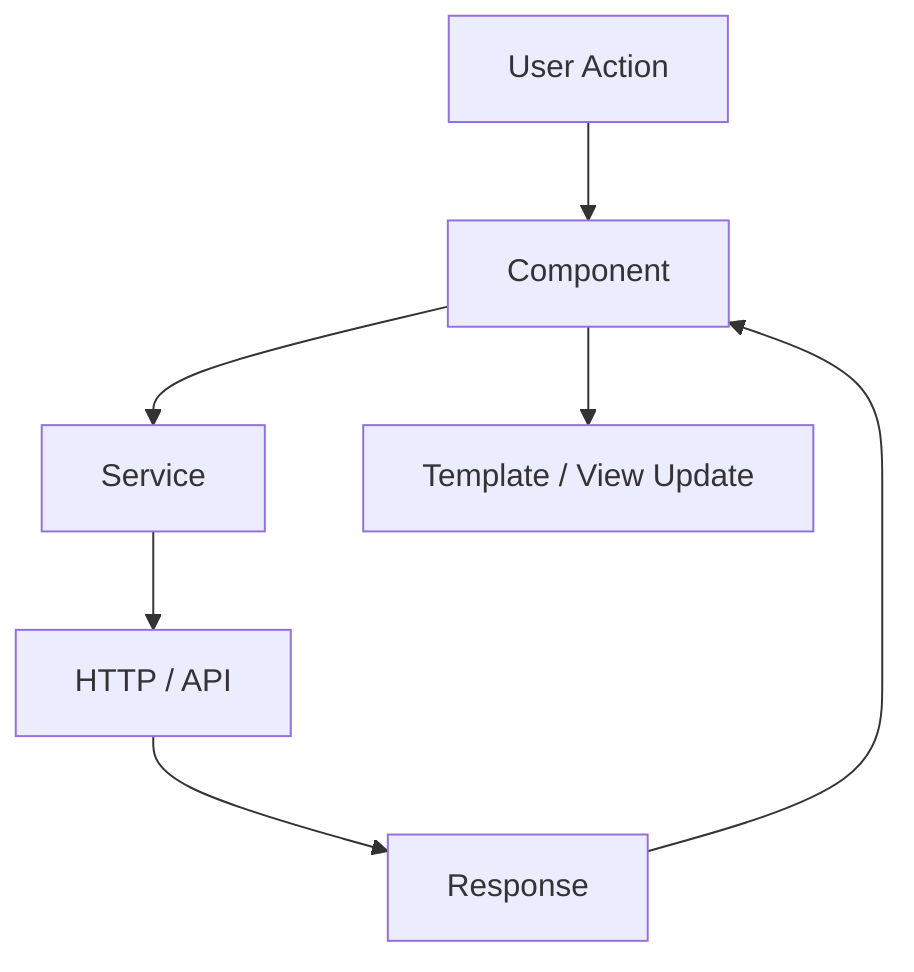
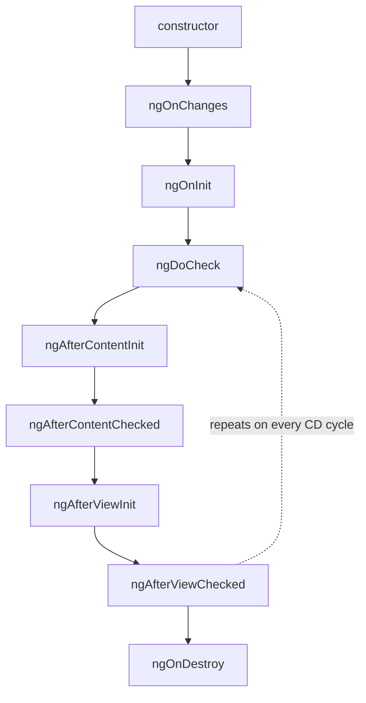
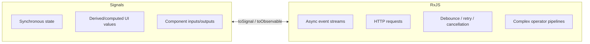
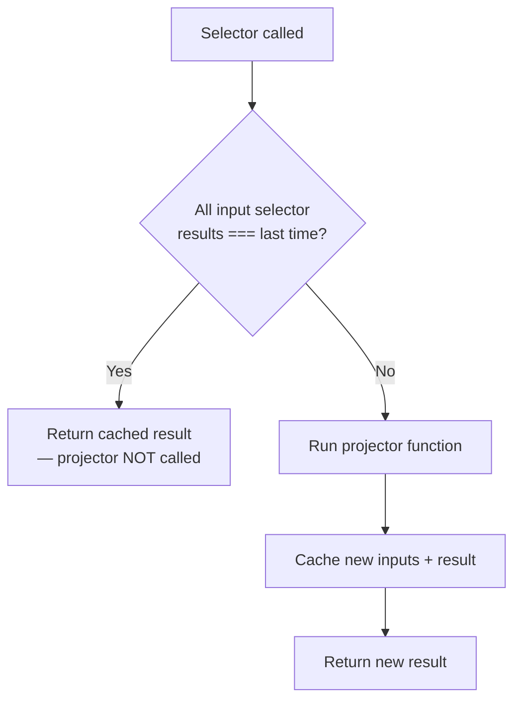
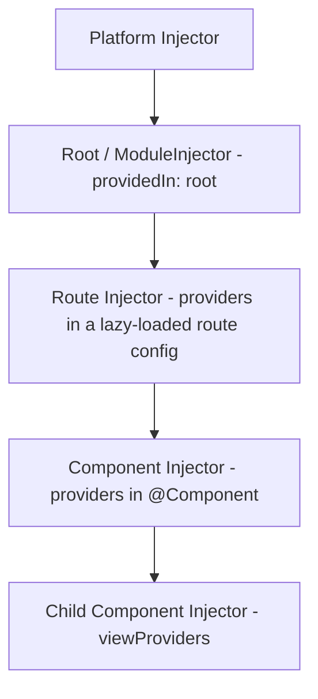
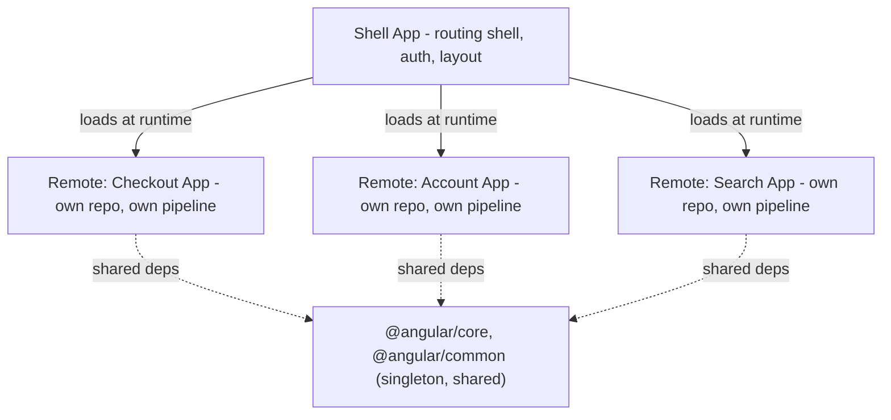
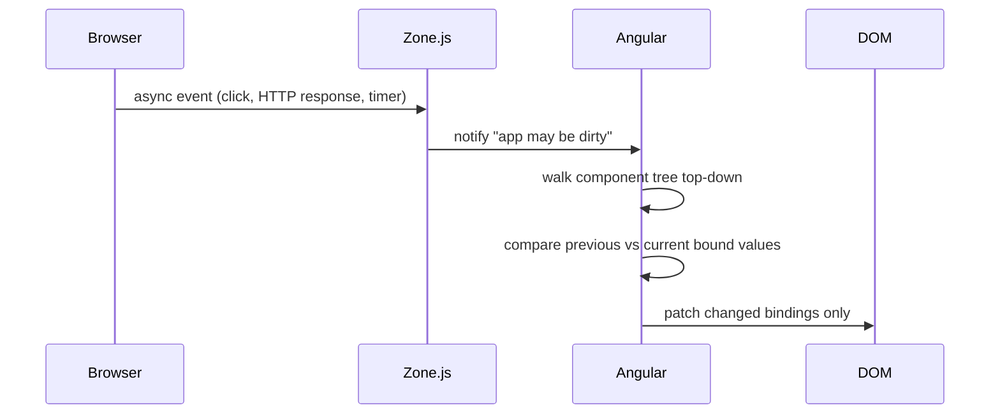
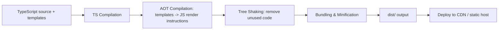
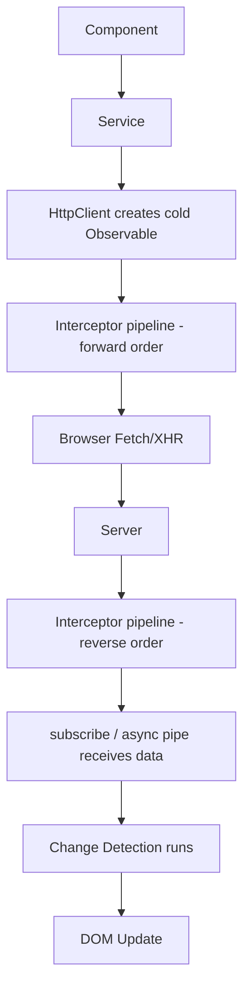
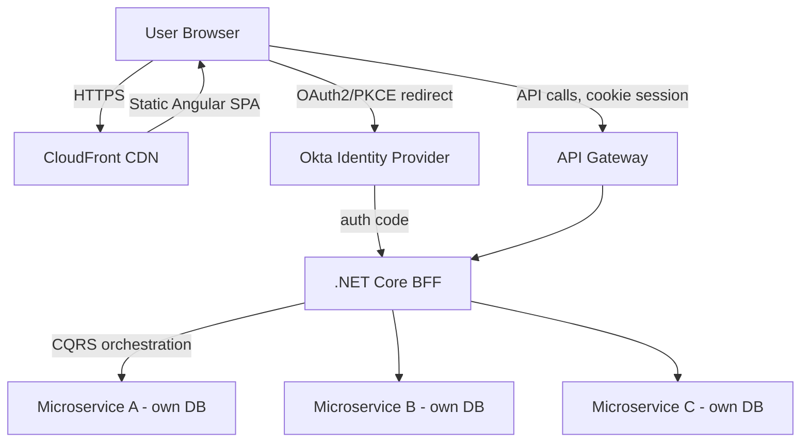

# Angular Senior/Lead Interview Guide

> Source notes were titled "Angular 7" (2018-era), but modern senior interviews (2026) assume knowledge through the latest stable Angular (v18/19-class features: standalone APIs by default, Signals, new control-flow syntax, `@defer`, zoneless change detection). This guide preserves your original notes, reorganizes them, answers every open question, and clearly tags everything added to close the gap between Angular 7 and current Angular. Additions are prefixed **[new content]**.

## Table of Contents

1. [Core Concepts](#core-concepts)
   - [Angular vs AngularJS](#angular-vs-angularjs)
   - [Hybrid Angular Apps and Upgrading from AngularJS (ngUpgrade)](#hybrid-angular-apps-and-upgrading-from-angularjs-ngupgrade)
   - [Architecture Overview](#architecture-overview)
   - [TypeScript in Angular](#typescript-in-angular)
   - [Modules (NgModule)](#modules-ngmodule)
   - [Components](#components)
   - [[new content] Standalone Components (Angular 14+, default since v17)](#new-content-standalone-components-angular-14-default-since-v17)
   - [UI Component Libraries: Angular Material and Bootstrap](#ui-component-libraries-angular-material-and-bootstrap)
   - [Templates, Metadata, Decorators](#templates-metadata-decorators)
   - [Data Binding](#data-binding)
   - [Directives](#directives)
   - [[new content] New Control-Flow Syntax: @if / @for / @switch (Angular 17+)](#new-content-new-control-flow-syntax-if--for--switch-angular-17)
   - [ng-container, ng-template, ng-content](#ng-container-ng-template-ng-content)
   - [Pipes](#pipes)
   - [Services and Dependency Injection](#services-and-dependency-injection)
   - [[new content] The inject() Function (Angular 14+)](#new-content-the-inject-function-angular-14)
2. [Intermediate](#intermediate)
   - [Component Lifecycle Hooks](#component-lifecycle-hooks)
   - [ViewChild / ViewChildren / ContentChild / ContentChildren](#viewchild--viewchildren--contentchild--contentchildren)
   - [Component Communication](#component-communication)
   - [Routing and Navigation](#routing-and-navigation)
   - [Route Guards](#route-guards)
   - [Forms: Template-driven vs Reactive](#forms-template-driven-vs-reactive)
   - [[new content] Typed Reactive Forms (Angular 14+)](#new-content-typed-reactive-forms-angular-14)
   - [HttpClient and Interceptors](#httpclient-and-interceptors)
   - [[new content] Functional Interceptors (Angular 15+)](#new-content-functional-interceptors-angular-15)
3. [Advanced](#advanced)
   - [RxJS and Observables](#rxjs-and-observables)
   - [Subjects, BehaviorSubject, Multicasting](#subjects-behaviorsubject-multicasting)
   - [RxJS Operators Cheat Sheet](#rxjs-operators-cheat-sheet)
   - [[new content] Angular Signals (Angular 16+)](#new-content-angular-signals-angular-16)
   - [[new content] RxJS vs Signals — When to Use Which](#new-content-rxjs-vs-signals--when-to-use-which)
   - [State Management (NgRx and Alternatives)](#state-management-ngrx-and-alternatives)
   - [[new content] SignalStore / NgRx Signals (Angular 17+)](#new-content-signalstore--ngrx-signals-angular-17)
   - [[gaps] NgRx Entity Adapters, Facade Pattern, and Selector Memoization](#gaps-ngrx-entity-adapters-facade-pattern-and-selector-memoization)
   - [[new content] Dependency Injection: Hierarchical Injectors Deep Dive](#new-content-dependency-injection-hierarchical-injectors-deep-dive)
   - [[gaps] Micro-Frontends / Module Federation for Angular](#gaps-micro-frontends--module-federation-for-angular)
4. [Performance](#performance)
   - [Change Detection Deep Dive](#change-detection-deep-dive)
   - [[new content] Zoneless Change Detection (Angular 18+)](#new-content-zoneless-change-detection-angular-18)
   - [OnPush Strategy and Pitfalls](#onpush-strategy-and-pitfalls)
   - [trackBy / track in Loops](#trackby--track-in-loops)
   - [[new content] Deferrable Views: @defer (Angular 17+)](#new-content-deferrable-views-defer-angular-17)
   - [Lazy Loading and Preloading](#lazy-loading-and-preloading)
   - [Bundle Size, Tree Shaking, Build Optimization](#bundle-size-tree-shaking-build-optimization)
   - [Angular CLI vs Webpack](#angular-cli-vs-webpack)
   - [[new content] esbuild / Vite-based Application Builder (Angular 17+)](#new-content-esbuild--vite-based-application-builder-angular-17)
   - [Angular Build & Runtime Lifecycle](#angular-build--runtime-lifecycle)
   - [HTTP Request Lifecycle](#http-request-lifecycle)
5. [SSR, PWA & Cross-Cutting](#ssr-pwa--cross-cutting)
   - [Angular Universal / SSR](#angular-universal--ssr)
   - [[new content] Hydration (Angular 16+) and Event Replay (Angular 17+)](#new-content-hydration-angular-16-and-event-replay-angular-17)
   - [Progressive Web Apps and Service Workers](#progressive-web-apps-and-service-workers)
   - [Angular Security](#angular-security)
   - [[gaps] Accessibility (a11y): ARIA, CDK a11y Module, Focus Management](#gaps-accessibility-a11y-aria-cdk-a11y-module-focus-management)
   - [Deployment: Firebase and GitHub Pages](#deployment-firebase-and-github-pages)
6. [Enterprise Architecture Case Study (BFF + CQRS + .NET)](#enterprise-architecture-case-study-bff--cqrs--net)
7. [Testing](#testing)
8. [Best Practices](#best-practices)
9. [Common Pitfalls](#common-pitfalls)
10. [Version Feature Comparison Table](#version-feature-comparison-table)
11. [Sample Interview Q&A](#sample-interview-qa)
12. [Summary of Additions](#summary-of-additions)
13. [Summary of [gaps] Additions (This Pass)](#summary-of-gaps-additions-this-pass)

---

## Core Concepts

### Angular vs AngularJS

Angular (v2+) is a full TypeScript rewrite of AngularJS (1.x). Key differences:

| Aspect | AngularJS (1.x) | Angular (2+) |
|---|---|---|
| Architecture | MVC | Component-based |
| Language | JavaScript | TypeScript |
| Performance | Digest cycle, slower | AOT + Ivy, faster |
| Mobile | Not optimized | Optimized |
| Rendering engine | N/A | View Engine → **Ivy** (default since v9) |

**Key features of Angular** (from source, still accurate): component-based architecture, two-way data binding, directives & pipes, DI, routing, HttpClient, template-driven & reactive forms, lazy loading, AOT compilation.

**What is Ivy?** Ivy is Angular's rendering and compilation engine — it compiles components and templates ahead of time into a set of low-level JavaScript instructions rather than relying on a larger, more generic runtime interpreter. It has been the default engine since Angular 9 (replacing the older "View Engine"), and it's called out specifically for what it delivers: smaller bundle sizes (better tree-shaking, since each component emits its own minimal instructions instead of large shared runtime metadata), faster compilation, and better debugging (component instances become directly inspectable in the browser console, and template errors map more precisely back to source locations).

**Follow-up an interviewer will ask:** "Angular is not MVC — what would you call it?" Answer: it's closer to a component/MVVM-flavored architecture — the component class is the view-model, the template is the view, and services/DI supply the model/business logic layer. There's no single canonical controller layer like classic MVC.

### Hybrid Angular Apps and Upgrading from AngularJS (ngUpgrade)

A **Hybrid Angular App** is an application that runs AngularJS (1.x) and Angular (2+) side by side on the same page during a migration — both framework runtimes are bootstrapped simultaneously, with components/services shared or communicated between the two.

Angular ships the **`ngUpgrade`** module (package `@angular/upgrade`) specifically to support this:

```bash
npm install @angular/upgrade
```

- `UpgradeModule` bootstraps the hybrid app and lets AngularJS directives be used from Angular templates, and Angular components be used from AngularJS templates (via `downgradeComponent`/`downgradeInjectable`).
- Typical migration strategy: introduce Angular alongside an existing AngularJS app, migrate one route/feature/component at a time to Angular, and keep `ngUpgrade` as the bridge until the AngularJS code is fully retired — rather than attempting a risky "big bang" rewrite of the whole app at once.
- **Why this comes up in interviews:** most enterprises with a codebase older than ~2016 went through exactly this migration path. A senior/lead candidate is expected to know the mechanism exists (`ngUpgrade`, `@angular/upgrade`) even without having personally run a migration — it signals awareness of Angular's history and how legacy-modernization projects actually get staffed and scoped, which maps directly onto the WebForms → MVC → .NET Core migrations a 10-year .NET developer has likely lived through.

### Architecture Overview

Classic (NgModule-based) building blocks, per the source notes:

1. **Modules** (`@NgModule`) — organize the app into blocks.
2. **Components** (`@Component`) — UI logic and structure.
3. **Templates & Views** — HTML with directives/bindings.
4. **Directives & Pipes** — modify behavior, transform data.
5. **Services & DI** — share logic across components.
6. **Routing** (`RouterModule`) — navigation.
7. **Forms** — template-driven and reactive.
8. **State Management** — NgRx or service-based.



**[new content] Modern architecture note:** As of Angular 14+ (and the default project schematic since Angular 17), the recommended architecture drops NgModules entirely in favor of **standalone components, directives, and pipes**, with routing configured via provider functions (`provideRouter`) in `main.ts`/`app.config.ts` rather than `RouterModule.forRoot()`. NgModules are not deprecated/removed — they still work and are common in legacy codebases — but "how would you structure a new Angular app today" now expects a standalone, NgModule-free answer. Be ready to speak to both.

### TypeScript in Angular

TypeScript is a superset of JavaScript with static typing and OOP features. Angular uses it for: type safety, better tooling/IDE support, compile-time error detection, and support for modern ES features and decorators. For a 10-year .NET developer, the mental model maps closely to C#: interfaces, generics, access modifiers, and strict null checking (`strictNullChecks`, part of `strict: true` in Angular CLI projects) behave analogously to C# nullable reference types.

**Follow-up:** "Why does Angular *require* TypeScript rather than just support it?" Because Angular's compiler (AOT/Ivy) relies on static type information and decorator metadata to generate optimized instruction code and to power dependency injection's type-based token resolution.

### Modules (NgModule)

```typescript
@NgModule({
  declarations: [AppComponent],
  imports: [BrowserModule],
  providers: [],
  bootstrap: [AppComponent]
})
export class AppModule { }
```

- `declarations` — components/directives/pipes owned by this module.
- `imports` — other modules whose exported declarables this module needs.
- `providers` — module-level DI registrations (legacy pattern; `providedIn: 'root'` is preferred now).
- `bootstrap` — the root component Angular instantiates to start the app (only relevant to the root module).

`RouterModule.forRoot(routes)` vs `RouterModule.forChild(routes)` — `forRoot()` is used exactly once, in the app's root routing module, and additionally configures the singleton `Router` service, location strategy, etc. `forChild()` is used in feature modules and only registers routes without re-creating router singletons — critical because re-invoking `forRoot()` in a feature module used to be a classic bug causing duplicate/broken router state.

### Components

A component = Template (HTML) + Class (TS logic) + Styles (CSS/SCSS).

```typescript
import { Component, ViewEncapsulation, ChangeDetectionStrategy } from '@angular/core';
import { CommonModule } from '@angular/common';
import { UserService } from './user.service';
import { trigger, state, style, transition, animate } from '@angular/animations';

@Component({
  selector: 'app-user',
  templateUrl: './user.component.html',
  styleUrls: ['./user.component.css'],
  providers: [UserService],
  viewProviders: [UserService],
  encapsulation: ViewEncapsulation.Emulated,
  changeDetection: ChangeDetectionStrategy.OnPush,
  animations: [
    trigger('fade', [
      state('visible', style({ opacity: 1 })),
      state('hidden', style({ opacity: 0 })),
      transition('visible <=> hidden', [animate('300ms')])
    ])
  ],
  standalone: true,
  imports: [CommonModule],
  exportAs: 'userComp',
  host: {
    '(click)': 'onHostClick()',
    '[class.active]': 'isActive'
  }
})
export class UserComponent {
  name = 'John';
  isActive = true;
  state = 'visible';

  toggle() {
    this.state = this.state === 'visible' ? 'hidden' : 'visible';
  }

  onHostClick() {
    console.log('Host element clicked');
  }
}
```

**What each `@Component` property does:**

| Property | Purpose |
|---|---|
| `selector` | HTML tag name for the component |
| `template` | Inline HTML |
| `templateUrl` | External HTML file |
| `styles` | Inline CSS |
| `styleUrls` | External CSS |
| `providers` | Services scoped to this component + its children |
| `viewProviders` | Services scoped only to this component's *view* (not visible to projected content) |
| `encapsulation` | CSS scoping strategy — see below |
| `changeDetection` | Change detection optimization (`Default` or `OnPush`) |
| `animations` | Component animations |
| `standalone` | Component usable without an NgModule |
| `imports` | Other standalone components/directives/pipes/modules this component's template needs |
| `exportAs` | Name to reference this component via template reference variable when used as a directive |
| `host` | Bindings/listeners applied to the component's own host element |

`encapsulation` options:

| Value | Behavior |
|---|---|
| `Emulated` (default) | Angular emulates Shadow DOM using attribute selectors; styles are scoped but not truly isolated |
| `None` | No encapsulation; styles become global |
| `ShadowDom` | Uses real browser Shadow DOM for strict isolation |

**`providers` vs `viewProviders`:** `providers` are visible to the component's own view *and* any content projected into it via `<ng-content>`. `viewProviders` are visible only to the component's own template, not to projected content. This is a classic senior-level gotcha question — most developers have never needed `viewProviders` and can't explain the difference on the spot.

**Directive vs Component:**

| Feature | Component | Directive |
|---|---|---|
| UI Rendering | Yes | No |
| Decorator | `@Component` | `@Directive` |
| Template | Has a template | No template |
| Example Usage | UI components | DOM behavior change |

Every component is technically a directive with a template attached — this is a common trick interview question ("is a component a directive?").

### [new content] Standalone Components (Angular 14+, default since v17)

The single biggest structural gap in a "2018 Angular 7" note set. Standalone components eliminate the mandatory NgModule wrapper:

```typescript
@Component({
  standalone: true,
  selector: 'app-user-card',
  imports: [CommonModule, RouterLink], // import only what the template needs, directly
  template: `<div>{{ name }}</div>`
})
export class UserCardComponent {
  name = 'Jane';
}
```

Bootstrapping without `AppModule`:

```typescript
// main.ts
import { bootstrapApplication } from '@angular/platform-browser';
import { AppComponent } from './app/app.component';
import { appConfig } from './app/app.config';

bootstrapApplication(AppComponent, appConfig);
```

```typescript
// app.config.ts
export const appConfig: ApplicationConfig = {
  providers: [
    provideRouter(routes),
    provideHttpClient(withInterceptors([authInterceptor])),
    provideAnimations(),
  ]
};
```

**Why it matters for interviews:** Angular CLI has generated standalone-by-default projects since v17. Interviewers will ask you to contrast the old (`NgModule` + `RouterModule.forRoot`) and new (`bootstrapApplication` + `provideRouter`) bootstrap flows, and to explain *why* Angular made this move — primarily to simplify the mental model (no more "which module do I declare this in?"), improve tree-shakability (each component declares its own exact dependencies), and better align Angular with how React/Vue/Svelte components are consumed (self-contained, importable units). NgModules are **not deprecated** — you can mix standalone components into an NgModule-based app incrementally, which is the recommended migration path (`ng generate @angular/core:standalone` schematic can assist).

**Gotcha:** a standalone component's `imports` array is analogous to an NgModule's `imports`, but scoped per-component rather than shared app-wide — every standalone component must import `CommonModule` (or specific directives) itself if it uses `*ngIf`/`*ngFor`/pipes like `date`, unlike NgModule apps where `CommonModule` was often imported once in a shared module.

### UI Component Libraries: Angular Material and Bootstrap

Two of the most common UI options paired with Angular:

| Library | What it is | Notes |
|---|---|---|
| **Angular Material** | Google's official Material Design component library, built specifically for Angular | Deep Angular integration (built on the CDK, works naturally with reactive forms), theming via SCSS, accessible-by-default components (see the CDK `a11y` module covered later) |
| **Bootstrap** | A general-purpose, framework-agnostic CSS framework | Not Angular-specific — used via plain CSS classes, or through a wrapper library like `ngx-bootstrap`/`ng-bootstrap` for Angular-idiomatic components (directives instead of jQuery-driven widgets) |

Installing Angular Material via the CLI schematic:

```bash
ng add @angular/material
```

This single command installs the package, runs an interactive theme picker, wires up typography/animations in `angular.json`/`main.ts`, and optionally sets up gesture support (`hammerjs`) — the same schematic-driven `ng add` convention used elsewhere in the CLI ecosystem (`@angular/pwa`, `@angular/ssr`, `@ngrx/store`).

**Senior framing:** reach for Angular Material when you want a component library with baked-in accessibility, theming, and Angular-native APIs, and Material Design's visual language is acceptable; reach for Bootstrap (or a wrapper) when the org already has Bootstrap-based design conventions/branding to match, or the team wants a CSS-only approach that isn't tied to one component framework's JS.

### Templates, Metadata, Decorators

A **template** is the HTML view of a component — declarative, not imperative; it describes desired UI, and Angular compiles it into efficient render/update instructions (via Ivy).

```html
<h1>{{ title }}</h1>
<button (click)="sayHello()">Click me</button>
```

**Metadata** is information attached to a class via a decorator (`@Component`, `@NgModule`, `@Injectable`), telling Angular how to construct/wire the class.

**Decorators** are functions that attach that metadata. Without decorators, Angular has no way to know how to instantiate a class or resolve its dependencies. Key decorators: `@Component`, `@Directive`, `@Pipe`, `@NgModule`, `@Injectable`, `@Input`, `@Output`, `@HostBinding`, `@HostListener`, `@ViewChild`, `@ContentChild`.

### Data Binding

Four types:

| Type | Syntax | Direction | Example |
|---|---|---|---|
| Interpolation | `{{ value }}` | Component → View | `<h1>{{ title }}</h1>` |
| Property binding | `[property]="value"` | Component → View | `` |
| Event binding | `(event)="handler()"` | View → Component | `<button (click)="onClick()">` |
| Two-way binding | `[(ngModel)]="value"` | Both | `<input [(ngModel)]="name">` |

Two-way binding is syntactic sugar: `[(ngModel)]="name"` desugars to `[ngModel]="name" (ngModelChange)="name=$event"`. Knowing this "banana in a box" desugaring is a frequent interview probe, especially when asked to build your own two-way-bindable custom component (`@Input() value` + `@Output() valueChange`).

### Directives

Three types:

1. **Component directives** — every component is a directive with a template.
2. **Structural directives** (`*ngIf`, `*ngFor`, `*ngSwitch`) — add/remove DOM elements. The `*` is sugar: Angular desugars `*ngIf="cond"` into `<ng-template [ngIf]="cond">...</ng-template>` internally.
3. **Attribute directives** (`ngClass`, `ngStyle`, custom directives) — change appearance/behavior without altering DOM structure.

Custom directive example:

```typescript
@Directive({ selector: '[appHighlight]' })
export class HighlightDirective {
  constructor(private el: ElementRef, private renderer: Renderer2) {}

  private setColor(color: string) {
    this.renderer.setStyle(this.el.nativeElement, 'color', color);
  }
}
```

**`ElementRef` vs `Renderer2`:** `ElementRef` gives direct access to the native DOM node (`elementRef.nativeElement`). `Renderer2` is the Angular-recommended abstraction for DOM manipulation because it works correctly under server-side rendering and Web Worker rendering, where there is no real DOM to touch directly. **Interview trap:** directly mutating `nativeElement.style` (as shown in the older `HighlightDirective` example from the notes) works in a browser but breaks under SSR — always prefer `Renderer2` in production code, and call this out if asked to critique that snippet.

`*ngIf` vs `[hidden]`:

| Feature | `*ngIf` | `[hidden]` |
|---|---|---|
| Removes from DOM? | Yes | No — just hides it (`display:none`) |
| Performance impact | Better for expensive subtrees (no render cost when false) | Element stays in DOM/memory; cheaper to toggle frequently |
| Re-runs lifecycle hooks on toggle? | Yes (destroys/recreates) | No |

`trackBy` — see [Performance](#trackby--track-in-loops).

### [new content] New Control-Flow Syntax: @if / @for / @switch (Angular 17+)

Angular 17 introduced a new built-in template control-flow syntax that eventually replaces `*ngIf`/`*ngFor`/`*ngSwitch` for new code:

```html
@if (isLoggedIn) {
  <p>Welcome back!</p>
} @else if (isGuest) {
  <p>Continue as guest</p>
} @else {
  <p>Please log in.</p>
}

@for (item of items; track item.id) {
  <li>{{ item.name }}</li>
} @empty {
  <li>No items found.</li>
}

@switch (status) {
  @case ('success') { <p>Success</p> }
  @case ('error') { <p>Error</p> }
  @default { <p>Unknown</p> }
}
```

**Why this matters at a senior level:**
- `track` is **mandatory** in `@for` (unlike the optional `trackBy` on `*ngFor`), which forces developers to think about identity/keying up front instead of discovering the perf problem later.
- The new syntax is compiled directly by Ivy without needing `<ng-template>` desugaring, giving smaller generated code and reportedly better runtime performance versus the structural-directive versions.
- `@empty` is a first-class "no data" block — previously required a separate `*ngIf="items.length === 0"` sibling block.
- `*ngIf`/`*ngFor`/`*ngSwitch` are **not deprecated or removed** — both syntaxes coexist, and the old ones are extremely common in any codebase built before 2024. Be ready to read/maintain both; migration tooling (`ng generate @angular/core:control-flow`) exists to auto-convert a codebase.
- `CommonModule` import is no longer required to use `@if`/`@for` — they are built into the template compiler, not directives, so nothing needs to be imported.

### ng-container, ng-template, ng-content

| Feature | Purpose | Renders in DOM? | Best Use |
|---|---|---|---|
| `ng-container` | Logical grouping, no extra element | No | Avoid wrapper `<div>` pollution when applying structural directives |
| `ng-template` | Blueprint for deferred/conditional rendering | No (until used) | `*ngIf ... else`, reusable templates, `ngTemplateOutlet` |
| `ng-content` | Content projection (parent → child) | Yes (projects children only) | Reusable components: cards, modals, tabs |

`ng-container` example (avoiding wrapper divs):

```html
<ng-container *ngIf="isLoggedIn">
  <p>Welcome back, user!</p>
  <button>Logout</button>
</ng-container>
```

`ng-template` with `else` and `ngTemplateOutlet`:

```html
<p *ngIf="isLoggedIn; else showLogin">Welcome back!</p>
<ng-template #showLogin>
  <p>Please log in to continue.</p>
</ng-template>
```

```html
<ng-template #loadingTemplate>
  <p>Loading data...</p>
</ng-template>
<div *ngIf="isLoading; else content"></div>
<ng-template #content>
  <ng-container *ngTemplateOutlet="loadingTemplate"></ng-container>
</ng-template>
```

`ng-content` — basic and multi-slot projection:

```typescript
@Component({
  selector: 'app-card',
  template: `
    <div class="card">
      <header><ng-content select="[card-title]"></ng-content></header>
      <section><ng-content></ng-content></section>
      <footer><ng-content select="[card-footer]"></ng-content></footer>
    </div>
  `
})
export class CardComponent {}
```

```html
<app-card>
  <h2 card-title>Book Title</h2>
  <p>Description here...</p>
  <button card-footer>Buy Now</button>
</app-card>
```

### Pipes

Pipes transform data for **display only**, keeping formatting logic out of the component class and templates clean.

```html
<p>{{ name | uppercase }}</p>
<p>{{ 1234.56 | currency:'USD' }}</p>
```

Built-in pipes: `uppercase`, `lowercase`, `titlecase`, `number`, `percent`, `currency`, `date`, `json`, `async`, `slice`, `decimal`.

Custom pipe:

```typescript
@Pipe({ name: 'reverse' })
export class ReversePipe implements PipeTransform {
  transform(value: string): string {
    return value.split('').reverse().join('');
  }
}
```

**Pure vs impure pipes:**

```typescript
@Pipe({ name: 'purePipe', pure: true })   // default — runs only when input reference changes
@Pipe({ name: 'impurePipe', pure: false }) // runs on every change detection cycle
```

- **Pure pipe** — re-evaluated only when Angular detects a change in the *reference* of the input (or its primitive value). Cheap, predictable, the default and strongly preferred.
- **Impure pipe** — re-evaluated on every change detection run regardless of whether input actually changed. Needed for pipes like the built-in `async` pipe (which must poll an Observable/Promise for new emissions) but otherwise a performance red flag; avoid writing custom impure pipes for filtering/sorting arrays in templates — that recomputes on every keystroke/tick across the whole app.

**Interview trap:** "Why shouldn't you filter a list using a pipe by default?" Because if the pipe is pure, it won't re-run when you mutate the array in place (no new reference), and if it's impure to work around that, it now runs on every CD cycle — a well-known Angular performance foot-gun. The fix is to do filtering in the component (recomputing into a new array on demand) or use RxJS/Signals-based derived state instead.

### Services and Dependency Injection

```typescript
@Injectable({ providedIn: 'root' })
export class DataService {
  getData() { return 'Hello from Service'; }
}
```

```typescript
constructor(private dataService: DataService) { }
```

`providedIn: 'root'` vs `providers` array in `@NgModule`:

| Feature | `providedIn: 'root'` | `providers` in `@NgModule` |
|---|---|---|
| Scope | Singleton, application-wide | Can be scoped to a module/component |
| Lazy loading | Tree-shakable; works well, only instantiated if injected | Must be managed manually; historically risked duplicate instances per lazy module |
| Recommendation | Preferred default for most services | Use when you deliberately want scoped/multiple instances |

**Hierarchical DI:** Angular's injector is a tree, not a single global container. `providedIn: 'root'` gives one instance app-wide. Registering a service in a component's own `providers` array creates a *new* instance for that component subtree — e.g., a `FormComponent` with `providers: [ValidationService]` gets its own isolated `ValidationService`, separate from any other instance elsewhere in the tree. This is used deliberately for per-feature or per-component state isolation (e.g., a wizard component with multiple independent step-form instances).

### [new content] The inject() Function (Angular 14+)

Constructor injection is not the only way to get dependencies anymore. The functional `inject()` API is now idiomatic, especially in standalone components, functional guards/interceptors/resolvers, and any place where you don't have a class constructor (e.g., inside `provideRouter`'s functional guards, or Signal-based computed setups):

```typescript
import { inject } from '@angular/core';

@Component({ standalone: true, selector: 'app-user' })
export class UserComponent {
  private userService = inject(UserService);
  private route = inject(ActivatedRoute);
}
```

Functional route guard using `inject()` (replaces class-based `CanActivate`):

```typescript
export const authGuard: CanActivateFn = (route, state) => {
  const auth = inject(AuthService);
  const router = inject(Router);
  return auth.isLoggedIn() ? true : router.createUrlTree(['/login']);
};
```

**Why interviewers probe this:** `inject()` only works inside an "injection context" (constructor, field initializer, or a function run inside `runInInjectionContext`). A classic gotcha question: "Can you call `inject()` inside a `setTimeout` callback?" — No, not directly; the injection context is gone once you're inside an async callback unless you capture the value beforehand or wrap the call in `runInInjectionContext()`. Constructor injection remains fully valid and is still what most existing class-based services/components use — `inject()` is an additive, not a replacement, but is the required style for functional guards/resolvers/interceptors and is now the CLI-generated default in new standalone projects for consistency.

---

## Intermediate

### Component Lifecycle Hooks



| Hook | When | Typical use |
|---|---|---|
| `ngOnChanges(changes: SimpleChanges)` | Whenever a bound `@Input()` changes (before `ngOnInit` on first call) | React to updated input-bound properties; `SimpleChanges` exposes previous vs current values |
| `ngOnInit()` | Once, after the first `ngOnChanges` | Initialization logic, e.g., fetching data |
| `ngDoCheck()` | Every CD cycle | Custom change detection beyond Angular's default (mutation detection Angular can't see, e.g., in-place array mutation) |
| `ngAfterContentInit()` | Once, after content projected via `<ng-content>` is initialized | Access projected content for the first time |
| `ngAfterContentChecked()` | After every check of projected content | React to updates in projected content |
| `ngAfterViewInit()` | Once, after the component's view and child views initialize | Safely access `@ViewChild` and DOM elements |
| `ngAfterViewChecked()` | After each view check | Rare use — responding to repeated view updates |
| `ngOnDestroy()` | Right before the component is destroyed | Clean up subscriptions, timers, event listeners |

Not lifecycle hooks but closely related:
- **`constructor()`** — runs on class instantiation; use *only* for DI, never business logic. **Senior rule: never put business logic (API calls, DOM access) in the constructor** — inputs aren't bound yet and injected services may not be fully ready for use in all contexts.
- **`SimpleChanges`** (inside `ngOnChanges`) — provides `.previousValue` / `.currentValue` / `.firstChange` for each changed input.

`constructor` vs `ngOnInit`:

| | `constructor` | `ngOnInit` |
|---|---|---|
| Runs | When class instantiated | After Angular sets input bindings |
| Use for | Dependency injection only | API calls, initialization logic |
| Inputs available? | No (not yet bound) | Yes |

### ViewChild / ViewChildren / ContentChild / ContentChildren

`@ViewChild`/`@ViewChildren` access elements/components declared in **this component's own template**. `@ContentChild`/`@ContentChildren` access elements **projected in from the parent** via `<ng-content>`.

```typescript
@ViewChild(MatPaginator) paginator!: MatPaginator;
@ViewChildren(ItemComponent) items!: QueryList<ItemComponent>;
```

| | Source | Available after |
|---|---|---|
| `@ViewChild` / `@ViewChildren` | Component's own template | `ngAfterViewInit` |
| `@ContentChild` / `@ContentChildren` | Projected content from parent | `ngAfterContentInit` |

**Interview one-liner:** "View = what I own, Content = what the parent gives me."

`@ViewChild` is commonly used to: read DOM properties/call native methods (focus, scroll, measure), call child component public methods directly, or integrate third-party non-Angular UI libraries that need a DOM handle.

**[new content] Signal-based queries (Angular 17.3+):** `viewChild()`, `viewChildren()`, `contentChild()`, and `contentChildren()` function-based equivalents now exist, returning Signals instead of requiring the `!` non-null assertion + lifecycle timing dance:

```typescript
export class UserComponent {
  paginator = viewChild(MatPaginator);      // Signal<MatPaginator | undefined>
  items = viewChildren(ItemComponent);      // Signal<readonly ItemComponent[]>
}
```

This removes the historical gotcha where `@ViewChild` fields are `undefined` until `ngAfterViewInit` — the signal form makes "not yet available" an explicit part of the type (`| undefined`) rather than a runtime surprise, and integrates cleanly with `computed()`/`effect()`.

### Component Communication

| Direction | Mechanism |
|---|---|
| Parent → Child | `@Input()` |
| Child → Parent | `@Output()` + `EventEmitter` |
| Sibling / unrelated | Shared service with a `Subject`/`BehaviorSubject` (or Signal) |
| Across routes | Route params, query params, or router navigation `state` |

`EventEmitter` is a thin wrapper over an RxJS `Subject`, intended strictly for component `@Output()` communication — **not** recommended as a general pub/sub mechanism inside services (use a plain `Subject`/`BehaviorSubject` there instead).

**Senior guidance:** prefer `@Input`/`@Output` for direct parent-child; reach for a shared service only when data must cross unrelated components or persist across route changes. Passing data through services is appropriate for cross-cutting shared state (auth, cart, theme) but is overkill — and adds indirection — for simple parent-child relationships.

Template reference variables (`#var`) are a lighter-weight alternative to `@ViewChild` for trivial DOM access:

```html
<input #txt />
<button (click)="print(txt.value)">Print</button>
```

Use them when you just need a quick handle in the template itself, avoiding component-class coupling for small UI logic.

### Routing and Navigation

```typescript
const routes: Routes = [
  { path: 'home', component: HomeComponent },
  { path: 'about', component: AboutComponent }
];

@NgModule({
  imports: [RouterModule.forRoot(routes)],
  exports: [RouterModule]
})
export class AppRoutingModule { }
```

```html
<a routerLink="/home">Home</a>
<router-outlet></router-outlet>
```

Programmatic navigation:

```typescript
constructor(private router: Router) { }
navigateToHome() {
  this.router.navigate(['/home']);
}
```

Wildcard route:

```typescript
{ path: '**', component: PageNotFoundComponent }
```

Route parameters:

```typescript
{ path: 'product/:id', component: ProductComponent }
```
```typescript
constructor(private route: ActivatedRoute) {}
this.route.snapshot.paramMap.get('id');
```

Query parameters:

```typescript
this.router.navigate(['/products'], { queryParams: { category: 'electronics' } });
this.route.snapshot.queryParamMap.get('category');
```

**Note:** `snapshot` only captures the value at the moment of navigation — if the component can be re-navigated to itself with different params without being destroyed/recreated (e.g., `/product/1` → `/product/2`), `snapshot` won't update. Use the observable form (`this.route.paramMap.subscribe(...)` or `this.route.paramMap` piped through `switchMap`) when the same component instance can be reused across param changes — a very common gotcha/bug source and popular interview question.

Lazy loading feature modules:

```typescript
const routes: Routes = [
  { path: 'dashboard', loadChildren: () => import('./dashboard/dashboard.module').then(m => m.DashboardModule) }
];
```

**[new content] Lazy-loading standalone components/routes (Angular 14+):** modern lazy loading no longer requires a wrapper NgModule at all:

```typescript
const routes: Routes = [
  { path: 'login', loadComponent: () => import('./login/login.component').then(c => c.LoginComponent) },
  { path: 'admin', loadChildren: () => import('./admin/admin.routes').then(m => m.ADMIN_ROUTES) }
];
```
Here `admin.routes.ts` exports a plain `Routes` array (`export const ADMIN_ROUTES: Routes = [...]`) instead of an `AdminModule` — one less indirection layer, and it composes naturally with standalone components.

### Route Guards

| Guard | Purpose |
|---|---|
| `CanActivate` | Protect a route — e.g., only logged-in users can access `/dashboard` |
| `CanActivateChild` | Protect all child routes, e.g. everything under `/admin/*` |
| `CanLoad` (legacy) / `CanMatch` (current) | Prevent a lazy module from loading at all if the user doesn't have access |
| `CanMatch` | Decide whether a route even *matches* based on role/feature flag — can allow falling through to a different route definition for the same path |
| `CanDeactivate` | Block navigation away from a route — e.g., unsaved changes on `/profile-edit` |

> **Note on `CanLoad` vs `CanMatch`:** `CanLoad` is being phased out in favor of `CanMatch`, which is strictly more capable — `CanMatch` can also gate non-lazy routes and allows Angular to try the *next* matching route configuration if it returns false (useful for A/B routes or feature-flagged route swaps), whereas `CanLoad` only prevented lazy-module loading. New code should use `CanMatch`.

Full modern guard-based routing config (functional style, Angular 15+):

```typescript
const routes: Routes = [
  {
    path: 'login',
    loadComponent: () => import('./login/login.component').then(c => c.LoginComponent)
  },
  {
    path: 'dashboard',
    canMatch: [authMatchGuard],
    canActivate: [authGuard],
    loadComponent: () => import('./dashboard/dashboard.component').then(c => c.DashboardComponent)
  },
  {
    path: 'admin',
    canMatch: [adminLoadGuard, adminMatchGuard],
    loadChildren: () => import('./admin/admin.routes').then(m => m.ADMIN_ROUTES)
  },
  {
    path: 'profile-edit',
    canDeactivate: [formExitGuard],
    loadComponent: () => import('./profile/profile-edit.component').then(c => c.ProfileEditComponent)
  }
];
```

**[new content] Functional guard implementation example** (the source notes referenced guards conceptually but didn't show a full class/functional implementation — filling that gap):

```typescript
export const authGuard: CanActivateFn = () => {
  const auth = inject(AuthService);
  const router = inject(Router);
  return auth.isLoggedIn() || router.createUrlTree(['/login']);
};

export const formExitGuard: CanDeactivateFn<ProfileEditComponent> = (component) => {
  if (component.form.dirty) {
    return confirm('You have unsaved changes. Leave anyway?');
  }
  return true;
};
```

Class-based guards (`implements CanActivate`) still work and are common in older/enterprise codebases — functional guards are the modern idiomatic style since they avoid an extra injectable class for simple boolean checks.

### Forms: Template-driven vs Reactive

| | Template-driven | Reactive |
|---|---|---|
| Control style | Declared in the template via `ngModel` | Declared in the component class via `FormControl`/`FormGroup` |
| Scalability | Less scalable | Enterprise standard for complex forms |
| Testability | Harder (logic lives in template) | Easier (pure TS, no DOM needed) |
| Dynamic fields/validation | Awkward | Natural fit |
| Use when | Small forms, simple validation | Complex forms, dynamic fields, conditional validation |

Template-driven:

```html
<form #form="ngForm">
  <input type="text" [(ngModel)]="name" name="name">
</form>
```

Reactive:

```typescript
form = new FormGroup({
  name: new FormControl('')
});
```
```html
<input type="text" [formControl]="form.controls['name']">
```

`FormBuilder` simplifies construction:

```typescript
constructor(private fb: FormBuilder) { }
form = this.fb.group({
  name: ['', Validators.required]
});
```

Validation:

```typescript
form = new FormGroup({
  email: new FormControl('', [Validators.required, Validators.email])
});
```
```html
<p *ngIf="form.controls.email.errors?.required">Email is required</p>
```

Built-in validators: `required`, `minLength`, `maxLength`, `pattern`, `email`, `min`/`max`. Compose them via an array or `Validators.compose([...])`.

`FormGroup` vs `FormArray`:

```typescript
userForm = new FormGroup({
  name: new FormControl(''),
  phones: new FormArray([
    new FormControl('12345')
  ])
});
```

**Interview one-liner (from source, kept verbatim — it's good):** "A `FormGroup` is a fixed, named group of controls, while a `FormArray` is a dynamic, indexed collection of controls used when the number of inputs is unknown or user-driven."

Dynamic/conditional validation:

```typescript
control.setValidators([Validators.required]);
control.clearValidators();
control.updateValueAndValidity();
```

Used when one field's validity depends on another (e.g., "state" becomes required only if "country" is a country with states).

Checking validity:

```typescript
form.valid           // overall
control.errors       // specific control's errors
control.touched      // user has focused and left
control.dirty        // value has changed from initial
```

`[ngModelOptions]="{standalone: true}"` tells Angular *not* to register that `ngModel` control with the surrounding `ngForm` — used when you want two-way binding via `ngModel` on an input that should not participate in the parent form's overall validity/value (e.g., a UI-only filter field sitting inside a `<form>` for markup convenience).

`valueChanges` — an RxJS `Observable` available on any `FormControl`/`FormGroup`/`FormArray`, emitting the latest value on every user change:

```typescript
name = new FormControl('');

ngOnInit() {
  this.name.valueChanges.subscribe(value => {
    console.log('Name changed:', value);
  });
}
```

On a `FormGroup`, it emits the whole group's value object on any child change. Used for: live validation, real-time search, enabling/disabling buttons, autosave, dynamic form behavior, and filtering lists as the user types. **It only exists for reactive forms** — template-driven forms don't expose this API directly (though `ngModelChange` gives you a similar per-control event).

Form submission:

```html
<form [formGroup]="form" (ngSubmit)="onSubmit()">
  <button type="submit">Submit</button>
</form>
```
```typescript
onSubmit() {
  console.log(this.form.value);
}
```

Resetting: `this.form.reset();`

Custom validators — a function returning `ValidationErrors | null`, used for business rules or cross-field validation (e.g., "password" must equal "confirmPassword"):

```typescript
export function passwordsMatch(group: AbstractControl): ValidationErrors | null {
  const pass = group.get('password')?.value;
  const confirm = group.get('confirmPassword')?.value;
  return pass === confirm ? null : { passwordMismatch: true };
}
```

You **can** use Angular validators without a `<form>` tag — standalone `FormControl`/`FormGroup` instances work independently of any `<form>` element; this is common for inline editable fields or search boxes.

### [new content] Typed Reactive Forms (Angular 14+)

Prior to Angular 14, `FormGroup`/`FormControl` were effectively `any`-typed — `form.value` gave you `{ [key: string]: any }`, so typos in `form.get('emial')` failed silently at runtime. Angular 14 introduced **strictly typed forms**:

```typescript
interface ProfileForm {
  name: FormControl<string>;
  email: FormControl<string>;
  phones: FormArray<FormControl<string>>;
}

const form = new FormGroup<ProfileForm>({
  name: new FormControl('', { nonNullable: true }),
  email: new FormControl('', { nonNullable: true, validators: [Validators.email] }),
  phones: new FormArray<FormControl<string>>([])
});

form.value.name; // string | undefined — typed!
```

Using `FormBuilder.group()` with an explicit type, or letting inference flow through, gives you compile-time errors for typo'd control names and wrong value types — a huge win for a .NET developer used to compile-time safety. `AbstractControl<T>`/`FormControl<T>` also introduced the `nonNullable` option, since `.reset()` on an untyped `FormControl<string>` previously reset to `null`, silently violating the apparent `string` type — a well-known typed-forms gotcha still worth mentioning (you must opt into `nonNullable: true` or type the control as `FormControl<string | null>` to be accurate).

**Untyped forms still exist** (`UntypedFormGroup`, `UntypedFormControl`) as an escape hatch/migration aid for old code — expect to explain why they exist if asked.

### HttpClient and Interceptors

```typescript
import { HttpClient } from '@angular/common/http';
constructor(private http: HttpClient) { }

getData() {
  return this.http.get('https://api.example.com/data');
}
```

GET / POST / PUT / DELETE:

```typescript
this.http.get('https://api.example.com/users').subscribe(response => console.log(response));

const data = { name: 'John' };
this.http.post('https://api.example.com/users', data).subscribe(response => console.log(response));

const updatedData = { name: 'John Doe' };
this.http.put('https://api.example.com/users/1', updatedData).subscribe(response => console.log(response));

this.http.delete('https://api.example.com/users/1').subscribe(response => console.log(response));
```

Custom headers:

```typescript
const headers = new HttpHeaders().set('Authorization', 'Bearer token');
this.http.get('https://api.example.com/data', { headers }).subscribe();
```

Query params via `HttpParams`:

```typescript
const params = new HttpParams().set('search', 'Angular');
this.http.get('https://api.example.com/items', { params }).subscribe();
```

Error handling with `catchError`:

```typescript
import { catchError } from 'rxjs/operators';
import { throwError } from 'rxjs';

this.http.get('https://api.example.com/data').pipe(
  catchError(error => {
    console.error('Error occurred:', error);
    return throwError(() => error);
  })
).subscribe();
```

**JSONP** — a legacy technique to load cross-domain data via a `<script>` tag wrapping JSON in a callback, used only when CORS isn't supported and only for GET requests. **[new content — currency note]** JSONP is legacy/rarely used in 2026; virtually all modern APIs support CORS properly, and JSONP has real security downsides (arbitrary script execution from the response). Mention it only if directly asked; don't volunteer it as a current recommendation.

Class-based `HttpInterceptor`:

```typescript
@Injectable()
export class AuthInterceptor implements HttpInterceptor {
  intercept(req: HttpRequest<any>, next: HttpHandler): Observable<HttpEvent<any>> {
    const token = localStorage.getItem('token');
    const requestWithToken = req.clone({
      setHeaders: { Authorization: `Bearer ${token}` }
    });
    return next.handle(requestWithToken);
  }
}
```

Registering it:

```typescript
providers: [
  { provide: HTTP_INTERCEPTORS, useClass: AuthInterceptor, multi: true }
]
```

Global error handling in an interceptor:

```typescript
intercept(req: HttpRequest<any>, next: HttpHandler) {
  return next.handle(req).pipe(
    catchError(err => {
      if (err.status === 401) { /* redirect to login */ }
      if (err.status === 500) { /* show toast */ }
      return throwError(() => err);
    })
  );
}
```

Interceptors execute in registration order for the request, and in reverse order for the response — a classic "draw the pipeline" interview whiteboard question. Common production interceptor chain: **Auth → Loader → Error handler**. Multiple interceptors are fully supported via `multi: true`.

### [new content] Functional Interceptors (Angular 15+)

Class-based `HttpInterceptor` still works, but the modern idiomatic style (and the only style directly supported by `provideHttpClient`) is a **functional interceptor**:

```typescript
export const authInterceptor: HttpInterceptorFn = (req, next) => {
  const token = inject(AuthService).getToken();
  const cloned = req.clone({ setHeaders: { Authorization: `Bearer ${token}` } });
  return next(cloned);
};
```

Registered without `HTTP_INTERCEPTORS`/`multi: true` boilerplate:

```typescript
provideHttpClient(withInterceptors([authInterceptor, loaderInterceptor, errorInterceptor]))
```

Order in the array is execution order — same directional pipeline concept as before, just less ceremony. This is the version you should default to demonstrating unless asked specifically about the class-based legacy API.

---

## Advanced

### RxJS and Observables

RxJS (Reactive Extensions for JavaScript) is a library for reactive/async programming using **Observables** — streams that can emit zero, one, or many values over time via `next`, `error`, and `complete` notifications.

```typescript
const obs = new Observable(observer => {
  observer.next('Hello');
  observer.complete();
});
obs.subscribe(data => console.log(data));
```

- **Observable** — the data producer/stream.
- **Observer** — the consumer (has `next()`, `error()`, `complete()`).

Observable vs Promise:

| Feature | Observable | Promise |
|---|---|---|
| Lazy execution | Yes — nothing runs until `.subscribe()` | No — executes immediately on creation |
| Multiple values | Yes (stream) | No (single resolved value) |
| Cancelable | Yes (`unsubscribe()`) | No |
| Operators (map, filter, etc.) | Yes, rich operator library | No |

Angular uses Observables heavily in `HttpClient`, route params, reactive forms (`valueChanges`), and event streams.

**Subscribing / unsubscribing:**

```typescript
this.http.get(url).subscribe(
  data => console.log(data),
  err => console.log(err)
);
```

Nothing executes until `subscribe()` is called — Observables are lazy ("cold" by default).

Ways to unsubscribe / avoid leaks:
- Store the `Subscription` and call `.unsubscribe()` in `ngOnDestroy()`.
- Use `takeUntil(destroySubject$)` pattern.
- Use the **`async` pipe** in the template — Angular subscribes/unsubscribes automatically.

```typescript
ngOnDestroy() {
  this.subscription.unsubscribe();
}
```

**[new content] Modern unsubscribe pattern — `takeUntilDestroyed()` (Angular 16+):** Manual `Subject`-based `takeUntil` boilerplate is largely superseded by the built-in `takeUntilDestroyed()` operator, which hooks into Angular's `DestroyRef` automatically:

```typescript
export class UserComponent {
  private destroyRef = inject(DestroyRef);

  ngOnInit() {
    this.userService.getUsers()
      .pipe(takeUntilDestroyed(this.destroyRef))
      .subscribe(users => this.users = users);
  }
}
```
When called inside a constructor/field initializer in an injection context, you can omit the `destroyRef` argument entirely. This removes an entire category of "forgot to add a `destroy$` Subject" bugs — worth mentioning proactively as it shows you're current.

### Subjects, BehaviorSubject, Multicasting

**Multicasting** means one Observable execution is shared across multiple subscribers, so they all receive the same emissions instead of each triggering a separate execution. Commonly implemented with `Subject` or operators like `share`/`shareReplay`.

**Subject** — both an Observable (subscribable) and an Observer (you push values with `.next()`).
- Does **not** store the last value.
- New subscribers do **not** receive previously emitted values.
- Only emits values that occur *after* subscription.

```typescript
const subject = new Subject();
subject.next(1); // nobody receives (no subscriber yet)
subject.subscribe(v => console.log('A:', v));
subject.next(2); // A: 2
subject.next(3); // A: 3
```

**BehaviorSubject** — stores the latest value, requires an initial value, and immediately emits the current value to new subscribers.

```typescript
const subject = new BehaviorSubject(0);
subject.subscribe(v => console.log('A:', v));
subject.next(1);
subject.next(2);
subject.subscribe(v => console.log('B:', v)); // B: 2 immediately
```

Simple rule of thumb: **Observable → read data; Subject → send events; BehaviorSubject → store latest state.**

| Feature | Subject | BehaviorSubject |
|---|---|---|
| Stores previous value? | No | Yes |
| Requires initial value? | No | Yes |
| New subscriber gets last value? | No | Yes |
| Typical use case | Events, clicks, streams | App/auth/theme/form state |
| Emits immediately on subscribe? | No | Yes |

**Common interview Q&A on this topic (from source, answered):**
- *Why is `Subject` called "multicast"?* Because one emitted value is broadcast to all current subscribers simultaneously, unlike a plain function call or Promise which is single-consumer.
- *Why is `BehaviorSubject` preferred for shared state?* It retains the latest value and hands it immediately to new subscribers — no "missed" state for late subscribers, which matters for things like auth status or theme that a component might subscribe to well after the value was set.
- *When to use `ReplaySubject`?* When new subscribers need some/all previously emitted values, not just the latest one (e.g., replaying the last N chat messages).
- *When to use `shareReplay` instead of `BehaviorSubject`?* When you want to cache/share the result of a *source* Observable (like a single HTTP call) among multiple subscribers, without manually managing a state container — `shareReplay(1)` is the idiomatic way to make an HTTP-backed Observable "hot" and cached for late subscribers, versus manually pushing the HTTP result into a `BehaviorSubject`.

**Best short interview answer:** "Multicasting means sharing a single Observable execution with multiple subscribers. In Angular, state sharing is often done using `BehaviorSubject` because it stores the latest value and sends it immediately to new subscribers — useful for shared data like auth state, cart count, or app settings."

### RxJS Operators Cheat Sheet

`pipe()` chains operators onto an Observable without mutating it (Observables are immutable; every operator returns a new Observable). It builds a processing pipeline; nothing executes until `.subscribe()`.

```typescript
this.http.get<User[]>('/api/users')
  .pipe(map(users => users.filter(u => u.active)))
  .subscribe(activeUsers => console.log(activeUsers));
```

`filter`:

```typescript
of(1, 2, 3, 4).pipe(filter(num => num > 2)).subscribe(console.log); // 3, 4
```

**Flattening operators — the classic senior cheat sheet:**

| Operator | Behavior | Best for |
|---|---|---|
| `mergeMap` | Runs all inner Observables concurrently; does not cancel previous ones; order not guaranteed | Parallel/independent API calls |
| `switchMap` | Cancels the previous inner Observable when a new source value arrives, keeps only the latest | Search-as-you-type, live filters, avoiding stale/duplicate requests |
| `concatMap` | Queues inner Observables, running them strictly one after another | Sequential operations that must preserve order (e.g., ordered batch saves) |
| `exhaustMap` | Ignores new source emissions while the current inner Observable is still running | Preventing duplicate submits (e.g., a "Save" button while a save is in flight) |

```typescript
this.searchInput.valueChanges.pipe(
  debounceTime(300),
  switchMap(term => this.http.get(`/api/search?q=${term}`))
).subscribe(results => console.log(results));
```

`forkJoin` — waits for **all** given Observables to complete, then emits once with an array/object of the final values (conceptually like `Promise.all`):

```typescript
forkJoin([
  this.http.get('https://api.example.com/users'),
  this.http.get('https://api.example.com/posts')
]).subscribe(([users, posts]) => console.log(users, posts));
```

**Gotcha:** `forkJoin` only emits if *all* source Observables complete — an Observable that never completes (like most Subjects or an infinite stream) will make `forkJoin` hang forever. This is a favorite interviewer gotcha.

Push/Reactive vs Pull/Imperative — a useful mental-model question: in **pull** systems the consumer actively asks for data (ordinary function calls, iterating an array); in **push** systems the producer sends data to the consumer automatically when ready (Observables, events, Promises). Reactive/push-based systems scale better for async, UI-driven flows because consumers don't need to poll.

### [new content] Angular Signals (Angular 16+)

This is one of the most important gaps versus a 2018-era note set and arguably the single most-asked "what's new in Angular" senior interview question in 2025-2026.

**What Signals are:** a fine-grained reactive primitive built into `@angular/core` (not RxJS) representing a value that notifies interested consumers when it changes. Unlike Zone.js-driven change detection, Signals let Angular know *exactly* which bindings depend on which piece of state, enabling much more surgical DOM updates.

```typescript
import { signal, computed, effect } from '@angular/core';

export class CounterComponent {
  count = signal(0);
  doubled = computed(() => this.count() * 2); // auto-recomputes when count changes

  increment() {
    this.count.update(v => v + 1); // or this.count.set(v)
  }

  constructor() {
    effect(() => {
      console.log('Count changed to', this.count()); // reactive side-effect
    });
  }
}
```

```html
<p>Count: {{ count() }}</p>
<p>Doubled: {{ doubled() }}</p>
```

Note the function-call syntax (`count()`) to read the value — this is what lets Angular's compiler track dependencies.

**Signal-based component inputs/outputs (Angular 17.1+):**

```typescript
export class UserCardComponent {
  name = input.required<string>();       // signal-based @Input, required
  age = input(0);                        // signal-based @Input with default
  selected = output<string>();           // signal-based @Output
}
```

**Why Signals exist (the "why" an interviewer wants):** RxJS is powerful but has a real learning curve, encourages subscription-management bugs (leaks, `async` pipe unwrap-in-template overuse), and — critically — Angular's Zone.js-based change detection can't know *which specific binding* changed, so it re-checks whole component subtrees even when only one value changed. Signals give Angular the dependency graph directly, which is the technical enabler for **zoneless change detection** (see below) and for future fine-grained, sub-component-level DOM patching (glass-box change detection) instead of coarse component-tree walks.

**Signals do not replace RxJS.** Signals model synchronous, "always has a current value" state (UI state, derived view state). RxJS remains the right tool for asynchronous event streams, complex async orchestration (debouncing, retries, cancellation, combining multiple async sources) — things Signals deliberately do not attempt to solve. Angular ships interop utilities: `toSignal()` (Observable → Signal) and `toObservable()` (Signal → Observable) from `@angular/core/rxjs-interop`, explicitly designed for bridging the two models in the same app.

```typescript
users = toSignal(this.userService.getUsers(), { initialValue: [] });
```

### [new content] RxJS vs Signals — When to Use Which



| Concern | Signals | RxJS |
|---|---|---|
| Mental model | Pull-based, always has a current value | Push-based, stream of events over time |
| Async support | No — synchronous only (composes with RxJS for async) | Yes, native |
| Cancellation / retries / debouncing | Not built in | Rich operator support |
| Learning curve | Low | Higher (operators, marble diagrams, subscription mgmt) |
| Change detection integration | Native, fine-grained, enables zoneless | Requires `async` pipe or manual subscription + CD trigger |
| Typical use | Component/view state, derived values, template bindings | HTTP calls, WebSockets, complex async pipelines, form `valueChanges` |

**Likely interview framing:** "We're not choosing one over the other — Signals are becoming the default for component-local state and template bindings, while RxJS remains the backbone for asynchronous streams and complex operator composition. The `toSignal`/`toObservable` interop is how the two coexist in the same codebase during this transition."

### State Management (NgRx and Alternatives)

State management manages application-wide data and keeps components consistent. Common approaches, roughly in increasing order of formality/complexity:

- **Service-based state** (simple; a service holding a `BehaviorSubject` or Signal)
- **RxJS with `BehaviorSubject`**
- **NgRx** (Redux pattern, RxJS-based)
- **Akita, NGXS, Apollo GraphQL (client cache)** — mentioned as alternatives

**NgRx** — Redux-pattern state management on top of RxJS.

| Concept | Role |
|---|---|
| Store | Central, single source of truth for state |
| Actions | Plain objects describing *what happened* |
| Reducers | Pure functions computing new state from an action |
| Effects | Handle side effects (API calls, etc.), dispatching further actions |
| Selectors | Retrieve specific, memoized slices of state |

```typescript
export const increment = createAction('INCREMENT');

const counterReducer = createReducer(
  initialState,
  on(increment, state => ({ count: state.count + 1 }))
);

@Injectable()
export class MyEffects {
  loadData$ = createEffect(() => this.actions$.pipe(
    ofType(loadData),
    mergeMap(() => this.http.get('/api/data').pipe(map(data => loadDataSuccess({ data }))))
  ));

  constructor(private actions$: Actions, private http: HttpClient) { }
}

export const selectCount = (state: AppState) => state.count;
```

Setup: `ng add @ngrx/store`.

NgRx vs `BehaviorSubject`-based state:

| Feature | NgRx | BehaviorSubject |
|---|---|---|
| Complexity | High | Low |
| Structure | Actions, reducers, effects | Simple service-based state |
| Performance at scale | Optimized for large apps | Fine for small/medium apps |
| Side effects | Handled via Effects | Handled in service methods |

**Senior guidance on when to reach for NgRx:** NgRx's ceremony (actions/reducers/effects/selectors, boilerplate even with the newer `createActionGroup`/`createFeature` helpers) pays off in large teams and apps with complex, cross-cutting shared state and a need for strict unidirectional data flow, time-travel debugging, and strong conventions across many contributors. For small-to-medium apps or well-bounded feature state, a signal/service-based store is usually simpler to onboard and maintain — interviewers want you to justify the choice, not default to NgRx reflexively.

### [new content] SignalStore / NgRx Signals (Angular 17+)

NgRx now ships `@ngrx/signals`, a lighter-weight, Signal-native alternative to the classic Actions/Reducers/Effects pattern for local or feature state, aimed at reducing NgRx boilerplate while keeping good DX (devtools, testability):

```typescript
export const CounterStore = signalStore(
  { providedIn: 'root' },
  withState({ count: 0 }),
  withComputed(({ count }) => ({
    doubled: computed(() => count() * 2)
  })),
  withMethods((store) => ({
    increment() { patchState(store, { count: store.count() + 1 }); }
  }))
);
```

**Why this matters:** it's the modern answer to "isn't classic NgRx overkill for most feature state?" — SignalStore gives structured, testable state management with far less ceremony than actions/reducers/effects, while still interoperating with the classic NgRx store when needed for cross-cutting/global state. Expect interviewers in 2026 to ask you to contrast classic NgRx with SignalStore and articulate when each is appropriate — classic NgRx effects remain the more mature choice for complex async orchestration (retries, cancellation races, sagas-like flows), while SignalStore suits simpler feature/component-local state.

### [gaps] NgRx Entity Adapters, Facade Pattern, and Selector Memoization

The existing NgRx coverage above stops at Store/Actions/Reducers/Effects/Selectors as isolated concepts. Three things a senior-level review flags as missing: `@ngrx/entity`'s normalized CRUD helpers, the facade pattern for decoupling components from NgRx internals, and *how* `createSelector` actually achieves memoization (not just that it does).

**`@ngrx/entity` — `EntityAdapter`.** Most real NgRx state is a collection of records keyed by ID (users, orders, products). Hand-rolling that as an array (`User[]`) means every update/delete is an `O(n)` array scan and a manual immutable-copy dance. `EntityAdapter` normalizes the collection into a dictionary-shaped state (`{ ids: string[], entities: { [id]: User } }`) and generates typed CRUD reducer helpers plus selectors for free:

```typescript
import { createEntityAdapter, EntityState } from '@ngrx/entity';
import { createReducer, on } from '@ngrx/store';

interface User { id: string; name: string; email: string; }

// EntityState<User> = { ids: string[]; entities: { [id: string]: User } }
interface UserState extends EntityState<User> {
  loading: boolean;
  selectedUserId: string | null;
}

const adapter = createEntityAdapter<User>({
  selectId: (user) => user.id,          // defaults to `entity.id` if omitted
  sortComparer: (a, b) => a.name.localeCompare(b.name), // optional, keeps `ids` sorted
});

const initialState: UserState = adapter.getInitialState({
  loading: false,
  selectedUserId: null,
});

const userReducer = createReducer(
  initialState,
  on(loadUsersSuccess, (state, { users }) => adapter.setAll(users, state)),
  on(addUser,          (state, { user })  => adapter.addOne(user, state)),
  on(updateUser,       (state, { update }) => adapter.updateOne(update, state)),
  on(deleteUser,       (state, { id })    => adapter.removeOne(id, state)),
  on(upsertManyUsers,  (state, { users }) => adapter.upsertMany(users, state)),
);
```

`adapter.getSelectors()` generates the four canonical selectors so you never hand-write `Object.values(entities)` again:

```typescript
const { selectIds, selectEntities, selectAll, selectTotal } = adapter.getSelectors();

export const selectUserIds     = createSelector(selectUserState, selectIds);
export const selectUserEntities = createSelector(selectUserState, selectEntities); // dictionary, O(1) lookup by id
export const selectAllUsers    = createSelector(selectUserState, selectAll);       // User[]
export const selectUserCount   = createSelector(selectUserState, selectTotal);
```

**Why `EntityAdapter` matters at senior level:** `selectEntities` gives O(1) lookup-by-id (`entities[userId]`) instead of an `Array.find()` scan — a real performance difference once a list grows past a few hundred items and is looked up frequently (e.g., resolving a `selectedUserId` to a `User` on every render). It also standardizes update semantics (`updateOne` does a proper immutable merge) so nobody on the team reinvents slightly-different, subtly-buggy array-splicing logic per feature.

**Facade pattern.** Wrapping direct `Store` access (`store.select(...)`, `store.dispatch(...)`) behind an injectable service so components never import NgRx symbols directly:

```typescript
@Injectable({ providedIn: 'root' })
export class UserFacade {
  private store = inject(Store);

  users$ = this.store.select(selectAllUsers);
  loading$ = this.store.select(selectUserLoading);
  selectedUser$ = this.store.select(selectSelectedUser);

  loadUsers(): void {
    this.store.dispatch(loadUsers());
  }

  selectUser(id: string): void {
    this.store.dispatch(selectUser({ id }));
  }
}
```

```typescript
@Component({ /* ... */ })
export class UserListComponent {
  private facade = inject(UserFacade);
  users$ = this.facade.users$;

  onSelect(id: string) {
    this.facade.selectUser(id);
  }
}
```

**Why interviewers ask about this:** the facade pattern is NgRx's own documented recommendation for larger apps. Benefits: (1) components depend on a small, testable, app-specific API surface instead of the generic `Store` type and raw action/selector imports; (2) swapping the state-management implementation (e.g., migrating a feature to `@ngrx/signals`' `SignalStore`) only requires rewriting the facade, not every consuming component; (3) it's dramatically easier to mock a facade in component unit tests (`{ provide: UserFacade, useValue: fakeFacade }`) than to stand up a `MockStore` with the right selector wiring for every test. The trade-off senior candidates should acknowledge: an extra layer of indirection and boilerplate per feature — worth it once a feature's state is consumed by more than a couple of components, arguably unnecessary for a single-component-only slice of state.

**How `createSelector` memoizes.** This is the mechanical "why" behind selectors that most candidates can use but can't explain:

```typescript
export const selectUserState = (state: AppState) => state.users;
export const selectFilterText = (state: AppState) => state.ui.filterText;

export const selectFilteredUsers = createSelector(
  selectAllUsers,
  selectFilterText,
  (users, filterText) => users.filter(u => u.name.includes(filterText)) // "projector" function
);
```

`createSelector` caches the **last set of input arguments** (by reference, using `===`) and the **last result**. On every call, it re-invokes each input selector (`selectAllUsers`, `selectFilterText`) and compares each returned value to the value from the previous call using reference equality:

- If **every** input's result is `===` to last time, the projector function is **not** re-run — the cached result is returned immediately.
- If **any** input's result differs by reference, the projector re-runs once, and the new result (and new input references) become the cache for next time.

This is exactly why immutable updates matter for selector performance the same way they matter for `OnPush`: if a reducer mutates `state.users` in place instead of returning a new array/object, `selectAllUsers` will keep returning the *same reference*, so `===` says "unchanged" even when the underlying data changed (correctly skipping recompute in this case since nothing actually should have updated) — but conversely, if a reducer creates a *new* array/object on every action even when the data is logically identical (e.g., a reducer that does `return { ...state }` unconditionally), the selector cache is defeated on every dispatch and the projector recomputes needlessly. `createSelector`'s memoization cache size is **1** — it only remembers the most recent call, so calling the same selector with alternating argument sets (common with parameterized selectors created via a selector factory) can thrash the cache and recompute every time; this is a real, frequently-tested gotcha ("why isn't my selector memoizing?").



### [new content] Dependency Injection: Hierarchical Injectors Deep Dive

The source notes cover DI basics but don't fully unpack the injector tree, which senior interviews probe directly (e.g., "what happens if you provide the same token at two levels?").



Key rules:
- Angular resolves a dependency by walking **up** the injector tree from the requesting component/directive until it finds a provider for the requested token, then stops — the *nearest* provider wins.
- A service registered in a component's `providers` array is instantiated fresh for that component (and shared by its descendants) — even if the same class is also `providedIn: 'root'` elsewhere; the component-level registration shadows the root one for that subtree.
- `viewProviders` differs from `providers` in exactly one way: it is invisible to content projected via `<ng-content>` — projected content resolves its dependencies from *its own* origin's injector, not the host component's view injector. This trips up almost everyone who hasn't hit it in practice.
- **Multi-providers** (`{ provide: TOKEN, useClass: X, multi: true }`) — used for things like `HTTP_INTERCEPTORS` — let multiple values accumulate under one token instead of the last registration overwriting previous ones.
- **`@Optional()`, `@Self()`, `@SkipSelf()`, `@Host()`** — DI resolution modifiers. `@Optional()` returns `null` instead of throwing if no provider is found; `@Self()` restricts resolution to the requesting injector only (no walking up); `@SkipSelf()` skips the local injector and starts the search one level up (classic use: a `ControlContainer` pattern where a child needs the *parent's* instance, not its own); `@Host()` stops the walk at the current component's host boundary. These are advanced but real interview material for anyone claiming senior-level DI mastery.

### [gaps] Micro-Frontends / Module Federation for Angular

Not covered anywhere in the existing notes, and an increasingly common lead-level system-design question once an org has more than one Angular team shipping into the same product surface.

**The problem it solves:** a single large Angular app owned by one team doesn't scale organizationally once multiple independent teams need to build and deploy their own areas of the product (e.g., "Checkout" team, "Account" team, "Search" team) without coordinating a shared release train. Micro-frontends let each team own, build, test, and **deploy independently** a piece of UI that composes at runtime into one overall application (a "shell").

**Webpack Module Federation** (the original mechanism, and still the one most Angular Module Federation setups build on even under newer tooling) lets one webpack build (a "remote") expose specific modules at runtime, and another build (the "host"/shell) consume them **without either being compiled together** — the shell doesn't need the remote's source code at build time, only a runtime manifest URL:

```javascript
// remote's webpack.config.js (checkout-app) — exposes a module
new ModuleFederationPlugin({
  name: 'checkoutApp',
  filename: 'remoteEntry.js',
  exposes: {
    './CheckoutModule': './src/app/checkout/checkout.module.ts',
  },
  shared: ['@angular/core', '@angular/common', '@angular/router'],
});

// shell's webpack.config.js — consumes it
new ModuleFederationPlugin({
  name: 'shell',
  remotes: {
    checkoutApp: 'checkoutApp@https://checkout.example.com/remoteEntry.js',
  },
  shared: ['@angular/core', '@angular/common', '@angular/router'],
});
```

For Angular specifically, hand-rolling raw webpack Module Federation config against Angular CLI's abstractions is painful, so the ecosystem standard is the **`@angular-architects/module-federation`** schematic, which wires this up on top of the Angular CLI builder and (in its modern form) supports dynamic remote loading without even knowing the remote's URL at build time:

```typescript
// shell's routes — lazy-load a remote exposed module, resolved at runtime
{
  path: 'checkout',
  loadChildren: () =>
    loadRemoteModule({
      type: 'module',
      remoteEntry: 'https://checkout.example.com/remoteEntry.js',
      exposedModule: './CheckoutModule',
    }).then(m => m.CheckoutModule),
}
```



**Key mechanics an interviewer expects you to know:**
- The `shared` config is what prevents each remote from shipping its own full copy of `@angular/core`/`@angular/common`/`@angular/router` — these are negotiated as singletons across host and remotes at runtime, avoiding duplicate framework instances (which would otherwise break DI, routing, and change detection across the federation boundary) and bloated bundle size.
- Each remote is an independently buildable, independently deployable artifact — a remote's team can ship a new version to its own URL without the shell rebuilding or redeploying at all, as long as the exposed module's public contract doesn't break.
- Version skew is the real operational cost: if the shell and a remote disagree on a shared singleton dependency's major version, Module Federation will warn/fail at runtime, not at the shell's build time — a much later, harder-to-catch failure point than a monorepo's compile-time type error.

**When it's worth the complexity vs. a monorepo/Nx workspace:** Module Federation earns its cost only when teams need **independent deployability** — i.e., team B must be able to ship to production without waiting on, or coordinating a release with, team A. If the real constraint is just "many teams, one codebase, want fast builds and enforced boundaries" — not independent runtime deployment — an **Nx monorepo** with well-defined library boundaries (`nx.json` tags/lint rules enforcing which libs may depend on which) gets most of the organizational benefit (clear ownership, enforced boundaries, independently buildable/testable libs) with dramatically less operational complexity: one build pipeline, one versioning story, no runtime dependency-negotiation risk, and compile-time (not runtime) breakage when a shared contract changes. The senior/lead framing an interviewer wants to hear: "Module Federation solves an *organizational/deployment* problem, not a code-organization problem — reach for Nx module boundaries first, and only add Module Federation when independent deployment cadence is a genuine business requirement, not just a nice-to-have."

| Concern | Nx Monorepo (single deployable) | Module Federation (micro-frontends) |
|---|---|---|
| Team independence | Shared build/release pipeline; enforced via lint boundaries | True independent build + deploy per team |
| Build/version coordination | Single version of Angular/shared deps across the repo | Runtime version negotiation; skew is a real risk |
| Failure mode for a breaking change | Compile-time (CI fails) | Often runtime (loaded remote incompatible with shell) |
| Operational complexity | Lower — one CI/CD pipeline | Higher — per-remote pipelines, runtime manifest hosting, shared-dependency governance |
| Best fit | Most orgs, even with multiple teams, that can share a release cadence | Large orgs where teams *must* deploy on independent schedules |

(Note on this candidate's background: this is forward-looking material relative to actual hands-on Angular 4/7 experience — flag it honestly as conceptual/architectural knowledge rather than claimed production experience unless you've genuinely implemented it.)

---

## Performance

### Change Detection Deep Dive

Change Detection (CD) is the mechanism Angular uses to detect data changes and update the DOM accordingly.

**How it works internally (classic Zone.js-based model):**

1. **Zone.js** monkey-patches async browser APIs (`setTimeout`, Promises, DOM events, XHR/fetch, etc.). Whenever any of these fire, Zone.js notifies Angular, which triggers a CD pass.
2. **CD cycle** — Angular starts at the root component and walks the component tree top-down, checking each component's bindings, comparing previous vs current values, and patching the DOM where changed. This is often called **dirty checking**, though Angular's Ivy-based check is more like "diffing bound expressions," not deep object comparison.
3. **Default strategy** (`ChangeDetectionStrategy.Default`) checks every component in the tree on every triggering async event — simple, but potentially expensive at scale.



**What triggers change detection:** DOM events, HTTP responses, `setTimeout`/`setInterval`, Promise resolution, `@Input` changes, and manual triggers (`markForCheck()`, `detectChanges()`).

Manual control via `ChangeDetectorRef`:

```typescript
constructor(private cd: ChangeDetectorRef) {}

this.cd.detectChanges();  // synchronously run CD now
this.cd.markForCheck();   // mark this (and OnPush ancestors) dirty for the next cycle
```

**Senior-level answer to "explain Angular change detection":** "Angular uses a change detection mechanism historically powered by Zone.js, which patches async APIs and notifies Angular whenever an async operation completes. Angular then walks the component tree top-down, comparing previous and current bound values, and patches the DOM where changes are found. By default it checks the entire tree on every async event; with `OnPush`, a component is skipped unless one of its `@Input` references changed, an event originated from within it, an `async`-piped Observable emitted, or `markForCheck()`/`detectChanges()` was called manually. This significantly reduces the work done per cycle in large component trees. Change detection is unidirectional, top-down, and — since Ivy — highly optimized at the instruction level."

### [new content] Zoneless Change Detection (Angular 18+)

Angular 18 shipped **experimental zoneless change detection** (`provideExperimentalZonelessChangeDetection()`; matured further in v19/v20), removing the Zone.js dependency entirely.

**Why it matters:**
- Zone.js patches nearly every async browser API, which has real runtime cost and can be a source of subtle bugs (e.g., third-party libraries behaving oddly under monkey-patched globals, or async operations *outside* Angular's zone silently failing to trigger CD — the classic "why didn't my UI update" bug when using a non-patched async API or a Web Worker).
- Removing Zone.js also removes a non-trivial chunk of the initial bundle/parse cost.
- Zoneless CD relies on **Signals** to know precisely when to re-render — this is the direct payoff of the Signals investment: components using Signals (and the `async` pipe, and manual `markForCheck()`) can be notified explicitly, without needing Zone.js to "guess" that something async happened.

```typescript
// app.config.ts
export const appConfig: ApplicationConfig = {
  providers: [
    provideExperimentalZonelessChangeDetection(),
    // ...
  ]
};
```

**Gotcha to raise proactively:** in a zoneless app, code that mutates component state *outside* of a Signal write and outside Angular's notification mechanisms (e.g., a raw un-tracked callback that mutates a plain class field) will not trigger a re-render — you must model that state as a Signal, use `markForCheck()` explicitly, or route it through something Angular is watching (an Observable driven by the `async` pipe still triggers CD independent of zones). This is a currently evolving area — mark it "(verify exact stability/GA status against the Angular version in the specific job's stack)" since it was still marked experimental as of the last widely verified stable release in this training's knowledge.

### OnPush Strategy and Pitfalls

```typescript
@Component({
  selector: 'app-demo',
  changeDetection: ChangeDetectionStrategy.OnPush
})
export class DemoComponent { }
```

With `OnPush`, Angular checks the component **only** when:
1. An `@Input()` **reference** changes.
2. An event originates from inside the component (e.g., a click handler bound in its own template).
3. An Observable bound via the `async` pipe emits.
4. You manually call `markForCheck()` or `detectChanges()`.

| | Default | OnPush |
|---|---|---|
| Checks entire component tree? | Yes | No |
| Performance | Slower at scale | Faster |
| Triggered by | Any change, anywhere | `@Input` reference change, own event, async-piped emission, or manual trigger |

**The #1 OnPush gotcha (from source, correctly called out):** OnPush compares `@Input` bindings by **reference**, not deep equality.

```typescript
this.user.name = 'John';                      // ❌ mutates in place — reference unchanged, OnPush component NOT re-checked
this.user = { ...this.user, name: 'John' };    // ✅ new object reference — triggers re-check
```

This is why OnPush pairs naturally with **immutable data patterns** (spread operators, returning new arrays/objects from NgRx reducers, Signals). At 500+ components with complex/heavy DOM, Default strategy can visibly degrade performance; OnPush is standard in large enterprise apps.

**[new content] OnPush + Signals interaction:** when a component reads a Signal directly in its template (`{{ mySignal() }}`), Angular automatically knows to re-check that binding even under `OnPush`, without needing an `@Input` reference change or manual `markForCheck()` — the Signal's own change notification satisfies OnPush's requirements natively. This makes Signals a more ergonomic complement to `OnPush` than plain class fields ever were, and is a good example of how Signals and existing CD strategies were designed to interlock rather than compete.

### trackBy / track in Loops

Without `trackBy`, Angular's default identity tracking is by object reference; if you replace an array with a new reference (even with mostly-unchanged items), Angular may destroy and recreate DOM nodes it didn't need to.

```html
<li *ngFor="let item of items; trackBy: trackByFn">{{ item.name }}</li>
```
```typescript
trackByFn(index: number, item: any) {
  return item.id;
}
```

Example: updating one field of one item in an array (`items = [...this.items]` with `item[1].name` changed) — without `trackBy`, Angular may tear down and rebuild both `<li>` elements; with `trackBy` keyed on `id`, it patches only the changed item's binding, leaving DOM nodes for unchanged items untouched. Net effect: less DOM churn, better performance, especially for large/frequently-updated lists.

In the new `@for` control-flow syntax, `track` is **mandatory**, not optional — `@for (item of items; track item.id) { ... }` — forcing this optimization by default rather than relying on developer discipline.

**[new content] Virtual scrolling (CDK):** for genuinely large lists (hundreds/thousands of rows), `trackBy` alone isn't enough — use `cdk-virtual-scroll-viewport` from `@angular/cdk/scrolling`, which renders only the DOM nodes currently visible in the viewport (plus a small buffer), regardless of total list size:

```html
<cdk-virtual-scroll-viewport itemSize="50" class="viewport">
  <div *cdkVirtualFor="let item of items">{{ item.name }}</div>
</cdk-virtual-scroll-viewport>
```

This is the correct answer when an interviewer pushes past "how do you optimize `*ngFor`" into "what if there are 50,000 rows" — `trackBy` reduces *update* cost, virtual scrolling reduces *render* cost by never materializing off-screen DOM at all.

### [new content] Deferrable Views: @defer (Angular 17+)

`@defer` is a built-in, declarative lazy-loading mechanism for **template regions** (not just routes/modules) — it splits the deferred content (and its component/directive/pipe dependencies) into a separate JS chunk loaded only when a trigger condition fires.

```html
@defer (on viewport) {
  <heavy-chart [data]="chartData" />
} @placeholder {
  <div class="skeleton"></div>
} @loading (minimum 500ms) {
  <spinner />
} @error {
  <p>Failed to load chart.</p>
}
```

Common triggers: `on idle` (default — loads when the browser is idle), `on viewport` (loads when the block scrolls into view, using `IntersectionObserver`), `on interaction` (loads on click/keydown on a specified trigger element), `on hover`, `on timer(2s)`, and `when someCondition` (a custom boolean expression/Signal).

**Why this matters for a senior interview:** it directly targets Core Web Vitals — heavy, below-the-fold, or rarely-interacted-with UI (charts, modals, comment sections, admin-only widgets) no longer needs to ship in the initial bundle just because it's declared in the same component template as critical content. Before `@defer`, achieving this required manually splitting into a separate lazy route or a dynamically-imported component with `ViewContainerRef.createComponent()` — much more ceremony for the same effect. `@defer` is now the first thing to reach for when asked "how would you reduce initial bundle size beyond route-level lazy loading."

### Lazy Loading and Preloading

Lazy loading defers loading a feature module (or, in modern Angular, a route-level standalone component) until its route is visited, shrinking the initial bundle:

```typescript
const routes: Routes = [
  { path: 'dashboard', loadChildren: () => import('./dashboard/dashboard.module').then(m => m.DashboardModule) }
];
```

**Preloading** solves the "first navigation to a lazy route feels slow" problem by quietly loading lazy modules in the background *after* the initial app becomes stable, so by the time the user clicks, the module is already cached:

```typescript
@NgModule({
  imports: [
    RouterModule.forRoot(routes, { preloadingStrategy: PreloadAllModules })
  ],
  exports: [RouterModule]
})
export class AppRoutingModule {}
```

`PreloadAllModules` is Angular's built-in strategy; you can also write a **custom `PreloadingStrategy`** to selectively preload only specific routes (e.g., based on user role or a "likely next page" heuristic) rather than everything — a good follow-up to mention if asked "is preloading everything always a good idea?" (answer: no — on constrained/mobile networks, preloading everything can compete with critical initial resources; selective preloading based on usage analytics is the more sophisticated answer).

### Bundle Size, Tree Shaking, Build Optimization

- **Tree shaking** — the build process (esbuild/webpack) removes unused components, services, and dead code from the final bundle.
- **Analyzing bundle size:**
  ```
  ng build --stats-json
  npx webpack-bundle-analyzer dist/stats.json
  ```
  **[new content note]** with the newer esbuild-based builder, `--stats-json` output format and analyzer tooling may differ slightly from the legacy webpack builder; verify the exact flag against your project's `angular.json` `builder` setting.
- **Differential loading** — historically, Angular CLI generated two bundles: one for modern browsers (ES2015+) and one for older browsers (ES5), automatically served via `<script type="module">` / `nomodule`. **[new content — currency note]** as of recent Angular versions, with modern browser support essentially universal and Angular's own minimum supported ECMAScript target having moved forward, legacy ES5 differential bundles are effectively obsolete/removed from the CLI's default output — call this out as outdated if discussing an "Angular 7" build pipeline in a current interview (verify exact CLI version where ES5 output was dropped).
- **Angular DevTools** — browser extension to inspect component trees and change-detection cycles, and profile which components are checked/re-rendered on each cycle.
- **Budgets** in `angular.json` — configure warnings/errors when bundle sizes exceed thresholds (e.g., fail the build if `main` bundle exceeds X KB), enforced in CI.

### Angular CLI vs Webpack

A frequent point of confusion for developers newer to Angular: the **Angular CLI** and **Webpack** operate at different layers and aren't really competitors.

| Aspect | Angular CLI | Webpack |
|---|---|---|
| Purpose | Scaffolds, builds, serves, and tests entire Angular projects (`ng new`, `ng generate`, `ng build`, `ng serve`, `ng test`) | A general-purpose JavaScript module bundler |
| Configuration | Minimal, convention-based (`angular.json`) | Highly customizable, but verbose (`webpack.config.js`) |
| Relationship | Historically used Webpack **internally** as its bundler | Consumed *by* the CLI (and by many other frameworks) as a building block, not a replacement for it |

The practical answer interviewers want: the Angular CLI is the higher-level tool developers interact with day to day; Webpack was, for years, the bundler running underneath it, hidden behind the CLI's builder abstraction (`@angular-devkit/build-angular:browser`) — so most Angular developers never had to hand-write a `webpack.config.js` (unlike, say, Create-React-App-era React projects, which often required `eject`-ing to customize Webpack directly). As covered next, the CLI has since swapped its default bundler to esbuild/Vite — the CLI itself didn't change conceptually, only what it delegates to underneath.

### [new content] esbuild / Vite-based Application Builder (Angular 17+)

Angular's CLI has moved from a webpack-based build pipeline to a new **esbuild + Vite** based builder (`@angular-devkit/build-angular:application`, the default for new projects since Angular 17), replacing the older `browser` builder.

**Why this matters:**
- Dramatically faster cold builds and rebuilds — esbuild is written in Go and parallelizes aggressively; dev-server rebuilds that took seconds under webpack can be near-instant.
- `ng serve` now uses **Vite** as the dev server, giving near-instant HMR (hot module replacement) for most changes.
- The new builder unifies the previously separate "browser" and "server" (SSR) build targets into a single `application` builder configuration, simplifying `angular.json` for apps that need both CSR and SSR output.
- Existing webpack-specific custom configurations (custom loaders, certain third-party webpack plugins) may not have a direct esbuild equivalent — this is a real migration friction point worth mentioning if discussing upgrading a large legacy app.

**Interview framing:** "Angular replaced its default webpack-based builder with an esbuild/Vite-based one starting in v17, primarily for build speed — this is analogous to how many JS ecosystems moved from webpack toward esbuild/Rollup/Vite for the same reason. It doesn't change how you write components, but it does change troubleshooting (different error output, different plugin ecosystem) and `angular.json` builder configuration."

### Angular Build & Runtime Lifecycle

**Build-time (what happens on `ng build`):**



1. **TypeScript compilation** — the Angular compiler (`ngc`/Ivy) converts `.ts` → `.js`, and templates + decorators into JS instructions, checking type errors and (with AOT) template binding errors at build time.
2. **AOT (Ahead-of-Time) compilation** — templates compile to JS render functions during the build, not in the browser; DI metadata is pre-generated. Benefits: faster startup, smaller bundles, fewer runtime errors. **AOT is the default and effectively mandatory for production builds** (JIT — compiling templates in-browser at runtime — is legacy, mainly relevant to certain dynamic-template edge cases and older dev workflows).
3. **Tree shaking** — removes unused components/services/dead code.
4. **Bundling & minification** — produces `main.js`, `polyfills.js`, and (historically) `runtime.js`/`styles.css`, minified and compressed, output to `dist/`.
5. **Deploy** — static files served from IIS/Nginx/S3+CloudFront/any static host; the browser only ever downloads static assets.

**Runtime (what happens when a user opens the app):**

1. `index.html` loads, referencing `runtime.js` (webpack/module loading logic — largely superseded/reshaped under the esbuild builder), `main.js` (bootstraps the app), and `polyfills.js` (older-browser support shims).
2. `main.ts` bootstraps the root module/component:
   ```typescript
   platformBrowserDynamic().bootstrapModule(AppModule);
   // or, standalone:
   bootstrapApplication(AppComponent, appConfig);
   ```
3. **DI setup** — Angular builds the injector tree: root services, providers, interceptors.
4. **Root component created** — Angular locates `<app-root>`, instantiates `AppComponent`, and the lifecycle begins: `constructor → ngOnInit → ngAfterViewInit`.
5. **Router loads feature routes** — lazy `loadChildren`/`loadComponent` entries are fetched only once their route is activated.

JIT vs AOT:

| Feature | JIT (Just-In-Time) | AOT (Ahead-of-Time) |
|---|---|---|
| When compiled | At runtime, in the browser | Before deployment, at build time |
| Performance | Slower | Faster |
| File size | Larger | Smaller |
| Use case | Development iteration (partially superseded by Ivy's incremental compilation) | Always used for production |

### HTTP Request Lifecycle



1. Component calls a service method (`this.userService.getUsers()`).
2. `HttpClient.get()` returns a **cold** Observable — no network call has been made yet.
3. Interceptor pipeline runs in registration order on the outgoing request (auth headers, logging, loader-start).
4. The actual browser networking API (Fetch or XHR under the hood) sends the request.
5. The server responds.
6. Interceptors run again, in **reverse** order, on the response (error handling, logging, loader-stop).
7. The Observable emits — `.subscribe()` (or the `async` pipe) delivers data to the component.
8. Change detection runs, diffing bindings and patching the DOM as needed.

---

## SSR, PWA & Cross-Cutting

### Angular Universal / SSR

Angular Universal enables server-side rendering: the app renders an initial HTML snapshot on the server (Node.js) before shipping it to the browser, improving perceived load time and enabling crawlers/SEO to see fully rendered content.

Setup (legacy schematic referenced in the source): `ng add @nguniversal/express-engine`. **[new content — currency note]**: as of Angular 17, SSR setup is integrated directly into the core CLI — `ng add @angular/ssr` (or simply selecting SSR when running `ng new`) — the separate `@nguniversal` packages have been folded into `@angular/ssr` / `@angular/platform-server`. Mention the modern command if asked to set up SSR today; the `@nguniversal/express-engine` package name is legacy/deprecated.

Benefits: improved SEO, faster initial (perceived) page load, better performance on slow networks/devices, since the browser shows meaningful content before the full JS bundle has parsed and bootstrapped.

### [new content] Hydration (Angular 16+) and Event Replay (Angular 17+)

Classic Angular Universal SSR had a significant, often-glossed-over problem: after the server-rendered HTML loaded, Angular's client-side bootstrap used to **destroy and completely re-render** the entire DOM from scratch ("destructive rehydration") to attach its own component tree and event listeners — causing a visible flicker and wasted work, since the server had already produced correct markup.

**Non-destructive hydration** (`provideClientHydration()`, stable since Angular 16/17) fixes this: Angular reuses the existing server-rendered DOM nodes instead of tearing them down, attaching its internal state and event listeners to the already-painted markup.

```typescript
// app.config.ts
export const appConfig: ApplicationConfig = {
  providers: [
    provideClientHydration(),
  ]
};
```

**Event replay** (Angular 17+, built on the Chrome team's event dispatch library) captures user interactions (clicks, etc.) that happen *during* the window between "HTML painted" and "Angular fully bootstrapped and hydrated," and replays them once hydration completes — so a user who clicks a button the instant the page appears doesn't have that click silently swallowed.

**Why this is a strong senior talking point:** hydration correctness is exactly the kind of nuanced, "why does this matter" topic that differentiates someone who's shipped SSR in production from someone who's only read the docs — flicker-free hydration and event replay were genuinely hard, recent engineering problems for the Angular team, not incremental sugar.

### Progressive Web Apps and Service Workers

A **PWA** is a web app with native-app-like capabilities: offline support, background sync, push notifications, fast/cacheable performance, installability.

```
ng add @angular/pwa
```
This scaffolds a service worker registration, a Web App Manifest, and icons.

A **Service Worker** is a background script that:
- Caches resources for offline use.
- Intercepts/handles network requests according to configured caching strategies.
- Enables push notifications.

Caching strategy example (`ngsw-config.json`):

```json
{
  "assetGroups": [
    {
      "name": "app",
      "installMode": "prefetch",
      "updateMode": "prefetch",
      "resources": {
        "files": ["/favicon.ico", "/index.html"],
        "urls": ["/api/**"]
      }
    }
  ]
}
```

Checking a PWA: Chrome DevTools → Lighthouse audit.

Background sync — stores user actions offline and sends them once connectivity returns. Push notifications — server-initiated real-time updates to the client, enabled via `@angular/service-worker`.

Handling service worker updates:

```typescript
constructor(updates: SwUpdate) {
  updates.available.subscribe(() => {
    if (confirm('New version available. Load new version?')) {
      window.location.reload();
    }
  });
}
```

**[new content] `SwUpdate` API modernization:** the boolean-events-based `updates.available`/`updates.activated` observables shown above are the legacy API shape; current versions expose `updates.versionUpdates` (an Observable of a discriminated-union event type: `VersionReadyEvent`, `VersionInstallationFailedEvent`, etc.), which is more precise about *what* happened. If asked to write this against a current Angular version, prefer filtering `versionUpdates` for `VersionReadyEvent` — verify exact API against the target project's Angular version since this has evolved across releases.

### Angular Security

Built-in security features: XSS protection, CSRF prevention support, CSP support, sanitization of HTML/URLs/styles.

**XSS (Cross-Site Scripting)** — injecting malicious scripts into a page. Angular auto-sanitizes values bound via interpolation and most property bindings:

```html
<p>{{ userInput }}</p>              <!-- safe: auto-escaped -->
<p [innerHTML]="userInput"></p>     <!-- dangerous: bypasses much of the auto-escaping context -->
```

`DomSanitizer` for explicit trust decisions:

```typescript
constructor(private sanitizer: DomSanitizer) { }
safeUrl = this.sanitizer.bypassSecurityTrustUrl(userInput);
```

**Interview point to volunteer:** `bypassSecurityTrustX` methods should be treated as "I am personally vouching this input is safe" — only call them on content you control or have independently validated/sanitized server-side (e.g., a known-good CMS-rendered HTML field), never directly on raw user input, or you've just re-opened the XSS hole Angular was protecting you from.

**CSP (Content Security Policy)** — restricts what scripts/resources a page may load/execute, mitigating XSS impact even if an injection slips through:

```html
<meta http-equiv="Content-Security-Policy" content="default-src 'self'">
```

**CSRF** — Angular's `HttpClient` has built-in support for the "double-submit cookie" pattern via `HttpXsrfTokenExtractor`/`withXsrfConfiguration` (client reads a cookie set by the server and echoes it back as a header on state-changing requests) — but this only works out of the box if the *backend* is configured to set and validate that cookie/header pair; it's not automatic security, it's a cooperating client-server contract.

**CORS** — server-side concern (`Access-Control-Allow-Origin` headers); Angular's HttpClient just makes the request, browser enforcement (same-origin policy) is what CORS headers relax.

**HTTP Parameter Pollution** — supplying the same parameter multiple times (`?user=admin&user=guest`) to try to confuse inconsistent server-side parsing logic — primarily a backend validation concern, but worth knowing as an interview vocabulary term.

Secure authentication practices: JWTs, tokens stored in **HttpOnly cookies** (not `localStorage`, which is readable by any injected script — a direct XSS mitigation), and Auth Guards protecting routes.

```typescript
@Injectable({ providedIn: 'root' })
export class AuthGuard implements CanActivate {
  constructor(private authService: AuthService) { }
  canActivate(): boolean {
    return this.authService.isLoggedIn();
  }
}
```

**[new content] Note on localStorage-based tokens (contradiction flag):** earlier in the source notes, the `AuthInterceptor` example reads the token via `localStorage.getItem('token')` — this is extremely common in real-world code and not "wrong" per se, but it directly **contradicts** the more advanced security guidance elsewhere in the same notes (and in the enterprise BFF architecture section later) which explicitly states tokens should never be stored in `localStorage`/`sessionStorage` and should remain server-side. **Flag for the reader:** these are two different security postures — `localStorage` tokens are simpler but XSS-exposed; the BFF/HttpOnly-cookie pattern is more secure but requires backend investment. A senior candidate should recognize this trade-off explicitly rather than presenting the `localStorage` interceptor as best practice, and be able to articulate why the BFF pattern (see architecture section) is the more defensible answer for anything beyond a low-stakes app.

Brute-force mitigations: rate limiting on the API, CAPTCHA on login, account lockout — again primarily backend-enforced, but Angular is expected to surface the resulting UX (lockout messages, CAPTCHA widgets) correctly.

### [gaps] Accessibility (a11y): ARIA, CDK a11y Module, Focus Management

Absent from the existing notes entirely, and a genuinely common senior/lead-level topic — accessibility is frequently a hard compliance requirement (WCAG 2.1/2.2 AA, Section 508) on enterprise and government-adjacent projects, not an optional nicety, and interviewers use it to separate "ships a working UI" from "ships a UI everyone can actually use."

**ARIA attributes on custom components.** Native HTML elements (`<button>`, `<input>`, `<select>`) come with built-in accessibility semantics for free — screen readers already know a `<button>` is clickable and focusable. Custom Angular components built from `<div>`s/`<span>`s (a custom dropdown, a custom tab strip, a custom modal) have **none of that** by default and must declare it explicitly via ARIA (`role`, `aria-*`) attributes bound through the component's `host` metadata or template bindings:

```typescript
@Component({
  selector: 'app-custom-tabs',
  template: `
    <div role="tablist" [attr.aria-label]="ariaLabel">
      @for (tab of tabs; track tab.id) {
        <button
          role="tab"
          [id]="'tab-' + tab.id"
          [attr.aria-selected]="tab.id === activeTabId"
          [attr.aria-controls]="'panel-' + tab.id"
          [tabindex]="tab.id === activeTabId ? 0 : -1"
          (click)="selectTab(tab.id)"
          (keydown.arrowRight)="focusNextTab()"
          (keydown.arrowLeft)="focusPreviousTab()">
          {{ tab.label }}
        </button>
      }
    </div>
    @for (tab of tabs; track tab.id) {
      <div
        role="tabpanel"
        [id]="'panel-' + tab.id"
        [attr.aria-labelledby]="'tab-' + tab.id"
        [hidden]="tab.id !== activeTabId">
        <ng-container *ngTemplateOutlet="tab.content"></ng-container>
      </div>
    }
  `
})
export class CustomTabsComponent { /* ... */ }
```

Key points interviewers listen for: `role="tablist"`/`role="tab"`/`role="tabpanel"` tells assistive tech what the widget *is* since the markup is generic `<div>`/`<button>`; `aria-selected` communicates state that's visually obvious (a highlighted tab) but otherwise invisible to a screen reader; roving `tabindex` (`0` on the active tab, `-1` on the rest, combined with arrow-key handlers) is the standard pattern for making a composite widget keyboard-navigable with a single `Tab` stop rather than tabbing through every individual tab button.

**Angular CDK's `a11y` module** (`@angular/cdk/a11y`) provides pre-built primitives so teams don't hand-roll this logic per component:

| Utility | Purpose |
|---|---|
| `FocusTrap` / `cdkTrapFocus` | Confines `Tab`/`Shift+Tab` keyboard focus within a container — essential for modals/dialogs so focus can't silently escape to page content behind an open modal |
| `LiveAnnouncer` | Programmatically announces a message to screen-reader users via an ARIA live region, for state changes that don't otherwise get focus (e.g., "3 results found," "Item added to cart," async validation errors) |
| `FocusMonitor` | Detects *how* an element was focused (mouse, keyboard, touch, or programmatically) — enables showing focus-visible outlines only for keyboard users, not mouse clicks, matching modern UX conventions |
| `InteractivityChecker` | Determines whether an element is genuinely focusable/tabbable given its current state (disabled, hidden, `tabindex`), used internally by `FocusTrap`/`FocusMonitor` |
| `ListKeyManager` / `ActiveDescendantKeyManager` | Manages arrow-key navigation and active-item tracking for list-like composite widgets (menus, autocomplete option lists) |

```typescript
import { LiveAnnouncer } from '@angular/cdk/a11y';

@Component({ /* ... */ })
export class SearchResultsComponent {
  private liveAnnouncer = inject(LiveAnnouncer);

  onResultsLoaded(count: number) {
    this.liveAnnouncer.announce(`${count} results found`, 'polite');
  }
}
```

**Focus management for modals/dynamic content — the pattern an interviewer will ask you to describe end-to-end:**

```typescript
import { FocusTrap, FocusTrapFactory } from '@angular/cdk/a11y';

@Component({
  selector: 'app-modal',
  template: `
    <div #modalContainer role="dialog" aria-modal="true" [attr.aria-labelledby]="titleId">
      <h2 [id]="titleId">{{ title }}</h2>
      <ng-content></ng-content>
      <button (click)="close()">Close</button>
    </div>
  `
})
export class ModalComponent implements AfterViewInit, OnDestroy {
  @ViewChild('modalContainer') containerRef!: ElementRef;
  private focusTrapFactory = inject(FocusTrapFactory);
  private focusTrap!: FocusTrap;
  private previouslyFocusedElement: HTMLElement | null = null;

  ngAfterViewInit() {
    // 1. Remember what had focus before the modal opened, to restore it later.
    this.previouslyFocusedElement = document.activeElement as HTMLElement;

    // 2. Trap Tab/Shift+Tab focus inside the modal.
    this.focusTrap = this.focusTrapFactory.create(this.containerRef.nativeElement);
    this.focusTrap.focusInitialElementWhenReady();
  }

  close() {
    this.onClose.emit();
  }

  ngOnDestroy() {
    this.focusTrap?.destroy();
    // 3. Restore focus to whatever triggered the modal, so keyboard users
    //    aren't dropped back at the top of the page (a very common a11y bug).
    this.previouslyFocusedElement?.focus();
  }
}
```

The three steps a senior candidate should narrate without prompting: **(1)** capture the triggering element's focus before moving it, **(2)** trap focus inside the dynamic content while it's open (`cdk-trap-focus` directive or `FocusTrapFactory` programmatically) and move initial focus into it (usually the dialog heading or first actionable control), **(3)** on close, explicitly restore focus back to the trigger element — most home-grown modals get steps 1 and 3 wrong, silently dropping keyboard/screen-reader users' focus context, which is one of the most common real-world a11y bugs and a frequent audit finding.

**Interview framing:** "Accessibility on custom Angular widgets isn't automatic — anything built from generic elements needs explicit ARIA roles/states, keyboard interaction handling, and deliberate focus management. The CDK's `a11y` module (`FocusTrap`, `LiveAnnouncer`, `FocusMonitor`) exists specifically so teams don't have to hand-roll these genuinely tricky, easy-to-get-subtly-wrong behaviors per component." If asked how you'd verify this, mention automated tooling (axe-core / `@angular-eslint` a11y lint rules / Lighthouse accessibility audit) as a baseline, but be honest that automated tools catch maybe a third of real WCAG issues — actual keyboard-only and screen-reader (NVDA/VoiceOver) manual testing is what catches the rest.

### Deployment: Firebase and GitHub Pages

Before reaching for the full enterprise S3+CloudFront/ECS pipeline covered in the [Enterprise Architecture Case Study](#enterprise-architecture-case-study-bff--cqrs--net) below, it's worth knowing the two lightest-weight, most common deployment targets for demos, side projects, and take-home assignments — these come up as a quick "how would you ship this today" follow-up in interviews.

**Deploying to Firebase Hosting:**

```bash
npm install -g firebase-tools   # 1. install the Firebase CLI
firebase login                  # 2. authenticate with a Google account
firebase init                   # 3. select Hosting, point it at dist/<project-name>
firebase deploy                 # 4. build first (ng build), then push to Firebase's CDN
```

Firebase Hosting gives free HTTPS, a global CDN, and easy custom-domain support with almost no configuration — a common choice for quick production-like deployments without standing up cloud infrastructure.

**Deploying to GitHub Pages:**

```bash
ng add angular-cli-ghpages
ng deploy --base-href=/repo-name/
```

`angular-cli-ghpages` is a CLI builder that wires up `ng deploy` to build the app and push the `dist/` output to a `gh-pages` branch automatically. The `--base-href` flag matters specifically here: GitHub Pages serves a project site from a subpath (`https://username.github.io/repo-name/`), not the domain root, so the Angular router and asset URLs need that base path baked in at build time — forgetting `--base-href` is the single most common reason a GitHub Pages Angular deployment shows a blank page with broken asset/route links.

**Senior framing:** Firebase Hosting and GitHub Pages are appropriate for static SPA hosting, demos, and portfolios — they don't fit scenarios needing server-side rendering with a custom Node server, backend proxying, or enterprise compliance/observability requirements, which is exactly where the BFF/CloudFront architecture below becomes the right answer instead.

---

## Enterprise Architecture Case Study (BFF + CQRS + .NET)

Your notes include a full enterprise reference architecture that is highly relevant for a senior .NET-full-stack interview, since it directly connects Angular to a realistic .NET backend. Preserved and lightly organized below — this is exactly the kind of system-design answer a lead-level interview will ask you to sketch on a whiteboard.



**Angular frontend responsibilities:** UI rendering only — no business logic, no direct microservice access. Uses **Authorization Code Flow with PKCE**, redirecting to Okta for login; **never stores access tokens** (not in `localStorage`, not in `sessionStorage`); communicates only with the BFF. Interview point: keeping Angular stateless and token-free radically simplifies frontend security surface area.

**CloudFront (CDN):** serves the built Angular static files from S3, caches at edge locations, routes `/api/*` to the API Gateway, enforces HTTPS, fronted by AWS Shield + WAF. Reduces latency and protects the backend from traffic spikes.

**Okta (SSO/IdP):** central authentication/authorization — login, MFA, session management. Flow: Angular redirects to Okta → user authenticates → Okta returns an authorization code → the **BFF** (not Angular) exchanges that code for tokens. Token types: ID token (identity), access token (API authorization), refresh token (kept only server-side by the BFF). Chosen for enterprise-readiness and externalizing identity concerns out of custom app code.

**API Gateway:** single public backend entry point; validates Okta-issued JWTs, rate-limits, routes requests, integrates with AWS WAF, and prevents any direct client access to internal microservices.

**Backend-for-Frontend (BFF):** a backend layer built specifically to serve this frontend's needs — handles token exchange with Okta, session management, API aggregation/response shaping (avoiding over-/under-fetching), and CQRS orchestration. Stack: ASP.NET Core, `HttpClientFactory`/YARP, cookie-based auth. **Why a BFF:** the Angular app calls exactly one backend; tokens stay server-side; frontend complexity drops substantially.

**CQRS (Command Query Responsibility Segregation):** commands (create/update/delete) are validated, transactional, and hit the write database; queries are read-only, optimized, and can be served from read models/projections. Benefit: independent scaling of reads vs writes, clearer intent, easier targeted optimization. **Interview one-liner:** "CQRS allows read scalability without affecting write consistency."

**.NET Core microservices:** one service = one responsibility = one database; independently deployable; typically built with Clean Architecture/DDD concepts, a repository pattern on the write side and dedicated read models on the query side. Communication: synchronous HTTP for internal calls, asynchronous events via SNS/SQS for decoupled workflows.

**Security model:** zero trust, least privilege, defense in depth. Angular holds no secrets; the BFF stores tokens securely; the API Gateway validates JWTs; microservices sit privately inside a VPC, never directly internet-reachable. AWS mechanics: IAM roles, Secrets Manager, private subnets.

**CI/CD:** Frontend — build Angular, upload to S3, invalidate CloudFront cache. Backend — build .NET Core services, build Docker images, push to ECR, deploy via ECS/EKS, using blue/green or rolling deployments with health checks.

**Observability:** structured logs with correlation IDs, centralized logging; monitoring latency/error-rate/throughput; distributed tracing end-to-end from Angular UI → BFF → microservices.

**Common interview Q&A on this architecture (answered from the notes):**
- *Why BFF?* Security (tokens never reach the browser), API aggregation, frontend/backend decoupling.
- *Why CQRS?* Independent read/write scaling, performance optimization, clearer responsibility separation.
- *How are tokens secured?* Never exposed to the browser; stored server-side in the BFF.
- *How do you version APIs?* Versioning is handled at the BFF layer, insulating the frontend from internal microservice API churn.
- *What if a downstream service fails?* Circuit breakers, retries with backoff, graceful degradation (partial UI rendering rather than a hard failure).

**When *not* to use this architecture:** small applications, MVPs, low-traffic systems — this stack is optimized for enterprise scale and security posture, not simplicity, and the notes explicitly (and correctly) call this out. A senior/lead candidate should proactively make this trade-off explicit rather than presenting BFF+CQRS+microservices as a universal default — over-engineering a small app this way is itself a red flag interviewers listen for.

**Interview summary statement (from source, strong as-is):** "Angular acts as a pure UI behind CloudFront, authentication is centralized using Okta, API Gateway secures ingress, the BFF manages tokens and frontend orchestration, and CQRS-based .NET Core microservices scale independently with strong security boundaries."

---

## Testing

Types of testing: **unit** (individual components/services), **integration** (interactions between units), **end-to-end/E2E** (full application flows, e.g., via Cypress).

**Jasmine** — the default JS testing framework for Angular: provides `describe`/`it`/`expect`, assertions, spies, mocking; runs without a real browser rendering pipeline for pure logic tests.

```typescript
describe('Calculator', () => {
  it('should add numbers', () => {
    expect(1 + 1).toBe(2);
  });
});
```

**Karma** — a test runner that launches a real browser (Chrome/Firefox headless typically in CI) and executes Jasmine tests inside it, watching files and re-running on change; configured via `karma.conf.js`. **[new content — currency note]:** newer Angular CLI versions (17+) increasingly default new projects to **Jest** or **Web Test Runner** instead of Karma/Jasmine for unit testing, and Karma itself is a maintenance-mode/deprecated project in the broader JS ecosystem. If interviewing for a role using a recent Angular version, ask/clarify which test runner the codebase actually uses — don't assume Karma by default the way you would have for an "Angular 7" app. Jasmine's `describe`/`it`/`expect` syntax itself is often still used even under Jest, since Jest's API is intentionally Jasmine-compatible.

`TestBed` — Angular's utility for configuring and initializing a test module environment:

```typescript
beforeEach(() => {
  TestBed.configureTestingModule({ declarations: [MyComponent] }).compileComponents();
});
```

Testing a service:

```typescript
let service: MyService;
beforeEach(() => {
  TestBed.configureTestingModule({ providers: [MyService] });
  service = TestBed.inject(MyService);
});

it('should return expected data', () => {
  expect(service.getData()).toEqual(expectedData);
});
```

Testing a component via `ComponentFixture`:

```typescript
let fixture: ComponentFixture<MyComponent>;
beforeEach(() => {
  fixture = TestBed.createComponent(MyComponent);
});

it('should render title', () => {
  const compiled = fixture.nativeElement;
  expect(compiled.querySelector('h1').textContent).toContain('Welcome');
});
```

Mocking dependencies:

```typescript
spyOn(myService, 'getData').and.returnValue(of(mockData));
```

Testing async code synchronously with `fakeAsync`/`tick`:

```typescript
it('resolves after timeout', fakeAsync(() => {
  let value = false;
  setTimeout(() => value = true, 1000);
  tick(1000);
  expect(value).toBe(true);
}));
```

**E2E testing** — **Protractor** was Angular's original official E2E framework but has been **deprecated and removed from new Angular CLI projects**; the ecosystem has moved to **Cypress** and **WebdriverIO** (and **Playwright** is also widely adopted, though not called out in the original notes — **[new content]**: Playwright is now a very common choice for Angular E2E in 2025-2026 alongside Cypress, and is worth naming if asked "what would you use for E2E today" since Protractor is fully gone).

**[new content] Component testing with Angular Testing Library:** worth mentioning as an alternative/complement to raw `TestBed`+`ComponentFixture` — `@testing-library/angular` encourages testing components the way a user interacts with them (querying by visible text/role rather than internal implementation details/CSS selectors), which tends to produce tests that survive refactors better. Not required knowledge, but signals current testing-philosophy awareness if it comes up.

---

## Best Practices

- Prefer **standalone components** for new code; migrate NgModule-based code incrementally rather than in one disruptive rewrite.
- Default to **`OnPush`** change detection for anything beyond trivial components, paired with immutable data patterns (or Signals, which satisfy OnPush natively).
- Use **`trackBy`** (or mandatory `track` in `@for`) for all non-trivial list rendering.
- Prefer the **`async` pipe** (or Signals via `toSignal`) over manual `.subscribe()` in components — it handles subscription lifecycle and change-detection integration for you, eliminating a whole class of leak bugs.
- Keep **components thin** — push business logic, data access, and orchestration into services; components should mostly wire template ↔ service.
- Use **Reactive Forms** (ideally **typed**) for anything beyond the simplest form; reserve template-driven forms for genuinely small, simple cases.
- **Lazy load** feature areas by route, and use **`@defer`** for heavy in-page content that doesn't need to ship in the initial bundle.
- Centralize cross-cutting HTTP concerns (auth headers, error handling, loading indicators) in **interceptors**, not repeated per-call code.
- Unsubscribe deliberately — `async` pipe first, `takeUntilDestroyed()` second, manual `Subscription.unsubscribe()` in `ngOnDestroy()` as the fallback for cases the first two don't cover.
- Enforce **bundle budgets** in `angular.json` and profile regularly with Angular DevTools + Lighthouse rather than optimizing blind.
- Treat `bypassSecurityTrustX` sanitizer calls, `[innerHTML]` on user content, and `localStorage`-stored tokens as things that require an explicit, justified security decision — not defaults.
- Choose state-management tooling (plain service/Signal, NgRx Signals, classic NgRx) proportionate to actual app complexity — be ready to justify the choice, not just name-drop NgRx.

## Common Pitfalls

- **Mutating objects/arrays in place** under `OnPush` — silently breaks change detection because the input reference never changes.
- **Overusing impure pipes** (or writing filtering/sorting logic as pipes at all) — recomputes on every CD cycle across the whole app.
- **Forgetting to unsubscribe** from manually-subscribed Observables in long-lived components/services — classic memory leak source; compounded in SPAs where components are created/destroyed frequently without full page reloads to "reset" memory.
- **Using `route.snapshot.paramMap` when the same component instance is reused across a param-only navigation** — the snapshot goes stale; use the observable form instead.
- **Business logic in the constructor** instead of `ngOnInit` — inputs/DI context aren't guaranteed ready, and it undermines testability.
- **Directly mutating `ElementRef.nativeElement` styles/attributes** instead of using `Renderer2` — breaks under SSR and platform-agnostic rendering.
- **`forkJoin` on a source Observable that never completes** — silently hangs forever with no emission and no error.
- **Assuming `*ngFor` without `trackBy` is "fine"** on large or frequently-updated lists — leads to unnecessary DOM churn and janky UI.
- **Storing JWTs in `localStorage`** for anything beyond a low-stakes app — XSS-exposed; contrast with the more defensible BFF/HttpOnly-cookie pattern (see the contradiction flagged in [Angular Security](#angular-security)).
- **Treating NgRx as a default** rather than a deliberate choice for apps/teams that actually need its guarantees — adds real complexity cost for simpler apps.
- **Assuming Signals replace RxJS** — they solve different problems (synchronous view state vs asynchronous streams); expect to explain the interop (`toSignal`/`toObservable`), not a wholesale migration.
- **Forgetting `track` is mandatory in the new `@for` syntax** while porting old `*ngFor` templates that never had a `trackBy` — the migration schematic will flag this, but manual conversions can silently omit it (falling back to identity-based tracking, reintroducing the exact problem `@for` was meant to force you to avoid).
- **Calling `inject()` outside an injection context** (e.g., inside an unrelated `setTimeout`/`Promise.then` callback) — throws at runtime; capture dependencies beforehand or use `runInInjectionContext()`.

## Version Feature Comparison Table

| Feature | Angular 7 (2018, source notes' baseline) | Current Angular (2025-2026 class) |
|---|---|---|
| Component definition | NgModule-declared only | Standalone by default; NgModules still supported |
| Bootstrap | `platformBrowserDynamic().bootstrapModule(AppModule)` | `bootstrapApplication(AppComponent, appConfig)` |
| Template control flow | `*ngIf` / `*ngFor` / `*ngSwitch` | `@if` / `@for` / `@switch` (new syntax), old syntax still valid |
| Reactive state | RxJS only (`BehaviorSubject`, services) | Signals (`signal`/`computed`/`effect`) + RxJS, with interop |
| Change detection | Zone.js-based Default/OnPush | Zone.js Default/OnPush **plus** experimental zoneless (Signal-driven) |
| Dependency injection | Constructor injection | Constructor injection **and** `inject()` function |
| Forms | Untyped `FormGroup`/`FormControl` | Strictly typed reactive forms |
| Lazy content within a template | Not available (route/module level only) | `@defer` for template-region-level lazy loading |
| Build tooling | Webpack via Angular CLI | esbuild + Vite-based `application` builder (default since v17) |
| SSR | Angular Universal (`@nguniversal`) with destructive rehydration | `@angular/ssr`, non-destructive hydration + event replay |
| E2E testing | Protractor (then-current) | Protractor removed; Cypress/Playwright/WebdriverIO |
| Rendering engine | View Engine (Ivy shipped in v9) | Ivy |
| HTTP interceptors | Class-based `HttpInterceptor` + `HTTP_INTERCEPTORS` multi-provider | Functional interceptors via `withInterceptors()` (class-based still supported) |
| Route guards | Class-based `CanActivate` etc. | Functional guards (`CanActivateFn`, etc.); class-based still supported |

## Sample Interview Q&A

**Q: Walk me through what happens, end-to-end, when a user clicks a button that triggers an HTTP call, under `OnPush`.**
A: The click is a native DOM event; because it originates from within the `OnPush` component's own template, Angular is guaranteed to run change detection for that component regardless of strategy. The click handler calls a service method, which calls `HttpClient.get()` — this returns a cold Observable, so nothing happens yet. On `.subscribe()` (or via the `async` pipe), the request passes forward through the interceptor chain (e.g., auth header injection), goes out via Fetch/XHR, and the response comes back through the same interceptors in reverse (error handling, logging). The Observable emits, the subscriber callback (or `async` pipe) assigns the result — critically, if that assignment replaces an object/array reference (not mutates it), the `OnPush` component correctly picks up the new `@Input` reference (if the data flows to a child) or is already being checked because the initiating event was local. Change detection then diffs bindings and patches only the changed DOM nodes.

**Q: Why would you choose Signals over a `BehaviorSubject` for a piece of component state, and when would you still reach for RxJS instead?**
A: For simple, synchronous, always-has-a-value UI state (e.g., a toggle, a selected tab, a computed total), Signals are simpler — no subscription management, and templates read them directly with automatic, fine-grained change detection integration (even under `OnPush`/zoneless). I'd still reach for RxJS when the state is inherently asynchronous or needs operator composition — debounced search input, retryable HTTP calls, combining multiple async sources with `combineLatest`/`forkJoin`, or WebSocket streams — none of which Signals model natively. In practice, I bridge the two with `toSignal()`/`toObservable()` rather than picking one exclusively.

**Q: A colleague says "we should always use `ChangeDetectionStrategy.OnPush` everywhere." Do you agree?**
A: Directionally yes for anything non-trivial, but with a caveat: `OnPush` demands discipline around immutability — if the team mutates objects/arrays in place instead of creating new references, `OnPush` components silently stop updating, which is a worse bug than the performance problem it was meant to solve. I'd pair a blanket `OnPush` policy with lint rules or code review discipline enforcing immutable update patterns (or push teams toward Signals, which sidestep the reference-equality gotcha entirely since Signal reads are tracked individually).

**Q: What's the actual difference between `providers` and `viewProviders` on a component, and can you give a real scenario where it matters?**
A: Both register a service scoped to the component (new instance for that subtree), but `providers` is visible to the component's own view *and* to any content projected into it via `<ng-content>`, while `viewProviders` is visible only to the component's own template. It matters, for example, building a reusable `TabsComponent` that provides a `TabsService` to coordinate internal tab state among its own child `TabComponent`s in its template — if a consumer projects arbitrary content into a tab via `ng-content` and that content tries to inject the same token expecting the tab's service, `viewProviders` would hide it from them (by design), while `providers` would expose it. Getting this wrong causes confusing "why can't my projected content see this service" bugs.

**Q: In the enterprise architecture with Okta + API Gateway + BFF + CQRS microservices, why does the Angular app never hold tokens?**
A: Because any token that reaches browser JavaScript is exposed to XSS — if any dependency or injected script can read `localStorage`/`sessionStorage`, it can exfiltrate the token. By keeping token exchange and storage entirely server-side in the .NET BFF (using HttpOnly, secure cookies for the browser-BFF session instead), even a successful XSS injection in the Angular app can't steal a bearer token, because there isn't one anywhere the browser can read. This is a deliberate trade-off — added backend complexity (the BFF) in exchange for meaningfully reduced token-theft blast radius — appropriate for enterprise-scale apps, and probably overkill for a low-stakes internal tool.

**Q: You inherited an Angular 7 codebase using NgModules everywhere. How would you approach modernizing it without a risky big-bang rewrite?**
A: Incrementally: first update Angular itself version-by-version using `ng update` (each major version has its own migration schematics — skipping versions is unsupported and risky). Once on a version supporting standalone components (14+), use the `ng generate @angular/core:standalone` schematics to convert components/directives/pipes to standalone one feature area at a time, since standalone and NgModule-based code can coexist. In parallel, opportunistically adopt `@if`/`@for` via the control-flow migration schematic, move new state to Signals where it's genuinely simpler, and swap `HttpInterceptor` classes for functional interceptors as they're touched. I would not attempt to flip the whole build system (webpack → esbuild) and the whole component model in the same change — that combination is very hard to bisect if something regresses.

---

## Summary of Additions

The following **[new content]** sections were added to close the gap between the "Angular 7" (2018) baseline and current (2025-2026) senior-level Angular interview expectations:

1. **Standalone Components (Angular 14+, default since v17)** — the biggest structural shift since the source notes; interviewers assume you can bootstrap and structure an app without NgModules.
2. **The inject() Function (Angular 14+)** — required for functional guards/interceptors/resolvers and now the idiomatic DI style in standalone apps; also a common gotcha question (injection context rules).
3. **New Control-Flow Syntax: @if / @for / @switch (Angular 17+)** — replaces `*ngIf`/`*ngFor`/`*ngSwitch` in new code; mandatory `track` in `@for` is a direct, testable improvement over optional `trackBy`.
4. **Typed Reactive Forms (Angular 14+)** — closes a real type-safety gap (typo'd control names failing silently) highly relevant to a background emphasizing compile-time safety.
5. **Functional Interceptors (Angular 15+)** — the modern `provideHttpClient(withInterceptors(...))` pattern, replacing `HTTP_INTERCEPTORS`/`multi:true` boilerplate.
6. **Angular Signals (Angular 16+)** — arguably the single most-asked "what's new in Angular" question right now; a new reactive primitive Angular's runtime itself understands.
7. **RxJS vs Signals — When to Use Which** — directly answers the trade-off question every interviewer asks once Signals come up.
8. **SignalStore / NgRx Signals (Angular 17+)** — the lighter-weight, Signal-native alternative to classic NgRx ceremony; interviewers expect you to contrast the two.
9. **Dependency Injection: Hierarchical Injectors Deep Dive** — unpacks `@Optional`/`@Self`/`@SkipSelf`/`@Host` and multi-providers, which the original notes only touched on shallowly.
10. **Zoneless Change Detection (Angular 18+)** — removes Zone.js, enabled by Signals; a forward-looking but real topic (flagged as evolving/verify exact stability).
11. **Deferrable Views: @defer (Angular 17+)** — declarative template-region lazy loading beyond route-level code splitting; directly targets Core Web Vitals.
12. **esbuild / Vite-based Application Builder (Angular 17+)** — the CLI's build pipeline changed materially; affects troubleshooting and `angular.json` configuration.
13. **Hydration (Angular 16+) and Event Replay (Angular 17+)** — fixes the old "destructive rehydration" flicker/wasted-work problem in Angular Universal SSR; strong evidence of production SSR experience if discussed well.

**Contradictions flagged inline (for your review):**
- **Token storage:** the `AuthInterceptor` example (`localStorage.getItem('token')`) contradicts the explicit "tokens never stored in localStorage/sessionStorage" security guidance elsewhere in your notes and in the BFF architecture section. Both are real-world patterns, but they represent different security postures — flagged and explained under [Angular Security](#angular-security) rather than silently picking one.
- **`ng build --prod` vs `--configuration production`:** the source notes use both `ng build --prod` (older CLI syntax) and `ng build --configuration production` (current syntax) in different places. `--prod` is deprecated/removed in current CLI versions — use `--configuration production` (or the shorthand `-c production`) going forward; kept both in context since your notes used both, but flagging `--prod` as outdated.
- No other substantive factual contradictions were found — most apparent duplication in the source (e.g., two `HttpInterceptor` examples, two `ViewChild` explanations, repeated lifecycle-hook lists) was straightforward repetition, which was de-duplicated rather than flagged as conflicting.

## Summary of [gaps] Additions (This Pass)

This pass added three sections identified by a formal gap-analysis review, tagged **[gaps]** to distinguish them from the earlier **[new content]** pass:

1. **NgRx Entity Adapters, Facade Pattern, and Selector Memoization** (inserted in State Management, after SignalStore/NgRx Signals) — the original NgRx coverage stopped at the surface-level Store/Actions/Reducers/Effects/Selectors building blocks. This closes three real gaps: `@ngrx/entity`'s `EntityAdapter` (normalized CRUD state + generated `selectAll`/`selectEntities` selectors, which matters for O(1) lookups vs. array scans at scale), the facade pattern (the NgRx-recommended way to keep components decoupled from Store internals, which also makes component unit tests dramatically simpler), and the actual reference-equality mechanics behind `createSelector` memoization — including the real-world gotcha of a single-slot cache getting thrashed by parameterized selectors or defeated by reducers that create unnecessary new references.
2. **Micro-Frontends / Module Federation for Angular** (inserted in Advanced, after the DI Hierarchical Injectors deep dive) — a lead-level system-design topic entirely absent before. Covers Webpack Module Federation mechanics, the `@angular-architects/module-federation` schematic Angular teams actually use, shared-singleton dependency negotiation risk, and — the framing interviewers actually want — when this complexity is justified (independent deployment cadence across teams) versus when an Nx monorepo with enforced library boundaries solves the same organizational problem far more cheaply.
3. **Accessibility (a11y): ARIA, CDK a11y Module, Focus Management** (inserted in SSR, PWA & Cross-Cutting, after Angular Security) — a11y had zero coverage in the prior guide despite being a hard compliance requirement on many enterprise projects. Covers ARIA roles/states/roving-tabindex on custom widgets, the Angular CDK's `FocusTrap`/`LiveAnnouncer`/`FocusMonitor` primitives, and the full three-step focus-management sequence for modals/dynamic content (capture trigger focus → trap and move focus in → restore focus on close) that most home-grown implementations get wrong.

All three are marked forward-looking/conceptual relative to this candidate's hands-on Angular 4/7 experience where relevant (Module Federation in particular), consistent with the honest framing used throughout the rest of the guide for version-sensitive content.
