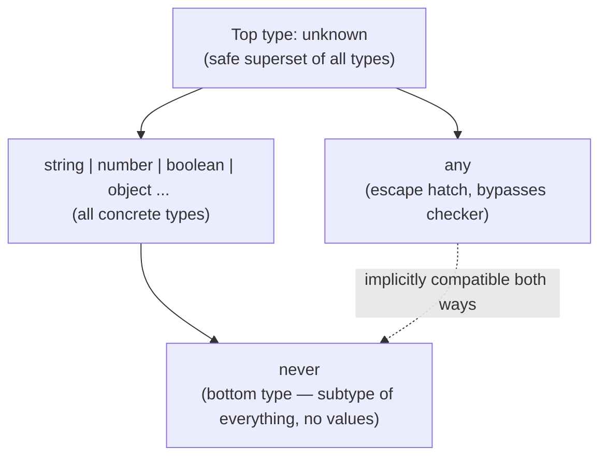
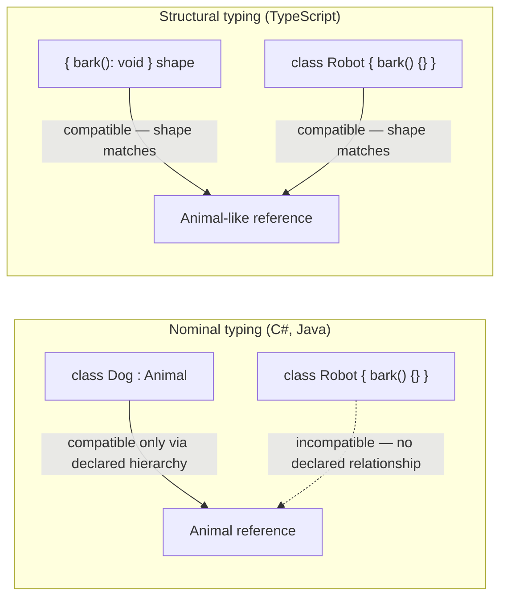
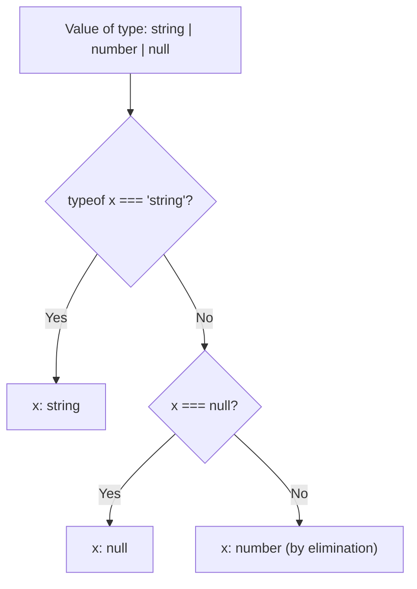

# TypeScript Interview Guide (Senior / Lead Level)

> Consolidated from personal notes + gap-filled for senior .NET full-stack / Angular interviews (2026).
> Sections and headings marked **[new content]** were added during consolidation to cover topics the source notes were missing or treated too thinly for a senior-level bar. Everything else is reorganized/expanded from the original notes — no original technically-correct content was deleted.

## Table of Contents

1. [Core Concepts](#core-concepts)
   - [What is TypeScript and Why Use It](#what-is-typescript-and-why-use-it)
   - [Toolchain Basics](#toolchain-basics)
   - [Primitive & Special Types](#primitive--special-types)
   - [any vs unknown vs never vs void](#any-vs-unknown-vs-never-vs-void-new-content)
   - [Type Inference vs Type Annotation](#type-inference-vs-type-annotation)
   - [Type Assertions](#type-assertions)
   - [Type Aliases vs Interfaces](#type-aliases-vs-interfaces)
   - [Optional & Readonly Properties](#optional--readonly-properties)
   - [Function & Method Overloading](#function--method-overloading)
2. [Intermediate](#intermediate)
   - [Functions: Regular vs Arrow, Default & Rest Params](#functions-regular-vs-arrow-default--rest-params)
   - [Union, Intersection & Literal Types](#union-intersection--literal-types)
   - [Tuples](#tuples)
   - [[gaps] ReadonlyArray\<T\> / readonly T[] as Defensive API Design](#gaps-readonlyarrayt--readonly-t-as-defensive-api-design)
   - [Enums, and Why Senior Devs Avoid Them](#enums-and-why-senior-devs-avoid-them-new-content)
   - [Structural Typing vs Nominal Typing](#structural-typing-vs-nominal-typing-new-content)
   - [[gaps] Branded/Nominal Typing — Full Worked Example](#gaps-brandednominal-typing--full-worked-example)
   - [Type Narrowing & Type Guards](#type-narrowing--type-guards)
   - [Discriminated Unions & Exhaustiveness Checking](#discriminated-unions--exhaustiveness-checking)
   - [Optional Chaining & Nullish Coalescing](#optional-chaining--nullish-coalescing)
   - [strictNullChecks and the strict Family of Flags](#strictnullchecks-and-the-strict-family-of-flags-new-content)
3. [Advanced (Generics & the Type System)](#advanced-generics--the-type-system)
   - [Generics & Generic Constraints](#generics--generic-constraints)
   - [Generic Variance (Covariance/Contravariance)](#generic-variance-covariancecontravariance-new-content)
   - [keyof, typeof, and Indexed Access Types](#keyof-typeof-and-indexed-access-types)
   - [Mapped Types](#mapped-types)
   - [Conditional Types & infer](#conditional-types--infer)
   - [Template Literal Types](#template-literal-types)
   - [[gaps] Recursive Type Alias Depth Limits (TS2589)](#gaps-recursive-type-alias-depth-limits-ts2589)
   - [Utility Types Deep Dive](#utility-types-deep-dive)
   - [as const and satisfies](#as-const-and-satisfies)
   - [Ambient Declarations, Triple-Slash Directives, Module Augmentation & Declaration Merging](#ambient-declarations-triple-slash-directives-module-augmentation--declaration-merging)
   - [Decorators & Metadata (Angular Relevance)](#decorators--metadata-angular-relevance-new-content)
   - [Module Resolution: ESM vs CommonJS](#module-resolution-esm-vs-commonjs-new-content)
4. [Object-Oriented Programming in TypeScript](#object-oriented-programming-in-typescript)
   - [Access Modifiers](#access-modifiers)
   - [Inheritance, Overriding, super](#inheritance-overriding-super)
   - [Abstract Classes vs Interfaces](#abstract-classes-vs-interfaces)
   - [Multiple Interface Implementation & Interface Extension](#multiple-interface-implementation--interface-extension)
   - [Mixins](#mixins)
   - [Private Constructors & Singletons](#private-constructors--singletons)
   - [Index Signatures](#index-signatures)
   - [The this Type & Polymorphism](#the-this-type--polymorphism)
   - [Parameter Properties Shorthand](#parameter-properties-shorthand-new-content)
5. [Error Handling](#error-handling)
   - [try/catch/finally & Custom Errors](#trycatchfinally--custom-errors)
   - [Typed Catch Clauses (unknown in catch)](#typed-catch-clauses-unknown-in-catch-new-content)
6. [Performance](#performance)
   - [[new content] Compiler Performance & Type-Checking Cost](#new-content-compiler-performance--type-checking-cost)
   - [[new content] Runtime Performance: Erasure, Enums, and Bundle Size](#new-content-runtime-performance-erasure-enums-and-bundle-size)
7. [Best Practices](#best-practices)
8. [Common Pitfalls](#common-pitfalls)
9. [Sample Interview Q&A](#sample-interview-qa)
10. [Summary of Additions](#summary-of-additions)
11. [Summary of [gaps] Additions (This Pass)](#summary-of-gaps-additions-this-pass)

---

## Core Concepts

### What is TypeScript and Why Use It

TypeScript is a strongly, statically typed superset of JavaScript developed by Microsoft that compiles ("transpiles") to plain JavaScript. It adds a structural type system on top of JS semantics without changing runtime behavior — types are erased at compile time.

Advantages commonly cited (and worth defending with a "why" at senior level):

- **Static typing** → catches an entire class of bugs (wrong property names, wrong argument shapes, null/undefined misuse) at compile time instead of production.
- **OOP features** → classes, interfaces, generics, access modifiers — useful for enterprise codebases, though TS's type system is structural, not classical OOP nominal typing (see below).
- **Scalability** → refactoring a 500-file Angular app without types is a nightmare; TS makes rename/extract-method refactors mechanically safe (compiler flags every break).
- **DX** → IntelliSense, inline documentation, "go to definition," safe auto-refactors.
- **Self-documenting APIs** → function signatures communicate contract without reading the implementation.

Senior-level nuance interviewers probe for: TypeScript's type system is **unsound by design** in several places (e.g., `any`, type assertions, array index access without `noUncheckedIndexedAccess`, bivariant method parameters) as a pragmatic trade-off to stay compatible with JS. Be ready to say *where* it's unsound and how to tighten it.

### Toolchain Basics

- Install: `npm install -g typescript`
- Check version: `tsc -v`
- Compile a file: `tsc filename.ts` → emits `filename.js`
- `tsconfig.json` — central compiler configuration file. Example:

```json
{
  "compilerOptions": {
    "target": "ES6",
    "strict": true
  }
}
```

**[new content] `tsconfig.json` in real projects.** In production Angular/Node codebases you'll typically see far more than `target`/`strict`:

```json
{
  "compilerOptions": {
    "target": "ES2022",
    "module": "ESNext",
    "moduleResolution": "Bundler",
    "lib": ["ES2022", "DOM"],
    "strict": true,
    "noUncheckedIndexedAccess": true,
    "exactOptionalPropertyTypes": true,
    "esModuleInterop": true,
    "skipLibCheck": true,
    "isolatedModules": true,
    "forceConsistentCasingInFileNames": true,
    "declaration": true,
    "sourceMap": true
  }
}
```

An interviewer at senior level expects you to know *why* each strict flag matters, not just that `strict: true` exists — see [strictNullChecks and the strict Family of Flags](#strictnullchecks-and-the-strict-family-of-flags-new-content) below.

### Primitive & Special Types

Primitives: `string`, `number`, `boolean`, `null`, `undefined`, `bigint`, `symbol`.

Special types: `any` (disables type checking), `unknown` (type-safe counterpart to `any`), `void` (function returns nothing), `never` (function never returns / a value that can't exist).

### any vs unknown vs never vs void [new content]

The original notes only compared `any` vs `unknown` in a two-row table. This is one of the most common senior TS interview questions and deserves the full four-way comparison, since candidates are often asked to place `void` and `never` in the same mental model.

| Type | Meaning | Assignable **to** other types? | Assignable **from** other types? | Typical use |
|---|---|---|---|---|
| `any` | "Turn off the type checker" | Yes, to anything | Yes, from anything | Legacy JS interop, last resort |
| `unknown` | "Could be anything, prove it before use" | No (without narrowing/assertion) | Yes, from anything | External/untrusted input (API responses, `JSON.parse`, catch blocks) |
| `void` | "No meaningful return value" | Only to `void`/`any`/`undefined` (loosely) | N/A (return position) | Callback/function return type |
| `never` | "This code path is unreachable / no value can satisfy this type" | Assignable to everything (bottom type) | Nothing is assignable to it except `never` itself | Exhaustiveness checks, functions that always throw/loop forever |



Key gotcha: `any` is both a top type and a bottom type simultaneously (it breaks type theory on purpose) — that's precisely why it's dangerous and `unknown` was introduced in TS 3.0 as the type-safe alternative. Expect the follow-up: *"Why does `unknown` exist when we already have `any`?"* — answer: `unknown` forces narrowing before any operation is allowed, preserving soundness while still allowing "I don't know this type yet" at the boundary of your program (I/O boundaries).

### Type Inference vs Type Annotation

Inference: `let message = "Hello";` → TS infers `string`.
Annotation: `let age: number = 25;` → type stated explicitly.

Senior nuance: prefer inference for local variables (less noise, same safety) and explicit annotations at **module boundaries** — function parameters, exported function return types, public class members — because inference at a boundary can silently widen/narrow types as the implementation changes, breaking consumers without a visible signal.

### Type Assertions

```typescript
let someValue: any = "Hello";
let strLength: number = (someValue as string).length;
```

Assertions (`as`) tell the compiler "trust me," performing zero runtime validation. Double assertion via `as unknown as T` sidesteps even TS's assertion-compatibility check — a common code-smell red flag interviewers listen for. Prefer type guards or validation libraries (`zod`, `io-ts`) over assertions whenever data crosses a runtime boundary (HTTP response, `localStorage`, third-party lib).

### Type Aliases vs Interfaces

| Feature | Interface | Type Alias |
|---|---|---|
| Extending | `extends` keyword, supports multiple inheritance | Achieved via intersection (`&`), not `extends` |
| Declaration merging | Yes — multiple `interface X {}` blocks merge | No |
| Object shapes | Yes | Yes |
| Unions/primitives/tuples | No | Yes — `type T = string \| number` |
| Mapped/conditional types | No | Yes |
| Performance (large unions) | Generally faster to check (verify) | Can be slower for huge unions per TS team guidance (verify against current version) |

**Correcting an imprecision in the original notes:** the notes state type aliases are "not extendable" — that's *directionally* true (no `extends` keyword) but misleading, because you can compose type aliases via intersections (`type C = A & B`) to get equivalent, sometimes more flexible, composition. The practical senior answer: use `interface` for public object/class contracts you expect to be extended or merged (e.g., Angular component `@Input` bags, DTOs); use `type` for unions, tuples, function signatures, and mapped/conditional type utilities. Both are structurally compatible with each other — an `interface` can extend a `type` alias and vice versa (as shown in original Q76 — interface extending a class — and Q69).

### Optional & Readonly Properties

```typescript
interface Employee {
  name: string;
  age?: number;       // optional
}

interface Car {
  readonly model: string;   // cannot be reassigned after creation
}
```

Gotcha: `readonly` is shallow — `readonly` on an object property only prevents *rebinding* the property, not mutating a nested object/array it points to. Use `Readonly<T>` / `DeepReadonly` (custom recursive mapped type) if you need deep immutability, or reach for a library like Immutable.js / immer for real immutable data structures at scale.

### Function & Method Overloading

```typescript
function add(a: number, b: number): number;
function add(a: string, b: string): string;
function add(a: any, b: any) {
  return a + b;
}
console.log(add(1, 2));               // 3
console.log(add("Hello, ", "World!")); // Hello, World!
```

TS overloads are purely a compile-time construct — there is one real JS function underneath (the "implementation signature," which itself is not visible to callers). This differs fundamentally from C#, where overloads are genuinely distinct methods resolved at compile time by the CLR/runtime binder — a good bridge point to mention given the .NET background: in TS you're describing *call-site shapes* for a single implementation, not creating multiple methods.

---

## Intermediate

### Functions: Regular vs Arrow, Default & Rest Params

| Feature | Regular Function | Arrow Function |
|---|---|---|
| `this` binding | Dynamic (depends on caller) | Lexical (inherits from enclosing scope) |
| `arguments` object | Available | Not available |
| Use in classes | Preferred for methods you intend to override | Good for callbacks needing captured `this` (e.g. event handlers) |
| Hoisting | Function declarations hoist | Arrow functions (as `const`) do not |
| `new`-able | Yes | No |

```typescript
function regular() { console.log(this); }
const arrow = () => console.log(this);
```

Default & rest parameters:

```typescript
function greet(name: string = "Guest") {
  console.log(`Hello, ${name}`);
}
greet(); // Hello, Guest

function sum(...numbers: number[]) {
  return numbers.reduce((acc, num) => acc + num, 0);
}
console.log(sum(1, 2, 3)); // 6
```

Angular-relevant gotcha: arrow-function class properties (`onClick = () => {...}`) bind `this` correctly for template event bindings but create a **new function per instance** (memory/perf cost at scale, and breaks `@HostListener`/decorator-based method binding which needs a real prototype method).

### Union, Intersection & Literal Types

```typescript
let value: string | number;
value = "hello";
value = 42;

interface A { a: number; }
interface B { b: string; }
type C = A & B;
const obj: C = { a: 1, b: "text" };

type Direction = "North" | "South" | "East" | "West";
let move: Direction = "North";
```

Gotcha: intersecting two types with conflicting property types for the same key (e.g. `{ a: string } & { a: number }`) collapses that property to `never`, not an error — a classic "gotcha" question.

### Tuples

```typescript
let person: [string, number] = ["Alice", 25];

let numbers: readonly [number, number] = [10, 20];
// numbers[0] = 30; // Error
```

**[new content] Labeled tuples & variadic tuples.** Modern TS supports labeled tuple elements (pure documentation, no runtime effect) and variadic tuples for generic function typing:

```typescript
type Point = [x: number, y: number];

// Variadic tuple — used heavily in typed `bind`/`curry` utility libraries
type Concat<T extends unknown[], U extends unknown[]> = [...T, ...U];
type Result = Concat<[1, 2], [3, 4]>; // [1, 2, 3, 4]
```

### [gaps] ReadonlyArray\<T\> / readonly T[] as Defensive API Design

Not covered in the existing notes — this is a small, concrete pattern that comes up constantly in senior code review discussions ("how do you communicate that a function won't mutate what you pass it?").

**The problem:** a plain `T[]` parameter type says nothing about whether the function might mutate the array you hand it. Callers have to read the implementation (or trust the docs) to know if it's safe to pass a live, shared array reference:

```typescript
function printTotal(prices: number[]): number {
  prices.sort((a, b) => a - b); // legal, but mutates the CALLER's array — a real bug class
  return prices.reduce((sum, p) => sum + p, 0);
}

const cart = [30, 10, 20];
printTotal(cart);
console.log(cart); // [10, 20, 30] — surprised? the caller's array was silently reordered
```

**The fix — accept `readonly T[]` (equivalently `ReadonlyArray<T>`) instead of `T[]`:**

```typescript
function printTotal(prices: readonly number[]): number {
  // prices.sort(...);   // Compile error: Property 'sort' does not exist on type
                          // 'readonly number[]' — mutating methods are removed from the type entirely.
  // prices.push(5);     // Compile error, same reason.
  return [...prices].sort((a, b) => a - b).reduce((sum, p) => sum + p, 0); // copy first, mutate the copy
}
```

`readonly T[]`/`ReadonlyArray<T>` are two equivalent spellings of the same type (`ReadonlyArray<T>` is the generic-interface form; `readonly T[]` is shorthand syntax) — this type simply **omits** every mutating array method (`push`, `pop`, `splice`, `sort`, `reverse`, `fill`, `copyWithin`, index-assignment via `arr[0] = x`) from the type's member list. It's not a runtime-enforced immutability wrapper (there's no `Object.freeze` involved) — it's a **compile-time-only contract**: the compiler simply won't let you call a mutating method on something typed `readonly T[]`, and a regular mutable `T[]` is freely assignable *into* a `readonly T[]`-typed parameter (but not the other way around without a cast/copy), which is exactly the direction you want for a defensive parameter type.

```typescript
const mutable: number[] = [1, 2, 3];
const ro: readonly number[] = mutable;   // OK — a mutable array satisfies the readonly contract
// mutable = ro;                          // Compile error — readonly array is not assignable back to T[]
```

**Why this is a senior-level API design signal, not just a syntax fact:**
- It documents intent **in the signature itself**, enforced by the compiler, instead of in a comment nobody reads or trusts. This is the same instinct behind preferring immutable update patterns in Angular/NgRx/React — communicate "I won't mutate this" as a type-level guarantee, not a convention.
- It's a good complement to `OnPush`/immutable-state patterns generally: a function typed to accept `readonly T[]` is guaranteed (at compile time) not to be the source of an accidental in-place mutation that would silently defeat reference-equality change detection elsewhere in the app.
- Interviewers sometimes probe the boundary case: `readonly T[]` is **shallow**, exactly like `Readonly<T>` on objects — `readonly Point[]` prevents `arr.push(...)`/`arr[0] = ...`, but does **not** prevent `arr[0].x = 5` if `Point` itself isn't readonly. Deep immutability needs `ReadonlyArray<Readonly<Point>>` (or a recursive `DeepReadonly<T>` utility) if that matters.
- `Array.prototype.map`/`filter`/`slice`/`reduce` are all still callable on a `readonly T[]` since they don't mutate the source array — only the genuinely mutating methods are excluded, so this pattern doesn't limit legitimate read-only/derive-a-new-array usage at all.

### Enums, and Why Senior Devs Avoid Them [new content]

The original notes introduce enums (`enum Color { Red, Green, Blue }`) without discussing their well-known downsides — a common senior-level gap.

```typescript
enum Color { Red, Green, Blue }
let c: Color = Color.Green;
```

Problems senior interviewers expect you to raise:

- Numeric enums are **not type-safe against arbitrary numbers** — `let c: Color = 99` compiles unless you use `const enum` with `--strict`... actually any `number` is assignable to a numeric enum type, defeating the purpose.
- Enums generate real runtime JS objects (reverse-mapping objects), adding to bundle size, unless declared `const enum` (which inlines values at compile time — but `const enum` is unsupported under `isolatedModules`, which is required for modern bundlers like esbuild/swc/Vite, and is banned entirely for ESM-only builds — a real gotcha in current Angular/Vite-based tooling).
- They don't tree-shake as cleanly as literal unions.

**Modern idiomatic replacement:** literal union types (+ optionally a `satisfies`-checked object map for the value list):

```typescript
type Color = "red" | "green" | "blue";

const ColorValues = {
  Red: "red",
  Green: "green",
  Blue: "blue",
} as const satisfies Record<string, Color>;
```

This gives exhaustiveness checking, zero runtime cost, and full type safety — most senior TS style guides (including Angular's internal conventions in recent versions) now recommend literal unions over enums for new code.

### Structural Typing vs Nominal Typing [new content]

This is arguably *the* most-asked "coming from C#/Java" conceptual question and was entirely absent from the source notes.

- **C#/Java are nominally typed**: two classes with identical members are still incompatible unless one explicitly implements/extends the other. Type identity is based on the *declared name*.
- **TypeScript is structurally typed** (duck typing, enforced at compile time): two types are compatible if their *shapes* match, regardless of name or declared relationship.

```typescript
interface Point2D { x: number; y: number; }
class Vector { x = 0; y = 0; }

function log(p: Point2D) { console.log(p.x, p.y); }

log(new Vector());          // OK — Vector has the same shape as Point2D
log({ x: 1, y: 2 });         // OK — plain object literal matches structurally
```



Practical consequences to mention:

- Excess property checks only fire on **object literals** assigned directly, not on variables — `log({x:1,y:2,z:3})` errors ("z does not exist"), but `const p = {x:1,y:2,z:3}; log(p);` compiles fine, because `p` is checked structurally (assignability), not via the stricter literal-freshness check. Frequently-asked gotcha.
- Private/protected members in TS **do** participate in a nominal-ish check (two classes with identically-named private members from *different* class declarations are NOT considered structurally compatible) — a deliberate exception to pure structural typing.
- `unique symbol` and branded/"tagged" types (`type UserId = string & { __brand: "UserId" }`) are the idiomatic way to *simulate* nominal typing in TS when you need to prevent accidental mixing of two structurally-identical types (e.g., `UserId` vs `OrderId`, both `string` underneath).

### [gaps] Branded/Nominal Typing — Full Worked Example

The section above introduces the branded-type one-liner but stops short of a usable pattern. This is worth having ready as a complete, senior-level answer, since "show me how you'd actually use this" is the natural follow-up once a candidate name-drops branded types.

**The problem:** `UserId` and `OrderId` are both plain `string`s at the type level. Structural typing means TypeScript happily lets you pass one where the other is expected — nothing stops this bug from compiling cleanly:

```typescript
type UserId = string;
type OrderId = string;

function getUser(id: UserId) { /* ... */ }

const orderId: OrderId = "ord_123";
getUser(orderId); // compiles! — silently wrong, no error, no warning
```

**The fix — a branded (tagged) type plus a constructor function:**

```typescript
// The brand is a phantom property that never exists at runtime — it exists
// purely to make the type checker treat this string as "not just any string."
type UserId = string & { readonly __brand: 'UserId' };
type OrderId = string & { readonly __brand: 'OrderId' };

// Constructor functions are the ONLY sanctioned way to produce a branded value.
// This is where you'd put real validation (format checks, UUID validation, etc.)
function toUserId(raw: string): UserId {
  if (!raw) throw new Error('UserId cannot be empty');
  return raw as UserId; // the one, deliberate, encapsulated assertion in the codebase
}

function toOrderId(raw: string): OrderId {
  if (!raw) throw new Error('OrderId cannot be empty');
  return raw as OrderId;
}

function getUser(id: UserId): void {
  console.log('Fetching user', id);
}

const userId = toUserId('usr_123');
const orderId = toOrderId('ord_456');

getUser(userId);   // OK
getUser(orderId);  // Compile error: Argument of type 'OrderId' is not assignable to parameter of type 'UserId'.
                    // Type '{ __brand: "OrderId"; }' is not assignable to type '{ __brand: "UserId"; }'.
getUser('usr_789'); // Compile error too — a raw string isn't a UserId; must go through toUserId()
```

**Why this works:** the intersection `string & { readonly __brand: 'UserId' }` adds a property (`__brand`) that no real string literal or `string`-typed value actually has, so the *only* way to produce a value of type `UserId` is via an explicit assertion — which you deliberately confine to one constructor function per branded type. Every other part of the codebase can only obtain a `UserId` by calling `toUserId()`, so the brand effectively becomes "proof this value was validated/constructed correctly," not just "proof it's the right primitive." The `__brand` property is **erased at runtime** (types don't exist post-compilation) — it costs nothing in bundle size or runtime performance, it's a pure compile-time-only safety net.

**Why this matters for a senior interview:** this is the practical answer to "how do you prevent primitive obsession bugs in TypeScript" — passing a `CustomerId` where a `ProductId` is expected, or a value in cents where dollars are expected, are real production bug classes that plain `string`/`number` types cannot catch, but branded types can, entirely at compile time with zero runtime cost. It's also a good bridge to the .NET background: this is TypeScript's structural-typing workaround for something C#'s nominal type system (distinct `UserId`/`OrderId` value types or structs) gives you for free — TS needs branding specifically *because* it's structurally typed.

**A common variant worth mentioning:** using a `unique symbol` instead of a string literal for the brand key avoids any accidental collision between two unrelated brands that happen to use the same literal tag name across different modules:

```typescript
declare const userIdBrand: unique symbol;
type UserId = string & { readonly [userIdBrand]: void };
```

This is marginally more robust in large codebases with many branded types authored by different teams, at the cost of being slightly less readable/discoverable than a plain string literal brand — either is an acceptable senior-level answer.

### Type Narrowing & Type Guards

```typescript
function isString(value: any): value is string {
  return typeof value === "string";
}

function example(val: string | number) {
  if (isString(val)) {
    console.log(val.toUpperCase()); // narrowed to string
  } else {
    console.log(val.toFixed(2));    // narrowed to number
  }
}
```

**[new content] The full narrowing toolkit.** The original notes cover only custom type predicates. Senior interviews expect fluency across *all* narrowing mechanisms:

| Mechanism | Example | Notes |
|---|---|---|
| `typeof` | `typeof x === "string"` | Doesn't distinguish `null` (`typeof null === "object"`) |
| `instanceof` | `x instanceof MyClass` | Only works for class instances, not plain object shapes |
| `in` operator | `"prop" in obj` | Narrows union of object types by presence of a key |
| Truthiness | `if (x) {...}` | Narrows out `null`/`undefined`/`0`/`""`/`NaN` — but be careful narrowing away legitimate `0`/`""` values |
| Equality narrowing | `if (x === "a") {...}` | Narrows literal unions |
| Discriminant property | `if (shape.kind === "circle")` | See discriminated unions below |
| User-defined type predicate | `function isFoo(x): x is Foo` | Only mechanism for custom runtime validation logic |
| Assertion functions | `function assertIsString(x): asserts x is string` | Narrows for the *rest of the enclosing scope* after the call, unlike predicates which narrow only inside a conditional |



Assertion functions are the one narrowing mechanism most senior candidates forget:

```typescript
function assertIsDefined<T>(val: T): asserts val is NonNullable<T> {
  if (val === undefined || val === null) {
    throw new Error("Expected value to be defined");
  }
}

function process(input?: string) {
  assertIsDefined(input);
  console.log(input.toUpperCase()); // input narrowed to string for the rest of the function
}
```

### Discriminated Unions & Exhaustiveness Checking

```typescript
interface Square { kind: "square"; size: number; }
interface Circle { kind: "circle"; radius: number; }
type Shape = Square | Circle;

function area(shape: Shape): number {
  switch (shape.kind) {
    case "square":
      return shape.size * shape.size;
    case "circle":
      return Math.PI * shape.radius * shape.radius;
  }
}
```

**[new content] Exhaustiveness checking.** The original example is missing the single most important senior-level follow-up: *what happens when someone adds a `Triangle` variant and forgets to update `area()`?* Without exhaustiveness checking, this compiles silently and returns `undefined` at runtime. The idiomatic fix is the `never`-based exhaustiveness guard:

```typescript
interface Triangle { kind: "triangle"; base: number; height: number; }
type Shape = Square | Circle | Triangle;

function area(shape: Shape): number {
  switch (shape.kind) {
    case "square":
      return shape.size * shape.size;
    case "circle":
      return Math.PI * shape.radius * shape.radius;
    case "triangle":
      return (shape.base * shape.height) / 2;
    default:
      // If a case is missing above, `shape` here is NOT `never`,
      // so this line fails to compile — catching the bug at build time.
      const _exhaustiveCheck: never = shape;
      return _exhaustiveCheck;
  }
}
```

This pattern (discriminated union + `never` exhaustiveness check) is a top-tier signal of TS seniority — it's frequently asked as "how do you make sure adding a new case doesn't get missed?"

### Optional Chaining & Nullish Coalescing

```typescript
const obj = { user: { profile: { name: "John" } } };
console.log(obj.user?.profile?.name);   // John
console.log(obj.user?.address?.city);   // undefined

let name: string | null = null;
console.log(name ?? "Default Name"); // "Default Name"
```

Gotcha: `??` differs from `||` — `0`, `""`, and `false` are valid values under `??` but get incorrectly replaced by `||`. This is a classic bug when migrating older `||`-based default logic to TS without re-auditing for falsy-but-valid values.

### strictNullChecks and the strict Family of Flags [new content]

The original notes mention enabling `strictNullChecks` in one line without explaining impact — this is one of the highest-value senior topics since it governs how much of `strict: true` you actually get.

`strict: true` is a bundle flag that turns on (at minimum, current stable TS):

| Flag | Effect | Real-world impact |
|---|---|---|
| `strictNullChecks` | `null`/`undefined` are not part of every type by default | Single biggest bug-catcher; forces explicit `T \| null` and narrowing before use |
| `noImplicitAny` | Errors on inferred `any` | Prevents silent type-safety holes, especially on untyped function params |
| `strictFunctionTypes` | Function parameters checked contravariantly | Prevents unsound function assignment (see variance section) |
| `strictBindCallApply` | `.bind`/`.call`/`.apply` are type-checked against the function signature | Catches wrong-arg-count/type bugs on these rarely-typed-safe APIs |
| `strictPropertyInitialization` | Class properties must be initialized in the constructor or explicitly allow `undefined` | Very common Angular pain point — DI-populated fields need `!` (definite assignment assertion) or constructor initialization |
| `noImplicitThis` | Errors when `this` has an implicit `any` type | Relevant to regular functions used as callbacks |
| `alwaysStrict` | Emits `"use strict"` and parses in strict JS mode | Mostly invisible day-to-day |
| `useUnknownInCatchVariables` (default on under `strict` since TS 4.4) | `catch (e)` is typed `unknown`, not `any` | Forces safe error handling — see Error Handling section |

Flags **not** included in `strict` but essential in real senior-grade configs:

- `noUncheckedIndexedAccess` — makes `arr[i]` and `record[key]` return `T | undefined` instead of `T`, closing a huge structural-typing hole (index signatures otherwise lie about guaranteed presence).
- `exactOptionalPropertyTypes` — distinguishes `{ x?: string }` (key may be absent) from `{ x?: string | undefined }` (key may be present with value `undefined`) — subtle but matters for exact API contracts.
- `noUnusedLocals` / `noUnusedParameters` — hygiene, not safety.
- `noFallthroughCasesInSwitch` — catches missing `break`/`return` in `switch`.

Interviewers will often ask: *"Your team disabled `strictNullChecks` to unblock a migration — what do you lose?"* Answer: you lose compile-time guarantees on every nullable path in the app; every `.foo` access on a possibly-null value becomes a latent `TypeError`, and third-party `.d.ts` files that assume `strictNullChecks` (most modern ones do) may produce incorrect inference in your codebase.

---

## Advanced (Generics & the Type System)

### Generics & Generic Constraints

```typescript
function identity<T>(arg: T): T {
  return arg;
}
console.log(identity<string>("Hello")); // Hello

function printLength<T extends { length: number }>(arg: T) {
  console.log(arg.length);
}
printLength("Hello"); // 5
```

**[new content] Generic defaults and multiple type parameters with constraints referencing each other** — common in real code (e.g., typed reducers, typed HTTP clients):

```typescript
function get<T, K extends keyof T = keyof T>(obj: T, key: K): T[K] {
  return obj[key];
}
```

### Generic Variance (Covariance/Contravariance) [new content]

Not present at all in the source notes, and a strong signal of senior-level type-system depth — especially valuable to a .NET dev who already knows `in`/`out` variance annotations from C# generics (`IEnumerable<out T>`, `IComparer<in T>`).

- **Covariance**: if `Dog` is a subtype of `Animal`, is `Dog[]` a subtype of `Animal[]`? TypeScript says **yes** for arrays and return positions — this is technically **unsound** (you could push a `Cat` into what the compiler thinks is a `Dog[]` through an `Animal[]`-typed reference) but pragmatic, matching real-world JS usage.
- **Contravariance**: function *parameter* types should narrow safely in the opposite direction. Under `strictFunctionTypes`, method parameters are checked contravariantly for standalone function types, catching the unsound case:

```typescript
type AnimalHandler = (a: Animal) => void;
type DogHandler = (d: Dog) => void;

let handler: AnimalHandler;
let dogHandler: DogHandler = (d) => console.log(d.bark());

// Without strictFunctionTypes this incorrectly compiles:
// handler = dogHandler; // unsound: handler could now be called with a Cat
```

Note the well-known TS quirk (verify against current version, historically true): **method syntax** (`interface X { fn(a: Animal): void }`) is checked *bivariantly* even under `strictFunctionTypes` for backward-compatibility reasons, while **property syntax with a function type** (`interface X { fn: (a: Animal) => void }`) is checked contravariantly (strictly). This is a genuinely obscure but real "gotcha" senior interviewers use to separate deep TS knowledge from surface knowledge.

Unlike C#, TypeScript has **no explicit `in`/`out` variance annotations on user generics** (as of the versions widely deployed at the time of writing — verify current spec status; there has been active TC39/TS proposal discussion on explicit variance annotations for generics). Variance in TS generics is *inferred structurally* from how the type parameter is used inside the type, not declared explicitly.

### keyof, typeof, and Indexed Access Types

```typescript
type User = { id: number; name: string };
type UserKeys = keyof User; // "id" | "name"

let person = { name: "Alice", age: 25 };
type PersonType = typeof person;
```

**[new content] Indexed access types** (`T[K]`) are the natural complement to `keyof` and were missing from the source notes despite being used implicitly in the `infer`/`ReturnType` examples:

```typescript
type User = { id: number; name: string; address: { city: string } };
type NameType = User["name"];              // string
type CityType = User["address"]["city"];   // string
type AllValues = User[keyof User];         // number | string | { city: string }
```

### Mapped Types

```typescript
type ReadonlyUser = { readonly [K in keyof User]: User[K] };
```

**[new content] Key remapping with `as` and modifiers (`+`/`-`)** — introduced in TS 4.1+, absent from the notes:

```typescript
// Strip readonly/optional modifiers
type Mutable<T> = { -readonly [K in keyof T]-?: T[K] };

// Remap keys entirely — e.g., build getter names from property names
type Getters<T> = {
  [K in keyof T as `get${Capitalize<string & K>}`]: () => T[K];
};

interface Person { name: string; age: number; }
type PersonGetters = Getters<Person>;
// { getName: () => string; getAge: () => number }
```

### Conditional Types & infer

```typescript
type IsString<T> = T extends string ? "yes" : "no";
type Test = IsString<number>; // "no"

type ReturnTypeOf<T> = T extends (...args: any[]) => infer R ? R : never;

function getName(): string { return "Alice"; }
type NameType = ReturnTypeOf<typeof getName>; // string
```

**[new content] Distributive conditional types over unions** — a frequently-tested subtlety: when a conditional type's checked type is a *naked* type parameter, TS distributes the conditional over each union member individually:

```typescript
type ToArray<T> = T extends any ? T[] : never;
type Result = ToArray<string | number>; // string[] | number[]  (distributed)

// Wrapping in a tuple opts out of distribution:
type ToArrayNonDist<T> = [T] extends [any] ? T[] : never;
type Result2 = ToArrayNonDist<string | number>; // (string | number)[]
```

This distributive behavior is *exactly* how built-in utility types like `Exclude`/`Extract`/`NonNullable` are implemented internally, so understanding it explains "why do these utility types work the way they do" at a mechanical level, not just by memorized effect.

### Template Literal Types

```typescript
type Greeting = `Hello, ${string}!`;
const greet: Greeting = "Hello, John!";
```

**[new content] Combining template literal types with union distribution and intrinsic string manipulation types** — this is the modern, practical use case (e.g., typed event names, typed CSS-in-JS keys, typed REST route params) that the one-line original example doesn't show:

```typescript
type EventName = "click" | "hover" | "focus";
type HandlerName = `on${Capitalize<EventName>}`;
// "onClick" | "onHover" | "onFocus"

// Intrinsic string manipulation types: Uppercase, Lowercase, Capitalize, Uncapitalize
type Loud = Uppercase<"hello">; // "HELLO"

// Extracting typed params from a route string (common in typed-router libraries)
type ExtractParams<T extends string> =
  T extends `${string}:${infer Param}/${infer Rest}`
    ? Param | ExtractParams<Rest>
    : T extends `${string}:${infer Param}`
      ? Param
      : never;

type Params = ExtractParams<"/users/:userId/posts/:postId">; // "userId" | "postId"
```

### [gaps] Recursive Type Alias Depth Limits (TS2589)

Not covered in the existing notes, but a real error every senior TS engineer eventually hits while writing exactly the kind of "clever" recursive types shown above (`ExtractParams`, `DeepPartial`, JSON-path types) — and being able to explain *why* it happens, not just "add a cast," is a genuine depth signal.

**A concrete trigger.** The TypeScript compiler evaluates conditional/recursive types by expanding them, and it has a hard internal recursion-depth limit (roughly ~50 levels of instantiation, though the exact number is an implementation detail that has shifted across releases) to protect against genuinely infinite type-level recursion. A naive recursive "increment" or "deep concatenation" type over a large or unbounded structure blows past that limit:

```typescript
// A naive recursive tuple-length-counter, called on something the compiler
// can't bound in advance:
type BuildTuple<N extends number, T extends unknown[] = []> =
  T['length'] extends N ? T : BuildTuple<N, [...T, unknown]>;

type Big = BuildTuple<10000>;
// error TS2589: Type instantiation is excessively deep and possibly infinite.
```

The same error shows up in more "realistic" code — most commonly a recursive `DeepPartial<T>`/`DeepReadonly<T>`-style mapped type applied to a large, self-referential, or circular domain model (e.g., an ORM entity graph where `Order` has `customer: Customer`, `Customer` has `orders: Order[]`), or a template-literal path-extraction type recursing over a very long string:

```typescript
interface Order { id: string; customer: Customer; }
interface Customer { id: string; orders: Order[]; } // circular reference

type DeepPartial<T> = T extends object
  ? { [K in keyof T]?: DeepPartial<T[K]> }
  : T;

type PartialOrder = DeepPartial<Order>;
// With a genuinely circular type graph and no depth guard, the compiler keeps
// expanding Order -> Customer -> Order -> Customer ... until it hits the
// recursion ceiling and raises TS2589 (behavior here also depends on TS version —
// modern TS has some circularity detection, but it's not a guarantee for every
// recursive-type shape, especially conditional types combined with mapped types).
```

**Why it happens, mechanically:** unlike a recursive *function*, which recurses at runtime and can theoretically run indefinitely (until a stack overflow), a recursive *type* has to be fully expanded by the compiler at type-checking time — there's no equivalent of "lazy evaluation" for most recursive type shapes. Each level of recursion is a real, materialized intermediate type the compiler tracks, so a type that's recursively unbounded (no clear terminating condition reachable in a small number of steps) either runs the compiler out of its depth budget (`TS2589`) or, in less bounded cases, can visibly slow down type-checking/IDE responsiveness even before hitting the hard error.

**How to restructure the type to avoid it:**

1. **Bound the recursion explicitly with a depth-limiting type parameter** — thread a decrementing counter (usually via a tuple-length trick, since TS has no native arithmetic on types) through the recursive type and bail out to a safe fallback once it's exhausted:

```typescript
type Prev = [never, 0, 1, 2, 3, 4, 5, 6, 7, 8, 9]; // lookup table simulating "N - 1"

type DeepPartialBounded<T, Depth extends number = 5> =
  Depth extends 0
    ? T
    : T extends object
      ? { [K in keyof T]?: DeepPartialBounded<T[K], Prev[Depth]> }
      : T;
```

This caps recursion at a fixed, safe depth (5 levels here) regardless of how deep or circular the actual input type is — the trade-off is that types nested deeper than the cap are no longer transformed (they pass through as-is), which is usually an acceptable trade-off since most real domain models don't need infinite type-level depth to be useful.

2. **Break circularity explicitly** — if the type graph is genuinely circular (like `Order`/`Customer` above), consider whether the *type* actually needs to walk the cycle at all; often the practical fix is to model the DTO/view-model shape you actually need (e.g., `OrderSummary` with a flat `customerId: string` instead of a nested `customer: Customer`) rather than deep-transforming the full circular domain graph.

3. **Prefer a small set of pre-built, well-tested utility types** (the built-in `Partial`/`Readonly`/`Pick`/etc., or a vetted library like `type-fest`'s `PartialDeep`) over hand-rolled unbounded recursive types where possible — these are already engineered around the depth-limit problem.

4. **Simplify the base case** — sometimes the real issue is a conditional type with a naked type parameter that's distributing over a large union unexpectedly (see the distributive conditional types note above); wrapping in a tuple (`[T] extends [U]`) to opt out of distribution can dramatically reduce the number of instantiations the compiler has to perform, sometimes resolving a `TS2589` without any depth-limiting machinery at all.

**Why this is worth knowing at senior level:** it's the direct, practical cost side of the "type-level programming" techniques covered elsewhere in this guide (conditional types, `infer`, mapped types, template literal recursion) — knowing how to use them isn't complete without knowing where they break down and how to keep them bounded, which is exactly the kind of trade-off awareness a lead-level interviewer is listening for versus someone who's only ever copy-pasted a recursive utility type from Stack Overflow.

### Utility Types Deep Dive

The source notes list `Partial`, `Required`, `Readonly`, `Pick`, `Omit`, `Record`, `NonNullable`, `Extract`, `Exclude`, `ReturnType`, `InstanceType`, `Parameters` — each explained twice with slightly different wording in two separate passes (Q32–40 and Q92–100/46–50). Consolidated below, de-duplicated, with how each is actually implemented (important senior detail: interviewers often ask you to *write* one of these from scratch).

| Utility | Effect | Simplified implementation |
|---|---|---|
| `Partial<T>` | All properties optional | `{ [K in keyof T]?: T[K] }` |
| `Required<T>` | All properties mandatory | `{ [K in keyof T]-?: T[K] }` |
| `Readonly<T>` | All properties readonly | `{ readonly [K in keyof T]: T[K] }` |
| `Pick<T, K>` | Select a subset of keys | `{ [P in K]: T[P] }` |
| `Omit<T, K>` | Remove a subset of keys | `Pick<T, Exclude<keyof T, K>>` |
| `Record<K, T>` | Build object type from key union + value type | `{ [P in K]: T }` |
| `NonNullable<T>` | Strip `null`/`undefined` | `T extends null \| undefined ? never : T` |
| `Extract<T, U>` | Keep union members assignable to `U` | `T extends U ? T : never` |
| `Exclude<T, U>` | Remove union members assignable to `U` | `T extends U ? never : T` |
| `ReturnType<T>` | Function's return type | `T extends (...args: any[]) => infer R ? R : never` |
| `Parameters<T>` | Function's parameter tuple | `T extends (...args: infer P) => any ? P : never` |
| `InstanceType<T>` | Instance type of a constructor | `T extends new (...args: any[]) => infer R ? R : any` |

```typescript
interface User { id: number; name: string; email: string; age?: number; }

type PartialUser  = Partial<User>;             // all optional
type RequiredUser = Required<User>;            // all required
type UserPreview  = Pick<User, "name" | "email">;
type UserNoEmail  = Omit<User, "email">;
type UserRoles    = Record<string, boolean>;

type Union       = string | number | boolean;
type OnlyNumbers = Extract<Union, number>;     // number
type NoBooleans  = Exclude<Union, boolean>;    // string | number

function greet(name: string): string { return `Hello, ${name}`; }
type GreetReturn = ReturnType<typeof greet>;   // string
type GreetParams = Parameters<typeof greet>;   // [string]

class Person { constructor(public name: string) {} }
type PersonInstance = InstanceType<typeof Person>; // Person
```

**[new content] Utility types the original notes omitted entirely** but that come up regularly in senior interviews:

```typescript
// Awaited<T> — unwraps nested Promise types (critical for async/await return typing since TS 4.5)
async function fetchUser(): Promise<User> { /* ... */ return {} as User; }
type FetchedUser = Awaited<ReturnType<typeof fetchUser>>; // User (not Promise<User>)

// Required deep utility isn't built in — a common "write this" interview task:
type DeepPartial<T> = T extends object
  ? { [K in keyof T]?: DeepPartial<T[K]> }
  : T;
```

### as const and satisfies

```typescript
const colors = ["red", "green", "blue"] as const;
// readonly ["red", "green", "blue"] — each element is a literal type, array is readonly

const person = {
  name: "Alice",
  age: 25,
} satisfies { name: string; age: number };
```

**[new content] Why `satisfies` matters and how it differs from a type annotation.** The original note states `satisfies` (TS 4.9) checks a value against a type "without changing its inferred type" but doesn't explain *why that's valuable* — this is the actual interview follow-up:

```typescript
// Type annotation WIDENS the variable to the annotated type — you lose literal info
const config1: Record<string, string | number> = { retries: 3, mode: "fast" };
config1.retries; // type: string | number  (widened — lost the fact it's specifically `number`)

// satisfies VALIDATES against the type but keeps the narrower inferred type
const config2 = { retries: 3, mode: "fast" } satisfies Record<string, string | number>;
config2.retries; // type: number  (preserved!)
```

`satisfies` gives you the best of both worlds: compile-time validation that the shape conforms to a contract, *and* the precise, narrow inferred literal types for downstream use (e.g., autocomplete on `config2.mode` narrows to `"fast"`, not `string`). This is now the idiomatic way to type constant config objects, replacing the older pattern of `as const` alone (no shape validation) or an annotation alone (loses literal narrowing).

### Ambient Declarations, Triple-Slash Directives, Module Augmentation & Declaration Merging

```typescript
// Ambient declaration (.d.ts)
declare function jQuery(selector: string): any;

// Triple-slash directive
/// <reference path="path/to/file.d.ts" />

// Module augmentation
declare module "some-library" {
  interface SomeInterface {
    newMethod(): void;
  }
}

// Declaration merging
interface Window { customProperty: string; }
interface Window { anotherProperty: number; }
// Merged Window now has both properties.
```

Senior nuance: triple-slash directives are largely legacy in modern module-based (ESM) TypeScript projects — they matter mainly for global/ambient `.d.ts` files (no imports/exports) and old-style script concatenation. Module augmentation is the correct modern approach for extending third-party module types (e.g., adding a custom property to Express's `Request` object in a Node/Angular Universal backend, or extending RxJS operators).

### Decorators & Metadata (Angular Relevance) [new content]

Completely absent from the source notes despite being core to Angular (`@Component`, `@Injectable`, `@Input`) — a must-know for a candidate who "also does Angular/TS frontend work."

Decorators are functions applied to classes/members/parameters at declaration time via the `@expression` syntax, enabling declarative metadata and behavior injection:

```typescript
function Log(target: any, propertyKey: string, descriptor: PropertyDescriptor) {
  const original = descriptor.value;
  descriptor.value = function (...args: any[]) {
    console.log(`Calling ${propertyKey} with`, args);
    return original.apply(this, args);
  };
  return descriptor;
}

class Calculator {
  @Log
  add(a: number, b: number) { return a + b; }
}
```

Key senior-level points:

- Angular relies on decorators (`@Component`, `@NgModule`, `@Injectable`, `@Input`, `@Output`) combined with **`reflect-metadata`** and TypeScript's `emitDecoratorMetadata`/`experimentalDecorators` compiler flags to implement its dependency-injection container — DI resolves constructor parameter types at runtime by reading emitted metadata, which is *why* Angular DI breaks silently if you use an interface (erased at compile time, no runtime metadata) as an injection token instead of a class or `InjectionToken`.
- **Standards track decorators** (Stage 3 TC39 proposal, shipped as the default in TypeScript 5.0+) have a **different runtime semantics** than the legacy `experimentalDecorators: true` model Angular has historically used (pre-Angular v16/Ivy-era metadata reflection nuances aside). This is a live migration concern: Angular has been moving toward standard decorators support, and mixing the two decorator models in one project causes real compile errors. If asked "what changed with TS 5.0 decorators," the answer is: new decorators are plain functions receiving `(value, context)` instead of `(target, key, descriptor)`, they don't rely on `reflect-metadata`, and they compose differently for class fields.
- Parameter decorators (`@Inject(TOKEN)`) and property decorators (`@Input()`) are common Angular patterns candidates should be able to explain are just sugar over `Object.defineProperty`/constructor parameter interception.

(verify exact current default decorator behavior against the TypeScript/Angular versions in use on your project, since this area has changed across recent major versions.)

### Module Resolution: ESM vs CommonJS [new content]

Not covered in the source notes at all, yet a very common source of real build failures senior candidates are expected to be able to diagnose.

| Aspect | CommonJS (CJS) | ES Modules (ESM) |
|---|---|---|
| Syntax | `require()` / `module.exports` | `import` / `export` |
| Loading | Synchronous, runtime-resolved | Static, analyzable at compile time (enables tree-shaking) |
| `this` at module top level | `module.exports` object | `undefined` |
| File extension signal (Node) | `.cjs` or `"type": "commonjs"` in package.json | `.mjs` or `"type": "module"` in package.json |
| Interop | N/A | `esModuleInterop`/`allowSyntheticDefaultImports` needed to import CJS packages cleanly |
| `tsconfig` setting | `"module": "CommonJS"` | `"module": "ESNext"` / `"NodeNext"` / `"Bundler"` |

Practical senior-level gotchas:

- `moduleResolution: "Bundler"` (TS 5.0+) vs `"NodeNext"` vs classic `"Node"` — pick `"Bundler"` for Angular/Vite/webpack frontend projects (lets the bundler handle resolution, supports `exports` map without Node's strict ESM rules), pick `"NodeNext"` for actual Node.js backend services that need to match Node's real runtime resolution algorithm (including mandatory file extensions in relative imports under real ESM).
- Tree-shaking (critical for Angular bundle size budgets) requires **static, analyzable ESM `import`/`export`** — dynamically computed `require()` calls or re-exporting through CommonJS defeats it, which is why library authors are pushed toward publishing dual ESM/CJS builds or ESM-only packages.
- Angular CLI (via esbuild since Angular 17+) expects ESM throughout the build graph; a transitive CommonJS dependency triggers the well-known `CommonJS or AMD dependencies can cause optimization bailouts` warning — a real-world issue worth mentioning if asked about build performance debugging.

---

## Object-Oriented Programming in TypeScript

### Access Modifiers

```typescript
class Person {
  public name: string;
  private age: number;
  protected address: string;

  constructor(name: string, age: number, address: string) {
    this.name = name;
    this.age = age;
    this.address = address;
  }
}
```

| Modifier | Access Scope |
|---|---|
| `public` (default) | Accessible anywhere |
| `private` | Only within the same class |
| `protected` | Within the class and subclasses |

```typescript
class Parent {
  protected greet() { console.log("Hello from Parent"); }
}
class Child extends Parent {
  public sayHello() { this.greet(); } // Allowed
}
```

Senior nuance vs C#: TS's `private`/`protected` are **compile-time only** — erased in the emitted JS, so at runtime any code can still access `instance["age"]` via bracket notation or `JSON.stringify` an instance to see private fields. If you need *true* runtime privacy, use native JS **private fields** (`#age`), which are enforced by the JS engine itself, not just the TS compiler:

```typescript
class Account {
  #balance = 0; // truly private at runtime, invisible even to Object.keys()
  deposit(amount: number) { this.#balance += amount; }
}
```

### Inheritance, Overriding, super

```typescript
class Animal {
  move() { console.log("Moving..."); }
}
class Dog extends Animal {
  bark() { console.log("Woof!"); }
}
const pet = new Dog();
pet.move(); // Moving...
pet.bark(); // Woof!

class Parent {
  greet() { console.log("Hello from Parent"); }
}
class Child extends Parent {
  greet() {
    super.greet();
    console.log("Hello from Child");
  }
}
```

**[new content] The `override` keyword (TS 4.3+).** Without it, renaming or removing a base-class method silently orphans the subclass "override" (it just becomes a new unrelated method) — a real-world refactoring bug class. Enable `noImplicitOverride` in `tsconfig.json` to force explicit `override` annotations:

```typescript
class Child extends Parent {
  override greet() { // compiler verifies Parent.greet actually exists
    super.greet();
  }
}
```

### Abstract Classes vs Interfaces

```typescript
abstract class Animal {
  abstract makeSound(): void;
  move() { console.log("Moving..."); }
}
interface Flyable {
  fly(): void;
}
```

| Feature | Abstract Class | Interface |
|---|---|---|
| Methods | Can have both concrete and abstract methods | Only signatures (no implementation) |
| Instantiation | Cannot be instantiated | Cannot be instantiated (not even a "type") |
| Properties | Can have properties with default values / initialization logic | Only property type definitions |
| Multiple inheritance | No (single class inheritance only) | Yes (`interface C extends A, B`) |
| Runtime existence | Yes — real JS class in emitted output | No — fully erased, zero runtime footprint |
| Constructors | Can have a constructor | Cannot |

Interview framing: choose an abstract class when subclasses share actual reusable implementation (template-method pattern); choose an interface for a pure contract, especially when multiple unrelated classes need to satisfy it (interfaces support structural, multiple "implementation" without the single-inheritance constraint).

### Multiple Interface Implementation & Interface Extension

```typescript
interface A { a: string; }
interface B { b: number; }
interface C extends A, B { c: boolean; }
const obj: C = { a: "hello", b: 42, c: true };

interface X { aMethod(): void; }
interface Y { bMethod(): void; }
class MyClass implements X, Y {
  aMethod() { console.log("A method"); }
  bMethod() { console.log("B method"); }
}

// An interface can even extend a class (extracting its public shape):
class AnimalBase { name: string = ""; }
interface Dog extends AnimalBase { breed: string; }
```

Gotcha worth flagging: `implements` only checks the **public** shape — it does not enforce that private members exist or behave a certain way, and it performs no runtime check at all (fully erased). Don't confuse `implements` (compile-time contract check) with actually delegating/inheriting behavior.

### Mixins

```typescript
function Mixin<T extends new (...args: any[]) => {}>(Base: T) {
  return class extends Base {
    mixinMethod() { console.log("Mixin method"); }
  };
}
class Person {}
const MixedPerson = Mixin(Person);
const instance = new MixedPerson();
instance.mixinMethod(); // Mixin method
```

Mixins are TS/JS's answer to the lack of multiple class inheritance — conceptually similar to C# extension methods or default interface methods, but implemented as class-factory functions layered at runtime, not a language feature.

### Private Constructors & Singletons

```typescript
class Singleton {
  private static instance: Singleton;
  private constructor() {}

  static getInstance() {
    if (!Singleton.instance) {
      Singleton.instance = new Singleton();
    }
    return Singleton.instance;
  }
}
const obj1 = Singleton.getInstance();
const obj2 = Singleton.getInstance();
console.log(obj1 === obj2); // true
```

Senior nuance: in Angular, prefer DI-scoped singletons (`@Injectable({ providedIn: 'root' })`) over the classic GoF singleton pattern shown above — Angular's injector already guarantees a single instance per injector scope, is testable (mockable via DI), and avoids the hidden global-state problems and hard-to-test static state that hand-rolled singletons introduce.

### Index Signatures

```typescript
interface Dictionary {
  [key: string]: string;
}
const translations: Dictionary = {
  hello: "hola",
  goodbye: "adiós",
};
```

Paired with `noUncheckedIndexedAccess` (see strict flags section): without it, `translations["missingKey"]` types as `string` even though it's actually `undefined` at runtime — a very common source of production `undefined.toUpperCase()`-style crashes that TS's default settings don't catch.

### The this Type & Polymorphism

```typescript
class Fluent {
  setName(name: string): this {
    console.log(name);
    return this;
  }
}
const obj = new Fluent().setName("John");

class Animal {
  speak() { console.log("Animal speaks"); }
}
class Dog extends Animal {
  speak() { console.log("Bark"); }
}
```

The `this` return type is what makes fluent/chainable builder APIs subclass-safe — a method returning `this` correctly returns the *subclass* type when called on a subclass instance, whereas returning the literal base class type would lose the subclass's additional members after chaining.

### Parameter Properties Shorthand [new content]

Missing from the source notes, but used implicitly in one example (`constructor(private radius: number)` in the abstract class section) without being explained — worth calling out explicitly since it's idiomatic TS/Angular/NestJS style and interviewers expect you to both use and explain it:

```typescript
class Circle {
  // Shorthand: declares AND assigns `radius` as a private field in one line
  constructor(private radius: number) {}

  area(): number {
    return Math.PI * this.radius * this.radius;
  }
}
```

This is pure syntax sugar — it's equivalent to declaring `private radius: number;` and doing `this.radius = radius;` in the constructor body, but is the dominant style in Angular/NestJS constructor-DI code (`constructor(private http: HttpClient, private router: Router) {}`).

---

## Error Handling

### try/catch/finally & Custom Errors

```typescript
try {
  throw new Error("Something went wrong!");
} catch (error) {
  console.log(error.message);
} finally {
  console.log("Cleanup operations");
}

class CustomError extends Error {
  constructor(message: string) {
    super(message);
    this.name = "CustomError";
  }
}
throw new CustomError("This is a custom error!");
```

Gotcha carried over from JS: subclassing `Error` in TS compiled to older JS targets (pre-ES2015 `target`, or certain transpilation setups) can break `instanceof` checks against the custom error class due to how ES5 downlevels class inheritance for built-ins — if targeting ES5, you historically needed `Object.setPrototypeOf(this, CustomError.prototype)` in the constructor as a workaround (verify whether still relevant for your target — modern `target: ES2015+` doesn't need this).

### Typed Catch Clauses (unknown in catch) [new content]

The original example types the caught `error` implicitly and accesses `.message` directly — this compiles today but is a real inaccuracy under a properly configured strict project, worth calling out because it's *exactly* the kind of subtlety senior interviewers probe.

Since TypeScript 4.4, under `strict` (specifically `useUnknownInCatchVariables`), `catch (error)` types `error` as `unknown`, not `any` — because JS allows `throw` of any value, not just `Error` instances (`throw "a string"`, `throw 42`, `throw { code: 500 }` are all valid). The senior-correct pattern:

```typescript
try {
  riskyOperation();
} catch (error: unknown) {
  if (error instanceof Error) {
    console.log(error.message); // safe — narrowed
  } else {
    console.log("Unknown error", error);
  }
}
```

For libraries/APIs that throw structured non-Error values (common with some HTTP clients), pair this with a type guard:

```typescript
interface ApiError { code: number; message: string; }
function isApiError(e: unknown): e is ApiError {
  return typeof e === "object" && e !== null && "code" in e && "message" in e;
}

try {
  await callApi();
} catch (error: unknown) {
  if (isApiError(error)) {
    console.error(`API error ${error.code}: ${error.message}`);
  } else if (error instanceof Error) {
    console.error(error.message);
  } else {
    console.error("Unexpected throw value", error);
  }
}
```

---

## Performance

### [new content] Compiler Performance & Type-Checking Cost

Not covered in source notes. Senior/lead-level interviews increasingly probe build-time performance since large Angular monorepos routinely hit multi-minute `tsc` times.

- **Project references** (`tsconfig` `references` + `composite: true`) let you split a large codebase into independently type-checked/build-cached projects, enabling incremental builds — critical in monorepos (Nx/Angular workspace libraries).
- **`skipLibCheck: true`** skips type-checking of `.d.ts` files in `node_modules`, often cutting build time significantly at the cost of not catching type errors that originate purely in third-party type definitions.
- Deep conditional/recursive types (template-literal-based route parsers, deep mapped types) can measurably slow the type checker or hit the compiler's recursion depth limit — a known real-world cost of "clever" type-level programming that's worth acknowledging (trade-off: expressive types vs. IDE responsiveness).
- `isolatedModules: true` is required by modern single-file transpilers (esbuild, swc, Babel) that transpile files independently without full program type information — it forbids constructs that need cross-file type knowledge to compile correctly (e.g., re-exporting a type without `export type`).

### [new content] Runtime Performance: Erasure, Enums, and Bundle Size

- **Types are 100% erased at runtime** — there is zero runtime performance cost to using types, generics, interfaces, or type aliases themselves. This is a common interview trick question ("does TypeScript make my code slower?") — the honest answer is no, *except* for constructs that emit real runtime code (see below).
- Constructs with a real runtime cost: numeric/string `enum` (emits an object + reverse mapping unless `const enum`), decorators + `reflect-metadata` (adds metadata emission and a runtime dependency), parameter properties (trivial constructor assignment, negligible), namespaces (emit IIFE wrappers).
- Prefer literal unions over enums, and prefer plain interfaces/types over classes when you only need a compile-time shape with no runtime behavior — every `class` emits real constructor/prototype JS, while an `interface`/`type` emits nothing.

---

## Best Practices

- Turn on `strict` (and, ideally, `noUncheckedIndexedAccess` + `exactOptionalPropertyTypes`) from day one — retrofitting strictness onto a large codebase is far more expensive than starting with it.
- Prefer `unknown` over `any` at every I/O boundary (HTTP responses, `JSON.parse`, third-party callbacks); narrow explicitly before use.
- Prefer literal union types over `enum` for new code; reserve `const enum` only when you fully control the build pipeline and don't need ESM/isolatedModules compatibility.
- Use discriminated unions + exhaustiveness (`never`) checks for any domain modeling with multiple variants (API responses, Redux/NgRx actions, state machines).
- Use `satisfies` for typed constant objects/config instead of a type annotation, to keep literal type precision.
- Validate untrusted data at runtime with a schema library (`zod`, `io-ts`, class-validator) rather than trusting a type assertion — types don't exist at runtime and cannot protect you from malformed API payloads.
- Keep function/module boundary types explicit (parameters and exported return types); let inference handle everything internal.
- Avoid `as` type assertions except as a last resort, and never chain `as unknown as T` without a comment justifying why no safer narrowing was possible.
- Use `readonly`/`Readonly<T>` on inputs you don't intend to mutate, and prefer immutable update patterns (spread, `structuredClone`, immer) over in-place mutation, especially in Angular change-detection-sensitive code.
- Enable `noImplicitOverride` once on a class hierarchy of any depth to catch silent override drift.

---

## Common Pitfalls

- **Treating `any` as a "fix the red squiggly" escape hatch** instead of using `unknown` + narrowing — reintroduces exactly the bug class TypeScript exists to prevent.
- **Assuming `readonly` is deep** — it's shallow; nested objects/arrays remain mutable.
- **Forgetting exhaustiveness checks on discriminated unions** — adding a new variant silently compiles and produces `undefined` at runtime instead of a compile error.
- **Confusing `??` with `||`** — `||` incorrectly treats `0`, `""`, `false` as "missing."
- **Excess property check blind spot** — assigning via an intermediate variable bypasses the literal freshness check that would otherwise catch a typo'd property name.
- **`private`/`protected` are compile-time only** — don't rely on them for actual runtime data hiding/security; use `#privateFields` if runtime enforcement matters.
- **`const enum` + `isolatedModules`/modern bundlers** — incompatible in many current build setups (esbuild/swc-based tooling, Angular's esbuild builder); leads to confusing build errors on otherwise "correct" code.
- **Assuming index signatures guarantee presence** — without `noUncheckedIndexedAccess`, `dict[key]` is typed as `T`, not `T | undefined`, hiding real `undefined` risk.
- **Assuming caught errors are always `Error` instances** — `throw` accepts any value in JS; code that does `error.message` without narrowing will crash on non-`Error` throws.
- **Mixing legacy (`experimentalDecorators`) and standard (TS 5+) decorator semantics** in one project/library boundary, causing subtle metadata or execution-order differences.
- **Over-engineering type-level logic** (deeply recursive conditional types) that technically works but tanks IDE responsiveness and compiler performance for marginal type-safety gain.

---

## Sample Interview Q&A

**Q: Why would you choose `unknown` over `any` for a function that parses an external API response?**
A: `any` disables type checking entirely, so any property access or method call on the parsed result compiles even if wrong, deferring the bug to runtime. `unknown` forces the caller to narrow (via `typeof`, a type guard, or a schema validator like `zod`) before doing anything with the value, which means the compiler actively catches unsafe usage of unvalidated external data — exactly the boundary where bugs from malformed payloads are most likely and most costly.

**Q: How do you guarantee a `switch` over a discriminated union stays exhaustive as new variants are added?**
A: Add a `default` branch that assigns the remaining (narrowed) value to a variable typed `never`. If every case is handled, the compiler has narrowed the union down to nothing (`never`) by the time it reaches `default`, so the assignment type-checks. If a new variant is added and a case is missing, the unhandled variant remains in the type at the `default` branch, and assigning it to `never` becomes a compile error — turning a silent runtime bug into a build failure.

**Q: What's the practical difference between `interface` and `type` today, and which do you default to?**
A: Both describe object shapes and are structurally interchangeable in most cases — an interface can extend a type alias and vice versa. The real differences are: interfaces support declaration merging (multiple declarations combine) and `extends`-based multiple inheritance; type aliases can express unions, tuples, and mapped/conditional types that interfaces cannot. I default to `interface` for object/class contracts that might be extended or merged (public DTOs, Angular component inputs), and `type` for unions, function signatures, and type-level utilities.

**Q: Your team wants to disable `strictNullChecks` to speed up a legacy migration. What do you push back with?**
A: `strictNullChecks` is the single highest-value strict flag — without it, `null`/`undefined` are implicitly assignable to every type, so the compiler can't distinguish a guaranteed value from a possibly-missing one anywhere in the app. Turning it off doesn't just "unblock the migration," it silently reintroduces the exact `TypeError: cannot read property of undefined` bug class TypeScript is meant to eliminate, across the *entire* codebase, not just the migrated files — and most modern `.d.ts` files from `node_modules` assume `strictNullChecks` is on, so inference from third-party libraries becomes less trustworthy too. A better path is incremental adoption via per-file `// @ts-strict-ignore`-style suppressions or `strict` flag rollout scoped by project references, not a blanket global disable.

**Q: Explain structural typing and one place it causes a surprising result.**
A: TypeScript compares types by shape, not by declared name/hierarchy — any object with a compatible set of members satisfies a type, regardless of what interface/class it claims to implement. The surprising case: excess property checks only apply to object *literals* assigned directly to a typed location; if you first assign the literal to a variable (inferred as a wider/looser type) and then pass that variable, the check doesn't fire, and an extra/typo'd property slips through silently — because at that point it's a structural assignability check, not a literal freshness check.

**Q: How do generics differ in TypeScript vs C#, and where does that matter in practice?**
A: C# generics are reified — the CLR knows the concrete type argument at runtime (you can do `typeof(T)`, runtime `is T` checks work correctly per closed generic type). TypeScript generics are fully erased at compile time — there's no `T` at runtime at all, so patterns like runtime type-checking against a generic parameter, or `new T()`, aren't directly possible; you have to pass a constructor/class reference or a runtime discriminant explicitly as a value if you need that behavior. This matters when porting patterns like generic factories or repository base classes from C# — the TS equivalent needs an explicit constructor parameter (`new (...args: any[]) => T`) rather than relying on `T` being inspectable at runtime.

**Q: What's the risk of using `enum` in a modern Angular app built with esbuild, and what do you use instead?**
A: Regular (non-const) enums emit real runtime objects with reverse mappings, adding to bundle size and defeating tree-shaking. `const enum` avoids that by inlining values at compile time, but is incompatible with `isolatedModules`, which esbuild-based builds (including Angular's esbuild builder since Angular 17) require, since it single-file-transpiles without full program knowledge. The idiomatic replacement is a literal union type, optionally paired with an `as const satisfies Record<...>` object if you need an iterable/enumerable value list — this gives the same type safety with zero runtime cost and full build-tool compatibility.

---

## Summary of Additions

New sections/headings added during consolidation (all prefixed `[new content]` in the document), and why each matters for a senior/lead .NET-full-stack + Angular interview:

1. **any vs unknown vs never vs void** — extends the notes' partial `any`/`unknown` table into the full four-way comparison interviewers actually ask for, with a diagram of top/bottom type relationships.
2. **Enums, and Why Senior Devs Avoid Them** — the notes introduced enums with no mention of their real-world downsides (bundle size, `const enum`/`isolatedModules` incompatibility) or the modern literal-union replacement pattern.
3. **Structural Typing vs Nominal Typing** — the single most common "coming from C#" conceptual question; entirely missing from the source.
4. **strictNullChecks and the strict Family of Flags** — the notes mention enabling the flag in one line; this expands it into the full flag-by-flag breakdown senior interviewers expect (including flags outside `strict` like `noUncheckedIndexedAccess`).
5. **Generic Variance (Covariance/Contravariance)** — directly bridges from C# `in`/`out` generic variance, a natural comparison point for this candidate's background, and was entirely absent.
6. **Decorators & Metadata (Angular Relevance)** — critical since the candidate does Angular work; explains Angular DI's reliance on `reflect-metadata` and the TS 5 standard-decorators migration risk.
7. **Module Resolution: ESM vs CommonJS** — real, common build-failure territory (tree-shaking, esbuild/Angular 17+ builder warnings) with zero coverage in the source.
8. **Parameter Properties Shorthand** — used implicitly in the source's own example without being named/explained; now explicit.
9. **Typed Catch Clauses (unknown in catch)** — corrects an inaccuracy in the original try/catch example under a properly strict project and shows the safe pattern.
10. **Compiler Performance & Type-Checking Cost** and **Runtime Performance: Erasure, Enums, and Bundle Size** — an entire Performance section the source lacked, addressing build-time and runtime cost questions common at senior/lead level.
11. Smaller inline additions: labeled/variadic tuples, key remapping in mapped types (`as`), distributive conditional types, template literal type composition with `infer`, `Awaited<T>` and `DeepPartial<T>`, the `override` keyword, and native `#privateFields`.

**Contradictions/imprecisions flagged (not true contradictions, but corrected for accuracy):**
- The notes describe type aliases as "not extendable" (Q17, Q69) — clarified that this is true only for the `extends` keyword; type aliases compose via intersections (`&`), so "not extendable" is an oversimplification, not a hard limitation.
- No outright factual contradictions were found between duplicate Q&A pairs (e.g., the two `keyof`, `infer`, `mapped types`, and utility-type explanations at Q28/Q88, Q30/Q90, Q31/Q91, Q32-40/Q92-97 said the same thing in different words) — these were de-duplicated and merged rather than flagged as conflicts.

## Summary of [gaps] Additions (This Pass)

This pass added three sections identified by a formal gap-analysis review, tagged **[gaps]** to distinguish them from the earlier **[new content]** pass:

1. **Branded/Nominal Typing — Full Worked Example** (inserted after Structural Typing vs Nominal Typing) — the original notes mentioned the `UserId`/`OrderId` branding pattern in a single line without a usable implementation. This adds the full pattern: the `string & { readonly __brand: ... }` type, a constructor function as the sole sanctioned way to produce a branded value (where real validation lives), and a worked example showing the compiler actually rejecting a misused `OrderId` passed where a `UserId` is expected — plus the `unique symbol`-brand variant for large codebases with many branded types.
2. **`ReadonlyArray<T>` / `readonly T[]` as Defensive API Design** (inserted after Tuples) — not previously covered at all. Shows the concrete mutation bug this pattern prevents (a function silently `sort()`-ing the caller's array), explains that it's a compile-time-only contract (mutating methods removed from the type, no `Object.freeze` involved), and flags the shallow-immutability boundary case (`readonly Point[]` doesn't stop `arr[0].x = 5`).
3. **Recursive Type Alias Depth Limits (TS2589)** (inserted after Template Literal Types) — the notes used recursive/conditional types (`ExtractParams`, `DeepPartial`) without ever addressing their real-world failure mode. Adds a concrete trigger for `TS2589`, the mechanical reason it happens (recursive types must be fully expanded at check time, unlike a recursing function), and four concrete mitigation strategies (depth-limiting counter types, breaking circularity in the modeled shape, preferring vetted utility libraries, and simplifying distributive conditional types).

All three are self-contained, senior-level additions with working code — no version-sensitive framing was needed for this file since these are core-language TypeScript mechanics, not Angular-version-dependent APIs.
