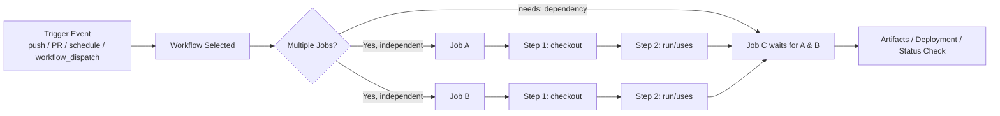
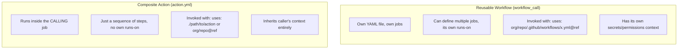
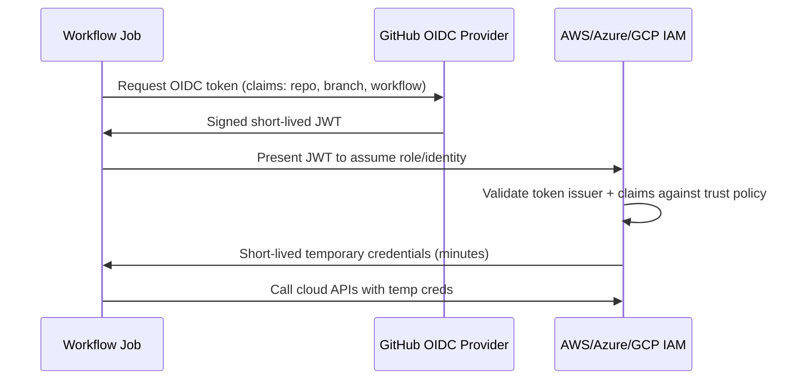

# GitHub Actions — Senior/Lead Interview Guide

Target audience: 10-year .NET full-stack developer prepping for senior/lead-level interviews. Assumes CI/CD fundamentals are known — focus is on nuance, trade-offs, gotchas, and interviewer follow-ups.

## Table of Contents

1. [Core Concepts](#core-concepts)
2. [Workflow Triggers](#workflow-triggers)
3. [Runners](#runners)
4. [Variables, Secrets & Environments](#variables-secrets--environments)
5. [Jobs, Dependencies & Control Flow](#jobs-dependencies--control-flow)
6. [Matrix Builds](#matrix-builds)
7. [Caching & Artifacts](#caching--artifacts)
8. [Reusable Workflows & Composite Actions](#reusable-workflows--composite-actions)
9. [Containers & Custom Actions](#containers--custom-actions)
10. [Deployment Patterns](#deployment-patterns)
11. [Debugging & Local Testing](#debugging--local-testing)
12. [.NET-Specific CI/CD](#net-specific-cicd) `[new content]`
13. [Security & Supply-Chain Hardening](#security--supply-chain-hardening) `[new content]`
14. [OIDC Federation for Cloud Auth](#oidc-federation-for-cloud-auth) `[new content]`
15. [Monorepo & Multi-Project CI Strategies](#monorepo--multi-project-ci-strategies) `[new content]`
16. [Performance & Cost Optimization](#performance--cost-optimization) `[new content]`
17. [GitHub Actions vs Azure DevOps Pipelines](#github-actions-vs-azure-devops-pipelines) `[new content]`
18. [AWS-Native CI/CD Integration Points](#aws-native-cicd-integration-points-gaps) `[gaps]`
19. [Best Practices](#best-practices)
20. [Common Pitfalls](#common-pitfalls)
21. [Sample Interview Q&A](#sample-interview-qa)
22. [Summary of Additions](#summary-of-additions)
23. [Summary of \[gaps\] Additions (This Pass)](#summary-of-gaps-additions-this-pass)

---

## Core Concepts

**GitHub Actions** is GitHub's native CI/CD and automation platform, driven by YAML workflow files stored in `.github/workflows/`.

### Key building blocks

| Concept | Description |
|---|---|
| **Workflow** | A YAML file defining an automated process. Triggered by events. |
| **Job** | A group of steps that runs on a single runner. Jobs run in parallel by default; sequencing is controlled via `needs`. |
| **Step** | A single task inside a job — either a shell command (`run`) or a reusable action (`uses`). |
| **Action** | A reusable unit of automation (JavaScript, Docker, or composite). Can be first-party, community (Marketplace), or custom. |
| **Runner** | The compute (VM or container) that executes a job. GitHub-hosted or self-hosted. |

### Workflow lifecycle (event → job → step)



### Basic workflow example

```yaml
name: CI Workflow
on: [push, pull_request]

jobs:
  build:
    runs-on: ubuntu-latest
    steps:
      - name: Checkout Code
        uses: actions/checkout@v4
      - name: Run Tests
        run: npm test
```

> **Note on versions:** the original notes use `actions/checkout@v3`, `actions/cache@v3`, `actions/upload-artifact@v3` throughout. As of 2026 these should be pinned to `@v4` (checkout, upload/download-artifact) or later — v3 of `upload-artifact`/`download-artifact` is deprecated and disabled on GitHub-hosted runners. This guide uses current versions; treat any `@v3` reference in older notes as **stale**.

**Interviewer angle:** they'll want to know you understand that a *job* is the unit of isolation (own VM/container, own filesystem) while a *step* is the unit of sequencing within that isolation — a very common trip-up for people coming from Jenkins/Azure DevOps stage-vs-task models.

---

## Workflow Triggers

| Trigger | Use case |
|---|---|
| `push` | Run on commits to matching branches |
| `pull_request` | Run on PR open/sync/reopen — runs against the **merge commit**, not the head commit (gotcha, see below) |
| `schedule` (cron) | Nightly builds, scheduled jobs |
| `workflow_dispatch` | Manual trigger from UI/API with optional typed inputs |
| `workflow_call` | Makes the workflow reusable/callable from another workflow |
| `repository_dispatch` | External system triggers a workflow via API |
| `issues`, `release`, etc. | Repo/GitHub-object lifecycle events |

```yaml
on:
  push:
    branches: [main, develop]
    paths-ignore:
      - '**.md'
      - 'docs/**'
  pull_request:
  workflow_dispatch:
  schedule:
    - cron: '0 0 * * *'   # daily at midnight UTC
```

### Manual dispatch

```yaml
on:
  workflow_dispatch:
    inputs:
      environment:
        description: 'Target environment'
        required: true
        default: 'staging'
        type: choice
        options: [staging, production]
```
Trigger from the "Actions" tab, or via `gh workflow run` / REST API for automation.

### Cross-repo triggering

`repository_dispatch` or the `gh` CLI (`gh workflow run workflow.yml --repo other/repo`) can trigger workflows in other repositories, provided the token used has sufficient permissions (a PAT or GitHub App token — the default `GITHUB_TOKEN` cannot trigger workflows in other repos, and by design it also cannot trigger *another* workflow run in the *same* repo, to prevent infinite recursion).

**Gotcha:** `pull_request` from a fork runs with a **read-only, restricted `GITHUB_TOKEN`** and **no access to repo secrets** — a deliberate security boundary. `pull_request_target` runs in the context of the base repo (full token/secrets) but checks out the *base* ref by default, which is a classic **pwn request** vector if misused (see [Security & Supply-Chain Hardening](#security--supply-chain-hardening)).

---

## Runners

A **runner** is the VM/container that executes a job.

### `[new content]` GitHub-Hosted vs Self-Hosted Runners

| Aspect | GitHub-Hosted | Self-Hosted |
|---|---|---|
| **Maintenance** | Zero — GitHub provisions/tears down per job | You patch OS, install SDKs, manage capacity |
| **Cost model** | Per-minute billing (free tier + overage), multiplier by OS (Linux 1x, Windows 2x, macOS 10x) | Infra cost only; free from GitHub Actions minutes billing |
| **Networking** | Public internet only, ephemeral IP, no VPN/private network access by default | Can live inside your VPC/on-prem, access private resources, internal NuGet/npm feeds |
| **State** | Fully ephemeral — clean VM every run | Persistent by default (danger: caches, leftover secrets, malware persistence between builds — unless you explicitly clean up or use ephemeral autoscaling, e.g. via Actions Runner Controller on Kubernetes) |
| **Security surface** | Isolated per-job VM; GitHub manages patching | You own the security posture; malicious PR code (via `pull_request_target` misuse) could execute on infra with internal network access — much higher blast radius |
| **Hardware** | Fixed SKUs (some GPU/large runners available at cost) | Whatever you provision — bare metal, GPUs, ARM, custom images |
| **Best for** | Most OSS/standard CI, quick start | Compliance/data-residency needs, large monorepos, licensed software (e.g. specific SQL Server editions), private network access, cost control at scale |

**Available GitHub-hosted images:**
- Ubuntu: `ubuntu-latest`, `ubuntu-24.04`, `ubuntu-22.04`
- Windows: `windows-latest`, `windows-2025`, `windows-2022`
- macOS: `macos-latest`, `macos-15`, `macos-14`

> **Note:** original notes list `ubuntu-20.04` / `windows-2019` / `macos-12` — these are retired/deprecated as of 2025-2026. Current images are listed above; always check the [actions/runner-images](https://github.com/actions/runner-images) repo for the current support matrix rather than hardcoding (verify exact current defaults at interview time, as GitHub rotates `-latest` periodically).

**Self-hosted setup:**
```bash
./config.sh --url <repo-url> --token <runner-token>
./run.sh
```

**Interviewer follow-up:** "How do you scale self-hosted runners?" → Answer: **Actions Runner Controller (ARC)** on Kubernetes for autoscaling ephemeral runners, or cloud-specific autoscaling groups. Never run long-lived self-hosted runners on a *public* repo — anyone who can open a PR can potentially execute arbitrary code on your infrastructure via workflow trigger abuse.

---

## Variables, Secrets & Environments

### Environment variables

```yaml
env:
  NODE_ENV: production

steps:
  - run: echo "Running in $NODE_ENV mode"
```

### Secrets

Stored in **Settings → Secrets and variables → Actions**, scoped at repo, environment, or organization level.

```yaml
env:
  API_KEY: ${{ secrets.MY_SECRET_KEY }}
```

### `env` vs `secrets`

| Feature | `env` variables | `secrets` |
|---|---|---|
| Visibility | Visible in logs | Automatically masked/redacted in logs |
| Encryption | Not encrypted | Encrypted at rest, decrypted only at runtime for the job |
| Scope | Public to repo/workflow | Private to repository/environment/org, access-controlled |
| Typical use | Non-sensitive config (build flags, feature toggles) | API keys, connection strings, credentials, tokens |

**Gotcha:** secret masking is naive string-substring matching on the printed value — it does **not** protect against a secret being base64-encoded, split across lines, or transformed before printing. Never `echo` a secret through a transformation as a "clever" workaround; assume anything touching a secret is potentially exfiltratable in a compromised workflow.

### Environments & approval gates

```yaml
jobs:
  deploy:
    runs-on: ubuntu-latest
    environment: production
    steps:
      - run: ./deploy.sh
```

Environments (Settings → Environments) let you:
- Scope secrets to only that environment (e.g. prod DB connection string not visible to a "staging" job even in the same workflow).
- Require **manual approval** from designated reviewers before the job proceeds (critical for prod deploy gates).
- Restrict which branches/tags can deploy to that environment (**deployment branch policies**).
- Add a wait timer.

This is the direct equivalent of Azure DevOps **environments + approvals/checks**, and is the standard senior-level answer to "how do you gate a production deployment in GitHub Actions?"

---

## Jobs, Dependencies & Control Flow

### `needs` — job dependencies

```yaml
jobs:
  build:
    runs-on: ubuntu-latest
  test:
    runs-on: ubuntu-latest
    needs: build
  deploy:
    runs-on: ubuntu-latest
    needs: [build, test]
```

Jobs without `needs` run in **parallel** by default; `needs` creates a DAG. `needs` can reference multiple jobs, and downstream jobs can consume upstream **outputs** (`needs.build.outputs.version`).

### `if` conditionals

```yaml
- name: Run only on main
  if: github.ref == 'refs/heads/main'
  run: echo "Running on main branch"
```

Applies at step **or** job level. Common expressions: `github.event_name == 'pull_request'`, `success()`, `failure()`, `always()`, `cancelled()`.

**Gotcha:** if a prior step fails, subsequent steps are **skipped by default** unless you explicitly use `if: always()` or `if: failure()` — a frequent cause of "why didn't my cleanup/notification step run?" bugs.

### Build/Deploy Notifications (Slack & Email)

Wiring up notifications is one of the most common "glue" requests on top of a CI/CD pipeline, and it leans directly on the `if: always()`/`if: failure()` conditionals above — a notification step is exactly the kind of step you *want* to run regardless of (or specifically because of) upstream failure.

**Sending a Slack notification on build/deploy status:**

```yaml
jobs:
  build:
    runs-on: ubuntu-latest
    steps:
      - uses: actions/checkout@v4
      - run: dotnet build

      - name: Notify Slack on success
        if: success()
        uses: rtCamp/action-slack-notify@v2
        env:
          SLACK_WEBHOOK: ${{ secrets.SLACK_WEBHOOK }}
          SLACK_MESSAGE: 'Build completed successfully! :white_check_mark:'
          SLACK_COLOR: good

      - name: Notify Slack on failure
        if: failure()
        uses: rtCamp/action-slack-notify@v2
        env:
          SLACK_WEBHOOK: ${{ secrets.SLACK_WEBHOOK }}
          SLACK_MESSAGE: 'Build failed on ${{ github.ref_name }} — check the run.'
          SLACK_COLOR: danger
```

- `rtCamp/action-slack-notify@v2` (and similar Marketplace actions) posts to a **Slack Incoming Webhook URL** stored as a repo/environment secret (`SLACK_WEBHOOK`) — no OAuth app install required for the simple case, just a webhook per channel.
- Split success/failure into separate steps with `if: success()` / `if: failure()` (rather than one `if: always()` step) when you want different messages/colors per outcome; use `if: always()` only when a single step should run unconditionally and branch on `${{ job.status }}` internally.
- **Email** notifications follow the same pattern with an SMTP-based action, e.g. `dawidd6/action-send-mail@v3`, fed server/credentials via secrets and gated the same way (`if: failure()` for an on-call alert, `if: success()` for a deploy confirmation).
- **The reverse direction — triggering a workflow *from* Slack:** a Slack bot/slash-command can call the GitHub REST API (or `gh workflow run`) to fire a `workflow_dispatch` event, effectively giving you ChatOps ("`/deploy staging`" in Slack kicks off a GitHub Actions run). This requires a PAT or GitHub App token with `actions: write` on the target repo — `GITHUB_TOKEN` isn't usable here since the call originates outside any workflow run.

**Interviewer angle:** they're checking that you know *where* the coupling point is — notifications aren't a special GitHub Actions primitive, they're ordinary steps (Marketplace action or a `curl`/SMTP call) gated by the same `if:` conditional logic used for cleanup steps, driven by a webhook/SMTP secret rather than `GITHUB_TOKEN`.

### Branch/path filters

```yaml
on:
  push:
    branches: [main, develop]
    paths-ignore:
      - '**.md'
      - 'docs/**'
```

### Concurrency control

```yaml
concurrency:
  group: ci-${{ github.ref }}
  cancel-in-progress: true
```
Prevents redundant/overlapping runs (e.g. superseding a stale PR build when new commits land). Without `cancel-in-progress: true`, `concurrency` only **queues** runs serially rather than cancelling — a subtlety worth calling out.

### Timeouts and retries

```yaml
jobs:
  build:
    timeout-minutes: 10
```

There is **no built-in step-level retry** primitive in core GitHub Actions syntax. Options:
1. Shell-level retry loop:
   ```yaml
   - run: |
       for i in 1 2 3; do
         your-command && break || sleep 5
       done
   ```
2. Marketplace action: `nick-fields/retry@v3` (cleaner, supports max attempts/backoff/timeout).

### Custom composite/anchor step reuse within a repo

```yaml
steps:
  - name: Common Step
    run: echo "This step is used in multiple jobs"
```
For true reuse across jobs/workflows, prefer a **composite action** (see below) over copy-pasting steps or YAML anchors (YAML anchors are not officially supported/validated by the Actions schema and are a fragile hack).

---

## Matrix Builds

```yaml
strategy:
  matrix:
    os: [ubuntu-latest, windows-latest]
    dotnet-version: ['8.0.x', '9.0.x']
  fail-fast: false
runs-on: ${{ matrix.os }}
steps:
  - uses: actions/setup-dotnet@v4
    with:
      dotnet-version: ${{ matrix.dotnet-version }}
```

- Runs the **cross-product** of all matrix dimensions as separate parallel jobs (2 OS × 2 versions = 4 jobs here).
- `fail-fast: true` (default) cancels all other matrix jobs the moment one fails — usually you want `false` in CI so you get full signal across the matrix, and `true` only when you want to fail fast to save runner minutes.
- `max-parallel` throttles how many matrix jobs run concurrently (useful to avoid exhausting a limited self-hosted pool).
- `include`/`exclude` let you add one-off combinations or exclude specific ones without full cross-product blow-up.

**Interviewer angle:** "Why use a matrix instead of N separate jobs?" → DRY workflow definition, and the Checks UI groups matrix results legibly under one job name with per-combination status — much easier to read than N unrelated jobs.

---

## Caching & Artifacts

### Caching (speed, not persistence guarantee)

```yaml
- uses: actions/cache@v4
  with:
    path: ~/.nuget/packages
    key: nuget-${{ runner.os }}-${{ hashFiles('**/packages.lock.json') }}
    restore-keys: |
      nuget-${{ runner.os }}-
```

- Cache is keyed — an exact key hit restores the cache; `restore-keys` provides fallback **partial** matches (useful when the lockfile changed slightly but most packages are unchanged).
- Caches are **immutable once written** for a given key — you cannot update an existing cache entry; a new key is required (this trips people up: "why isn't my cache updating?").
- Caches are scoped per repo/branch with eviction (10 GB repo-wide soft cap, LRU eviction — verify current exact limits, GitHub has adjusted these).
- `actions/cache` is **best-effort** — never rely on it for correctness, only for speed. Design the pipeline to work correctly on a full cache miss.

### Artifacts (durable, cross-job data transfer)

```yaml
- uses: actions/upload-artifact@v4
  with:
    name: build-output
    path: ./bin/Release
    retention-days: 7

- uses: actions/download-artifact@v4
  with:
    name: build-output
```

**Important v4 breaking change (common interview gotcha):** `upload-artifact@v4`/`download-artifact@v4` no longer allow multiple uploads to the *same* artifact name (each upload creates a new immutable artifact) and are up to 10x faster than v3, but require distinct names per matrix leg — a common fix is `name: artifact-${{ matrix.os }}-${{ matrix.dotnet-version }}`. v3 of these actions is **deprecated/EOL** — the notes' use of `@v3` should be updated.

**Artifacts vs cache — the distinction interviewers probe for:**

| | Cache | Artifact |
|---|---|---|
| Purpose | Speed up repeated dependency restore | Pass build output between jobs, or preserve for humans/download |
| Lifetime | Best-effort, evicted opportunistically | Guaranteed for `retention-days`, downloadable via UI/API |
| Typical content | `node_modules`, NuGet/npm cache, Docker layers | Compiled binaries, test results, logs, coverage reports |

### Long-term storage
`actions/upload-artifact` retention is capped (default 90 days, configurable down); for genuinely long-term artifact storage, push to a package feed (GitHub Packages, NuGet.org, Azure Artifacts) or blob storage (S3/Azure Blob) instead.

---

## Reusable Workflows & Composite Actions

This is one of the most commonly confused areas in interviews — know the distinction cold.



| | Reusable Workflow | Composite Action |
|---|---|---|
| File | `.yml` under `.github/workflows/` with `on: workflow_call` | `action.yml` (+ optional script files) |
| Granularity | One or more **jobs** | A sequence of **steps** within one job |
| Runner | Defines its own `runs-on` | Runs on the caller's existing runner |
| Secrets | Must be explicitly passed via `secrets:` (or `secrets: inherit`) | Inherits caller's env/context automatically |
| Nesting | Can call other reusable workflows (up to 4 levels deep) | Can call other actions |
| Best for | Standardizing an entire pipeline stage (e.g. "build-test-scan" used by 20 repos) | Standardizing a handful of steps (e.g. "checkout + setup dotnet + restore") |

### Reusable workflow

```yaml
# .github/workflows/deploy.yml
on:
  workflow_call:
    inputs:
      environment:
        required: true
        type: string
    secrets:
      AWS_ACCESS_KEY_ID:
        required: true

jobs:
  deploy:
    runs-on: ubuntu-latest
    steps:
      - run: echo "Deploying to ${{ inputs.environment }}"
```

Calling it, including cross-repo:
```yaml
jobs:
  call-workflow:
    uses: my-org/my-repo/.github/workflows/deploy.yml@main
    with:
      environment: production
    secrets:
      AWS_ACCESS_KEY_ID: ${{ secrets.AWS_ACCESS_KEY_ID }}
      # or simply: secrets: inherit
```

### Composite action

```yaml
# action.yml
name: 'Setup and Restore'
runs:
  using: "composite"
  steps:
    - uses: actions/setup-dotnet@v4
      with:
        dotnet-version: '8.0.x'
      shell: bash
    - run: dotnet restore
      shell: bash
```
> **Gotcha:** every `run` step inside a composite action **must specify `shell:`** explicitly — it isn't inherited the way it is in a normal workflow job.

**Interviewer follow-up:** "When would you pick one over the other?" → Composite action for a small reusable step-sequence embedded inside a larger job (e.g. shared setup logic); reusable workflow when you want to standardize an entire deployment/release process across many repos with centralized governance (org security team owns the reusable workflow, teams just call it — reduces drift and makes auditing/patching a single choke point).

---

## Containers & Custom Actions

### Running a job inside a container

```yaml
jobs:
  docker-job:
    runs-on: ubuntu-latest
    container:
      image: mcr.microsoft.com/dotnet/sdk:8.0
    steps:
      - run: dotnet --version
```
Useful for pinning exact toolchain versions independent of the runner image, or using a hermetic build environment matching production containers.

### Custom actions — three flavors

| Type | Runtime | Use case |
|---|---|---|
| **Docker container action** | Any language, packaged as a container | Full control, heavier/slower startup, works on Linux runners only (mostly) |
| **JavaScript/TypeScript action** | Node.js (`node20` runtime as of current major versions) | Fastest startup, cross-platform, most Marketplace actions use this |
| **Composite action** | Orchestrates existing actions/shell steps | No compilation, easiest to author/maintain |

```yaml
# action.yml (JS action skeleton)
name: 'My Custom Action'
inputs:
  who-to-greet:
    required: true
runs:
  using: 'node20'
  main: 'dist/index.js'
```

---

## Deployment Patterns

### Multi-stage deployment (dev → staging → prod)

```yaml
jobs:
  deploy-dev:
    environment: dev
    runs-on: ubuntu-latest
    steps: [ ... ]
  deploy-staging:
    needs: deploy-dev
    environment: staging
    runs-on: ubuntu-latest
    steps: [ ... ]
  deploy-prod:
    needs: deploy-staging
    environment: production   # gated by required reviewers
    runs-on: ubuntu-latest
    steps: [ ... ]
```

### Cloud deployment example (AWS)

```yaml
- uses: aws-actions/configure-aws-credentials@v4
  with:
    aws-access-key-id: ${{ secrets.AWS_ACCESS_KEY_ID }}
    aws-secret-access-key: ${{ secrets.AWS_SECRET_ACCESS_KEY }}
    aws-region: us-east-1
- run: aws s3 sync ./build s3://my-bucket
```
> **Senior-level flag:** long-lived AWS access keys as secrets is the *legacy* pattern. Current best practice is **OIDC federation** — no static credentials stored at all (see the dedicated section below). Bring this up proactively in an interview; it signals current knowledge.

### IaC deployments

```yaml
- name: Deploy with Terraform
  run: terraform apply -auto-approve
```
Same principle applies for Azure (`azure/login@v2` with OIDC) or GCP (`google-github-actions/auth`) — avoid static service principal secrets where OIDC is available.

### Repository/status badges

```markdown

```

---

## Debugging & Local Testing

### Debugging a failed run

- Re-run with **debug logging**: set repo secrets `ACTIONS_STEP_DEBUG=true` and `ACTIONS_RUNNER_DEBUG=true`, or use the "Re-run with debug logging" option in the UI.
- Use `tmate` (`mxschmitt/action-tmate`) to SSH into a live runner mid-failure for interactive debugging — very useful for flaky/self-hosted-runner-specific issues.
- Inspect the `${{ toJSON(github) }}` / `${{ toJSON(steps) }}` context by dumping it in a debug step to see exactly what values were available.

> **Note:** original notes reference `actions/setup-debugging` — no such official action exists (verify — likely a misremembered/hallucinated name in the source notes, or confused with a community action). The correct, current answer is the debug-logging secrets and/or `tmate` approach above.

### Running Actions locally

```bash
act -j build
```
[`nektos/act`](https://github.com/nektos/act) runs workflows locally in Docker for fast iteration without pushing/waiting on GitHub. Limitations: doesn't perfectly emulate GitHub-hosted runner images, some contexts (`secrets`, certain `github.*` fields) need manual stubbing, and GitHub-specific features (environments/approvals) aren't simulated.

---

## .NET-Specific CI/CD

### `[new content]` Idiomatic .NET Build/Test/Publish Pipeline

A realistic senior-level .NET CI workflow, with the pieces interviewers actually probe (multi-TFM builds, test result publishing, coverage, NuGet caching, versioning):

```yaml
name: .NET CI

on:
  push:
    branches: [main]
  pull_request:

jobs:
  build-test:
    runs-on: ubuntu-latest
    steps:
      - uses: actions/checkout@v4
        with:
          fetch-depth: 0   # needed for tools like GitVersion / Nerdbank.GitVersioning

      - uses: actions/setup-dotnet@v4
        with:
          dotnet-version: '8.0.x'

      - name: Cache NuGet packages
        uses: actions/cache@v4
        with:
          path: ~/.nuget/packages
          key: nuget-${{ runner.os }}-${{ hashFiles('**/packages.lock.json') }}
          restore-keys: nuget-${{ runner.os }}-

      - name: Restore
        run: dotnet restore --locked-mode

      - name: Build
        run: dotnet build --configuration Release --no-restore

      - name: Test
        run: >
          dotnet test --configuration Release --no-build
          --logger "trx;LogFileName=test-results.trx"
          --collect:"XPlat Code Coverage"

      - name: Publish test results
        uses: dorny/test-reporter@v1
        if: always()
        with:
          name: Test Results
          path: '**/test-results.trx'
          reporter: dotnet-trx

      - name: Publish
        run: dotnet publish ./src/MyApp/MyApp.csproj -c Release -o ./publish

      - uses: actions/upload-artifact@v4
        with:
          name: webapp
          path: ./publish
```

Key points an interviewer wants to hear:
- **`packages.lock.json` + `--locked-mode`**: enables deterministic restore and lets the cache key be based on an exact, reproducible hash — without a lock file, `hashFiles('**/*.csproj')` is a weaker proxy and can miss transitive dependency drift.
- **`fetch-depth: 0`**: shallow clone (default `fetch-depth: 1`) breaks tools that need full git history (GitVersion, Nerdbank.GitVersioning, `git describe`-based versioning).
- **`--no-restore` / `--no-build`**: avoid redundant work across `restore` → `build` → `test` steps.
- **Test result publishing**: `.trx` files aren't natively rendered by GitHub — need `dorny/test-reporter`, `EnricoMi/publish-unit-test-result-action`, or upload as artifact + external tool.
- **Coverage**: `--collect:"XPlat Code Coverage"` emits Cobertura XML; combine with `danielpalme/ReportGenerator-GitHub-Action` or upload to Codecov/SonarCloud for visualization and PR-level coverage-diff gating.

### `[new content]` Versioning & Semantic Release for .NET

- **GitVersion** or **Nerdbank.GitVersioning (nbgv)**: derive a SemVer version from git history/tags automatically, avoiding manual version bumps in `.csproj`. Typically run as an early workflow step, exposing the computed version as a job output consumed by later `dotnet build -p:Version=...` and container-tag steps.
- **MinVer**: lighter-weight alternative, purely tag-based.
- Container images and NuGet packages should be tagged/versioned from the *same* computed value to keep traceability between a deployed artifact and its exact commit.

### `[new content]` Containerized .NET Apps — Build & Push

```yaml
- uses: docker/setup-buildx-action@v3
- uses: docker/login-action@v3
  with:
    registry: ghcr.io
    username: ${{ github.actor }}
    password: ${{ secrets.GITHUB_TOKEN }}
- uses: docker/build-push-action@v6
  with:
    context: .
    push: true
    tags: ghcr.io/my-org/my-app:${{ github.sha }}
    cache-from: type=gha
    cache-to: type=gha,mode=max
```
`cache-from`/`cache-to: type=gha` uses the Actions cache backend for Docker layer caching — meaningfully faster than rebuilding every layer per run, and the modern replacement for manually caching `/var/lib/docker`.

---

## Security & Supply-Chain Hardening

### `[new content]` Pwn Requests and `pull_request_target` Risk

The single most-tested senior security topic for GitHub Actions right now:

- `pull_request` from a fork: runs with a **read-only token and no secrets** — safe by default even if the PR contains malicious code, because it can't exfiltrate anything sensitive.
- `pull_request_target`: runs with the **base repo's token and full secrets access**, but by default checks out the **base** branch — safe *unless* the workflow explicitly checks out and executes the PR's head ref (`github.event.pull_request.head.sha`) or otherwise runs attacker-controlled code (e.g. `npm install` triggering a malicious `postinstall` script from the fork's `package.json`, or invoking a Makefile/script from the checked-out PR code). This combination — privileged token + executing untrusted code — is exactly the **"pwn request"** vulnerability class GitHub has published advisories about.
- **Mitigation:** never combine `pull_request_target` (or `workflow_run`) with a checkout of untrusted head content unless you've deliberately isolated what runs; if you need to build/test fork PRs with any elevated capability, split into two workflows — an unprivileged `pull_request` build/test job, and a separate, manually-gated or `workflow_run`-triggered job that only re-uses vetted **artifacts** (not source) for anything privileged.

### `[new content]` Pinning Actions to Commit SHAs

- `uses: actions/checkout@v4` resolves a mutable tag — if that tag is ever moved (compromised publisher, or the publisher force-pushes a new v4 tag), your workflow silently runs different code next run. This is a real supply-chain attack surface (see the 2024 `tj-actions/changed-files` and tools like it that got compromised).
- Best practice for anything security-sensitive: pin to a **full commit SHA** with a version comment for readability:
  ```yaml
  - uses: actions/checkout@11bd71901bbe5b1630ceea73d27597364c9af683 # v4.2.2
  ```
- Tools like Dependabot and `pinact` can auto-update SHA-pinned actions while keeping the pin.

### `[new content]` `GITHUB_TOKEN` Least Privilege

- Default `permissions` for `GITHUB_TOKEN` used to be broad (`write` on most scopes) for classic repos; new repos default to **read-only**, but you should never rely on the default — declare `permissions` explicitly at the workflow or job level:
  ```yaml
  permissions:
    contents: read
    pull-requests: write   # only if the job actually comments/labels PRs
  ```
- This is the single highest-leverage, lowest-effort security control you can point to in an interview — set least-privilege `permissions:` blocks on every workflow rather than accepting defaults.

### `[new content]` Third-Party Action Vetting

- Prefer actions published by **GitHub, verified creators, or vendors you already trust** (`aws-actions/*`, `docker/*`, `azure/*`).
- For anything else, review the source, pin to SHA, and consider mirroring into an internal org action if it's business-critical — don't take a runtime dependency on an unaudited third-party script executing with access to your secrets.
- **CodeQL** / **Dependabot** / **Scorecard** (`ossf/scorecard-action`) can be wired into workflows to continuously assess supply-chain risk of the repo itself.

### `[new content]` Environment Protection Rules as a Security Control

Environments aren't just for approvals — they let you scope which secrets exist at all in a given job context, meaning a compromised/malicious PR workflow targeting a `dev` environment simply cannot read `production` secrets, because they're not injected into that job's context at all. This is a stronger boundary than relying on `if` conditions alone.

---

## OIDC Federation for Cloud Auth

### `[new content]` Why OIDC Replaces Long-Lived Cloud Secrets

The old pattern (still in many legacy pipelines, including the AWS example earlier in this guide) stores a long-lived `AWS_ACCESS_KEY_ID`/`AWS_SECRET_ACCESS_KEY` (or Azure Service Principal secret) as a GitHub secret. Problems:
- Static credentials leak risk — if exfiltrated, valid until manually rotated/revoked.
- No natural expiry, no scoping to a single workflow run.
- Rotation is a manual, often-neglected operational burden.

**OIDC (OpenID Connect) federation** lets GitHub Actions request a short-lived, cryptographically-signed identity token from GitHub's OIDC provider, which the cloud provider trusts (via a pre-configured trust relationship) to mint temporary, scoped credentials for just that job run. No static secret is stored anywhere.



### Example: AWS via OIDC (no static keys)

```yaml
permissions:
  id-token: write   # required for OIDC
  contents: read

jobs:
  deploy:
    runs-on: ubuntu-latest
    steps:
      - uses: aws-actions/configure-aws-credentials@v4
        with:
          role-to-assume: arn:aws:iam::123456789012:role/github-actions-deploy
          aws-region: us-east-1
      - run: aws s3 sync ./build s3://my-bucket
```

The IAM role's trust policy restricts *which* repo/branch/environment can assume it, using claims like `token.actions.githubusercontent.com:sub == "repo:my-org/my-repo:ref:refs/heads/main"` — meaning even if a workflow is compromised, it can only impersonate the role from that exact repo/branch context.

### Azure equivalent

```yaml
permissions:
  id-token: write
  contents: read
steps:
  - uses: azure/login@v2
    with:
      client-id: ${{ secrets.AZURE_CLIENT_ID }}
      tenant-id: ${{ secrets.AZURE_TENANT_ID }}
      subscription-id: ${{ secrets.AZURE_SUBSCRIPTION_ID }}
      # no client-secret — federated credential configured on the App Registration
```

**Interviewer follow-up:** "What's stored as a secret here if there's no client secret?" → Only non-sensitive identifiers (client ID, tenant ID, subscription ID) — none of these alone grant access without the OIDC trust relationship also matching repo/branch claims.

---

## Monorepo & Multi-Project CI Strategies

### `[new content]` Change-Detection-Based Selective Builds

In a monorepo (e.g. multiple .NET services + a frontend in one repo), running the *entire* pipeline on every push wastes runner minutes and slows feedback. Standard senior-level pattern:

```yaml
jobs:
  changes:
    runs-on: ubuntu-latest
    outputs:
      api: ${{ steps.filter.outputs.api }}
      frontend: ${{ steps.filter.outputs.frontend }}
    steps:
      - uses: dorny/paths-filter@v3
        id: filter
        with:
          filters: |
            api:
              - 'src/Api/**'
            frontend:
              - 'src/Frontend/**'

  build-api:
    needs: changes
    if: needs.changes.outputs.api == 'true'
    runs-on: ubuntu-latest
    steps: [ ... ]

  build-frontend:
    needs: changes
    if: needs.changes.outputs.frontend == 'true'
    runs-on: ubuntu-latest
    steps: [ ... ]
```

This is the GitHub Actions equivalent of Azure DevOps' `paths` trigger filters or Bazel/Nx-style affected-project detection, and it's a near-guaranteed interview question if the role involves a monorepo.

### `[new content]` Nx/Turborepo-Aware CI

For polyglot or JS-heavy monorepos, tools like **Nx** and **Turborepo** compute the dependency graph and expose an "affected" command (`nx affected`, `turbo run build --filter=...[origin/main]`) that's more accurate than path filters alone, because it understands *code* dependencies, not just directory boundaries. Increasingly relevant even in .NET-heavy shops that have a mixed-stack monorepo with a JS frontend.

### Reusable workflows as the monorepo governance mechanism

Combine path-filtering with a shared reusable workflow per "project type" (e.g. one `dotnet-build-test.yml` reusable workflow called by every service's job) so that the build/test/security logic is centrally maintained even though each service triggers independently.

---

## Performance & Cost Optimization

### `[new content]` Where Runner Minutes Actually Go

- **Runner OS multiplier**: Windows runners cost 2x Linux minutes, macOS 10x, on GitHub-hosted billing. Default to Linux unless you specifically need Windows/macOS (e.g. full .NET Framework, or iOS/macOS builds) — a very concrete, quantifiable answer for a "how would you reduce our CI bill" question.
- **Concurrency + `cancel-in-progress`**: stops burning minutes on superseded commits.
- **Caching** (NuGet/npm/Docker layers) cuts restore/build time, often the single biggest lever.
- **Matrix `fail-fast` and `max-parallel`** tuning to avoid wasting parallel runner slots.
- **Path filters / change detection** in monorepos (above) avoid running unrelated pipelines entirely.
- **Self-hosted runners** for high-volume, predictable workloads — cost crossover point depends on org's minute consumption vs. infra/ops cost; a senior answer acknowledges this is a build-vs-buy calculation, not a default.
- **Larger/faster hosted runners** (GitHub offers bigger SKUs at a premium) can be cheaper *in aggregate* than default 2-core runners if they meaningfully cut wall-clock time on CPU-bound builds — worth benchmarking rather than assuming default is cheapest.

### `[new content]` Workflow-Level Timeout Hygiene

Always set `timeout-minutes` at the job level (not just relying on the platform default of 6 hours) — a hung test/process silently burning runner minutes for hours is a common real-world cost leak, and "we set aggressive timeouts everywhere" is a good concrete practice to cite.

---

## GitHub Actions vs Azure DevOps Pipelines

### `[new content]` Comparison Table

Given the .NET-heavy audience, this comparison is extremely likely to come up (many senior .NET shops are migrating from Azure DevOps to GitHub, or run both).

| Aspect | GitHub Actions | Azure DevOps Pipelines |
|---|---|---|
| **Config format** | YAML in `.github/workflows/` | YAML (`azure-pipelines.yml`) or classic UI-based pipelines |
| **Unit of isolation** | Job (own VM/container) | Stage → Job → Task hierarchy (extra nesting level) |
| **Reusability** | Reusable workflows (`workflow_call`) + composite actions | Templates (`extends`, `template` includes) |
| **Marketplace** | GitHub Marketplace, huge community ecosystem, JS/Docker/composite actions | Azure DevOps Marketplace, smaller, more enterprise/ALM-focused extensions |
| **Approvals/Gates** | Environments + required reviewers | Environments + approvals & checks (very similar model) |
| **Secrets** | Repo/Env/Org-scoped secrets | Variable groups, Key Vault-linked variable groups (arguably more mature Key Vault integration) |
| **Self-hosted compute** | Self-hosted runners | Self-hosted agents (same concept, different name) |
| **Cloud-native auth** | OIDC federation (AWS/Azure/GCP) | Workload identity federation (equivalent concept, mature Azure integration) |
| **Native repo integration** | Deeply integrated with GitHub (Checks API, PR status, Issues) | Best when paired with Azure Repos; usable with GitHub repos too, but less native |
| **Boards/work item integration** | GitHub Projects/Issues (lighter-weight) | Azure Boards (heavier, more enterprise PM-oriented) |
| **Pricing model** | Per-minute + OS multiplier, generous free tier for public repos | Per-parallel-job licensing model, different free tier shape |
| **Typical migration driver** | Org consolidating on GitHub for source control + wants a single tool | Org wants deeper enterprise ALM (Boards, Test Plans, more mature RBAC) or Azure-only ecosystem lock-in |

**Interviewer angle:** if the org is migrating from Azure DevOps, know that most concepts have a direct analog (stage→job, agent→runner, variable group→environment/secret, template→reusable workflow) — the migration is largely mechanical translation plus re-thinking security (OIDC, `permissions:` blocks) since GitHub's default security posture and Azure DevOps's differ meaningfully.

---

## AWS-Native CI/CD Integration Points `[gaps]`

The OIDC Federation section above covers the general OIDC mechanism and shows a minimal AWS example. This section fills in the AWS-specific mechanics an interviewer expects when the target cloud is AWS — the concrete action, the IAM trust policy shape, and how artifacts/caching connect to an AWS deployment target (ECS/Lambda) rather than a generic `s3 sync`.

### `[gaps]` `aws-actions/configure-aws-credentials` in Depth

`aws-actions/configure-aws-credentials` is the de facto standard action for getting AWS credentials into a job — it supports both the legacy static-key pattern and the current OIDC pattern, and it's important to be able to speak to exactly what it does under the hood:

```yaml
permissions:
  id-token: write   # required — this is what lets the job request an OIDC token at all
  contents: read

jobs:
  deploy:
    runs-on: ubuntu-latest
    steps:
      - uses: actions/checkout@v4

      - uses: aws-actions/configure-aws-credentials@v4
        with:
          role-to-assume: arn:aws:iam::123456789012:role/github-actions-ecs-deploy
          aws-region: us-east-1
          role-session-name: gha-${{ github.run_id }}   # traceable in CloudTrail

      - run: aws sts get-caller-identity   # sanity check — confirms the assumed role
```

What actually happens: the action calls GitHub's OIDC provider for a signed JWT (scoped to the calling repo/workflow/ref), then calls AWS STS `AssumeRoleWithWebIdentity`, passing that JWT. AWS validates the JWT's signature against the OIDC provider you registered in IAM, checks the trust policy's conditions against the JWT's claims, and — if they match — returns short-lived (default 1 hour, configurable) temporary credentials, which the action then exports as environment variables (`AWS_ACCESS_KEY_ID`, `AWS_SECRET_ACCESS_KEY`, `AWS_SESSION_TOKEN`) for every subsequent step in the job.

### `[gaps]` IAM OIDC Provider and Role Trust Policy Setup

Two pieces of AWS-side configuration are required before any workflow can assume a role via OIDC — interviewers expect you to know both, not just the GitHub YAML side:

**1. Register GitHub's OIDC provider in IAM** (one-time, per AWS account) — either via the console, or as code (Terraform, since that's the candidate's actual IaC tool):

```hcl
resource "aws_iam_openid_connect_provider" "github_actions" {
  url             = "https://token.actions.githubusercontent.com"
  client_id_list  = ["sts.amazonaws.com"]
  thumbprint_list = []  # AWS validates via its own trusted CA bundle for this provider; thumbprint no longer required for GitHub's OIDC endpoint (verify current guidance in the AWS provider docs at the time you provision this — this requirement has relaxed over time)
}
```

**2. Create the IAM role with a trust policy scoped to the exact repo/branch/environment** — this is the control that limits blast radius if a workflow is compromised:

```hcl
resource "aws_iam_role" "github_actions_ecs_deploy" {
  name = "github-actions-ecs-deploy"

  assume_role_policy = jsonencode({
    Version = "2012-10-17"
    Statement = [{
      Effect    = "Allow"
      Principal = { Federated = aws_iam_openid_connect_provider.github_actions.arn }
      Action    = "sts:AssumeRoleWithWebIdentity"
      Condition = {
        StringEquals = {
          "token.actions.githubusercontent.com:aud" = "sts.amazonaws.com"
        }
        StringLike = {
          "token.actions.githubusercontent.com:sub" = "repo:my-org/my-repo:ref:refs/heads/main"
          # or, scoped to a GitHub Environment instead of a branch:
          # "token.actions.githubusercontent.com:sub" = "repo:my-org/my-repo:environment:production"
        }
      }
    }]
  })
}
```

**Interviewer follow-up to expect:** "What's the blast radius if this workflow is compromised?" — Only what the attached IAM *permissions* policy allows, and only from the exact repo/ref/environment matched in the `sub` claim — a workflow on a feature branch cannot assume a role trust-scoped to `ref:refs/heads/main`, even with a stolen `GITHUB_TOKEN`, because the OIDC claims are generated server-side by GitHub and can't be forged by workflow code.

**Gotcha:** the `aud` (audience) claim must always be checked (`sts.amazonaws.com`) alongside `sub` — checking `sub` alone without pinning `aud` is a real (if narrower) hardening gap some example configs skip.

### `[gaps]` Artifacts/Caching Tying Into an AWS Deploy Target (ECS/Lambda)

The Caching & Artifacts section above covers the generic mechanics; here's how they connect concretely to AWS-native compute rather than a generic S3 sync:

**Deploying a containerized .NET service to ECS:**
```yaml
jobs:
  build-and-push:
    runs-on: ubuntu-latest
    permissions:
      id-token: write
      contents: read
    steps:
      - uses: actions/checkout@v4
      - uses: aws-actions/configure-aws-credentials@v4
        with:
          role-to-assume: arn:aws:iam::123456789012:role/github-actions-ecs-deploy
          aws-region: us-east-1
      - uses: aws-actions/amazon-ecr-login@v2
        id: ecr-login
      - uses: docker/build-push-action@v6
        with:
          context: .
          push: true
          tags: ${{ steps.ecr-login.outputs.registry }}/order-api:${{ github.sha }}
          cache-from: type=gha
          cache-to: type=gha,mode=max
      - name: Render new ECS task definition
        id: task-def
        uses: aws-actions/amazon-ecs-render-task-definition@v1
        with:
          task-definition: ecs-task-def.json
          container-name: order-api
          image: ${{ steps.ecr-login.outputs.registry }}/order-api:${{ github.sha }}
      - name: Deploy to ECS
        uses: aws-actions/amazon-ecs-deploy-task-definition@v2
        with:
          task-definition: ${{ steps.task-def.outputs.task-definition }}
          service: order-api-service
          cluster: order-api-cluster
          wait-for-service-stability: true
```
The same `type=gha` layer cache used for GHCR-based .NET container builds elsewhere in this guide works identically when the target registry is ECR — the cache backend is the Actions cache service regardless of where the built image is pushed.

**Deploying a .NET Lambda (e.g., via the AWS Lambda .NET tooling or a container-image Lambda):**
```yaml
      - name: Publish Lambda package
        run: dotnet lambda package -pl ./src/MyFunction -o ./publish/function.zip

      - uses: actions/upload-artifact@v4     # durable handoff to a separate deploy job, or for audit/rollback
        with:
          name: lambda-package
          path: ./publish/function.zip

      - name: Deploy to Lambda
        run: |
          aws lambda update-function-code \
            --function-name order-processor \
            --zip-file fileb://./publish/function.zip
```
Here the **artifact** (not cache) is the correct primitive — the zip is the actual deployable unit being handed from a build job to a deploy job (or retained for rollback/audit), which is exactly the artifacts-vs-cache distinction the Caching & Artifacts section draws: cache accelerates the *build*, artifacts carry the *thing you actually ship*. NuGet restore caching (`actions/cache` keyed on `packages.lock.json`) still applies upstream of this step to speed up `dotnet lambda package` itself.

**Interviewer angle:** be ready to state explicitly that ECS deploys are usually image-based (build once, push to ECR, update the task definition, let ECS handle the rolling/blue-green rollout — see the AWS CodeDeploy content in the Deployment Strategies guide), while Lambda deploys are typically artifact-based (zip or container image pushed directly via the Lambda API/SDK, often orchestrated by Terraform/CDKTF rather than raw `aws lambda update-function-code` in anything beyond a quick example) — knowing which primitive (image vs. zip artifact) fits which compute target is the actual signal of AWS fluency here.

---

## Best Practices

- Pin action versions (ideally to commit SHA for anything security-sensitive; at minimum a major version tag, never `@main`/`@master`).
- Set explicit least-privilege `permissions:` blocks on every workflow.
- Use `environments` with required reviewers for any production deployment gate.
- Prefer OIDC federation over long-lived cloud credentials wherever the cloud provider supports it.
- Use `concurrency` + `cancel-in-progress` to avoid wasting minutes on superseded runs.
- Cache aggressively (NuGet/npm/Docker layers) but never depend on cache for correctness.
- Centralize shared CI logic in reusable workflows/composite actions instead of copy-pasting across repos.
- Use path filters / change detection in monorepos to avoid unnecessary full-repo builds.
- Fail fast with sensible `timeout-minutes` everywhere.
- Split "build untrusted PR code" (unprivileged) from "run privileged deployment logic" (trusted, gated) into separate workflows to avoid pwn-request exposure.
- Use Dependabot to keep both application dependencies and pinned Action SHAs current.

---

## Common Pitfalls

- Assuming `GITHUB_TOKEN` has full permissions by default — modern defaults are more restrictive, but don't assume either way; declare explicitly.
- Combining `pull_request_target` with a checkout of the PR head — classic pwn-request vulnerability.
- Relying on `actions/cache` for correctness rather than pure speed-up.
- Forgetting `shell:` in composite action `run` steps.
- Not setting `fail-fast: false` when you actually want full matrix signal.
- Believing `concurrency` alone cancels stale runs — it only does so with `cancel-in-progress: true`.
- Using deprecated `actions/checkout@v3`, `upload-artifact@v3`/`download-artifact@v3` — these are retired/being sunset; use v4+.
- Uploading multiple matrix legs to one artifact name under v4 semantics (now disallowed) — must use unique names per leg.
- Treating secret masking as a real security boundary against determined exfiltration (encoding/splitting bypasses naive log redaction).
- Forgetting `fetch-depth: 0` when a step needs full git history (versioning tools, `git log`-based changelogs).
- Long-lived, non-ephemeral self-hosted runners on public repos — a significant attack surface.

---

## Sample Interview Q&A

**Q: Walk me through what happens end-to-end when a developer opens a PR, from trigger to merge, in a well-designed GitHub Actions setup for a .NET service.**
A: PR opened → `pull_request` event fires with a restricted, secret-less token → build/test/lint jobs run in parallel where possible, with matrix across relevant TFMs/OS if needed → NuGet cache restored by lockfile hash → `dotnet build`/`dotnet test` run, results published via a TRX-aware reporter as PR checks → on success, artifacts (build output, coverage report) uploaded → branch protection requires these checks green before merge → merge to main triggers a separate `push`-triggered workflow that runs the trusted deployment path (potentially through a reusable workflow), gated by an `environment` requiring manual approval for production, using OIDC to assume a cloud deploy role rather than static secrets.

**Q: Your GitHub Actions bill is too high — walk me through how you'd reduce it without hurting developer velocity.**
A: Instrument first — identify which workflows/jobs consume the most minutes (Actions usage reports). Then: switch unnecessary Windows/macOS runners to Linux where feasible (biggest per-minute multiplier lever); add `concurrency`+`cancel-in-progress` to kill stale superseded runs; add/verify NuGet and Docker layer caching; add path-based change detection in monorepos so unrelated services don't rebuild; tighten `timeout-minutes` to catch hangs; evaluate self-hosted runners for the highest-volume, most predictable workloads if the infra/ops cost is lower than the aggregate GitHub-hosted minute cost; consider larger runner SKUs only where benchmarking shows net wall-clock/cost improvement.

**Q: How do you securely deploy to AWS/Azure without storing cloud credentials as GitHub secrets?**
A: OIDC federation — configure a trust relationship between GitHub's OIDC provider and an IAM role (AWS) or federated credential (Azure App Registration), scoped via claims to the specific repo/branch/environment. The workflow requests `id-token: write` permission, exchanges a short-lived signed token for temporary cloud credentials scoped to that single job run, and no static secret exists anywhere in the system.

**Q: What's the difference between a reusable workflow and a composite action, and how do you decide which to use?**
A: Reusable workflow = one or more full jobs, own runner, invoked with `workflow_call`, secrets must be explicitly passed (or `inherit`); good for standardizing an entire pipeline stage across many repos with central governance. Composite action = a sequence of steps executed inside the *caller's* existing job/runner, defined in `action.yml`; good for smaller shared step sequences (e.g. standard checkout+setup+restore) embedded within otherwise-different jobs.

**Q: What is a "pwn request" and how do you prevent it?**
A: A vulnerability class where a workflow triggered by `pull_request_target` (or `workflow_run`) — which runs with the base repo's full token/secrets — checks out and executes code from an untrusted PR head, letting a malicious contributor run arbitrary code with privileged access/secrets. Prevention: never check out/execute PR head content in a `pull_request_target` context; split untrusted build/test (via plain `pull_request`, no secrets) from privileged deploy logic (via `push`/manual/gated triggers operating only on trusted, already-merged code or vetted artifacts).

**Q: How would you migrate an existing Azure DevOps YAML pipeline to GitHub Actions?**
A: Map stage→job(s), Azure DevOps `template`→reusable workflow or composite action, variable groups→repo/environment secrets and variables (re-linking Key Vault via OIDC-authenticated steps rather than a service connection), self-hosted agent pools→self-hosted runners or ARC, and approvals/checks→GitHub environments with required reviewers. The mechanical translation is usually straightforward; the real work is re-auditing the security model — GitHub's default `GITHUB_TOKEN` permissions, secret scoping, and OIDC trust policies differ from Azure DevOps service connection semantics, so don't assume a 1:1 lift-and-shift is secure by default.

**Q: Explain caching vs artifacts, and a scenario where using the wrong one causes a bug.**
A: Cache speeds up repeated restores (NuGet/npm/Docker layers) and is best-effort/evictable/immutable-per-key; artifacts are durable, guaranteed-for-retention-period outputs meant to be passed between jobs or downloaded by humans. Using cache to pass a build output between jobs is a bug waiting to happen — a cache miss (eviction, key change) silently produces a build with stale/missing output instead of a hard failure, whereas a missing artifact download fails loudly. Always use artifacts for job-to-job data dependencies, cache only for dependency-restore acceleration.

---

## Summary of Additions

The following `[new content]` sections were added to close gaps versus what's commonly asked in current (2026) senior .NET interviews. The original notes were Q&A-format and already answered — no bare/unanswered questions were found in the source, so this pass focused entirely on gap-filling and reorganization:

1. **.NET-Specific CI/CD** — the original notes were generic/language-agnostic; senior .NET interviews expect fluency in `dotnet restore --locked-mode`, TRX test reporting, coverage collection, and versioning tools (GitVersion/nbgv/MinVer), none of which were covered.
2. **Containerized .NET Apps — Build & Push** — modern .NET deployment is overwhelmingly container-based; Docker Buildx + GHA cache layer wasn't mentioned at all in the source.
3. **Pwn Requests and `pull_request_target` Risk** — the single most-tested current GitHub Actions security topic; entirely absent from the source notes.
4. **Pinning Actions to Commit SHAs** — supply-chain security (real 2024-2025 incidents like compromised Marketplace actions) is a standard follow-up; not mentioned.
5. **`GITHUB_TOKEN` Least Privilege** — the source never discussed `permissions:` blocks at all, a major omission for senior-level security expectations.
6. **Third-Party Action Vetting** — extends the supply-chain theme; not covered.
7. **Environment Protection Rules as a Security Control** — original notes covered environments only for approvals, missing the secret-scoping security angle.
8. **OIDC Federation for Cloud Auth** — the source's only deployment example used long-lived static AWS keys; OIDC is now the standard/expected answer and was entirely missing.
9. **Change-Detection-Based Selective Builds** (monorepo) — not addressed; a near-certain question if the role touches a monorepo.
10. **Nx/Turborepo-Aware CI** — extends monorepo coverage for mixed-stack shops.
11. **Where Runner Minutes Actually Go** / **Workflow-Level Timeout Hygiene** — cost/performance optimization wasn't 