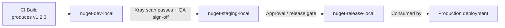

# JFrog Artifactory — Senior .NET Interview Guide

> Audience: 10-year .NET full-stack engineer prepping for senior/lead interviews. Assumes fundamentals of CI/CD and package management are known. Focus is on nuance, trade-offs, and the "why" behind design decisions.

## Table of Contents

- [Core Concepts](#core-concepts)
  - [What is JFrog Artifactory](#what-is-jfrog-artifactory)
  - [Why Use It](#why-use-it)
  - [Key Features](#key-features)
- [Repository Types](#repository-types)
  - [Local, Remote, Virtual Repositories](#local-remote-virtual-repositories)
  - [[new content] Resolution Order in Virtual Repositories](#new-content-resolution-order-in-virtual-repositories)
  - [[new content] NuGet-Specific Repository Setup for .NET Teams](#new-content-nuget-specific-repository-setup-for-net-teams)
- [Using Artifactory in a Pipeline](#using-artifactory-in-a-pipeline)
  - [Manual Upload/Download Examples](#manual-uploaddownload-examples)
  - [JFrog CLI](#jfrog-cli)
  - [GitHub Actions Example](#github-actions-example)
  - [[new content] Azure DevOps / dotnet CLI Integration](#new-content-azure-devops--dotnet-cli-integration)
- [Intermediate Topics](#intermediate-topics)
  - [[new content] Artifact Promotion Between Environments](#new-content-artifact-promotion-between-environments)
  - [[new content] Retention and Cleanup Policies](#new-content-retention-and-cleanup-policies)
  - [[new content] Build-Info, Provenance, and SBOM](#new-content-build-info-provenance-and-sbom)
- [Advanced Topics](#advanced-topics)
  - [[new content] JFrog Xray — Security & License Scanning](#new-content-jfrog-xray--security--license-scanning)
  - [[new content] Immutability, Versioning, and Reproducible Builds](#new-content-immutability-versioning-and-reproducible-builds)
  - [[new content] Access Tokens, Identity, and Securing Feeds](#new-content-access-tokens-identity-and-securing-feeds)
  - [[gaps] Terraform Provider for Artifactory and CDKTF-Driven Provisioning](#gaps-terraform-provider-for-artifactory-and-cdktf-driven-provisioning)
  - [High Availability & Scalability](#high-availability--scalability)
- [Best Practices](#best-practices)
- [Common Pitfalls](#common-pitfalls)
- [[new content] Artifactory vs Azure Artifacts vs Nexus](#new-content-artifactory-vs-azure-artifacts-vs-nexus)
- [Advantages and Disadvantages](#advantages-and-disadvantages)
- [Popular Use Cases](#popular-use-cases)
- [Sample Interview Q&A](#sample-interview-qa)
- [Summary of Additions](#summary-of-additions)
- [Summary of \[gaps\] Additions (This Pass)](#summary-of-gaps-additions-this-pass)

---

## Core Concepts

### What is JFrog Artifactory

JFrog Artifactory is a **universal binary repository manager**. It stores, versions, and distributes build artifacts (packages, containers, libraries) in a secure, scalable, access-controlled way, and sits at the center of a DevOps toolchain as the single source of truth for "what got built and what got shipped."

At a senior level, the key framing an interviewer wants to hear: Artifactory is not just "a place to put NuGet packages" — it's the **artifact provenance and supply-chain control point** between source control and production. Every binary that reaches production should be traceable back to the exact commit, build, and dependency set that produced it.

### Why Use It

- Acts as a **central repository** for binaries, Docker images, Helm charts, and other build artifacts.
- Supports multiple package types: Maven, npm, **NuGet**, PyPI, Docker, Helm, RPM, etc. — one platform instead of many single-purpose registries (npm registry, NuGet.org proxy, Docker Hub, etc.).
- Provides **caching and proxying** for external repositories (Maven Central, npm registry, NuGet.org, Docker Hub) — reduces external dependency on third-party registries and speeds up builds.
- Integrates with CI/CD tools: Jenkins, GitHub Actions, GitLab CI/CD, Azure DevOps, etc.
- Enhances security with access control, vulnerability scanning (Xray), and license compliance.
- Available as **Cloud (SaaS)** or **On-Premises (self-hosted)** deployment.

**Why this matters over "just use NuGet.org / npmjs.com directly":**
- **Supply-chain risk** — a public registry outage, a yanked package, or a malicious dependency (typosquatting, dependency confusion attacks) can break or compromise your build. A private proxy/cache gives you control and a fallback.
- **Compliance** — regulated industries need an auditable, access-controlled artifact store; you can't point production builds directly at the public internet.
- **Performance** — caching means repeat builds don't re-download the same package from the internet every time (huge in CI at scale).

### Key Features

1. **Repository Management** — local, remote, and virtual repositories; fine-grained access control per repository (and per path, via permission targets).
2. **Universal Binary Repository** — Maven, Gradle, npm, NuGet, Docker, PyPI, etc., with dependency management semantics native to each package type.
3. **Build Integration** — Jenkins, Azure DevOps, GitHub Actions, Bitbucket Pipelines; artifact storage, versioning, build-info capture.
4. **Security & Compliance** — Xray scanning for vulnerabilities/license issues; access tokens, LDAP, SSO, RBAC.
5. **High Availability & Scalability** — multi-node clustering, geo-replication for distributed teams.

---

## Repository Types

### Local, Remote, Virtual Repositories

| Type | Purpose | Example | Who writes to it |
|---|---|---|---|
| **Local** | Stores internally developed/built artifacts | A NuGet repo storing your team's `.nupkg` files | Your CI pipeline (push) |
| **Remote** | Proxy/cache for an external repository | Caches packages from NuGet.org or npm registry | Artifactory itself (pull-through cache); read-only to consumers |
| **Virtual** | Aggregates multiple local + remote repos behind one URL | One endpoint serving both your internal NuGet feed and cached NuGet.org packages | N/A — it's a routing/aggregation layer, not physical storage |

**The single most important interview point:** developers and CI should almost always be pointed at a **virtual** repository, never directly at local or remote repos. This gives you one stable URL/feed regardless of how the backing repos are reorganized later, and it's what enables transparent promotion and proxying.

### [new content] Resolution Order in Virtual Repositories

A virtual repository resolves a request by checking its member repositories **in a configured order** (local repos first is the typical/recommended pattern, then remote/cached repos). This matters a lot for two reasons:

1. **Correctness** — if an internal package name collides with a public one (e.g., someone publishes an internal package named `Newtonsoft.Json.Internal` or, worse, accidentally shadows a real public package name), resolution order determines which one wins.
2. **Dependency confusion attacks (a hot 2024-2026 topic)** — this is the exact vulnerability class where an attacker publishes a malicious package on the public registry with the same name as your internal/private package. If your virtual repo is misconfigured to check remote before local, or if your feed doesn't scope package names properly, the build can silently pull the attacker's package instead of your internal one. Mitigations:
   - Always resolve local repos before remote in the virtual repo configuration.
   - Use scoped/prefixed internal package names (e.g., `Contoso.*`) that are unlikely to collide.
   - Consider "include/exclude patterns" on remote repositories to block your internal namespace from ever being resolved externally.

```mermaid
flowchart LR
    Dev[Developer / CI Build] -->|nuget restore| VR[Virtual Repo: nuget-virtual]
    VR --> LR[Local Repo: nuget-local\n(internal packages)]
    VR --> RR[Remote Repo: nuget-remote\n(proxy/cache of NuGet.org)]
    RR -->|cache miss| Ext[(NuGet.org)]
    LR -->|checked first| Result[Package returned to build]
    RR -->|checked if not found locally| Result
```

### [new content] NuGet-Specific Repository Setup for .NET Teams

For a .NET shop, the practical setup an interviewer expects you to know:

- Create a **NuGet local repo** (e.g., `nuget-local`) for artifacts your teams publish.
- Create a **NuGet remote repo** (e.g., `nuget-remote`) pointing at `https://api.nuget.org/v3/index.json` to proxy/cache public packages.
- Create a **NuGet virtual repo** (e.g., `nuget`) combining both; this is the single feed URL every `nuget.config` / `NuGet.Config` and CI job should reference.
- Configure via `NuGet.Config`:

```xml
<?xml version="1.0" encoding="utf-8"?>
<configuration>
  <packageSources>
    <clear />
    <add key="corp-artifactory" value="https://artifactory.example.com/artifactory/api/nuget/v3/nuget" />
  </packageSources>
  <packageSourceCredentials>
    <corp-artifactory>
      <add key="Username" value="%ARTIFACTORY_USER%" />
      <add key="ClearTextPassword" value="%ARTIFACTORY_API_KEY%" />
    </corp-artifactory>
  </packageSourceCredentials>
</configuration>
```

- Push a package:
```bash
dotnet nuget push my-package.1.0.0.nupkg -s corp-artifactory -k %ARTIFACTORY_API_KEY%
```
- Gotcha: Artifactory supports both the legacy NuGet v2 protocol endpoint and the v3 (JSON-based, faster) endpoint — always prefer v3 (`api/nuget/v3/<repo>`) for modern `dotnet` CLI tooling; v2 is slower and mainly there for legacy `nuget.exe` compatibility.

---

## Using Artifactory in a Pipeline

### Manual Upload/Download Examples

**Uploading an artifact (Maven example) via cURL:**
```bash
curl -u user:password -T my-app.jar \
  "http://artifactory.example.com/artifactory/libs-release-local/com/myapp/my-app/1.0.0/my-app-1.0.0.jar"
```

**Pulling a Docker image:**
```bash
docker login artifactory.example.com
docker pull artifactory.example.com/my-repo/my-image:latest
```

### JFrog CLI

```bash
# Install
curl -fL https://getcli.jfrog.io | sh

# Configure credentials (interactive)
./jfrog config add

# Upload an artifact
./jfrog rt upload "build/*.jar" libs-release-local/
```

The JFrog CLI is preferred over raw `curl`/`docker` commands in real pipelines because it: handles retries/checksums, supports **build-info collection** (`jfrog rt build-collect-env`, `build-publish`), and integrates with Xray scanning (`jfrog rt build-scan`) in one consistent tool across package types.

### GitHub Actions Example

```yaml
name: Build and Deploy to JFrog
on: push

jobs:
  build:
    runs-on: ubuntu-latest
    steps:
      - name: Checkout Code
        uses: actions/checkout@v3

      - name: Setup JFrog CLI
        run: |
          curl -fL https://getcli.jfrog.io | sh
          ./jfrog config add my-artifactory --url=https://artifactory.example.com --user=${{ secrets.ARTIFACTORY_USER }} --password=${{ secrets.ARTIFACTORY_PASSWORD }}

      - name: Build and Upload Artifact
        run: |
          ./jfrog rt upload "dist/*.jar" my-repo/
```

> **Note on the source example:** using a raw username/password via `--password` in CI is functionally correct but not best practice. Prefer the official `jfrog/setup-jfrog-cli` GitHub Action, which supports OIDC-based token exchange (no long-lived secret stored in GitHub at all) — see [Access Tokens, Identity, and Securing Feeds](#new-content-access-tokens-identity-and-securing-feeds) below.

### [new content] Azure DevOps / dotnet CLI Integration

Since this audience is a .NET shop, Azure DevOps is more likely than GitHub Actions in practice. Two common integration patterns:

1. **Native Azure Artifacts + Artifactory as upstream** — Azure Artifacts feed configured with Artifactory's NuGet virtual repo as an upstream source (less common, adds a hop).
2. **Direct Artifactory integration (typical enterprise pattern)** — use the **JFrog Azure DevOps extension** (marketplace task) or plain CLI steps in YAML:

```yaml
steps:
  - task: NuGetAuthenticate@1
  - script: |
      dotnet restore --source https://artifactory.example.com/artifactory/api/nuget/v3/nuget
      dotnet build
      dotnet nuget push "**/*.nupkg" -s https://artifactory.example.com/artifactory/api/nuget/v3/nuget -k $(ARTIFACTORY_API_KEY)
    displayName: 'Restore, Build, Push to Artifactory'
```

Interviewers will probe on **credential management** here — expect a question like "how do you avoid hardcoding the API key in the YAML?" Answer: Azure DevOps variable groups backed by Azure Key Vault, or service connections, injected as pipeline secrets/masked variables, never committed to the repo.

---

## Intermediate Topics

### [new content] Artifact Promotion Between Environments

A recurring senior-level question: **"How do you promote a build from dev to staging to production without rebuilding it?"** This is one of Artifactory's core value propositions and is thin/missing in the original notes.

**The principle: build once, promote many times.** You never rebuild the same binary for each environment — you build it once, and *move/copy/tag* that exact same artifact through repositories that represent pipeline stages. This guarantees what's tested is exactly what ships (no "works in staging, different binary in prod" drift).

Typical repo layout: `nuget-dev-local` → `nuget-staging-local` → `nuget-release-local` (or property/tag-based promotion within a single repo using metadata like `promotion.status=released`).



Mechanics:
- `jfrog rt build-promote` (JFrog CLI) or the **Promotion API** (`POST /api/build/promote/{buildName}/{buildNumber}`) moves/copies artifacts and their build-info between repos, optionally adding properties.
- Promotion can be gated on **Xray scan results** (no critical CVEs) and/or manual approval, which is exactly how release governance is implemented without re-running the build.
- Because it's the same physical artifact (same checksum/SHA256) moving through the pipeline, you get true immutability guarantees — critical for audits ("prove that what's in prod is what was scanned and approved").

### [new content] Retention and Cleanup Policies

Thin in the original notes — no mention of cleanup at all, and this is a very common operational/cost question.

Why it matters: local repos accumulate snapshot/pre-release builds and cached remote artifacts indefinitely by default, which drives storage cost and slows searches/indexing.

Approaches:
- **Retention policies / cleanup policies** (Artifactory has a native cleanup policy feature in modern versions) — define rules like "delete artifacts older than N days with no downloads in the last M days" for non-release repos.
- **AQL (Artifactory Query Language)**-driven cleanup scripts — the classic/portable approach, run on a schedule (e.g., via Jenkins job or JFrog Pipelines):
```sql
items.find({
  "repo": "nuget-dev-local",
  "created": {"$before": "30d"}
})
```
  then feed the result set into a delete operation.
- **Remote repo cache eviction** — cached artifacts from remote repos can be evicted on an unused-for-N-days basis independent of retention on local repos; this is pure cache hygiene, not a compliance concern.
- **Keep release repos exempt** — cleanup policies should almost always exclude `*-release-local` repos; only prune dev/snapshot/staging repos. Interviewers want to hear that you distinguish "safe to prune" from "must retain for audit" repos.
- Consider legal/compliance retention minimums (e.g., SOX, industry-specific rules) before deleting anything from a release or audit-relevant repo — retention policy should be a deliberate, documented decision, not just "delete old stuff to save disk."

### [new content] Build-Info, Provenance, and SBOM

Increasingly a hot topic (supply-chain security regulations, SLSA framework, Executive Order-driven SBOM requirements in the US as of the 2020s) and completely absent from the original notes.

- **Build-info** is a JSON blob Artifactory can capture per build: which artifacts were produced, which dependencies were resolved (with checksums), the CI job/VCS revision that produced it, environment variables, and issues/commits (if integrated with a tracker). Published via `jfrog rt build-publish` or automatically when using the JFrog CLI's build-aware upload/download commands.
- This build-info is what powers **promotion**, **build comparison** ("what changed between build 41 and 42"), and **full traceability** from a running production binary back to source commit.
- **SBOM (Software Bill of Materials)** — Xray/Artifactory can generate SBOMs (CycloneDX / SPDX format) from build-info + dependency graph. This is increasingly a hard compliance requirement for vendors selling into government/enterprise customers.
- **Provenance** — combined with signing (see immutability section below), build-info + SBOM gives you a chain of custody: source commit → build → dependencies resolved → artifact produced → scan results → promotion history → deployment. This is exactly what SLSA (Supply-chain Levels for Software Artifacts) framework compliance requires, and is a very live interview topic in 2025-2026 given increased supply-chain attack activity (e.g., SolarWinds-style incidents, npm/PyPI supply chain compromises).

---

## Advanced Topics

### [new content] JFrog Xray — Security & License Scanning

The original notes mention Xray only in passing ("scans artifacts for vulnerabilities"). At senior level you should be able to explain the mechanism and trade-offs, not just the existence of the feature.

- Xray performs **recursive dependency-graph analysis** — it doesn't just scan the artifact you built, it unpacks it and walks the full transitive dependency tree, matching each component against a vulnerability database (CVEs) and license database.
- Two integration points:
  1. **Repository-level scanning** — scans everything landing in a watched repo (continuous, catches newly-disclosed CVEs in *already-stored* artifacts, not just at build time).
  2. **Build-level scanning** (`jfrog rt build-scan`) — scans a specific build's dependency graph as part of CI, can **fail the pipeline** if policy violations are found (block on critical CVE, block on disallowed license like GPL in a proprietary product).
- **Why repo-level scanning matters more than people expect:** a package can be clean when you build against it, then a CVE gets disclosed for that exact version six months later. Xray's continuous scanning re-flags artifacts already sitting in your repos, which build-time-only scanning (e.g., a one-off `dotnet list package --vulnerable` check) would never catch.
- License compliance: Xray can flag/block copyleft licenses (GPL, AGPL) that are incompatible with a closed-source product — a real concern for enterprise legal teams and a common senior-interview trick question ("how do you stop someone accidentally pulling in a GPL-licensed library?").
- Trade-off/gotcha: Xray is a **paid add-on**, not included in free/base Artifactory tiers — worth mentioning as a licensing nuance interviewers may probe ("what's free vs. paid in the JFrog platform?").

### [new content] Immutability, Versioning, and Reproducible Builds

- Local repositories in Artifactory should generally be configured **immutable for release artifacts** — once `my-app-1.0.0.nupkg` is published, it should never be overwritten with different bytes under the same version number. This is enforced by repository configuration (disallow overwrite) and by team convention (semantic versioning discipline).
- Contrast: **snapshot/pre-release repos** (e.g., Maven-style `-SNAPSHOT`, or NuGet pre-release suffixes like `-beta`, `-ci`) are expected to be mutable/overwritable — that's the whole point of a snapshot.
- Why this matters: if `1.0.0` can silently change contents, you lose the ability to reason about what's deployed anywhere — cache poisoning becomes possible (a build server caches the "old" 1.0.0 while another environment pulls the "new" 1.0.0), and rollback becomes unreliable.
- Checksums (SHA-1/SHA-256) stored per artifact let Artifactory (and consumers) detect tampering or accidental overwrite — this ties directly into supply-chain integrity verification and is part of why build-info/provenance tracking works at all.
- **Reproducible builds** (a stretch/advanced topic some interviewers probe): the ideal is that rebuilding from the same commit + locked dependency versions produces a bit-for-bit identical artifact. Artifactory doesn't guarantee this itself (it's a build-tooling concern — deterministic compilation, locked lockfiles/`packages.lock.json`), but immutable storage + build-info is the piece of infrastructure that makes verifying reproducibility possible.

### [new content] Access Tokens, Identity, and Securing Feeds

Original notes mention "access tokens, LDAP, SSO, RBAC" as a bullet with no depth. Senior interviewers will drill into *how* credentials should actually be handled.

- **API Keys (legacy)** — deprecated by JFrog in favor of access tokens; if you see API keys in older docs/examples, know that JFrog's current guidance is to migrate off them.
- **Access Tokens** — scoped, expiring, revocable tokens (JWT-based) that can be scoped to a specific identity, repo, and permission set — the modern recommended credential for CI.
- **Platform-native identity mapping / OIDC** — the current best practice (as of recent JFrog platform versions): configure an OIDC trust relationship between Artifactory and the CI provider (GitHub Actions, Azure DevOps) so the pipeline exchanges a short-lived OIDC token for a short-lived Artifactory access token **at runtime** — no long-lived secret stored in the CI system at all. This directly addresses the "secrets sprawl" problem where `ARTIFACTORY_PASSWORD` sits in a secrets vault for years.
- **RBAC / Permission Targets** — permissions are assigned per repository (or repo path pattern) to users or groups, not globally — a senior point to make: least-privilege means giving CI service accounts *write* only to the specific local repo they publish to, and *read* only on the virtual repo they consume from, not admin/global rights.
- **LDAP/SSO (SAML/OIDC for human users)** — centralizes identity so artifact access follows the same offboarding/lifecycle process as the rest of corporate identity — important for audit ("prove that a terminated employee's access was revoked everywhere, including Artifactory").
- Gotcha interviewers like to raise: rotating a shared service-account password used across a dozen pipelines is painful and risky (coordination, downtime); scoped, short-lived, per-pipeline tokens (or OIDC federation) avoid this entirely.

### [gaps] Terraform Provider for Artifactory and CDKTF-Driven Provisioning

Everything in the Repository Types and Intermediate Topics sections above (local/remote/virtual repos, permission targets, retention policies) is described as something you'd configure through the Artifactory UI or ad hoc REST calls. For a candidate whose actual IaC tooling is Terraform/CDKTF, this is a real gap: repository and permission-target setup should be reasoned about as code, not manual clicking, and this is a concrete, likely interview probe ("how would you provision a new team's Artifactory repos without touching the UI?").

**The `jfrog/artifactory` Terraform provider** treats every Artifactory object covered elsewhere in this guide as a first-class Terraform resource:

```hcl
terraform {
  required_providers {
    artifactory = {
      source  = "jfrog/artifactory"
      version = "~> 12.0"   # verify current major version against the provider registry at implementation time
    }
  }
}

provider "artifactory" {
  url          = "https://artifactory.example.com/artifactory"
  access_token = var.artifactory_access_token   # short-lived/scoped token, not a shared password — ties back to the Access Tokens section above
}

resource "artifactory_local_nuget_repository" "nuget_local" {
  key = "nuget-local"
}

resource "artifactory_remote_nuget_repository" "nuget_remote" {
  key           = "nuget-remote"
  url           = "https://api.nuget.org/v3/index.json"
  feed_context_path = "api/v3"
}

resource "artifactory_virtual_nuget_repository" "nuget_virtual" {
  key          = "nuget"
  repositories = [
    artifactory_local_nuget_repository.nuget_local.key,
    artifactory_remote_nuget_repository.nuget_remote.key,
  ]
  # resolution order matches the local-first pattern from the dependency-confusion discussion above
}

resource "artifactory_permission_target" "order_team_nuget" {
  name = "order-team-nuget-publish"

  repo {
    repositories = [artifactory_local_nuget_repository.nuget_local.key]
    actions {
      users {
        name        = "svc-order-ci"
        permissions = ["read", "write", "annotate"]
      }
    }
  }
}
```

Why this matters at a senior level, tying back to earlier sections in this guide:
- **Repeatable, reviewable repo provisioning** — a new local/remote/virtual repo triple (the exact pattern from the [NuGet-Specific Repository Setup](#new-content-nuget-specific-repository-setup-for-net-teams) section above) becomes a PR-reviewed module instead of a runbook of manual UI steps someone might skip a step on.
- **Permission targets as code** — the least-privilege RBAC principle from the Access Tokens section ("CI service accounts get write only to the specific local repo they publish to") is much easier to *enforce* and *audit* when it's a `artifactory_permission_target` resource in version control than a permissions checkbox grid in the UI that nobody remembers to review.
- **Drift detection** — `terraform plan` surfaces any repo/permission-target change made outside of Terraform (e.g., someone manually adding a repo via the UI), the same drift-detection value proposition GitOps brings to Kubernetes deployments, applied here to artifact-repository configuration instead.
- **Consistency across environments** — the same module provisions `nuget-dev-local`/`nuget-staging-local`/`nuget-release-local` (the promotion-stage repo layout from the [Artifact Promotion](#new-content-artifact-promotion-between-environments) section) with parameterized names instead of hand-recreating the pattern per environment.

**CDKTF-driven provisioning** — since CDKTF is the candidate's actual day-to-day IaC surface (TypeScript/C# instead of raw HCL), the same `jfrog/artifactory` provider is consumable through CDKTF bindings, letting repository/permission-target provisioning live in the same codebase and language as the rest of the platform's infrastructure constructs (e.g., a shared "new-service onboarding" CDKTF construct that provisions an ECS service, its IAM role, *and* its Artifactory NuGet repo + permission target together) rather than treating Artifactory as an out-of-band, UI-managed system separate from everything else already under IaC.

**Interviewer follow-up to expect:** "What's the practical benefit over just clicking through the Artifactory UI once?" — Answer: it's not about the one-time setup cost (the UI is faster for a single ad hoc repo), it's about **repeatability at scale** (onboarding the 40th team the same way as the first, with zero drift), **audit trail** (a PR history of every permission change instead of tribal knowledge of who clicked what), and **tying repo lifecycle to the same review/approval process** as every other piece of infrastructure the org already gates through Terraform/CDKTF plan review.

### High Availability & Scalability

- **Multi-node clustering** — multiple Artifactory nodes behind a load balancer sharing a common database and filestore (or HA-enabled storage), for reliability/failover and horizontal read/write scaling.
- **Geo-replication** — push-based or pull-based replication of repositories across geographically distributed Artifactory instances, so distributed teams (or multi-region CI) read from a local instance instead of crossing continents on every dependency restore. Reduces latency and provides disaster-recovery redundancy.
- **Filestore considerations (verify specifics for your version/edition):** Artifactory typically separates metadata (in a database) from binary storage (filestore — local disk, NFS, or cloud object storage like S3/Azure Blob). Understanding this separation matters for HA/DR planning and is a common systems-design follow-up ("how would you back this up / fail it over?").

---

## Best Practices

- Always point developers/CI at **virtual** repositories, never local/remote directly — gives you a stable abstraction to reorganize behind.
- Enforce **local-repo-first resolution order** in virtual repos to defend against dependency confusion attacks.
- Use **scoped internal package naming conventions** (e.g., a company prefix) to reduce namespace collision risk with public registries.
- Treat release/local repos as **immutable** — no overwrites of published version numbers.
- **Build once, promote many** — never rebuild the same artifact per environment; promote the same binary through repo stages.
- Gate promotion on **Xray scan results** (no unresolved critical CVEs, no disallowed licenses) as an automated policy, not a manual checklist.
- Use **short-lived, scoped access tokens or OIDC federation** for CI credentials instead of long-lived shared passwords/API keys.
- Apply **least-privilege RBAC** per repository/permission target, not blanket admin rights for service accounts.
- Set **retention/cleanup policies** on dev/snapshot repos; explicitly exempt release repos and document retention decisions against compliance requirements.
- Capture and publish **build-info** on every CI build so you retain full traceability and enable promotion/comparison tooling.
- Prefer the **JFrog CLI** or official CI extensions over raw `curl`/manual scripting — you get retries, checksums, build-info, and Xray integration for free.

## Common Pitfalls

- Pointing CI directly at a **remote** repo (bypassing caching) or directly at a **local** repo (bypassing aggregation) instead of the virtual repo — breaks the abstraction and makes future reorganization painful.
- Misconfigured virtual-repo resolution order allowing a public package to shadow an internal one (dependency confusion).
- Treating Xray as "optional" or skipping it in cost-sensitive environments — leaves a supply-chain blind spot; at minimum, gate release promotion on a scan even if full continuous repo scanning isn't licensed.
- Letting dev/snapshot repos grow unbounded — storage costs balloon and search/index performance degrades without cleanup policies.
- Allowing overwrite on release repositories — silently breaks the "immutable artifact = trusted deployment" guarantee and can cause "it worked yesterday" incidents.
- Storing long-lived Artifactory passwords/API keys directly in pipeline YAML or as unscoped secrets — should be masked, scoped, and ideally replaced by OIDC-federated short-lived tokens.
- Forgetting the **v2 vs v3 NuGet protocol** distinction and pointing modern tooling at the slower legacy v2 API endpoint out of habit/old documentation.
- Assuming HA/clustering and Xray are included in every license tier — these are frequently paid add-ons/higher tiers; confirm licensing before assuming a feature is available (a real "disadvantage" called out in the original notes).

---

## [new content] Artifactory vs Azure Artifacts vs Nexus

A very likely question for a senior .NET dev, since Azure Artifacts is the "default" choice in an Azure DevOps shop and interviewers want to know if you can justify a more complex tool.

| Dimension | JFrog Artifactory | Azure Artifacts | Sonatype Nexus Repository |
|---|---|---|---|
| Package type breadth | Very broad (Maven, npm, NuGet, PyPI, Docker, Helm, RPM, Go, Conan, etc.) | Narrower (npm, NuGet, Maven, Python, universal packages); tightly tied to Azure DevOps | Broad, similar to Artifactory (npm, NuGet, Maven, Docker, PyPI, etc.) |
| Multi-cloud / on-prem | Strong — Cloud SaaS or fully self-hosted, cloud-agnostic | Azure DevOps-native; less natural fit outside Azure ecosystem | Strong — self-hosted or cloud, cloud-agnostic |
| Security scanning | Xray (deep, recursive dependency graph, paid add-on) | Basic; typically leans on Defender for DevOps / GitHub Advanced Security for real scanning | Nexus IQ / Lifecycle (paid add-on), comparable depth to Xray |
| CI/CD ecosystem fit | Broadest — plugins/extensions for Jenkins, GitHub Actions, Azure DevOps, GitLab, Bitbucket | Best-in-class *only* if you're all-in on Azure DevOps | Broad, similar plugin ecosystem to Artifactory |
| HA / geo-replication | Enterprise-grade clustering + geo-replication (paid tiers) | Managed by Microsoft; no user-configurable geo-replication | Nexus HA available in Pro tier |
| Typical fit | Large orgs, polyglot tooling, multi-cloud/hybrid, strong governance needs | Teams fully committed to Azure DevOps who want zero extra infra to manage | Cost-sensitive orgs wanting Artifactory-like breadth with a different pricing model |
| Licensing model | Per-feature tiers (OSS/free tier limited; Xray, HA, geo-replication are paid) | Included/bundled with Azure DevOps, billed per-GB storage + retention | Free/OSS core (Nexus OSS), paid Pro tier for IQ/HA |

**The answer an interviewer wants:** "It depends on the org's footprint." If you're 100% Azure DevOps and don't need multi-cloud/polyglot package support beyond NuGet/npm, Azure Artifacts is simpler and has zero extra infrastructure to run. Artifactory (or Nexus) earns its complexity when you have **multiple CI systems, multiple package ecosystems, multi-cloud/on-prem requirements, or need deep security/compliance tooling (Xray/IQ) and governed promotion workflows** that Azure Artifacts doesn't offer natively.

---

## Advantages and Disadvantages

**Advantages**
- Supports multiple package types (Maven, npm, NuGet, Docker, etc.).
- Caching and proxying for faster builds.
- Integrates with CI/CD tools for automated deployments.
- Security scanning with JFrog Xray.
- High availability & scalability with clustering.

**Disadvantages**
- Requires paid licenses for advanced features (Xray, HA, geo-replication).
- Initial setup complexity for self-hosted environments.
- Can require extra storage for large-scale repositories (mitigated by cleanup/retention policies — see above).

## Popular Use Cases

- **CI/CD Pipelines** — storing and managing build artifacts.
- **Docker Image Management** — private container registry.
- **Dependency Management** — proxy for external repositories.
- **Security & Compliance** — vulnerability scanning.

---

## Sample Interview Q&A

**Q: What's the difference between local, remote, and virtual repositories, and which should a developer point their `NuGet.Config` at?**
A: Local repos store artifacts you own/publish; remote repos proxy/cache an external registry; virtual repos aggregate multiple local/remote repos behind one stable URL. Developers and CI should always target the virtual repo — it insulates them from backend reorganization and gives you one feed that serves both internal and cached public packages.

**Q: How would you prevent a dependency confusion attack in Artifactory?**
A: Ensure the virtual repo's resolution order checks local (internal) repos before remote (public proxy) repos, use a distinctive company-prefixed naming convention for internal packages, and optionally configure include/exclude patterns on the remote repo to block resolution of your internal namespace from the public source entirely.

**Q: Explain "build once, promote many" and why it matters.**
A: You build a binary exactly once in CI, then move/copy that same artifact (with its build-info and checksum intact) through repository stages representing dev → staging → release, typically gated by Xray scan results and/or approvals. This guarantees the artifact tested in staging is byte-for-byte what ships to production — no rebuild-induced drift.

**Q: How do you keep Artifactory storage costs under control?**
A: Retention/cleanup policies (or AQL-driven scripts) on dev/snapshot repos based on age and download activity, remote-repo cache eviction for unused cached artifacts, and explicitly exempting release/audit-relevant repos from any automated deletion.

**Q: What's the role of JFrog Xray, and where does it plug into the pipeline?**
A: Xray does recursive dependency-graph vulnerability and license scanning, both continuously at the repository level (catching newly disclosed CVEs in already-stored artifacts) and at build time (`build-scan`), where it can fail a pipeline or block promotion on policy violations (critical CVEs, disallowed licenses like GPL in closed-source code).

**Q: How should CI authenticate to Artifactory — and what's wrong with a shared username/password in pipeline YAML?**
A: Prefer scoped, short-lived access tokens, or better, OIDC federation between the CI provider and Artifactory so no long-lived secret is stored at all. A shared password baked into YAML/secrets is a single point of compromise, hard to rotate without downtime across all consuming pipelines, and typically over-privileged relative to least-privilege RBAC on specific repos.

**Q: When would you choose Artifactory over Azure Artifacts in an all-Azure-DevOps shop?**
A: When you need polyglot package support beyond what Azure Artifacts covers well, multi-cloud/on-prem flexibility, deeper security/license scanning (Xray vs. what's bundled in Azure DevOps), or governed multi-stage promotion workflows — otherwise Azure Artifacts is the lower-overhead default.

**Q: What guarantees immutability of a released NuGet package, and why does it matter?**
A: Repository configuration that disallows overwriting an existing version's artifact, combined with semantic versioning discipline (never reuse a version number) and checksum verification. It matters because deployments, rollbacks, and audits all assume that "version 1.0.0" means exactly one set of bytes, forever — mutable release artifacts break reproducibility and can mask supply-chain tampering.

**Q: What is build-info and how does it relate to SBOM/provenance?**
A: Build-info is metadata Artifactory captures per CI build — artifacts produced, dependencies resolved (with checksums), source revision, environment. It's the foundation for promotion, build comparison, and generating an SBOM (CycloneDX/SPDX) — together giving full chain-of-custody from commit to deployed artifact, which is increasingly a compliance requirement (SLSA framework, government SBOM mandates).

---

## Summary of Additions

The original source was a generic, AI-style overview of Artifactory with no genuine personal notes, unanswered questions, or TODOs to resolve — so no "answer everything" work was needed on existing content. All original material was preserved and reorganized. The following `[new content]` sections were added to close real gaps for a senior .NET interview:

1. **Resolution Order in Virtual Repositories** — covers dependency confusion attacks, a live supply-chain-security interview topic entirely absent from the source.
2. **NuGet-Specific Repository Setup for .NET Teams** — the source only spoke generically about "supports NuGet"; added concrete `.NET`-relevant config (`NuGet.Config`, v2 vs v3 protocol) since this audience is a .NET dev.
3. **Azure DevOps / dotnet CLI Integration** — source only had a GitHub Actions example; added the more relevant Azure DevOps YAML pattern and credential-handling follow-up.
4. **Artifact Promotion Between Environments** — "build once, promote many" is a core Artifactory value proposition and a near-guaranteed senior interview question; was completely missing.
5. **Retention and Cleanup Policies** — storage/cost management was only mentioned as a "disadvantage" with no mitigation discussion; added policy mechanics and AQL example.
6. **Build-Info, Provenance, and SBOM** — supply-chain traceability/compliance (SLSA, SBOM mandates) is a hot current topic and wasn't mentioned at all.
7. **JFrog Xray — Security & License Scanning** — original notes only name-dropped Xray; added mechanism (recursive scanning, repo-level vs build-level), license-compliance angle, and licensing-tier gotcha.
8. **Immutability, Versioning, and Reproducible Builds** — critical for reasoning about deployment safety and rollback; not covered in source.
9. **Access Tokens, Identity, and Securing Feeds** — source had a bare bullet ("supports access tokens, LDAP, SSO, RBAC"); added the real depth interviewers probe (API keys vs access tokens vs OIDC federation, least-privilege RBAC).
10. **Artifactory vs Azure Artifacts vs Nexus** — comparison table for a highly likely "why not just use X" interview question, especially relevant since the audience is in the Azure/.NET ecosystem.

**Contradictions flagged:** None — the source content was internally consistent (a single generic pass, not conflicting personal notes from multiple sessions). No genuine contradictions required flagging; where the source was thin rather than wrong, it was supplemented rather than corrected.

## Summary of `[gaps]` Additions (This Pass)

A follow-up gap-analysis review flagged that this guide described all repository/permission-target setup as manual UI configuration, with no connection to infrastructure-as-code — a real gap given the candidate's actual IaC tooling is Terraform/CDKTF. One `[gaps]`-tagged section was added to close this:

1. **Terraform Provider for Artifactory and CDKTF-Driven Provisioning** — added the `jfrog/artifactory` Terraform provider as the concrete mechanism for provisioning local/remote/virtual NuGet repos and permission targets as code, with a worked example that mirrors the exact repo-triple pattern already described in the NuGet-Specific Repository Setup section earlier in this guide. Explicitly connected this to three things already covered elsewhere in the guide: least-privilege RBAC (permission targets as reviewable code instead of a UI checkbox grid nobody audits), "build once, promote many" (parameterized modules provisioning the dev/staging/release repo layout consistently per environment), and GitOps-style drift detection (`terraform plan` surfacing manual out-of-band UI changes). Also connected CDKTF specifically — since that's the candidate's actual day-to-day IaC surface — as the way Artifactory provisioning can live in the same codebase/language as the rest of the platform's infrastructure rather than being treated as an out-of-band, UI-managed system.
