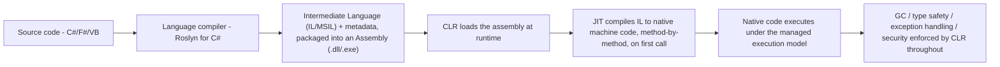
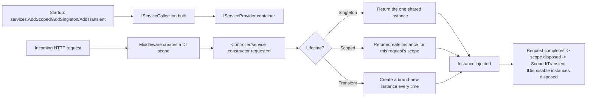
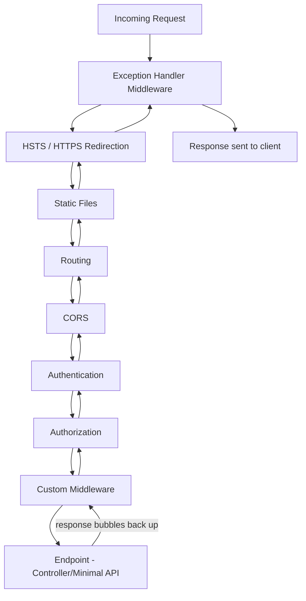
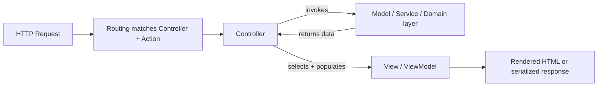
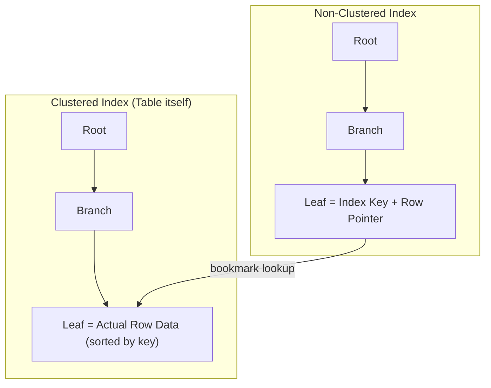
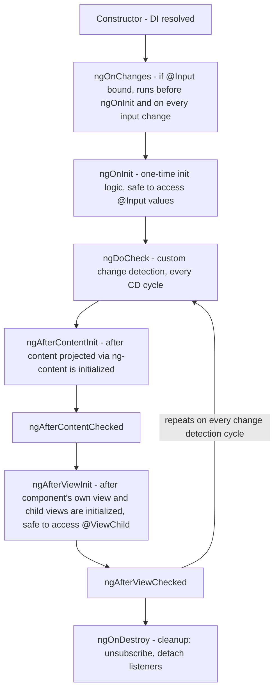
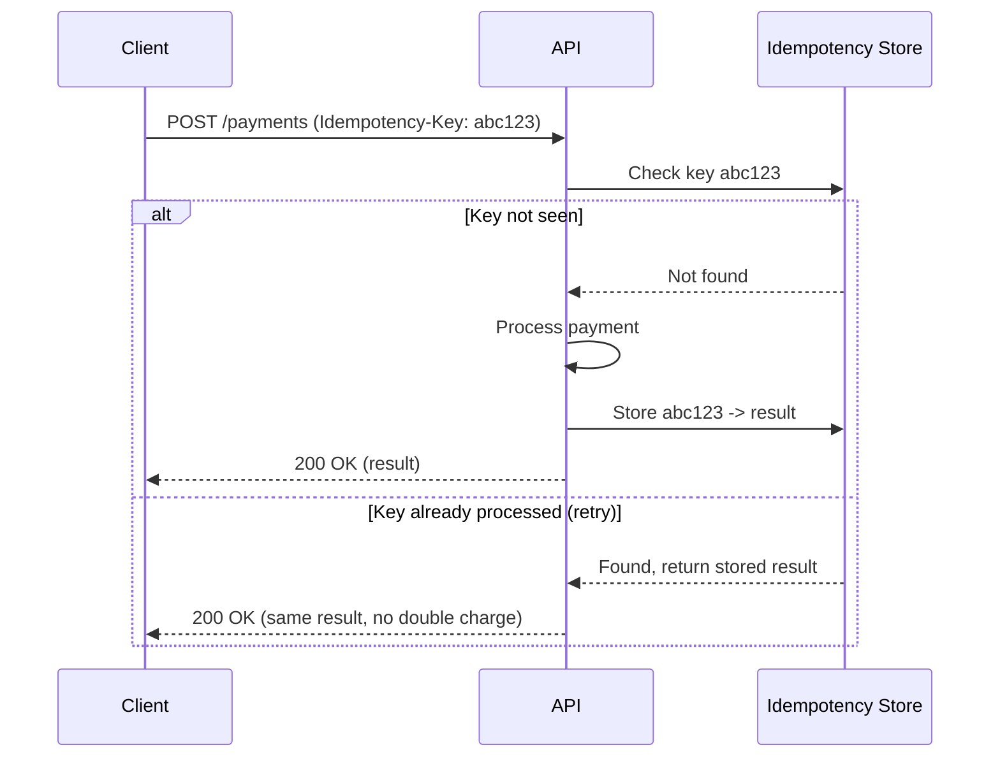

# Interview Questions — Senior .NET Full-Stack Interview Guide

> Consolidated, de-duplicated, and fully answered from raw grab-bag interview question lists (general background, C# OOP, coding round, EF, SQL, Angular, .NET Core/API, and a second SQL pass). Pitched for a 10-year .NET full-stack developer interviewing at senior/lead level in 2026.

## Table of Contents

1. [Tell Me About Yourself / Project Experience](#tell-me-about-yourself--project-experience)
2. [C# Language & OOP](#c-language--oop)
3. [Async, Threading & Concurrency](#async-threading--concurrency)
4. [.NET Core / ASP.NET Core & Middleware](#net-core--aspnet-core--middleware)
5. [Authentication, Authorization & API Design](#authentication-authorization--api-design)
6. [Design Patterns & SOLID](#design-patterns--solid)
7. [Entity Framework (Core)](#entity-framework-core)
8. [SQL](#sql)
9. [Angular / TypeScript](#angular--typescript)
10. [Coding Round](#coding-round)
11. [Gap Analysis — Senior-Level Topics Not in the Original List](#gap-analysis--senior-level-topics-not-in-the-original-list)
12. [Summary of Additions](#summary-of-additions)
13. [Contradictions / Ambiguities Flagged](#contradictions--ambiguities-flagged)

---

## Tell Me About Yourself / Project Experience

### 1. Tell me briefly about yourself and your project experience

This is a narrative question — the interviewer is testing communication, seniority signaling, and relevance, not facts. Structure it as a 90-second "walk":

- **Frame**: years of experience, primary stack (.NET / C# backend, Angular frontend, SQL Server, Azure/AWS), and the *kind* of systems you build (e.g., high-throughput APIs, data-heavy line-of-business apps, e-commerce, integrations).
- **Depth signal**: pick 1–2 projects where you owned architecture/design decisions, not just implementation — mention a specific hard problem (scaling, a tricky bug, a migration) and the outcome (numbers if possible: "reduced p95 latency from 800ms to 120ms", "cut infra cost 30%").
- **Current role**: what you're doing now, your scope (IC vs leading a team, mentoring, code review ownership, architecture decisions).
- **Close with intent**: why you're looking, and how this role aligns with your trajectory (e.g., wanting more architecture ownership, or a more modern stack).

*(verify: tailor concrete metrics/project names to your actual resume — this guide can't invent your specific history)*

**Interviewer follow-ups to expect**: "What was the hardest technical decision you made on that project?", "What would you do differently?", "Who did you disagree with technically and how was it resolved?"

### 2. Responsibilities in current project

Talk in terms of **ownership**, not tasks: system design, API contracts, DB schema decisions, code review gatekeeping, mentoring juniors, CI/CD pipeline ownership, production incident response. Senior interviewers listen for whether you influence decisions or just execute tickets. Mention cross-team responsibilities (working with QA, DevOps, product) to show full-stack/lead maturity.

### 3. Tech stack you are working on – Backend / Frontend / DevOps

Give a concise stack rundown and, more importantly, **why** those choices were made where you know:
- **Backend**: C# / ASP.NET Core Web API version, EF Core, SQL Server/PostgreSQL, message broker (RabbitMQ/Azure Service Bus/Kafka) if used.
- **Frontend**: Angular version, state management approach (NgRx, services with RxJS, signals), UI library.
- **DevOps**: CI/CD tool (Azure DevOps, GitHub Actions, Jenkins), containerization (Docker/Kubernetes), cloud (Azure/AWS), monitoring (App Insights, Grafana/Prometheus, ELK).

Follow-up to expect: "Why did the team choose X over Y?" — have at least one real trade-off ready (e.g., "we chose NgRx over plain services+RxJS because state was shared across 12+ components and debugging with Redux DevTools mattered more than the boilerplate cost").

---

## C# Language & OOP

### 3a. What is .NET and how does it work?

.NET is a general-purpose development platform — a runtime, a set of base class libraries, and tooling — that lets code written in multiple languages (C#, F#, VB.NET) compile down to a common format and run on a shared execution engine. The pipeline every .NET dev should be able to draw on a whiteboard:



**Managed execution model** — the phrase that ties this together — means the CLR, not the raw OS, is in control of: memory (allocation + GC), type safety (IL is verified so code can't do arbitrary pointer arithmetic outside `unsafe` blocks), structured exception handling (uniform across every .NET language, since they all target the same IL), and security boundaries.

**Senior-level nuance to volunteer**: JIT is not one-shot-and-done. Modern .NET uses **tiered compilation** — Tier 0 does a fast, minimally-optimized JIT pass to get code running quickly, and the runtime instruments hot methods and re-JITs them at Tier 1 with full optimizations once they're proven to matter — a startup-latency vs steady-state-throughput trade-off resolved automatically. For scenarios where even Tier-0 JIT latency is unacceptable (serverless cold starts, CLI tools, containers), .NET 8+ offers **Native AOT**, which compiles straight to native code ahead of time and skips the CLR/JIT step entirely at the cost of losing some dynamic features (reflection-heavy code, runtime codegen).

### 3b. What is CLR (Common Language Runtime)?

The CLR is the managed execution engine that actually hosts and runs compiled .NET assemblies — it's the "runtime" half of ".NET is a runtime + libraries." Its core responsibilities, worth naming explicitly rather than hand-waving as "it runs the code":

- **JIT compilation** — translates IL to native machine code per method, on demand, with tiered (re-)compilation as described above.
- **Memory management** — owns the managed heap and runs the generational GC (Gen 0/1/2 + LOH, detailed under Garbage Collector below); this is what makes C# "managed" instead of manually `malloc`/`free`d like C++.
- **Type safety / verification** — IL is checked so managed code can't perform illegal casts or stray memory access outside explicit `unsafe` blocks — this is a large part of why buffer overruns are rare in pure managed code.
- **Structured exception handling** — a single, uniform exception model that works across every CLR-targeting language, because they all compile to the same IL-level exception constructs.
- **GC hosting and thread/AppDomain management** — schedules and coordinates collections, finalizer queues, and (historically) AppDomain isolation; also provides interop (P/Invoke, COM interop) for crossing into unmanaged code.

**Implementations to know**: **CoreCLR** is the cross-platform CLR that ships with modern .NET (Windows/Linux/macOS); **Mono** is an alternative used historically for mobile/Unity; **Native AOT** removes the need for a CLR/JIT at runtime entirely by compiling ahead of time. Knowing there's more than one CLR implementation, and that "the CLR" isn't synonymous with "Windows," is a good currency signal.

### 3c. What are Assemblies in .NET?

An assembly is the fundamental unit of **deployment, versioning, and type-scoping** in .NET — the physical output of compilation (a `.dll` or `.exe`) containing:
- **IL code** for every type/member it defines,
- **Metadata** describing those types and their signatures (what makes Reflection possible),
- A **manifest** — assembly name, version, culture, and the list of other assemblies it references,
- Optionally embedded resources (strings, images, etc.).

**Assembly vs namespace vs module — a distinction worth being crisp about**: a namespace is purely a logical, compile-time naming construct with no physical existence; an assembly is the physical deployable unit. A single assembly commonly contains many namespaces, and (less commonly but validly) a namespace can span multiple assemblies — they are orthogonal concepts, not synonyms, despite `MyCompany.MyApp.dll` often lining up 1:1 with a `MyCompany.MyApp` namespace by convention.

**Loading and isolation**: the CLR resolves and loads assembly references at runtime. .NET Core replaced the old Framework-era GAC/strong-naming/AppDomain model with **`AssemblyLoadContext`**, which supports side-by-side loading of multiple versions of the same assembly in the same process — the mechanism that makes robust plugin architectures (e.g., loading several plugins that each depend on a different version of a shared library) practical without "assembly binding redirect" hell.

**Why this matters day-to-day**: metadata-driven Reflection is what powers DI container auto-registration, EF Core's convention-based entity scanning, JSON serializers, and AutoMapper — all of them "walk assemblies looking for types/attributes" under the hood, so understanding assemblies as more than "the dll that comes out of the build" pays off when debugging why a type isn't being picked up.

### 4. What is a string in C#? Why is it immutable?

`string` is a sealed reference type (`System.String`) representing a sequence of UTF-16 characters, stored on the heap even though it's used with value-like syntax.

**Why immutable:**
- **Thread safety** — multiple threads can read the same string with no locking; you can't get torn/partial reads.
- **String interning / caching** — the CLR maintains an intern pool for literals; if strings were mutable, one reference mutating the literal would corrupt every other reference to the same interned value.
- **Hashing reliability** — strings are used heavily as dictionary/hashset keys. A mutable key that changes after insertion would break the hash bucket it lives in.
- **Security** — immutable strings can't be altered after being validated (e.g., a filename or SQL fragment can't be changed via reference after security checks).

Every apparent "mutation" (`s += "x"`, `.Replace()`, `.ToUpper()`) actually allocates a **new** string and leaves the original untouched. This is why heavy string concatenation in a loop is a classic performance gotcha — O(n²) allocations — and why `StringBuilder` (mutable internal char buffer) or `string.Create`/`Span<char>` are the fix.

**Follow-up**: "How does `StringBuilder` avoid the problem?" — It pre-allocates/grows an internal mutable buffer and only materializes a `string` once, on `.ToString()`.

### 5. Difference between .NET Framework & .NET Core (and .NET 7/8/9)

| Aspect | .NET Framework | .NET Core (→ .NET 5+) |
|---|---|---|
| Platform | Windows only | Cross-platform (Windows/Linux/macOS) |
| Open source | Partially | Fully open source (GitHub) |
| Deployment | Machine-wide GAC install | Self-contained or framework-dependent, side-by-side versions |
| Performance | Slower JIT, older GC | Significantly faster (Server GC improvements, tiered compilation, ReadyToRun) |
| Modularity | Monolithic (System.Web etc.) | NuGet-based, pay-for-what-you-use |
| Web stack | ASP.NET (System.Web, IIS-coupled) | ASP.NET Core (Kestrel, decoupled from IIS) |
| Future | Maintenance mode only (no new features) | Active development, yearly release train |
| Container friendliness | Poor (heavy) | Excellent (small, Linux containers, Docker-first) |

Since .NET 5, "**.NET Core**" was rebranded to just "**.NET**" (5, 6, 7, 8, 9...) to signal it's the *one* .NET going forward — .NET Framework 4.8 is the last version and receives only security patches. .NET 8 and .NET 10 are LTS releases (3-year support); odd-numbered releases (7, 9) are STS (18 months) — **(verify current LTS cadence against the version you're targeting, as this policy is sometimes model — as of 2026 .NET 10 is the current LTS)**.

**Follow-up**: "Would you migrate a legacy .NET Framework app to .NET 8? What's the risk?" — Discuss `System.Web` dependency removal, third-party library compatibility, and using the .NET Upgrade Assistant / incremental strangler-fig approach rather than a big-bang rewrite.

### 6. What are Value Types vs Reference Types?

| | Value Types | Reference Types |
|---|---|---|
| Examples | `int`, `struct`, `enum`, `bool`, `DateTime` | `class`, `string`, `object`, arrays, delegates |
| Storage | Stack (or inline in containing object/array) | Heap; variable holds a pointer/reference |
| Assignment | Copies the full value | Copies the reference (both point to same object) |
| Default | Zeroed value (`0`, `false`, etc.) | `null` |
| Passed to methods | By value by default (copy) | Reference copied, but points to same object (so mutations are visible; reassignment is not) |

Gotcha: a `struct` containing reference-type fields still only copies the struct's fields (shallow copy) — the referenced object is shared. Also, boxing a value type (assigning it to `object`) allocates on the heap and incurs a copy — a classic perf gotcha in hot paths (e.g., `ArrayList` pre-generics, or passing `int` into an `object[] args` in old-style logging).

### 7. What are constructors? Parameterized vs Non-parameterized

A constructor initializes an object's state at creation time; it shares the class name and has no return type.

- **Non-parameterized (default) constructor**: no arguments; if you define *any* constructor, the compiler no longer auto-generates the default one — you must declare it explicitly if still needed.
- **Parameterized constructor**: accepts arguments to initialize fields with specific values at construction, enforcing that required state can't be skipped.
- Related, expected follow-ups:
  - **Constructor chaining**: `this(...)` to call another constructor in the same class; `base(...)` to call the parent's constructor.
  - **Static constructors**: run once, before the first instance is created or a static member is accessed; no access modifiers, no parameters.
  - **Primary constructors (C# 12)**: `public class Person(string name, int age) { }` — reduces boilerplate for simple DTOs/records.

```csharp
public class Employee
{
    public string Name { get; }
    public decimal Salary { get; }

    public Employee() : this("Unknown", 0) { }         // chaining
    public Employee(string name, decimal salary)
    {
        Name = name;
        Salary = salary;
    }
}
```

### 8. Method Overloading vs Method Overriding

| | Overloading | Overriding |
|---|---|---|
| Definition | Same method name, different signature, same class (or via inheritance hiding) | Subclass redefines a base class's `virtual`/`abstract` method with the **same** signature |
| Polymorphism type | Compile-time (static) | Runtime (dynamic) |
| Keywords | None required | `virtual` (base) + `override` (derived); or `abstract` + `override` |
| Return type | Can differ | Must match (or be covariant since C# 9) |
| Resolved by | Compiler, based on argument types at call site | CLR, based on actual runtime type of the object |

```csharp
class Shape
{
    public virtual double Area() => 0;
}
class Circle : Shape
{
    public double Radius;
    public override double Area() => Math.PI * Radius * Radius;   // overriding
}
class Calculator
{
    public int Add(int a, int b) => a + b;
    public double Add(double a, double b) => a + b;                // overloading
}
```

**Gotcha**: `new` vs `override` — `new` hides the base member (calls resolved by the *static* type of the reference), while `override` provides true polymorphism (calls resolved by the *runtime* type). Mixing these up is a favorite interview trap:

```csharp
Shape s = new Circle();
s.Area();  // override → Circle.Area() called (polymorphic)
           // if Circle used "new" instead of "override" → Shape.Area() called (0), because s is statically typed as Shape
```

### 9. Explain OOP concepts with real project examples

The four pillars, tied to practical usage a senior dev should be able to narrate instantly:

- **Encapsulation**: private fields + public properties/methods; e.g., an `Order` class exposes `AddItem()` rather than a public mutable `List<Item>`, so business rules (e.g., "can't add items to a shipped order") are enforced in one place.
- **Abstraction**: hiding implementation detail behind an interface — e.g., `IPaymentGateway` with `Stripe`/`PayPal` implementations; calling code doesn't know or care which one is wired up.
- **Inheritance**: shared base behavior — e.g., `BaseRepository<T>` with CRUD, extended by `OrderRepository` for order-specific queries. Caution in interviews: mention that **composition is often preferred over inheritance** in modern design (favors flexibility, avoids fragile base class problem).
- **Polymorphism**: `IEnumerable<IShape>` where `Area()` behaves differently per concrete shape — enables the Strategy/Open-Closed pattern.

### 10. Difference between Interface and Abstract Class

| | Interface | Abstract Class |
|---|---|---|
| Multiple inheritance | A class can implement many interfaces | A class can inherit only one abstract class |
| Members | Contract only (C# 8+ allows default implementations) | Can mix abstract and fully implemented members, fields, constructors |
| State | No instance fields (until recent C# added static members) | Can hold instance state |
| Access modifiers | Members implicitly public (traditionally) | Full access modifier support |
| Use case | "Can-do" capability contract (`IDisposable`, `IComparable`) | "Is-a" shared base with common logic (`Stream`, `Controller`) |
| Versioning | Adding a member breaks all implementers (unless default impl provided) | Adding a concrete method doesn't break subclasses |

Rule of thumb for interviews: **"Interfaces define what an object can do; abstract classes define what an object is, with shared implementation."** Since C# 8, default interface methods blur the line somewhat — know this nuance, and mention it unprompted, it signals currency.

### 11. What are Collections in C#?

Collections are the data-structure types in `System.Collections` (non-generic, legacy, boxing overhead) and `System.Collections.Generic` (type-safe, preferred). Key ones a senior dev should compare fluently:

| Collection | Backing structure | Ordered? | Duplicates? | Typical use |
|---|---|---|---|---|
| `List<T>` | Dynamic array | Yes | Yes | General-purpose ordered list |
| `Dictionary<K,V>` | Hash table | No (insertion order not guaranteed) | Unique keys | O(1) average lookup by key |
| `HashSet<T>` | Hash table | No | No | Fast membership tests, set operations |
| `Queue<T>` | Circular buffer | FIFO | Yes | Task queues, BFS |
| `Stack<T>` | Array-backed | LIFO | Yes | Undo history, DFS |
| `LinkedList<T>` | Doubly-linked nodes | Yes | Yes | Frequent insert/remove mid-list (rare in practice; array locality usually wins) |
| `ConcurrentDictionary<K,V>` | Thread-safe hash table | No | Unique keys | Multi-threaded caches |
| `ImmutableList<T>` etc. | Persistent tree/array | Yes | Yes | Functional/thread-safe scenarios without locks |

**Gotcha**: `Dictionary<K,V>` is *not* thread-safe for concurrent writes — must use `ConcurrentDictionary` or external locking. Also, iterating and mutating a collection in the same loop throws `InvalidOperationException` ("Collection was modified"); fix with `.ToList()` snapshot or `RemoveAll`.

### 12. Explain LINQ with a simple example

LINQ (Language Integrated Query) provides a unified, declarative query syntax over in-memory collections (`IEnumerable<T>` via `System.Linq`) and remote data sources (`IQueryable<T>` via EF Core, translated to SQL).

```csharp
var seniorDevs = employees
    .Where(e => e.YearsExperience >= 8)
    .OrderByDescending(e => e.YearsExperience)
    .Select(e => new { e.Name, e.YearsExperience })
    .ToList();
```

**Key nuance interviewers probe for seniority:**
- **Deferred execution**: `Where`/`Select` build an expression tree/iterator but don't run until enumerated (`ToList()`, `foreach`, etc.). This causes a classic gotcha — querying inside a loop re-executes the query each time unless materialized.
- **`IEnumerable<T>` vs `IQueryable<T>`**: `IEnumerable` LINQ runs in-memory (LINQ to Objects); `IQueryable` builds an **expression tree** that the provider (EF Core) translates into SQL and executes at the database — meaning filtering *before* materializing (`.Where()` before `.ToList()`) pushes work to the DB, while filtering after pulls everything into memory first (huge perf gotcha in EF code reviews).
- **Multiple enumeration**: enumerating an `IEnumerable` twice (e.g., once for `.Any()`, once for `.ToList()`) re-runs the whole pipeline — costly for DB-backed queries; cache with `.ToList()`/`.ToArray()` when reused.

---

## Async, Threading & Concurrency

### 13. What is the Garbage Collector? How does it work?

The GC is .NET's automatic memory manager for the **managed heap**. It reclaims memory for objects no longer reachable from any root (local variables, statics, GC handles, the stack).

**Generational, mark-and-compact model:**
- **Gen 0**: short-lived objects; collected frequently and fast.
- **Gen 1**: buffer between Gen 0 and Gen 2.
- **Gen 2**: long-lived objects (e.g., static caches); collected rarely, most expensive (traverses much more of the heap).
- **LOH (Large Object Heap)**: objects ≥ 85,000 bytes go here directly; collected only during Gen 2 (full) collections; not compacted by default (fragmentation risk) — `GCSettings.LargeObjectHeapCompactionMode` can force compaction.

**Algorithm**: mark phase walks live-object graph from roots; unreachable objects are garbage; Gen 0/1 collections **compact** (move survivors together, update pointers) to avoid fragmentation, which is why Gen 0 collections are cheap despite touching "the whole" generation — it's small and compacts fast.

**Modes**: Workstation vs Server GC (Server GC uses one heap+thread per core, better throughput for services); Background (concurrent) GC lets Gen 2 collection run largely concurrently with app threads to reduce pause times.

**Senior-level talking points / gotchas:**
- `IDisposable`/`using` is still required for **unmanaged** resources (file handles, sockets, DB connections) — GC doesn't know about unmanaged memory; finalizers are a safety net, not a strategy (they add a Gen-2-only cost via the finalization queue).
- **Memory leaks still happen** in .NET via forgotten event handler subscriptions (`+=` never unsubscribed), static collections growing unbounded, or captured closures in long-lived caches.
- `GC.Collect()` should almost never be called manually in production code — it forces a full, expensive collection and fights the GC's own heuristics.
- `Span<T>`/`stackalloc` avoid heap allocation entirely for the hottest paths.

### 14. What are Delegates? Types of delegates

A delegate is a type-safe function pointer — an object that holds a reference to a method (or multiple, via multicast) with a matching signature, enabling methods to be passed as parameters, stored in variables, and invoked indirectly.

**Types:**
- **Single-cast delegate**: custom `delegate` keyword declarations, or the built-in generic forms:
  - `Action<T...>` — no return value.
  - `Func<T..., TResult>` — returns a value.
  - `Predicate<T>` — returns `bool` (specialized `Func<T,bool>`).
- **Multicast delegate**: `+=`/`-=` chain multiple methods; invoking calls them in order; if any return a value, only the **last** invoked method's return value is observed (a classic gotcha) — so multicast is mainly used with `void`-returning delegates like events.
- **Events**: a language feature built on delegates (`event` keyword) that restricts external code to only `+=`/`-=`, preventing outsiders from invoking or clearing the whole handler list — a key encapsulation nuance.

```csharp
public delegate int Operation(int a, int b);

Operation add = (a, b) => a + b;
Func<int,int,int> subtract = (a, b) => a - b;

// Multicast
Action<string> log = Console.WriteLine;
log += msg => File.AppendAllText("log.txt", msg);
log("Both handlers run");
```

**Follow-up**: "How do delegates relate to events and to `IObservable`/Rx?" — Events are delegates with restricted access; Rx (`IObservable<T>`) generalizes the same push-based pattern into a composable, LINQ-queryable stream — conceptually the .NET analog to Angular's RxJS `Observable`.

### 15. Explain Async-Await & Asynchronous Programming in C#

`async`/`await` is syntactic sugar over the **Task-based Asynchronous Pattern (TAP)** that lets you write non-blocking code that reads like sequential code. The compiler rewrites an `async` method into a state machine.

```csharp
public async Task<Order> GetOrderAsync(int id)
{
    var order = await _dbContext.Orders.FindAsync(id);   // yields thread back to caller/pool while I/O is in flight
    var enriched = await _pricingService.EnrichAsync(order);
    return enriched;
}
```

**Key mental model**: `await` doesn't create a new thread. It registers a continuation and **releases** the current thread back to the thread pool (or, on UI-bound code, back to the message loop) while the awaited operation (typically I/O) is in flight, then resumes on a captured context (or a pool thread) when it completes.

**Senior-level nuances/gotchas:**
- **`async void`** should be avoided except for top-level event handlers — exceptions thrown inside can't be awaited/caught by the caller and will crash the process (via `SynchronizationContext` or `AppDomain.UnhandledException`).
- **`ConfigureAwait(false)`**: in library code (not ASP.NET Core, which has no `SynchronizationContext` by default, but still relevant for reusable libraries / WPF/WinForms/old ASP.NET), avoids capturing the original context for the continuation, reducing overhead and deadlock risk.
- **Deadlock classic**: blocking on async code with `.Result` or `.Wait()` in a context that has a `SynchronizationContext` (old ASP.NET, UI apps) deadlocks because the continuation needs that same captured context, which is blocked waiting. ASP.NET Core has no such context by default, but `.Result`/`.Wait()` should still be avoided — use `async` all the way up ("async all the way").
- **`Task` vs `Task<T>` vs `ValueTask<T>`**: `ValueTask<T>` avoids a heap allocation for hot paths where the result is frequently already available synchronously (e.g., a cache hit) — but shouldn't be awaited twice or stored, unlike `Task`.
- **Exception handling**: exceptions in `async` methods are captured into the returned `Task`'s exception state and rethrown on `await`; unobserved task exceptions used to crash process on GC in older .NET — now generally just logged, but "fire and forget" tasks should still always be wrapped with error handling.

### 16. Multithreading vs Async — what's the difference?

This is one of the most misunderstood distinctions and a favorite senior-level probe.

| | Multithreading | Async (async/await) |
|---|---|---|
| Goal | Parallelism — do multiple CPU-bound things **at the same time** | Concurrency — don't block a thread while waiting on I/O |
| Threads used | Actively uses multiple OS threads simultaneously | Frees the current thread during the wait; may resume on a different pool thread, but doesn't require a second thread to be busy-waiting |
| Best for | CPU-bound work (image processing, complex computation) | I/O-bound work (DB calls, HTTP calls, file I/O) |
| Tools | `Thread`, `Task.Run`, `Parallel.For`, `PLINQ` | `async`/`await`, `Task`, `ValueTask` |
| Cost | Thread creation/context switching is relatively expensive; limited by core count | Very cheap — no thread is "spent" while awaiting I/O; scales to thousands of concurrent operations on a small thread pool |

**Key insight to state explicitly**: `async` is not about creating threads — it's about **not wasting a thread on waiting**. `Task.Run` *does* use a thread-pool thread, and should be reserved for CPU-bound work you want to offload from the calling thread (e.g., keep a UI responsive), not for wrapping I/O calls that already have an async API (wrapping `context.SaveChangesAsync()` in `Task.Run` is a common junior mistake — it just burns a pool thread for no benefit).

**Follow-up**: "How would you parallelize CPU-bound work across cores?" — `Parallel.ForEach`/`Parallel.For` or PLINQ (`.AsParallel()`), being mindful of thread-safety of shared state, over-subscription, and diminishing returns beyond core count.

### 17. readonly vs constant (`const`)

| | `const` | `readonly` |
|---|---|---|
| When assigned | Compile time | Runtime (in declaration or constructor) |
| Storage | Baked into IL at every call site (like a literal) | Actual field, evaluated once at construction |
| Static? | Implicitly static (belongs to the type) | Can be instance-level or `static readonly` |
| Allowed types | Primitives, `string`, `enum` (must be a compile-time constant) | Any type, including objects computed at runtime |
| Versioning gotcha | Changing a `const` in a referenced assembly requires **recompiling all consumers** (value is inlined at their compile time) | Changing a `readonly` value doesn't require recompiling consumers — resolved at runtime |

This last row is the answer interviewers are really fishing for — it's a real production gotcha in multi-assembly/NuGet-package scenarios.

### 18. Abstract vs Virtual

| | `abstract` | `virtual` |
|---|---|---|
| Implementation in base | None — no body allowed | Has a default body |
| Must override? | Yes, mandatory in first concrete derived class | Optional |
| Can the base class be instantiated? | No (class must also be `abstract`) | Yes |
| Use case | Force every subtype to define its own behavior (no sensible default) | Provide a default that most subtypes can reuse, but allow customization |

### 19. Extension Methods + Example

Extension methods let you "add" methods to an existing type (including sealed types and types you don't own) without modifying its source or using inheritance — implemented as `static` methods in a `static` class, with `this` on the first parameter.

```csharp
public static class StringExtensions
{
    public static bool IsNullOrBlank(this string? value) =>
        string.IsNullOrWhiteSpace(value);
}

// usage
if (userInput.IsNullOrBlank()) { ... }
```

Under the hood, it's pure syntactic sugar — the compiler rewrites `userInput.IsNullOrBlank()` to `StringExtensions.IsNullOrBlank(userInput)`. This is exactly how all of LINQ (`.Where()`, `.Select()`, etc.) is implemented as extensions on `IEnumerable<T>`.

**Gotcha**: extension methods are resolved at **compile time** based on static type and are always lower priority than instance methods with the same signature — an instance method always wins if one exists. Also, they can be called on a `null` reference without throwing (since it's really just a static method call) — useful for null-safety helpers like the example above, but surprising if you don't know the rule.

---

## .NET Core / ASP.NET Core & Middleware

### 20. What is Dependency Injection in .NET Core? How does it work internally?

DI is a technique for achieving **Inversion of Control**: a class declares its dependencies (typically via constructor parameters) rather than constructing them itself, and a container supplies (injects) them at runtime. This decouples consumers from concrete implementations, enabling testability (mock injection) and centralized lifetime/configuration management.

**Internals** (`Microsoft.Extensions.DependencyInjection`):
1. At startup, services are registered into an `IServiceCollection` (`builder.Services.AddScoped<IFoo, Foo>()` etc.), which is essentially a list of `ServiceDescriptor` entries (service type, implementation type/factory, lifetime).
2. `.Build()` compiles this into an `IServiceProvider` (the container).
3. On each resolution request, the container:
   - Looks up the descriptor for the requested type.
   - Recursively resolves constructor parameters (walking the dependency graph).
   - Applies **lifetime rules** (see below) to decide whether to create a new instance or return a cached one.
4. For ASP.NET Core, a new **scope** is created per HTTP request (via middleware early in the pipeline), and disposed at request end — which is what makes "Scoped" line up with "per request."



### 21. Service Lifetimes — Transient, Scoped, Singleton

| Lifetime | Instance created | Typical use | Gotcha |
|---|---|---|---|
| **Transient** | New instance every time it's requested/injected | Lightweight, stateless services (e.g., a validator, a mapper) | Wasteful if construction is expensive; fine for cheap objects |
| **Scoped** | One instance per request/scope, reused across that scope | `DbContext`, unit-of-work, per-request services | Resolving a Scoped service from a Singleton (via captured `IServiceProvider`) causes the "captive dependency" bug (see below) |
| **Singleton** | One instance for the lifetime of the application | Configuration objects, caches, `HttpClientFactory`-managed handlers, logging | Must be thread-safe; must never hold a reference to a Scoped service (e.g., `DbContext`) — that's the classic **captive dependency** bug |

**Captive dependency gotcha (a favorite senior question)**: if a `Singleton` service takes a `Scoped` dependency (e.g., `DbContext`) in its constructor, the DI container will happily inject it *once*, and the singleton then holds that same `DbContext` instance forever — across every request, from every user, on every thread. This causes concurrency exceptions, stale data, and connection leaks. The built-in container actually throws at resolution time by default in ASP.NET Core (`ValidateScopes = true` in Development) to catch this — but it's still a very real bug in code that manually resolves from `IServiceProvider` inside a singleton. Fix: inject `IServiceScopeFactory` into the singleton and create a new scope per operation.

### 22. Explain the Request Pipeline in .NET Core. What is Middleware and how does it execute?

ASP.NET Core models the entire request handling as a **pipeline of middleware components**, each of which can:
- Do work before passing control to the next component (`await next(context)`),
- Do work after the next component returns (post-processing, e.g., logging response status),
- Or short-circuit the pipeline entirely (never call `next`, e.g., returning 401 from an auth check).

This is the **Chain of Responsibility** pattern, configured in `Program.cs` via `app.Use...()` calls, in the exact order they're registered.



**Order matters and is a classic gotcha**: e.g., `UseAuthentication()` must come before `UseAuthorization()`; `UseCors()` typically must be positioned before `UseAuthorization()` and after routing; `UseExceptionHandler()`/custom error-handling middleware should be registered **first** so it wraps everything downstream in a try/catch.

**Custom middleware** example:

```csharp
public class RequestTimingMiddleware
{
    private readonly RequestDelegate _next;
    private readonly ILogger<RequestTimingMiddleware> _logger;

    public RequestTimingMiddleware(RequestDelegate next, ILogger<RequestTimingMiddleware> logger)
    {
        _next = next;
        _logger = logger;
    }

    public async Task InvokeAsync(HttpContext context)
    {
        var sw = Stopwatch.StartNew();
        await _next(context);                     // call the rest of the pipeline
        sw.Stop();
        _logger.LogInformation("{Method} {Path} took {Elapsed}ms",
            context.Request.Method, context.Request.Path, sw.ElapsedMilliseconds);
    }
}

// Program.cs
app.UseMiddleware<RequestTimingMiddleware>();
```

Minimal API style also allows inline middleware via `app.Use(async (context, next) => { ... await next(); ... });`.

### 22a. Explain the MVC architecture

MVC (Model-View-Controller) separates an application into three responsibilities, and ASP.NET's controller/routing plumbing (already covered in the request pipeline and filters sections) is built directly on top of it:



- **Model**: the domain/data layer — entities, DTOs, ViewModels, and the business rules/validation that govern them. It knows nothing about HTTP or rendering.
- **View**: the presentation layer — in classic server-rendered ASP.NET MVC, Razor views/pages that render a Model into HTML. In an API-only backend (the far more common shape for a modern Angular/SPA front end), there is no View in the rendering sense — the "view" role is pushed to the client, and the controller returns serialized data (JSON) directly.
- **Controller**: the traffic cop — receives the request, delegates to the model/service layer, and either selects a view (`View(model)`) or returns data (`ActionResult`/`IActionResult`). It should be thin: no business logic, just an adapter between HTTP transport and the domain/service layer.

**Senior-level framing worth stating explicitly**: for a pure Web API, "MVC" effectively narrows to Model + Controller, but ASP.NET Core still routes API controllers through the same base infrastructure (`ControllerBase`, model binding, filters — see #23) as full MVC, which is why the framework calls it all "MVC" even when there's no View being rendered. It's also worth drawing the parallel to the frontend: Angular's component (orchestration) + template (presentation) + service/state (model) maps conceptually onto the same separation, which is a good cross-stack signal to volunteer if asked to compare. The discipline that actually matters in code review is **"thin controller, fat service"** — business logic belongs in the service/domain layer, not scattered across controller actions, so it stays testable independent of the HTTP pipeline.

### 23. Filters in MVC — where do they fit vs Middleware?

Filters are MVC/Web-API-specific hooks that run **inside** the MVC action-invocation part of the pipeline (after routing has matched an endpoint), giving access to MVC-specific context (action arguments, model binding results, `ActionResult`) that generic middleware doesn't have.

| Filter type | Runs | Typical use |
|---|---|---|
| Authorization filters | First, before model binding | Custom auth checks beyond `[Authorize]` |
| Resource filters | Before/after the rest of the pipeline, around model binding | Caching short-circuits |
| Action filters | Before/after the action method executes | Logging, validation, modifying action results |
| Exception filters | Only if an exception is thrown | MVC-scoped error handling/transformation |
| Result filters | Before/after the result (e.g., `ViewResult`) is executed | Formatting/wrapping responses |

**Middleware vs Filters** — middleware is transport/pipeline-level and framework-agnostic (works even for non-MVC endpoints); filters are MVC-pipeline-level and have access to rich action metadata (`ActionExecutingContext`). Rule of thumb: use middleware for cross-cutting infra concerns (auth, CORS, logging of raw request/response); use filters when you need MVC-specific context (model state, action arguments).

### 24. Validation in API

- **Data annotations**: `[Required]`, `[StringLength]`, `[Range]`, `[RegularExpression]` on DTOs — automatically validated by MVC model binding; `ModelState.IsValid` (or automatic `400` responses via `[ApiController]`'s built-in model validation).
- **FluentValidation**: preferred at senior level for complex, composable, testable rules decoupled from the DTO class itself; integrates via a pipeline behavior or filter.
- **Domain-level validation**: business rules that can't be expressed declaratively (e.g., "order total must not exceed customer's credit limit") belong in the domain/service layer, not attributes — attribute validation is for shape/format, not business rules.
- With `[ApiController]`, invalid model state automatically short-circuits to a `400 Bad Request` with a `ProblemDetails` payload — no manual `ModelState.IsValid` check needed in most cases.

### 25. Eager Loading vs Lazy Loading (EF)

Covered in depth in the EF section below (#34) — flagged here since the source list included it under both EF and .NET Core/API headings (duplicate).

### 26. Async vs Await / Asynchronous Programming (duplicate)

Already answered in depth under [Async, Threading & Concurrency](#15-explain-async-await--asynchronous-programming-in-c) — the source list repeated this question three times (#17, #34/35, #249) across sections; consolidated here to avoid redundancy.

---

## Authentication, Authorization & API Design

### 26a. Explain REST API in ASP.NET (Core)

REST (**RE**presentational **S**tate **T**ransfer) is an architectural style, not a protocol — defined by Roy Fielding's dissertation as a set of constraints for building networked systems. The six constraints worth being able to name (the last one almost never used in practice, but knowing it exists signals depth):

1. **Client-Server separation** — client and server evolve independently behind a contract.
2. **Statelessness** — every request carries all the context needed to process it; the server holds no client session state between requests (this is the same principle behind the horizontal-scalability discussion elsewhere in this guide — a stateless API is what makes any instance able to serve any request behind a load balancer).
3. **Cacheability** — responses explicitly declare whether/how they can be cached (`Cache-Control`, `ETag`).
4. **Uniform Interface** — resources are identified by URIs and manipulated through a small, standard verb set (`GET`/`POST`/`PUT`/`PATCH`/`DELETE`), with self-descriptive representations (typically JSON).
5. **Layered System** — the client can't (and shouldn't need to) tell whether it's talking directly to the origin server or through intermediaries (API gateway, reverse proxy, CDN).
6. **Code on Demand** (optional) — the server can extend client behavior by sending executable code; rarely used for typical CRUD APIs.

**How ASP.NET Core realizes this in practice**: attribute routing (#30) maps URIs to resources; HTTP verbs map to CRUD operations on those resources; `IActionResult`/`ActionResult<T>` return types let a controller honor proper HTTP status codes (`200`, `201 Created` with a `Location` header, `204 No Content`, `400`, `404`, `409 Conflict`, etc.) instead of always `200`; content negotiation via the `Accept` header drives serialization format; model binding + validation attributes (#24) enforce the "self-descriptive representation" constraint.

**Richardson Maturity Model** (a good follow-up to bring up unprompted): Level 0 is a single RPC-style endpoint over HTTP; Level 1 introduces multiple resource URIs; Level 2 uses HTTP verbs and status codes properly (where the vast majority of real-world "REST APIs," including most senior candidates' production systems, actually sit); Level 3 adds **HATEOAS** (Hypermedia As The Engine Of Application State) — responses include links describing available next actions, so clients discover the API dynamically instead of hardcoding URLs. **Senior-level honesty**: almost nobody ships true Level 3/HATEOAS APIs in industry; the pragmatic, defensible answer to "is your API RESTful?" is that it's "RESTish" at Level 2 by design choice, not ignorance — and that's the same trade-off space as the API versioning/backward-compatibility discussion later in this guide.

### 27. Login mechanism / What is JWT Authentication? / Logging user identity via JWT claims

**Typical flow for a modern API:**
1. User submits credentials to a login endpoint.
2. Server validates credentials (against identity store — ASP.NET Identity, Azure AD/Entra ID, Auth0, etc.).
3. Server issues a **JWT (JSON Web Token)** — a signed, self-contained token with three base64url parts: `header.payload.signature`.
   - **Header**: algorithm (`HS256`/`RS256`) and token type.
   - **Payload (claims)**: `sub` (user id), `role`, `exp` (expiry), custom claims (tenant id, permissions, etc.).
   - **Signature**: HMAC or RSA signature over header+payload using a server-held secret/private key — this is what prevents tampering (the client can *read* the payload since it's just base64, but can't *forge* a valid signature without the key).
4. Client stores the token (memory or secure storage — **not** `localStorage` if you can avoid it, due to XSS risk) and sends it in the `Authorization: Bearer <token>` header on subsequent requests.
5. `UseAuthentication()` middleware validates the signature + expiry on every request and populates `HttpContext.User` (a `ClaimsPrincipal`) from the token's claims.
6. Controllers/services read identity via `User.FindFirst(ClaimTypes.NameIdentifier)` or injected `IHttpContextAccessor` — this is "logging user identity from JWT claims."

**Refresh tokens**: short-lived access tokens (minutes) paired with a longer-lived refresh token (stored server-side or as an httpOnly cookie) to re-issue access tokens without forcing re-login — mitigates the blast radius if an access token leaks.

**Gotcha to mention**: JWTs are **not encrypted** by default (`JWE` would be), only signed (`JWS`) — never put secrets/PII in the payload assuming confidentiality.

### 28. Authentication vs Authorization

| | Authentication | Authorization |
|---|---|---|
| Question answered | "Who are you?" | "What are you allowed to do?" |
| When it runs | First | After authentication, using the identity it produced |
| ASP.NET Core middleware | `UseAuthentication()` | `UseAuthorization()` (must come after) |
| Mechanisms | Password, JWT, OAuth2/OIDC, API keys, certificates | Roles (`[Authorize(Roles="Admin")]`), Policies (`[Authorize(Policy="MinimumAge")]`), Claims |

### 29. Why CORS?

Browsers enforce the **Same-Origin Policy**: JavaScript running on `https://app.example.com` can't call `https://api.example.com` (different origin — scheme/host/port) unless the API explicitly allows it. **CORS (Cross-Origin Resource Sharing)** is the server-side opt-in mechanism: the API responds with `Access-Control-Allow-Origin` (and related headers) telling the browser which origins may read the response.

- It's a **browser-enforced** protection, not a server security boundary — a non-browser client (Postman, server-to-server call, `curl`) is unaffected by CORS entirely, which surprises people who think CORS "secures" an API. Real security still needs auth/authz.
- **Preflight requests**: for non-simple requests (custom headers, non-GET/POST, `Content-Type: application/json` in some cases), the browser sends an `OPTIONS` request first to check permissions before sending the real request.

```csharp
builder.Services.AddCors(options =>
    options.AddPolicy("Frontend", policy =>
        policy.WithOrigins("https://app.example.com")
              .AllowAnyHeader()
              .AllowAnyMethod()
              .AllowCredentials()));   // needed if sending cookies/auth headers cross-origin
// ...
app.UseCors("Frontend");   // must be positioned correctly relative to routing/authz
```

### 30. Attribute Routing

Routes are declared directly on controllers/actions via attributes rather than centrally in convention-based route tables — the modern default for Web API.

```csharp
[ApiController]
[Route("api/[controller]")]
public class OrdersController : ControllerBase
{
    [HttpGet("{id:int}")]
    public async Task<ActionResult<OrderDto>> GetById(int id) { ... }

    [HttpGet]
    public async Task<ActionResult<IEnumerable<OrderDto>>> GetAll([FromQuery] OrderFilter filter) { ... }

    [HttpPost]
    public async Task<ActionResult<OrderDto>> Create([FromBody] CreateOrderRequest request) { ... }
}
```

Benefits: routes live next to the code they route to (discoverability), support route constraints (`{id:int}`, `{slug:regex(...)}`), and compose cleanly with `[Route]` prefixes and API versioning.

### 31. Versioning in API

Common strategies:

| Strategy | Example | Trade-off |
|---|---|---|
| URI segment | `/api/v1/orders` | Most explicit/cache-friendly; clutters URLs |
| Query string | `/api/orders?api-version=1.0` | Easy to add later; easy to forget/omit |
| Header | `Api-Version: 1.0` | Clean URLs; less discoverable, harder to test in a browser |
| Media type | `Accept: application/json;v=1.0` | RESTfully "correct"; least common, more friction |

.NET has `Asp.Versioning.Mvc` (the maintained successor to the old `Microsoft.AspNetCore.Mvc.Versioning`) for structured version negotiation, deprecation headers (`Sunset`, `Deprecation`), and `ApiVersionReader` composition. At senior level, also discuss **backward compatibility discipline**: additive-only changes (new optional fields) don't need a version bump; breaking changes (removing/renaming fields, changing types) do, and should ship alongside a deprecation window and consumer communication plan — see the [new content] API versioning/backward compatibility item in Gap Analysis for the deeper strategic angle.

### 32. Exception Handling Approach (in .NET Core)

Layered approach expected at senior level:
1. **Global exception middleware** (or `app.UseExceptionHandler()` / `IExceptionHandler` in .NET 8+) catches anything unhandled, logs it with correlation/trace id, and returns a standardized `ProblemDetails` (RFC 7807) response — never leaking stack traces to clients in production.
2. **Domain/business exceptions**: custom exception types (`OrderNotFoundException`, `InsufficientStockException`) that map to specific HTTP status codes in the handler, rather than generic 500s for expected business failures.
3. **Try/catch at the boundary, not everywhere**: avoid catching exceptions deep in the call stack just to rethrow — let them propagate to the single global handler unless you're adding context or handling recoverably at that specific layer.
4. **Result-pattern alternative**: some senior teams avoid exceptions for expected failure paths entirely (e.g., validation failures) in favor of a `Result<T>`/`OneOf<T>` return type, reserving exceptions for truly exceptional/unexpected conditions — worth mentioning as a trade-off discussion, not a hard rule.

```csharp
app.UseExceptionHandler(errApp => errApp.Run(async context =>
{
    var feature = context.Features.Get<IExceptionHandlerFeature>();
    var ex = feature?.Error;
    context.Response.StatusCode = ex switch
    {
        NotFoundException => StatusCodes.Status404NotFound,
        ValidationException => StatusCodes.Status400BadRequest,
        _ => StatusCodes.Status500InternalServerError
    };
    await context.Response.WriteAsJsonAsync(new ProblemDetails
    {
        Status = context.Response.StatusCode,
        Title = ex?.Message ?? "An unexpected error occurred",
        Instance = context.TraceIdentifier
    });
}));
```

### 33. How do you improve performance in an ASP.NET application?

Broad but common senior question — structure the answer by layer:

- **Data access**: proper indexing, avoid N+1 queries (see EF section), use `AsNoTracking()` for read-only queries, projection (`Select` to DTOs instead of full entities), pagination, compiled queries for hot paths.
- **Caching**: in-memory (`IMemoryCache`) for single-instance, distributed (Redis) for scaled-out deployments; response caching/output caching for cacheable GET endpoints; cache-aside pattern with sane TTLs and explicit invalidation.
- **Async all the way**: don't block threads on I/O; use `IAsyncEnumerable<T>` for streaming large results.
- **Connection/resource pooling**: `HttpClientFactory` instead of `new HttpClient()` per call (socket exhaustion gotcha); DB connection pooling (on by default in ADO.NET/EF).
- **Serialization**: `System.Text.Json` (faster, lower allocation than `Newtonsoft.Json` for most workloads) with source-generated contexts for AOT/perf-sensitive paths.
- **Compression & payload size**: response compression middleware, trimming unnecessary fields from DTOs, gRPC/binary protocols for internal service-to-service calls where JSON overhead matters.
- **Horizontal scaling & load balancing**, **CDN for static assets**, **minimizing middleware pipeline work per request**.
- **Profiling before optimizing**: mention that you'd reach for `dotnet-trace`, Application Insights, or a profiler before guessing — this is the answer that actually separates senior from mid-level: **measure, don't assume.**

---

## Design Patterns & SOLID

### 34. Design Patterns (general)

Be ready to name and briefly describe patterns you've *actually used*, categorized:

- **Creational**: Singleton, Factory Method, Abstract Factory, Builder.
- **Structural**: Adapter, Decorator, Facade, Proxy.
- **Behavioral**: Strategy, Observer, Chain of Responsibility (this *is* ASP.NET Core middleware), Template Method, Mediator (e.g., `MediatR` for CQRS-style handlers).

Senior signal: don't just recite the GoF list — tie 2–3 to real usage, e.g., "We used the Strategy pattern to swap pricing algorithms per region without an if/else ladder," or "Repository + Unit of Work around EF Core to keep persistence concerns out of business logic and make it mockable in tests."

### 35. Singleton Pattern

Ensures a class has exactly one instance and provides global access to it.

```csharp
public sealed class ConfigurationCache
{
    private static readonly Lazy<ConfigurationCache> _instance =
        new(() => new ConfigurationCache());

    public static ConfigurationCache Instance => _instance.Value;

    private ConfigurationCache() { /* load config once */ }
}
```

`Lazy<T>` gives thread-safe, on-demand initialization without manual locking. **In ASP.NET Core, prefer registering as a DI Singleton (`AddSingleton`) over the classic static-instance GoF pattern** — it's equally single-instance but testable/mockable and lifetime-managed by the container, avoiding hidden global state that DI-based unit tests can't substitute.

**Gotcha to raise proactively**: Singletons must be thread-safe (concurrent requests all share the instance) and must never capture Scoped dependencies (captive dependency, discussed in #21).

### 36. SOLID Principles (especially Dependency Inversion Principle)

| Principle | Statement | One-line why it matters |
|---|---|---|
| **S**ingle Responsibility | A class should have one reason to change | Keeps classes small, testable, and reduces ripple-effect changes |
| **O**pen/Closed | Open for extension, closed for modification | New behavior via new code (Strategy/polymorphism), not editing existing tested code |
| **L**iskov Substitution | Subtypes must be substitutable for their base type without breaking behavior | Prevents surprising overrides (e.g., a `Square : Rectangle` that breaks `SetWidth`/`SetHeight` invariants) |
| **I**nterface Segregation | Prefer many small, specific interfaces over one large one | Avoids forcing implementers to stub out methods they don't need |
| **D**ependency Inversion | High-level modules shouldn't depend on low-level modules; both depend on abstractions | Enables DI/testability — the *reason* `IRepository` exists instead of directly `new SqlRepository()` everywhere |

**DIP deep dive** (explicitly called out in the source notes): the principle has two parts people often only state half of:
1. High-level (business logic) modules should depend on **abstractions**, not concrete low-level (infrastructure) modules.
2. Abstractions should not depend on details; details (implementations) should depend on abstractions.

```csharp
// Violates DIP: OrderService (high-level) directly depends on SqlOrderRepository (low-level, concrete)
public class OrderService
{
    private readonly SqlOrderRepository _repo = new();
}

// Follows DIP: both depend on the IOrderRepository abstraction
public interface IOrderRepository { Order GetById(int id); }

public class OrderService
{
    private readonly IOrderRepository _repo;
    public OrderService(IOrderRepository repo) => _repo = repo;   // inverted: injected, not constructed
}
```

This is *why* DI containers exist — DI is the **mechanism**; DIP is the **principle** it fulfills. Conflating "DI" and "DIP" in an answer is a subtle tell that separates mid from senior — call out the distinction explicitly if asked "what's DIP" right after discussing DI.

---

## Entity Framework (Core)

### 37. What is Entity Framework?

EF (Core) is Microsoft's ORM: it maps CLR objects (entities) to relational database rows, translates LINQ queries into SQL via `IQueryable<T>` providers, tracks changes on retrieved entities, and generates the SQL for inserts/updates/deletes on `SaveChanges()`. It sits on top of ADO.NET, abstracting connection/command/reader plumbing.

### 38. Code First vs Database First — which do you prefer & why?

| | Code First | Database First |
|---|---|---|
| Source of truth | C# entity classes + `DbContext` | Existing database schema |
| Schema evolution | Migrations (`dotnet ef migrations add`) generate SQL diffs from model changes | Scaffold (`dotnet ef dbcontext scaffold`) regenerates/updates the model from the DB |
| Best for | Greenfield projects, teams that want schema under source control alongside code | Legacy/existing databases, DBA-owned schemas, or orgs where DB changes are gated separately from app deploys |
| Version control friendliness | Excellent — migrations are code, reviewable in PRs | Weaker — schema changes happen outside the app's history unless disciplined |

**Preference (with justification, as asked)**: Code First with Migrations is generally preferable for teams doing active feature development — it keeps schema changes co-located with the code that needs them, reviewable in the same PR, and repeatable across environments via `dotnet ef database update` in CI/CD. Database First remains the right call when a DBA team owns schema changes independently, when working against a large legacy database you don't want to "own" via EF migrations, or in enterprises with strict change-control processes around DB schema. **(verify against your specific org's governance model when asked this in an interview — the "right" answer is context-dependent, and saying so is itself a senior signal.)**

### 39. How Migrations Work in Code First

1. You change entity classes/`DbContext` configuration (Fluent API or attributes).
2. `dotnet ef migrations add <Name>` — EF compares the current model snapshot (stored in the `Migrations` folder) against the previous snapshot, generating a new migration class with `Up()`/`Down()` methods describing the delta.
3. `dotnet ef database update` (or `context.Database.Migrate()` at startup, more common in containerized deployments) applies pending migrations by executing the generated SQL, and records applied migrations in the `__EFMigrationsHistory` table.
4. `Down()` allows rollback to the previous schema state.

**Senior gotchas to raise**: auto-applying migrations at app startup (`Database.Migrate()` in `Program.cs`) is convenient for dev/single-instance deployments but risky in multi-instance/blue-green production deployments — concurrent instances could race to apply the same migration, or a rolling deploy could run old code against a new schema mid-rollout. Production-grade approach: run migrations as a separate, gated CI/CD step (a one-shot job) *before* the app instances start, not from inside app startup.

### 40. Eager Loading vs Lazy Loading

| | Eager Loading | Lazy Loading |
|---|---|---|
| Mechanism | `.Include()`/`.ThenInclude()` — related data loaded in the same (or an additional, explicit) query upfront | Related data loaded automatically, transparently, the moment a navigation property is accessed — requires proxies (`UseLazyLoadingProxies()`) and `virtual` navigation properties |
| When query runs | Immediately, as part of the original query | On first access of the navigation property, potentially much later, even outside the original `DbContext` scope if not disposed |
| Classic gotcha | Over-fetching if you `.Include()` data you don't need | **N+1 query problem** — a loop accessing a lazy nav property per row fires one query *per iteration*, invisible in the code, devastating for performance at scale |
| Explicit Loading (a third option) | `context.Entry(entity).Collection(e => e.Items).Load()` — load on demand, explicitly, when you need fine control | — |

**Senior-level stance**: most experienced teams **disable lazy loading by default** and use eager loading (`.Include`) or explicit projection (`.Select()` into DTOs) instead — lazy loading is convenient but makes performance characteristics invisible in the code that triggers them, which is precisely the N+1 trap. Projection to DTOs is often even better than `.Include()` because it also avoids over-fetching columns you don't need and sidesteps change-tracking overhead entirely.

### 41. EF Performance Improvements

- **`AsNoTracking()`** for read-only queries — skips EF's change-tracking snapshot overhead (significant win at scale).
- **Projection (`.Select()`) to DTOs** instead of materializing full entity graphs — fetch only needed columns; avoids over-fetching and lazy-load traps.
- **Avoid N+1**: use `.Include()` deliberately, or restructure into a single projected query.
- **Compiled queries** (`EF.CompileAsyncQuery`) for extremely hot, repeated query shapes — skips expression-tree-to-SQL translation overhead on each call. Usually a micro-optimization; measure before reaching for it.
- **Batching**: EF Core batches multiple `INSERT`/`UPDATE`/`DELETE` statements into fewer round trips automatically in modern versions — but still watch out for `SaveChanges()` being called once per row in a loop instead of once after the loop (kills batching benefits).
- **Split queries** (`.AsSplitQuery()`) for `.Include()` chains involving multiple collection navigations — avoids a cartesian-product explosion from a single JOIN-based query, at the cost of multiple round trips (a trade-off to explicitly weigh).
- **Bulk operations**: for large-scale inserts/updates/deletes, EF Core's change-tracker-based `SaveChanges()` isn't designed for bulk; use raw SQL (`ExecuteUpdateAsync`/`ExecuteDeleteAsync` in EF Core 7+) or a bulk-extensions library for true bulk operations.
- **Indexing** at the DB layer (EF can't fix a missing index) — always pair application-level tuning with `EXPLAIN`/execution-plan review.
- **Pooled `DbContext`** (`AddDbContextPool`) to reduce allocation overhead of context construction under high request volume.

### 42. DB Context Lifetime & Usage

`DbContext` is registered **Scoped** by default (`AddDbContext<T>`) — one instance per HTTP request, disposed at request end. Rationale:
- It's **not thread-safe** — a single instance must never be used concurrently across threads/requests.
- It's a **unit-of-work**: the change tracker accumulates all modifications during the request and flushes them together on `SaveChanges()`, so request-scoping aligns the unit-of-work boundary with a natural transaction boundary.
- Keeping a `DbContext` alive too long (e.g., accidentally as a Singleton, or cached across requests) leads to stale tracked entities, memory growth (change tracker holds references), and concurrency exceptions — ties directly back to the captive-dependency gotcha in #21.

For background workers/long-running processes without a natural per-request scope, create a new scope explicitly per unit of work via `IServiceScopeFactory.CreateScope()` rather than injecting `DbContext` directly into a singleton service.

---

## SQL

### 43. Types of Joins

| Join | Returns |
|---|---|
| `INNER JOIN` | Only rows with matches in both tables |
| `LEFT (OUTER) JOIN` | All rows from left table + matching rows from right (NULLs if no match) |
| `RIGHT (OUTER) JOIN` | All rows from right table + matching rows from left |
| `FULL (OUTER) JOIN` | All rows from both, matched where possible, NULLs elsewhere |
| `CROSS JOIN` | Cartesian product — every row from A with every row from B |
| `SELF JOIN` | A table joined to itself (e.g., employee-manager hierarchy) |

```sql
SELECT e.Name AS Employee, m.Name AS Manager
FROM Employees e
LEFT JOIN Employees m ON e.ManagerId = m.EmployeeId;   -- self join example
```

### 44. What are Indexes? Clustered vs Non-Clustered

An index is an on-disk (or in-memory) data structure (typically a B-tree) that lets the engine locate rows without scanning the whole table — trading write cost and storage for read speed.

| | Clustered Index | Non-Clustered Index |
|---|---|---|
| Physical data order | **Determines** the physical storage order of the table's rows — the table *is* the index leaf level | Separate structure; leaf nodes store the indexed column(s) + a pointer (row locator) back to the actual row |
| Count per table | Exactly one (it *is* the table's storage order) | Many allowed |
| Lookup cost | Direct — leaf node is the row itself | Extra step — leaf gives a pointer, then a "bookmark lookup" back to the clustered index/heap unless the query is fully covered |
| Default | Primary Key gets a clustered index by default in SQL Server (can be changed) | Explicitly created for frequently filtered/joined/sorted columns |
| Write cost | Inserts must maintain physical row order — costly on random-order keys (fragmentation) | Each non-clustered index adds write overhead too, but less than reordering the whole table |



**Covering index** follow-up: a non-clustered index that includes (via `INCLUDE`) all columns a query needs avoids the bookmark lookup entirely — a key SQL performance-tuning tool.

### 45. Stored Procedures vs Views vs Functions

| | Stored Procedure | View | Function (Scalar/Table-Valued) |
|---|---|---|---|
| Can modify data? | Yes (DML, DDL) | No (unless updatable view with restrictions) | No side effects — must be deterministic-ish, no DML |
| Can accept parameters? | Yes | No (parameterized views aren't native SQL Server; use inline TVFs instead) | Yes |
| Callable inside a SELECT? | No | Yes (used just like a table) | Yes |
| Can return multiple result sets? | Yes | No | No (single value or single table) |
| Transaction control | Yes (`BEGIN TRAN`/`COMMIT`) | No | No |
| Typical use | Encapsulated business logic, batch operations, multi-statement work | Simplify/reuse a complex query, restrict column/row visibility (security) | Reusable scalar computation or a parameterized "virtual table" usable in joins |

**Gotcha**: scalar UDFs called row-by-row in a `SELECT` over a large table are a classic performance trap in SQL Server (historically not inlined, causing a hidden per-row function call) — modern SQL Server (2019+) introduced **scalar UDF inlining** to mitigate this automatically in many cases, but it's still worth checking execution plans rather than assuming.

### 46. CTE (Common Table Expression)

A named, temporary result set defined with `WITH`, scoped to the single statement that follows it — improves readability over nested subqueries and enables **recursive** queries (e.g., org chart traversal, bill-of-materials expansion).

```sql
WITH OrgChart AS (
    SELECT EmployeeId, ManagerId, Name, 0 AS Level
    FROM Employees WHERE ManagerId IS NULL
    UNION ALL
    SELECT e.EmployeeId, e.ManagerId, e.Name, oc.Level + 1
    FROM Employees e
    INNER JOIN OrgChart oc ON e.ManagerId = oc.EmployeeId
)
SELECT * FROM OrgChart ORDER BY Level;
```

**Gotcha**: a CTE is not materialized/cached like a temp table — if referenced multiple times in the outer query, it may be **re-evaluated** each time (optimizer-dependent), unlike a temp table which is computed once and stored. For genuinely reusable intermediate results referenced many times, a temp table can outperform a CTE.

### 47. Magic Tables

In SQL Server, `INSERTED` and `DELETED` are special, automatically-populated, in-memory tables available **only inside trigger bodies**, holding the before/after images of affected rows:
- `INSERT` trigger → only `INSERTED` populated.
- `DELETE` trigger → only `DELETED` populated.
- `UPDATE` trigger → both populated (`DELETED` = old values, `INSERTED` = new values) — enabling column-level change detection inside a trigger.

```sql
CREATE TRIGGER trg_Orders_AuditUpdate ON Orders
AFTER UPDATE AS
BEGIN
    INSERT INTO OrderAudit (OrderId, OldStatus, NewStatus, ChangedAt)
    SELECT i.OrderId, d.Status, i.Status, GETUTCDATE()
    FROM INSERTED i
    JOIN DELETED d ON i.OrderId = d.OrderId
    WHERE i.Status <> d.Status;
END;
```

### 48. Temp Tables & Types, and Their Scope

| Type | Syntax | Scope | Visible to |
|---|---|---|---|
| **Local temp table** | `#TempTable` | Current session only, dropped automatically at session/connection end (or explicit `DROP`) | Only the connection that created it (and, within a proc call, nested procs called from that session) |
| **Global temp table** | `##TempTable` | Visible across **all** sessions | Any connection, until the creating session ends *and* no other session is actively referencing it |
| **Table variable** | `@TempTable` | Batch/procedure scope, more tightly scoped than `#temp` | Only within the declaring batch/proc; not visible to nested/dynamic SQL called from it |

**Temp table vs table variable trade-offs** (a likely follow-up): table variables historically had no statistics (optimizer assumed 1 row), leading to poor plans for larger datasets — SQL Server 2019+ improved this with **deferred compilation** for table variables, narrowing the gap **(verify against the specific SQL Server version in use)**. Temp tables support indexes, constraints, and statistics more fully and are generally preferred for anything beyond small, short-lived row sets. Both live in `tempdb`.

### 49. SQL Performance Tuning

Structure the answer as a checklist a senior candidate should rattle off:
- **Execution plans first** — `SET STATISTICS IO, TIME ON`, look at actual vs estimated row counts, scan vs seek, expensive operators (sorts, hash joins on large sets).
- **Indexing strategy** — right clustered key (narrow, ever-increasing, unique ideally), covering non-clustered indexes for hot query predicates, watch for over-indexing (write cost, fragmentation).
- **Avoid SARGability killers** — wrapping an indexed column in a function (`WHERE YEAR(OrderDate) = 2026`) or implicit conversions prevent index seeks; rewrite as range predicates (`WHERE OrderDate >= '2026-01-01' AND OrderDate < '2027-01-01'`).
- **Parameter sniffing** awareness — a cached plan optimized for one parameter value can be terrible for another; mitigations: `OPTION (RECOMPILE)`, query hints, or local variables to force a "average case" plan.
- **Statistics freshness** — stale stats cause bad cardinality estimates; ensure auto-update stats is on, or schedule manual updates on volatile tables.
- **Avoid `SELECT *`** — fetch only needed columns (also enables covering indexes).
- **Batch large DML** — huge single `UPDATE`/`DELETE` statements can blow up the transaction log and lock escalate; chunk into batches.
- **Set-based over cursors** — RBAR ("row by agonizing row") cursor logic is almost always replaceable with a set-based query, orders of magnitude faster.

### 50. Query for Second Highest Salary

Multiple valid approaches — know the trade-offs between them, since "which approach and why" is the real follow-up:

```sql
-- Approach 1: OFFSET-FETCH (clean, handles ties by row, not value)
SELECT DISTINCT Salary
FROM Employees
ORDER BY Salary DESC
OFFSET 1 ROWS FETCH NEXT 1 ROWS ONLY;

-- Approach 2: DENSE_RANK (correctly handles duplicate salaries as a single "rank")
WITH RankedSalaries AS (
    SELECT Salary, DENSE_RANK() OVER (ORDER BY Salary DESC) AS Rnk
    FROM Employees
)
SELECT DISTINCT Salary FROM RankedSalaries WHERE Rnk = 2;

-- Approach 3: Subquery (classic, portable to almost any RDBMS)
SELECT MAX(Salary) AS SecondHighest
FROM Employees
WHERE Salary < (SELECT MAX(Salary) FROM Employees);
```

**Why it matters which you pick**: Approach 1 (`OFFSET-FETCH`) without `DISTINCT` would return the second-highest *row*, not necessarily a *distinct* second value, if there are salary ties at the top — a classic bug. Approach 2 (`DENSE_RANK`) is the most semantically correct for "the second-highest **distinct value**" and generalizes cleanly to "Nth highest." Approach 3 is portable to engines without window functions but doesn't generalize easily beyond "2nd."

### 51. Rank vs Dense Rank (vs Row_Number)

| Function | Behavior on ties | Gaps after ties? |
|---|---|---|
| `ROW_NUMBER()` | Assigns a unique, arbitrary sequential number even to tied rows | N/A — always sequential, no ties possible |
| `RANK()` | Tied rows get the **same** rank | Yes — next rank skips (e.g., 1, 2, 2, 4) |
| `DENSE_RANK()` | Tied rows get the **same** rank | No gap — next rank is consecutive (e.g., 1, 2, 2, 3) |

```sql
SELECT Name, Salary,
       ROW_NUMBER() OVER (ORDER BY Salary DESC) AS RowNum,
       RANK()       OVER (ORDER BY Salary DESC) AS Rnk,
       DENSE_RANK() OVER (ORDER BY Salary DESC) AS DenseRnk
FROM Employees;
```

Pick based on intent: `ROW_NUMBER` for pagination/deterministic uniqueness; `RANK` when you want ties to share a rank but reflect how many rows they "used up" (e.g., leaderboard where 2 people tied for 2nd pushes the next person to 4th); `DENSE_RANK` for "how many distinct tiers are there" semantics (e.g., our 2nd-highest-salary example above).

### 52. Exception Handling in SQL

```sql
BEGIN TRY
    BEGIN TRANSACTION;

    UPDATE Accounts SET Balance = Balance - 100 WHERE AccountId = 1;
    UPDATE Accounts SET Balance = Balance + 100 WHERE AccountId = 2;

    COMMIT TRANSACTION;
END TRY
BEGIN CATCH
    IF XACT_STATE() <> 0
        ROLLBACK TRANSACTION;

    INSERT INTO ErrorLog (Message, Procedure, ErrorLine, CreatedAt)
    VALUES (ERROR_MESSAGE(), ERROR_PROCEDURE(), ERROR_LINE(), GETUTCDATE());

    THROW;   -- re-throw to caller after logging, preserving original error info (SQL Server 2012+)
END CATCH;
```

Key functions: `ERROR_MESSAGE()`, `ERROR_NUMBER()`, `ERROR_SEVERITY()`, `ERROR_LINE()`, `ERROR_PROCEDURE()`. `XACT_STATE()` distinguishes a committable transaction (1) from an uncommittable one that must be rolled back (-1) — checking this before blindly calling `ROLLBACK` is the senior-level detail interviewers listen for. `THROW` (modern) vs `RAISERROR` (legacy) — `THROW` re-raises with original error details preserved and is generally preferred going forward.

### 53. Truncate vs Delete (vs Drop)

| | `DELETE` | `TRUNCATE` | `DROP` |
|---|---|---|---|
| Logging | Row-by-row logged (can be slow for huge tables) | Minimally logged (deallocates pages) | Removes the object entirely |
| `WHERE` clause | Supported (partial delete) | Not supported — all rows removed | N/A |
| Triggers fired | Yes | No | N/A |
| Identity reset | No (continues from last value) | Yes (resets identity/auto-increment) | N/A |
| Transaction/rollback | Fully rollback-able | Rollback-able within a transaction (contrary to popular belief, in SQL Server) | Rollback-able within a transaction |
| Locking | Row-level locks (or escalates) | Table-level lock (schema modification-ish) | Table-level |
| Speed on large tables | Slow | Fast | Fast (removes structure too) |

Common misconception to correct if asked: **TRUNCATE is not "unloggable"** — it's minimally logged, and in SQL Server it *can* be rolled back if wrapped in an explicit transaction, unlike some other RDBMS behaviors — worth clarifying rather than repeating the oversimplified "truncate can't be rolled back" myth.

### 54. Triggers

A trigger is a special stored procedure that automatically fires in response to a DML event (`INSERT`/`UPDATE`/`DELETE`) or certain DDL events, without being explicitly called.

- **AFTER (FOR) triggers**: fire after the triggering action completes; most common for auditing.
- **INSTEAD OF triggers**: fire in place of the triggering action, letting you intercept and redirect logic (commonly used to make an otherwise non-updatable view updatable).
- Use cases: auditing (as in the Magic Tables example above), enforcing complex cross-table business rules that can't be expressed as a `CHECK` constraint, maintaining denormalized/cached aggregate columns.
- **Senior-level caution**: triggers are "invisible" side effects — code that runs without an explicit call site is harder to reason about, debug, and performance-profile; many senior teams prefer explicit application-layer logic or database `CHECK`/`FOREIGN KEY` constraints where possible, reserving triggers for cases (like audit trails) where there's truly no other clean hook point. Also watch for **recursive trigger** pitfalls and multi-row DML — triggers fire **once per statement**, not once per row, so trigger logic must be written in a set-based way against the `INSERTED`/`DELETED` pseudo-tables, not assumed to handle "one row at a time."

---

## Angular / TypeScript

### 55. What is Angular? Explain Angular Architecture (Components, Modules, Services)

Angular is Google's opinionated, batteries-included TypeScript SPA framework, built around:
- **Components**: the fundamental UI building block — a TypeScript class (`@Component`) with a template (HTML) and styles, forming a tree that composes the whole app.
- **Modules (`NgModule`)**: historically the unit of grouping/compilation for related components, directives, pipes, and services, declaring what's exported/imported. **Since Angular 14+ (stable/default from v17+), standalone components** are the modern default — components declare their own imports directly, and `NgModule` is increasingly optional/legacy. Worth stating explicitly to signal currency: *"Modern Angular (17+) defaults to standalone components; NgModules are still supported for legacy code and gradual migration but are no longer the recommended starting point."* **(verify exact version your target company is on — many enterprise codebases are still module-based.)**
- **Services**: injectable, typically singleton (via `providedIn: 'root'`) classes holding business logic, state, or HTTP calls, decoupled from components via Angular's DI system.
- **Directives**: extend HTML behavior (see #62).
- **Pipes**: transform display values in templates (`{{ price | currency }}`).

### 56. Angular Lifecycle Hooks



**Interview-critical nuances:**
- `ngOnChanges` fires **before** `ngOnInit`, and only for `@Input()`-bound properties, and only when Angular's change detection identifies a changed reference (not a mutation of the same object reference — another common gotcha, since Angular's default change detection does shallow reference comparison).
- `ngAfterViewInit` is when `@ViewChild` references are guaranteed populated — accessing them in `ngOnInit` is a classic bug (`undefined`).
- `ngOnDestroy` is where you **must** unsubscribe manual RxJS subscriptions (unless using `async` pipe, which auto-unsubscribes) to avoid memory leaks — this is one of the most commonly cited Angular production bugs.

### 57. Routing in Angular, Lazy Loading (with Modules), Guards, CanActivate vs CanDeactivate

**Routing** maps URL paths to components via `RouterModule.forRoot()`/`forChild()` (or the standalone `provideRouter()` API), supporting path params, query params, nested/child routes, and named outlets.

**Lazy loading** splits the app into separate bundles ("chunks") loaded on demand when a route is activated, rather than in the initial bundle — critical for large app startup performance.

```typescript
// Modern standalone lazy loading (Angular 17+)
export const routes: Routes = [
  {
    path: 'orders',
    loadComponent: () => import('./orders/orders.component').then(m => m.OrdersComponent)
  },
  {
    // legacy module-based lazy loading, still valid/common in enterprise codebases
    path: 'admin',
    loadChildren: () => import('./admin/admin.module').then(m => m.AdminModule)
  }
];
```

**Guards** control navigation:

| Guard | Purpose |
|---|---|
| `CanActivate` | Allow/block **entering** a route (e.g., auth check) |
| `CanActivateChild` | Same, but for child routes |
| `CanDeactivate` | Allow/block **leaving** a route (e.g., "unsaved changes, are you sure?") |
| `Resolve` | Pre-fetch data before the route activates, so the component renders with data already available |
| `CanMatch` | Decide whether a route config even matches, useful for feature-flagged route sets |

Since Angular 15+, guards are commonly written as plain functions (`CanActivateFn`) instead of injectable classes, reducing boilerplate:

```typescript
export const authGuard: CanActivateFn = (route, state) => {
  const auth = inject(AuthService);
  const router = inject(Router);
  return auth.isLoggedIn() ? true : router.createUrlTree(['/login']);
};
```

### 58. ViewChild Implementation

`@ViewChild` gives a component a direct reference to a child component, directive, or DOM element in its own template, for imperative access (calling a child method, reading a native element) when declarative `@Input`/`@Output` binding isn't sufficient.

```typescript
@Component({ /* ... */ })
export class ParentComponent implements AfterViewInit {
  @ViewChild(ChildComponent) child!: ChildComponent;
  @ViewChild('searchInput') inputRef!: ElementRef<HTMLInputElement>;

  ngAfterViewInit(): void {
    this.child.doSomething();          // only safe here, not in ngOnInit
    this.inputRef.nativeElement.focus();
  }
}
```

For components that may appear/disappear (e.g., inside an `*ngIf`), consider `{ static: false }` (the default) so Angular re-resolves the reference, and be defensive about `undefined` when the conditional content isn't rendered.

### 59. Interceptors, Global Exception Handling (interceptors & catchError())

An `HttpInterceptor` sits in the middle of every outgoing `HttpClient` request/incoming response — Angular's equivalent of ASP.NET Core middleware, for cross-cutting HTTP concerns.

```typescript
export const authInterceptor: HttpInterceptorFn = (req, next) => {
  const token = inject(AuthService).getToken();
  const authReq = token
    ? req.clone({ setHeaders: { Authorization: `Bearer ${token}` } })
    : req;

  return next(authReq).pipe(
    catchError((err: HttpErrorResponse) => {
      if (err.status === 401) {
        inject(Router).navigate(['/login']);
      }
      return throwError(() => err);
    })
  );
};
```

Common uses: attaching auth headers, global error handling/toast notifications, request/response logging, retry logic (`retry()`/`retryWhen()` in the pipe), loading-spinner show/hide via request counting.

**Global exception handling** for *non-HTTP* errors (template errors, unexpected exceptions) uses Angular's `ErrorHandler` class, overridden and provided at the root, to centrally log/report uncaught errors instead of letting them silently fail in the console.

### 60. `let` vs `var` vs `const` — and Can You Reassign Values in TypeScript?

| | `var` | `let` | `const` |
|---|---|---|---|
| Scope | Function-scoped | Block-scoped | Block-scoped |
| Hoisting | Hoisted, initialized as `undefined` ("hoisting gotcha") | Hoisted but in the "temporal dead zone" until declaration — accessing before declaration throws | Same as `let` |
| Re-declaration in same scope | Allowed (bug-prone) | Not allowed | Not allowed |
| Reassignment | Yes | Yes | **No** — but see below |

**Can you reassign in TypeScript?** — `let` and `var`-declared variables: yes, freely (subject to type compatibility). `const`: the **binding** cannot be reassigned, but if the value is an object/array, its **properties/elements can still be mutated** — `const` gives reference immutability, not deep immutability:

```typescript
const user = { name: 'Alice' };
user.name = 'Bob';       // fine — mutating the object, not reassigning the binding
user = { name: 'Carol' }; // compile error — cannot reassign a const
```

For true deep immutability, use `readonly` (TypeScript compile-time only, erased at runtime), `Object.freeze()` (runtime, shallow), or immutable data libraries.

### 61. `ng-template` vs `ng-content`

| | `ng-content` | `ng-template` |
|---|---|---|
| Purpose | **Content projection** — lets a parent inject markup into a defined "slot" inside a child component's template | Defines a **template fragment that is not rendered by default**, to be explicitly rendered later (via `*ngIf`/`*ngFor` under the hood, `ngTemplateOutlet`, or passed into another component) |
| Rendered immediately? | Yes, as part of normal component composition | No — inert until explicitly instantiated |
| Typical use | Building reusable "wrapper" components (a `Card` component that projects arbitrary header/body content) | Conditional/deferred rendering, structural directive internals, passing a chunk of UI as a parameter (e.g., a custom "empty state" template) |

```html
<!-- ng-content: parent projects content into child's slot -->
<app-card>
  <h3>Custom Title</h3>       <!-- projected into <ng-content> in card.component.html -->
</app-card>

<!-- ng-template: defined but only rendered when referenced -->
<ng-template #noResults>
  <p>No results found.</p>
</ng-template>
<div *ngIf="results.length > 0; else noResults">
  <!-- results list -->
</div>
```

Worth noting: `*ngIf`, `*ngFor`, etc. are just syntactic sugar that desugars to `ng-template` under the hood — genuinely understanding `ng-template` is what lets you explain *why* structural directives work the way they do, a good depth signal.

### 62. Directives and Types

Three categories:
- **Component directives**: directives with a template — i.e., every `@Component` **is** a directive under the hood, just with a view.
- **Structural directives**: change the DOM structure (add/remove elements) — `*ngIf`, `*ngFor`, `*ngSwitch`, or a custom one built on `TemplateRef`/`ViewContainerRef`.
- **Attribute directives**: change the appearance/behavior of an existing element without adding/removing DOM — `ngClass`, `ngStyle`, or a custom `@Directive` like a `[appHighlight]` hover-color directive.

```typescript
@Directive({ selector: '[appHighlight]', standalone: true })
export class HighlightDirective {
  @Input() appHighlight = 'yellow';
  @HostListener('mouseenter') onEnter() {
    this.el.nativeElement.style.backgroundColor = this.appHighlight;
  }
  @HostListener('mouseleave') onLeave() {
    this.el.nativeElement.style.backgroundColor = '';
  }
  constructor(private el: ElementRef) {}
}
```

### 63. Dependency Injection in Angular, Decorators

Angular has its own hierarchical DI system (conceptually parallel to ASP.NET Core's, discussed in #20, but with a different lifetime model rooted in the **component/module injector tree** rather than HTTP-request scope):

- **`providedIn: 'root'`**: effectively a singleton for the whole app (registered on the root injector).
- **Component-level `providers`**: a new instance per component instance (and shared with its children, unless they also redeclare it) — this is how you get a "scoped" service in Angular terms.
- **Resolution walks up the injector tree**: if a component doesn't provide a token itself, Angular looks to its parent, then its parent's parent, up to the root, throwing `NullInjectorError` if nothing provides it anywhere.

**Decorators** are TypeScript/Angular metadata annotations that attach configuration to classes/members, processed by Angular's compiler: `@Component`, `@Injectable`, `@Input`, `@Output`, `@ViewChild`, `@HostListener`, `@Directive`, `@Pipe`, `@NgModule`. They're TypeScript's implementation of the (now-standardized) decorator proposal, letting Angular's DI/compiler reflect on class metadata without a separate config file.

### 64. Promises vs Observables

| | Promise | Observable (RxJS) |
|---|---|---|
| Values emitted | Exactly one (resolve/reject) | Zero, one, or many, over time |
| Eager/Lazy | Eager — executes immediately on creation | Lazy — nothing happens until `.subscribe()` is called |
| Cancellable? | No native cancellation | Yes — `unsubscribe()`, or operators like `takeUntil()` |
| Operators/composability | Limited (`.then()`, `.catch()`, `Promise.all/race`) | Rich operator set (`map`, `filter`, `switchMap`, `debounceTime`, `retry`, `combineLatest`, etc.) |
| Typical Angular use | One-off async operations, `async`/`await` interop | HTTP calls via `HttpClient` (returns Observable by default), reactive forms value changes, event streams, WebSocket streams |

**Why Angular favors Observables for HTTP**: composability. `switchMap` lets you cancel an in-flight request when a new one supersedes it (e.g., type-ahead search) — trivially expressed with Observables, awkward with Promises. `debounceTime` + `distinctUntilChanged` + `switchMap` is the canonical type-ahead pattern:

```typescript
this.searchControl.valueChanges.pipe(
  debounceTime(300),
  distinctUntilChanged(),
  switchMap(term => this.api.search(term))   // cancels previous in-flight search automatically
).subscribe(results => this.results = results);
```

**Follow-up**: "How do you convert between them?" — `from(promise)` to get an Observable; `firstValueFrom(observable)` (modern replacement for the deprecated `.toPromise()`) to get a Promise.

### 65. State Management Inside Components, Services, Parent ↔ Child Communication

**Parent → Child**: `@Input()` binding.
**Child → Parent**: `@Output()` + `EventEmitter`.
**Sibling / distant components**: a shared service (with a `BehaviorSubject`/signal exposing state) injected into both, or a dedicated state management library.

```typescript
// Child
@Output() itemSelected = new EventEmitter<Item>();
selectItem(item: Item) { this.itemSelected.emit(item); }

// Parent template
<app-item-list (itemSelected)="onItemSelected($event)"></app-item-list>
```

**State management approaches, by scale:**
- **Local component state**: plain class fields — fine for state that doesn't need to be shared.
- **Service with `BehaviorSubject`** (or Angular **Signals**, the modern idiomatic approach since Angular 16+/17 stable): a shareable, observable piece of state without external library overhead — good middle ground for small/medium apps.
- **NgRx (Redux-pattern)**: for large apps with complex, cross-cutting state, time-travel debugging needs, and a team that values strict unidirectional data flow — at the cost of boilerplate.
- **[new content — see gap analysis] Angular Signals** are increasingly replacing `BehaviorSubject`-based state services for simpler, more ergonomic reactivity with automatic, fine-grained change detection (see the dedicated Signals entry below).

### 66. Unit Testing in Angular (have you used it?)

Speak to actual experience, but the expected senior-level shape of the answer:
- **Jasmine + Karma** historically the default; many modern Angular CLI projects now default to **Jest** or the newer **Angular CLI + Web Test Runner/Vitest** setups (as of recent Angular CLI versions) for faster, more standard tooling — **(verify current default in the Angular CLI version you'd be using; this has shifted over recent releases).**
- `TestBed.configureTestingModule()` to set up a component's testing module, mocking dependencies via `providers: [{ provide: AuthService, useValue: mockAuthService }]`.
- Testing pyramid: unit tests for services/pure logic (fast, no DOM), component tests with shallow rendering for template/binding logic, and a thinner layer of E2E (Cypress/Playwright, having replaced the deprecated Protractor) for critical user flows.
- **Marble testing** for RxJS streams (`TestScheduler`) when logic depends on timing (`debounceTime`, `switchMap` race conditions) — a good depth signal if you've actually used it.

### 67. Error Handling in Angular

Layered, mirroring the .NET side:
1. **HTTP-level**: `catchError()` in interceptors or per-call pipes, mapping `HttpErrorResponse` to user-friendly messages/retry logic.
2. **App-level uncaught errors**: custom `ErrorHandler` provided at root, to centrally log to a monitoring service (e.g., Sentry, App Insights) instead of just console-erroring.
3. **Template-level**: defensive `*ngIf` / optional chaining (`?.`) / `@if` (new control-flow syntax) to avoid runtime template errors on undefined data, especially with async data that hasn't arrived yet.
4. **Form-level**: reactive forms' built-in validation state (`invalid`, `errors`, `touched`) to surface user-input errors without exceptions at all.

---

## Coding Round

### 68. Given Two Integer Arrays, Find Common Elements (Logic Writing)

State the naive approach and its complexity first, then the optimized approach — that framing is itself a senior signal.

**Naive (nested loop)**: O(n × m) time, O(1) extra space (ignoring result) — fine to mention as the "obvious first pass," then improve.

**Optimal (hash set)**: O(n + m) time, O(min(n, m)) space — the answer to lead with.

```csharp
public static List<int> FindCommonElements(int[] arr1, int[] arr2)
{
    // Put the smaller array into the HashSet to minimize memory (O(min(n,m)) space)
    var (smaller, larger) = arr1.Length <= arr2.Length ? (arr1, arr2) : (arr2, arr1);

    var set = new HashSet<int>(smaller);
    var result = new List<int>();
    var seen = new HashSet<int>();   // avoid duplicate common elements in the output

    foreach (var num in larger)
    {
        if (set.Contains(num) && seen.Add(num))
        {
            result.Add(num);
        }
    }

    return result;
}
```

**Complexity**: Time O(n + m) — one pass to build the set, one pass to probe it. Space O(min(n, m)) for the set (plus output).

**One-liner LINQ alternative** (mention as an option, but call out that it's less explicit about complexity/dedup control in an interview):

```csharp
var common = arr1.Intersect(arr2).ToList();   // Intersect already de-duplicates; roughly O(n+m) internally via a set
```

**Follow-ups an interviewer will likely ask:**
- *"What if the arrays are sorted?"* — Two-pointer approach, O(n + m) time, O(1) extra space (no hash set needed), advancing whichever pointer points to the smaller current value, recording matches when equal.
- *"What if you need common elements preserving duplicates' multiplicity (like a multiset intersection)?"* — Use a `Dictionary<int,int>` counting occurrences in the smaller array, decrementing as matches are consumed from the larger array, instead of a `HashSet`.
- *"What if the arrays are huge and don't fit in memory?"* — Sort both externally and stream-merge (external sort + two-pointer merge), or use a probabilistic structure (Bloom filter) if approximate membership is acceptable as a pre-filter.

```csharp
// Two-pointer variant for pre-sorted input
public static List<int> FindCommonSorted(int[] a, int[] b)
{
    var result = new List<int>();
    int i = 0, j = 0;
    while (i < a.Length && j < b.Length)
    {
        if (a[i] == b[j]) { result.Add(a[i]); i++; j++; }
        else if (a[i] < b[j]) i++;
        else j++;
    }
    return result;
}
```

---

## Gap Analysis — Senior-Level Topics Not in the Original List

The source question list is heavily weighted toward definitions and "explain X" basics — appropriate for a mid-level screen, but a senior/lead interview loop will almost certainly probe system design, resilience, and operational maturity that this list doesn't touch at all. The following fill that gap.

### [new content] How would you design for idempotency in a distributed API?

Idempotency means repeating the same request (due to client retries, network blips, or load-balancer duplication) produces the same effect as doing it once — critical for POST/PATCH endpoints that aren't naturally idempotent (unlike GET/PUT, which are idempotent by HTTP semantics).

**Standard pattern**: client generates a unique **idempotency key** (GUID) per logical operation and sends it in a header (`Idempotency-Key`); server persists a record of `(key → result)` the first time it processes the request, and on retry with the same key, short-circuits and returns the **stored** result instead of re-executing the operation (e.g., double-charging a payment). Storage needs a TTL (keys don't need to live forever) and must be checked/written atomically (e.g., a unique constraint on the key column, or a distributed lock) to handle concurrent retries racing each other.



### [new content] How do you handle distributed transactions / data consistency across microservices?

Classic ACID transactions don't span service/database boundaries. Two mainstream approaches:
- **Saga pattern**: break the transaction into a sequence of local transactions, each with a **compensating action** to undo it if a later step fails (e.g., "reserve inventory" → "charge payment" → if payment fails, "release inventory reservation"). Can be **orchestrated** (a central coordinator drives the steps) or **choreographed** (each service reacts to events from the previous one, fully decentralized but harder to trace).
- **Outbox pattern**: to avoid the "dual write" problem (writing to your DB *and* publishing an event — what if one succeeds and the other fails?), write the event into an `Outbox` table in the **same local transaction** as the business data change, then a separate background publisher reads the outbox and publishes to the message broker, retrying until acknowledged — guarantees at-least-once delivery without losing atomicity.
- Accept **eventual consistency** as the norm across service boundaries, and design UX/business processes around it (e.g., "order placed" vs "order confirmed" as distinct states) rather than pretending you can get strong consistency for free across a distributed system.

### [new content] What's your caching strategy, and how do you handle invalidation?

- **Cache-aside** (most common): app checks cache first; on miss, reads from DB, populates cache, returns. Simple, but the cache can go briefly stale.
- **Write-through**: writes go to cache and DB together, keeping them in sync but adding write latency.
- **Write-behind**: writes go to cache immediately, DB updated asynchronously — fast, but risks data loss if the cache node fails before flushing.
- **Invalidation strategies**: TTL-based expiry (simple, eventually consistent), explicit invalidation on write (more precise, more code paths to keep correct), or versioned/keyed cache entries (e.g., include an entity's `UpdatedAt`/version in the cache key so a stale key naturally "misses").
- **The hard part, and the one to say out loud**: "There are only two hard things in computer science: cache invalidation, naming things, and off-by-one errors." Distributed caches (Redis) also introduce the **thundering herd** problem (many requests miss simultaneously on expiry and hammer the DB) — mitigated with request coalescing/locks or staggered TTLs (jitter).

### [new content] How do you approach API backward compatibility and breaking-change management, beyond just "versioning"?

The source list has a bare "Versioning in API" item (#31) but nothing on the *process* around it, which is the senior-level part:
- Prefer **additive, non-breaking changes** (new optional fields, new endpoints) over breaking ones whenever possible.
- When a breaking change is unavoidable: ship the new version alongside the old, mark the old as deprecated (`Deprecation`/`Sunset` HTTP headers), communicate a concrete sunset date to consumers, monitor usage of the old version to know when it's safe to remove.
- **Contract testing** (e.g., Pact) between producer and consumer teams catches accidental breaking changes in CI before they hit production, especially important in microservice architectures with many independent consumers.
- Consider **consumer-driven contracts** as a governance model so backend teams don't have to guess what "breaking" means to each frontend/consumer team.

### [new content] How do you approach observability (beyond basic logging)?

The original list only mentions "Logging user identity (JWT claims)" — real production readiness needs the three pillars:
- **Logs**: structured (JSON), correlated with a trace/request id across service boundaries (`ILogger` with scopes, `Serilog`/`Seq`, or OpenTelemetry-based logging).
- **Metrics**: request rate/error rate/duration (the "RED" method) and resource metrics, exported to Prometheus/Grafana or Azure Monitor, with alerting thresholds tied to SLOs, not just raw thresholds.
- **Distributed tracing**: a single trace id propagated across every service hop in a request (via `OpenTelemetry`/`W3C Trace Context` headers), letting you see exactly where latency or failure occurred across a call chain — increasingly essential once you're past 2-3 services, and something senior candidates should proactively bring up because it's easy to under-invest in until an outage forces the issue.
- Tie this back to **SLIs/SLOs/error budgets** if the conversation goes toward reliability engineering maturity.

### [new content] How would you approach horizontal scalability and statelessness for an ASP.NET Core API?

- **Stateless services**: no in-process session/state that ties a client to a specific instance — session state (if needed) goes to a distributed store (Redis) instead of `IMemoryCache`/in-process, so any instance behind the load balancer can serve any request.
- **Sticky sessions** are a scalability anti-pattern to avoid if possible — they reintroduce the coupling stateless design is trying to remove, and complicate autoscaling/rolling deploys.
- **Database as the eventual bottleneck**: read replicas for read-heavy workloads, connection pool sizing tied to instance count (N instances × pool size must not exceed the DB's max connections — a very real production incident cause), and caching to reduce DB load as the first lever before scaling the DB itself.
- **Autoscaling triggers**: CPU/memory are the naive default; better signals are queue depth (for worker services) or request latency/concurrency (for APIs).

### [new content] CI/CD practices for a .NET + Angular full-stack app

Not present anywhere in the source list despite the candidate's background explicitly including DevOps:
- **Build pipeline**: restore → build → unit test (with coverage gate) → static analysis (SonarQube/Roslyn analyzers) → package (container image) → publish artifact.
- **Deployment pipeline**: environment promotion (dev → staging → prod) with approval gates, database migrations run as a distinct, gated step (tying back to #39's migration-at-startup gotcha), blue-green or canary deployment to de-risk releases, automated smoke tests post-deploy, and a fast, well-rehearsed rollback path.
- **Frontend specifics**: Angular production builds (AOT compilation, tree-shaking, budget checks failing the build if bundle size regresses), served via CDN with cache-busting via content-hashed filenames.
- **Trunk-based development vs GitFlow** trade-off discussion — most modern senior teams favor short-lived feature branches + trunk-based development with feature flags over long-lived GitFlow branches, to reduce merge pain and enable continuous delivery.

### [new content] Angular Signals — the modern reactivity model (Angular 16+/17+)

The source list's Angular section predates Signals entirely (still framed around `BehaviorSubject`-in-a-service as "state management"), which is now a dated framing for a 2026 interview:
- **Signals** (`signal()`, `computed()`, `effect()`) are a reactive primitive built into Angular core, offering fine-grained, synchronous reactivity without RxJS's subscription/unsubscription lifecycle management overhead, and enabling **zoneless change detection** (removing the need for `zone.js` entirely in newer Angular versions) for better performance.
- `computed()` derives reactive values declaratively; `effect()` runs side effects when dependencies change — conceptually similar to `useMemo`/`useEffect` in React, for those coming from that world.
- Signals **don't replace RxJS** for genuinely asynchronous streams (HTTP, WebSockets, complex event composition) — the two interop via `toSignal()`/`toObservable()`. The senior-level framing: **Signals for synchronous state; Observables for asynchronous streams** — know when to reach for which rather than treating them as competitors.

```typescript
@Component({ /* standalone */ })
export class CartComponent {
  itemCount = signal(0);
  total = computed(() => this.itemCount() * this.pricePerItem);

  constructor() {
    effect(() => console.log(`Cart now has ${this.itemCount()} items`));
  }
}
```

---

## Summary of Additions

All items below are tagged `[new content]` in their respective headings and were added because the original notes covered only definitional/basic Q&A with no system-design, operational, or "how would you architect this" angle — which is exactly what a senior/lead interview loop leans on most heavily.

1. **Idempotency in distributed APIs** — retries and duplicate requests are inevitable at scale; not knowing the idempotency-key pattern is a common senior-interview red flag.
2. **Distributed transactions / Saga & Outbox patterns** — the original list never addresses consistency once you leave a single database, which is the default reality in modern service architectures.
3. **Caching strategy & invalidation** — "how do you improve performance" (#33) touched caching only in passing; invalidation strategy and thundering-herd awareness are what separates senior answers from surface-level ones.
4. **API backward compatibility / breaking-change process** — the list has bare "Versioning" but nothing on deprecation policy, contract testing, or consumer communication, which is the actual hard part in practice.
5. **Observability (logs/metrics/tracing)** — the list only mentions logging JWT claims; distributed tracing and SLO-driven alerting are now baseline expectations for senior candidates.
6. **Horizontal scalability & statelessness** — nothing in the source addresses scaling beyond a single instance, connection pool sizing, or autoscaling signals.
7. **CI/CD practices** — despite "DevOps" being explicitly in the candidate's stack question (#3), no CI/CD question existed anywhere in the source.
8. **Angular Signals** — the Angular section is written entirely in a pre-Signals mental model; this is the single most important modern-Angular update to bring into a 2026 interview.

## Contradictions / Ambiguities Flagged

- No direct factual contradictions were found between the different source lists — the lists were duplicative (the same questions repeated near-verbatim across the "general", ".NET Core/API", and second "SQL" passes) rather than conflicting. Duplicates were merged into single, consolidated answers (e.g., Eager/Lazy Loading appeared under both EF and .NET Core/API; Async/Await and Clustered/Non-Clustered indexes each appeared twice).
- A few points are marked **(verify)** in-line because they depend on the exact framework/tool version in play at interview time and shouldn't be stated as absolute fact without checking against the target company's stack: current .NET LTS cadence, table-variable statistics behavior in the SQL Server version used, and the current default Angular testing tool (Jasmine/Karma vs Jest) in the Angular CLI version used.
